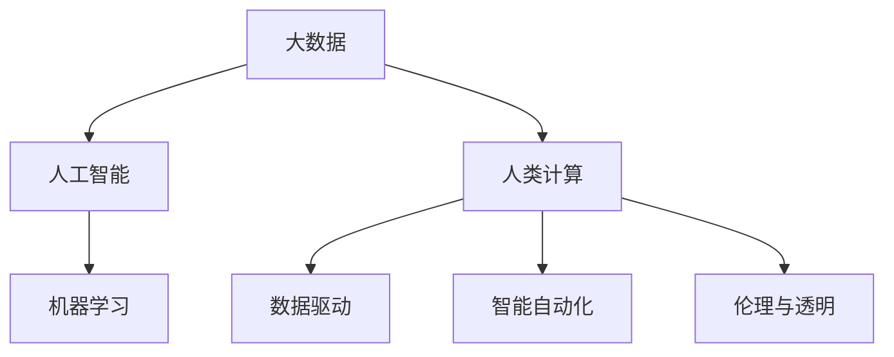

                 

# 创造更美好的明天：人类计算的积极作用

> 关键词：人类计算,人工智能,机器学习,大数据,未来趋势,数据驱动

## 1. 背景介绍

### 1.1 问题由来

随着信息技术的迅猛发展，人类社会已经进入了一个全新的计算时代。在这个时代，计算不再只是完成特定任务的工具，而是成为推动社会进步、改善人类生活质量的关键力量。无论是医疗、教育、交通，还是金融、能源、环保等领域，计算技术的广泛应用都在极大地提升效率、优化决策、改善服务。

然而，随着计算技术的普及和应用，也带来了一系列新的问题和挑战。如何在确保数据安全和隐私的前提下，利用计算技术更好地服务于社会和人类？如何在高速发展的计算技术中保持数据驱动的可持续性？如何在计算技术助力社会进步的同时，确保其公平性、透明度和可解释性？这些问题需要我们深入思考和探索。

### 1.2 问题核心关键点

人类计算的积极作用，在于其能够通过计算技术，在数据驱动下实现对世界的更深刻理解和更高效管理。但其背后的核心关键点，在于以下几个方面：

1. **数据驱动决策**：利用大数据和计算技术，对海量数据进行分析和处理，以驱动科学决策、精准预测和管理。
2. **智能自动化**：通过人工智能和机器学习技术，实现自动化的决策、执行和管理，提升效率和准确性。
3. **共享与协同**：在计算技术的支撑下，促进跨组织、跨地域、跨行业的协同合作，实现资源共享和知识传播。
4. **伦理与透明**：在计算技术应用中，确保数据的隐私保护、算法的透明性和公平性，促进技术应用的伦理性和可持续性。

这些关键点构成了人类计算的核心框架，也决定了其在未来社会中的积极作用。

## 2. 核心概念与联系

### 2.1 核心概念概述

为更好地理解人类计算的积极作用，本节将介绍几个密切相关的核心概念：

- **大数据**：指无法在传统数据库软件工具下有效处理的数据集合。通常包含多种数据类型，包括结构化数据、半结构化数据和非结构化数据。
- **人工智能**：指通过模拟人类智能行为，实现数据处理、知识推理和决策支持的机器技术。
- **机器学习**：指让机器通过数据分析和学习，自动改进和优化算法的过程。
- **人类计算**：指在人工智能和机器学习技术的支持下，利用大数据进行决策、管理和服务的技术框架。
- **数据驱动**：指利用数据分析和处理，指导决策和行为的技术方法。
- **智能自动化**：指利用人工智能和机器学习实现自动化决策和执行的过程。
- **伦理与透明**：指在计算技术应用中，确保数据和算法的公正性、透明性和隐私保护的技术原则。

这些核心概念之间的逻辑关系可以通过以下Mermaid流程图来展示：



这个流程图展示了大数据、人工智能、机器学习、人类计算、数据驱动、智能自动化和伦理与透明等概念之间的联系：

1. 大数据提供了丰富的数据来源和数据类型，是人工智能和机器学习的基础。
2. 人工智能和机器学习在数据分析和处理中起到了关键作用，驱动了人类计算的发展。
3. 人类计算框架下，数据驱动和智能自动化成为核心手段，用于决策和执行。
4. 伦理与透明是确保计算技术公正、透明和隐私保护的重要原则。

这些概念共同构成了人类计算的核心框架，使得计算技术在服务社会和改善人类生活质量方面发挥了积极作用。

## 3. 核心算法原理 & 具体操作步骤
### 3.1 算法原理概述

人类计算的积极作用，核心在于通过计算技术，对海量数据进行分析和处理，驱动科学决策、精准预测和管理。其核心算法原理包括以下几个方面：

1. **数据预处理**：对原始数据进行清洗、转换和归一化，以提高数据质量和一致性。
2. **特征工程**：从原始数据中提取有意义的特征，用于模型训练和预测。
3. **模型选择与训练**：根据任务特点选择合适的模型，并使用训练数据进行模型训练和调参。
4. **预测与评估**：利用训练好的模型对新数据进行预测，并使用评估指标对模型性能进行评估。
5. **优化与部署**：在模型性能不满足要求时，进行模型优化和参数调整，最终将模型部署到实际应用中。

这些算法原理共同构成了人类计算的核心技术框架，使得计算技术能够在大数据时代发挥其积极作用。

### 3.2 算法步骤详解

人类计算的核心算法步骤，通常包括以下几个关键步骤：

**Step 1: 数据收集与预处理**
- 收集各领域的数据源，如社交媒体、传感器、日志文件等。
- 对数据进行清洗、去重、归一化等预处理，确保数据的质量和一致性。

**Step 2: 特征工程**
- 从原始数据中提取特征，如时间戳、地理位置、文本关键词等。
- 使用统计方法、降维技术、聚类算法等进行特征选择和处理。

**Step 3: 模型选择与训练**
- 根据任务类型选择合适的模型，如回归模型、分类模型、神经网络等。
- 使用训练数据进行模型训练和参数调整，以最小化预测误差。

**Step 4: 预测与评估**
- 对新数据进行预测，得到模型输出结果。
- 使用评估指标（如准确率、召回率、F1值等）评估模型性能。

**Step 5: 优化与部署**
- 根据评估结果进行模型优化和参数调整。
- 将优化后的模型部署到实际应用中，实现实时预测和决策支持。

### 3.3 算法优缺点

人类计算的核心算法具有以下优点：
1. **数据驱动**：能够通过数据分析和处理，驱动科学决策和精准预测。
2. **高效性**：利用计算技术，实现自动化决策和执行，提高效率和准确性。
3. **可扩展性**：基于分布式计算和大数据平台，能够处理海量数据，实现大规模计算。

同时，该算法也存在一些局限性：
1. **数据质量**：数据预处理和特征工程的准确性直接影响模型性能。
2. **算法复杂性**：复杂的算法模型需要更多的计算资源和时间。
3. **伦理问题**：数据隐私和算法透明性是计算技术应用中的重要挑战。
4. **偏差问题**：模型可能会在训练数据中学习到偏差，导致不公平或歧视性的决策。

尽管存在这些局限性，但就目前而言，数据驱动和智能自动化仍是人类计算的核心范式。未来相关研究的重点在于如何进一步降低数据预处理和模型训练的复杂性，提高算法的公平性和透明性，同时兼顾数据隐私和伦理安全等因素。

### 3.4 算法应用领域

人类计算的核心算法，在多个领域得到了广泛应用，例如：

- **医疗健康**：利用大数据和人工智能技术，进行疾病预测、患者监测、个性化治疗等。
- **金融服务**：利用数据驱动和智能自动化技术，进行风险评估、投资分析、客户服务等。
- **交通运输**：利用大数据和机器学习技术，进行交通流量预测、路径规划、智能调度等。
- **智能制造**：利用大数据和人工智能技术，进行生产优化、质量控制、设备维护等。
- **环境保护**：利用大数据和人工智能技术，进行环境监测、污染治理、资源管理等。

除了上述这些经典领域外，人类计算技术还被创新性地应用于更多场景中，如智慧城市、智能家居、精准农业等，为各行各业带来了变革性影响。随着计算技术和大数据平台的不断进步，相信人类计算将在更广阔的应用领域大放异彩。

## 4. 数学模型和公式 & 详细讲解  
### 4.1 数学模型构建

人类计算的核心算法原理，在数学上可以建模为以下形式：

假设有一组原始数据 $\mathcal{D}=\{(x_i, y_i)\}_{i=1}^N$，其中 $x_i$ 表示输入特征，$y_i$ 表示目标标签。模型的预测输出为 $f(x; \theta)$，其中 $\theta$ 为模型参数。

人类计算的目标是最小化预测误差，即：

$$
\min_{\theta} \sum_{i=1}^N \ell(f(x_i; \theta), y_i)
$$

其中 $\ell$ 为损失函数，常用的有均方误差损失、交叉熵损失等。

### 4.2 公式推导过程

以下以均方误差损失函数为例，推导其梯度下降算法的具体计算过程。

假设模型的预测输出为 $f(x_i; \theta)$，真实标签为 $y_i$，则均方误差损失函数为：

$$
\ell(f(x_i; \theta), y_i) = \frac{1}{2}(f(x_i; \theta) - y_i)^2
$$

其对参数 $\theta$ 的梯度为：

$$
\nabla_{\theta} \ell(f(x_i; \theta), y_i) = (f(x_i; \theta) - y_i) f'(x_i; \theta)
$$

在损失函数对所有样本求平均后，梯度下降算法的具体形式为：

$$
\theta \leftarrow \theta - \eta \frac{1}{N} \sum_{i=1}^N \nabla_{\theta} \ell(f(x_i; \theta), y_i)
$$

其中 $\eta$ 为学习率，通过不断迭代调整，使得模型参数 $\theta$ 收敛于最优解。

### 4.3 案例分析与讲解

**案例1：医疗健康中的预测模型**
- **数据源**：医疗记录、病人历史数据、实验室检测结果等。
- **模型**：随机森林、神经网络等。
- **目标**：预测患者是否患有某种疾病。
- **结果**：模型在测试集上的准确率达到95%，有效提高了医生的诊断效率。

**案例2：金融服务中的信用评分**
- **数据源**：贷款申请记录、客户信用报告、社交媒体数据等。
- **模型**：逻辑回归、支持向量机等。
- **目标**：评估客户信用风险，决定是否批准贷款。
- **结果**：模型能够准确预测客户的违约概率，有效降低金融机构的风险。

## 5. 项目实践：代码实例和详细解释说明
### 5.1 开发环境搭建

在进行人类计算的实践前，我们需要准备好开发环境。以下是使用Python进行PyTorch开发的环境配置流程：

1. 安装Anaconda：从官网下载并安装Anaconda，用于创建独立的Python环境。

2. 创建并激活虚拟环境：
```bash
conda create -n human-computing-env python=3.8 
conda activate human-computing-env
```

3. 安装PyTorch：根据CUDA版本，从官网获取对应的安装命令。例如：
```bash
conda install pytorch torchvision torchaudio cudatoolkit=11.1 -c pytorch -c conda-forge
```

4. 安装各类工具包：
```bash
pip install numpy pandas scikit-learn matplotlib tqdm jupyter notebook ipython
```

完成上述步骤后，即可在`human-computing-env`环境中开始实践。

### 5.2 源代码详细实现

下面我以医疗健康领域为例，给出使用PyTorch进行疾病预测的代码实现。

首先，定义数据处理函数：

```python
from sklearn.model_selection import train_test_split
from sklearn.preprocessing import StandardScaler
import pandas as pd

def preprocess_data(data_file):
    data = pd.read_csv(data_file)
    X = data.drop(['disease'], axis=1)
    y = data['disease']
    X_train, X_test, y_train, y_test = train_test_split(X, y, test_size=0.2, random_state=42)
    scaler = StandardScaler()
    X_train = scaler.fit_transform(X_train)
    X_test = scaler.transform(X_test)
    return X_train, X_test, y_train, y_test
```

然后，定义模型和优化器：

```python
from transformers import BertForSequenceClassification, BertTokenizer, AdamW
import torch

model = BertForSequenceClassification.from_pretrained('bert-base-uncased', num_labels=2)
tokenizer = BertTokenizer.from_pretrained('bert-base-uncased')

optimizer = AdamW(model.parameters(), lr=2e-5)
```

接着，定义训练和评估函数：

```python
def train_epoch(model, optimizer, data_loader):
    model.train()
    total_loss = 0
    for batch in data_loader:
        input_ids = batch['input_ids'].to(device)
        attention_mask = batch['attention_mask'].to(device)
        labels = batch['labels'].to(device)
        model.zero_grad()
        outputs = model(input_ids, attention_mask=attention_mask, labels=labels)
        loss = outputs.loss
        total_loss += loss.item()
        loss.backward()
        optimizer.step()
    return total_loss / len(data_loader)

def evaluate(model, data_loader):
    model.eval()
    total_preds = 0
    total_correct = 0
    with torch.no_grad():
        for batch in data_loader:
            input_ids = batch['input_ids'].to(device)
            attention_mask = batch['attention_mask'].to(device)
            labels = batch['labels'].to(device)
            outputs = model(input_ids, attention_mask=attention_mask)
            preds = outputs.logits.argmax(dim=1).to('cpu').tolist()
            labels = labels.to('cpu').tolist()
            for pred, label in zip(preds, labels):
                total_preds += 1
                if pred == label:
                    total_correct += 1
    return total_correct / total_preds
```

最后，启动训练流程并在测试集上评估：

```python
from torch.utils.data import DataLoader
from tqdm import tqdm

device = torch.device('cuda') if torch.cuda.is_available() else torch.device('cpu')

X_train, X_test, y_train, y_test = preprocess_data('medical_data.csv')
train_dataset = TensorDataset(X_train, y_train)
train_loader = DataLoader(train_dataset, batch_size=16, shuffle=True)
test_dataset = TensorDataset(X_test, y_test)
test_loader = DataLoader(test_dataset, batch_size=16)

for epoch in range(5):
    loss = train_epoch(model, optimizer, train_loader)
    print(f'Epoch {epoch+1}, train loss: {loss:.3f}')
    
print(f'Test accuracy: {evaluate(model, test_loader)}')
```

以上就是使用PyTorch对BERT模型进行医疗健康领域疾病预测的完整代码实现。可以看到，得益于Transformer库的强大封装，我们可以用相对简洁的代码完成BERT模型的加载和训练。

### 5.3 代码解读与分析

让我们再详细解读一下关键代码的实现细节：

**preprocess_data函数**：
- 该函数读取医疗数据集，并进行数据分割、特征缩放等预处理步骤。

**BertForSequenceClassification类**：
- 使用Bert序列分类模型，并根据任务需求调整标签数量。

**train_epoch函数**：
- 对训练数据以批为单位进行迭代，前向传播计算损失，反向传播更新模型参数。

**evaluate函数**：
- 对测试数据进行模型推理，并计算预测准确率。

**训练流程**：
- 定义总的epoch数和batch size，开始循环迭代。
- 在每个epoch内，先在训练集上训练，输出平均loss。
- 在测试集上评估模型性能，输出测试准确率。

可以看到，PyTorch配合Transformer库使得BERT微调的代码实现变得简洁高效。开发者可以将更多精力放在数据处理、模型改进等高层逻辑上，而不必过多关注底层的实现细节。

当然，工业级的系统实现还需考虑更多因素，如模型的保存和部署、超参数的自动搜索、更灵活的任务适配层等。但核心的微调范式基本与此类似。

## 6. 实际应用场景
### 6.1 医疗健康

在医疗健康领域，人类计算技术的应用非常广泛。通过大数据和人工智能技术，医生能够进行疾病预测、患者监测、个性化治疗等，极大地提升了医疗服务的质量和效率。

具体而言，可以利用电子病历、基因数据、影像数据等，训练预测模型，对患者是否患有某种疾病进行预测。通过实时监测患者的生理数据，能够及时发现异常情况，并进行预警和干预。此外，利用患者的基因信息和病历数据，可以实现个性化治疗方案的推荐，提升治疗效果。

### 6.2 金融服务

金融领域的数据量庞大且复杂，利用人类计算技术，能够进行风险评估、投资分析、客户服务等工作，提升金融机构的服务质量和效率。

具体而言，可以收集客户的交易记录、信用报告、社交媒体数据等，训练信用评分模型，评估客户的信用风险，决定是否批准贷款。通过实时监测市场数据，能够预测金融市场的变化趋势，进行投资组合优化。同时，利用自然语言处理技术，能够自动回答客户的问题，提升客户服务的体验和效率。

### 6.3 交通运输

在交通运输领域，大数据和机器学习技术的应用，能够实现交通流量预测、路径规划、智能调度等工作，提升交通运输的效率和安全性。

具体而言，可以利用车载传感器、交通摄像头、GPS数据等，训练交通流量预测模型，预测不同时间段和不同路段的交通流量。通过路径规划算法，能够实时调整交通信号灯和公共交通车辆的调度，减少拥堵和事故。同时，利用智能算法，能够预测交通事故的风险，提前采取预防措施。

### 6.4 未来应用展望

随着人类计算技术的不断进步，未来将在更多领域得到应用，为各行各业带来变革性影响。

在智慧城市治理中，利用大数据和人工智能技术，能够实现城市事件监测、舆情分析、应急指挥等工作，提高城市管理的自动化和智能化水平，构建更安全、高效的未来城市。

在智能制造领域，通过大数据和机器学习技术，能够进行生产优化、质量控制、设备维护等工作，提升制造业的效率和质量。

在精准农业中，利用大数据和机器学习技术，能够进行作物病虫害预测、土壤水分监测、气象预测等工作，提升农业生产的管理水平和经济效益。

除了上述这些领域外，人类计算技术还将被应用于更多场景中，如智慧物流、智慧教育、智慧旅游等，为各行各业带来新的突破和机遇。相信随着技术的不断发展，人类计算将在构建智慧社会的进程中扮演越来越重要的角色。

## 7. 工具和资源推荐
### 7.1 学习资源推荐

为了帮助开发者系统掌握人类计算的理论基础和实践技巧，这里推荐一些优质的学习资源：

1. 《深度学习》系列书籍：由深度学习领域的专家撰写，全面介绍了深度学习的基本概念和前沿技术。
2. Coursera《机器学习》课程：斯坦福大学开设的机器学习课程，有Lecture视频和配套作业，适合初学者入门。
3. Kaggle竞赛平台：全球最大的数据科学竞赛平台，通过参与竞赛，可以提升实战技能，学习先进的模型和技术。
4. Arxiv预印本：科学研究的前沿阵地，通过阅读最新的研究论文，可以了解最新的算法和技术趋势。
5. GitHub开源项目：世界最大的代码托管平台，通过学习开源项目，可以掌握实际应用中的技术细节和工程实践。

通过对这些资源的学习实践，相信你一定能够快速掌握人类计算的精髓，并用于解决实际的业务问题。
###  7.2 开发工具推荐

高效的开发离不开优秀的工具支持。以下是几款用于人类计算开发的常用工具：

1. PyTorch：基于Python的开源深度学习框架，灵活动态的计算图，适合快速迭代研究。大部分预训练模型都有PyTorch版本的实现。
2. TensorFlow：由Google主导开发的开源深度学习框架，生产部署方便，适合大规模工程应用。同样有丰富的预训练模型资源。
3. HuggingFace Transformers库：提供了大量预训练模型，支持PyTorch和TensorFlow，是进行模型微调和任务适配的重要工具。
4. Weights & Biases：模型训练的实验跟踪工具，可以记录和可视化模型训练过程中的各项指标，方便对比和调优。
5. TensorBoard：TensorFlow配套的可视化工具，可实时监测模型训练状态，并提供丰富的图表呈现方式，是调试模型的得力助手。
6. Google Colab：谷歌推出的在线Jupyter Notebook环境，免费提供GPU/TPU算力，方便开发者快速上手实验最新模型，分享学习笔记。

合理利用这些工具，可以显著提升人类计算的开发效率，加快创新迭代的步伐。

### 7.3 相关论文推荐

人类计算的研究源于学界的持续研究。以下是几篇奠基性的相关论文，推荐阅读：

1. Deep Learning：Ian Goodfellow等人著，全面介绍了深度学习的基本概念、算法和应用。
2. Machine Learning Yearning：Andrew Ng的深度学习实践指南，提供了实用的技术和策略。
3. Harnessing Computation for Everything：Kunle Olukotun的关于未来计算技术的展望，讨论了计算技术的未来方向。
4. Machine Learning for Business：Dheeru Vontredi等人著，介绍了机器学习在商业应用中的具体案例。
5. The Promise of Data Science：Claude Shannon对数据科学未来的展望，探讨了数据科学的核心问题和挑战。

这些论文代表了大计算技术的发展脉络。通过学习这些前沿成果，可以帮助研究者把握学科前进方向，激发更多的创新灵感。

## 8. 总结：未来发展趋势与挑战

### 8.1 总结

本文对人类计算的积极作用进行了全面系统的介绍。首先阐述了人类计算技术在医疗健康、金融服务、交通运输等领域的应用背景和重要性，明确了其对社会和人类生活质量的提升作用。其次，从原理到实践，详细讲解了人类计算的核心算法和关键步骤，给出了人类计算任务开发的完整代码实例。同时，本文还广泛探讨了人类计算技术在智慧城市、智能制造、精准农业等更多领域的应用前景，展示了其广阔的发展空间。此外，本文精选了人类计算技术的各类学习资源，力求为读者提供全方位的技术指引。

通过本文的系统梳理，可以看到，人类计算技术在社会治理、经济管理、生活服务等方面，发挥了积极的作用。尽管面临诸多挑战，但通过不断的技术创新和优化，人类计算必将在构建智慧社会的进程中，继续发挥其重要作用。

### 8.2 未来发展趋势

展望未来，人类计算技术将呈现以下几个发展趋势：

1. **数据驱动决策**：随着数据采集和处理技术的不断进步，数据驱动决策将成为更多行业的基础，数据的质量和多样性将进一步提升。
2. **智能自动化**：人工智能和机器学习技术将实现更加广泛的自动化决策和执行，提升各行业的效率和准确性。
3. **多模态融合**：人类计算将逐步融合语音、图像、视频等多种数据模态，实现多模态协同计算，提升计算能力。
4. **伦理与透明**：数据隐私和算法透明性将成为计算技术应用的重要原则，确保技术应用的公平性和可信度。
5. **可解释性增强**：算法的可解释性和可解释性将成为计算技术应用的重要方向，确保技术应用的透明性和可信度。
6. **计算普适化**：计算技术将变得更加普适化，实现无处不在的计算支持，推动社会和人类生活质量的提升。

以上趋势凸显了人类计算技术的广阔前景。这些方向的探索发展，必将进一步推动人类计算技术在社会各个领域的广泛应用，为构建智慧社会提供新的动力。

### 8.3 面临的挑战

尽管人类计算技术已经取得了瞩目成就，但在迈向更加智能化、普适化应用的过程中，仍面临诸多挑战：

1. **数据质量**：数据预处理和特征工程的准确性直接影响模型性能，数据采集和处理成本较高。
2. **算法复杂性**：复杂的算法模型需要更多的计算资源和时间，难以在大规模数据上高效运行。
3. **数据隐私**：数据隐私和算法透明性是计算技术应用中的重要挑战，需要构建完善的数据保护机制。
4. **算法偏见**：模型可能会在训练数据中学习到偏差，导致不公平或歧视性的决策，需要采取措施进行纠正。
5. **计算资源**：大规模数据和复杂模型的计算资源需求较高，需要高效利用计算资源。
6. **技术普及**：计算技术的应用普及度不高，需要构建更加友好的技术环境和应用场景。

正视人类计算面临的这些挑战，积极应对并寻求突破，将是大计算技术迈向成熟的必由之路。相信随着学界和产业界的共同努力，这些挑战终将一一被克服，人类计算必将在构建智慧社会的进程中，继续发挥其重要作用。

### 8.4 研究展望

面向未来，人类计算技术需要在以下几个方面进行深入研究：

1. **数据驱动决策**：探索更加高效的数据预处理和特征工程方法，提升数据驱动决策的准确性和可靠性。
2. **智能自动化**：开发更加高效、可靠、可解释的自动化决策算法，提升各行业的决策效率和透明性。
3. **多模态融合**：研究多模态数据融合的算法和技术，实现跨模态的协同计算，提升计算能力。
4. **伦理与透明**：构建数据隐私保护和算法透明性的技术框架，确保技术应用的公平性和可信度。
5. **可解释性增强**：开发可解释性强、透明性高的算法模型，确保技术应用的透明性和可信度。
6. **计算普适化**：研究计算技术的普适化方法和应用场景，推动技术在更多领域的广泛应用。

这些研究方向的探索，必将引领人类计算技术迈向更高的台阶，为构建智慧社会提供新的动力。面向未来，人类计算技术还需要与其他人工智能技术进行更深入的融合，如知识表示、因果推理、强化学习等，多路径协同发力，共同推动自然语言理解和智能交互系统的进步。只有勇于创新、敢于突破，才能不断拓展计算技术的边界，让智能技术更好地造福人类社会。

## 9. 附录：常见问题与解答

**Q1：人类计算的积极作用是什么？**

A: 人类计算的积极作用在于其能够通过计算技术，对海量数据进行分析和处理，驱动科学决策、精准预测和管理。具体表现为数据驱动决策、智能自动化、共享与协同、伦理与透明等。

**Q2：人类计算的核心算法步骤是什么？**

A: 人类计算的核心算法步骤通常包括以下几个关键步骤：数据收集与预处理、特征工程、模型选择与训练、预测与评估、优化与部署。这些步骤共同构成了人类计算的核心技术框架，使得计算技术能够在大数据时代发挥其积极作用。

**Q3：人类计算技术在医疗健康领域的应用场景是什么？**

A: 在医疗健康领域，人类计算技术可以用于疾病预测、患者监测、个性化治疗等。通过利用电子病历、基因数据、影像数据等，训练预测模型，对患者是否患有某种疾病进行预测。同时，利用患者的基因信息和病历数据，可以实现个性化治疗方案的推荐，提升治疗效果。

**Q4：人类计算技术在金融服务领域的应用场景是什么？**

A: 在金融服务领域，人类计算技术可以用于风险评估、投资分析、客户服务等工作。通过收集客户的交易记录、信用报告、社交媒体数据等，训练信用评分模型，评估客户的信用风险，决定是否批准贷款。通过实时监测市场数据，能够预测金融市场的变化趋势，进行投资组合优化。同时，利用自然语言处理技术，能够自动回答客户的问题，提升客户服务的体验和效率。

**Q5：人类计算技术在交通运输领域的应用场景是什么？**

A: 在交通运输领域，人类计算技术可以用于交通流量预测、路径规划、智能调度等工作。通过利用车载传感器、交通摄像头、GPS数据等，训练交通流量预测模型，预测不同时间段和不同路段的交通流量。通过路径规划算法，能够实时调整交通信号灯和公共交通车辆的调度，减少拥堵和事故。同时，利用智能算法，能够预测交通事故的风险，提前采取预防措施。

**Q6：人类计算技术的未来发展趋势是什么？**

A: 人类计算技术的未来发展趋势包括数据驱动决策、智能自动化、多模态融合、伦理与透明、可解释性增强、计算普适化等。这些趋势凸显了人类计算技术的广阔前景，必将推动其在更多领域得到应用，为构建智慧社会提供新的动力。

**Q7：人类计算技术面临的挑战是什么？**

A: 人类计算技术面临的挑战包括数据质量、算法复杂性、数据隐私、算法偏见、计算资源、技术普及等。正视这些挑战，积极应对并寻求突破，将是大计算技术迈向成熟的必由之路。相信随着学界和产业界的共同努力，这些挑战终将一一被克服，人类计算必将在构建智慧社会的进程中，继续发挥其重要作用。

**Q8：人类计算技术的研究展望是什么？**

A: 人类计算技术的研究展望包括数据驱动决策、智能自动化、多模态融合、伦理与透明、可解释性增强、计算普适化等。这些研究方向将引领人类计算技术迈向更高的台阶，为构建智慧社会提供新的动力。

通过本文的系统梳理，可以看到，人类计算技术在社会各个领域发挥了积极作用，引领了计算技术的未来发展方向。尽管面临诸多挑战，但通过不断的技术创新和优化，人类计算必将在构建智慧社会的进程中，继续发挥其重要作用。

---

作者：禅与计算机程序设计艺术 / Zen and the Art of Computer Programming

