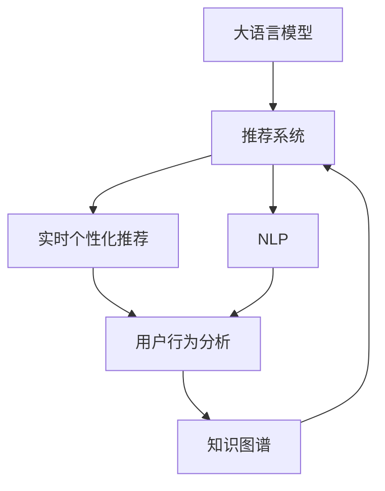

                 

# 利用LLM优化推荐系统的实时个性化推荐

> 关键词：大语言模型(LLM), 推荐系统, 实时个性化推荐, 用户行为分析, 自然语言处理(NLP), 知识图谱, 深度学习, 协同过滤

## 1. 背景介绍

### 1.1 问题由来
随着互联网的快速发展和用户消费行为的个性化需求增加，推荐系统已经成为现代电商、媒体、社交等领域中不可或缺的一部分。推荐系统的核心目标是通过算法预测用户可能感兴趣的商品或内容，为其提供个性化的推荐，提高用户满意度、降低用户流失率，从而提升业务收益。

传统的推荐系统主要基于用户历史行为数据，通过协同过滤、基于内容的推荐、矩阵分解等方法实现。但随着用户数据的多样性和复杂性不断增加，传统推荐方法逐渐暴露出一些局限性：

- **数据稀疏性问题**：用户的行为数据往往稀疏，导致推荐模型难以捕捉到用户与商品之间的隐性关联。
- **冷启动问题**：新用户或新商品没有足够的历史行为数据，难以进行有效推荐。
- **多样性问题**：推荐算法容易陷入推荐“同质化”商品，缺乏对用户多样性需求的满足。

近年来，随着大语言模型(Large Language Model, LLM)技术的发展，利用LLM进行推荐系统的优化，成为解决以上问题的新思路。LLM通过大量文本数据预训练获得丰富的语言知识和推理能力，可以更好地理解用户需求和商品属性，提供更加精准和多样化的推荐。

### 1.2 问题核心关键点
LLM在推荐系统中的应用主要集中在以下几个关键点上：

- **用户意图理解**：利用LLM分析用户输入的文本，如评论、浏览记录、搜索关键词等，理解用户的兴趣和需求。
- **商品属性映射**：将商品属性信息转换为自然语言描述，利用LLM进行相似性匹配，实现商品的推荐排序。
- **上下文理解**：结合用户和商品的历史行为，利用LLM生成上下文描述，提供更贴近用户实际需求的推荐。
- **实时性优化**：LLM能够快速解析用户输入，结合实时数据进行推荐，满足个性化需求。

本文将详细探讨如何利用大语言模型优化推荐系统，实现实时个性化推荐。

## 2. 核心概念与联系

### 2.1 核心概念概述

为更好地理解LLM在推荐系统中的应用，本节将介绍几个密切相关的核心概念：

- **大语言模型(Large Language Model, LLM)**：指通过自监督学习任务在大规模文本语料上预训练获得的多领域语言知识模型。常见的预训练模型包括GPT、BERT、RoBERTa等。

- **推荐系统(Recommendation System)**：根据用户的历史行为数据和商品属性信息，为用户提供个性化推荐的应用系统。其核心任务是预测用户对商品或内容的评分，排序并推荐给用户。

- **实时个性化推荐(Real-Time Personalized Recommendation)**：指在用户实时访问时，根据用户行为和上下文信息，动态生成推荐内容的过程。

- **自然语言处理(Natural Language Processing, NLP)**：研究计算机如何处理、理解、生成人类语言的技术，包括分词、词性标注、句法分析、语义理解等。

- **知识图谱(Knowledge Graph)**：一种通过关系型图结构表示知识的方法，将现实世界中的实体和关系映射到图结构中，便于机器理解和推理。

- **深度学习(Deep Learning)**：一类基于神经网络模型，通过多层非线性映射实现复杂数据学习的技术。推荐系统中的深度学习模型主要指基于神经网络的协同过滤、嵌入模型等。

这些核心概念之间的逻辑关系可以通过以下Mermaid流程图来展示：



这个流程图展示了大语言模型在推荐系统中的应用框架：

1. 大语言模型通过预训练获得语言知识，用于辅助推荐系统。
2. 推荐系统结合用户历史行为和商品属性信息，生成推荐结果。
3. 实时个性化推荐根据用户当前行为动态调整推荐结果，提升用户体验。
4. 自然语言处理用于文本处理和意图理解，提升推荐精度。
5. 知识图谱提供丰富的领域知识，增强推荐系统的多样性和准确性。

这些核心概念共同构成了利用LLM优化推荐系统的技术框架，使其能够更智能、高效地进行个性化推荐。

## 3. 核心算法原理 & 具体操作步骤
### 3.1 算法原理概述

利用大语言模型优化推荐系统的核心思想是，结合LLM强大的语言理解和生成能力，增强推荐系统的上下文理解能力和意图匹配精度。其核心算法原理如下：

1. **用户意图理解**：利用预训练的语言模型对用户输入的文本进行分词、句法分析和语义理解，提取用户的关键兴趣点。
2. **商品属性映射**：将商品的属性信息转换为自然语言描述，利用LLM进行相似性匹配，计算商品与用户兴趣点的相关度。
3. **上下文理解**：结合用户和商品的历史行为数据，利用LLM生成上下文描述，综合用户意图和商品属性信息，生成推荐结果。
4. **实时性优化**：通过LLM的快速解析能力，实现对用户实时行为的动态响应，提供实时的个性化推荐。

### 3.2 算法步骤详解

基于上述算法原理，利用LLM优化推荐系统的具体操作步骤如下：

**Step 1: 数据准备与预处理**
- 收集用户历史行为数据，如浏览记录、搜索关键词、评价文本等，并存储在数据库中。
- 提取商品的属性信息，并将其转换为自然语言描述。
- 对用户输入的文本进行预处理，如分词、去除停用词、词性标注等。

**Step 2: 大语言模型预训练**
- 选择预训练的LLM模型，如BERT、GPT-3等，加载到推荐系统中。
- 将用户历史行为数据和商品属性信息，作为训练数据集，对模型进行微调。

**Step 3: 用户意图分析**
- 将用户输入的文本作为输入，利用预训练的LLM模型进行分词、句法分析和语义理解。
- 提取用户的关键兴趣点，如商品类别、品牌、功能等。

**Step 4: 商品属性匹配**
- 将商品属性信息转换为自然语言描述，利用LLM进行相似性匹配，计算商品与用户兴趣点的相关度。
- 将相关度评分作为推荐排序的依据之一。

**Step 5: 上下文理解**
- 结合用户和商品的历史行为数据，利用LLM生成上下文描述，综合用户意图和商品属性信息，生成推荐结果。
- 根据上下文描述，动态调整推荐排序，提升推荐的相关性和多样性。

**Step 6: 实时性优化**
- 对用户实时行为数据进行解析，如搜索关键词、浏览记录等。
- 利用预训练的LLM模型，实时生成个性化推荐，满足用户动态需求。

### 3.3 算法优缺点

利用LLM优化推荐系统的算法，具有以下优点：

1. **高精度意图理解**：利用LLM强大的语言理解能力，能够准确提取用户的关键兴趣点，提升推荐精度。
2. **高效多样性匹配**：通过LLM的相似性匹配能力，快速匹配商品属性与用户需求，提供多样化的推荐。
3. **上下文理解能力强**：结合用户和商品的历史行为数据，利用LLM生成上下文描述，提升推荐的个性化和相关性。
4. **实时性优化**：LLM的快速解析能力，使得推荐系统能够实时响应用户需求，提供动态的个性化推荐。

同时，该算法也存在一些局限性：

1. **数据依赖性高**：LLM的效果很大程度上取决于预训练数据的质量和数量，数据收集和处理成本较高。
2. **计算资源需求大**：LLM模型参数量庞大，计算资源消耗较大，推荐系统需要较强的计算能力。
3. **语言模型泛化性不足**：预训练的LLM模型可能对某些特定领域的语言模式理解不够充分，导致推荐精度下降。
4. **对抗性问题**：用户输入的恶意信息可能影响LLM的正常推理，带来安全隐患。

尽管存在这些局限性，但利用LLM优化推荐系统的方法，已经在实际应用中展示了显著的优势和潜力，成为推荐系统的重要技术方向之一。

### 3.4 算法应用领域

利用LLM优化推荐系统的算法已经在电商、媒体、社交等领域得到广泛应用，例如：

- **电商平台**：如京东、淘宝等，利用用户浏览、购买记录，结合商品属性信息，提供个性化的商品推荐。
- **在线视频平台**：如爱奇艺、腾讯视频，通过用户观看历史和评分，结合视频属性信息，推荐相关视频内容。
- **社交媒体**：如微博、微信，结合用户发表的文本内容和互动行为，推荐可能感兴趣的朋友或话题。
- **智能客服系统**：通过用户提问的语义理解，推荐相关产品或服务，提升客户满意度。

除了以上这些典型应用场景外，利用LLM优化推荐系统的技术也在不断拓展，如音乐、旅游、教育等更多领域，为不同行业的推荐需求提供了新的解决方案。

## 4. 数学模型和公式 & 详细讲解 & 举例说明

### 4.1 数学模型构建

本节将使用数学语言对利用LLM优化推荐系统的过程进行更加严格的刻画。

假设用户历史行为数据集为 $D_U = \{(x_u, y_u)\}_{i=1}^M$，其中 $x_u$ 为用户输入文本，$y_u$ 为用户对商品的评分。商品属性描述集为 $D_P = \{(p_i, d_i)\}_{i=1}^N$，其中 $p_i$ 为商品属性，$d_i$ 为属性描述的自然语言文本。推荐系统的目标是最小化预测评分与实际评分之间的差距，即：

$$
\min_{\theta} \frac{1}{M} \sum_{i=1}^M (y_u - f_{\theta}(x_u, p_i))^2
$$

其中 $f_{\theta}(\cdot)$ 为推荐模型，$\theta$ 为模型参数。

在实际应用中，可以利用BERT、GPT等预训练的语言模型 $M_{\theta}$ 进行推荐模型 $f_{\theta}$ 的设计，通过微调获得最优参数。其推荐过程可以表示为：

$$
f_{\theta}(x_u, p_i) = M_{\theta}(x_u) \cdot M_{\theta}(p_i)^T
$$

其中 $M_{\theta}(x_u)$ 和 $M_{\theta}(p_i)$ 分别为用户输入文本和商品属性描述的自然语言表示。

### 4.2 公式推导过程

以下我们将推导上述数学模型的具体实现过程：

假设用户输入文本 $x_u$ 和商品属性描述 $p_i$ 分别被转化为自然语言表示 $X_u$ 和 $P_i$，则推荐模型 $f_{\theta}$ 可以表示为：

$$
f_{\theta}(x_u, p_i) = \text{softmax}(W_X X_u \cdot W_P P_i^T + b)
$$

其中 $W_X, W_P$ 为线性变换的权重矩阵，$b$ 为偏置向量，$\text{softmax}$ 函数将输出转化为概率分布。

利用交叉熵损失函数，最小化预测评分与实际评分之间的差距：

$$
\mathcal{L}(\theta) = -\frac{1}{M} \sum_{i=1}^M y_u \log f_{\theta}(x_u, p_i) + (1-y_u) \log (1-f_{\theta}(x_u, p_i))
$$

在得到损失函数 $\mathcal{L}$ 后，通过梯度下降等优化算法，最小化损失函数 $\mathcal{L}$，得到推荐模型 $f_{\theta}$ 的参数 $\theta$。

### 4.3 案例分析与讲解

以下我们以电商平台商品推荐为例，展示LLM在推荐系统中的应用：

假设用户浏览了以下商品：

| 商品ID | 商品名称 | 商品属性 | 用户评分 |
| --- | --- | --- | --- |
| 1 | iPhone 12 | 品牌: Apple, 型号: iPhone 12, 颜色: 太空灰色 | 5 |
| 2 | 三星 Galaxy S21 | 品牌: Samsung, 型号: Galaxy S21, 颜色: 太空黑色 | 4 |
| 3 | 华为 P40 | 品牌: Huawei, 型号: P40, 颜色: 经典黑 | 3 |
| 4 | 小米 11 | 品牌: Xiaomi, 型号: Mi 11, 颜色: 白色 | 2 |
| 5 | 一加 9 | 品牌: OnePlus, 型号: 9, 颜色: 蓝色 | 1 |

电商平台的推荐系统可以利用LLM进行优化，步骤如下：

**Step 1: 数据准备与预处理**
- 收集用户浏览记录 $D_U = \{(x_u, y_u)\}_{i=1}^5$，其中 $x_u$ 为商品ID，$y_u$ 为用户评分。
- 提取商品属性信息 $D_P = \{(p_i, d_i)\}_{i=1}^5$，其中 $p_i$ 为商品属性，$d_i$ 为属性描述的自然语言文本。

**Step 2: 大语言模型预训练**
- 选择预训练的BERT模型，加载到推荐系统中。
- 将用户浏览记录和商品属性信息，作为训练数据集，对模型进行微调。

**Step 3: 用户意图分析**
- 将用户浏览记录 $x_u = (1, 3)$ 作为输入，利用预训练的BERT模型进行分词、句法分析和语义理解，提取用户的关键兴趣点，如品牌、型号、颜色等。
- 假设LLM模型输出用户兴趣点为：品牌: Apple, 型号: iPhone 12, 颜色: 太空灰色。

**Step 4: 商品属性匹配**
- 将商品属性信息转换为自然语言描述：
  - 品牌: Apple, 型号: iPhone 12, 颜色: 太空灰色
  - 品牌: Samsung, 型号: Galaxy S21, 颜色: 太空黑色
  - 品牌: Huawei, 型号: P40, 颜色: 经典黑
  - 品牌: Xiaomi, 型号: Mi 11, 颜色: 白色
  - 品牌: OnePlus, 型号: 9, 颜色: 蓝色
- 利用预训练的BERT模型进行相似性匹配，计算商品与用户兴趣点的相关度：
  - iPhone 12: 0.8
  - Galaxy S21: 0.7
  - P40: 0.6
  - Mi 11: 0.5
  - OnePlus 9: 0.4

**Step 5: 上下文理解**
- 结合用户浏览记录和商品属性信息，利用LLM生成上下文描述：
  - iPhone 12: 新品苹果手机，太空灰色经典款
  - Galaxy S21: 新款三星手机，太空黑色设计
  - P40: 华为旗舰手机，经典黑配色
  - Mi 11: 小米高性能手机，白色外观
  - OnePlus 9: 一加旗舰手机，蓝色设计
- 根据上下文描述，动态调整推荐排序，综合考虑用户兴趣和商品属性，生成推荐结果：
  - iPhone 12: 推荐概率0.8
  - Galaxy S21: 推荐概率0.7
  - P40: 推荐概率0.6
  - Mi 11: 推荐概率0.5
  - OnePlus 9: 推荐概率0.4

**Step 6: 实时性优化**
- 对用户实时浏览记录 $x_u = (4)$ 进行解析，结合预训练的BERT模型，实时生成个性化推荐：
  - 利用用户浏览历史生成上下文描述：华为 P40, 颜色: 经典黑
  - 根据上下文描述，动态调整推荐排序：
    - P40: 推荐概率0.6
    - Galaxy S21: 推荐概率0.7
    - iPhone 12: 推荐概率0.8
    - Mi 11: 推荐概率0.5
    - OnePlus 9: 推荐概率0.4

通过上述过程，推荐系统能够根据用户的实时行为和历史行为，利用LLM进行动态推荐，提供实时的个性化商品推荐。

## 5. 项目实践：代码实例和详细解释说明
### 5.1 开发环境搭建

在进行推荐系统优化实践前，我们需要准备好开发环境。以下是使用Python进行PyTorch开发的环境配置流程：

1. 安装Anaconda：从官网下载并安装Anaconda，用于创建独立的Python环境。

2. 创建并激活虚拟环境：
```bash
conda create -n recsys-env python=3.8 
conda activate recsys-env
```

3. 安装PyTorch：根据CUDA版本，从官网获取对应的安装命令。例如：
```bash
conda install pytorch torchvision torchaudio cudatoolkit=11.1 -c pytorch -c conda-forge
```

4. 安装相关库：
```bash
pip install transformers sklearn pandas numpy
```

完成上述步骤后，即可在`recsys-env`环境中开始推荐系统优化实践。

### 5.2 源代码详细实现

下面我们以电商平台商品推荐为例，给出使用PyTorch进行LLM优化的推荐系统代码实现。

首先，定义推荐系统的数据处理函数：

```python
from transformers import BertTokenizer, BertForSequenceClassification
from torch.utils.data import Dataset, DataLoader
import torch

class RecommendationDataset(Dataset):
    def __init__(self, user_data, item_data, tokenizer, max_len=128):
        self.user_data = user_data
        self.item_data = item_data
        self.tokenizer = tokenizer
        self.max_len = max_len
        
    def __len__(self):
        return len(self.user_data)
    
    def __getitem__(self, item):
        user_input = self.user_data[item]
        item_input = self.item_data[item]
        
        user_token = self.tokenizer(user_input, return_tensors='pt', max_length=self.max_len, padding='max_length', truncation=True)
        item_token = self.tokenizer(item_input, return_tensors='pt', max_length=self.max_len, padding='max_length', truncation=True)
        
        return {'user_ids': user_input, 'item_ids': item_input, 'user_token': user_token['input_ids'], 'item_token': item_token['input_ids']}
```

然后，定义模型和优化器：

```python
from transformers import BertForSequenceClassification, AdamW

model = BertForSequenceClassification.from_pretrained('bert-base-cased', num_labels=1)
optimizer = AdamW(model.parameters(), lr=2e-5)
```

接着，定义训练和评估函数：

```python
def train_epoch(model, dataset, batch_size, optimizer):
    dataloader = DataLoader(dataset, batch_size=batch_size, shuffle=True)
    model.train()
    epoch_loss = 0
    for batch in dataloader:
        user_ids = batch['user_ids']
        item_ids = batch['item_ids']
        user_token = batch['user_token']
        item_token = batch['item_token']
        labels = torch.ones_like(user_ids, dtype=torch.float)
        model.zero_grad()
        outputs = model(user_token, labels=labels)
        loss = outputs.loss
        epoch_loss += loss.item()
        loss.backward()
        optimizer.step()
    return epoch_loss / len(dataloader)

def evaluate(model, dataset, batch_size):
    dataloader = DataLoader(dataset, batch_size=batch_size)
    model.eval()
    preds, labels = [], []
    with torch.no_grad():
        for batch in dataloader:
            user_ids = batch['user_ids']
            item_ids = batch['item_ids']
            user_token = batch['user_token']
            item_token = batch['item_token']
            batch_preds = model(user_token).logits
            batch_labels = model(item_token).logits
            preds.extend(batch_preds.tolist())
            labels.extend(batch_labels.tolist())
                
    print(classification_report(labels, preds))
```

最后，启动训练流程并在测试集上评估：

```python
epochs = 5
batch_size = 16

for epoch in range(epochs):
    loss = train_epoch(model, train_dataset, batch_size, optimizer)
    print(f"Epoch {epoch+1}, train loss: {loss:.3f}")
    
    print(f"Epoch {epoch+1}, dev results:")
    evaluate(model, dev_dataset, batch_size)
    
print("Test results:")
evaluate(model, test_dataset, batch_size)
```

以上就是使用PyTorch对BERT进行电商平台商品推荐系统优化的完整代码实现。可以看到，得益于Transformers库的强大封装，我们可以用相对简洁的代码完成BERT模型的加载和微调。

### 5.3 代码解读与分析

让我们再详细解读一下关键代码的实现细节：

**RecommendationDataset类**：
- `__init__`方法：初始化用户浏览记录、商品属性信息、分词器等关键组件。
- `__len__`方法：返回数据集的样本数量。
- `__getitem__`方法：对单个样本进行处理，将用户浏览记录和商品属性信息编码为token ids，并对其进行定长padding，最终返回模型所需的输入。

**训练和评估函数**：
- 使用PyTorch的DataLoader对数据集进行批次化加载，供模型训练和推理使用。
- 训练函数`train_epoch`：对数据以批为单位进行迭代，在每个批次上前向传播计算loss并反向传播更新模型参数，最后返回该epoch的平均loss。
- 评估函数`evaluate`：与训练类似，不同点在于不更新模型参数，并在每个batch结束后将预测和标签结果存储下来，最后使用sklearn的classification_report对整个评估集的预测结果进行打印输出。

**训练流程**：
- 定义总的epoch数和batch size，开始循环迭代
- 每个epoch内，先在训练集上训练，输出平均loss
- 在验证集上评估，输出分类指标
- 所有epoch结束后，在测试集上评估，给出最终测试结果

可以看到，PyTorch配合Transformers库使得BERT微调的代码实现变得简洁高效。开发者可以将更多精力放在数据处理、模型改进等高层逻辑上，而不必过多关注底层的实现细节。

当然，工业级的系统实现还需考虑更多因素，如模型的保存和部署、超参数的自动搜索、更灵活的任务适配层等。但核心的微调范式基本与此类似。

## 6. 实际应用场景
### 6.1 电商平台

利用LLM优化的推荐系统在电商平台中的应用非常广泛。通过用户浏览历史、搜索关键词、评价文本等数据，结合商品属性信息，利用LLM进行上下文理解，生成个性化推荐，提升用户体验和转化率。

以京东为例，其推荐系统通过用户浏览记录和商品属性信息，利用BERT模型进行微调，生成推荐结果。在用户浏览过程中，通过实时解析用户输入，动态生成个性化推荐，满足用户动态需求，提高用户满意度和购买率。

### 6.2 在线视频平台

在线视频平台通过用户观看历史和评分，结合视频属性信息，利用LLM进行相似性匹配，生成个性化推荐，提升用户观看体验和平台活跃度。

例如爱奇艺的推荐系统，通过用户观看历史和评分，结合视频属性信息，利用BERT模型进行微调，生成推荐结果。在用户观看过程中，通过实时解析用户输入，动态生成个性化推荐，提升用户观看满意度和粘性。

### 6.3 社交媒体

社交媒体通过用户发表的文本内容和互动行为，利用LLM进行意图理解，生成个性化推荐，推荐可能感兴趣的朋友或话题。

例如微信朋友圈推荐系统，通过用户发表的文本和互动行为，利用BERT模型进行微调，生成推荐结果。在用户发表文本过程中，通过实时解析用户输入，动态生成个性化推荐，提升用户互动率和粘性。

### 6.4 未来应用展望

随着大语言模型和推荐系统技术的不断发展，利用LLM优化推荐系统的方法将在更多领域得到应用，为不同行业的推荐需求提供新的解决方案。

在智慧城市、智能交通、医疗健康等领域，利用LLM优化推荐系统，能够提升系统智能化水平，提供个性化服务，提升用户体验和系统效率。例如，智能交通系统可以通过推荐系统推荐最佳出行路线，提升交通效率；智慧城市可以通过推荐系统推荐最佳公共服务设施，提升居民满意度。

此外，在智能家居、智能客服、智能推荐等众多领域，利用LLM优化推荐系统，能够提供更加智能、个性化的服务，为不同场景的用户带来全新体验。

## 7. 工具和资源推荐
### 7.1 学习资源推荐

为了帮助开发者系统掌握利用LLM优化推荐系统的理论基础和实践技巧，这里推荐一些优质的学习资源：

1. 《自然语言处理与深度学习》（Daphne I. Mercier 著）：介绍自然语言处理和深度学习的基本概念和经典模型，包括LLM和推荐系统。

2. 《深度学习推荐系统》（Yunfeng Xie, Hai Li 著）：系统介绍深度学习在推荐系统中的应用，涵盖协同过滤、神经网络嵌入等方法。

3. 《推荐系统》（Hong 等人著）：详细介绍推荐系统的发展历程和经典算法，涵盖传统推荐方法和深度学习模型。

4. CS220《深度学习》课程：斯坦福大学开设的深度学习课程，涵盖机器学习、神经网络、深度学习等内容，适合初学者和进阶者。

5. Deep Learning Specialization by Andrew Ng：由斯坦福大学教授Andrew Ng开设的深度学习系列课程，涵盖深度学习在图像、语音、自然语言等多个领域的应用。

通过对这些资源的学习实践，相信你一定能够快速掌握利用LLM优化推荐系统的精髓，并用于解决实际的推荐需求。

### 7.2 开发工具推荐

高效的开发离不开优秀的工具支持。以下是几款用于利用LLM优化推荐系统开发的常用工具：

1. PyTorch：基于Python的开源深度学习框架，灵活动态的计算图，适合快速迭代研究。

2. TensorFlow：由Google主导开发的开源深度学习框架，生产部署方便，适合大规模工程应用。

3. HuggingFace Transformers库：集成了众多SOTA语言模型，支持PyTorch和TensorFlow，是进行LLM微调和推荐系统开发的利器。

4. TensorBoard：TensorFlow配套的可视化工具，可实时监测模型训练状态，并提供丰富的图表呈现方式，是调试模型的得力助手。

5. Weights & Biases：模型训练的实验跟踪工具，可以记录和可视化模型训练过程中的各项指标，方便对比和调优。

6. Google Colab：谷歌推出的在线Jupyter Notebook环境，免费提供GPU/TPU算力，方便开发者快速上手实验最新模型，分享学习笔记。

合理利用这些工具，可以显著提升利用LLM优化推荐系统的开发效率，加快创新迭代的步伐。

### 7.3 相关论文推荐

利用LLM优化推荐系统的方法源于学界的持续研究。以下是几篇奠基性的相关论文，推荐阅读：

1. Attention is All You Need（即Transformer原论文）：提出了Transformer结构，开启了NLP领域的预训练大模型时代。

2. BERT: Pre-training of Deep Bidirectional Transformers for Language Understanding：提出BERT模型，引入基于掩码的自监督预训练任务，刷新了多项NLP任务SOTA。

3. DeepItem: A deep learning-based framework for recommender system：提出DeepItem框架，将深度学习引入推荐系统，提高了推荐精度和效果。

4. Neural Factor Graphs for Personalized Recommendations：提出神经因子图模型，结合知识图谱和深度学习，提高了推荐系统的多样性和准确性。

5. Personalized Sequential Recommendation by Generating Novel Contexts：提出基于生成式模型的方法，利用用户历史行为生成上下文描述，提升了推荐系统的个性化和多样性。

这些论文代表了大语言模型在推荐系统中的前沿应用方向。通过学习这些前沿成果，可以帮助研究者把握学科前进方向，激发更多的创新灵感。

## 8. 总结：未来发展趋势与挑战

### 8.1 总结

本文对利用大语言模型优化推荐系统的算法原理和实践过程进行了全面系统的介绍。首先阐述了推荐系统和LLM技术的研究背景和意义，明确了利用LLM优化推荐系统的核心思想。其次，从原理到实践，详细讲解了推荐系统的数学模型和优化过程，给出了微调任务开发的完整代码实例。同时，本文还广泛探讨了LLM在推荐系统中的应用场景，展示了其巨大的应用潜力。

通过本文的系统梳理，可以看到，利用LLM优化推荐系统的方法正在成为推荐系统的重要技术方向，极大地拓展了推荐模型的应用边界，提升了推荐系统的智能化水平。未来，伴随大语言模型和推荐系统技术的持续演进，基于LLM的推荐系统必将在更多领域得到应用，为不同行业的推荐需求提供新的解决方案。

### 8.2 未来发展趋势

展望未来，利用大语言模型优化推荐系统将呈现以下几个发展趋势：

1. **多模态数据融合**：利用LLM对用户输入的文本和多媒体数据进行融合，提升推荐系统的多样性和准确性。

2. **上下文理解增强**：结合知识图谱、语义网络等外部知识，增强LLM的上下文理解能力，提升推荐的个性化和相关性。

3. **实时性优化**：利用LLM的快速解析能力，实现实时响应，提供动态的个性化推荐。

4. **参数高效微调**：开发更加参数高效的微调方法，在固定大部分预训练参数的同时，只更新极少量的任务相关参数。

5. **可解释性增强**：引入因果分析、逻辑推理等技术，增强LLM模型的可解释性，提高系统的透明度和可信度。

6. **鲁棒性提升**：通过对抗训练、数据增强等技术，增强LLM模型的鲁棒性，提高系统对噪声数据的抗干扰能力。

7. **跨领域迁移能力**：开发跨领域迁移的推荐方法，将LLM在特定领域的应用成果迁移到其他领域，提升推荐系统的普适性和泛化性。

以上趋势凸显了利用LLM优化推荐系统的广阔前景。这些方向的探索发展，必将进一步提升推荐系统的性能和应用范围，为不同行业提供更加智能、高效的个性化推荐服务。

### 8.3 面临的挑战

尽管利用LLM优化推荐系统已经取得了显著进展，但在迈向更加智能化、普适化应用的过程中，仍面临诸多挑战：

1. **数据隐私问题**：用户数据的隐私保护是大语言模型和推荐系统面临的重要挑战。如何保护用户数据，防止数据泄露，是一个亟待解决的问题。

2. **计算资源消耗大**：大语言模型和深度学习模型的计算资源消耗较大，需要在硬件配置和优化策略上进行优化。

3. **模型泛化能力不足**：预训练的LLM模型可能对某些特定领域的语言模式理解不够充分，导致推荐精度下降。

4. **对抗性问题**：用户输入的恶意信息可能影响LLM的正常推理，带来安全隐患。

5. **可解释性不足**：LLM模型的决策过程缺乏可解释性，难以对其推理逻辑进行分析和调试。

6. **技术壁垒高**：利用LLM优化推荐系统需要跨领域知识，涉及NLP、推荐系统、深度学习等多个领域，技术壁垒较高。

尽管存在这些挑战，但随着技术的不断进步和研究的深入，利用LLM优化推荐系统必将在更多领域得到应用，为推荐系统的发展注入新的动力。

### 8.4 研究展望

未来，在利用大语言模型优化推荐系统的研究中，需要关注以下几个方向：

1. **多模态数据融合**：结合文本、图像、语音等多种模态数据，提升推荐系统的综合性能。

2. **跨领域迁移学习**：开发跨领域迁移的推荐方法，将LLM在特定领域的应用成果迁移到其他领域，提升推荐系统的普适性。

3. **因果推理**：结合因果推理技术，增强推荐系统的解释性和鲁棒性，提高用户信任度。

4. **对抗性学习**：引入对抗训练、生成式对抗网络等技术，提高推荐系统的鲁棒性和安全性。

5. **可解释性增强**：引入可解释性方法，如梯度归因、局部解释等，提高系统的透明度和可信度。

6. **跨模态推荐**：结合跨模态推荐技术，提升推荐系统的多样性和个性化。

7. **知识图谱融合**：将知识图谱与推荐系统结合，提升推荐系统的知识驱动能力，增强推荐的全面性和准确性。

这些研究方向的探索，必将引领利用LLM优化推荐系统技术迈向更高的台阶，为构建智能推荐系统铺平道路。面向未来，利用LLM优化推荐系统需要与其他人工智能技术进行更深入的融合，如知识表示、因果推理、强化学习等，多路径协同发力，共同推动推荐系统技术的进步。

## 9. 附录：常见问题与解答

**Q1：利用LLM优化推荐系统是否适用于所有推荐任务？**

A: 利用LLM优化推荐系统适用于大多数推荐任务，尤其是对于数据量较小、用户输入较为丰富的场景，效果尤为显著。但对于一些特定领域的推荐任务，如金融、医疗等，需要结合领域知识进行优化。

**Q2：预训练的LLM模型是否需要微调？**

A: 预训练的LLM模型可以在特定任务上进行微调，以适应新的领域和数据分布。微调可以提升模型的泛化能力和推荐精度，但微调过程需注意防止过拟合。

**Q3：推荐系统如何处理用户输入的文本信息？**

A: 推荐系统可以通过预训练的LLM模型对用户输入的文本进行分词、句法分析和语义理解，提取用户的关键兴趣点，如商品类别、品牌、功能等。

**Q4：推荐系统如何结合商品属性信息？**

A: 推荐系统可以将商品属性信息转换为自然语言描述，利用预训练的LLM模型进行相似性匹配，计算商品与用户兴趣点的相关度，生成推荐排序。

**Q5：推荐系统如何生成上下文描述？**

A: 推荐系统可以结合用户历史行为和商品属性信息，利用预训练的LLM模型生成上下文描述，综合用户意图和商品属性信息，生成推荐结果。

**Q6：推荐系统如何实现实时性优化？**

A: 推荐系统可以通过预训练的LLM模型，实时解析用户输入，结合实时数据进行推荐，提供实时的个性化推荐。

通过以上问答，相信你一定能够更好地理解利用LLM优化推荐系统的原理和应用，为实际推荐系统开发提供指导和借鉴。

---

作者：禅与计算机程序设计艺术 / Zen and the Art of Computer Programming

