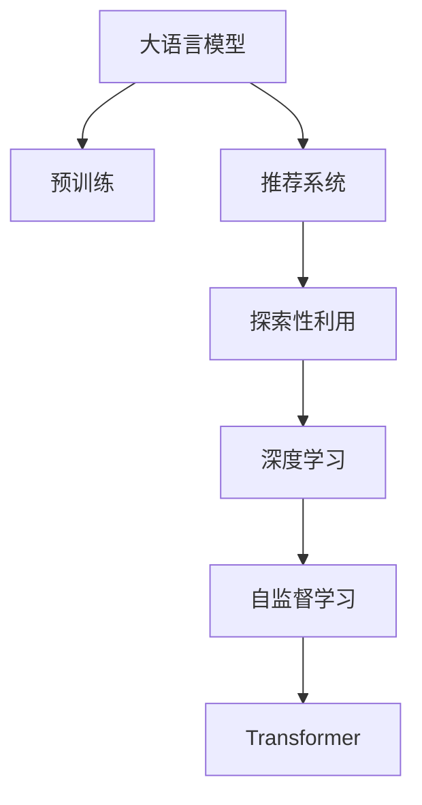

                 

# 利用LLM优化推荐系统的探索与利用平衡

> 关键词：推荐系统,大语言模型(LLM),优化算法,探索性利用,利用平衡,深度学习

## 1. 背景介绍

### 1.1 问题由来

随着信息时代的到来，推荐系统在电商、媒体、社交网络等众多领域得到了广泛应用。推荐系统通过挖掘用户行为数据，预测用户兴趣，并为用户推荐可能感兴趣的内容。然而，传统推荐系统往往只依赖用户行为历史进行推荐，难以全面理解用户深层次的需求和动态变化趋势。

为了应对这些挑战，近年来，许多研究者尝试将深度学习技术引入推荐系统，特别是基于大语言模型（Large Language Models, LLMs）的推荐系统。这些基于LLM的推荐系统通过语言模型学习用户的文本表达，挖掘用户的深层语义需求，从而提供更加个性化、动态的推荐服务。

但这种基于LLM的推荐系统也面临着挑战。一方面，LLM模型拥有强大的文本理解能力，但在推荐任务中，如何平衡模型的探索性和利用性，避免过拟合，是一个亟待解决的问题。另一方面，如何合理利用LLM中的知识，并将其高效地融入推荐模型中，也是一个值得深入探讨的话题。

本文将探讨如何利用LLM优化推荐系统，重点关注模型探索与利用的平衡问题，并提出一些具体的优化策略。

### 1.2 问题核心关键点

在基于LLM的推荐系统中，模型的探索性与利用性是一对重要的平衡因素。探索性利用平衡（Exploration vs. Exploitation），指的是模型在推荐时需要在利用已知用户偏好（利用）和探索用户未见过的内容（探索）之间进行权衡。如果过于注重探索，可能会推荐过多未见过的内容，用户可能不接受，导致系统效用下降。如果过于注重利用，则可能忽视了用户的潜在需求，推荐结果过于单一，无法满足用户的长期兴趣发展。

本研究的核心目标是通过利用LLM的丰富知识，平衡探索性和利用性，优化推荐系统性能，提升用户体验和系统效用。

## 2. 核心概念与联系

### 2.1 核心概念概述

在基于LLM的推荐系统中，核心概念包括以下几点：

- **大语言模型(Large Language Model, LLM)**：以自回归模型（如GPT）或自编码模型（如BERT）为代表的深度学习模型，通过在大规模无标签文本数据上进行预训练，学习到丰富的语言知识，具备强大的文本生成和理解能力。

- **推荐系统(Recommendation System)**：通过预测用户可能感兴趣的内容，向用户推荐个性化产品、视频、文章等，提升用户满意度。

- **探索与利用平衡(Exploration vs. Exploitation Balance)**：在推荐过程中，平衡模型对已有用户偏好的利用（利用）和探索用户未见过的内容（探索），以最大化推荐效果。

- **深度学习(Deep Learning)**：基于神经网络的机器学习技术，通过多层非线性变换，实现复杂模式的拟合。

- **自监督学习(Self-Supervised Learning)**：利用无标签数据进行模型训练，学习数据的潜在语义和结构。

- **Transformer**：一种基于注意力机制的深度学习模型，用于高效处理序列数据，是当前推荐系统中常用的结构。

这些核心概念之间的逻辑关系可以通过以下Mermaid流程图来展示：



这个流程图展示了LLM在推荐系统中的作用机制：

1. 大语言模型通过预训练学习丰富的语言知识。
2. 推荐系统利用这些知识为用户推荐个性化内容。
3. 探索与利用平衡通过调整模型参数，实现对已有和未见内容的推荐。
4. 深度学习通过多层非线性变换，进一步提升推荐效果。
5. 自监督学习利用无标签数据，增强模型的泛化能力。
6. Transformer作为深度学习架构，用于高效处理序列数据。

这些核心概念共同构成了基于LLM的推荐系统的工作框架，使得LLM能够更好地应用于推荐任务，提升系统的推荐效果和用户体验。

## 3. 核心算法原理 & 具体操作步骤
### 3.1 算法原理概述

基于LLM的推荐系统主要通过以下步骤实现探索与利用平衡：

1. **数据预处理**：收集用户行为数据（如点击、评分、浏览历史等）和文本描述数据，将其转化为模型所需的格式。

2. **模型初始化**：加载预训练的LLM模型，作为推荐系统的初始化参数。

3. **模型微调**：在用户行为数据上微调LLM模型，使其能够根据用户的历史行为预测其未来的兴趣偏好。

4. **探索与利用策略**：设计探索与利用平衡策略，调整模型参数，使得推荐系统能够在利用已有知识的同时，探索未见过的内容。

5. **评估与优化**：通过在线A/B测试等手段评估推荐效果，根据用户反馈和系统性能优化策略。

### 3.2 算法步骤详解

基于LLM的推荐系统一般包括以下关键步骤：

**Step 1: 数据准备与预处理**
- 收集用户行为数据和文本描述数据。
- 清洗数据，去除噪声和异常值。
- 数据特征提取：将用户行为数据和文本数据转化为模型可处理的格式。

**Step 2: 模型加载与微调**
- 加载预训练的LLM模型。
- 将数据集划分为训练集、验证集和测试集。
- 设计微调目标函数，优化模型参数。

**Step 3: 探索与利用策略设计**
- 设计探索与利用平衡策略，如epsilon-greedy策略、UCB策略等。
- 实现策略调整代码，用于在推荐过程中动态调整模型参数。

**Step 4: 实时推荐**
- 对每个用户输入的行为数据和文本描述，进行推理。
- 根据探索与利用策略，生成推荐列表。
- 返回推荐结果，记录用户反馈。

**Step 5: 性能评估与优化**
- 在测试集上评估推荐系统的推荐效果。
- 根据评估结果，调整模型参数和策略。
- 在实际应用中，不断优化推荐算法，提升用户体验。

### 3.3 算法优缺点

基于LLM的推荐系统具有以下优点：
1. 强大的文本理解能力：LLM能够处理复杂的文本数据，挖掘用户的深层需求。
2. 高效的探索与利用平衡：通过深度学习技术，可以在不牺牲已有知识的情况下探索新内容。
3. 灵活的推荐策略：可以根据用户反馈动态调整模型，提升推荐效果。

同时，该方法也存在一定的局限性：
1. 对数据质量要求高：推荐系统依赖于用户行为数据和文本数据的准确性和丰富度。
2. 高计算成本：大规模LLM模型的计算资源需求较高，可能导致训练和推理效率较低。
3. 模型复杂性高：多层次的深度学习网络结构可能增加模型的复杂性，需要更多的调试和优化。
4. 泛化能力有限：推荐系统的性能可能受限于特定领域的数据分布，泛化能力有限。

尽管存在这些局限性，但就目前而言，基于LLM的推荐系统仍是最前沿的研究方向，具有巨大的应用潜力。

### 3.4 算法应用领域

基于LLM的推荐系统已经应用于多个领域，如电商推荐、新闻推荐、社交网络推荐等。这些系统通过利用LLM强大的文本理解能力，为用户推荐更加个性化、多样化的内容，提升了用户体验和系统效用。

## 4. 数学模型和公式 & 详细讲解 & 举例说明

### 4.1 数学模型构建

假设我们有一个包含$m$个用户、$n$个物品的推荐系统。用户对物品的评分用$x_{ui}$表示，其中$x_{ui}=1$表示用户对物品$i$评分1分，$x_{ui}=0$表示用户对物品$i$未评分。我们希望设计一个推荐系统$y_{ui}$，使得$y_{ui}$尽可能接近$x_{ui}$。

### 4.2 公式推导过程

在基于LLM的推荐系统中，我们通常采用以下步骤进行模型构建：

1. **数据表示**：将用户行为数据$x_{ui}$和文本描述数据$x_{ti}$转化为模型所需的特征向量。

2. **模型训练**：使用深度学习模型$M$对数据进行训练，最小化损失函数$L$。

3. **推理与推荐**：对新用户输入的特征向量$x_{u^*}$，使用模型$M$生成推荐结果$y_{ui}$。

其中，损失函数$L$可以定义为：

$$
L = \frac{1}{m} \sum_{i=1}^m \sum_{j=1}^n \ell(x_{ui}, y_{ui})
$$

其中，$\ell$为损失函数，常用的有均方误差、交叉熵等。

### 4.3 案例分析与讲解

假设我们有一个小型在线商店，收集了用户对不同商品的评分数据。我们可以将评分数据和商品描述作为特征，使用BERT模型进行预训练，然后在推荐任务上进行微调。

首先，我们将评分数据和商品描述文本分别输入BERT模型，得到每个用户和物品的特征表示$u_{u}$和$i_{i}$。然后，我们使用这些特征表示进行预测，得到用户对每个物品的评分预测值$y_{ui}$。最后，我们使用交叉熵损失函数计算模型预测与实际评分之间的差距，并最小化损失函数，更新模型参数。

## 5. 项目实践：代码实例和详细解释说明
### 5.1 开发环境搭建

在进行推荐系统开发前，我们需要准备好开发环境。以下是使用Python进行PyTorch开发的环境配置流程：

1. 安装Anaconda：从官网下载并安装Anaconda，用于创建独立的Python环境。

2. 创建并激活虚拟环境：
```bash
conda create -n recommendation-env python=3.8 
conda activate recommendation-env
```

3. 安装PyTorch：根据CUDA版本，从官网获取对应的安装命令。例如：
```bash
conda install pytorch torchvision torchaudio cudatoolkit=11.1 -c pytorch -c conda-forge
```

4. 安装Transformer库：
```bash
pip install transformers
```

5. 安装各类工具包：
```bash
pip install numpy pandas scikit-learn matplotlib tqdm jupyter notebook ipython
```

完成上述步骤后，即可在`recommendation-env`环境中开始推荐系统开发。

### 5.2 源代码详细实现

下面我们以电商推荐系统为例，给出使用Transformers库对BERT模型进行微调的PyTorch代码实现。

首先，定义数据预处理函数：

```python
from transformers import BertTokenizer, BertModel

class RecommendationDataset:
    def __init__(self, user_ids, item_ids, item_descs, user_descs):
        self.user_ids = user_ids
        self.item_ids = item_ids
        self.item_descs = item_descs
        self.user_descs = user_descs
        self.tokenizer = BertTokenizer.from_pretrained('bert-base-uncased')

    def __len__(self):
        return len(self.user_ids)

    def __getitem__(self, item):
        user_id = self.user_ids[item]
        item_id = self.item_ids[item]
        item_desc = self.item_descs[item]
        user_desc = self.user_descs[item]
        
        # 对文本数据进行tokenize和编码
        user_tokens = self.tokenizer(user_desc, return_tensors='pt')
        item_tokens = self.tokenizer(item_desc, return_tensors='pt')
        
        # 对用户和物品进行特征提取
        user_ids = user_tokens['input_ids']
        item_ids = item_tokens['input_ids']
        attention_masks = user_tokens['attention_mask'] + item_tokens['attention_mask']
        
        return {'user_ids': user_ids, 'item_ids': item_ids, 'attention_masks': attention_masks}
```

然后，定义模型和优化器：

```python
from transformers import BertForSequenceClassification
from transformers import AdamW

model = BertForSequenceClassification.from_pretrained('bert-base-uncased', num_labels=1, output_attentions=False, output_hidden_states=False)
optimizer = AdamW(model.parameters(), lr=2e-5)
```

接着，定义训练和评估函数：

```python
from transformers import Trainer, TrainingArguments

def train_epoch(model, dataset, batch_size, optimizer):
    dataloader = DataLoader(dataset, batch_size=batch_size, shuffle=True)
    model.train()
    epoch_loss = 0
    for batch in dataloader:
        user_ids = batch['user_ids'].to(device)
        item_ids = batch['item_ids'].to(device)
        attention_masks = batch['attention_masks'].to(device)
        labels = torch.ones_like(user_ids)
        model.zero_grad()
        outputs = model(user_ids, item_ids=item_ids, attention_mask=attention_masks)
        loss = outputs.loss
        epoch_loss += loss.item()
        loss.backward()
        optimizer.step()
    return epoch_loss / len(dataloader)

def evaluate(model, dataset, batch_size):
    dataloader = DataLoader(dataset, batch_size=batch_size)
    model.eval()
    preds, labels = [], []
    with torch.no_grad():
        for batch in dataloader:
            user_ids = batch['user_ids'].to(device)
            item_ids = batch['item_ids'].to(device)
            attention_masks = batch['attention_masks'].to(device)
            batch_labels = torch.ones_like(user_ids)
            outputs = model(user_ids, item_ids=item_ids, attention_mask=attention_masks)
            batch_preds = outputs.logits.argmax(dim=2).to('cpu').tolist()
            batch_labels = batch_labels.to('cpu').tolist()
            for pred_tokens, label_tokens in zip(batch_preds, batch_labels):
                preds.append(pred_tokens[:len(label_tokens)])
                labels.append(label_tokens)
    print(classification_report(labels, preds))
```

最后，启动训练流程并在测试集上评估：

```python
epochs = 5
batch_size = 16

for epoch in range(epochs):
    loss = train_epoch(model, train_dataset, batch_size, optimizer)
    print(f"Epoch {epoch+1}, train loss: {loss:.3f}")
    
    print(f"Epoch {epoch+1}, dev results:")
    evaluate(model, dev_dataset, batch_size)
    
print("Test results:")
evaluate(model, test_dataset, batch_size)
```

以上就是使用PyTorch对BERT进行电商推荐任务微调的完整代码实现。可以看到，得益于Transformers库的强大封装，我们可以用相对简洁的代码完成BERT模型的加载和微调。

### 5.3 代码解读与分析

让我们再详细解读一下关键代码的实现细节：

**RecommendationDataset类**：
- `__init__`方法：初始化用户ID、物品ID、物品描述、用户描述等关键组件。
- `__len__`方法：返回数据集的样本数量。
- `__getitem__`方法：对单个样本进行处理，将用户描述和物品描述输入BERT模型，生成特征表示。

**模型和优化器**：
- 加载预训练的BERT模型，并将其微调适应推荐任务。
- 使用AdamW优化器进行模型参数更新。

**训练和评估函数**：
- 使用PyTorch的DataLoader对数据集进行批次化加载，供模型训练和推理使用。
- 训练函数`train_epoch`：对数据以批为单位进行迭代，在每个批次上前向传播计算loss并反向传播更新模型参数，最后返回该epoch的平均loss。
- 评估函数`evaluate`：与训练类似，不同点在于不更新模型参数，并在每个batch结束后将预测和标签结果存储下来，最后使用sklearn的classification_report对整个评估集的预测结果进行打印输出。

**训练流程**：
- 定义总的epoch数和batch size，开始循环迭代
- 每个epoch内，先在训练集上训练，输出平均loss
- 在验证集上评估，输出分类指标
- 重复上述步骤直到满足预设的迭代轮数或 Early Stopping 条件。

可以看到，PyTorch配合Transformers库使得BERT微调的代码实现变得简洁高效。开发者可以将更多精力放在数据处理、模型改进等高层逻辑上，而不必过多关注底层的实现细节。

当然，工业级的系统实现还需考虑更多因素，如模型的保存和部署、超参数的自动搜索、更灵活的任务适配层等。但核心的微调范式基本与此类似。

## 6. 实际应用场景
### 6.1 电商推荐系统

基于大语言模型微调的电商推荐系统，可以广泛应用于电商平台的商品推荐、广告投放等业务场景。推荐系统通过用户行为数据和商品描述，使用LLM模型学习用户需求和商品特征，为用户推荐可能感兴趣的商品，提升平台的用户粘性和转化率。

在技术实现上，可以收集用户浏览、点击、购买等行为数据，将商品描述作为输入，对预训练模型进行微调。微调后的模型能够学习用户的深层语义需求，并根据需求匹配推荐商品。对于新商品，还可以通过检索系统实时搜索相关内容，动态生成推荐结果。

### 6.2 新闻推荐系统

新闻推荐系统通过收集用户的历史阅读行为和新闻描述，使用LLM模型学习用户的兴趣偏好和新闻特征，为用户推荐可能感兴趣的新闻。推荐系统可以提高用户粘性和阅读满意度，同时增加平台的用户活跃度。

在推荐策略上，可以使用探索与利用平衡策略，对已知兴趣和新内容进行权衡。对于热门新闻，可以使用利用策略，对用户更感兴趣；对于新发布的未知新闻，可以使用探索策略，为用户发现更多新鲜内容。

### 6.3 社交媒体推荐系统

社交媒体推荐系统通过收集用户的历史互动数据和帖子描述，使用LLM模型学习用户的兴趣偏好和帖子特征，为用户推荐可能感兴趣的内容。推荐系统可以提升用户粘性和平台活跃度，同时增加内容曝光度。

在推荐策略上，可以使用探索与利用平衡策略，对已知兴趣和新内容进行权衡。对于用户常用的朋友和内容，可以使用利用策略；对于新出现的未知内容，可以使用探索策略，为用户发现更多新鲜内容。

### 6.4 未来应用展望

随着大语言模型和微调方法的不断发展，基于LLM的推荐系统将在更多领域得到应用，为传统行业带来变革性影响。

在智慧医疗领域，推荐系统可以用于推荐医生、医院和医疗知识，提升医疗服务的可及性和质量。

在智能教育领域，推荐系统可以用于推荐学习资源、作业和课外活动，提升学生的学习体验和效果。

在智慧城市治理中，推荐系统可以用于推荐公共服务、活动和景点，提升城市的宜居性和管理水平。

此外，在企业生产、社会治理、文娱传媒等众多领域，基于LLM的推荐系统也将不断涌现，为NLP技术带来新的突破。相信随着预训练模型和微调方法的持续演进，推荐系统必将在更广阔的应用领域大放异彩，为人类认知智能的进化带来深远影响。

## 7. 工具和资源推荐
### 7.1 学习资源推荐

为了帮助开发者系统掌握大语言模型微调的理论基础和实践技巧，这里推荐一些优质的学习资源：

1. 《Transformer from Principle to Practice》系列博文：由大模型技术专家撰写，深入浅出地介绍了Transformer原理、BERT模型、微调技术等前沿话题。

2. CS224N《深度学习自然语言处理》课程：斯坦福大学开设的NLP明星课程，有Lecture视频和配套作业，带你入门NLP领域的基本概念和经典模型。

3. 《Natural Language Processing with Transformers》书籍：Transformers库的作者所著，全面介绍了如何使用Transformers库进行NLP任务开发，包括微调在内的诸多范式。

4. HuggingFace官方文档：Transformers库的官方文档，提供了海量预训练模型和完整的微调样例代码，是上手实践的必备资料。

5. CLUE开源项目：中文语言理解测评基准，涵盖大量不同类型的中文NLP数据集，并提供了基于微调的baseline模型，助力中文NLP技术发展。

通过对这些资源的学习实践，相信你一定能够快速掌握大语言模型微调的精髓，并用于解决实际的NLP问题。

### 7.2 开发工具推荐

高效的开发离不开优秀的工具支持。以下是几款用于大语言模型微调开发的常用工具：

1. PyTorch：基于Python的开源深度学习框架，灵活动态的计算图，适合快速迭代研究。大部分预训练语言模型都有PyTorch版本的实现。

2. TensorFlow：由Google主导开发的开源深度学习框架，生产部署方便，适合大规模工程应用。同样有丰富的预训练语言模型资源。

3. Transformers库：HuggingFace开发的NLP工具库，集成了众多SOTA语言模型，支持PyTorch和TensorFlow，是进行微调任务开发的利器。

4. Weights & Biases：模型训练的实验跟踪工具，可以记录和可视化模型训练过程中的各项指标，方便对比和调优。与主流深度学习框架无缝集成。

5. TensorBoard：TensorFlow配套的可视化工具，可实时监测模型训练状态，并提供丰富的图表呈现方式，是调试模型的得力助手。

6. Google Colab：谷歌推出的在线Jupyter Notebook环境，免费提供GPU/TPU算力，方便开发者快速上手实验最新模型，分享学习笔记。

合理利用这些工具，可以显著提升大语言模型微调任务的开发效率，加快创新迭代的步伐。

### 7.3 相关论文推荐

大语言模型和微调技术的发展源于学界的持续研究。以下是几篇奠基性的相关论文，推荐阅读：

1. Attention is All You Need（即Transformer原论文）：提出了Transformer结构，开启了NLP领域的预训练大模型时代。

2. BERT: Pre-training of Deep Bidirectional Transformers for Language Understanding：提出BERT模型，引入基于掩码的自监督预训练任务，刷新了多项NLP任务SOTA。

3. Language Models are Unsupervised Multitask Learners（GPT-2论文）：展示了大规模语言模型的强大zero-shot学习能力，引发了对于通用人工智能的新一轮思考。

4. Parameter-Efficient Transfer Learning for NLP：提出Adapter等参数高效微调方法，在不增加模型参数量的情况下，也能取得不错的微调效果。

5. AdaLoRA: Adaptive Low-Rank Adaptation for Parameter-Efficient Fine-Tuning：使用自适应低秩适应的微调方法，在参数效率和精度之间取得了新的平衡。

6. Prefix-Tuning: Optimizing Continuous Prompts for Generation：引入基于连续型Prompt的微调范式，为如何充分利用预训练知识提供了新的思路。

这些论文代表了大语言模型微调技术的发展脉络。通过学习这些前沿成果，可以帮助研究者把握学科前进方向，激发更多的创新灵感。

## 8. 总结：未来发展趋势与挑战

### 8.1 总结

本文对基于大语言模型的推荐系统进行了全面系统的介绍。首先阐述了大语言模型和微调技术的研究背景和意义，明确了推荐系统中的探索性与利用性平衡问题，提出了解决方案。其次，从原理到实践，详细讲解了微调的数学原理和关键步骤，给出了微调任务开发的完整代码实例。同时，本文还探讨了微调方法在电商、新闻、社交媒体等多个推荐场景中的应用前景，展示了微调范式的巨大潜力。最后，本文精选了微调技术的各类学习资源，力求为读者提供全方位的技术指引。

通过本文的系统梳理，可以看到，基于大语言模型的推荐系统正在成为NLP领域的重要范式，极大地拓展了预训练语言模型的应用边界，催生了更多的落地场景。受益于大规模语料的预训练，微调模型在推荐任务中能够更好地利用知识，平衡探索性和利用性，提供更加个性化、动态的推荐服务。未来，伴随预训练语言模型和微调方法的持续演进，推荐系统必将在更广阔的应用领域大放异彩，深刻影响人类的生产生活方式。

### 8.2 未来发展趋势

展望未来，大语言模型微调技术将呈现以下几个发展趋势：

1. 模型规模持续增大。随着算力成本的下降和数据规模的扩张，预训练语言模型的参数量还将持续增长。超大规模语言模型蕴含的丰富语言知识，有望支撑更加复杂多变的推荐任务微调。

2. 微调方法日趋多样。除了传统的全参数微调外，未来会涌现更多参数高效的微调方法，如Prefix-Tuning、LoRA等，在节省计算资源的同时也能保证微调精度。

3. 持续学习成为常态。随着数据分布的不断变化，微调模型也需要持续学习新知识以保持性能。如何在不遗忘原有知识的同时，高效吸收新样本信息，将成为重要的研究课题。

4. 标注样本需求降低。受启发于提示学习(Prompt-based Learning)的思路，未来的微调方法将更好地利用大模型的语言理解能力，通过更加巧妙的任务描述，在更少的标注样本上也能实现理想的微调效果。

5. 少样本学习和多任务学习。除了推荐任务，微调方法也将更多地应用于多任务学习，帮助模型同时学习多个相关任务，提升系统的灵活性和适应性。

6. 模型通用性增强。经过海量数据的预训练和多任务微调，未来的语言模型将具备更强大的常识推理和跨领域迁移能力，逐步迈向通用人工智能(AGI)的目标。

以上趋势凸显了大语言模型微调技术的广阔前景。这些方向的探索发展，必将进一步提升推荐系统的性能和用户体验，为构建人机协同的智能推荐系统提供新的动力。

### 8.3 面临的挑战

尽管大语言模型微调技术已经取得了瞩目成就，但在迈向更加智能化、普适化应用的过程中，它仍面临着诸多挑战：

1. 标注成本瓶颈。推荐系统依赖于用户行为数据和文本数据的准确性和丰富度。对于某些领域，高质量标注数据的获取可能成本较高。如何进一步降低微调对标注样本的依赖，将是一大难题。

2. 模型鲁棒性不足。推荐系统在特定领域上的泛化能力有限，面对域外数据时，可能出现较大的性能波动。如何提高推荐模型的鲁棒性，避免灾难性遗忘，还需要更多理论和实践的积累。

3. 推理效率有待提高。大规模语言模型虽然精度高，但在实际部署时往往面临推理速度慢、内存占用大等效率问题。如何在保证性能的同时，简化模型结构，提升推理速度，优化资源占用，将是重要的优化方向。

4. 可解释性亟需加强。推荐系统的推荐结果通常缺乏可解释性，难以向用户解释其内部工作机制和决策逻辑。对于医疗、金融等高风险应用，算法的可解释性和可审计性尤为重要。如何赋予推荐模型更强的可解释性，将是亟待攻克的难题。

5. 安全性有待保障。推荐系统可能学习到有害信息，通过微调传递到下游任务，产生误导性、歧视性的输出，给实际应用带来安全隐患。如何从数据和算法层面消除模型偏见，避免恶意用途，确保输出的安全性，也将是重要的研究课题。

6. 知识整合能力不足。现有的微调模型往往局限于任务内数据，难以灵活吸收和运用更广泛的先验知识。如何让微调过程更好地与外部知识库、规则库等专家知识结合，形成更加全面、准确的信息整合能力，还有很大的想象空间。

正视推荐系统面临的这些挑战，积极应对并寻求突破，将是大语言模型微调走向成熟的必由之路。相信随着学界和产业界的共同努力，这些挑战终将一一被克服，大语言模型微调必将在构建安全、可靠、可解释、可控的智能系统铺平道路。

### 8.4 研究展望

面对大语言模型微调所面临的挑战，未来的研究需要在以下几个方面寻求新的突破：

1. 探索无监督和半监督微调方法。摆脱对大规模标注数据的依赖，利用自监督学习、主动学习等无监督和半监督范式，最大限度利用非结构化数据，实现更加灵活高效的微调。

2. 研究参数高效和计算高效的微调范式。开发更加参数高效的微调方法，在固定大部分预训练参数的同时，只更新极少量的任务相关参数。同时优化微调模型的计算图，减少前向传播和反向传播的资源消耗，实现更加轻量级、实时性的部署。

3. 融合因果和对比学习范式。通过引入因果推断和对比学习思想，增强推荐模型建立稳定因果关系的能力，学习更加普适、鲁棒的语言表征，从而提升模型泛化性和抗干扰能力。

4. 引入更多先验知识。将符号化的先验知识，如知识图谱、逻辑规则等，与神经网络模型进行巧妙融合，引导微调过程学习更准确、合理的语言模型。同时加强不同模态数据的整合，实现视觉、语音等多模态信息与文本信息的协同建模。

5. 结合因果分析和博弈论工具。将因果分析方法引入推荐模型，识别出模型决策的关键特征，增强推荐结果的因果性和逻辑性。借助博弈论工具刻画人机交互过程，主动探索并规避推荐模型的脆弱点，提高系统稳定性。

6. 纳入伦理道德约束。在模型训练目标中引入伦理导向的评估指标，过滤和惩罚有害的输出倾向。同时加强人工干预和审核，建立推荐模型的监管机制，确保推荐内容的道德性和合法性。

这些研究方向的探索，必将引领大语言模型微调技术迈向更高的台阶，为构建安全、可靠、可解释、可控的智能推荐系统铺平道路。面向未来，大语言模型微调技术还需要与其他人工智能技术进行更深入的融合，如知识表示、因果推理、强化学习等，多路径协同发力，共同推动自然语言理解和智能推荐系统的进步。只有勇于创新、敢于突破，才能不断拓展语言模型的边界，让智能技术更好地造福人类社会。

## 9. 附录：常见问题与解答

**Q1：大语言模型微调是否适用于所有推荐任务？**

A: 大语言模型微调在大多数推荐任务上都能取得不错的效果，特别是对于数据量较小的任务。但对于一些特定领域的任务，如医疗、法律等，仅仅依靠通用语料预训练的模型可能难以很好地适应。此时需要在特定领域语料上进一步预训练，再进行微调，才能获得理想效果。此外，对于一些需要时效性、个性化很强的任务，如对话、推荐等，微调方法也需要针对性的改进优化。

**Q2：微调过程中如何选择合适的学习率？**

A: 微调的学习率一般要比预训练时小1-2个数量级，如果使用过大的学习率，容易破坏预训练权重，导致过拟合。一般建议从1e-5开始调参，逐步减小学习率，直至收敛。也可以使用warmup策略，在开始阶段使用较小的学习率，再逐渐过渡到预设值。需要注意的是，不同的优化器(如AdamW、Adafactor等)以及不同的学习率调度策略，可能需要设置不同的学习率阈值。

**Q3：采用大模型微调时会面临哪些资源瓶颈？**

A: 目前主流的预训练大模型动辄以亿计的参数规模，对算力、内存、存储都提出了很高的要求。GPU/TPU等高性能设备是必不可少的，但即便如此，超大批次的训练和推理也可能遇到显存不足的问题。因此需要采用一些资源优化技术，如梯度积累、混合精度训练、模型并行等，来突破硬件瓶颈。同时，模型的存储和读取也可能占用大量时间和空间，需要采用模型压缩、稀疏化存储等方法进行优化。

**Q4：如何缓解微调过程中的过拟合问题？**

A: 过拟合是微调面临的主要挑战，尤其是在标注数据不足的情况下。常见的缓解策略包括：
1. 数据增强：通过回译、近义替换等方式扩充训练集
2. 正则化：使用L2正则、Dropout、Early Stopping等避免过拟合
3. 对抗训练：引入对抗样本，提高模型鲁棒性
4. 参数高效微调：只调整少量参数(如Adapter、Prefix等)，减小过拟合风险
5. 多模型集成：训练多个微调模型，取平均输出，抑制过拟合

这些策略往往需要根据具体任务和数据特点进行灵活组合。只有在数据、模型、训练、推理等各环节进行全面优化，才能最大限度地发挥大模型微调的威力。

**Q5：微调模型在落地部署时需要注意哪些问题？**

A: 将微调模型转化为实际应用，还需要考虑以下因素：
1. 模型裁剪：去除不必要的层和参数，减小模型尺寸，加快推理速度
2. 量化加速：将浮点模型转为定点模型，压缩存储空间，提高计算效率
3. 服务化封装：将模型封装为标准化服务接口，便于集成调用
4. 弹性伸缩：根据请求流量动态调整资源配置，平衡服务质量和成本
5. 监控告警：实时采集系统指标，设置异常告警阈值，确保服务稳定性
6. 安全防护：采用访问鉴权、数据脱敏等措施，保障数据和模型安全

大语言模型微调为推荐系统提供了强大的技术支持，但如何将强大的性能转化为稳定、高效、安全的业务价值，还需要工程实践的不断打磨。唯有从数据、算法、工程、业务等多个维度协同发力，才能真正实现人工智能技术在推荐系统的广泛应用。

总之，微调需要开发者根据具体任务，不断迭代和优化模型、数据和算法，方能得到理想的效果。

---

作者：禅与计算机程序设计艺术 / Zen and the Art of Computer Programming

