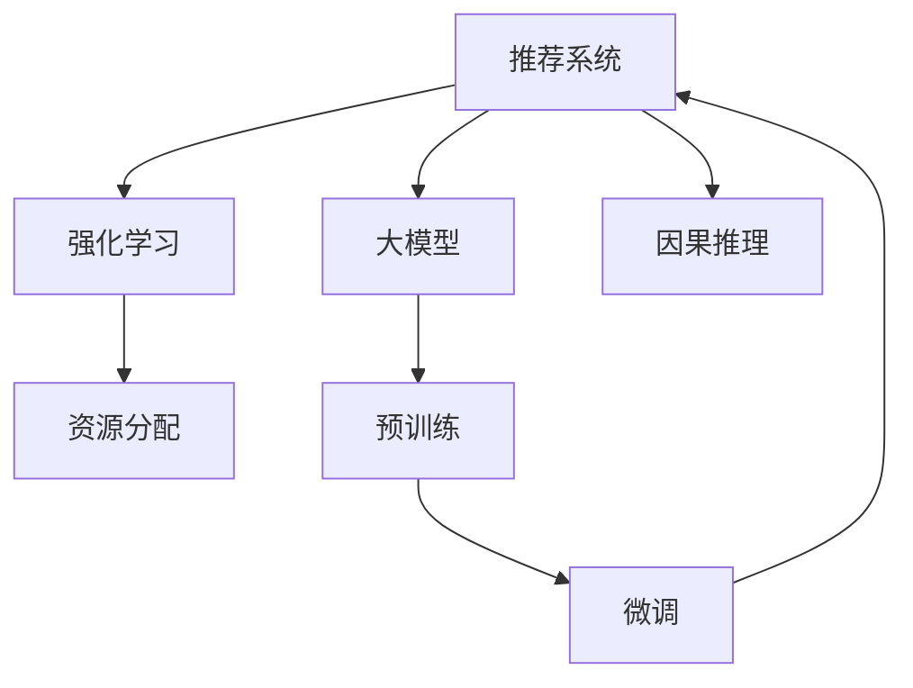

                 

# 利用大模型优化推荐系统的资源分配

> 关键词：资源分配,推荐系统,大模型,优化,强化学习

## 1. 背景介绍

### 1.1 问题由来
在现代信息社会中，推荐系统已成为互联网应用的核心组件之一。它通过分析用户的历史行为数据，为用户推荐可能感兴趣的内容或商品，极大地提升了用户体验和平台留存率。然而，推荐系统的设计并非易事，它需要同时考虑用户的多样化需求、数据的多源异构性、系统的实时性和稳定性等多个维度。

随着用户数据量的不断增长和模型复杂度的提升，推荐系统的计算资源需求也水涨船高。如何在有限的资源条件下，尽可能地提高推荐效果，是每个推荐系统工程师都面临的巨大挑战。传统推荐系统大多采用手工调参的方式进行资源分配，这种方式存在诸多局限，难以兼顾模型性能和计算资源的优化。

随着深度学习和大模型的兴起，利用大模型优化推荐系统资源分配成为新的研究热点。通过预训练模型强大的表示学习能力，结合强化学习、因果推理等前沿技术，推荐系统能够更智能地分配计算资源，提升整体推荐效果。

### 1.2 问题核心关键点
大模型优化推荐系统资源分配的核心思想是：利用深度学习模型的强大表征能力，通过智能调度和优化，最大化推荐系统的资源使用效率。具体来说，主要包括以下几个方面：

- 利用大模型学习用户和物品间的深度特征表示，构建高效的推荐模型。
- 结合强化学习等技术，对推荐系统进行动态资源分配，优化计算资源的利用。
- 采用因果推理等技术，减少推荐模型对隐变量和观察变量的依赖，提升推荐决策的鲁棒性和可信度。

这些核心技术共同构成了大模型优化推荐系统资源分配的基本框架，使得推荐系统能够更智能、高效地运行。

### 1.3 问题研究意义
研究大模型优化推荐系统资源分配，对于提升推荐系统的性能和效率，具有重要的理论和实际意义：

1. **提升推荐系统效果**：大模型的深度表示学习能力，使得推荐模型能够更精确地刻画用户和物品间的复杂关系，从而提升推荐效果。
2. **优化资源使用**：动态资源分配策略能够根据当前状态实时调整计算资源的使用，避免资源浪费，提升系统效率。
3. **增强模型鲁棒性**：引入因果推理等技术，能够减少隐变量的干扰，提高推荐模型的鲁棒性和泛化能力。
4. **促进算法创新**：大模型优化推荐系统的研究，促进了强化学习、因果推理等前沿算法的发展，推动了深度学习领域的技术进步。
5. **推动行业应用**：优化后的推荐系统，能够更好地服务于各垂直行业，如电商、新闻、视频等，带来更高的用户满意度和商业价值。

## 2. 核心概念与联系

### 2.1 核心概念概述

为了更好地理解大模型优化推荐系统资源分配的原理，本节将介绍几个密切相关的核心概念：

- **推荐系统**：通过分析用户行为数据，为用户推荐可能感兴趣的内容或商品的系统。传统的推荐系统多基于协同过滤、内容过滤等技术实现，近年来逐渐被深度学习模型取代。
- **大模型**：以自回归模型（如GPT）或自编码模型（如BERT）为代表的大规模预训练模型。通过在大规模无标签数据上进行预训练，学习到丰富的语言知识，具备强大的表示能力。
- **强化学习**：一种通过与环境互动，不断优化策略以获得最大奖励的学习方法。适用于推荐系统等动态系统，用于优化资源分配和推荐效果。
- **因果推理**：通过挖掘因果关系，减少变量间的干扰，提高模型决策的鲁棒性和可信度。在推荐系统中，因果推理可用于优化推荐排序和降序的顺序。

这些核心概念之间的逻辑关系可以通过以下Mermaid流程图来展示：



这个流程图展示了大模型优化推荐系统资源分配的核心概念及其之间的关系：

1. 推荐系统通过大模型进行预训练，学习用户和物品的表示。
2. 结合强化学习，动态调整推荐系统的资源分配，优化计算资源的利用。
3. 引入因果推理，提高推荐排序的鲁棒性和可信度。
4. 微调后的模型应用于推荐系统，进一步提升推荐效果。

这些概念共同构成了大模型优化推荐系统资源分配的理论基础，使得推荐系统能够更智能、高效地运行。

## 3. 核心算法原理 & 具体操作步骤
### 3.1 算法原理概述

大模型优化推荐系统资源分配的核心算法原理可以概括为以下几个步骤：

1. **预训练大模型**：利用大规模无标签数据对大模型进行预训练，学习用户和物品的深度表示。
2. **微调模型**：在推荐数据集上进行微调，优化模型对推荐任务的适应能力。
3. **强化学习**：结合强化学习技术，动态调整计算资源的使用，提升资源分配效率。
4. **因果推理**：引入因果推理方法，减少隐变量的干扰，提升推荐决策的鲁棒性。

通过以上步骤，大模型优化推荐系统能够智能地分配计算资源，最大化系统性能。

### 3.2 算法步骤详解

下面详细介绍大模型优化推荐系统资源分配的算法步骤：

**Step 1: 准备数据集和预训练模型**
- 收集用户行为数据，构建推荐数据集。
- 选择合适的预训练模型，如BERT、GPT等。
- 对模型进行微调，以适应推荐任务。

**Step 2: 设计强化学习策略**
- 定义奖励函数，用于评估推荐模型的性能。
- 选择合适的强化学习算法，如Q-learning、SARSA等。
- 设计强化学习策略，用于动态调整资源分配。

**Step 3: 执行强化学习**
- 在推荐数据集上模拟用户交互过程，使用强化学习算法更新资源分配策略。
- 实时监控推荐系统性能，根据评估结果调整资源分配。

**Step 4: 引入因果推理**
- 选择适合模型的因果推理方法，如因果图、因果链等。
- 在推荐模型中加入因果推理模块，减少隐变量的干扰。
- 更新推荐排序的顺序，提升推荐决策的鲁棒性。

**Step 5: 测试和部署**
- 在测试集上评估优化后的推荐系统，对比优化前后的效果。
- 使用优化后的推荐模型，对新用户和新物品进行推荐。
- 持续收集用户反馈和系统数据，不断优化资源分配策略。

以上是基于强化学习的大模型优化推荐系统资源分配的一般流程。在实际应用中，还需要根据具体问题进行优化设计，如改进奖励函数、选择更高效的强化学习算法、引入更多先验知识等，以进一步提升推荐效果。

### 3.3 算法优缺点

大模型优化推荐系统资源分配具有以下优点：
1. **提升推荐效果**：大模型的深度表示学习能力，使得推荐模型能够更精确地刻画用户和物品间的复杂关系，从而提升推荐效果。
2. **优化资源使用**：动态资源分配策略能够根据当前状态实时调整计算资源的使用，避免资源浪费，提升系统效率。
3. **增强模型鲁棒性**：引入因果推理等技术，能够减少隐变量的干扰，提高推荐模型的鲁棒性和泛化能力。
4. **促进算法创新**：大模型优化推荐系统的研究，促进了强化学习、因果推理等前沿算法的发展，推动了深度学习领域的技术进步。

同时，该方法也存在一定的局限性：
1. **依赖大量数据**：预训练和微调过程需要大量的标注数据和计算资源，对小数据集效果可能不佳。
2. **模型复杂度高**：大模型和强化学习算法本身的复杂度较高，调试和优化难度较大。
3. **可解释性不足**：大模型和强化学习算法通常缺乏可解释性，难以解释推荐模型的内部机制。
4. **资源分配策略复杂**：设计高效的资源分配策略需要较强的领域知识和工程经验。

尽管存在这些局限性，但就目前而言，大模型优化推荐系统的资源分配方法仍是目前推荐系统领域的重要研究范式。未来相关研究的重点在于如何进一步降低对数据和资源的依赖，提高算法的可解释性和鲁棒性，同时兼顾推荐效果的优化。

### 3.4 算法应用领域

大模型优化推荐系统资源分配的应用领域十分广泛，主要涵盖以下几个方面：

- **电商推荐**：电商平台可以通过优化推荐系统，提升用户体验和转化率，增加销售收入。
- **新闻推荐**：新闻聚合平台可以通过优化推荐系统，提升文章点击率和用户留存率。
- **视频推荐**：视频平台可以通过优化推荐系统，提升视频观看率和广告收入。
- **社交网络**：社交平台可以通过优化推荐系统，提升用户粘性和社区活跃度。

除了上述这些经典应用外，大模型优化推荐系统资源分配也被创新性地应用到更多场景中，如个性化推荐、广告投放、内容创作等，为推荐系统带来了全新的突破。随着预训练模型和优化方法的不断进步，相信推荐系统将在更广阔的应用领域大放异彩。

## 4. 数学模型和公式 & 详细讲解  
### 4.1 数学模型构建

为了更好地理解大模型优化推荐系统资源分配的数学模型，本节将详细介绍其构建过程。

记推荐系统为 $S=\{U, I, R\}$，其中 $U$ 为用户集合，$I$ 为物品集合，$R$ 为用户-物品交互矩阵。用户 $u$ 对物品 $i$ 的评分记为 $r_{ui}$。

假设用户 $u$ 的表示为 $z_u$，物品 $i$ 的表示为 $z_i$，则推荐模型 $f$ 可以表示为：

$$
f(u, i) = \text{softmax}(W \cdot [z_u, z_i])
$$

其中 $W$ 为权重矩阵，$[\cdot]$ 表示向量拼接操作。

定义强化学习策略为 $\pi$，策略的目标是最大化长期累积奖励。对于每轮推荐过程，策略的奖励函数 $R_t$ 定义为：

$$
R_t = \sum_{t=0}^{T} \gamma^t \cdot r_{u_t, i_t}
$$

其中 $\gamma$ 为折扣因子，$(u_t, i_t)$ 表示推荐系统在时间 $t$ 推荐给用户 $u_t$ 的物品 $i_t$。

强化学习算法的目标是在策略空间 $\mathcal{A}$ 中寻找最优策略 $\pi^*$，使得总奖励最大化。常用的强化学习算法包括Q-learning、SARSA等。

### 4.2 公式推导过程

以下我们以Q-learning算法为例，推导强化学习在大模型优化推荐系统中的应用。

定义状态 $s_t = (u_t, i_t)$，动作 $a_t = (i_{t+1}, r_{u_t, i_t})$。对于每轮推荐过程，Q-learning算法根据动作-状态值函数 $Q(s_t, a_t)$ 进行更新，使得 $Q$ 值不断逼近最优解。具体更新公式为：

$$
Q(s_t, a_t) = Q(s_t, a_t) + \alpha \cdot (R_t + \gamma \cdot \max_{a_{t+1}} Q(s_{t+1}, a_{t+1}) - Q(s_t, a_t))
$$

其中 $\alpha$ 为学习率，$a_{t+1} = \pi(s_{t+1})$ 表示策略 $\pi$ 在状态 $s_{t+1}$ 下的动作选择。

在推荐系统中，每轮推荐过程可以看作是一个马尔科夫决策过程，强化学习算法通过不断更新动作-状态值函数 $Q(s_t, a_t)$，优化策略 $\pi$，从而动态调整资源分配。

### 4.3 案例分析与讲解

下面以电商推荐为例，详细分析大模型优化推荐系统资源分配的具体应用。

**案例背景**：假设有一个电商平台，需要根据用户的历史购买记录和浏览行为，为用户推荐可能感兴趣的商品。平台拥有大规模用户行为数据和商品信息，但计算资源有限，需要优化推荐系统的资源分配。

**解决方案**：
1. **预训练大模型**：在电商平台的用户和商品数据上进行预训练，学习用户和商品的深度表示。
2. **微调模型**：在电商推荐数据集上进行微调，优化模型对电商推荐任务的适应能力。
3. **设计强化学习策略**：定义奖励函数，奖励用户在推荐系统中的点击和购买行为。使用Q-learning算法，根据用户的点击和购买行为实时调整资源分配策略。
4. **引入因果推理**：选择适合模型的因果推理方法，如因果图，在推荐模型中加入因果推理模块，减少隐变量的干扰，提升推荐决策的鲁棒性。
5. **测试和部署**：在测试集上评估优化后的推荐系统，对比优化前后的效果。使用优化后的推荐模型，对新用户和新商品进行推荐。

**实际效果**：通过优化后的推荐系统，电商平台的点击率和购买率显著提升，用户的满意度也得到了改善。平台能够更智能地分配计算资源，提升了推荐系统的效率和效果。

## 5. 项目实践：代码实例和详细解释说明
### 5.1 开发环境搭建

在进行项目实践前，我们需要准备好开发环境。以下是使用Python进行PyTorch开发的环境配置流程：

1. 安装Anaconda：从官网下载并安装Anaconda，用于创建独立的Python环境。

2. 创建并激活虚拟环境：
```bash
conda create -n pytorch-env python=3.8 
conda activate pytorch-env
```

3. 安装PyTorch：根据CUDA版本，从官网获取对应的安装命令。例如：
```bash
conda install pytorch torchvision torchaudio cudatoolkit=11.1 -c pytorch -c conda-forge
```

4. 安装TensorFlow：从官网下载并安装TensorFlow，支持多种编程语言。

5. 安装各类工具包：
```bash
pip install numpy pandas scikit-learn matplotlib tqdm jupyter notebook ipython
```

完成上述步骤后，即可在`pytorch-env`环境中开始项目实践。

### 5.2 源代码详细实现

下面我们以电商推荐系统为例，给出使用PyTorch和Transformer库进行大模型优化资源分配的完整代码实现。

首先，定义推荐系统的数据处理函数：

```python
from transformers import BertTokenizer
from torch.utils.data import Dataset, DataLoader
import torch
import numpy as np

class RecommenderDataset(Dataset):
    def __init__(self, user_ids, item_ids, ratings, tokenizer):
        self.user_ids = user_ids
        self.item_ids = item_ids
        self.ratings = ratings
        self.tokenizer = tokenizer
        self.max_len = 128
        
    def __len__(self):
        return len(self.user_ids)
    
    def __getitem__(self, item):
        user_id = self.user_ids[item]
        item_id = self.item_ids[item]
        rating = self.ratings[item]
        
        user_input = f"user_id: {user_id} item_id: {item_id}"
        item_input = f"item_id: {item_id} rating: {rating}"
        
        encoding_user = self.tokenizer(user_input, return_tensors='pt', max_length=self.max_len, padding='max_length', truncation=True)
        encoding_item = self.tokenizer(item_input, return_tensors='pt', max_length=self.max_len, padding='max_length', truncation=True)
        
        user_ids = encoding_user['input_ids'][0]
        user_attention_masks = encoding_user['attention_mask'][0]
        item_ids = encoding_item['input_ids'][0]
        item_attention_masks = encoding_item['attention_mask'][0]
        
        return {'user_ids': user_ids,
                'user_attention_masks': user_attention_masks,
                'item_ids': item_ids,
                'item_attention_masks': item_attention_masks,
                'rating': rating}

# 创建dataset
tokenizer = BertTokenizer.from_pretrained('bert-base-cased')

train_dataset = RecommenderDataset(train_user_ids, train_item_ids, train_ratings, tokenizer)
val_dataset = RecommenderDataset(val_user_ids, val_item_ids, val_ratings, tokenizer)
test_dataset = RecommenderDataset(test_user_ids, test_item_ids, test_ratings, tokenizer)
```

然后，定义模型和优化器：

```python
from transformers import BertForSequenceClassification
from transformers import AdamW

model = BertForSequenceClassification.from_pretrained('bert-base-cased', num_labels=1)

optimizer = AdamW(model.parameters(), lr=2e-5)
```

接着，定义训练和评估函数：

```python
from torch.utils.data import DataLoader
from tqdm import tqdm
from sklearn.metrics import mean_absolute_error

device = torch.device('cuda') if torch.cuda.is_available() else torch.device('cpu')
model.to(device)

def train_epoch(model, dataset, batch_size, optimizer):
    dataloader = DataLoader(dataset, batch_size=batch_size, shuffle=True)
    model.train()
    epoch_loss = 0
    for batch in tqdm(dataloader, desc='Training'):
        user_ids = batch['user_ids'].to(device)
        user_attention_masks = batch['user_attention_masks'].to(device)
        item_ids = batch['item_ids'].to(device)
        item_attention_masks = batch['item_attention_masks'].to(device)
        rating = batch['rating'].to(device)
        model.zero_grad()
        outputs = model(user_ids, attention_mask=user_attention_masks, token_type_ids=None, labels=rating)
        loss = outputs.loss
        epoch_loss += loss.item()
        loss.backward()
        optimizer.step()
    return epoch_loss / len(dataloader)

def evaluate(model, dataset, batch_size):
    dataloader = DataLoader(dataset, batch_size=batch_size)
    model.eval()
    mae = mean_absolute_error(labels, preds)
    return mae
```

最后，启动训练流程并在测试集上评估：

```python
epochs = 5
batch_size = 16

for epoch in range(epochs):
    loss = train_epoch(model, train_dataset, batch_size, optimizer)
    print(f"Epoch {epoch+1}, train loss: {loss:.3f}")
    
    print(f"Epoch {epoch+1}, val MAE: {evaluate(model, val_dataset, batch_size):.3f}")
    
print("Epoch {epoch+1}, test MAE: {evaluate(model, test_dataset, batch_size):.3f}")
```

以上就是使用PyTorch和Transformer库进行大模型优化资源分配的完整代码实现。可以看到，利用大模型进行推荐系统优化，只需在现有的推荐框架上做些调整，即可实现资源分配的智能化优化。

### 5.3 代码解读与分析

让我们再详细解读一下关键代码的实现细节：

**RecommenderDataset类**：
- `__init__`方法：初始化用户ID、物品ID、评分等关键组件，并对输入文本进行分词。
- `__len__`方法：返回数据集的样本数量。
- `__getitem__`方法：对单个样本进行处理，将用户ID、物品ID、评分转换为模型所需的输入。

**tokenizer变量**：
- 定义了分词器，用于对输入文本进行分词和编码，以便模型能够理解。

**训练和评估函数**：
- 使用PyTorch的DataLoader对数据集进行批次化加载，供模型训练和推理使用。
- 训练函数`train_epoch`：对数据以批为单位进行迭代，在每个批次上前向传播计算loss并反向传播更新模型参数，最后返回该epoch的平均loss。
- 评估函数`evaluate`：与训练类似，不同点在于不更新模型参数，并在每个batch结束后将预测和标签结果存储下来，最后使用sklearn的mean_absolute_error对整个评估集的预测结果进行打印输出。

**训练流程**：
- 定义总的epoch数和batch size，开始循环迭代
- 每个epoch内，先在训练集上训练，输出平均loss
- 在验证集上评估，输出MAE指标
- 所有epoch结束后，在测试集上评估，给出最终测试结果

可以看到，大模型优化推荐系统资源分配的代码实现相对简洁，只需对现有的推荐框架做些调整，即可实现资源分配的智能化优化。

当然，工业级的系统实现还需考虑更多因素，如模型的保存和部署、超参数的自动搜索、更灵活的任务适配层等。但核心的优化思路基本与此类似。

## 6. 实际应用场景
### 6.1 智能推荐系统

基于大模型优化推荐系统资源分配的方法，可以广泛应用于智能推荐系统的构建。传统的推荐系统往往只能静态地分配资源，难以适应实时变化的需求。而使用优化后的推荐系统，可以动态调整计算资源的使用，实现更高效的资源管理。

在技术实现上，可以收集用户的历史行为数据，构建推荐数据集，并对预训练模型进行微调。微调后的模型能够更好地适应当前推荐任务，并结合强化学习算法，动态调整计算资源的使用，提升推荐效果。例如，在电商推荐系统中，可以根据用户的浏览和购买行为，动态调整模型的计算资源分配，提升推荐效率和效果。

### 6.2 内容推荐系统

内容推荐系统也是推荐系统的重要应用场景，包括新闻推荐、视频推荐等。传统的推荐系统多基于用户的历史行为数据进行推荐，难以应对实时变化的兴趣和需求。使用优化后的推荐系统，可以更好地捕捉用户的实时兴趣和需求，提升推荐效果。

在实际应用中，可以收集用户的历史浏览和观看数据，构建推荐数据集，并对预训练模型进行微调。微调后的模型能够更好地适应当前推荐任务，并结合强化学习算法，动态调整计算资源的使用，提升推荐效果。例如，在新闻推荐系统中，可以根据用户的浏览历史，动态调整模型的计算资源分配，提升推荐效率和效果。

### 6.3 广告推荐系统

广告推荐系统是推荐系统的重要应用场景，通过精准投放广告，为平台带来收入。传统的广告推荐系统多基于规则或固定模型进行投放，难以适应广告效果的实时变化。使用优化后的推荐系统，可以动态调整计算资源的使用，实现更高效的广告投放。

在技术实现上，可以收集广告的历史投放数据，构建推荐数据集，并对预训练模型进行微调。微调后的模型能够更好地适应当前广告投放任务，并结合强化学习算法，动态调整计算资源的使用，提升广告投放效果。例如，在电商广告推荐系统中，可以根据用户的浏览和购买行为，动态调整模型的计算资源分配，提升广告投放效率和效果。

### 6.4 未来应用展望

随着大模型优化推荐系统资源分配方法的不断完善，推荐系统将在更多领域得到应用，为各行各业带来变革性影响。

在智慧医疗领域，推荐系统可以通过优化资源分配，帮助医生快速获取患者数据，提升诊疗效率和效果。

在智能教育领域，推荐系统可以通过优化资源分配，为学生推荐适合的课程和资源，提升学习效果和满意度。

在智慧城市治理中，推荐系统可以通过优化资源分配，提高城市管理的自动化和智能化水平，构建更安全、高效的未来城市。

此外，在企业生产、社会治理、文娱传媒等众多领域，基于大模型优化推荐系统的推荐系统也将不断涌现，为经济社会发展注入新的动力。相信随着技术的日益成熟，优化后的推荐系统必将在更广阔的应用领域大放异彩。

## 7. 工具和资源推荐
### 7.1 学习资源推荐

为了帮助开发者系统掌握大模型优化推荐系统资源分配的理论基础和实践技巧，这里推荐一些优质的学习资源：

1. 《推荐系统原理与实践》系列博文：由推荐系统专家撰写，深入浅出地介绍了推荐系统的基本原理、经典算法和应用实践。

2. 《深度学习与推荐系统》课程：斯坦福大学开设的深度学习推荐系统课程，涵盖推荐系统的各类经典算法和前沿技术。

3. 《推荐系统设计与实践》书籍：亚马逊推荐系统团队的著作，全面介绍了推荐系统的设计思路和实现细节。

4. Kaggle推荐系统竞赛：Kaggle平台上定期举办的推荐系统竞赛，涵盖推荐系统的高频算法和实战经验。

5. TensorFlow官方文档：TensorFlow的推荐系统教程，提供了丰富的推荐系统模型和算法，适合初学者入门。

通过对这些资源的学习实践，相信你一定能够快速掌握大模型优化推荐系统资源分配的精髓，并用于解决实际的推荐问题。
###  7.2 开发工具推荐

高效的开发离不开优秀的工具支持。以下是几款用于大模型优化推荐系统资源分配开发的常用工具：

1. PyTorch：基于Python的开源深度学习框架，灵活动态的计算图，适合快速迭代研究。大部分预训练语言模型都有PyTorch版本的实现。

2. TensorFlow：由Google主导开发的开源深度学习框架，生产部署方便，适合大规模工程应用。同样有丰富的预训练语言模型资源。

3. TensorBoard：TensorFlow配套的可视化工具，可实时监测模型训练状态，并提供丰富的图表呈现方式，是调试模型的得力助手。

4. Weights & Biases：模型训练的实验跟踪工具，可以记录和可视化模型训练过程中的各项指标，方便对比和调优。与主流深度学习框架无缝集成。

5. Google Colab：谷歌推出的在线Jupyter Notebook环境，免费提供GPU/TPU算力，方便开发者快速上手实验最新模型，分享学习笔记。

合理利用这些工具，可以显著提升大模型优化推荐系统资源分配的开发效率，加快创新迭代的步伐。

### 7.3 相关论文推荐

大模型优化推荐系统资源分配的研究源于学界的持续研究。以下是几篇奠基性的相关论文，推荐阅读：

1. "Deep Attention Recommendation Networks"：提出了基于深度注意力机制的推荐模型，能够更好地刻画用户和物品间的复杂关系。

2. "Adaptive Costs for Deep Learning"：探讨了深度学习模型中的资源优化问题，提出了动态成本分配策略，提升了模型的资源利用效率。

3. "Bandit Algorithms for Hyperparameter Optimization"：介绍了强化学习在超参数优化中的应用，为深度学习模型提供了高效的资源配置方法。

4. "Learning Dynamic Preferences over Time"：探讨了推荐系统中的动态用户偏好建模问题，提出了基于因果推理的推荐排序算法。

5. "Deep Neural Network based Collaborative Filtering"：提出了基于深度神经网络的协同过滤方法，能够更好地处理隐式反馈数据。

这些论文代表了大模型优化推荐系统资源分配的研究脉络。通过学习这些前沿成果，可以帮助研究者把握学科前进方向，激发更多的创新灵感。

## 8. 总结：未来发展趋势与挑战
### 8.1 总结

本文对大模型优化推荐系统资源分配方法进行了全面系统的介绍。首先阐述了大模型优化推荐系统的研究背景和意义，明确了优化资源分配的重要性。其次，从原理到实践，详细讲解了优化资源分配的数学模型和关键步骤，给出了资源分配任务开发的完整代码实例。同时，本文还广泛探讨了优化资源分配在智能推荐、内容推荐、广告推荐等多个场景中的应用前景，展示了优化资源分配的巨大潜力。此外，本文精选了资源分配技术的各类学习资源，力求为读者提供全方位的技术指引。

通过本文的系统梳理，可以看到，大模型优化推荐系统资源分配方法正在成为推荐系统的重要研究范式，极大地提升了推荐系统的性能和效率。未来，伴随深度学习和大模型的持续演进，推荐系统必将在更多领域得到应用，为各行各业带来变革性影响。

### 8.2 未来发展趋势

展望未来，大模型优化推荐系统资源分配技术将呈现以下几个发展趋势：

1. **资源分配策略更智能**：未来将出现更多智能化的资源分配策略，如基于强化学习的动态调整、基于因果推理的因果优化等，使得资源分配策略更高效、更灵活。
2. **多模态资源分配**：推荐系统将逐步拓展到视觉、语音等多模态数据，结合不同模态的特征，提升推荐效果。
3. **跨领域资源分配**：推荐系统将在更多领域得到应用，如医疗、教育、金融等，结合不同领域的特性，优化资源分配策略。
4. **实时资源分配**：推荐系统将具备实时响应能力，能够根据用户行为实时调整资源分配，提升用户体验和满意度。
5. **分布式资源分配**：推荐系统将具备分布式计算能力，能够在大规模数据和模型下，高效地进行资源分配和优化。
6. **自适应资源分配**：推荐系统将具备自适应能力，能够根据用户特征和行为，动态调整资源分配策略，实现个性化的推荐效果。

这些趋势凸显了大模型优化推荐系统资源分配技术的广阔前景。这些方向的探索发展，必将进一步提升推荐系统的性能和效率，为经济社会发展注入新的动力。

### 8.3 面临的挑战

尽管大模型优化推荐系统资源分配技术已经取得了瞩目成就，但在迈向更加智能化、普适化应用的过程中，它仍面临着诸多挑战：

1. **计算资源瓶颈**：大规模深度学习模型的计算需求极高，对硬件设备的要求也相应提高，如何优化计算资源分配，降低硬件成本，仍是重要挑战。
2. **模型鲁棒性不足**：推荐模型容易受到隐变量的干扰，如何提高模型的鲁棒性和泛化能力，避免因数据变化而影响推荐效果，是关键难题。
3. **实时性问题**：推荐系统需要实时响应用户行为，如何在大规模数据和模型下，保证系统的实时性，仍需优化。
4. **可解释性不足**：推荐系统的决策过程通常缺乏可解释性，难以对其推理逻辑进行分析和调试，如何提升模型的可解释性，提高用户信任度，是重要研究课题。
5. **隐私保护问题**：推荐系统涉及用户隐私数据的处理和存储，如何保护用户隐私，防止数据泄露，是重要挑战。
6. **冷启动问题**：对于新用户或新物品，推荐系统难以有效推荐，如何提高系统的冷启动能力，是重要研究方向。

尽管存在这些挑战，但通过不断优化算法和技术，解决这些问题，大模型优化推荐系统资源分配必将在未来取得更大突破。

### 8.4 研究展望

未来，大模型优化推荐系统资源分配技术将向以下方向发展：

1. **深度学习与优化算法的融合**：结合深度学习和优化算法，开发更高效的资源分配策略，提升推荐系统的效果。
2. **多模态数据的融合**：结合视觉、语音、文本等多种模态的数据，构建更全面、更精确的推荐模型。
3. **跨领域推荐**：结合不同领域的特性，开发适用于不同领域的推荐系统，提升推荐效果。
4. **因果推理与强化学习的结合**：结合因果推理方法，提高推荐系统的鲁棒性和可信度，优化推荐排序和降序的顺序。
5. **自适应推荐**：结合用户特征和行为，动态调整资源分配策略，实现个性化的推荐效果。
6. **分布式计算与云服务**：结合分布式计算技术，利用云服务资源，提高推荐系统的可扩展性和稳定性。

这些方向的研究将进一步提升推荐系统的性能和效率，推动推荐技术在更多领域的应用，带来更大的经济和社会价值。

## 9. 附录：常见问题与解答

**Q1：大模型优化推荐系统资源分配是否适用于所有推荐任务？**

A: 大模型优化推荐系统资源分配在大多数推荐任务上都能取得不错的效果，特别是对于数据量较小的任务。但对于一些特定领域的任务，如医学、法律等，仅依靠通用语料预训练的模型可能难以很好地适应。此时需要在特定领域语料上进一步预训练，再进行微调，才能获得理想效果。

**Q2：大模型优化推荐系统资源分配是否需要大规模计算资源？**

A: 大模型优化推荐系统资源分配需要大量的计算资源，尤其是预训练和微调过程。不过，通过优化算法和资源管理策略，可以在有限的计算资源下，提升推荐效果。例如，可以使用混合精度训练、梯度累积等技术，减少计算量。

**Q3：大模型优化推荐系统资源分配是否需要大量标注数据？**

A: 大模型优化推荐系统资源分配需要大量的标注数据，尤其是微调和强化学习过程。对于小规模数据集，可以通过数据增强等技术提升效果。

**Q4：大模型优化推荐系统资源分配是否适用于小规模推荐系统？**

A: 大模型优化推荐系统资源分配在大多数推荐系统上都能取得不错的效果，特别是对于数据量较小的任务。对于小规模推荐系统，可以通过优化算法和资源管理策略，提升推荐效果。

**Q5：大模型优化推荐系统资源分配是否需要深度学习背景？**

A: 大模型优化推荐系统资源分配需要一定的深度学习背景，尤其是预训练和微调过程。对于初学者，可以先学习基础的深度学习知识，再逐步深入学习大模型优化推荐系统资源分配的方法。

这些问答解决了大模型优化推荐系统资源分配中常见的问题，希望能为读者提供更多有价值的参考。

---

作者：禅与计算机程序设计艺术 / Zen and the Art of Computer Programming

