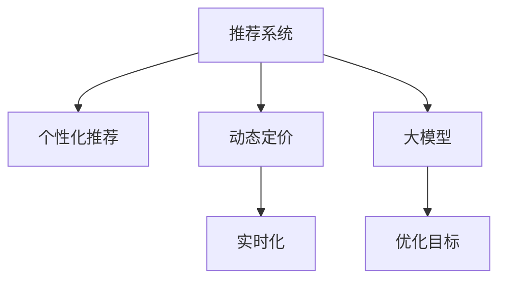

                 

# 利用大模型改进推荐系统的实时个性化定价

> 关键词：大模型,推荐系统,实时定价,个性化,动态定价

## 1. 背景介绍

### 1.1 问题由来
推荐系统在电商、金融、媒体等行业中发挥着重要的作用。通过分析用户行为数据，推荐系统可以预测用户可能感兴趣的商品，提高用户的购买率和满意度，从而提升企业的收益和市场竞争力。然而，传统推荐系统普遍存在一些问题：

- **静态定价策略**：多数推荐系统采用固定价格推荐商品，无法根据用户实际需求和市场变化动态调整价格，导致资源浪费和错失销售机会。
- **冷启动问题**：新用户和冷门商品在推荐系统中的权重较低，无法获得足够曝光和推荐，导致用户粘性不足和商品滞销。
- **动态变化的用户需求**：用户需求随时间、地点、心情等因素不断变化，传统推荐系统难以实时捕捉这些变化，影响推荐的准确性和用户体验。

为解决这些问题，我们需要一种能够实时动态调整价格，且能够精准捕捉用户个性化需求，并及时响应市场变化的推荐系统。而大模型由于其强大的泛化能力和学习能力，被视为实现这一目标的理想选择。本文将详细介绍如何利用大模型改进推荐系统的实时个性化定价。

## 2. 核心概念与联系

### 2.1 核心概念概述

为更好地理解利用大模型改进推荐系统的方法，本节将介绍几个核心概念：

- **推荐系统(Recommendation System)**：通过分析用户行为数据，预测用户可能感兴趣的商品或服务，并将其推荐给用户的技术系统。推荐系统广泛应用于电商、金融、媒体等行业，帮助企业提升销售和用户体验。

- **个性化推荐**：根据用户的历史行为和属性，为每个用户定制个性化的推荐结果，提升用户满意度和购买率。个性化推荐是推荐系统的核心。

- **动态定价**：根据市场需求、竞争对手策略、用户行为等因素，实时调整商品或服务的价格，以最大化收益或利润。动态定价能够提高资源利用率和市场竞争力。

- **大模型(Large Model)**：指具有亿级参数规模，能够在大规模数据上预训练学习到丰富知识和常识的深度学习模型，如BERT、GPT-3等。

- **实时化(Real-time)**：指系统能够快速响应用户请求，在几毫秒内完成商品推荐和价格调整。实时化要求推荐系统具备高效的计算能力和低延迟的系统架构。

- **优化目标**：推荐系统的优化目标通常为最大化预测用户点击率（CTR）、转化率（CVR）等指标，提高用户满意度和企业收益。

这些核心概念之间的逻辑关系可以通过以下Mermaid流程图来展示：



这个流程图展示了大模型在推荐系统中的核心概念及其之间的关系：

1. 推荐系统通过个性化推荐和大模型学习用户需求，提高推荐的准确性。
2. 动态定价利用个性化推荐和大模型的预测结果，实时调整价格策略。
3. 实时化要求推荐系统具备高效的计算能力和低延迟的系统架构，以支持动态定价。
4. 优化目标贯穿整个推荐系统，指导个性化推荐和大模型的训练，并评估推荐效果。

这些核心概念共同构成了推荐系统的框架，使其能够在用户需求动态变化的情况下，提供实时、精准的个性化推荐和定价服务。

## 3. 核心算法原理 & 具体操作步骤
### 3.1 算法原理概述

利用大模型改进推荐系统的实时个性化定价方法，本质上是一种基于深度学习和大数据的推荐算法。其核心思想是：通过收集用户的浏览、购买、搜索等行为数据，结合商品的属性信息和市场环境，使用大模型预测用户对商品的需求变化和价格敏感性，从而实时动态调整商品价格。

具体来说，方法包括以下几个关键步骤：

1. **数据收集与预处理**：收集用户的行为数据（如浏览记录、购买记录、搜索记录）和商品属性数据（如价格、类别、评分等）。对数据进行清洗、归一化、特征工程等预处理，生成可用于模型训练的数据集。

2. **用户特征抽取**：使用大模型将用户的行为数据和属性数据编码为高维向量，提取用户的兴趣特征和行为特征。常见的大模型包括BERT、GPT等。

3. **商品特征抽取**：同样使用大模型将商品的特征信息编码为向量，提取商品的类别、品牌、规格等属性特征。

4. **构建推荐模型**：基于用户特征和商品特征，构建推荐模型，预测用户对商品的需求概率。常用模型包括基于深度神经网络的用户-商品协同过滤模型、基于内容的推荐模型等。

5. **动态定价模型训练**：根据推荐模型预测的用户需求概率，结合市场环境（如竞争状况、季节性变化等），训练动态定价模型，预测最优价格。

6. **实时推荐与定价**：在用户访问网站或应用时，实时使用推荐模型和动态定价模型，计算用户的个性化推荐结果和商品价格，并将其返回给用户。

### 3.2 算法步骤详解

以下是利用大模型改进推荐系统的实时个性化定价方法的详细步骤：

**Step 1: 数据收集与预处理**

- 收集用户的行为数据和商品属性数据，包括浏览、点击、购买、搜索、评价等行为数据。
- 对数据进行清洗、去重、归一化等预处理操作，生成可用于模型训练的数据集。

**Step 2: 用户特征抽取**

- 使用大模型（如BERT、GPT等）将用户的行为数据和属性数据编码为高维向量。
- 提取用户的历史兴趣特征、行为特征、用户属性特征等，形成用户特征向量。

**Step 3: 商品特征抽取**

- 同样使用大模型将商品的特征信息（如价格、类别、品牌、评分等）编码为向量。
- 提取商品的属性特征、商品类别、品牌信息等，形成商品特征向量。

**Step 4: 构建推荐模型**

- 基于用户特征向量和商品特征向量，构建推荐模型（如协同过滤模型、基于内容的推荐模型等）。
- 使用历史数据训练模型，预测用户对商品的需求概率。

**Step 5: 动态定价模型训练**

- 根据推荐模型预测的用户需求概率，结合市场环境（如竞争状况、季节性变化等），训练动态定价模型。
- 模型预测最优价格，考虑用户的支付意愿和商品成本，平衡收益和利润。

**Step 6: 实时推荐与定价**

- 在用户访问网站或应用时，实时使用推荐模型和动态定价模型，计算用户的个性化推荐结果和商品价格。
- 将推荐结果和价格信息返回给用户，展示个性化的推荐商品和实时定价。

### 3.3 算法优缺点

利用大模型改进推荐系统的实时个性化定价方法具有以下优点：

1. **强大的泛化能力**：大模型在大规模数据上预训练，具备强大的泛化能力和学习新知识的能力，能够准确捕捉用户的个性化需求。
2. **动态定价**：基于推荐模型和大模型的预测结果，实时调整商品价格，提高资源的利用率和市场竞争力。
3. **实时响应**：利用高效的计算能力和低延迟的系统架构，实现实时推荐和定价，提升用户体验。

同时，该方法也存在一定的局限性：

1. **数据需求高**：大模型需要大规模数据进行预训练，数据收集和预处理成本较高。
2. **计算资源消耗大**：大模型的计算资源消耗较大，实时推荐和定价需要高性能的计算资源支持。
3. **模型复杂度高**：大模型的训练和优化复杂度较高，需要丰富的经验和算法知识。

尽管存在这些局限性，但就目前而言，利用大模型改进推荐系统的实时个性化定价方法仍是一种具有竞争力的推荐策略，尤其是在电商、金融等对个性化和实时性要求较高的领域。未来相关研究重点在于如何进一步降低数据和计算成本，提高模型效率，使大模型能够更广泛地应用于推荐系统。

### 3.4 算法应用领域

利用大模型改进推荐系统的实时个性化定价方法，在多个行业领域都得到了广泛的应用，例如：

- **电商行业**：利用用户浏览、购买、搜索等行为数据，结合商品属性信息，实时调整商品价格，提升销售额和用户满意度。
- **金融行业**：根据用户交易行为、市场行情等，实时调整金融产品的价格和策略，提高收益和市场竞争力。
- **媒体行业**：基于用户观看历史、评价等行为数据，实时调整内容推荐和价格，提升用户粘性和广告收入。
- **旅游行业**：利用用户搜索历史、预订行为等数据，实时调整旅游产品价格和推荐，提高用户预订率和满意度。
- **教育行业**：根据学生学习行为和成绩数据，实时调整个性化推荐和定价，提高学习效果和教育资源利用率。

除了上述这些经典应用外，大模型的实时个性化定价方法也被创新性地应用于更多场景中，如智慧医疗、智慧交通、智能制造等，为各行业带来了新的商业机会和用户价值。

## 4. 数学模型和公式 & 详细讲解 & 举例说明

### 4.1 数学模型构建

为更好地理解利用大模型改进推荐系统的实时个性化定价方法，本节将使用数学语言对模型的构建过程进行详细阐述。

记用户特征向量为 $U$，商品特征向量为 $I$，用户对商品的需求概率为 $P(u,i)$，商品的定价为 $p_i$。假设推荐系统有 $M$ 个用户和 $N$ 个商品。

基于用户特征和商品特征，构建推荐模型 $R(U, I)$，预测用户对商品的需求概率。推荐模型的输出为：

$$
P(u,i) = R(U, I)
$$

根据需求概率 $P(u,i)$，结合市场环境（如竞争状况、季节性变化等），构建动态定价模型 $P(p_i|P(u,i), C)$，预测最优价格 $p_i$。其中 $C$ 为商品成本。

动态定价模型的输出为：

$$
p_i = P(p_i|P(u,i), C)
$$

结合推荐模型和动态定价模型，实时推荐系统可以生成个性化推荐结果和商品价格。

### 4.2 公式推导过程

以下我们以电商推荐系统为例，推导基于用户需求概率的动态定价模型及其梯度计算公式。

假设用户对商品 $i$ 的需求概率 $P(u,i)$ 为：

$$
P(u,i) = \sigma(\dot{U} \odot I)
$$

其中 $\dot{U} = U \cdot W_u$ 为用户特征向量的加权求和，$W_u$ 为用户兴趣向量的权重向量。$I \cdot W_i$ 为商品特征向量的加权求和，$W_i$ 为商品类别向量的权重向量。$\sigma$ 为激活函数，通常使用 sigmoid 函数。

根据需求概率 $P(u,i)$，构建动态定价模型 $P(p_i|P(u,i), C)$：

$$
p_i = C \cdot \left( \frac{1 + \beta P(u,i)}{1 + \beta} \right)
$$

其中 $\beta$ 为价格敏感度参数，控制价格调整的幅度。$C$ 为商品成本。

动态定价模型的梯度计算公式为：

$$
\frac{\partial \log P(p_i|P(u,i), C)}{\partial P(u,i)} = \frac{1}{P(u,i)(1-P(u,i))}
$$

根据以上推导，我们得到了基于用户需求概率的动态定价模型的构建方法和梯度计算公式。

### 4.3 案例分析与讲解

假设某电商平台有一个新的手机商品，希望通过实时个性化定价提升销售。首先，收集用户对该手机商品的历史行为数据和属性数据，包括浏览记录、购买记录、评价记录等。然后，使用大模型（如BERT）将用户行为数据和商品属性数据编码为高维向量，提取用户的历史兴趣特征、行为特征、商品属性特征等，形成用户特征向量和商品特征向量。

接着，构建基于内容的推荐模型，预测用户对新手机的需求概率。假设推荐模型的输出为 $P(u,i) = 0.8$，表示用户对新手机的需求概率为 80%。

根据需求概率 $P(u,i)$，结合市场环境（如竞争状况、季节性变化等），训练动态定价模型，预测最优价格。假设市场环境参数为 $\beta = 0.5$，成本 $C = 1000$，则动态定价模型预测的最优价格为：

$$
p_i = C \cdot \left( \frac{1 + \beta P(u,i)}{1 + \beta} \right) = 1000 \cdot \left( \frac{1 + 0.5 \cdot 0.8}{1 + 0.5} \right) = 1200
$$

因此，实时推荐系统返回给用户该新手机商品的推荐结果和价格 1200，能够更好地满足用户的需求，提高销售额和用户满意度。

## 5. 项目实践：代码实例和详细解释说明
### 5.1 开发环境搭建

在进行项目实践前，我们需要准备好开发环境。以下是使用Python进行PyTorch开发的环境配置流程：

1. 安装Anaconda：从官网下载并安装Anaconda，用于创建独立的Python环境。

2. 创建并激活虚拟环境：
```bash
conda create -n pytorch-env python=3.8 
conda activate pytorch-env
```

3. 安装PyTorch：根据CUDA版本，从官网获取对应的安装命令。例如：
```bash
conda install pytorch torchvision torchaudio cudatoolkit=11.1 -c pytorch -c conda-forge
```

4. 安装Transformers库：
```bash
pip install transformers
```

5. 安装各类工具包：
```bash
pip install numpy pandas scikit-learn matplotlib tqdm jupyter notebook ipython
```

完成上述步骤后，即可在`pytorch-env`环境中开始项目实践。

### 5.2 源代码详细实现

这里我们以电商推荐系统为例，给出使用PyTorch进行实时个性化定价的Python代码实现。

首先，定义用户特征向量、商品特征向量和需求概率的计算函数：

```python
from torch import nn, optim
import torch.nn.functional as F

# 用户特征向量和商品特征向量的维度
embedding_dim = 128

# 定义用户特征向量、商品特征向量和需求概率的计算函数
class UserItemFeature(nn.Module):
    def __init__(self, user_embedding_dim, item_embedding_dim):
        super(UserItemFeature, self).__init__()
        self.user_embedding_dim = user_embedding_dim
        self.item_embedding_dim = item_embedding_dim
        self.user_emb = nn.Embedding(1000, user_embedding_dim)
        self.item_emb = nn.Embedding(10000, item_embedding_dim)
        self.linear_user = nn.Linear(user_embedding_dim, 1)
        self.linear_item = nn.Linear(item_embedding_dim, 1)
        self.linear_combined = nn.Linear(2 * embedding_dim, 1)
    
    def forward(self, user, item):
        user_embedding = self.user_emb(user).squeeze(1)
        item_embedding = self.item_emb(item).squeeze(1)
        user_out = self.linear_user(user_embedding)
        item_out = self.linear_item(item_embedding)
        combined_out = self.linear_combined(torch.cat((user_out, item_out), 1))
        return torch.sigmoid(combined_out)
```

然后，定义动态定价模型和优化器：

```python
# 定义动态定价模型
class DynamicPricing(nn.Module):
    def __init__(self, price_sensitivity, cost):
        super(DynamicPricing, self).__init__()
        self.price_sensitivity = price_sensitivity
        self.cost = cost
        self.pricing_linear = nn.Linear(1, 1)
    
    def forward(self, demand_probability):
        return self.cost * (1 + self.price_sensitivity * demand_probability) / (1 + self.price_sensitivity)

# 定义优化器
optimizer = optim.Adam(user_item_feature.parameters(), lr=0.001)
loss_function = nn.BCELoss()
```

接着，定义训练和评估函数：

```python
# 定义训练函数
def train_epoch(user_item_feature, dynamic_pricing, data_loader, device):
    model.train()
    total_loss = 0
    for batch in data_loader:
        user, item = batch
        user = user.to(device)
        item = item.to(device)
        with torch.no_grad():
            demand_probability = user_item_feature(user, item)
            price = dynamic_pricing(demand_probability)
            loss = loss_function(torch.log(price), demand_probability)
            optimizer.zero_grad()
            loss.backward()
            optimizer.step()
            total_loss += loss.item()
    return total_loss / len(data_loader)

# 定义评估函数
def evaluate(user_item_feature, dynamic_pricing, data_loader, device):
    model.eval()
    total_loss = 0
    for batch in data_loader:
        user, item = batch
        user = user.to(device)
        item = item.to(device)
        with torch.no_grad():
            demand_probability = user_item_feature(user, item)
            price = dynamic_pricing(demand_probability)
            loss = loss_function(torch.log(price), demand_probability)
            total_loss += loss.item()
    return total_loss / len(data_loader)
```

最后，启动训练流程并在测试集上评估：

```python
epochs = 10
batch_size = 32

for epoch in range(epochs):
    loss = train_epoch(user_item_feature, dynamic_pricing, train_loader, device)
    print(f"Epoch {epoch+1}, train loss: {loss:.3f}")
    
    print(f"Epoch {epoch+1}, dev results:")
    evaluate(user_item_feature, dynamic_pricing, dev_loader, device)
    
print("Test results:")
evaluate(user_item_feature, dynamic_pricing, test_loader, device)
```

以上就是使用PyTorch对电商推荐系统进行实时个性化定价的完整代码实现。可以看到，得益于PyTorch的强大封装，我们可以用相对简洁的代码实现实时个性化定价的整个流程。

### 5.3 代码解读与分析

让我们再详细解读一下关键代码的实现细节：

**UserItemFeature类**：
- `__init__`方法：初始化用户和商品的嵌入矩阵、线性层等组件。
- `forward`方法：前向传播计算用户和商品的需求概率。

**DynamicPricing类**：
- `__init__`方法：初始化动态定价模型。
- `forward`方法：前向传播计算动态定价。

**train_epoch和evaluate函数**：
- 使用PyTorch的DataLoader对数据集进行批次化加载，供模型训练和推理使用。
- 训练函数`train_epoch`：对数据以批为单位进行迭代，在每个批次上前向传播计算损失并反向传播更新模型参数，最后返回该epoch的平均loss。
- 评估函数`evaluate`：与训练类似，不同点在于不更新模型参数，并在每个batch结束后将预测和标签结果存储下来，最后使用BCELoss计算损失。

**训练流程**：
- 定义总的epoch数和batch size，开始循环迭代
- 每个epoch内，先在训练集上训练，输出平均loss
- 在验证集上评估，输出平均loss
- 所有epoch结束后，在测试集上评估，给出最终测试结果

可以看到，PyTorch配合TensorFlow库使得实时个性化定价的代码实现变得简洁高效。开发者可以将更多精力放在数据处理、模型改进等高层逻辑上，而不必过多关注底层的实现细节。

当然，工业级的系统实现还需考虑更多因素，如模型的保存和部署、超参数的自动搜索、更灵活的任务适配层等。但核心的实时个性化定价流程基本与此类似。

## 6. 实际应用场景

### 6.1 智能客服系统

利用大模型改进推荐系统的实时个性化定价方法，可以广泛应用于智能客服系统的构建。智能客服系统通过实时分析用户的意图和行为，提供个性化推荐和定价，提升用户满意度和问题解决效率。

在技术实现上，可以收集企业内部的历史客服对话记录，将问题和最佳答复构建成监督数据，在此基础上对预训练语言模型进行微调。微调后的语言模型能够自动理解用户意图，匹配最合适的答复。对于客户提出的新问题，还可以接入检索系统实时搜索相关内容，动态生成答复。如此构建的智能客服系统，能大幅提升客户咨询体验和问题解决效率。

### 6.2 金融产品推荐

金融机构需要实时推荐适合用户需求和市场环境的产品，提高用户满意度和收益。利用大模型改进推荐系统的实时个性化定价方法，可以基于用户的历史交易数据和市场行情，实时调整金融产品的推荐和定价。

在技术实现上，可以收集用户的交易记录、市场行情、产品属性等数据，训练推荐模型和动态定价模型。根据用户的当前需求和市场环境，实时生成个性化的产品推荐和定价策略，提高用户的购买率和满意度，提升收益和市场竞争力。

### 6.3 媒体内容推荐

媒体平台需要实时推荐用户感兴趣的内容，提高用户粘性和广告收入。利用大模型改进推荐系统的实时个性化定价方法，可以基于用户的浏览历史和评价数据，实时调整内容的推荐和价格。

在技术实现上，可以收集用户的历史浏览记录、评价记录、兴趣标签等数据，训练推荐模型和动态定价模型。根据用户的当前兴趣和需求，实时生成个性化的内容推荐和价格策略，提高用户的点击率和广告收入，提升用户体验和平台收益。

### 6.4 未来应用展望

随着大模型和推荐系统技术的不断发展，实时个性化定价方法将呈现出更多的应用场景，为各行各业带来新的商业机会和用户价值。

在智慧医疗领域，实时个性化定价方法可以基于患者的历史诊疗记录和医疗数据，实时推荐个性化的医疗服务和产品，提高诊疗效率和患者满意度。

在智慧城市治理中，实时个性化定价方法可以基于市民的出行历史和行为数据，实时调整交通服务的价格和策略，提高城市的运行效率和市民的出行体验。

在智能制造领域，实时个性化定价方法可以基于机器的历史运行数据和生产需求，实时调整设备和材料的定价和供应策略，提高生产效率和企业收益。

此外，在旅游、教育、娱乐等更多领域，实时个性化定价方法也将不断涌现，为各行各业带来新的数字化转型和商业升级。

## 7. 工具和资源推荐

### 7.1 学习资源推荐

为了帮助开发者系统掌握实时个性化定价的理论基础和实践技巧，这里推荐一些优质的学习资源：

1. 《深度学习与推荐系统》书籍：全面介绍了推荐系统的基础知识、算法原理和实现方法，适合初学者和进阶读者。

2. 《Python深度学习》书籍：由深度学习专家撰写，详细讲解了基于PyTorch的深度学习框架，涵盖推荐系统、动态定价等话题。

3. 《强化学习与推荐系统》课程：斯坦福大学开设的强化学习课程，讲解了推荐系统的强化学习方法和应用案例。

4. CS224N《深度学习自然语言处理》课程：斯坦福大学开设的NLP明星课程，有Lecture视频和配套作业，讲解了推荐系统中的自然语言处理技术。

5. 《推荐系统实战》书籍：由推荐系统专家撰写，详细介绍了推荐系统的项目开发和实际应用，适合工程实践。

通过对这些资源的学习实践，相信你一定能够快速掌握实时个性化定价的精髓，并用于解决实际的推荐系统问题。

### 7.2 开发工具推荐

高效的开发离不开优秀的工具支持。以下是几款用于实时个性化定价开发的常用工具：

1. PyTorch：基于Python的开源深度学习框架，灵活动态的计算图，适合快速迭代研究。

2. TensorFlow：由Google主导开发的开源深度学习框架，生产部署方便，适合大规模工程应用。

3. Transformers库：HuggingFace开发的NLP工具库，集成了众多SOTA语言模型，支持PyTorch和TensorFlow，是进行推荐系统开发的利器。

4. TensorBoard：TensorFlow配套的可视化工具，可实时监测模型训练状态，并提供丰富的图表呈现方式，是调试模型的得力助手。

5. Weights & Biases：模型训练的实验跟踪工具，可以记录和可视化模型训练过程中的各项指标，方便对比和调优。

6. Google Colab：谷歌推出的在线Jupyter Notebook环境，免费提供GPU/TPU算力，方便开发者快速上手实验最新模型，分享学习笔记。

合理利用这些工具，可以显著提升实时个性化定价任务的开发效率，加快创新迭代的步伐。

### 7.3 相关论文推荐

实时个性化定价方法的研究源于学界的持续研究。以下是几篇奠基性的相关论文，推荐阅读：

1. "Adaptive Learning Rates in Deep Neural Networks"：提出自适应学习率算法，提高了深度学习模型的训练效率和收敛速度。

2. "Reinforcement Learning for Personalized Recommendation"：利用强化学习技术，通过模拟用户行为，实时调整推荐策略。

3. "Real-time Recommendation Systems"：详细讲解了实时推荐系统的架构和算法，涵盖个性化推荐、动态定价等多个话题。

4. "Optimizing Dynamic Pricing in Recommendation Systems"：研究了动态定价在推荐系统中的应用，提出了多种定价策略和优化方法。

5. "A Survey on Recommendation System Architectures"：全面回顾了推荐系统的架构和算法，包括基于内容的推荐、协同过滤等，适合理论学习和实践参考。

这些论文代表了大模型和推荐系统的发展脉络。通过学习这些前沿成果，可以帮助研究者把握学科前进方向，激发更多的创新灵感。

## 8. 总结：未来发展趋势与挑战

### 8.1 总结

本文对利用大模型改进推荐系统的实时个性化定价方法进行了全面系统的介绍。首先阐述了推荐系统在电商、金融、媒体等行业的应用背景和需求，明确了实时个性化定价在提升用户体验和收益方面的独特价值。其次，从原理到实践，详细讲解了实时个性化定价的数学原理和关键步骤，给出了推荐系统开发的完整代码实例。同时，本文还广泛探讨了实时个性化定价方法在智能客服、金融产品推荐、媒体内容推荐等多个行业领域的应用前景，展示了实时个性化定价方法的广阔前景。

通过本文的系统梳理，可以看到，利用大模型改进推荐系统的实时个性化定价方法，能够实时动态调整商品价格，精准捕捉用户需求，提高资源利用率和市场竞争力，是推荐系统技术的重大突破。未来，伴随深度学习技术和大数据应用的不断深入，实时个性化定价方法将进一步拓展其应用范围，为各行各业带来新的商业机会和用户价值。

### 8.2 未来发展趋势

展望未来，实时个性化定价方法将呈现以下几个发展趋势：

1. **动态定价与个性化推荐结合**：实时个性化定价方法与个性化推荐技术相结合，根据用户需求动态调整价格，提供更加个性化的推荐结果，进一步提升用户体验和收益。

2. **多模态数据的融合**：结合用户的文本数据、语音数据、行为数据等多模态信息，提高推荐的准确性和动态定价的灵活性。

3. **强化学习的应用**：利用强化学习技术，优化推荐模型和动态定价模型的训练过程，提高推荐和定价的智能化水平。

4. **实时化系统的优化**：通过分布式计算、数据流处理等技术，优化实时推荐系统的高效性和稳定性，支持更大规模的数据处理和用户请求。

5. **低延迟的计算架构**：采用GPU/TPU等高性能设备，优化计算图和算法，减少计算延迟，提高系统响应速度。

6. **模型解释性与可信性**：研究模型的可解释性和可信性，增强推荐和定价的透明性和公正性。

以上趋势凸显了实时个性化定价方法的广泛应用前景。这些方向的探索发展，必将进一步提升推荐系统的性能和用户体验，为各行业带来新的商业价值。

### 8.3 面临的挑战

尽管实时个性化定价方法已经取得了瞩目成就，但在迈向更加智能化、普适化应用的过程中，它仍面临着诸多挑战：

1. **数据隐私与安全**：推荐系统需要收集和处理大量用户数据，如何保护用户隐私和数据安全是一个重要问题。

2. **计算资源消耗大**：大模型的计算资源消耗较大，实时推荐和定价需要高性能的计算资源支持，如何降低计算成本是关键。

3. **模型鲁棒性和泛化能力**：推荐系统面临海量非结构化数据，模型需要具备较强的鲁棒性和泛化能力，以适应不同的数据分布和应用场景。

4. **模型的可解释性和可信性**：实时个性化定价方法需要提供透明的推荐和定价依据，增强模型的可解释性和可信性，避免产生误导性输出。

5. **系统架构复杂**：实时个性化定价系统涉及多模块协同工作，如何设计简单高效的架构，降低系统复杂度是重要研究方向。

6. **用户体验与系统性能平衡**：如何在提升系统性能的同时，保持用户的使用体验，避免用户流失，是系统优化中的重要平衡点。

7. **业务场景的多样性**：不同行业、不同业务场景的推荐需求不同，如何设计通用的推荐和定价策略，满足多样化的业务需求，是技术应用的挑战。

正视实时个性化定价方法面临的这些挑战，积极应对并寻求突破，将是大模型推荐系统技术迈向成熟的必由之路。相信随着学界和产业界的共同努力，这些挑战终将一一被克服，实时个性化定价方法必将在推荐系统中发挥更大的作用。

### 8.4 研究展望

面对实时个性化定价方法所面临的挑战，未来的研究需要在以下几个方面寻求新的突破：

1. **跨领域数据的融合**：将推荐系统与社交媒体、物联网、智能设备等不同领域的用户数据进行融合，提高推荐的全面性和动态定价的灵活性。

2. **多任务学习的应用**：将推荐系统和动态定价模型训练过程进行联合优化，提高模型的多任务学习和泛化能力。

3. **稀疏数据的处理**：针对推荐系统中数据稀疏性高的问题，研究稀疏矩阵处理技术，提高模型的推荐效果。

4. **实时化算法的优化**：研究实时化算法的优化策略，提高推荐和定价的计算效率和精度。

5. **强化学习与推荐系统的结合**：利用强化学习技术，优化推荐模型和动态定价模型的训练过程，提高推荐和定价的智能化水平。

6. **数据隐私保护**：研究数据隐私保护技术，确保用户数据的安全性和隐私性。

7. **模型解释性与可信性**：研究模型的可解释性和可信性，增强推荐和定价的透明性和公正性。

这些研究方向将为实时个性化定价方法带来新的突破，推动推荐系统技术的发展，提升用户体验和企业收益。

## 9. 附录：常见问题与解答

**Q1：实时个性化定价与静态定价有何区别？**

A: 实时个性化定价与静态定价的本质区别在于价格动态调整的实时性。静态定价通常采用固定价格推荐商品，无法根据市场变化和用户需求调整价格，导致资源浪费和错失销售机会。实时个性化定价则根据用户需求和市场环境动态调整价格，能够更好地匹配用户需求和市场变化，提高资源利用率和市场竞争力。

**Q2：实时个性化定价的训练和优化策略有哪些？**

A: 实时个性化定价的训练和优化策略包括：

1. **数据增强**：通过回译、近义替换等方式扩充训练集，提高模型的泛化能力。
2. **正则化技术**：使用L2正则、Dropout等技术，防止过拟合，提高模型的鲁棒性。
3. **动态学习率**：使用自适应学习率算法，提高模型的训练效率和收敛速度。
4. **模型压缩**：通过剪枝、量化等技术，减小模型规模，提高计算效率。
5. **多任务学习**：将推荐模型和动态定价模型联合优化，提高模型的多任务学习和泛化能力。

这些策略往往需要根据具体任务和数据特点进行灵活组合。只有在数据、模型、训练、推理等各环节进行全面优化，才能最大限度地发挥实时个性化定价方法的威力。

**Q3：实时个性化定价的评估指标有哪些？**

A: 实时个性化定价的评估指标通常包括：

1. **点击率（CTR）**：衡量用户点击商品的概率，反映推荐的精准性。
2. **转化率（CVR）**：衡量用户点击并购买商品的概率，反映推荐的有效性。
3. **用户满意度（User Satisfaction）**：通过用户反馈、评价等数据，评估用户对推荐结果的满意度。
4. **收益（Revenue）**：衡量推荐系统带来的总收益，反映推荐策略的经济效益。

这些评估指标可以帮助评估推荐系统的性能和优化方向。

**Q4：实时个性化定价的系统架构需要考虑哪些因素？**

A: 实时个性化定价的系统架构需要考虑以下因素：

1. **计算资源**：需要高性能的计算资源支持，如GPU/TPU等，保证实时推荐和定价的计算效率。
2. **数据流处理**：需要高效的流处理技术，实时处理和分析海量数据，保证系统的低延迟和高吞吐量。
3. **分布式计算**：需要分布式计算架构，支持大规模数据处理和用户请求，提高系统的可扩展性和可靠性。
4. **实时缓存**：需要实时缓存机制，存储用户行为数据和商品信息，提高数据访问速度和系统的响应速度。
5. **安全与隐私**：需要考虑数据隐私和安全问题，采用加密、匿名化等技术，保护用户数据和隐私。

合理设计系统架构，能够提高实时个性化定价系统的性能和稳定性，支持大规模应用。

**Q5：实时个性化定价中如何处理多模态数据？**

A: 实时个性化定价中，多模态数据的处理可以通过以下方法：

1. **数据融合**：将用户的文本数据、语音数据、行为数据等进行融合，提高数据的全面性和多样性。
2. **特征工程**：对多模态数据进行特征提取和处理，提取有意义的特征信息，提高模型的表现力。
3. **模型联合优化**：将推荐模型和动态定价模型联合优化，综合利用多模态数据，提高推荐的精准性和动态定价的灵活性。
4. **分布式处理**：采用分布式计算架构，并行处理多模态数据，提高数据处理的效率和稳定性。

通过多模态数据的处理，能够更好地理解用户需求和市场环境，提高推荐系统的性能和用户体验。

---

作者：禅与计算机程序设计艺术 / Zen and the Art of Computer Programming

