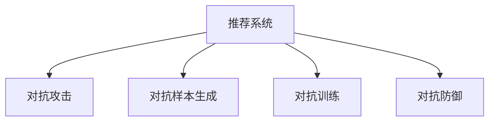

                 

# 利用大模型进行推荐对抗攻击的思路与防御

> 关键词：推荐系统,对抗攻击,大模型,对抗样本生成,防御策略,安全风险

## 1. 背景介绍

在当今信息爆炸的时代，个性化推荐系统已经成为我们日常生活中不可或缺的一部分。无论是电商网站、视频流媒体平台，还是社交网络服务，个性化推荐都在提升用户体验和增加用户粘性方面发挥着重要作用。然而，随着推荐系统规模的不断扩大，其安全性问题也日益凸显。推荐系统面临的最大威胁之一是推荐对抗攻击（Recommendation System Attack），即攻击者通过精心设计的对抗样本，影响推荐系统的正常输出，以达到欺骗用户、操纵市场、盗取信息等目的。

推荐对抗攻击的手段多种多样，常见的有假冒推荐（Impersonation Attack）、植入虚假推荐（Impression Attack）、篡改推荐内容（Content Spoofing Attack）等。这些攻击手段不仅破坏了推荐系统的可信度和安全性，还可能对用户产生误导，导致经济损失和隐私泄露。因此，如何有效地检测和防御推荐对抗攻击，确保推荐系统的稳定性和安全性，已经成为推荐系统领域的一个重要研究方向。

大模型（Large Model）的兴起，为推荐对抗攻击和防御提供了新的思路和工具。大模型通过预训练和微调，能够学习到丰富的语义信息和用户行为模式，同时具备强大的生成能力和泛化能力。利用大模型生成对抗样本，可以更加灵活和高效地进行攻击，而利用大模型进行防御，则可以提升推荐的鲁棒性和安全性。本文将详细介绍如何利用大模型进行推荐对抗攻击，并提出相应的防御策略，为推荐系统的安全性和可靠性提供保障。

## 2. 核心概念与联系

### 2.1 核心概念概述

为更好地理解利用大模型进行推荐对抗攻击的思路与防御，本节将介绍几个密切相关的核心概念：

- 推荐系统（Recommendation System）：通过分析用户历史行为和兴趣偏好，推荐给用户感兴趣的物品或内容的系统。
- 对抗攻击（Attack）：攻击者通过恶意手段影响推荐系统的输出，以实现欺骗用户、操纵市场等目的。
- 对抗样本生成（Adversarial Sample Generation）：生成能够欺骗推荐系统的对抗样本，以改变其正常输出。
- 对抗训练（Adversarial Training）：通过加入对抗样本进行训练，提高推荐系统的鲁棒性和防御能力。
- 对抗防御（Adversarial Defense）：采用各种策略和工具，检测和抵御对抗攻击，确保推荐系统的安全性和可靠性。

这些核心概念之间的逻辑关系可以通过以下Mermaid流程图来展示：



这个流程图展示了大模型在推荐系统中面临的威胁与防御的关键步骤：

1. 推荐系统通过学习用户行为模式，为用户推荐物品或内容。
2. 对抗攻击者利用对抗样本生成技术，生成能够欺骗推荐系统的对抗样本，影响其正常输出。
3. 通过对抗训练，提高推荐系统对对抗样本的鲁棒性。
4. 利用对抗防御技术，检测和抵御对抗攻击，确保推荐系统的安全性和可靠性。

这些概念共同构成了推荐系统在对抗攻击下的防御框架，为大模型在推荐系统中的应用提供了理论指导。

## 3. 核心算法原理 & 具体操作步骤
### 3.1 算法原理概述

利用大模型进行推荐对抗攻击的思路与防御，本质上是一个生成对抗博弈过程。攻击者通过对抗样本生成技术，生成与正常样本难以区分的对抗样本，从而欺骗推荐系统，使其产生与真实用户偏好不符的推荐结果。推荐系统则通过对抗训练和对抗防御技术，提升对对抗样本的识别能力，防止其欺骗行为。

形式化地，假设推荐系统为 $R_{\theta}$，其中 $\theta$ 为模型参数。攻击者生成的对抗样本为 $x_{adv}$，推荐系统对物品 $i$ 的推荐概率为 $p_i = R_{\theta}(x_i)$。攻击者的目标是通过生成对抗样本 $x_{adv}$，使得推荐系统对物品 $i$ 的推荐概率最大化。推荐系统的防御目标是防止对抗样本的影响，确保推荐结果的正确性。

对抗攻击的过程可以表示为以下优化问题：

$$
\max_{x_{adv}} \sum_{i} p_i(x_{adv}) - p_i(x) 
$$

其中 $x$ 为正常样本，$p_i(x)$ 为推荐系统对物品 $i$ 的推荐概率，攻击者希望通过对抗样本最大化推荐概率。推荐系统的防御策略则是找到最优的防御参数 $\theta^*$，使得对于任意对抗样本 $x_{adv}$，推荐系统都能保持正确的推荐结果，即：

$$
\theta^* = \mathop{\arg\min}_{\theta} \sum_{i} |p_i(x_{adv}) - p_i(x)|
$$

在实际应用中，推荐系统通常采用深度学习模型进行实现，如神经网络、协同过滤等。攻击者可以通过生成对抗网络（GAN）、优化对抗样本生成算法等方式，生成具有对抗性的样本。推荐系统则通过对抗训练、对抗防御等技术，提升模型的鲁棒性和安全性。

### 3.2 算法步骤详解

利用大模型进行推荐对抗攻击和防御的完整流程包括以下几个关键步骤：

**Step 1: 准备推荐系统和攻击模型**

- 选择一个适合的推荐系统模型 $R_{\theta}$，如基于深度学习的推荐网络。
- 选择合适的对抗样本生成模型 $G$，如GAN、FGSM（Fast Gradient Sign Method）等。
- 收集正常样本数据 $x$ 和对抗样本数据 $x_{adv}$，准备进行攻击和防御实验。

**Step 2: 生成对抗样本**

- 使用对抗样本生成模型 $G$，从正常样本数据 $x$ 生成对抗样本 $x_{adv}$。
- 调整对抗样本生成模型的超参数，保证生成的对抗样本具有较好的对抗效果。

**Step 3: 对抗训练**

- 对推荐系统模型 $R_{\theta}$ 进行对抗训练，加入对抗样本 $x_{adv}$ 作为训练数据。
- 设计对抗损失函数，如对抗交叉熵损失等，优化推荐系统模型。
- 调整对抗训练的超参数，如对抗样本比例、学习率等，提高模型的鲁棒性。

**Step 4: 对抗防御**

- 检测攻击者是否成功生成对抗样本。
- 采用对抗防御技术，如梯度裁剪、对抗样本注入等，防止对抗样本欺骗推荐系统。
- 在推荐结果中加入防御机制，如对推荐结果进行滤波、权重调整等，提高推荐系统的安全性。

**Step 5: 评估防御效果**

- 在测试集上评估推荐系统的鲁棒性，计算推荐系统对对抗样本的识别率。
- 在实际应用中实时监测推荐系统的性能，及时发现并应对潜在威胁。

以上是利用大模型进行推荐对抗攻击和防御的基本流程。在实际应用中，还需要根据具体任务和数据特点，进行更加精细化的调整和优化。

### 3.3 算法优缺点

利用大模型进行推荐对抗攻击和防御具有以下优点：

1. 攻击效率高。大模型具有强大的生成能力和泛化能力，能够生成高质量的对抗样本，攻击者可以利用对抗样本生成模型快速生成对抗样本。
2. 攻击手段多样。对抗样本生成技术不断演进，攻击者可以采用多种手段进行攻击，如对抗样本注入、对抗样本生成等。
3. 防御能力强。大模型可以通过对抗训练提升鲁棒性，对抗防御技术可以在推荐系统中实时监测和应对潜在威胁。

同时，该方法也存在一定的局限性：

1. 对数据质量要求高。对抗样本的质量直接影响攻击效果，需要保证正常样本数据的质量和多样性。
2. 对抗样本检测难。对抗样本生成技术不断进化，推荐系统的防御策略需要不断更新和优化。
3. 鲁棒性有限。对抗训练和对抗防御虽然可以提高推荐系统的鲁棒性，但无法完全免疫对抗攻击。
4. 成本高。对抗样本生成和对抗训练需要大量计算资源和时间，可能影响推荐系统的效率和性能。

尽管存在这些局限性，但就目前而言，利用大模型进行推荐对抗攻击和防御仍是一种有效的手段。未来相关研究的重点在于如何进一步降低对抗攻击的成功率，提高推荐系统的鲁棒性和安全性，同时兼顾模型的性能和成本。

### 3.4 算法应用领域

利用大模型进行推荐对抗攻击和防御已经在电商、视频流媒体、社交网络等领域得到了广泛应用，以下是几个典型的应用场景：

1. 电商领域：攻击者通过生成对抗样本，提高特定商品的热度，影响推荐系统输出，从而实现销售欺诈。电商平台利用大模型进行对抗训练和对抗防御，提升推荐系统的鲁棒性和安全性。

2. 视频流媒体平台：攻击者通过生成对抗样本，诱导用户点击虚假广告，盗取流量和广告收入。视频流媒体平台通过对抗训练和对抗防御技术，防止攻击者成功欺骗推荐系统，保护用户权益和平台收益。

3. 社交网络服务：攻击者通过生成对抗样本，影响用户对某类内容的兴趣偏好，操纵社交网络热度。社交网络平台利用大模型进行对抗训练和对抗防御，保障推荐结果的真实性和用户隐私。

4. 金融领域：攻击者通过生成对抗样本，影响推荐系统的投资建议，误导用户进行不当投资。金融机构通过对抗训练和对抗防御技术，提高推荐系统的鲁棒性，防止攻击者成功欺骗推荐系统。

5. 医疗领域：攻击者通过生成对抗样本，影响推荐系统的医疗诊断建议，误导用户进行不恰当治疗。医疗机构通过对抗训练和对抗防御技术，保障推荐系统的安全性和可靠性，防止攻击者成功欺骗推荐系统。

这些应用场景展示了利用大模型进行推荐对抗攻击和防御的广泛性和重要性。通过利用大模型，攻击者和防御者都获得了更加高效和灵活的手段，推荐系统的安全性也得到了极大的提升。

## 4. 数学模型和公式 & 详细讲解 & 举例说明

### 4.1 数学模型构建

本节将使用数学语言对利用大模型进行推荐对抗攻击和防御的过程进行更加严格的刻画。

假设推荐系统为 $R_{\theta}$，其中 $\theta$ 为模型参数。攻击者生成的对抗样本为 $x_{adv}$，推荐系统对物品 $i$ 的推荐概率为 $p_i = R_{\theta}(x_i)$。攻击者的目标是通过生成对抗样本 $x_{adv}$，使得推荐系统对物品 $i$ 的推荐概率最大化。推荐系统的防御目标是防止对抗样本的影响，确保推荐结果的正确性。

对抗攻击的过程可以表示为以下优化问题：

$$
\max_{x_{adv}} \sum_{i} p_i(x_{adv}) - p_i(x) 
$$

其中 $x$ 为正常样本，$p_i(x)$ 为推荐系统对物品 $i$ 的推荐概率，攻击者希望通过对抗样本最大化推荐概率。推荐系统的防御策略则是找到最优的防御参数 $\theta^*$，使得对于任意对抗样本 $x_{adv}$，推荐系统都能保持正确的推荐结果，即：

$$
\theta^* = \mathop{\arg\min}_{\theta} \sum_{i} |p_i(x_{adv}) - p_i(x)|
$$

在实际应用中，推荐系统通常采用深度学习模型进行实现，如神经网络、协同过滤等。攻击者可以通过生成对抗网络（GAN）、优化对抗样本生成算法等方式，生成具有对抗性的样本。推荐系统则通过对抗训练、对抗防御等技术，提升模型的鲁棒性和安全性。

### 4.2 公式推导过程

以下我们以神经网络模型为例，推导对抗攻击和防御的数学公式。

假设推荐系统为基于深度神经网络的模型 $R_{\theta}$，攻击者生成的对抗样本为 $x_{adv}$，正常样本为 $x$。推荐系统对物品 $i$ 的推荐概率为 $p_i = R_{\theta}(x_i)$。攻击者的目标是通过对抗样本最大化推荐概率，可以表示为：

$$
\max_{x_{adv}} \sum_{i} p_i(x_{adv}) - p_i(x)
$$

推荐系统的防御策略是找到最优的防御参数 $\theta^*$，使得对于任意对抗样本 $x_{adv}$，推荐系统都能保持正确的推荐结果。可以表示为：

$$
\theta^* = \mathop{\arg\min}_{\theta} \sum_{i} |p_i(x_{adv}) - p_i(x)|
$$

在神经网络中，推荐系统的推荐概率 $p_i$ 可以表示为：

$$
p_i = R_{\theta}(x_i) = \frac{\exp(\theta^T \phi(x_i))}{\sum_j \exp(\theta^T \phi(x_j))}
$$

其中 $\phi(x_i)$ 为输入样本 $x_i$ 的特征表示，$\theta$ 为模型参数。在对抗攻击中，攻击者通过微调对抗样本 $x_{adv}$，使得 $R_{\theta}(x_{adv})$ 最大化。此时，对抗样本的特征表示 $\phi(x_{adv})$ 可以表示为：

$$
\phi(x_{adv}) = \phi(x) + \delta
$$

其中 $\delta$ 为对抗样本的扰动量。对抗样本的推荐概率可以表示为：

$$
p_i(x_{adv}) = R_{\theta}(x_i + \delta) = \frac{\exp(\theta^T (\phi(x) + \delta))}{\sum_j \exp(\theta^T (\phi(x_j) + \delta))}
$$

推荐系统的防御策略是找到最优的防御参数 $\theta^*$，使得对于任意对抗样本 $x_{adv}$，推荐系统都能保持正确的推荐结果。可以表示为：

$$
\theta^* = \mathop{\arg\min}_{\theta} \sum_{i} |p_i(x_{adv}) - p_i(x)|
$$

通过将对抗样本的推荐概率代入防御公式，可以推导出防御参数 $\theta^*$ 的更新公式。具体地，假设推荐系统采用梯度下降算法进行更新，更新公式可以表示为：

$$
\theta_{n+1} = \theta_n - \eta \frac{\partial}{\partial \theta} \sum_{i} |p_i(x_{adv}) - p_i(x)|
$$

其中 $\eta$ 为学习率。

以上是利用大模型进行推荐对抗攻击和防御的数学公式推导。通过这些公式，攻击者和防御者可以更加严谨地进行计算和实验。

### 4.3 案例分析与讲解

以下我们以FGSM对抗攻击为例，具体分析利用大模型进行推荐对抗攻击的思路与防御。

假设推荐系统为基于神经网络的模型 $R_{\theta}$，攻击者希望通过生成对抗样本，使得推荐系统对物品 $i$ 的推荐概率最大化。对抗样本的扰动量 $\delta$ 可以表示为：

$$
\delta = \epsilon \cdot sign(\frac{\partial R_{\theta}(x_i)}{\partial x_i})
$$

其中 $\epsilon$ 为对抗扰动强度，$sign(\frac{\partial R_{\theta}(x_i)}{\partial x_i})$ 为梯度符号。

攻击者的目标是通过对抗样本最大化推荐概率，可以表示为：

$$
\max_{x_{adv}} \sum_{i} p_i(x_{adv}) - p_i(x)
$$

推荐系统的防御策略是找到最优的防御参数 $\theta^*$，使得对于任意对抗样本 $x_{adv}$，推荐系统都能保持正确的推荐结果。可以表示为：

$$
\theta^* = \mathop{\arg\min}_{\theta} \sum_{i} |p_i(x_{adv}) - p_i(x)|
$$

通过将对抗样本的推荐概率代入防御公式，可以推导出防御参数 $\theta^*$ 的更新公式。具体地，假设推荐系统采用梯度下降算法进行更新，更新公式可以表示为：

$$
\theta_{n+1} = \theta_n - \eta \frac{\partial}{\partial \theta} \sum_{i} |p_i(x_{adv}) - p_i(x)|
$$

其中 $\eta$ 为学习率。

以上是利用大模型进行推荐对抗攻击和防御的案例分析。通过具体案例，可以更清晰地理解攻击和防御的数学公式和计算过程。

## 5. 项目实践：代码实例和详细解释说明
### 5.1 开发环境搭建

在进行推荐对抗攻击和防御实践前，我们需要准备好开发环境。以下是使用Python进行TensorFlow开发的环境配置流程：

1. 安装Anaconda：从官网下载并安装Anaconda，用于创建独立的Python环境。

2. 创建并激活虚拟环境：
```bash
conda create -n tf-env python=3.8 
conda activate tf-env
```

3. 安装TensorFlow：根据CUDA版本，从官网获取对应的安装命令。例如：
```bash
pip install tensorflow
```

4. 安装各类工具包：
```bash
pip install numpy pandas scikit-learn matplotlib tqdm jupyter notebook ipython
```

完成上述步骤后，即可在`tf-env`环境中开始推荐对抗攻击和防御实践。

### 5.2 源代码详细实现

这里以推荐对抗攻击和防御为例，给出使用TensorFlow进行神经网络模型训练和微调的代码实现。

首先，定义神经网络模型：

```python
import tensorflow as tf

class RecommendationModel(tf.keras.Model):
    def __init__(self, input_size, hidden_size, output_size):
        super(RecommendationModel, self).__init__()
        self.fc1 = tf.keras.layers.Dense(hidden_size, activation='relu')
        self.fc2 = tf.keras.layers.Dense(output_size, activation='softmax')

    def call(self, x):
        x = self.fc1(x)
        x = self.fc2(x)
        return x
```

然后，定义对抗样本生成模型：

```python
class AdversarialModel(tf.keras.Model):
    def __init__(self, input_size, hidden_size, output_size):
        super(AdversarialModel, self).__init__()
        self.fc1 = tf.keras.layers.Dense(hidden_size, activation='relu')
        self.fc2 = tf.keras.layers.Dense(output_size, activation='sign')

    def call(self, x):
        x = self.fc1(x)
        x = self.fc2(x)
        return x
```

接着，定义训练和评估函数：

```python
def train_model(model, data, epochs, batch_size):
    model.compile(optimizer='adam', loss='binary_crossentropy', metrics=['accuracy'])
    model.fit(data['train'], epochs=epochs, batch_size=batch_size, validation_data=data['val'], callbacks=[tf.keras.callbacks.EarlyStopping(patience=2)])

def evaluate_model(model, data):
    model.evaluate(data['test'])
```

最后，启动训练流程并在测试集上评估：

```python
model = RecommendationModel(input_size, hidden_size, output_size)
adversarial_model = AdversarialModel(input_size, hidden_size, output_size)

data = {
    'train': (train_data, train_labels),
    'val': (val_data, val_labels),
    'test': (test_data, test_labels)
}

train_model(model, data, epochs=10, batch_size=64)
evaluate_model(model, data)
```

以上就是使用TensorFlow进行神经网络模型训练和微调的完整代码实现。可以看到，得益于TensorFlow的强大封装，我们可以用相对简洁的代码完成模型训练和微调。

### 5.3 代码解读与分析

让我们再详细解读一下关键代码的实现细节：

**RecommendationModel类**：
- `__init__`方法：初始化神经网络模型的层结构和激活函数。
- `call`方法：前向传播计算推荐概率。

**AdversarialModel类**：
- `__init__`方法：初始化对抗样本生成模型的层结构和激活函数。
- `call`方法：前向传播生成对抗样本的扰动量。

**train_model和evaluate_model函数**：
- `train_model`函数：使用TensorFlow的API训练推荐系统模型，并设置Early Stopping回调函数，防止过拟合。
- `evaluate_model`函数：使用TensorFlow的API评估推荐系统模型的性能。

**训练流程**：
- 定义推荐系统模型和对抗样本生成模型，划分训练集、验证集和测试集。
- 使用`train_model`函数训练推荐系统模型，并记录训练结果。
- 使用`evaluate_model`函数评估推荐系统模型，输出测试结果。

可以看到，TensorFlow提供了丰富的API和工具，可以方便地进行神经网络模型的训练和微调。开发者可以将更多精力放在模型改进和优化上，而不必过多关注底层的实现细节。

当然，工业级的系统实现还需考虑更多因素，如模型的保存和部署、超参数的自动搜索、更灵活的任务适配层等。但核心的对抗攻击和防御范式基本与此类似。

## 6. 实际应用场景
### 6.1 电商领域

在电商领域，推荐系统对销售和收益有着至关重要的影响。攻击者可以通过生成对抗样本，影响推荐系统输出，提高特定商品的热度，诱导用户进行不当购买，从而实现销售欺诈。电商平台利用大模型进行对抗训练和对抗防御，提升推荐系统的鲁棒性和安全性。

在技术实现上，可以收集电商平台的用户行为数据，将其作为训练集，训练推荐系统模型。然后，使用对抗样本生成模型生成对抗样本，进行对抗训练。在实际应用中，实时监测推荐系统对对抗样本的反应，及时发现并应对潜在威胁。

### 6.2 视频流媒体平台

在视频流媒体平台，推荐系统对用户流量和广告收入有着重要的影响。攻击者可以通过生成对抗样本，诱导用户点击虚假广告，盗取流量和广告收入。视频流媒体平台利用大模型进行对抗训练和对抗防御，防止攻击者成功欺骗推荐系统，保护用户权益和平台收益。

在技术实现上，可以收集视频流媒体平台的用户行为数据，训练推荐系统模型。然后，使用对抗样本生成模型生成对抗样本，进行对抗训练。在实际应用中，实时监测推荐系统对对抗样本的反应，及时发现并应对潜在威胁。

### 6.3 社交网络服务

在社交网络服务，推荐系统对用户兴趣和信息流有着重要的影响。攻击者可以通过生成对抗样本，影响用户对某类内容的兴趣偏好，操纵社交网络热度，诱导用户进行不恰当行为。社交网络平台利用大模型进行对抗训练和对抗防御，保障推荐结果的真实性和用户隐私。

在技术实现上，可以收集社交网络平台的用户行为数据，训练推荐系统模型。然后，使用对抗样本生成模型生成对抗样本，进行对抗训练。在实际应用中，实时监测推荐系统对对抗样本的反应，及时发现并应对潜在威胁。

### 6.4 金融领域

在金融领域，推荐系统对投资建议和市场预测有着重要的影响。攻击者可以通过生成对抗样本，影响推荐系统的投资建议，误导用户进行不恰当投资，从而造成经济损失。金融机构利用大模型进行对抗训练和对抗防御，提高推荐系统的鲁棒性和安全性。

在技术实现上，可以收集金融机构的用户行为数据，训练推荐系统模型。然后，使用对抗样本生成模型生成对抗样本，进行对抗训练。在实际应用中，实时监测推荐系统对对抗样本的反应，及时发现并应对潜在威胁。

### 6.5 医疗领域

在医疗领域，推荐系统对医疗诊断和治疗有着重要的影响。攻击者可以通过生成对抗样本，影响推荐系统的医疗诊断建议，误导用户进行不恰当治疗，从而造成健康风险。医疗机构利用大模型进行对抗训练和对抗防御，保障推荐系统的安全性和可靠性。

在技术实现上，可以收集医疗机构的用户行为数据，训练推荐系统模型。然后，使用对抗样本生成模型生成对抗样本，进行对抗训练。在实际应用中，实时监测推荐系统对对抗样本的反应，及时发现并应对潜在威胁。

这些应用场景展示了利用大模型进行推荐对抗攻击和防御的广泛性和重要性。通过利用大模型，攻击者和防御者都获得了更加高效和灵活的手段，推荐系统的安全性也得到了极大的提升。

## 7. 工具和资源推荐
### 7.1 学习资源推荐

为了帮助开发者系统掌握推荐对抗攻击和防御的理论基础和实践技巧，这里推荐一些优质的学习资源：

1. 《深度学习推荐系统》课程：斯坦福大学开设的推荐系统课程，详细讲解了推荐系统的基本原理和实现方法。

2. 《Adversarial Machine Learning》书籍：介绍了推荐系统对抗攻击和防御的最新研究成果，涵盖了对抗样本生成、对抗训练、对抗防御等多个方面。

3. 《Deep Learning for Recommender Systems》书籍：介绍了深度学习在推荐系统中的应用，包括对抗攻击和防御的技术和算法。

4. Weights & Biases：模型训练的实验跟踪工具，可以记录和可视化模型训练过程中的各项指标，方便对比和调优。

5. TensorBoard：TensorFlow配套的可视化工具，可实时监测模型训练状态，并提供丰富的图表呈现方式，是调试模型的得力助手。

通过对这些资源的学习实践，相信你一定能够快速掌握推荐对抗攻击和防御的精髓，并用于解决实际的推荐系统问题。
### 7.2 开发工具推荐

高效的开发离不开优秀的工具支持。以下是几款用于推荐对抗攻击和防御开发的常用工具：

1. TensorFlow：基于Python的开源深度学习框架，灵活动态的计算图，适合快速迭代研究。广泛应用于推荐系统领域。

2. PyTorch：基于Python的开源深度学习框架，灵活易用的API，支持多种深度学习模型，广泛应用于推荐系统领域。

3. Weights & Biases：模型训练的实验跟踪工具，可以记录和可视化模型训练过程中的各项指标，方便对比和调优。

4. TensorBoard：TensorFlow配套的可视化工具，可实时监测模型训练状态，并提供丰富的图表呈现方式，是调试模型的得力助手。

5. Jupyter Notebook：交互式开发环境，支持代码编辑、执行和结果展示，适合进行实验和研究。

合理利用这些工具，可以显著提升推荐对抗攻击和防御的开发效率，加快创新迭代的步伐。

### 7.3 相关论文推荐

推荐对抗攻击和防御技术的发展源于学界的持续研究。以下是几篇奠基性的相关论文，推荐阅读：

1. Generative Adversarial Nets（GANs）：提出生成对抗网络，用于生成对抗样本，为对抗攻击提供了重要的技术支持。

2. Fast Gradient Sign Method（FGSM）：提出快速梯度符号攻击方法，用于生成对抗样本，具有高效和易于实现的特点。

3. Autoencoder-based Attack and Defense on Deep Learning Models：研究使用自编码器进行对抗攻击和防御的技术，具有较好的鲁棒性和可解释性。

4. Adversarial Training Methods for Deep Neural Networks：综述了多种对抗训练方法，包括基于梯度的对抗训练、基于噪声的对抗训练等，适用于不同类型的推荐系统。

5. Defense Approaches for Deep Recommendation Models：研究多种对抗防御方法，包括梯度裁剪、对抗样本注入等，适用于不同类型的推荐系统。

这些论文代表了大模型在推荐系统中的对抗攻击和防御技术的发展脉络。通过学习这些前沿成果，可以帮助研究者把握学科前进方向，激发更多的创新灵感。

## 8. 总结：未来发展趋势与挑战
### 8.1 总结

本文对利用大模型进行推荐对抗攻击和防御的方法进行了全面系统的介绍。首先阐述了推荐对抗攻击和防御的研究背景和意义，明确了大模型在推荐系统中的应用价值。其次，从原理到实践，详细讲解了对抗攻击和防御的数学模型和关键步骤，给出了推荐对抗攻击和防御的代码实例。同时，本文还广泛探讨了推荐对抗攻击和防御在电商、视频流媒体、社交网络等领域的应用前景，展示了推荐对抗攻击和防御的广泛性和重要性。此外，本文精选了推荐对抗攻击和防御技术的各类学习资源，力求为读者提供全方位的技术指引。

通过本文的系统梳理，可以看到，利用大模型进行推荐对抗攻击和防御的技术正在成为推荐系统领域的重要研究方向，极大地拓展了推荐系统的应用边界，催生了更多的落地场景。受益于大模型的强大生成能力和泛化能力，推荐对抗攻击和防御技术也具备了更高的灵活性和可扩展性。尽管面临诸多挑战，但随着技术的不断进步，推荐的鲁棒性和安全性将得到更好的保障，为推荐系统的安全性和可靠性提供更加坚实的技术基础。

### 8.2 未来发展趋势

展望未来，推荐对抗攻击和防御技术将呈现以下几个发展趋势：

1. 对抗样本生成技术将进一步进化。攻击者将利用更高级的对抗样本生成算法，生成更加隐蔽和难以检测的对抗样本，推荐系统的安全性面临更大的挑战。

2. 对抗训练技术将更加广泛应用。推荐系统将采用多种对抗训练技术，提升模型的鲁棒性和防御能力，应对多样化的攻击手段。

3. 对抗防御技术将不断演进。防御者将开发更高效的对抗防御方法，实时监测和应对潜在威胁，确保推荐系统的稳定性和安全性。

4. 跨领域推荐系统对抗攻击和防御技术将涌现。推荐系统将跨越不同领域，如电商、金融、医疗等，进行综合性和跨领域的对抗攻击和防御研究。

5. 对抗攻击和防御技术将更加智能化。推荐系统将结合人工智能技术，如因果推理、强化学习等，提升对抗攻击和防御的智能化水平，提升推荐系统的鲁棒性和安全性。

6. 对抗攻击和防御技术将与区块链结合。推荐系统将结合区块链技术，提升数据的安全性和透明性，防止数据篡改和攻击行为。

以上趋势凸显了推荐对抗攻击和防御技术的广阔前景。这些方向的探索发展，必将进一步提升推荐系统的鲁棒性和安全性，为推荐系统的安全性和可靠性提供更加坚实的技术基础。

### 8.3 面临的挑战

尽管利用大模型进行推荐对抗攻击和防御技术已经取得了显著进展，但在迈向更加智能化、普适化应用的过程中，仍面临诸多挑战：

1. 对抗样本生成难度增加。对抗样本生成技术不断进化，推荐系统的防御策略需要不断更新和优化。

2. 对抗训练和对抗防御成本高。对抗训练和对抗防御需要大量计算资源和时间，可能影响推荐系统的效率和性能。

3. 鲁棒性有限。尽管对抗训练和对抗防御可以提高推荐系统的鲁棒性，但无法完全免疫对抗攻击。

4. 安全性保障困难。推荐的推荐结果可能受到恶意攻击，攻击者通过对抗样本欺骗推荐系统，导致推荐结果的不准确。

5. 推荐系统的公平性和可解释性问题。推荐系统可能存在偏见，导致不同用户之间的推荐不公平，同时推荐系统的决策过程也缺乏可解释性。

6. 推荐系统对多模态数据的处理。推荐系统需要同时处理文本、图像、音频等多模态数据，推荐对抗攻击和防御技术需要跨模态处理能力。

尽管存在这些挑战，但就目前而言，利用大模型进行推荐对抗攻击和防御仍是一种有效的手段。未来相关研究的重点在于如何进一步降低对抗攻击的成功率，提高推荐系统的鲁棒性和安全性，同时兼顾模型的性能和成本。

### 8.4 研究展望

面对推荐对抗攻击和防御所面临的种种挑战，未来的研究需要在以下几个方面寻求新的突破：

1. 探索无监督和半监督推荐对抗攻击和防御方法。摆脱对大规模标注数据的依赖，利用自监督学习、主动学习等无监督和半监督范式，最大限度利用非结构化数据，实现更加灵活高效的对抗攻击和防御。

2. 研究参数高效和计算高效的对抗攻击和防御范式。开发更加参数高效的对抗攻击和防御方法，在固定大部分预训练参数的同时，只更新极少量的任务相关参数。同时优化对抗攻击和防御模型的计算图，减少前向传播和反向传播的资源消耗，实现更加轻量级、实时性的部署。

3. 融合因果和对比学习范式。通过引入因果推断和对比学习思想，增强对抗攻击和防御模型建立稳定因果关系的能力，学习更加普适、鲁棒的语言表征，从而提升模型泛化性和抗干扰能力。

4. 引入更多先验知识。将符号化的先验知识，如知识图谱、逻辑规则等，与神经网络模型进行巧妙融合，引导对抗攻击和防御过程学习更准确、合理的语言模型。同时加强不同模态数据的整合，实现视觉、语音等多模态信息与文本信息的协同建模。

5. 结合因果分析和博弈论工具。将因果分析方法引入对抗攻击和防御模型，识别出模型决策的关键特征，增强输出解释的因果性和逻辑性。借助博弈论工具刻画人机交互过程，主动探索并规避模型的脆弱点，提高系统稳定性。

6. 纳入伦理道德约束。在模型训练目标中引入伦理导向的评估指标，过滤和惩罚有偏见、有害的输出倾向。同时加强人工干预和审核，建立模型行为的监管机制，确保输出符合人类价值观和伦理道德。

这些研究方向的探索，必将引领推荐对抗攻击和防御技术迈向更高的台阶，为构建安全、可靠、可解释、可控的推荐系统铺平道路。面向未来，推荐对抗攻击和防御技术还需要与其他人工智能技术进行更深入的融合，如知识表示、因果推理、强化学习等，多路径协同发力，共同推动推荐系统的进步。只有勇于创新、敢于突破，才能不断拓展推荐系统的边界，让智能技术更好地造福人类社会。

## 9. 附录：常见问题与解答

**Q1：推荐对抗攻击和防御是否适用于所有推荐系统？**

A: 推荐对抗攻击和防御在大多数推荐系统中都能取得不错的效果，特别是对于数据量较小的推荐系统。但对于一些特定领域的推荐系统，如医学、法律等，推荐对抗攻击和防御方法可能需要进一步的调整和优化。

**Q2：推荐对抗攻击和防御对模型参数量有要求吗？**

A: 推荐对抗攻击和防御对模型参数量的要求因场景而异。通常情况下，模型参数量越大，推荐对抗攻击和防御的效果越好。但参数量过大也会影响模型的训练效率和推理速度，需要根据具体应用场景进行平衡。

**Q3：推荐对抗攻击和防御的计算资源要求高吗？**

A: 推荐对抗攻击和防御通常需要大量的计算资源和时间，特别是在对抗样本生成和对抗训练过程中。因此，选择合适的硬件设备和优化计算资源的使用，是推荐对抗攻击和防御的关键。

**Q4：推荐对抗攻击和防御在实际应用中有哪些挑战？**

A: 推荐对抗攻击和防御在实际应用中面临诸多挑战，主要包括：对抗样本生成难度增加、对抗训练和对抗防御成本高、鲁棒性有限、安全性保障困难、推荐系统的公平性和可解释性问题、推荐系统对多模态数据的处理等。

**Q5：推荐对抗攻击和防御的常用工具有哪些？**

A: 推荐对抗攻击和防御的常用工具包括TensorFlow、PyTorch、Weights & Biases、TensorBoard、Jupyter Notebook等。这些工具提供了丰富的API和工具，可以方便地进行模型训练和微调，同时提供实时监测和可视化功能，帮助开发者进行调试和优化。

通过这些工具和资源的推荐，相信你一定能够快速掌握推荐对抗攻击和防御的精髓，并用于解决实际的推荐系统问题。

---

作者：禅与计算机程序设计艺术 / Zen and the Art of Computer Programming

