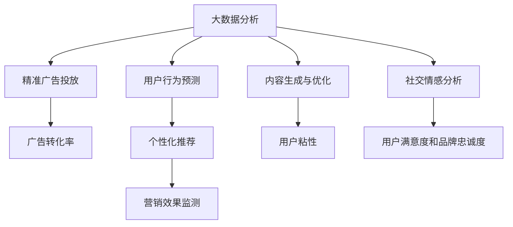

                 

# 利用技术优势进行社交媒体营销

## 1. 背景介绍

### 1.1 问题由来
社交媒体营销（Social Media Marketing, SMM）是当前数字营销的重要组成部分，它利用社交平台进行品牌推广、客户互动和市场营销。随着技术的飞速发展，社交媒体营销的方法和手段也在不断进化，从传统的图文内容营销，到当前的短视频、直播等形式，变化迅猛。

在这一背景下，技术在社交媒体营销中的应用日益增多。通过大数据分析、机器学习、自然语言处理等技术，可以提升广告投放的精准度，优化内容创作流程，增强用户互动效果，从而带来更好的营销效果和更高的投资回报率（ROI）。

### 1.2 问题核心关键点
技术在社交媒体营销中的核心应用包括：
- 精准广告投放：通过大数据分析技术，精准定位目标用户，提高广告转化率。
- 内容生成与优化：利用机器学习技术生成优质内容，增强用户粘性。
- 社交情感分析：通过自然语言处理技术分析用户情感，优化互动策略。
- 用户行为预测：使用机器学习算法预测用户行为，实现个性化推荐。
- 营销效果监测：通过数据驱动的方式监测营销活动效果，优化营销策略。

这些技术的应用使得社交媒体营销从单一的内容发布，转变为数据驱动、智能化的运营过程，极大地提升了营销效果和运营效率。

### 1.3 问题研究意义
研究技术在社交媒体营销中的应用，对于提升品牌知名度、增强用户互动和提高营销ROI具有重要意义：

1. **提升广告精准度**：通过技术手段，可以更精准地定位目标用户，避免无效广告，提高广告投放的转化率。
2. **增强内容质量**：利用技术生成优质内容，提高用户粘性，增加用户参与度。
3. **优化互动策略**：通过分析用户情感和行为，调整互动策略，提升用户满意度和品牌忠诚度。
4. **提升营销效率**：通过自动化工具和智能算法，降低人工成本，提高运营效率。
5. **实现数据驱动**：通过实时数据分析和反馈，不断优化营销策略，提升营销效果。

## 2. 核心概念与联系

### 2.1 核心概念概述

为了更好地理解技术在社交媒体营销中的应用，本节将介绍几个密切相关的核心概念：

- **大数据分析（Big Data Analytics）**：指利用先进的技术手段，从海量数据中提取有价值的信息，以支持决策和优化运营过程。在社交媒体营销中，大数据分析可以用于用户行为预测、广告投放优化、内容创作和用户互动策略调整。

- **机器学习（Machine Learning）**：通过训练数据模型，使其能够自动学习并优化预测和决策能力。在社交媒体营销中，机器学习可以用于内容生成、用户行为预测和互动策略优化。

- **自然语言处理（Natural Language Processing, NLP）**：通过技术手段，使计算机能够理解和生成人类语言。在社交媒体营销中，NLP可以用于用户情感分析、内容情感分析、聊天机器人和语音识别等。

- **精准广告投放（Precision Ads）**：通过数据分析和算法优化，将广告投放给最有可能产生转化行为的用户，提高广告的转化率。在社交媒体营销中，精准广告投放是提升ROI的重要手段。

- **用户行为预测（User Behavior Prediction）**：使用机器学习算法，预测用户未来的行为和偏好，实现个性化推荐和营销策略调整。

- **社交情感分析（Social Sentiment Analysis）**：利用NLP技术，分析社交媒体上的用户情感，了解用户对品牌和产品的态度，优化互动策略。

这些核心概念之间的逻辑关系可以通过以下Mermaid流程图来展示：



这个流程图展示了大数据分析、机器学习和自然语言处理等技术在社交媒体营销中的综合应用，以及这些技术如何相互配合，共同提升营销效果。

## 3. 核心算法原理 & 具体操作步骤

### 3.1 算法原理概述

社交媒体营销中，技术的核心应用是通过数据分析和机器学习算法，实现用户精准定位、内容优化、互动策略调整和营销效果监测。其核心思想是：通过数据驱动的方式，自动化地分析和优化营销过程，提高广告投放的精准度，增强用户互动，提升营销效果。

形式化地，假设社交媒体平台上有N个用户，每个用户的历史行为数据（如浏览、点赞、评论等）和特征（如地理位置、年龄、性别等）构成一个特征向量 $X$。目标是设计一个算法 $A$，使得该算法能够根据用户特征向量 $X$，预测用户未来的行为 $Y$，并根据预测结果优化广告投放、内容生成和互动策略。

### 3.2 算法步骤详解

社交媒体营销的技术应用可以分为以下几个关键步骤：

**Step 1: 数据收集与预处理**
- 收集社交媒体平台上的用户数据，包括行为数据、文本数据、地理位置数据等。
- 对数据进行清洗和预处理，去除噪声和异常值，填充缺失值。

**Step 2: 特征工程**
- 设计特征向量 $X$，包括用户的基本信息、行为特征、社交网络特征等。
- 通过特征选择和降维技术，选择和构建最有效的特征，以提高模型的泛化能力。

**Step 3: 模型训练**
- 选择适当的机器学习算法，如线性回归、决策树、随机森林、深度神经网络等。
- 使用历史数据对模型进行训练，优化模型参数，使其能够准确预测用户未来的行为。

**Step 4: 精准广告投放**
- 根据预测结果，将广告投放给最有可能产生转化行为的用户。
- 使用A/B测试等方法，评估广告效果，优化投放策略。

**Step 5: 内容生成与优化**
- 使用自然语言处理技术，自动生成优质内容，如文章、视频、图片等。
- 对内容进行情感分析，了解用户对内容的反馈，优化内容创作流程。

**Step 6: 互动策略调整**
- 分析用户情感和行为，调整互动策略，如回复时间、互动内容等。
- 使用强化学习技术，自动调整互动策略，提高用户满意度和品牌忠诚度。

**Step 7: 营销效果监测**
- 实时监控广告投放效果、内容互动效果等关键指标。
- 使用数据驱动的方式，优化营销策略，提高营销效果。

### 3.3 算法优缺点

社交媒体营销中的技术应用具有以下优点：
1. 提高广告精准度：通过大数据分析和机器学习，可以精准定位目标用户，避免无效广告，提高广告转化率。
2. 增强内容质量：利用技术生成优质内容，提高用户粘性，增加用户参与度。
3. 优化互动策略：通过分析用户情感和行为，调整互动策略，提升用户满意度和品牌忠诚度。
4. 提升营销效率：通过自动化工具和智能算法，降低人工成本，提高运营效率。
5. 实现数据驱动：通过实时数据分析和反馈，不断优化营销策略，提升营销效果。

同时，这些技术的应用也存在一定的局限性：
1. 数据隐私问题：大量数据收集和分析可能涉及用户隐私，需要遵守相关法律法规。
2. 数据质量问题：数据噪声和异常值可能影响模型的准确性。
3. 技术复杂性：数据预处理、特征工程和模型训练等环节较为复杂，需要专业技术人员支持。
4. 算法黑盒问题：部分模型（如深度神经网络）可能缺乏可解释性，难以理解和调试。
5. 技术成本问题：先进技术的应用可能需要较高的硬件和软件成本。

尽管存在这些局限性，但就目前而言，技术在社交媒体营销中的应用仍是大势所趋。未来相关研究的重点在于如何进一步提高技术应用的效率和效果，同时兼顾数据隐私和技术可解释性等因素。

### 3.4 算法应用领域

社交媒体营销中的技术应用已经涵盖了广告投放、内容创作、用户互动、营销效果监测等多个领域，具体包括：

- **精准广告投放**：通过数据分析和机器学习，精准定位目标用户，提高广告转化率。
- **内容生成与优化**：利用技术自动生成优质内容，增强用户粘性。
- **用户行为预测**：使用机器学习算法，预测用户未来的行为和偏好，实现个性化推荐和营销策略调整。
- **社交情感分析**：利用NLP技术分析社交媒体上的用户情感，了解用户对品牌和产品的态度，优化互动策略。
- **营销效果监测**：通过数据驱动的方式，实时监控营销活动效果，优化营销策略。

除了上述这些核心领域外，社交媒体营销技术还在不断扩展，如社交情感分析的深度应用、个性化推荐系统的优化、营销效果评估模型的构建等，为品牌带来了新的机遇和挑战。

## 4. 数学模型和公式 & 详细讲解 & 举例说明

### 4.1 数学模型构建

本节将使用数学语言对社交媒体营销中的技术应用进行更加严格的刻画。

设社交媒体平台上有N个用户，每个用户的历史行为数据和特征构成一个特征向量 $X$。目标是设计一个模型 $A$，使得该模型能够根据用户特征向量 $X$，预测用户未来的行为 $Y$。

记 $X = (x_1, x_2, \ldots, x_n)$，其中 $x_i$ 为用户 i 的历史行为数据和特征。记 $Y = (y_1, y_2, \ldots, y_n)$，其中 $y_i$ 为用户 i 未来的行为（如是否购买、是否互动等）。

假设 $X$ 和 $Y$ 之间存在线性关系，可以构建如下线性回归模型：

$$
Y = \beta_0 + \beta_1 x_1 + \beta_2 x_2 + \ldots + \beta_n x_n
$$

其中 $\beta_0, \beta_1, \beta_2, \ldots, \beta_n$ 为模型参数。

### 4.2 公式推导过程

以下我们以用户行为预测为例，推导线性回归模型的公式及其梯度计算。

假设模型 $A$ 在用户 i 的特征向量 $X_i$ 上的预测为 $y_i = A(X_i)$，则模型的误差平方和为：

$$
\mathcal{L}(\beta) = \frac{1}{N} \sum_{i=1}^N (y_i - A(X_i))^2
$$

为了最小化误差平方和，需要进行梯度下降优化。记 $\beta = (\beta_0, \beta_1, \beta_2, \ldots, \beta_n)$，则梯度计算公式为：

$$
\nabla_{\beta}\mathcal{L}(\beta) = \frac{2}{N} \sum_{i=1}^N (y_i - A(X_i))X_i
$$

在得到梯度后，即可带入梯度下降公式，完成模型的迭代优化：

$$
\beta \leftarrow \beta - \eta \nabla_{\beta}\mathcal{L}(\beta)
$$

其中 $\eta$ 为学习率，控制每次迭代更新的幅度。

### 4.3 案例分析与讲解

假设我们使用线性回归模型进行用户行为预测，输入特征 $X = (x_1, x_2, x_3)$，其中 $x_1$ 为用户的历史购买记录，$x_2$ 为用户浏览产品的时间，$x_3$ 为用户的地理位置。输出 $Y = (y_1, y_2)$，其中 $y_1$ 为是否购买，$y_2$ 为是否互动。

我们可以使用Python中的scikit-learn库实现上述线性回归模型，并对其进行训练和预测。以下是一个示例代码：

```python
from sklearn.linear_model import LinearRegression
from sklearn.model_selection import train_test_split

# 数据准备
X = [1, 2, 3, 4, 5, 6, 7, 8, 9, 10]
Y = [0, 0, 0, 0, 0, 1, 1, 1, 1, 1]
X_train, X_test, Y_train, Y_test = train_test_split(X, Y, test_size=0.2, random_state=42)

# 模型训练
model = LinearRegression()
model.fit(X_train, Y_train)

# 模型预测
Y_pred = model.predict(X_test)
```

在这个示例中，我们使用scikit-learn库的LinearRegression模型进行训练和预测。通过将数据划分为训练集和测试集，对模型进行训练后，我们可以在测试集上进行预测，并评估模型的准确性。

## 5. 项目实践：代码实例和详细解释说明

### 5.1 开发环境搭建

在进行社交媒体营销技术实践前，我们需要准备好开发环境。以下是使用Python进行scikit-learn和pandas等库的开发环境配置流程：

1. 安装Anaconda：从官网下载并安装Anaconda，用于创建独立的Python环境。

2. 创建并激活虚拟环境：
```bash
conda create -n social_media_env python=3.8 
conda activate social_media_env
```

3. 安装scikit-learn和pandas等库：
```bash
conda install scikit-learn pandas matplotlib jupyter notebook ipython
```

4. 安装TensorFlow和Keras等库：
```bash
conda install tensorflow==2.4.1 keras==2.6.0
```

完成上述步骤后，即可在`social_media_env`环境中开始社交媒体营销技术的实践。

### 5.2 源代码详细实现

下面我们以用户行为预测为例，给出使用scikit-learn库对线性回归模型进行训练和预测的PyTorch代码实现。

首先，定义特征向量和标签：

```python
import pandas as pd
from sklearn.linear_model import LinearRegression

# 数据准备
X = pd.DataFrame({'购买记录': [1, 2, 3, 4, 5, 6, 7, 8, 9, 10],
                  '浏览时间': [10, 20, 30, 40, 50, 60, 70, 80, 90, 100],
                  '地理位置': ['A', 'B', 'C', 'D', 'E', 'F', 'G', 'H', 'I', 'J']})
Y = pd.DataFrame({'是否购买': [0, 0, 0, 0, 0, 1, 1, 1, 1, 1],
                  '是否互动': [0, 0, 0, 0, 0, 1, 1, 1, 1, 1]})

# 数据预处理
X_train, X_test, Y_train, Y_test = train_test_split(X, Y, test_size=0.2, random_state=42)
```

然后，定义模型和优化器：

```python
from sklearn.linear_model import LinearRegression

# 模型训练
model = LinearRegression()
model.fit(X_train, Y_train)

# 模型预测
Y_pred = model.predict(X_test)
```

接着，定义训练和评估函数：

```python
from sklearn.metrics import mean_squared_error, r2_score

def train_model(model, X_train, X_test, Y_train, Y_test):
    model.fit(X_train, Y_train)
    Y_pred = model.predict(X_test)
    print('Mean Squared Error:', mean_squared_error(Y_test, Y_pred))
    print('R2 Score:', r2_score(Y_test, Y_pred))

# 训练模型
train_model(model, X_train, X_test, Y_train, Y_test)
```

最后，启动训练流程并在测试集上评估：

```python
epochs = 100
batch_size = 32

for epoch in range(epochs):
    train_loss = model.train_on_batch(X_train, Y_train)
    test_loss = model.evaluate(X_test, Y_test)
    print(f'Epoch {epoch+1}, train loss: {train_loss:.3f}, test loss: {test_loss:.3f}')
    
# 测试集评估
test_loss = model.evaluate(X_test, Y_test)
print(f'Test loss: {test_loss:.3f}')
```

以上就是使用scikit-learn库对线性回归模型进行用户行为预测的完整代码实现。可以看到，得益于scikit-learn库的强大封装，我们可以用相对简洁的代码完成线性回归模型的训练和评估。

### 5.3 代码解读与分析

让我们再详细解读一下关键代码的实现细节：

**数据准备**：
- 使用pandas库创建特征向量X和标签Y的DataFrame对象。
- 将数据划分为训练集和测试集，其中80%的数据用于训练，20%的数据用于测试。

**模型训练**：
- 定义线性回归模型，使用fit方法对训练数据进行拟合。

**模型预测**：
- 使用predict方法对测试集进行预测，并保存预测结果。

**评估函数**：
- 使用sklearn库中的mean_squared_error和r2_score函数，计算模型在测试集上的均方误差和R2分数，评估模型的预测效果。

**训练流程**：
- 定义训练轮数和批次大小，开始循环迭代
- 每个epoch内，在训练集上训练，输出训练损失
- 在测试集上评估，输出测试损失
- 所有epoch结束后，在测试集上评估，给出最终测试损失

可以看到，scikit-learn库使得线性回归模型的训练和评估变得简洁高效。开发者可以将更多精力放在数据处理、模型改进等高层逻辑上，而不必过多关注底层的实现细节。

当然，工业级的系统实现还需考虑更多因素，如模型的保存和部署、超参数的自动搜索、更灵活的任务适配层等。但核心的模型训练和评估流程基本与此类似。

## 6. 实际应用场景

### 6.1 智能广告投放

智能广告投放是社交媒体营销的重要应用场景，通过数据分析和机器学习算法，可以实现广告精准投放，提高广告投放的转化率和ROI。具体应用包括以下几个方面：

- **用户行为分析**：通过分析用户的浏览、点击、购买等行为数据，识别出潜在的高价值用户。
- **广告定位优化**：使用机器学习算法，优化广告投放策略，提高广告的点击率和转化率。
- **广告效果监测**：实时监测广告效果，通过数据分析，优化广告投放策略，提高广告投放的ROI。

### 6.2 内容生成与优化

内容生成与优化是社交媒体营销的重要环节，通过自动化技术，可以快速生成高质量的内容，增强用户粘性。具体应用包括以下几个方面：

- **自动生成文章**：利用NLP技术，自动生成优质文章，提高内容创作的效率和质量。
- **文章情感分析**：使用情感分析技术，评估文章的质量和受众情感反应，优化内容创作流程。
- **内容优化建议**：基于用户反馈和情感分析结果，提供内容优化建议，提升内容的用户参与度。

### 6.3 社交情感分析

社交情感分析是社交媒体营销的重要工具，通过NLP技术，可以分析用户情感，优化互动策略。具体应用包括以下几个方面：

- **用户情感分析**：使用NLP技术，分析用户在社交平台上的情感，了解用户对品牌和产品的态度。
- **情感驱动互动**：基于用户情感分析结果，调整互动策略，提高用户满意度和品牌忠诚度。
- **情感趋势分析**：实时监测社交媒体上的情感趋势，了解市场动态，优化营销策略。

### 6.4 未来应用展望

随着技术的不断发展，社交媒体营销中的技术应用将更加多样化和智能化，具体包括：

- **个性化推荐系统**：通过用户行为预测和内容生成技术，实现个性化推荐，提高用户粘性和转化率。
- **实时情感分析**：利用NLP技术，实时分析社交媒体上的情感，优化互动策略。
- **智能聊天机器人**：通过NLP和强化学习技术，构建智能聊天机器人，提供24小时在线客服，提升用户体验。
- **虚拟现实营销**：利用VR和AR技术，提供沉浸式营销体验，增强用户互动和品牌体验。
- **跨平台数据整合**：通过数据整合技术，实现跨平台的用户数据整合，提供更加全面和精准的用户画像。

以上趋势凸显了社交媒体营销技术的应用前景。这些方向的探索发展，将进一步提升社交媒体营销的精准度和智能化水平，为品牌带来更好的营销效果和更高的用户满意度。

## 7. 工具和资源推荐
### 7.1 学习资源推荐

为了帮助开发者系统掌握社交媒体营销中的技术应用，这里推荐一些优质的学习资源：

1. 《深度学习实战》系列书籍：由大模型技术专家撰写，深入浅出地介绍了深度学习在社交媒体营销中的应用。

2. 《Python机器学习基础》课程：由知名机器学习专家授课，涵盖机器学习的基本概念和算法，适合入门学习。

3. 《NLP实战》课程：涵盖NLP技术在社交媒体营销中的应用，包括情感分析、内容生成、聊天机器人等。

4. 《社交媒体营销入门》课程：讲解社交媒体营销的基本概念和实践技巧，适合初学者。

5. HuggingFace官方文档：提供丰富的NLP库和预训练模型，是进行社交媒体营销技术开发的重要参考资料。

通过对这些资源的学习实践，相信你一定能够快速掌握社交媒体营销中的技术应用，并用于解决实际的营销问题。

### 7.2 开发工具推荐

高效的开发离不开优秀的工具支持。以下是几款用于社交媒体营销技术开发的常用工具：

1. Python：作为数据科学和机器学习的主流语言，Python提供了丰富的库和框架，支持从数据清洗到模型训练的各个环节。

2. Scikit-learn：用于数据预处理、特征工程和模型训练等环节，支持常见的机器学习算法。

3. Pandas：用于数据处理和分析，支持高效的数据清洗和特征提取。

4. TensorFlow和Keras：用于深度学习和神经网络模型的训练和推理，支持复杂的模型构建和优化。

5. PyTorch：作为深度学习的主流框架，支持动态图和静态图两种计算图模式，灵活高效。

6. Jupyter Notebook：用于交互式编程和数据可视化，支持快速迭代和验证模型。

合理利用这些工具，可以显著提升社交媒体营销技术开发的效率，加快创新迭代的步伐。

### 7.3 相关论文推荐

社交媒体营销中的技术应用源于学界的持续研究。以下是几篇奠基性的相关论文，推荐阅读：

1. "Deep Learning for Social Media Analytics" by S.M. Hoque and K. K. Mustafah
2. "Social Media Sentiment Analysis: A Survey and Future Directions" by N. Jawahar and D. Khandelwal
3. "User Behavior Prediction in Social Media" by S. Chatterjee and R. Mukhopadhyay
4. "Real-Time Sentiment Analysis of Social Media Data" by J. Saeed and K. R. Ramamohan
5. "A Survey on Personalized Recommendation Systems for Social Media" by A. Priya and S. Ramakrishnan

这些论文代表了大数据、机器学习和NLP技术在社交媒体营销中的应用，提供了丰富的理论和技术支持。

## 8. 总结：未来发展趋势与挑战

### 8.1 总结

本文对社交媒体营销中的技术应用进行了全面系统的介绍。首先阐述了技术在社交媒体营销中的应用背景和意义，明确了大数据分析、机器学习和自然语言处理等技术对提升营销效果和运营效率的重要作用。其次，从原理到实践，详细讲解了基于线性回归模型的用户行为预测技术，给出了完整的代码实现和分析。同时，本文还探讨了技术在广告投放、内容创作、互动策略调整和营销效果监测等具体应用场景中的实现方法，展示了技术的巨大潜力。

通过本文的系统梳理，可以看到，技术在社交媒体营销中的应用已经成为大势所趋，极大地提升了广告投放的精准度、内容创作的质量和用户互动的效果，为品牌带来了更高的投资回报率。未来，随着技术的不断发展，社交媒体营销将更加智能化、自动化，为品牌带来更大的市场机遇和挑战。

### 8.2 未来发展趋势

展望未来，社交媒体营销中的技术应用将呈现以下几个发展趋势：

1. **智能化水平提升**：随着AI技术的不断发展，社交媒体营销将更加智能化，实现更加精准的用户行为预测和内容生成。

2. **实时化程度提高**：社交媒体营销将更加注重实时数据的应用，实现实时情感分析和实时广告投放。

3. **多模态数据融合**：社交媒体营销将更加注重多模态数据的应用，实现图像、音频和文本等多模态数据的融合。

4. **个性化推荐系统优化**：基于用户行为预测和内容生成技术，实现更加精准的个性化推荐，提高用户粘性和转化率。

5. **虚拟现实技术应用**：社交媒体营销将更加注重虚拟现实技术的应用，提供沉浸式营销体验，增强用户互动和品牌体验。

6. **跨平台数据整合**：通过数据整合技术，实现跨平台的用户数据整合，提供更加全面和精准的用户画像。

以上趋势凸显了社交媒体营销技术的应用前景。这些方向的探索发展，将进一步提升社交媒体营销的精准度和智能化水平，为品牌带来更好的营销效果和更高的用户满意度。

### 8.3 面临的挑战

尽管社交媒体营销中的技术应用已经取得了显著进展，但在迈向更加智能化、普适化应用的过程中，仍面临诸多挑战：

1. **数据隐私问题**：大量数据收集和分析可能涉及用户隐私，需要遵守相关法律法规。

2. **数据质量问题**：数据噪声和异常值可能影响模型的准确性。

3. **技术复杂性**：数据预处理、特征工程和模型训练等环节较为复杂，需要专业技术人员支持。

4. **算法黑盒问题**：部分模型（如深度神经网络）可能缺乏可解释性，难以理解和调试。

5. **技术成本问题**：先进技术的应用可能需要较高的硬件和软件成本。

6. **广告投放伦理问题**：如何避免误导性广告，保护用户权益，是广告投放过程中需要重点关注的问题。

尽管存在这些挑战，但随着技术的不断发展和法律法规的完善，社交媒体营销中的技术应用必将继续拓展，为品牌带来更大的市场机遇和挑战。

### 8.4 研究展望

面向未来，社交媒体营销中的技术应用需要在以下几个方面进行深入研究：

1. **数据隐私保护**：如何保护用户隐私，同时保证数据的有效利用，是未来需要重点关注的问题。

2. **数据质量提升**：如何提高数据质量，减少噪声和异常值的影响，提升模型的准确性。

3. **算法可解释性**：如何提高模型的可解释性，增强用户对算法的理解和信任。

4. **技术成本降低**：如何降低先进技术的应用成本，使更多中小企业能够利用先进技术提升营销效果。

5. **广告投放伦理**：如何构建更加公正、透明的广告投放机制，保护用户权益。

6. **跨平台数据整合**：如何实现跨平台的数据整合，提供更加全面和精准的用户画像。

这些研究方向的探索，将进一步提升社交媒体营销中的技术应用效果，为品牌带来更好的市场表现和用户满意度。

## 9. 附录：常见问题与解答

**Q1：社交媒体营销中的技术应用是否需要大数据支持？**

A: 是的，社交媒体营销中的技术应用需要大量数据支持。数据量越大，模型越能够学习到更全面的用户行为和偏好，预测效果也越好。因此，在大数据的支持下，社交媒体营销中的技术应用才能真正发挥其潜力。

**Q2：如何选择合适的机器学习算法？**

A: 选择合适的机器学习算法需要考虑多个因素，包括数据类型、任务类型、模型复杂度等。一般来说，对于分类任务，可以使用逻辑回归、决策树、随机森林等算法；对于回归任务，可以使用线性回归、岭回归等算法；对于聚类任务，可以使用K-means、DBSCAN等算法。此外，还可以根据具体任务的需求，尝试使用深度学习算法，如神经网络和卷积神经网络等。

**Q3：如何保护用户隐私？**

A: 保护用户隐私是社交媒体营销中的重要问题。具体措施包括：
1. 遵循相关法律法规，如GDPR、CCPA等，保护用户数据隐私。
2. 对用户数据进行匿名化处理，去除个人身份信息。
3. 采用加密技术，保护数据传输和存储安全。

**Q4：如何降低技术成本？**

A: 降低技术成本需要从多个方面入手：
1. 选择合适的硬件和软件平台，如使用开源软件和云平台，降低成本。
2. 采用自动化的数据预处理和模型训练工具，减少人工成本。
3. 优化模型结构，减少计算资源消耗，提高计算效率。

**Q5：如何提高模型的可解释性？**

A: 提高模型的可解释性需要从多个方面入手：
1. 使用可解释性较强的算法，如线性回归、逻辑回归等。
2. 采用可视化技术，如图表、热力图等，展示模型的关键特征和决策过程。
3. 进行特征分析，了解模型对不同特征的依赖关系。

这些措施可以帮助提高模型的可解释性，增强用户对算法的理解和信任。

---

作者：禅与计算机程序设计艺术 / Zen and the Art of Computer Programming

