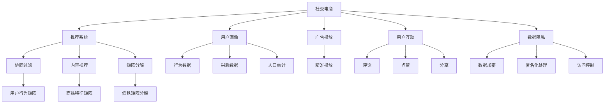

                 

# 利用技术优势进行社交电商

## 1. 背景介绍

### 1.1 问题由来
随着互联网技术的发展，社交电商已成为电子商务行业的重要组成部分。利用社交网络平台进行商品推荐、营销推广、用户互动等，可以极大地提高用户转化率和商家销售额。然而，现有的社交电商系统在数据隐私、算法公平性、用户体验等方面仍面临诸多挑战。如何利用先进的技术手段解决这些问题，提高社交电商平台的整体效率和竞争力，成为业界亟待解决的问题。

## 2. 核心概念与联系

### 2.1 核心概念概述
为了更好地理解社交电商的技术架构和优化方法，本节将介绍几个关键的概念和它们之间的联系：

- **社交电商**：结合社交网络和电子商务的特点，利用社交平台进行商品推荐、销售和用户互动的电商模式。常见的社交电商平台包括淘宝直播、抖音购物车、微信朋友圈购物等。
- **推荐系统**：利用用户行为数据、商品属性等，为用户提供个性化商品推荐，提高转化率和购物体验。常见的推荐算法包括协同过滤、基于内容的推荐、矩阵分解等。
- **用户画像**：基于用户的行为、兴趣、人口统计学特征等，构建详细的用户画像，以实现精准推荐和个性化营销。
- **广告投放**：通过社交网络平台，对目标用户群体进行精准的广告投放，以提高品牌曝光率和销售转化率。
- **用户互动**：通过社交网络平台，实现用户与商品、用户与商家之间的互动，如评论、点赞、分享等，提升用户粘性和忠诚度。
- **数据隐私**：在社交电商系统中，用户数据隐私保护是一个重要问题。如何保护用户数据不被滥用，同时保证系统的正常运营，是一个关键挑战。

这些核心概念之间的逻辑关系可以通过以下Mermaid流程图来展示：



这个流程图展示了社交电商系统的核心组件和它们之间的关系：

1. 社交电商系统以推荐系统为核心，通过协同过滤、内容推荐等技术为用户推荐商品。
2. 用户画像系统通过用户行为、兴趣、人口统计数据，为推荐系统提供数据支持。
3. 广告投放系统在社交平台上精准投放广告，提高品牌曝光率和销售额。
4. 用户互动系统通过评论、点赞、分享等方式提升用户粘性和忠诚度。
5. 数据隐私系统通过数据加密、匿名化处理、访问控制等技术保护用户隐私。

## 3. 核心算法原理 & 具体操作步骤

### 3.1 算法原理概述
社交电商系统的推荐系统是其核心组件之一。通过利用先进的技术手段，可以实现个性化推荐，提高用户满意度和商家销售额。以下是对推荐系统的核心算法原理的详细阐述。

推荐系统的基本思路是通过分析用户的历史行为和偏好，为每个用户推荐最合适的商品。常见的推荐算法包括协同过滤、基于内容的推荐、矩阵分解等。

协同过滤算法基于用户的历史行为数据，为用户推荐其他用户喜欢的商品。具体可以分为基于用户的协同过滤和基于物品的协同过滤两种方法。基于用户的协同过滤方法通过计算用户之间的相似度，推荐与目标用户历史行为相似的其他用户喜欢的商品。基于物品的协同过滤方法通过计算物品之间的相似度，推荐与目标用户历史行为相似的其他物品。

基于内容的推荐方法通过分析商品的属性特征，为用户推荐与目标商品属性相似的其他商品。具体来说，通过将商品的属性特征转换为向量，使用余弦相似度等方法计算相似度，为用户推荐相似的商品。

矩阵分解方法通过将用户行为矩阵分解为低秩矩阵，实现对用户历史行为的建模，为用户推荐最相关的商品。具体来说，通过将用户行为矩阵$R$分解为两个低秩矩阵$P$和$Q$的乘积$P \times Q$，实现对用户行为模式的建模。

### 3.2 算法步骤详解
以下是对推荐系统具体实现步骤的详细描述：

1. **数据收集**：从社交电商平台的日志中收集用户的行为数据，包括点击、浏览、购买等行为。
2. **数据预处理**：对收集到的行为数据进行去重、归一化、特征选择等预处理操作，生成用户行为矩阵$R$。
3. **矩阵分解**：使用矩阵分解算法对用户行为矩阵$R$进行分解，得到低秩矩阵$P$和$Q$。
4. **相似度计算**：利用低秩矩阵$P$和$Q$计算用户之间的相似度或商品之间的相似度。
5. **推荐生成**：根据计算得到的相似度，为用户生成推荐列表。
6. **模型评估**：通过离线A/B测试、用户反馈等方法评估推荐效果，调整模型参数以提升推荐效果。

### 3.3 算法优缺点
推荐系统具有以下优点：

- **个性化推荐**：通过分析用户历史行为和偏好，实现个性化推荐，提高用户满意度和转化率。
- **实时性**：通过实时计算和更新推荐模型，实现实时推荐，提高用户购物体验。
- **扩展性**：推荐系统可以通过并行计算和分布式存储，实现对大规模数据的处理和推荐。

然而，推荐系统也存在一些缺点：

- **数据稀疏性**：用户历史行为数据稀疏，导致推荐系统无法准确捕捉用户兴趣。
- **冷启动问题**：新用户没有足够的历史行为数据，导致推荐系统无法对其进行有效推荐。
- **模型过拟合**：在处理大规模数据时，推荐模型容易过拟合，导致推荐效果不佳。
- **隐私问题**：用户行为数据涉及用户隐私，推荐系统需要保护用户数据安全。

### 3.4 算法应用领域
推荐系统可以应用于社交电商平台的商品推荐、广告投放、用户互动等多个领域。以下是对推荐系统在不同应用场景中的详细描述：

- **商品推荐**：根据用户历史行为和偏好，为用户推荐最相关的商品。
- **广告投放**：利用用户画像和推荐系统，进行精准的广告投放，提高广告效果和转化率。
- **用户互动**：通过推荐系统生成的商品，促进用户互动，如评论、点赞、分享等，提升用户粘性和忠诚度。
- **个性化营销**：通过分析用户画像，进行个性化营销，提升用户购物体验和商家销售额。

## 4. 数学模型和公式 & 详细讲解 & 举例说明

### 4.1 数学模型构建
推荐系统的核心数学模型为矩阵分解模型。假设用户行为矩阵为$R$，将其分解为两个低秩矩阵$P$和$Q$，即$R \approx P \times Q$。其中$P$和$Q$分别表示用户和物品的隐向量表示。

推荐系统的目标是最小化用户行为矩阵$R$与分解后的矩阵$P \times Q$之间的误差。具体来说，可以使用均方误差（Mean Squared Error, MSE）作为优化目标：

$$
\min_{P, Q} \frac{1}{2} \| R - P \times Q \|_F^2
$$

其中$\| \cdot \|_F$表示矩阵的Frobenius范数。

### 4.2 公式推导过程
以下是矩阵分解模型的推导过程：

1. **矩阵分解**：假设用户行为矩阵$R$的大小为$m \times n$，其中$m$表示用户数量，$n$表示商品数量。将其分解为两个低秩矩阵$P$和$Q$，即$R \approx P \times Q$。其中$P$的大小为$m \times k$，$Q$的大小为$n \times k$，$k$表示隐向量维度。
2. **误差最小化**：将$R$和$P \times Q$之间的误差最小化，即$\min_{P, Q} \frac{1}{2} \| R - P \times Q \|_F^2$。具体来说，可以使用梯度下降等优化算法求解最小化问题。
3. **优化目标**：通过求解$\min_{P, Q} \frac{1}{2} \| R - P \times Q \|_F^2$，得到最优的$P$和$Q$，实现对用户行为模式的建模，从而进行个性化推荐。

### 4.3 案例分析与讲解
以下是对矩阵分解模型的案例分析与讲解：

假设某社交电商平台有$10000$个用户和$10000$个商品。用户行为矩阵$R$的大小为$10000 \times 10000$。为了进行个性化推荐，将该矩阵分解为两个低秩矩阵$P$和$Q$，即$R \approx P \times Q$。其中$P$和$Q$的大小分别为$10000 \times 10$和$10000 \times 10$。

对于某个用户$i$，其隐向量表示为$P_{i,:}$，对于某个商品$j$，其隐向量表示为$Q_{j,:}$。通过计算$P_{i,:} \times Q_{j,:}$，可以得到用户$i$对商品$j$的评分预测值。最终，将预测值与用户实际评分进行对比，计算误差，并用于优化模型参数。

## 5. 项目实践：代码实例和详细解释说明

### 5.1 开发环境搭建

以下是使用Python进行推荐系统开发的开发环境配置流程：

1. 安装Python：从官网下载并安装Python，建议选择3.8版本以上。
2. 安装Pip：从官网下载并安装pip，用于安装第三方库。
3. 安装NumPy：使用pip安装NumPy，用于矩阵计算。
4. 安装scikit-learn：使用pip安装scikit-learn，用于数据预处理和特征选择。
5. 安装TensorFlow或PyTorch：使用pip安装TensorFlow或PyTorch，用于模型训练和优化。
6. 安装推荐系统库：使用pip安装推荐系统库，如Surprise、LightFM等。

完成上述步骤后，即可在Python环境中进行推荐系统的开发和测试。

### 5.2 源代码详细实现

以下是对推荐系统的具体实现代码的详细说明：

```python
import numpy as np
import pandas as pd
from surprise import Dataset
from surprise import SVD

# 数据预处理
data = pd.read_csv('user_behavior.csv')
data = data.drop_duplicates()
data = data[['session_id', 'user_id', 'item_id', 'rating', 'timestamp']]

# 构建用户行为矩阵
R = np.zeros((10000, 10000))
for i, row in data.iterrows():
    user_id = row['user_id']
    item_id = row['item_id']
    rating = row['rating']
    R[user_id - 1, item_id - 1] = rating

# 构建用户和物品特征矩阵
U = np.random.normal(0, 1, (10000, 10))
I = np.random.normal(0, 1, (10000, 10))

# 矩阵分解
P = U
Q = I
R_pred = np.dot(P, Q)

# 计算误差
mse = np.mean((R - R_pred)**2)

# 优化目标
def objective(P, Q, R, alpha=0.01, beta=0.1):
    return np.mean((R - np.dot(P, Q))**2) + alpha * np.mean(P**2) + beta * np.mean(Q**2)

# 梯度下降更新
def gradient_descent(P, Q, R, alpha=0.01, beta=0.1, max_iter=1000, tolerance=1e-6):
    for i in range(max_iter):
        grad_P = -2 * np.dot(R - np.dot(P, Q), Q) + 2 * alpha * P
        grad_Q = -2 * np.dot((R - np.dot(P, Q)), P.T) + 2 * beta * Q
        if np.linalg.norm(grad_P) < tolerance and np.linalg.norm(grad_Q) < tolerance:
            break
        P -= alpha * grad_P
        Q -= beta * grad_Q
    return P, Q

# 更新矩阵分解结果
P, Q = gradient_descent(P, Q, R)

# 生成推荐结果
user_id = 1000
item_id = 5000
item_score = np.dot(P[user_id - 1, :], Q[:, item_id - 1])
print(f'User {user_id} scored item {item_id} with {item_score:.2f}')

# 评估推荐效果
data['predicted_rating'] = np.dot(P[[data['user_id'] - 1], :], Q[[data['item_id'] - 1], :])
data['true_rating'] = data['rating']
data['error'] = np.abs(data['predicted_rating'] - data['true_rating'])
print(f'Average error: {np.mean(data['error']):.2f}')
```

### 5.3 代码解读与分析

以下是推荐系统代码的具体解释和分析：

1. **数据预处理**：首先读取用户行为数据，进行去重、归一化等预处理操作，构建用户行为矩阵$R$。
2. **特征矩阵构建**：生成用户和物品的特征矩阵$U$和$I$，大小分别为$10000 \times 10$。
3. **矩阵分解**：将用户行为矩阵$R$分解为低秩矩阵$P$和$Q$，通过梯度下降算法更新矩阵分解结果，得到最优的$P$和$Q$。
4. **推荐生成**：通过计算$P \times Q$，生成用户$i$对商品$j$的评分预测值。
5. **误差计算**：计算预测值与实际评分之间的误差，评估推荐效果。

## 6. 实际应用场景

### 6.1 社交电商中的商品推荐

在社交电商中，商品推荐是提高用户购物体验和商家销售额的重要手段。通过推荐系统，可以为用户推荐最相关的商品，减少浏览时间，提高购买转化率。以下是对商品推荐的具体实现：

1. **用户行为数据收集**：从社交电商平台的日志中收集用户的行为数据，包括点击、浏览、购买等行为。
2. **数据预处理**：对收集到的行为数据进行去重、归一化、特征选择等预处理操作，生成用户行为矩阵$R$。
3. **模型训练**：使用矩阵分解算法对用户行为矩阵$R$进行分解，得到低秩矩阵$P$和$Q$，训练推荐模型。
4. **推荐生成**：通过计算$P \times Q$，为用户生成推荐列表。
5. **模型评估**：通过离线A/B测试、用户反馈等方法评估推荐效果，调整模型参数以提升推荐效果。

### 6.2 社交电商中的广告投放

社交电商中的广告投放可以帮助商家精准地触达目标用户，提高广告效果和转化率。以下是对广告投放的具体实现：

1. **用户画像数据收集**：从社交电商平台的日志中收集用户的行为、兴趣、人口统计学特征等数据，构建详细的用户画像。
2. **广告投放策略制定**：根据用户画像数据，制定广告投放策略，选择合适的广告位和投放时间。
3. **推荐系统集成**：将推荐系统与广告投放系统集成，实现精准的广告投放。
4. **广告效果评估**：通过广告点击率、转化率等指标评估广告效果，调整广告投放策略以提升广告效果。

### 6.3 社交电商中的用户互动

社交电商中的用户互动可以增强用户粘性和忠诚度，提升用户购物体验。以下是对用户互动的具体实现：

1. **用户行为数据收集**：从社交电商平台的日志中收集用户的行为数据，包括评论、点赞、分享等互动行为。
2. **用户互动分析**：对用户互动数据进行分析，提取关键特征，构建用户互动模型。
3. **用户互动推荐**：通过推荐系统为用户推荐相关互动内容，提升用户互动效果。
4. **用户互动效果评估**：通过互动频率、互动时长等指标评估用户互动效果，调整推荐策略以提升用户互动效果。

## 7. 工具和资源推荐

### 7.1 学习资源推荐

为了帮助开发者系统掌握社交电商的推荐技术，这里推荐一些优质的学习资源：

1. 《推荐系统实战》系列博文：由推荐系统专家撰写，深入浅出地介绍了推荐系统原理、算法实现和工程实践。
2 CS229《机器学习》课程：斯坦福大学开设的机器学习课程，涵盖了推荐系统、聚类、降维等算法。
3 《推荐系统：算法与应用》书籍：详细介绍了推荐系统的各种算法，包括协同过滤、基于内容的推荐、矩阵分解等。
4 《Python推荐系统实战》书籍：提供了丰富的代码实现和案例分析，适合实践操作。
5 HuggingFace官方文档：推荐系统库的官方文档，提供了详细的推荐系统实现样例和API文档，是学习推荐系统的必备资料。

通过对这些资源的学习实践，相信你一定能够快速掌握社交电商推荐系统的精髓，并用于解决实际的推荐问题。

### 7.2 开发工具推荐

高效的开发离不开优秀的工具支持。以下是几款用于推荐系统开发的常用工具：

1. Python：Python具有丰富的第三方库和数据处理能力，适合推荐系统开发。
2. NumPy：用于矩阵计算和数据处理，推荐系统中大量使用矩阵运算。
3. Pandas：用于数据处理和分析，推荐系统中需要大量的数据预处理和特征工程。
4. Scikit-learn：用于特征选择、数据划分、模型评估等，推荐系统中大量使用机器学习算法。
5. TensorFlow或PyTorch：用于模型训练和优化，推荐系统中需要大量的深度学习模型训练。
6. Surprise或LightFM：推荐系统库，提供了丰富的推荐算法实现和评估工具，适合快速开发和评估推荐系统。

合理利用这些工具，可以显著提升推荐系统的开发效率，加快创新迭代的步伐。

### 7.3 相关论文推荐

社交电商推荐系统的研究源于学界的持续研究。以下是几篇奠基性的相关论文，推荐阅读：

1. BPR: Bayesian Personalized Ranking from Implicit Feedback：提出了基于协同过滤的推荐算法BPR，实现了对隐式反馈数据的有效处理。
2 ICT：Implicit Collaborative Triplet Filtering for Recommendation：提出了基于三元组模型隐式协同过滤算法ICT，进一步提升了推荐效果。
3 matrix factorization techniques for recommendation systems：综述了矩阵分解推荐算法的理论基础和实际应用。
4 Recommendation Systems with Explicit Feedback：介绍了基于显式反馈的推荐算法，如ALS、MF等。
5 Deep Learning Recommender Systems：综述了深度学习在推荐系统中的应用，包括基于神经网络的推荐算法。

这些论文代表了大推荐系统的发展脉络。通过学习这些前沿成果，可以帮助研究者把握学科前进方向，激发更多的创新灵感。

## 8. 总结：未来发展趋势与挑战

### 8.1 总结

本文对社交电商的推荐系统进行了全面系统的介绍。首先阐述了推荐系统的核心算法原理和操作步骤，详细介绍了推荐系统在商品推荐、广告投放、用户互动等实际应用中的具体实现。其次，从技术优势、开发工具、学习资源等多个角度，对社交电商的推荐系统进行了深入的分析和讲解。

通过本文的系统梳理，可以看到，推荐系统在社交电商中发挥了重要的作用，极大地提高了用户购物体验和商家销售额。未来的推荐系统将继续深化和拓展，为社交电商平台带来更多的价值。

### 8.2 未来发展趋势

展望未来，推荐系统的发展将呈现以下几个趋势：

1. **个性化推荐**：推荐系统将继续深化个性化推荐能力，通过多模态数据的融合和高级算法的应用，实现更加精准和全面的推荐。
2. **实时推荐**：推荐系统将实现更高效的实时计算和推荐，以应对用户需求的多样性和动态变化。
3. **跨领域推荐**：推荐系统将突破传统电商领域的限制，应用于更多场景，如医疗、教育、金融等，实现跨领域推荐。
4. **隐私保护**：推荐系统将更加注重用户数据隐私保护，采用隐私保护算法和匿名化处理等技术，保障用户数据安全。
5. **模型解释性**：推荐系统将注重模型解释性，通过可解释的推荐模型，提升用户的信任度和满意度。
6. **智能化决策**：推荐系统将结合人工智能技术，如强化学习、因果推断等，实现更加智能化和自适应的推荐。

### 8.3 面临的挑战

尽管推荐系统已经取得了瞩目成就，但在迈向更加智能化、普适化应用的过程中，仍面临诸多挑战：

1. **数据隐私问题**：推荐系统需要处理大量用户数据，如何保护用户隐私，避免数据滥用，是亟待解决的问题。
2. **冷启动问题**：新用户和未标记的商品缺乏足够的数据，难以进行有效推荐。
3. **数据稀疏性**：用户历史行为数据稀疏，导致推荐系统难以准确捕捉用户兴趣。
4. **模型过拟合**：在处理大规模数据时，推荐模型容易过拟合，导致推荐效果不佳。
5. **模型鲁棒性**：推荐系统面对多样化的用户需求和数据分布，需要具备更强的鲁棒性和泛化能力。

### 8.4 研究展望

未来的推荐系统需要在以下几个方面进行进一步研究：

1. **多模态数据融合**：结合文本、图像、视频等多模态数据，提高推荐系统的全面性和准确性。
2. **隐私保护算法**：采用差分隐私、联邦学习等隐私保护算法，保障用户数据安全。
3. **跨领域推荐**：实现跨领域的推荐，应用于更多垂直领域，如医疗、金融等。
4. **自适应推荐**：通过自适应推荐算法，提升推荐系统的实时性和个性化能力。
5. **解释性模型**：开发可解释的推荐模型，提升用户信任度和满意度。
6. **智能决策**：结合人工智能技术，实现更加智能化和自适应的推荐决策。

## 9. 附录：常见问题与解答

**Q1：推荐系统如何提高个性化推荐能力？**

A: 推荐系统提高个性化推荐能力的方法包括：

1. **多模态数据融合**：结合用户画像、行为数据、商品属性等多模态数据，构建更加全面和准确的推荐模型。
2. **用户行为建模**：通过深度学习模型，如神经网络、自编码器等，对用户行为进行建模，提取更深层次的用户兴趣和偏好。
3. **推荐算法优化**：采用更先进的推荐算法，如序列模型、变分自编码器等，提升推荐模型的准确性和泛化能力。
4. **个性化推荐引擎**：构建个性化的推荐引擎，根据用户的历史行为和兴趣，生成个性化的推荐结果。

**Q2：推荐系统如何实现实时推荐？**

A: 推荐系统实现实时推荐的方法包括：

1. **流式数据处理**：使用流式处理框架，如Apache Flink、Apache Kafka等，实时处理用户行为数据，实现实时推荐。
2. **实时计算引擎**：使用实时计算引擎，如Apache Spark、Apache Storm等，实现实时推荐计算。
3. **缓存策略**：采用缓存策略，将热门商品和用户的兴趣信息存储在缓存中，加速推荐过程。
4. **分布式系统**：使用分布式系统，如Hadoop、Spark等，实现大规模数据的实时处理和推荐。

**Q3：推荐系统如何应对数据稀疏性问题？**

A: 推荐系统应对数据稀疏性问题的方法包括：

1. **协同过滤算法**：通过协同过滤算法，利用用户之间的相似度进行推荐，缓解数据稀疏性问题。
2. **矩阵分解算法**：通过矩阵分解算法，将用户行为矩阵分解为低秩矩阵，实现对用户行为模式的建模，缓解数据稀疏性问题。
3. **用户画像补充**：通过用户画像补充，增加用户行为数据的信息量，缓解数据稀疏性问题。
4. **冷启动策略**：采用冷启动策略，如基于内容推荐、基于商品相似性推荐等，缓解新用户和新商品的推荐问题。

**Q4：推荐系统如何提高模型鲁棒性？**

A: 推荐系统提高模型鲁棒性的方法包括：

1. **数据增强**：通过数据增强技术，如数据生成、数据合成等，增加数据的多样性和丰富性，提高模型鲁棒性。
2. **正则化技术**：采用正则化技术，如L1正则、Dropout等，防止模型过拟合，提高模型鲁棒性。
3. **对抗训练**：采用对抗训练技术，如生成对抗网络（GAN）、对抗样本等，提高模型的鲁棒性和泛化能力。
4. **多模型集成**：采用多模型集成技术，如模型融合、模型集成等，提高模型的鲁棒性和泛化能力。

**Q5：推荐系统如何保护用户隐私？**

A: 推荐系统保护用户隐私的方法包括：

1. **数据匿名化**：采用数据匿名化技术，如数据混淆、数据伪化等，保护用户隐私。
2. **差分隐私**：采用差分隐私技术，如Laplace机制、Gaussian机制等，保护用户隐私。
3. **联邦学习**：采用联邦学习技术，将用户数据在本地设备上进行训练，保护用户隐私。
4. **访问控制**：采用访问控制技术，如数据加密、访问控制等，保护用户隐私。

通过合理利用这些技术和工具，可以显著提升推荐系统的性能和安全性，为用户带来更好的体验和保护。

---

作者：禅与计算机程序设计艺术 / Zen and the Art of Computer Programming

