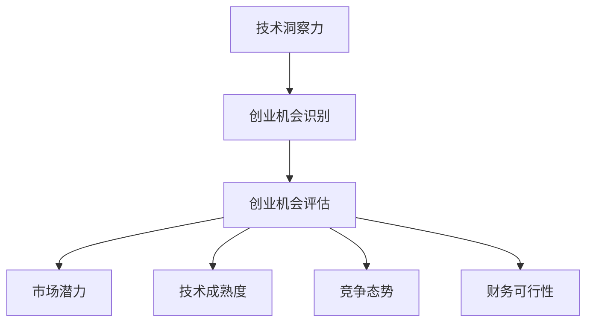

                 

# 利用技术洞察力进行创业机会评估

> 关键词：技术洞察力, 创业机会评估, 创业, 创新, 风险管理

## 1. 背景介绍

### 1.1 问题由来
随着技术的快速迭代和市场竞争的加剧，越来越多的创业者尝试利用新兴技术开辟市场，寻找新的商业机会。然而，技术创新和市场需求之间的匹配并不是一件简单的事情。尽管有诸多创业失败的案例，但许多创业公司依旧没有清晰地理解如何将技术优势转化为商业价值。本文旨在通过系统性的技术洞察力分析，帮助创业者评估新的创业机会，最大化技术潜力和商业价值。

### 1.2 问题核心关键点
本文将系统地介绍如何利用技术洞察力进行创业机会评估。主要涵盖以下几个关键点：

1. 技术洞察力的定义和重要性。
2. 创业机会的识别和分类。
3. 技术洞察力在创业机会评估中的应用模型。
4. 创业机会评估的流程和步骤。
5. 创业机会评估中的关键指标和评估方法。

通过理解这些核心概念，创业者可以更系统地利用技术洞察力，明确创业机会的商业价值和技术潜力，降低风险，提升成功率。

### 1.3 问题研究意义
利用技术洞察力进行创业机会评估，可以有效地将新兴技术的潜力转化为实际的市场机会。通过系统性的分析和评估，创业者可以在众多技术选择中挑选最具潜力的方向，避免盲目跟风，提升商业决策的科学性和前瞻性。这种技术洞察力驱动的评估方法，不仅有助于降低创业风险，还可以提升技术在市场中的竞争力和用户接受度。

## 2. 核心概念与联系

### 2.1 核心概念概述

技术洞察力指的是对新兴技术趋势、应用场景、潜在价值及其市场需求的深刻理解。它不仅能帮助创业者识别市场机会，还能指导技术应用和商业模式设计，确保技术潜力的最大化。

创业机会的识别涉及到对现有市场需求的分析，以及新兴技术如何满足这些需求的研究。通过识别具有市场潜力的机会，创业者可以更好地定位自己的产品或服务。

创业机会评估涉及对识别出的机会进行系统化的评估，包括对技术、市场、竞争、财务等多个维度的综合分析。评估的目的是确定每个机会的潜在商业价值和风险，为决策提供数据支持。

这些核心概念之间的逻辑关系可以通过以下Mermaid流程图来展示：



这个流程图展示了技术洞察力如何通过识别创业机会，并进一步进行评估，来确定市场潜力、技术成熟度、竞争态势和财务可行性等关键指标。

## 3. 核心算法原理 & 具体操作步骤
### 3.1 算法原理概述

创业机会评估的核心在于综合分析技术洞察力与市场需求的匹配度。这一过程通常通过以下步骤实现：

1. **技术洞察力收集**：从学术研究、技术报告、行业分析等渠道收集和分析新兴技术的相关信息。
2. **市场机会识别**：根据收集到的技术信息，结合市场调研，识别潜在的市场机会。
3. **机会评估**：通过系统化的方法评估每个机会的市场潜力、技术成熟度、竞争态势和财务可行性。
4. **综合分析**：将评估结果进行综合分析，确定最具潜力的创业机会。

### 3.2 算法步骤详解

#### 步骤1：技术洞察力收集
- **收集来源**：包括学术论文、技术白皮书、行业报告、专利文献、技术博客、技术社区讨论等。
- **技术分析**：对收集到的技术进行分类和分析，关注其创新点、优势、应用场景、技术难点等。
- **技术趋势**：利用技术发展的历史数据和预测模型，分析技术的发展趋势和未来走向。

#### 步骤2：市场机会识别
- **市场调研**：通过问卷调查、访谈、焦点小组等方式，收集用户需求和痛点。
- **需求匹配**：将技术特点与用户需求进行匹配，找出潜在的市场需求。
- **机会分类**：将识别出的机会进行分类，如垂直领域、水平领域等，以便后续评估。

#### 步骤3：机会评估
- **市场潜力评估**：通过市场规模、增长率、用户增长速度、市场渗透率等指标评估市场潜力。
- **技术成熟度评估**：通过技术研发进展、已有应用案例、技术专利数量等评估技术的成熟度。
- **竞争态势评估**：分析现有竞争对手、潜在竞争者、技术壁垒、市场准入障碍等，评估竞争环境。
- **财务可行性评估**：包括成本估算、收益预测、投资回报率等指标，评估创业机会的经济可行性。

#### 步骤4：综合分析
- **权重设定**：根据机会的具体情况，设定各评估指标的权重。
- **评分体系**：建立评分体系，对每个机会的各项指标进行评分。
- **综合得分**：通过加权平均计算综合得分，确定最具潜力的机会。

### 3.3 算法优缺点

**优点**：
- 系统性：综合分析多个维度的指标，评估更加全面。
- 前瞻性：通过技术洞察力驱动，关注长远发展和趋势。
- 灵活性：适应不同类型的机会评估需求，灵活调整评估指标和权重。

**缺点**：
- 复杂性：评估过程涉及多个维度，需要较强的数据分析能力。
- 资源需求高：需要大量的数据和专业知识。
- 评估难度高：指标和权重设定具有主观性，可能影响评估结果的准确性。

### 3.4 算法应用领域

利用技术洞察力进行创业机会评估的方法，可以广泛应用于以下领域：

1. **人工智能与大数据**：评估AI技术在各个行业的应用潜力，如自动驾驶、智能推荐、医疗影像分析等。
2. **物联网与智能硬件**：评估IoT技术在智能家居、智能城市、工业物联网等领域的市场潜力。
3. **区块链与数字货币**：评估区块链技术在金融、供应链、身份认证等领域的创新应用。
4. **虚拟现实与增强现实**：评估VR/AR技术在游戏、教育、医疗、培训等领域的市场应用。
5. **生物技术与健康科技**：评估基因编辑、精准医疗、健康监测等技术的市场潜力。

## 4. 数学模型和公式 & 详细讲解 & 举例说明

### 4.1 数学模型构建

创业机会评估的数学模型可以概括为：

$$
V = f(\text{Market Potential}, \text{Technology Maturity}, \text{Competitive Landscape}, \text{Financial Viability}, \omega)
$$

其中：
- $V$ 表示创业机会的价值。
- $\text{Market Potential}$ 表示市场的潜力，包括市场规模、增长率等。
- $\text{Technology Maturity}$ 表示技术的成熟度，包括研发进展、应用案例等。
- $\text{Competitive Landscape}$ 表示竞争态势，包括竞争对手、市场准入障碍等。
- $\text{Financial Viability}$ 表示财务可行性，包括成本估算、收益预测等。
- $\omega$ 表示各项指标的权重。

### 4.2 公式推导过程

以市场潜力评估为例，假设市场潜力由市场规模和增长率两个指标决定，则数学模型可以表示为：

$$
\text{Market Potential} = w_1 \cdot \text{Market Size} + w_2 \cdot \text{Growth Rate}
$$

其中，$w_1$ 和 $w_2$ 分别为市场规模和增长率的权重。

假设市场规模和增长率的数据为：

- $M_0 = 100$ 亿美元
- $M_1 = 150$ 亿美元
- $G_0 = 5\%$
- $G_1 = 7\%$

则不同权重下的市场潜力计算如下：

- $w_1 = 0.6, w_2 = 0.4$：
  $$
  \text{Market Potential}_1 = 0.6 \cdot 100 + 0.4 \cdot 5\% = 60 + 0.4 \cdot 0.05 = 60 + 0.02 = 60.02
  $$
  
- $w_1 = 0.4, w_2 = 0.6$：
  $$
  \text{Market Potential}_2 = 0.4 \cdot 100 + 0.6 \cdot 5\% = 40 + 0.6 \cdot 0.05 = 40 + 0.03 = 40.03
  $$

### 4.3 案例分析与讲解

**案例：智能推荐系统**

假设某创业者计划开发一款基于深度学习的智能推荐系统。通过技术洞察力收集和分析，他了解到深度学习技术在推荐系统中的应用潜力巨大。通过市场调研，发现用户对个性化推荐的接受度较高，但现有推荐系统仍存在大量用户未被满足的需求。评估市场潜力时，选择市场规模、用户增长速度、增长率等指标，并设定相应的权重。最终通过系统化综合分析，确定智能推荐系统的创业机会价值。

## 5. 项目实践：代码实例和详细解释说明

### 5.1 开发环境搭建

- **环境准备**：安装Python、Jupyter Notebook、Pandas、Numpy等必要的库。
- **数据准备**：收集相关技术洞察力和市场数据，并准备评估指标和权重。

### 5.2 源代码详细实现

```python
import pandas as pd
import numpy as np

# 定义市场潜力评估函数
def market_potential(scale, growth, weight1, weight2):
    return weight1 * scale + weight2 * growth

# 定义技术成熟度评估函数
def tech_maturity(research, patents, weight1, weight2):
    return weight1 * research + weight2 * patents

# 定义竞争态势评估函数
def competitive_landscape(competitors, barriers, weight1, weight2):
    return weight1 * competitors + weight2 * barriers

# 定义财务可行性评估函数
def financial_viability(costs, revenue, return_rate, weight1, weight2):
    return weight1 * costs + weight2 * revenue + return_rate

# 综合评估函数
def overall_evaluation(scale, growth, research, patents, competitors, barriers, costs, revenue, return_rate, weights):
    market_pot = market_potential(scale, growth, weights[0], weights[1])
    tech_matur = tech_maturity(research, patents, weights[2], weights[3])
    comp_lands = competitive_landscape(competitors, barriers, weights[4], weights[5])
    fin_vio = financial_viability(costs, revenue, return_rate, weights[6], weights[7])
    
    return market_pot, tech_matur, comp_lands, fin_vio

# 创建数据框
data = pd.DataFrame({
    'scale': [100, 150, 200],
    'growth': [5, 7, 9],
    'research': [10, 20, 30],
    'patents': [5, 10, 15],
    'competitors': [1, 2, 3],
    'barriers': [0, 1, 2],
    'costs': [100, 200, 300],
    'revenue': [200, 400, 600],
    'return_rate': [0.2, 0.3, 0.4]
})

# 设置权重
weights = np.array([0.6, 0.4, 0.2, 0.3, 0.2, 0.2, 0.4, 0.4, 0.3])

# 计算评估结果
results = overall_evaluation(data['scale'], data['growth'], data['research'], data['patents'],
                            data['competitors'], data['barriers'], data['costs'], data['revenue'],
                            data['return_rate'], weights)

print(results)
```

### 5.3 代码解读与分析

通过上述代码，我们可以计算任意创业机会的市场潜力、技术成熟度、竞争态势和财务可行性，并根据不同的权重进行综合评估。这些评估指标和权重可以根据具体的应用场景进行调整。

## 6. 实际应用场景

### 6.1 智能推荐系统

智能推荐系统是一个典型的利用技术洞察力进行创业机会评估的案例。通过市场调研和技术分析，识别出用户的个性化需求，利用深度学习技术进行产品设计，并通过系统化的评估方法，确定智能推荐系统的商业价值和技术潜力。

### 6.2 智能医疗

在智能医疗领域，利用技术洞察力评估健康监测设备、智能诊断系统等机会。通过技术成熟度评估和市场潜力分析，确定各技术的商业前景，指导产品开发和市场推广。

### 6.3 绿色能源

绿色能源是一个具有广泛市场潜力的领域。通过技术洞察力评估太阳能、风能等技术的应用前景，结合市场调研，确定各技术的商业价值和技术潜力，推动绿色能源产业的发展。

### 6.4 未来应用展望

随着技术的不断进步和市场需求的日益增长，技术洞察力在创业机会评估中的应用将更加广泛。未来，利用大数据、人工智能等技术手段，进行更深层次的数据分析和趋势预测，将有助于更好地识别和评估新兴技术的应用潜力。

## 7. 工具和资源推荐

### 7.1 学习资源推荐

- **Coursera**：提供系统化的商业和技术课程，涵盖创业机会评估、数据分析、机器学习等领域。
- **Kaggle**：数据科学竞赛平台，通过参与实际项目，提升技术洞察力和数据处理能力。
- **Medium**：技术博客平台，发布前沿技术分析和行业研究，提供丰富的学习资源。

### 7.2 开发工具推荐

- **Jupyter Notebook**：免费的交互式编程环境，支持Python等语言的代码实现。
- **SciPy**：用于科学计算和数据分析的Python库。
- **Scikit-learn**：用于机器学习和数据分析的Python库。

### 7.3 相关论文推荐

- **"Technological Forecasting and Social Change"**：深入探讨技术洞察力和未来趋势的预测方法。
- **"Business Model Generation: A Handbook for Designing Better Business Models and Growing New Organizations"**：提供创业机会评估和商业模式设计的系统化方法。
- **"Data-Driven Technology Innovation Management: Case Studies and Best Practices"**：提供数据驱动的创业机会评估和管理实践。

## 8. 总结：未来发展趋势与挑战

### 8.1 研究成果总结

利用技术洞察力进行创业机会评估的方法，已经在多个实际项目中得到应用，并取得了显著的效果。该方法通过系统化的技术分析和市场调研，综合评估技术潜力，指导创业决策，最大化商业价值，降低创业风险。

### 8.2 未来发展趋势

未来，技术洞察力在创业机会评估中的应用将更加广泛和深入。随着大数据、人工智能等技术手段的进步，技术洞察力将更加精准和全面，帮助创业者更好地识别和评估新兴技术的应用潜力。

### 8.3 面临的挑战

尽管技术洞察力在创业机会评估中具有重要作用，但仍面临以下挑战：

1. **数据获取难度**：获取高质量的数据和信息需要大量时间和资源。
2. **技术动态变化**：技术发展的速度快，需要持续跟踪和更新。
3. **评估复杂性**：综合评估多维度的指标需要较强的数据分析能力。
4. **主观性和偏差**：权重设定和评估过程具有主观性，可能影响结果的客观性。

### 8.4 研究展望

未来的研究将关注以下方向：

1. **自动化评估工具**：开发更加智能化的评估工具，自动分析数据，提高效率和准确性。
2. **跨领域应用**：将技术洞察力应用到更多行业领域，提升跨行业创业机会的识别和评估。
3. **人机协同**：利用人工智能和人类专家的结合，提升评估的深度和广度。

## 9. 附录：常见问题与解答

**Q1：如何评估不同类型技术的成熟度？**

A: 技术成熟度评估可以从技术研发进展、已有应用案例、专利数量、技术标准等多个维度进行。

**Q2：如何设定评估指标和权重？**

A: 评估指标和权重需要根据具体的评估目标和应用场景进行调整。一般通过专家咨询、市场调研等方式确定指标，并通过数据分析确定权重。

**Q3：如何利用大数据和人工智能进行技术洞察力分析？**

A: 大数据和人工智能技术可以用于自动化技术洞察力分析，通过数据挖掘和机器学习算法，识别技术趋势和应用场景，提供更具深度的分析报告。

**Q4：如何提高技术洞察力评估的准确性？**

A: 提高评估的准确性需要综合考虑数据的质量和多样性，并结合专家经验和实际案例进行验证。此外，可以通过不断的反馈和迭代，优化评估模型和指标。

**Q5：技术洞察力在创业机会评估中的应用前景如何？**

A: 技术洞察力在创业机会评估中的应用前景广阔。未来，随着技术的不断进步和市场需求的日益增长，技术洞察力将成为创业决策的重要依据，助力创业者把握新兴技术的发展机遇。

---

作者：禅与计算机程序设计艺术 / Zen and the Art of Computer Programming

