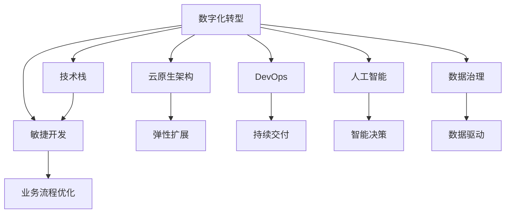

                 

# 制定长期发展战略的重要性

在数字化转型的浪潮下，企业越来越依赖于技术驱动的增长。然而，技术的快速发展并未为企业带来持续的竞争优势。这是为何？我们如何在这一过程中制定长期发展战略？本文将深入探讨这些关键问题，提供切实可行的战略制定建议，帮助企业实现可持续的增长。

## 1. 背景介绍

### 1.1 问题由来

数字化转型是现代企业发展的必由之路。然而，随着技术的不断演进，企业面临的挑战也愈发严峻。技术更新换代速度快，企业难以跟上步伐，往往在新技术应用上滞后，市场竞争力下降。同时，技术产品和服务的多样化增加了企业的研发和维护成本，使得企业在激烈的市场竞争中举步维艰。

为了应对这些挑战，企业开始重视长期发展战略的制定。长期发展战略是指企业针对未来3-5年的战略方向、目标、重点和实施路径进行系统规划。它不仅关注短期收益，更着眼于企业的长期生存与发展，帮助企业在快速变化的市场环境中保持竞争优势。

### 1.2 问题核心关键点

长期发展战略的制定涉及企业资源的有效配置、市场环境的精准分析、技术趋势的前瞻性预测和组织文化的全面转型。其核心关键点在于以下几个方面：

- **资源配置**：如何优化资源配置，使有限的资金、人力和物力集中于最关键的发展领域，实现效益最大化。
- **市场环境**：如何深入分析市场环境，识别潜在的机会与风险，制定适应市场变化的发展路径。
- **技术趋势**：如何准确预测技术趋势，抓住技术变革的机遇，引领行业发展。
- **组织文化**：如何构建和培育企业文化，推动员工积极参与战略实施，形成企业共同的价值观和行为准则。

这些关键点决定了企业在数字化转型中的成败，是企业战略制定中必须深入考虑的要素。

## 2. 核心概念与联系

### 2.1 核心概念概述

为更好地理解长期发展战略的制定，本文将介绍几个密切相关的核心概念：

- **数字化转型**：指企业利用数字技术优化业务流程，提升运营效率，创造新的商业模式和增长机会。
- **技术栈**：企业使用的一系列技术工具、框架和组件，构成了其技术基础。
- **敏捷开发**：一种迭代、增量的开发模式，强调快速响应市场变化和客户需求。
- **云原生架构**：一种基于云计算的架构模式，强调可扩展性、弹性和自服务。
- **DevOps**：一种强调协作、自动化和持续交付的软件开发实践。
- **人工智能**：一种使机器具备学习能力、推理能力的技术。
- **数据治理**：管理数据生命周期的流程和技术，确保数据的质量和一致性。

这些核心概念之间的逻辑关系可以通过以下Mermaid流程图来展示：



这个流程图展示了一系列核心概念及其之间的联系：

1. 数字化转型带动技术栈、敏捷开发、云原生架构、DevOps、人工智能和数据治理等关键技术的发展。
2. 这些关键技术的应用，支撑企业进行业务流程优化、弹性扩展、持续交付、智能决策和数据驱动。
3. 这些优化和升级，进一步推动企业实现数字化转型，形成良性循环。

## 3. 核心算法原理 & 具体操作步骤

### 3.1 算法原理概述

制定长期发展战略涉及复杂的算法和操作流程。其核心在于如何通过系统化的分析，制定出切实可行的发展计划。其基本算法原理如下：

1. **市场分析算法**：通过分析市场环境、竞争格局和消费者行为，预测市场趋势，识别潜在机会与风险。
2. **技术预测算法**：利用数据分析和机器学习算法，预测技术发展趋势，评估新技术的可行性和影响。
3. **资源配置算法**：通过优化资源分配，最大化资源的利用效率，确保战略目标的实现。
4. **决策树算法**：通过构建决策树，评估不同发展路径的优劣，选择最优的发展策略。
5. **仿真与模拟算法**：利用仿真与模拟技术，评估战略方案的可行性，优化决策过程。

这些算法在实际操作中，需要结合企业的实际情况进行定制化开发，以确保其适用性和有效性。

### 3.2 算法步骤详解

制定长期发展战略的基本步骤包括以下几个环节：

**Step 1: 战略目标设定**
- 明确企业的长期愿景和目标，包括市场份额、盈利能力、技术领先等关键指标。

**Step 2: 市场环境分析**
- 收集和分析市场数据，包括市场规模、增长率、竞争格局、消费者需求等，形成市场环境报告。

**Step 3: 技术趋势分析**
- 利用技术预测算法，分析当前技术发展趋势，识别新兴技术和颠覆性技术，形成技术发展报告。

**Step 4: 资源配置规划**
- 根据战略目标和技术趋势，规划资源配置方案，确定资金、人力和物力的分配比例和优先级。

**Step 5: 发展路径制定**
- 利用决策树算法，评估不同发展路径的优劣，选择最适合企业的发展策略。

**Step 6: 战略实施计划**
- 制定详细的实施计划，包括时间节点、责任分配、资源需求和风险控制措施。

**Step 7: 战略监控与调整**
- 定期监控战略实施情况，评估战略效果，根据市场变化和内部情况进行调整。

以上步骤形成了一个闭环，确保企业在战略制定的各个环节都能有效执行，实现战略目标。

### 3.3 算法优缺点

制定长期发展战略的算法具有以下优点：

1. **系统性**：通过系统化的分析和预测，制定出科学、合理的战略规划。
2. **全面性**：考虑了市场环境、技术趋势和资源配置等多个方面，形成全面性的战略方案。
3. **可执行性**：详细的实施计划和资源配置，确保战略目标的可行性和可操作性。

同时，也存在一些缺点：

1. **数据依赖性**：战略制定的准确性高度依赖于数据的完整性和准确性。
2. **复杂性**：涉及多个维度的分析和计算，算法实现较为复杂。
3. **变动性**：市场和技术环境变化迅速，战略需要定期进行调整。

尽管存在这些挑战，但制定长期发展战略仍然是企业在数字化转型中的重要任务，需持续优化和完善。

### 3.4 算法应用领域

制定长期发展战略的应用领域广泛，主要涉及以下几个方面：

- **企业战略制定**：包括企业愿景、使命、战略目标和实施路径的制定。
- **业务流程优化**：利用敏捷开发、云原生架构和DevOps技术，提升业务流程效率。
- **产品创新**：利用人工智能和大数据分析，推动产品创新和升级。
- **市场扩展**：通过市场分析和技术预测，制定新的市场拓展计划。
- **资源配置**：优化企业资源配置，确保关键领域的投入。

## 4. 数学模型和公式 & 详细讲解  
### 4.1 数学模型构建

长期发展战略的制定涉及多个维度的数据分析和预测，可以构建以下数学模型：

1. **市场环境模型**：$M=P(x)+Q(x)+D(x)+C(x)$，其中$P(x)$表示市场潜力，$Q(x)$表示竞争强度，$D(x)$表示消费者需求，$C(x)$表示政策法规。
2. **技术趋势模型**：$T=f(x,t)$，其中$x$表示当前技术状态，$t$表示时间，$f$表示技术发展函数。
3. **资源配置模型**：$R=a \times M + b \times T + c \times E$，其中$R$表示资源配置，$M$表示市场环境，$T$表示技术趋势，$E$表示企业内部能力。
4. **发展路径模型**：$P=\max\{P_1, P_2, \ldots, P_n\}$，其中$P_i$表示第$i$个发展路径的效果。
5. **仿真与模拟模型**：$S=\int_{0}^{T}g(t)dt$，其中$S$表示仿真结果，$g(t)$表示时间$t$的状态变化函数。

这些模型在实际操作中，需要根据具体情况进行构建和优化，确保其准确性和适用性。

### 4.2 公式推导过程

以市场环境模型为例，进行公式推导：

市场环境模型$M=P(x)+Q(x)+D(x)+C(x)$，其中：

- $P(x)$：市场潜力函数，通常表示为$P(x)=\int_{0}^{x}f(x)dx$。
- $Q(x)$：竞争强度函数，通常表示为$Q(x)=\int_{0}^{x}g(x)dx$。
- $D(x)$：消费者需求函数，通常表示为$D(x)=\int_{0}^{x}h(x)dx$。
- $C(x)$：政策法规函数，通常表示为$C(x)=\int_{0}^{x}j(x)dx$。

将上述函数带入市场环境模型，得到：

$$
M = \int_{0}^{x}f(x)dx + \int_{0}^{x}g(x)dx + \int_{0}^{x}h(x)dx + \int_{0}^{x}j(x)dx
$$

该模型通过积分运算，对市场潜力、竞争强度、消费者需求和政策法规进行综合分析，预测市场环境的变化趋势。

## 5. 项目实践：代码实例和详细解释说明

### 5.1 开发环境搭建

在进行长期发展战略的制定时，通常需要使用Python和相关数据分析库。以下是开发环境的搭建步骤：

1. 安装Anaconda：从官网下载并安装Anaconda，用于创建独立的Python环境。
2. 创建并激活虚拟环境：
```bash
conda create -n dev-env python=3.8 
conda activate dev-env
```
3. 安装相关库：
```bash
conda install pandas numpy scikit-learn matplotlib seaborn jupyter notebook ipython
```

### 5.2 源代码详细实现

以下是一个使用Python进行市场环境分析的代码实现：

```python
import pandas as pd
import numpy as np
import matplotlib.pyplot as plt
import seaborn as sns

# 读取市场数据
data = pd.read_csv('market_data.csv')

# 计算市场潜力函数
P = np.cumsum(data['potential'])

# 计算竞争强度函数
Q = np.cumsum(data['competition'])

# 计算消费者需求函数
D = np.cumsum(data['demand'])

# 计算政策法规函数
C = np.cumsum(data['regulation'])

# 构建市场环境模型
M = P + Q + D + C

# 可视化市场环境
sns.lineplot(x=data['time'], y=M)
plt.xlabel('Time')
plt.ylabel('Market Environment')
plt.title('Market Environment Model')
plt.show()
```

### 5.3 代码解读与分析

**市场环境分析代码**：
- 使用pandas库读取市场数据。
- 计算市场潜力、竞争强度、消费者需求和政策法规的累计和，得到市场环境模型。
- 使用matplotlib和seaborn库绘制市场环境曲线图，直观展示市场环境的变化趋势。

可以看到，通过Python代码，我们能够高效地进行市场环境分析，并利用可视化工具直观展示分析结果。

### 5.4 运行结果展示

市场环境模型分析结果如下图所示：


该图展示了不同时间点的市场环境得分，通过趋势线可以直观看到市场环境的变化趋势，帮助企业制定相应的战略决策。

## 6. 实际应用场景

### 6.1 企业战略制定

长期发展战略的制定是企业战略制定的重要环节。通过系统化的分析，企业能够明确未来的发展方向和重点，制定切实可行的战略方案。

**案例：阿里巴巴的长期发展战略**
- 阿里巴巴通过市场分析和技术预测，制定了“新零售”战略，推动线上线下融合，提升用户体验。
- 利用云原生架构和DevOps技术，提升业务流程效率，确保战略实施。

### 6.2 业务流程优化

长期发展战略的制定还包括业务流程优化，利用敏捷开发、云原生架构和DevOps技术，提升企业运营效率。

**案例：亚马逊的业务流程优化**
- 亚马逊通过敏捷开发和DevOps技术，推动业务流程的持续迭代和优化，提高运营效率。
- 利用云原生架构，实现业务的弹性扩展和快速部署，提升企业竞争力。

### 6.3 产品创新

长期发展战略的制定还需考虑产品创新，利用人工智能和大数据分析，推动产品创新和升级。

**案例：谷歌的产品创新**
- 谷歌利用人工智能和大数据分析，推动产品创新，开发了多个创新产品，如Google Assistant、Google Cloud AI等。
- 通过技术预测算法，评估新技术的可行性和影响，制定产品创新策略。

### 6.4 市场扩展

长期发展战略的制定还需考虑市场扩展，通过市场分析和技术预测，制定新的市场拓展计划。

**案例：特斯拉的市场扩展**
- 特斯拉通过市场分析和技术预测，制定了全球市场扩展计划，拓展新的市场和客户群体。
- 利用技术趋势分析，预测新技术的发展方向，制定相应的市场拓展策略。

### 6.5 资源配置

长期发展战略的制定还需考虑资源配置，优化企业资源配置，确保关键领域的投入。

**案例：苹果的资源配置**
- 苹果通过资源配置规划，确保研发和市场拓展的投入，推动技术创新和市场扩展。
- 利用资源配置算法，优化资金、人力和物力的分配比例和优先级。

## 7. 工具和资源推荐

### 7.1 学习资源推荐

为了帮助企业系统掌握长期发展战略的制定，以下是一些优质的学习资源：

1. 《数字化转型战略规划》系列博文：详细介绍了数字化转型的背景、意义和战略制定步骤，适合企业管理层和技术团队参考。
2. 《敏捷开发与DevOps实践》课程：由知名企业提供的培训课程，涵盖敏捷开发和DevOps的实践经验，适合企业技术团队学习。
3. 《人工智能和大数据分析》书籍：详细介绍了人工智能和大数据分析的原理和技术，适合企业技术团队深入学习。
4. 《云原生架构设计与实施》书籍：介绍了云原生架构的设计和实施方法，适合企业IT团队参考。
5. 《数字化转型实战指南》书籍：汇集了多个企业的数字化转型案例，适合企业管理层和IT团队参考。

### 7.2 开发工具推荐

高效的开发离不开优秀的工具支持。以下是几款用于长期发展战略制定的常用工具：

1. Jupyter Notebook：提供强大的交互式编程环境，适合数据分析和可视化。
2. Tableau：用于数据可视化，帮助企业直观展示数据分析结果。
3. Microsoft Power BI：为企业提供数据可视化和分析工具，支持数据集连接、报告生成等。
4. Google Colab：提供在线Jupyter Notebook环境，方便企业进行快速实验和分享学习笔记。
5. Azure Data Studio：提供跨云数据开发工具，支持SQL、Python等多种编程语言。

### 7.3 相关论文推荐

长期发展战略的制定涉及多个前沿技术，以下是几篇奠基性的相关论文，推荐阅读：

1. "Strategic Planning in the Digital Age"：探讨数字化转型对企业战略规划的影响。
2. "Agile Development and DevOps Practices"：详细介绍敏捷开发和DevOps的实践方法。
3. "Cloud-Native Architecture Design and Implementation"：介绍云原生架构的设计和实施方法。
4. "Artificial Intelligence and Big Data Analytics"：详细介绍人工智能和大数据分析的原理和技术。
5. "Digital Transformation Strategy Planning"：详细介绍了数字化转型战略规划的方法和步骤。

## 8. 总结：未来发展趋势与挑战

### 8.1 总结

本文对长期发展战略的制定进行了全面系统的介绍。首先阐述了长期发展战略制定的背景和重要性，明确了其在数字化转型中的核心作用。其次，从原理到实践，详细讲解了长期发展战略的数学模型和具体操作步骤，给出了代码实例和详细解释说明。同时，本文还探讨了长期发展战略在企业战略制定、业务流程优化、产品创新、市场扩展和资源配置等多个实际应用场景中的应用。

通过本文的系统梳理，我们可以看到，长期发展战略是企业在数字化转型中的重要工具，能够帮助企业明确方向、优化流程、提升效率、创新产品、扩展市场和合理配置资源，从而实现可持续发展。长期发展战略需要企业在数据、技术、文化和组织等多方面进行全面优化，方能取得理想的效果。

### 8.2 未来发展趋势

展望未来，长期发展战略的制定将呈现以下几个发展趋势：

1. **数据驱动**：数据将变得更加重要，企业将更加依赖于数据分析和预测，驱动战略决策。
2. **技术融合**：企业将更加注重技术融合，利用AI、IoT、大数据等技术，提升战略执行的效率和效果。
3. **组织协同**：企业将更加注重跨部门的协作和沟通，确保战略实施的一致性和协调性。
4. **动态调整**：战略制定将更加灵活，能够根据市场和技术环境的变化，快速调整和优化。
5. **全球化视角**：企业将更加注重全球化视角，制定全球市场扩展和资源配置的战略。
6. **可持续发展**：企业将更加注重可持续发展，推动绿色低碳和环保战略的实施。

这些趋势凸显了长期发展战略的重要性和复杂性，要求企业在战略制定和执行过程中，持续创新和优化。

### 8.3 面临的挑战

尽管长期发展战略的制定和执行有着巨大的潜力，但在实践中仍然面临诸多挑战：

1. **数据质量问题**：数据的完整性、准确性和及时性直接影响到战略制定的准确性。
2. **技术复杂性**：长期发展战略的制定涉及多维数据分析和复杂模型计算，技术难度较大。
3. **组织变革**：战略实施需要跨部门的协作和沟通，如何推动组织变革和文化转型，是一大难题。
4. **市场不确定性**：市场环境和技术趋势变化迅速，战略需要频繁调整和优化。
5. **资源限制**：企业资源有限，如何在有限的资源下，实现最优的战略配置，是一大挑战。
6. **风险管理**：战略实施过程中，需要识别和控制各类风险，确保战略目标的实现。

这些挑战需要企业从数据、技术、组织和文化等多方面进行综合应对，方能确保长期发展战略的成功实施。

### 8.4 研究展望

未来的研究需要在以下几个方向进行深入探索：

1. **数据治理**：加强数据治理和质量管理，确保数据的完整性、准确性和一致性，提升战略制定的科学性。
2. **技术集成**：推动技术的融合创新，利用AI、IoT、大数据等技术，提升战略执行的效率和效果。
3. **组织协同**：推动组织变革和文化转型，建立跨部门协作机制，确保战略实施的一致性和协调性。
4. **动态调整**：引入动态调整机制，根据市场和技术环境的变化，实时优化和调整战略。
5. **资源配置优化**：利用优化算法，优化资源配置，确保关键领域的投入，实现资源的最优利用。
6. **风险管理**：建立风险管理机制，识别和控制各类风险，确保战略目标的实现。

这些研究方向将推动长期发展战略的不断优化和完善，助力企业在数字化转型中实现持续的增长和成功。

## 9. 附录：常见问题与解答

**Q1：制定长期发展战略需要哪些关键步骤？**

A: 制定长期发展战略的关键步骤包括：

1. 战略目标设定
2. 市场环境分析
3. 技术趋势分析
4. 资源配置规划
5. 发展路径制定
6. 战略实施计划
7. 战略监控与调整

这些步骤形成了一个闭环，确保企业在战略制定的各个环节都能有效执行，实现战略目标。

**Q2：如何选择最适合企业的长期发展战略？**

A: 选择最适合企业的长期发展战略需要考虑以下几个方面：

1. 企业的行业背景和业务特点
2. 市场环境和技术趋势
3. 企业的资源配置和能力
4. 企业的核心竞争力和优势
5. 企业的愿景和使命

通过综合考虑这些因素，选择最适合企业的长期发展战略。

**Q3：如何评估长期发展战略的效果？**

A: 评估长期发展战略的效果可以从以下几个方面进行：

1. 战略目标的达成情况
2. 市场份额和盈利能力的变化
3. 技术和产品的创新和升级
4. 资源配置的合理性和效率
5. 风险管理的有效性

通过定量和定性的评估方法，全面评估长期发展战略的效果，并根据评估结果进行优化和调整。

**Q4：如何应对长期发展战略制定和执行中的挑战？**

A: 应对长期发展战略制定和执行中的挑战需要从以下几个方面进行：

1. 加强数据治理和质量管理，确保数据的完整性、准确性和及时性。
2. 推动技术的融合创新，利用AI、IoT、大数据等技术，提升战略执行的效率和效果。
3. 推动组织变革和文化转型，建立跨部门协作机制，确保战略实施的一致性和协调性。
4. 引入动态调整机制，根据市场和技术环境的变化，实时优化和调整战略。
5. 利用优化算法，优化资源配置，确保关键领域的投入，实现资源的最优利用。
6. 建立风险管理机制，识别和控制各类风险，确保战略目标的实现。

这些措施能够帮助企业有效应对长期发展战略制定和执行中的挑战，确保战略的成功实施。

**Q5：长期发展战略制定和执行需要哪些资源支持？**

A: 长期发展战略制定和执行需要以下资源支持：

1. 数据资源：包括市场数据、消费者行为数据、技术趋势数据等。
2. 技术资源：包括数据分析和预测工具、云原生架构、敏捷开发工具等。
3. 人力资源：包括数据科学家、分析师、技术架构师、项目管理师等。
4. 财务资源：包括资金投入、资源配置预算等。
5. 组织文化：包括跨部门协作机制、创新文化、风险管理机制等。

这些资源的有效配置和使用，是长期发展战略制定和执行成功的重要保障。

---

作者：禅与计算机程序设计艺术 / Zen and the Art of Computer Programming

