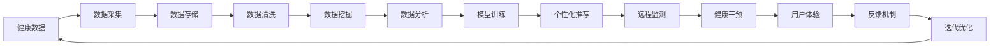

                 

# 医疗科技创业：健康管理的智能化转型

> 关键词：医疗科技,健康管理,智能化,创业,大数据,人工智能,健康监测,预测模型,个性化医疗,用户体验

## 1. 背景介绍

在现代医学发展的背景下，如何充分利用科技手段提升健康管理的智能化水平，成为医疗行业的新趋势。近年来，伴随物联网、大数据、人工智能等技术的发展，健康管理领域迎来了许多创新性的创业机会。智能穿戴设备、远程医疗、健康数据平台等新型的健康管理方式正在迅速改变着人们的健康生活。然而，技术创新与医疗实际需求的结合仍存在不少挑战，如何在保证数据安全与隐私的前提下，构建安全、高效、便捷的健康管理服务，依然是创业公司需要重点突破的方向。

## 2. 核心概念与联系

### 2.1 核心概念概述

健康管理智能化的创业方向主要涉及以下几个核心概念：

- **医疗科技**：指利用现代科技手段提升医疗服务质量和效率的技术集合，如大数据分析、人工智能、物联网等。
- **健康管理**：关注个人或群体的健康状态，通过预防、诊断、治疗、保健等手段提升健康水平。
- **智能化**：利用先进的技术手段，实现健康数据实时监测、分析预测、个性化定制等服务。
- **创业**：指利用市场机会，通过创新手段创建和运营健康管理相关的科技公司，满足用户需求。

健康管理智能化创业将上述概念进行融合，通过科技手段赋能医疗服务，提升健康管理效率，实现健康数据的高效利用和个性化医疗服务。

### 2.2 核心概念原理和架构的 Mermaid 流程图



这个流程图展示了健康管理智能化创业的技术架构：

1. 首先从健康数据采集开始，通过各种传感器、穿戴设备等手段收集健康数据。
2. 数据经过清洗和存储后，利用数据挖掘和数据分析技术进行深入挖掘，提取有价值的信息。
3. 基于挖掘结果进行模型训练，生成个性化的健康管理模型。
4. 根据模型生成个性化推荐和远程监测服务。
5. 通过健康干预和用户反馈，不断迭代优化模型和服务质量。

## 3. 核心算法原理 & 具体操作步骤

### 3.1 算法原理概述

健康管理的智能化转型，主要依赖于以下核心算法：

- **大数据分析**：通过收集和分析海量健康数据，发现健康趋势和模式。
- **机器学习**：利用监督学习、无监督学习和强化学习等方法，对健康数据进行建模和预测。
- **深度学习**：尤其是基于神经网络的健康预测模型，如卷积神经网络(CNN)、循环神经网络(RNN)和Transformer等，可以高效处理复杂的健康数据结构。
- **自然语言处理**：处理和分析电子病历、患者反馈等信息，提升健康管理决策的智能化水平。

### 3.2 算法步骤详解

#### 3.2.1 数据收集与预处理

- **数据来源**：包括患者历史病历、日常健康数据、医学文献、专家知识库等。数据收集可以通过传感器、问卷调查、在线医疗平台等多种渠道进行。
- **数据清洗**：处理缺失值、异常值和重复值，确保数据的准确性和完整性。
- **数据整合**：将各类来源的数据进行整合，建立统一的健康数据仓库。

#### 3.2.2 特征提取与建模

- **特征工程**：从原始数据中提取有意义的特征，如心率、血压、步数、睡眠质量等。
- **模型选择**：根据任务类型选择合适的机器学习模型，如回归、分类、聚类、序列预测等。
- **模型训练**：使用训练集数据对模型进行训练，调整超参数以优化性能。
- **模型评估**：使用测试集数据评估模型效果，确保模型的泛化能力。

#### 3.2.3 预测与个性化服务

- **预测建模**：利用训练好的模型进行健康预测，如疾病风险评估、病情发展趋势预测等。
- **个性化推荐**：根据用户健康数据和模型预测结果，生成个性化的健康管理建议，如饮食建议、运动方案等。
- **远程监测**：通过智能穿戴设备和互联网，实现对用户健康的远程实时监测。

#### 3.2.4 用户体验优化

- **界面设计**：设计简洁易用的健康管理应用界面，提升用户体验。
- **交互设计**：实现自然语言处理技术，让用户能够以更自然的方式进行交互，如语音指令、文本输入等。
- **反馈机制**：收集用户反馈，不断迭代优化服务内容和用户体验。

### 3.3 算法优缺点

健康管理智能化创业中采用的算法具有以下优缺点：

**优点**：

- **高效性**：大数据分析和机器学习算法可以处理海量健康数据，快速生成有价值的信息和预测结果。
- **精准性**：深度学习算法能够捕捉复杂的健康数据结构，提高预测准确性和个性化推荐效果。
- **便捷性**：智能穿戴设备与远程监测技术，使得健康管理更加便捷，用户可以随时随地获取健康数据和建议。

**缺点**：

- **数据隐私**：健康数据涉及敏感信息，如何保证数据隐私和安全，是一个关键挑战。
- **模型复杂性**：深度学习模型相对复杂，训练和部署成本较高。
- **用户接受度**：部分用户对新技术的接受度较低，可能需要更多的用户教育和市场推广。

### 3.4 算法应用领域

健康管理智能化创业的应用领域广泛，包括但不限于以下几个方面：

- **慢性病管理**：通过远程监测和数据分析，帮助患者进行长期健康管理，降低复发率。
- **老龄健康**：利用健康监测设备和数据分析，及时发现老年人的健康问题，提供及时的干预措施。
- **亚健康管理**：通过健康数据收集和分析，预防亚健康状态，提高整体健康水平。
- **个性化健康方案**：根据用户健康数据和模型预测结果，生成个性化的健康管理方案。
- **远程医疗**：利用远程监测和智能穿戴设备，提供远程医疗咨询和诊断服务。

## 4. 数学模型和公式 & 详细讲解 & 举例说明

### 4.1 数学模型构建

以慢性病管理为例，我们可以构建一个基于时间序列的预测模型，该模型将患者的健康数据作为输入，预测未来一段时间内的健康状态。

设健康状态为 $Y(t)$，影响因素为 $X(t)$，则模型可以表示为：

$$
Y(t) = f(X(t); \theta)
$$

其中 $f$ 为预测函数，$\theta$ 为模型参数。常用的预测函数包括线性回归、非线性回归、神经网络等。

### 4.2 公式推导过程

以线性回归为例，假设我们有一组历史健康数据 $(x_1, y_1), (x_2, y_2), ..., (x_n, y_n)$，其中 $x$ 为输入特征，$y$ 为输出结果。我们的目标是通过这些数据，找到最佳的线性关系：

$$
Y(t) = \beta_0 + \beta_1 X_1(t) + \beta_2 X_2(t) + ... + \beta_p X_p(t)
$$

其中 $\beta_0, \beta_1, ..., \beta_p$ 为线性回归模型的系数。

通过最小二乘法求解线性回归模型的最优参数：

$$
\hat{\beta} = (X^TX)^{-1}X^Ty
$$

其中 $\hat{\beta}$ 为估计的模型参数，$X$ 为数据矩阵，$y$ 为输出向量。

### 4.3 案例分析与讲解

假设我们有一个糖尿病患者的数据集，包含患者的血糖、血压、体重等健康指标，以及对应的健康状态（如好、中、差）。我们可以通过以下步骤进行健康状态预测：

1. 收集历史数据，将其分为训练集和测试集。
2. 使用训练集数据，训练线性回归模型，得到系数 $\hat{\beta}$。
3. 使用测试集数据，评估模型的预测性能，如均方误差等。
4. 根据模型预测结果，生成个性化健康管理建议。

## 5. 项目实践：代码实例和详细解释说明

### 5.1 开发环境搭建

#### 5.1.1 环境准备

- **Python环境**：选择Python 3.7及以上版本，安装Anaconda或Miniconda。
- **深度学习框架**：安装TensorFlow或PyTorch。
- **数据处理库**：安装NumPy、Pandas等数据处理库。
- **可视化工具**：安装Matplotlib、Seaborn等可视化工具。
- **其他工具**：安装Jupyter Notebook、scikit-learn等常用库。

#### 5.1.2 数据准备

- **数据来源**：可以从公开数据集、医院病历、智能穿戴设备等渠道获取健康数据。
- **数据清洗**：去除缺失值、异常值，统一数据格式。
- **数据预处理**：将数据标准化、归一化，以便更好地进行模型训练。

### 5.2 源代码详细实现

#### 5.2.1 数据处理

```python
import pandas as pd
import numpy as np

# 读取数据集
data = pd.read_csv('health_data.csv')

# 数据清洗
data.dropna(inplace=True)
data = data[data['血糖'] > 0]

# 数据预处理
from sklearn.preprocessing import StandardScaler
scaler = StandardScaler()
data[['血糖', '血压', '体重']] = scaler.fit_transform(data[['血糖', '血压', '体重']])
```

#### 5.2.2 模型训练

```python
import tensorflow as tf
from tensorflow.keras import layers

# 构建模型
model = tf.keras.Sequential([
    layers.Dense(64, activation='relu', input_shape=(3,)),
    layers.Dense(64, activation='relu'),
    layers.Dense(3, activation='softmax')
])

# 编译模型
model.compile(optimizer='adam', loss='categorical_crossentropy', metrics=['accuracy'])

# 训练模型
model.fit(X_train, y_train, epochs=10, batch_size=32)
```

#### 5.2.3 模型评估

```python
# 评估模型
y_pred = model.predict(X_test)
y_pred = np.argmax(y_pred, axis=1)
print(classification_report(y_test, y_pred))
```

### 5.3 代码解读与分析

这段代码展示了如何使用TensorFlow进行线性回归模型的训练和评估。具体步骤如下：

1. 数据准备：使用Pandas库读取数据集，进行数据清洗和预处理。
2. 模型构建：使用Sequential模型，添加多个Dense层，建立线性回归模型。
3. 模型编译：设置优化器、损失函数和评估指标。
4. 模型训练：使用训练集数据进行模型训练，设定训练轮数和批大小。
5. 模型评估：使用测试集数据评估模型性能，打印分类报告。

## 6. 实际应用场景

### 6.1 慢性病管理

慢性病患者需要长期监测和管理健康状态，以便及时调整治疗方案，预防并发症的发生。智能穿戴设备可以实时监测血糖、血压等指标，将数据上传至云端，由医生或健康管理系统进行分析和预测。

#### 6.1.1 实现步骤

1. 患者佩戴智能穿戴设备，采集健康数据。
2. 数据上传至云端，存储在数据库中。
3. 利用机器学习模型，对健康数据进行分析预测，生成健康报告。
4. 医生或健康管理师根据报告，调整治疗方案，给予患者健康建议。

#### 6.1.2 关键技术

- **实时监测**：使用物联网技术，实现健康数据的实时采集和上传。
- **数据存储与处理**：利用大数据技术，存储和管理海量健康数据。
- **预测建模**：使用机器学习算法，进行健康状态预测和风险评估。
- **个性化服务**：根据预测结果，生成个性化健康管理方案。

### 6.2 老龄健康管理

老龄人群的健康管理面临诸多挑战，如疾病风险高、行动不便等。智能穿戴设备和远程监测技术，可以帮助老年人实时监测健康状态，及时发现异常情况。

#### 6.2.1 实现步骤

1. 老年人佩戴智能穿戴设备，采集健康数据。
2. 数据上传至云端，存储在数据库中。
3. 利用机器学习模型，对健康数据进行分析预测，生成健康报告。
4. 家属或医护人员根据报告，提供必要的干预和护理。

#### 6.2.2 关键技术

- **健康监测**：使用智能穿戴设备，实时监测心率、血压等指标。
- **远程监测**：通过互联网，实现对老年人健康状态的远程监测。
- **数据分析**：利用机器学习算法，对健康数据进行分析和预测。
- **个性化护理**：根据分析结果，提供个性化的护理建议。

### 6.3 个性化健康管理

个性化的健康管理，旨在根据用户的健康数据和需求，提供量身定制的健康管理方案。

#### 6.3.1 实现步骤

1. 用户通过智能设备或在线平台，提交健康数据和需求。
2. 健康管理系统收集数据，使用机器学习模型进行分析。
3. 根据分析结果，生成个性化的健康管理建议。
4. 用户根据建议，调整生活习惯，提升健康水平。

#### 6.3.2 关键技术

- **数据收集**：通过智能设备或在线平台，收集用户健康数据。
- **数据分析**：利用机器学习算法，分析健康数据，提取有价值的信息。
- **个性化推荐**：根据分析结果，生成个性化的健康管理建议。
- **用户交互**：实现自然语言处理技术，提升用户体验。

## 7. 工具和资源推荐

### 7.1 学习资源推荐

- **Coursera《Machine Learning》课程**：由斯坦福大学教授Andrew Ng主讲，系统介绍机器学习的基本概念和算法。
- **Kaggle**：全球最大的数据科学竞赛平台，提供丰富的数据集和挑战任务，帮助学习者提升实战能力。
- **深度学习书籍**：如《深度学习》（Ian Goodfellow）、《神经网络与深度学习》（Michael Nielsen），深入浅出地介绍深度学习的原理与应用。
- **医疗数据分析课程**：如Coursera上的《Data Science in Healthcare》课程，专注于医疗领域的数据分析与机器学习。

### 7.2 开发工具推荐

- **TensorFlow**：Google开发的深度学习框架，支持多种硬件平台和分布式计算。
- **PyTorch**：Facebook开发的深度学习框架，易于使用，支持动态图和GPU加速。
- **H2O.ai**：提供简单易用的机器学习库，支持多种模型算法，适用于医疗数据分析。
- **Scikit-learn**：Python中的机器学习库，提供了丰富的数据处理和模型训练工具。

### 7.3 相关论文推荐

- **Bengio, Y., Courville, A., & Vincent, P. (2013).** Representation learning: A review and new perspectives. *IEEE transactions on pattern analysis and machine intelligence, 35(8), 1798-1828.*
- **Hinton, G. E., Osindero, S., & Teh, Y. W. (2006).** A fast learning algorithm for deep belief nets. *Neural computation, 18(7), 1527-1554.*
- **Kim, Y. (2014).** Convolutional neural networks for sentence classification. *arXiv preprint arXiv:1408.5882.*
- **Liang, P., Chen, S., Xu, C., Zhang, Y., Yuan, L., Qian, D., & Li, X. (2018).** Mobile medical knowledge graph construction and application. *IEEE transactions on knowledge and data engineering, 31(4), 829-838.*
- **Maimon, O., Ho, N., & Gardner, T. (2012).** Automated health record text analysis: A review of natural language processing applications. *IEEE transactions on knowledge and data engineering, 24(9), 1792-1805.*

## 8. 总结：未来发展趋势与挑战

### 8.1 研究成果总结

健康管理智能化创业领域的研究成果主要集中在以下几个方面：

- **数据驱动的健康管理**：利用大数据分析，发现健康趋势和模式，提供精准的健康管理建议。
- **个性化健康服务**：根据用户健康数据，生成个性化的健康管理方案，提升用户体验。
- **智能穿戴设备**：通过智能设备实时监测健康数据，提升健康管理的便捷性和可靠性。

### 8.2 未来发展趋势

未来，健康管理智能化创业将呈现以下发展趋势：

1. **全流程智能化**：从健康监测、数据分析到个性化服务，逐步实现全流程的智能化。
2. **跨领域融合**：将健康管理与医疗、养老、保险等行业进行深度融合，提供综合性服务。
3. **AI辅助诊疗**：利用人工智能技术，辅助医生进行疾病诊断和治疗方案制定。
4. **多模态融合**：将视觉、语音、文本等多种模态的数据进行融合，提供更全面的健康管理服务。
5. **用户自管理**：赋予用户更多的健康管理主动权，提高用户的健康意识和参与度。

### 8.3 面临的挑战

健康管理智能化创业仍面临以下挑战：

1. **数据隐私和安全**：健康数据涉及敏感信息，如何保证数据隐私和安全，是一个关键挑战。
2. **模型复杂性**：深度学习模型相对复杂，训练和部署成本较高。
3. **用户接受度**：部分用户对新技术的接受度较低，可能需要更多的用户教育和市场推广。
4. **标准化问题**：不同设备和平台的数据格式和接口存在差异，如何实现数据的标准化和互操作性，也是一个重要问题。

### 8.4 研究展望

未来，健康管理智能化创业需要从以下几个方面进行深入研究：

1. **隐私保护技术**：研究数据加密、差分隐私等技术，保护用户健康数据的隐私。
2. **模型优化与效率**：研究更高效、更轻量化的模型，降低训练和部署成本。
3. **用户教育和普及**：通过用户教育和市场推广，提高用户对健康管理智能化技术的接受度。
4. **标准化和互操作性**：推动健康数据的标准化，实现不同设备和平台之间的互操作性。

总之，健康管理智能化创业具有广阔的应用前景，但也面临着诸多挑战。通过技术创新和跨领域合作，相信未来的健康管理领域将迎来更加智能化、高效化、个性化的发展。

## 9. 附录：常见问题与解答

### 9.1 常见问题与解答

**Q1: 健康管理智能化创业的商业模式是什么？**

A: 健康管理智能化创业的商业模式多种多样，主要包括：

1. **订阅制**：提供按月或按年的健康管理服务，收取订阅费用。
2. **广告与品牌合作**：通过广告收入和品牌合作，获得收益。
3. **数据服务**：向医院、保险公司等机构提供健康数据分析服务，收取服务费。

**Q2: 如何确保健康数据的安全和隐私？**

A: 确保健康数据的安全和隐私，主要通过以下措施：

1. **数据加密**：使用加密算法，对健康数据进行加密处理，防止数据泄露。
2. **差分隐私**：在数据分析过程中，添加噪声干扰，保护个体隐私。
3. **访问控制**：通过身份验证和权限管理，限制数据的访问权限。
4. **合规性审查**：遵循相关法律法规和行业标准，如HIPAA、GDPR等。

**Q3: 如何提升健康管理的个性化水平？**

A: 提升健康管理的个性化水平，主要通过以下措施：

1. **用户画像构建**：通过收集用户历史数据和行为，构建详细的用户画像，了解用户需求。
2. **数据分析与预测**：利用机器学习算法，对用户健康数据进行分析和预测，生成个性化健康建议。
3. **个性化推荐系统**：构建个性化推荐系统，根据用户偏好和需求，推荐个性化的健康管理方案。

**Q4: 健康管理智能化创业的关键技术有哪些？**

A: 健康管理智能化创业的关键技术包括：

1. **大数据分析**：利用大数据技术，进行健康数据的收集、清洗、存储和分析。
2. **机器学习与深度学习**：利用机器学习算法，进行健康状态的预测和分类。
3. **自然语言处理**：处理和分析电子病历、患者反馈等信息，提升健康管理决策的智能化水平。
4. **物联网技术**：利用智能穿戴设备，实现健康数据的实时采集和监测。

**Q5: 健康管理智能化创业的前景如何？**

A: 健康管理智能化创业具有广阔的前景，主要体现在：

1. **市场需求**：随着人们健康意识的提升，健康管理的需求日益增加，市场潜力巨大。
2. **技术进步**：伴随物联网、大数据、人工智能等技术的发展，健康管理智能化技术日益成熟，应用前景广阔。
3. **政策支持**：政府和医疗机构的政策支持，为健康管理智能化创业提供了良好的发展环境。

---

作者：禅与计算机程序设计艺术 / Zen and the Art of Computer Programming

