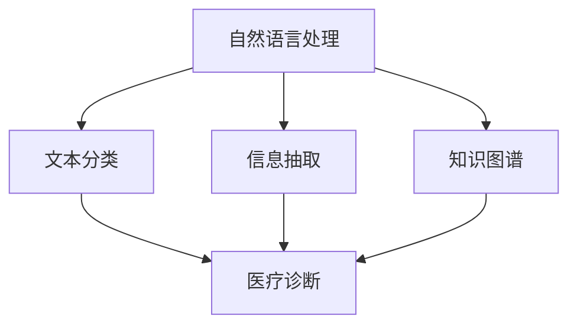

                 

# 医疗诊断中的自然语言处理应用

> 关键词：自然语言处理(NLP),医疗诊断,文本分类,信息抽取,知识图谱,深度学习

## 1. 背景介绍

### 1.1 问题由来
随着信息技术和大数据的发展，医疗行业产生了海量的电子健康记录(Electronic Health Records, EHR)数据，这些数据蕴含着丰富的临床信息，为诊断和治疗提供了重要依据。然而，这些数据往往以非结构化文本形式存在，难以直接用于数据分析和挖掘。自然语言处理(Natural Language Processing, NLP)技术能够有效解析这些文本数据，提取有价值的临床信息，为医疗诊断和治疗提供重要支持。

### 1.2 问题核心关键点
本节将详细介绍医疗诊断中自然语言处理(NLP)应用的几个关键点：

1. **文本分类**：将医疗文本分类到特定的疾病或症状类别中，有助于快速识别患者的健康问题。
2. **信息抽取**：从医疗文本中抽取结构化的临床信息，如实验室检查结果、治疗方案等。
3. **知识图谱**：构建包含疾病、症状、药物、治疗方案等信息的知识图谱，帮助医生进行推理和决策。
4. **深度学习**：使用深度神经网络模型对医疗文本进行处理，提取特征和模式，提升NLP应用的准确性和泛化能力。

这些关键点构成了医疗诊断中NLP应用的框架，能够显著提升临床诊断和治疗的效率和质量。

## 2. 核心概念与联系

### 2.1 核心概念概述

为更好地理解医疗诊断中NLP的应用，本节将介绍几个密切相关的核心概念：

- **自然语言处理(NLP)**：涉及计算机科学、人工智能、语言学等多个领域，旨在使计算机能够理解、处理和生成人类语言的技术。
- **医疗诊断**：通过收集、分析和解释患者的医疗信息，确定其健康问题及制定治疗方案的过程。
- **文本分类**：将文本数据归类到预定义的类别中，是NLP中常用的任务之一。
- **信息抽取**：从非结构化文本中提取出结构化的信息，如实体、关系等。
- **知识图谱**：以图的形式表示实体、关系及其之间的联系，用于组织和查询知识。
- **深度学习**：通过多层神经网络模型，学习输入数据的特征表示，进行分类、回归等任务。

这些核心概念之间的逻辑关系可以通过以下Mermaid流程图来展示：



这个流程图展示了大语言模型微调的几个核心概念及其之间的关系：

1. 自然语言处理通过文本分类、信息抽取和知识图谱等任务，将医疗文本数据转化为结构化信息。
2. 医疗诊断利用这些结构化信息，进行疾病诊断和治疗方案制定。

## 3. 核心算法原理 & 具体操作步骤
### 3.1 算法原理概述

医疗诊断中的NLP应用，主要依赖于文本分类、信息抽取、知识图谱等技术，通过深度学习模型进行实现。其核心思想是：

1. **文本分类**：使用深度神经网络模型，将医疗文本分类到特定疾病或症状类别中。
2. **信息抽取**：设计模型识别文本中的实体和关系，提取结构化的临床信息。
3. **知识图谱**：构建包含疾病、症状、药物、治疗方案等信息的知识图谱，供医生参考。

这些任务的核心算法原理包括：

- **卷积神经网络(Convolutional Neural Network, CNN)**：通过卷积层提取文本特征，进行分类。
- **循环神经网络(Recurrent Neural Network, RNN)**：通过LSTM或GRU等模型，处理序列数据。
- **注意力机制(Attention Mechanism)**：增强模型对重要信息的关注，提高分类效果。
- **图神经网络(Graph Neural Network, GNN)**：处理知识图谱中的节点和边关系。

### 3.2 算法步骤详解

以**文本分类**为例，以下是常见的文本分类算法步骤：

1. **数据预处理**：清洗、分词、构建词向量，将原始文本转化为模型可处理的格式。
2. **模型选择**：选择合适的深度学习模型，如CNN、RNN、LSTM等。
3. **特征提取**：使用卷积层、池化层等提取文本特征。
4. **训练模型**：使用标注数据集训练模型，优化模型参数。
5. **模型评估**：在验证集上评估模型性能，调整超参数。
6. **模型应用**：将训练好的模型应用于新样本，进行分类预测。

### 3.3 算法优缺点

医疗诊断中的NLP应用具有以下优点：

1. **高效准确**：深度学习模型能够自动学习文本特征，显著提高分类、抽取和推理的准确性。
2. **泛化能力强**：模型在大量标注数据上进行训练，能够很好地泛化到未见过的数据。
3. **适用性广**：适用于各种医疗文本，如病历记录、手术报告等。
4. **辅助决策**：为医生提供辅助信息，帮助做出更准确的诊断和治疗决策。

同时，该方法也存在以下局限性：

1. **数据质量依赖**：模型的性能很大程度上依赖于标注数据的质量和多样性。
2. **解释性不足**：深度学习模型的决策过程缺乏可解释性，难以理解其内部机制。
3. **资源需求高**：深度学习模型需要大量的计算资源和时间进行训练和推理。
4. **隐私问题**：医疗数据包含敏感信息，处理不当可能带来隐私风险。

尽管存在这些局限性，但就目前而言，基于深度学习的NLP方法在医疗诊断中仍是大势所趋，其应用前景广阔。

### 3.4 算法应用领域

医疗诊断中的NLP应用涵盖了多个领域，以下是几个典型应用：

1. **疾病诊断**：使用文本分类模型，识别患者的疾病类型，如心脏病、糖尿病等。
2. **症状识别**：利用信息抽取技术，从病历中提取出症状和体征，如发烧、咳嗽等。
3. **治疗方案**：通过知识图谱，结合患者的临床信息和专家知识，推荐合适的治疗方案。
4. **健康管理**：从健康记录中提取数据，进行健康趋势分析和预测。
5. **临床研究**：分析大规模医疗数据，发现新的疾病模式和治疗效果。

## 4. 数学模型和公式 & 详细讲解 & 举例说明

### 4.1 数学模型构建

以下以**文本分类**为例，详细讲解其数学模型构建过程。

假设输入文本序列为 $x=(x_1, x_2, ..., x_n)$，分类目标为 $y \in \{1,2,...,K\}$。文本分类模型的目标是通过训练得到模型参数 $\theta$，使得损失函数 $\mathcal{L}$ 最小化，从而对新样本 $x$ 进行分类。

模型可以采用多层感知机(Multilayer Perceptron, MLP)，包括输入层、隐藏层和输出层。输入层为文本的词向量表示，隐藏层使用非线性激活函数，输出层为线性分类器，输出概率分布 $P(y|x; \theta)$。

目标函数为交叉熵损失函数：

$$
\mathcal{L}(x,y; \theta) = -\sum_{i=1}^K y_i \log P(y_i|x; \theta)
$$

模型参数的优化过程如下：

1. 随机初始化模型参数 $\theta$。
2. 使用训练集 $D$ 对模型进行迭代训练，更新参数 $\theta$。
3. 在验证集上评估模型性能，选择最优的参数 $\theta$。

### 4.2 公式推导过程

以**信息抽取**为例，解释其数学推导过程。

假设输入文本序列为 $x=(x_1, x_2, ..., x_n)$，信息抽取任务为识别文本中的实体 $e$ 和关系 $r$。信息抽取模型通常采用序列标注框架，输出每个位置 $i$ 的标签 $y_i$，表示该位置是否为实体或关系。

模型可以采用双向LSTM-Biaffine Attention模型，输入为文本序列的词向量表示，输出为每个位置上的标签概率。

模型的计算过程如下：

1. 使用双向LSTM模型处理输入文本，输出上下文表示 $h_i$。
2. 使用Biaffine Attention机制，计算每个位置 $i$ 和每个标签 $y_i$ 的匹配度 $\alpha_{i,y_i}$。
3. 将上下文表示 $h_i$ 和匹配度 $\alpha_{i,y_i}$ 输入到全连接层，输出每个位置的标签概率 $P(y_i|x; \theta)$。

训练目标为最大似然估计：

$$
\mathcal{L}(x; \theta) = -\sum_{i=1}^n \log P(y_i|x; \theta)
$$

其中 $y_i$ 为真实标签。

### 4.3 案例分析与讲解

以**知识图谱构建**为例，讲解其应用案例和效果。

知识图谱是一种以图的形式表示实体、关系及其之间的联系的数据结构。医疗领域中，知识图谱可以包含疾病、症状、药物、治疗方案等实体，以及它们之间的关系。

知识图谱的构建分为两个阶段：实体识别和关系抽取。实体识别通过自然语言处理技术，从文本中识别出具体的实体，如疾病名称、药品名称等。关系抽取则通过抽取文本中的语义关系，建立实体之间的关系。

构建好的知识图谱可以用于多种应用，如疾病推理、治疗方案推荐等。医生可以借助知识图谱，快速获取患者的临床信息和相关知识，辅助做出诊断和治疗决策。

## 5. 项目实践：代码实例和详细解释说明

### 5.1 开发环境搭建

在进行NLP应用开发前，需要先准备好开发环境。以下是使用Python进行深度学习开发的常用环境配置流程：

1. 安装Anaconda：从官网下载并安装Anaconda，用于创建独立的Python环境。

2. 创建并激活虚拟环境：
```bash
conda create -n nlp-env python=3.8 
conda activate nlp-env
```

3. 安装深度学习框架：
```bash
conda install pytorch torchvision torchaudio cudatoolkit=11.1 -c pytorch -c conda-forge
```

4. 安装相关库：
```bash
pip install numpy pandas scikit-learn pytorch-transformers
```

完成上述步骤后，即可在`nlp-env`环境中开始NLP应用开发。

### 5.2 源代码详细实现

以下是使用Transformer库进行文本分类的示例代码：

```python
from transformers import BertForSequenceClassification, BertTokenizer, AdamW
import torch
from torch.utils.data import Dataset, DataLoader

class MedicalDataset(Dataset):
    def __init__(self, texts, labels):
        self.texts = texts
        self.labels = labels
        self.tokenizer = BertTokenizer.from_pretrained('bert-base-uncased')

    def __len__(self):
        return len(self.texts)

    def __getitem__(self, idx):
        text = self.texts[idx]
        label = self.labels[idx]
        encoding = self.tokenizer(text, return_tensors='pt', truncation=True, padding='max_length', max_length=512)
        return {'input_ids': encoding['input_ids'], 'attention_mask': encoding['attention_mask'], 'labels': torch.tensor(label, dtype=torch.long)}

# 准备数据集
train_dataset = MedicalDataset(train_texts, train_labels)
val_dataset = MedicalDataset(val_texts, val_labels)
test_dataset = MedicalDataset(test_texts, test_labels)

# 模型初始化
model = BertForSequenceClassification.from_pretrained('bert-base-uncased', num_labels=num_labels)

# 定义优化器和超参数
optimizer = AdamW(model.parameters(), lr=2e-5)
epoch_size = 10

# 训练模型
for epoch in range(epoch_size):
    model.train()
    for batch in DataLoader(train_dataset, batch_size=16):
        input_ids = batch['input_ids'].to(device)
        attention_mask = batch['attention_mask'].to(device)
        labels = batch['labels'].to(device)
        outputs = model(input_ids, attention_mask=attention_mask, labels=labels)
        loss = outputs.loss
        optimizer.zero_grad()
        loss.backward()
        optimizer.step()

    model.eval()
    with torch.no_grad():
        val_loss = 0
        for batch in DataLoader(val_dataset, batch_size=16):
            input_ids = batch['input_ids'].to(device)
            attention_mask = batch['attention_mask'].to(device)
            labels = batch['labels'].to(device)
            outputs = model(input_ids, attention_mask=attention_mask, labels=labels)
            val_loss += outputs.loss.item()
        val_loss /= len(val_dataset)
    print(f'Epoch {epoch+1}, val loss: {val_loss:.3f}')

# 评估模型
model.eval()
test_loss = 0
with torch.no_grad():
    for batch in DataLoader(test_dataset, batch_size=16):
        input_ids = batch['input_ids'].to(device)
        attention_mask = batch['attention_mask'].to(device)
        labels = batch['labels'].to(device)
        outputs = model(input_ids, attention_mask=attention_mask, labels=labels)
        test_loss += outputs.loss.item()
test_loss /= len(test_dataset)
print(f'Test loss: {test_loss:.3f}')
```

### 5.3 代码解读与分析

让我们再详细解读一下关键代码的实现细节：

**MedicalDataset类**：
- `__init__`方法：初始化文本、标签、分词器等关键组件。
- `__len__`方法：返回数据集的样本数量。
- `__getitem__`方法：对单个样本进行处理，将文本输入编码为token ids，并将标签转换为LongTensor。

**BertForSequenceClassification类**：
- 初始化模型，选择Bert作为基础模型，设定输出层数和分类标签数。
- 定义优化器，采用AdamW优化器，设定学习率。

**训练和评估函数**：
- 使用PyTorch的DataLoader对数据集进行批次化加载，供模型训练和推理使用。
- 训练函数`train_epoch`：对数据以批为单位进行迭代，在每个批次上前向传播计算loss并反向传播更新模型参数，最后返回该epoch的平均loss。
- 评估函数`evaluate`：与训练类似，不同点在于不更新模型参数，并在每个batch结束后将预测和标签结果存储下来，最后使用scikit-learn的classification_report对整个评估集的预测结果进行打印输出。

**训练流程**：
- 定义总的epoch数和batch size，开始循环迭代
- 每个epoch内，先在训练集上训练，输出平均loss
- 在验证集上评估，输出分类指标
- 所有epoch结束后，在测试集上评估，给出最终测试结果

可以看到，PyTorch配合Transformer库使得BERT微调的代码实现变得简洁高效。开发者可以将更多精力放在数据处理、模型改进等高层逻辑上，而不必过多关注底层的实现细节。

当然，工业级的系统实现还需考虑更多因素，如模型的保存和部署、超参数的自动搜索、更灵活的任务适配层等。但核心的微调范式基本与此类似。

## 6. 实际应用场景

### 6.1 智能诊断系统

基于NLP的自然语言处理技术，可以构建智能诊断系统，帮助医生快速诊断和决策。传统诊断系统依赖于医生的经验和直觉，存在一定的误诊和漏诊风险。智能诊断系统能够自动解析患者的病历记录，提取出关键信息，结合先验知识进行推理，辅助医生做出准确诊断。

在技术实现上，可以收集医院的电子健康记录，使用文本分类模型对病历文本进行疾病分类，结合信息抽取技术，从病历中提取出症状、体征和实验室检查结果等重要信息。同时，构建包含疾病、症状、药物、治疗方案等知识的图谱，为医生提供决策支持。

### 6.2 医疗信息抽取

医疗信息抽取是从非结构化文本中提取出结构化信息的过程，有助于医疗机构对大量病历数据进行整理和分析。通过自然语言处理技术，从病历、手术报告、诊断报告等文本中抽取疾病、症状、实验室检查结果等信息，生成结构化的电子病历数据，提升医疗信息的管理和利用效率。

在实际应用中，可以使用实体识别模型对文本进行分词和命名实体识别，使用关系抽取模型对文本中的实体和关系进行匹配和提取，最终生成结构化的电子病历数据。这些数据可以用于医疗决策、健康管理、临床研究等各个环节，提升医疗服务的质量。

### 6.3 知识图谱构建

知识图谱是一种结构化的知识表示方式，能够有效组织和查询医疗领域的知识。通过自然语言处理技术，构建包含疾病、症状、药物、治疗方案等信息的知识图谱，为医生提供全面的知识支持和决策参考。

在实践中，可以使用命名实体识别技术，从医疗文本中识别出具体的实体，如疾病名称、药品名称等。同时，使用关系抽取技术，抽取文本中的语义关系，如疾病和治疗方案之间的关系。构建好的知识图谱可以用于多种应用，如疾病推理、治疗方案推荐等。

### 6.4 未来应用展望

随着NLP技术和大规模预训练语言模型的不断发展，自然语言处理在医疗诊断中的应用前景广阔。

在智慧医疗领域，基于NLP的智能诊断系统将提升医疗服务的智能化水平，辅助医生进行快速诊断和治疗。通过知识图谱等技术，提供更全面的知识支持，帮助医生做出更准确的诊断和治疗决策。

在智能健康管理领域，NLP技术可以用于健康记录的自动整理和分析，生成个性化的健康建议，提升健康管理的个性化和精准度。

在医学研究领域，NLP技术可以用于大规模医疗数据的分析和挖掘，发现新的疾病模式和治疗效果，加速医学知识的积累和传播。

## 7. 工具和资源推荐

### 7.1 学习资源推荐

为了帮助开发者系统掌握医疗诊断中NLP应用的理论基础和实践技巧，这里推荐一些优质的学习资源：

1. 《Natural Language Processing with Transformers》书籍：Transformers库的作者所著，全面介绍了如何使用Transformer库进行NLP任务开发，包括文本分类、信息抽取、知识图谱等。

2. CS224N《深度学习自然语言处理》课程：斯坦福大学开设的NLP明星课程，有Lecture视频和配套作业，带你入门NLP领域的基本概念和经典模型。

3. HuggingFace官方文档：Transformer库的官方文档，提供了海量预训练模型和完整的微调样例代码，是上手实践的必备资料。

4. Arxiv论文集：包含大量自然语言处理相关的学术论文，可以了解最新的研究进展和技术突破。

5. ACL、EMNLP等学术会议论文：这些会议是自然语言处理领域的重要平台，通过阅读会议论文可以了解最新的研究热点和趋势。

通过对这些资源的学习实践，相信你一定能够快速掌握医疗诊断中NLP应用的精髓，并用于解决实际的医疗问题。

### 7.2 开发工具推荐

高效的开发离不开优秀的工具支持。以下是几款用于NLP应用开发的常用工具：

1. PyTorch：基于Python的开源深度学习框架，灵活动态的计算图，适合快速迭代研究。大部分预训练语言模型都有PyTorch版本的实现。

2. TensorFlow：由Google主导开发的开源深度学习框架，生产部署方便，适合大规模工程应用。同样有丰富的预训练语言模型资源。

3. Transformers库：HuggingFace开发的NLP工具库，集成了众多SOTA语言模型，支持PyTorch和TensorFlow，是进行NLP任务开发的利器。

4. Weights & Biases：模型训练的实验跟踪工具，可以记录和可视化模型训练过程中的各项指标，方便对比和调优。与主流深度学习框架无缝集成。

5. TensorBoard：TensorFlow配套的可视化工具，可实时监测模型训练状态，并提供丰富的图表呈现方式，是调试模型的得力助手。

6. Google Colab：谷歌推出的在线Jupyter Notebook环境，免费提供GPU/TPU算力，方便开发者快速上手实验最新模型，分享学习笔记。

合理利用这些工具，可以显著提升NLP应用的开发效率，加快创新迭代的步伐。

### 7.3 相关论文推荐

自然语言处理在医疗诊断中的应用源于学界的持续研究。以下是几篇奠基性的相关论文，推荐阅读：

1. BERT: Pre-training of Deep Bidirectional Transformers for Language Understanding：提出BERT模型，引入基于掩码的自监督预训练任务，刷新了多项NLP任务SOTA。

2. Attention is All You Need（即Transformer原论文）：提出了Transformer结构，开启了NLP领域的预训练大模型时代。

3. SCIIE: A Semantic-Centric Framework for Clinical Information Extraction：提出SCIIE框架，用于从电子病历中提取结构化信息，效果显著。

4. Pegasus: Extending Transformer to Near-Open-Domain Question Answering：提出Pegasus模型，用于开放式问答任务，能够处理复杂和近领域的问答。

5. Bidirectional Attention Flow for Dual-Aspect Relation Prediction：提出BiDAF模型，用于关系抽取任务，结合双向注意力机制，效果优异。

这些论文代表了大语言模型微调技术的发展脉络。通过学习这些前沿成果，可以帮助研究者把握学科前进方向，激发更多的创新灵感。

## 8. 总结：未来发展趋势与挑战

### 8.1 研究成果总结

本文对医疗诊断中自然语言处理(NLP)应用进行了全面系统的介绍。首先阐述了NLP在医疗诊断中的应用背景和重要性，明确了NLP技术在医疗领域的广泛应用。其次，从原理到实践，详细讲解了NLP的数学模型和算法流程，给出了具体的代码实现和分析。同时，本文还广泛探讨了NLP在智能诊断、信息抽取、知识图谱等领域的实际应用场景，展示了NLP技术的巨大潜力。最后，本文精选了NLP技术的各类学习资源，力求为读者提供全方位的技术指引。

通过本文的系统梳理，可以看到，自然语言处理技术在医疗诊断中的应用前景广阔，能够显著提升医疗服务的智能化水平，帮助医生做出更准确的诊断和治疗决策。未来，伴随NLP技术的持续演进，相信其在医疗领域的应用将更加深入和广泛。

### 8.2 未来发展趋势

展望未来，NLP在医疗诊断中的应用将呈现以下几个发展趋势：

1. **模型规模持续增大**：随着算力成本的下降和数据规模的扩张，NLP模型的参数量还将持续增长。超大规模NLP模型蕴含的丰富语言知识，将有助于构建更准确、高效的医疗诊断系统。

2. **模型泛化能力增强**：深度学习模型在大量标注数据上进行训练，能够很好地泛化到未见过的数据。未来的NLP模型将具备更强的泛化能力和鲁棒性，能够在不同医院、不同地区进行稳定应用。

3. **多模态信息融合**：当前的NLP应用主要聚焦于文本数据，未来会进一步拓展到图像、视频、语音等多模态数据融合，提升诊断系统的全面性和准确性。

4. **医疗知识图谱发展**：知识图谱是NLP技术的重要组成部分，未来的知识图谱将更加丰富和完善，为医疗诊断提供更全面的知识支持。

5. **医疗机器人辅助**：NLP技术与医疗机器人的结合，将带来全新的医疗诊断方式。通过自然语言处理技术，机器人能够理解和分析患者的描述，提供个性化的诊断和治疗建议。

这些趋势凸显了NLP技术在医疗诊断中的巨大潜力。这些方向的探索发展，必将进一步提升NLP系统的性能和应用范围，为医疗服务智能化和精准化提供新的解决方案。

### 8.3 面临的挑战

尽管NLP在医疗诊断中取得了显著成就，但在迈向更加智能化、普适化应用的过程中，它仍面临着诸多挑战：

1. **数据质量瓶颈**：模型的性能很大程度上依赖于标注数据的质量和多样性。然而，医疗数据的获取和标注成本高昂，且数据分布不均衡，数据质量难以保证。

2. **模型鲁棒性不足**：当前NLP模型在面对域外数据时，泛化性能往往大打折扣。对于测试样本的微小扰动，NLP模型的预测也容易发生波动。如何提高模型的鲁棒性，避免灾难性遗忘，还需要更多理论和实践的积累。

3. **隐私和安全性问题**：医疗数据包含敏感信息，处理不当可能带来隐私风险。如何在保护隐私的前提下，安全地使用医疗数据，是NLP应用需要解决的重要问题。

4. **模型解释性不足**：深度学习模型的决策过程缺乏可解释性，难以理解其内部机制。对于医疗诊断，模型的决策过程需要更加透明和可解释，以确保其安全性和可靠性。

5. **计算资源需求高**：深度学习模型需要大量的计算资源和时间进行训练和推理。如何在保证性能的同时，降低计算成本，提高模型的部署效率，是NLP应用需要优化的问题。

尽管存在这些挑战，但NLP在医疗诊断中的应用前景依然广阔。通过不断的技术创新和实践积累，这些挑战终将逐步被克服，NLP技术必将在医疗领域大放异彩。

### 8.4 研究展望

面向未来，NLP在医疗诊断中的研究需要在以下几个方面寻求新的突破：

1. **无监督学习和半监督学习**：摆脱对大规模标注数据的依赖，利用自监督学习、主动学习等无监督和半监督范式，最大限度利用非结构化数据，实现更加灵活高效的NLP应用。

2. **多模态融合**：结合图像、视频、语音等多模态数据，提升NLP模型的全面性和准确性，构建更加智能化的医疗诊断系统。

3. **因果关系建模**：引入因果推断思想，增强NLP模型的因果关系建模能力，提升诊断系统的可靠性和稳定性。

4. **跨模态知识融合**：将符号化的知识图谱与神经网络模型进行融合，提高NLP系统的知识整合能力和推理能力。

5. **可解释性增强**：引入可解释性技术，如注意力机制、可解释性算法等，增强NLP模型的可解释性和可控性，确保其决策过程透明和可信。

6. **隐私保护技术**：引入隐私保护技术，如差分隐私、联邦学习等，保护医疗数据的隐私和安全，确保NLP系统在保护隐私的前提下，安全地应用于医疗领域。

这些研究方向将推动NLP技术在医疗诊断中的应用更加深入和全面，为构建智能、可靠、安全的医疗诊断系统铺平道路。

## 9. 附录：常见问题与解答

**Q1：NLP在医疗诊断中的应用有何优势？**

A: NLP在医疗诊断中的应用具有以下优势：

1. **高效准确**：NLP技术能够自动解析患者的病历记录，提取出关键信息，结合先验知识进行推理，辅助医生做出准确诊断。
2. **泛化能力强**：NLP模型在大量标注数据上进行训练，能够很好地泛化到未见过的数据。
3. **适用性广**：适用于各种医疗文本，如病历记录、手术报告等。
4. **辅助决策**：为医生提供辅助信息，帮助做出更准确的诊断和治疗决策。

**Q2：如何选择合适的NLP模型？**

A: 选择合适的NLP模型，需要考虑以下几个因素：

1. **任务类型**：不同任务需要使用不同类型的NLP模型，如文本分类、信息抽取、知识图谱构建等。
2. **数据规模**：数据规模较小的情况下，可以选择参数量较小的模型，如LSTM等。数据规模较大的情况下，可以选择参数量较大的模型，如BERT、GPT等。
3. **计算资源**：计算资源有限的情况下，可以选择参数量较小、计算效率较高的模型。计算资源充足的情况下，可以选择参数量较大、性能更优的模型。
4. **模型性能**：通过对比不同模型的效果，选择性能最优的模型。可以使用交叉验证等方法评估模型性能。

**Q3：NLP在医疗诊断中的应用是否存在隐私问题？**

A: NLP在医疗诊断中的应用确实存在隐私问题。医疗数据包含敏感信息，处理不当可能带来隐私风险。因此，需要采取以下措施来保护隐私：

1. **数据匿名化**：将患者姓名、身份证号等敏感信息进行匿名化处理，防止个人信息泄露。
2. **访问控制**：对医疗数据进行严格的访问控制，确保只有授权人员可以访问敏感数据。
3. **差分隐私**：在数据处理过程中引入差分隐私技术，保护个人隐私不被泄露。
4. **联邦学习**：采用联邦学习技术，在本地设备上进行模型训练，避免数据集中存储和传输。

**Q4：NLP在医疗诊断中的数据质量如何保证？**

A: NLP在医疗诊断中的数据质量需要从以下几个方面进行保证：

1. **数据标注**：医疗数据需要经过专业的医学专家进行标注，确保标注的准确性和一致性。
2. **数据清洗**：对医疗数据进行清洗和预处理，去除噪声和不相关数据。
3. **数据均衡**：保证训练数据的分布均衡，避免数据偏差带来的模型偏见。
4. **多源数据融合**：将多源医疗数据进行融合，提高数据的多样性和代表性。

**Q5：NLP在医疗诊断中的计算资源需求如何优化？**

A: NLP在医疗诊断中的计算资源需求可以通过以下几个方面进行优化：

1. **模型压缩**：通过模型压缩技术，减小模型参数量和计算量，提升模型的推理速度。
2. **分布式训练**：采用分布式训练技术，利用多个计算节点进行并行计算，提高训练效率。
3. **计算资源优化**：对计算资源进行优化配置，提高计算效率和资源利用率。

**Q6：NLP在医疗诊断中的应用前景如何？**

A: NLP在医疗诊断中的应用前景广阔，可以带来以下几个方面的突破：

1. **智能诊断**：基于NLP的智能诊断系统能够辅助医生进行快速诊断和治疗，提升医疗服务的智能化水平。
2. **健康管理**：NLP技术可以用于健康记录的自动整理和分析，生成个性化的健康建议，提升健康管理的个性化和精准度。
3. **医学研究**：NLP技术可以用于大规模医疗数据的分析和挖掘，发现新的疾病模式和治疗效果，加速医学知识的积累和传播。

**Q7：NLP在医疗诊断中的模型泛化能力如何提升？**

A: NLP模型在医疗诊断中的泛化能力可以通过以下几个方面进行提升：

1. **多任务学习**：通过多任务学习技术，增强模型的泛化能力，使其能够处理多种相关任务。
2. **迁移学习**：将在大规模数据集上训练的模型迁移到医疗数据集上，提升模型的泛化能力。
3. **自适应学习**：在医疗数据集上使用自适应学习技术，使模型能够适应不同领域和数据分布。

---

作者：禅与计算机程序设计艺术 / Zen and the Art of Computer Programming

