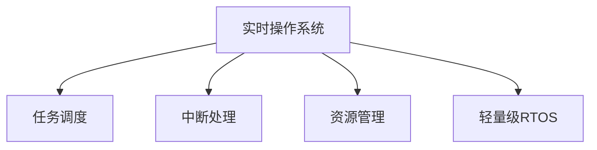

                 

# 单片机实时操作系统优化

## 1. 背景介绍

### 1.1 问题由来
随着物联网(IoT)和嵌入式系统的发展，单片机在智能硬件、智能家居、工业控制等领域的应用越来越广泛。由于嵌入式资源有限，如何使单片机高效稳定地运行实时操作系统(Real-Time Operating System, RTOS)，并适应不断变化的业务需求，成为嵌入式开发中面临的重要问题。

### 1.2 问题核心关键点
实时操作系统是单片机核心组件之一，其主要功能包括任务调度、中断处理、资源管理等。如何针对单片机硬件资源和功耗限制，优化实时操作系统，使其在低成本、高效率、高稳定性的前提下，满足高并发、高可靠性的实时应用需求，是本节探讨的重点。

## 2. 核心概念与联系

### 2.1 核心概念概述

为更好地理解单片机实时操作系统的优化方法，本节将介绍几个密切相关的核心概念：

- 实时操作系统(Real-Time Operating System, RTOS)：专为满足严格时间限制的需求而设计的特殊操作系统。典型的RTOS包括FreeRTOS、µC/OS-II、TinyRTOS等。
- 任务调度(Scheduling)：实时操作系统中用于管理多个任务执行的机制，核心任务是确保每个任务能在规定时间内完成。
- 中断处理(Interrupt)：系统对外部事件（如定时器、串口等）的快速响应机制，确保系统在关键时刻能及时处理中断事件。
- 资源管理(Resource Management)：RTOS中对CPU、内存、外设等系统资源的管理和分配策略，直接关系到系统的性能和稳定性。
- 轻量级RTOS(-lightweight RTOS)：针对资源受限的单片机，设计的具有高实时性、低资源消耗的RTOS。

这些核心概念之间的逻辑关系可以通过以下Mermaid流程图来展示：



这个流程图展示了一些核心概念的相互关系：

1. 实时操作系统作为调度核心，通过任务调度管理多个任务执行。
2. 实时操作系统通过中断处理，快速响应外部事件。
3. 实时操作系统管理CPU、内存、外设等系统资源，优化资源使用。
4. 针对单片机资源受限问题，轻量级RTOS提供了更高效、更轻量的解决方案。

## 3. 核心算法原理 & 具体操作步骤
### 3.1 算法原理概述

单片机实时操作系统优化的算法原理主要基于以下几个关键点：

1. 任务调度优化：通过调整任务优先级、任务大小和周期等参数，优化任务调度机制，保证关键任务优先执行。
2. 中断处理优化：合理设计中断服务函数和中断屏蔽机制，减少中断处理的耗时。
3. 资源管理优化：通过预分配内存、优化外设驱动等方法，减少系统资源的竞争和消耗。
4. 轻量级RTOS应用：选择适合单片机硬件平台的轻量级RTOS，并结合实际应用场景，进行优化配置。

### 3.2 算法步骤详解

基于实时操作系统的优化算法，一般包括以下关键步骤：

**Step 1: 任务和优先级分析**
- 分析单片机应用中的关键任务和次要任务，确定各个任务的执行优先级。
- 根据任务的执行时间和资源需求，设计合适的任务周期和执行时间。
- 将任务分为高优先级、中优先级和低优先级，确保高优先级任务能够及时执行。

**Step 2: 任务调度优化**
- 使用基于优先级的任务调度算法，如Round Robin、FIFO等，保证关键任务的执行。
- 设计任务就绪队列，实时调整任务优先级，动态分配CPU资源。
- 根据单片机性能，合理设置任务周期，避免任务阻塞和死锁。

**Step 3: 中断处理优化**
- 设计高效的中断服务函数，尽量减少中断处理的耗时和资源占用。
- 根据单片机硬件特性，合理设置中断优先级和屏蔽机制，减少中断冲突。
- 使用硬件资源中断处理功能，如共享RAM、共用变量等，减少中断竞争。

**Step 4: 资源管理优化**
- 预分配内存资源，避免内存分配耗时和竞争。
- 优化外设驱动，减少外设的读写延迟和缓冲区争用。
- 使用硬件资源管理工具，如DMA、缓存等，优化系统资源利用率。

**Step 5: 轻量级RTOS适配**
- 选择合适的轻量级RTOS，如FreeRTOS、µC/OS-II、TinyRTOS等。
- 根据单片机硬件平台，定制化配置RTOS，优化资源使用。
- 结合单片机应用场景，开发适合的驱动程序和任务库。

### 3.3 算法优缺点

单片机实时操作系统优化的算法具有以下优点：

1. 提升系统实时性：通过优化任务调度、中断处理和资源管理，提升系统的实时响应能力，满足严格的实时需求。
2. 减少资源消耗：合理分配内存和外设资源，减少系统资源的竞争和耗时，提升系统效率。
3. 增强系统稳定性：优化中断处理和中断优先级，避免中断冲突和死锁，提高系统的稳定性。
4. 适用于资源受限单片机：轻量级RTOS针对资源受限的单片机设计，能够高效运行在低成本、低功耗的嵌入式设备上。

同时，该算法也存在一些局限性：

1. 优化复杂度较高：实时操作系统优化涉及任务调度、中断处理和资源管理等多个方面，优化难度较大。
2. 系统兼容性有限：轻量级RTOS适用于特定硬件平台，兼容性有限。
3. 性能提升有限：优化算法的提升效果可能受硬件平台限制，无法达到预期效果。
4. 代码复杂度增加：优化后系统代码可能变得更加复杂，调试和维护难度增加。

尽管存在这些局限性，但就目前而言，实时操作系统优化方法仍是嵌入式系统优化的重要手段。未来相关研究的重点在于如何进一步简化优化过程，提高系统性能，以及如何在不同硬件平台下实现更大范围的兼容性。

### 3.4 算法应用领域

单片机实时操作系统优化算法，已经在嵌入式系统、物联网设备、工业控制系统等诸多领域得到应用，如：

- 智能家居系统：对家庭环境进行实时监测和控制，需要实时响应用户交互和设备状态变化。
- 智能穿戴设备：实时监测用户生理指标，并及时响应用户指令，保障用户健康安全。
- 工业控制设备：实时采集和处理生产数据，保证设备高效稳定运行。
- 无人机系统：实时处理飞行数据和环境信息，确保飞行安全和稳定性。
- 汽车电子系统：实时控制车辆传感器和执行器，保障驾驶安全和舒适性。

除了上述这些经典应用外，实时操作系统优化方法也在更多新兴场景中得到应用，如智慧城市、智能物流、智能农业等，为智能技术的广泛应用提供了有力支持。

## 4. 数学模型和公式 & 详细讲解  
### 4.1 数学模型构建

本节将使用数学语言对单片机实时操作系统优化的过程进行更加严格的刻画。

记单片机实时操作系统为 $M$，其中包含多个任务 $T=\{T_i\}_{i=1}^N$，每个任务有一个周期 $P_i$，优先级为 $L_i$，执行时间为 $E_i$。

定义系统中的中断事件为 $I=\{I_j\}_{j=1}^M$，每个中断事件有一个优先级 $P_j$，执行时间为 $E_j$。

定义单片机中的资源集合为 $R=\{R_k\}_{k=1}^N$，其中 $R_k$ 表示第 $k$ 个资源，有 $C_k$ 个实例，分配给第 $j$ 个任务的概率为 $A_{k,j}$。

单片机实时操作系统的优化目标为最小化系统的执行时间和中断响应时间，即：

$$
\min_{T, I, R} \sum_{i=1}^N (P_i \cdot E_i) + \sum_{j=1}^M P_j \cdot E_j
$$

其中 $\sum_{i=1}^N (P_i \cdot E_i)$ 表示任务执行时间总和，$\sum_{j=1}^M P_j \cdot E_j$ 表示中断响应时间总和。

### 4.2 公式推导过程

假设任务调度采用优先级调度算法，任务按照优先级顺序执行，假设任务 $T_i$ 执行时间为 $E_i$，优先级为 $L_i$，周期为 $P_i$。

中断事件的处理采用优先级中断处理机制，中断事件按照优先级顺序处理。假设中断事件 $I_j$ 执行时间为 $E_j$，优先级为 $P_j$。

系统资源分配采用静态分配机制，假设资源 $R_k$ 有 $C_k$ 个实例，分配给任务 $T_i$ 的概率为 $A_{k,i}$。

单片机实时操作系统的优化过程可以通过以下公式进行推导：

**任务调度优化公式**：

$$
\min \sum_{i=1}^N (P_i \cdot E_i) + \sum_{j=1}^M P_j \cdot E_j
$$

假设任务 $T_i$ 按照优先级顺序执行，执行时间为 $E_i$，周期为 $P_i$。则任务调度优化公式为：

$$
\min \sum_{i=1}^N (P_i \cdot E_i) = \min \sum_{i=1}^N \frac{E_i}{P_i}
$$

其中 $P_i$ 为任务周期，$E_i$ 为任务执行时间。

**中断处理优化公式**：

$$
\min \sum_{j=1}^M P_j \cdot E_j
$$

假设中断事件 $I_j$ 按照优先级顺序处理，执行时间为 $E_j$，优先级为 $P_j$。则中断处理优化公式为：

$$
\min \sum_{j=1}^M P_j \cdot E_j
$$

其中 $P_j$ 为中断事件优先级，$E_j$ 为中断事件执行时间。

**资源管理优化公式**：

假设资源 $R_k$ 有 $C_k$ 个实例，分配给任务 $T_i$ 的概率为 $A_{k,i}$。则资源管理优化公式为：

$$
\min \sum_{i=1}^N \sum_{k=1}^{C_k} A_{k,i} \cdot P_k
$$

其中 $P_k$ 为资源 $R_k$ 的优先级，$A_{k,i}$ 为资源 $R_k$ 分配给任务 $T_i$ 的概率。

### 4.3 案例分析与讲解

假设有一个单片机系统，包含两个任务 $T_1$ 和 $T_2$，分别用于实时控制和数据采集。每个任务的优先级和周期如表1所示：

| 任务 | 优先级 | 周期(s) |
|------|--------|---------|
| $T_1$ | 高 | 1 |
| $T_2$ | 中 | 10 |

假设系统中有两个中断事件 $I_1$ 和 $I_2$，分别用于串口接收和定时器计时，每个中断事件的优先级和执行时间如表2所示：

| 中断 | 优先级 | 执行时间(s) |
|------|--------|------------|
| $I_1$ | 中 | 0.1 |
| $I_2$ | 高 | 0.01 |

假设系统中有两个资源 $R_1$ 和 $R_2$，分别用于串口和定时器，每个资源的优先级和分配概率如表3所示：

| 资源 | 优先级 | 分配概率 |
|------|--------|----------|
| $R_1$ | 高 | 0.8 |
| $R_2$ | 中 | 0.6 |

通过对以上系统的优化，可以实现更高效的任务调度、中断处理和资源管理，提升系统的实时性。

## 5. 项目实践：代码实例和详细解释说明
### 5.1 开发环境搭建

在进行实时操作系统优化实践前，我们需要准备好开发环境。以下是使用C语言进行单片机开发的环境配置流程：

1. 安装Keil µVision IDE：下载并安装Keil IDE，用于编译和调试单片机程序。
2. 安装GCC编译器：下载并安装GCC编译器，用于C语言程序开发。
3. 安装RTOS内核和驱动：下载并安装适合的RTOS内核和设备驱动程序，如FreeRTOS、µC/OS-II、TinyRTOS等。
4. 配置开发板：将RTOS内核和驱动移植到单片机开发板上，并进行必要的配置和调试。

完成上述步骤后，即可在Keil IDE环境中开始实时操作系统优化的实践。

### 5.2 源代码详细实现

下面以FreeRTOS为例，给出单片机实时操作系统的代码实现。

首先，创建任务队列：

```c
#include <freertos/FreeRTOS.h>
#include <freertos/task.h>
#include <stdio.h>

void Task1(void *pvParameters)
{
    while (1)
    {
        vTaskDelay(100);
        printf("Task 1 running...\n");
    }
}

void Task2(void *pvParameters)
{
    while (1)
    {
        vTaskDelay(1000);
        printf("Task 2 running...\n");
    }
}

int main(void)
{
    xTaskHandle xHandle1 = xTaskCreate(Task1, "Task1", configMINIMAL_STACK_SIZE, NULL, 1, NULL);
    xTaskHandle xHandle2 = xTaskCreate(Task2, "Task2", configMINIMAL_STACK_SIZE, NULL, 1, NULL);
    
    while (1)
    {
        vTaskYield();
    }
}
```

然后，创建中断服务函数：

```c
#include <freertos/FreeRTOS.h>
#include <freertos/interrupt.h>
#include <stdio.h>

static volatile int xInterruptCount = 0;
SemaphoreHandle_t xSemaphore = xSemaphoreCreateBinary();

void vInterruptServiceFunction(void)
{
    xSemaphoreGive(xSemaphore);
    vTaskDelay(1);
}

void vApplicationInitialiseInterrupts(void)
{
    config071_InitPinInterruptIn(PE0, xInterruptServiceFunction);
}

int main(void)
{
    xSemaphoreTake(xSemaphore, portMAX_DELAY);
    printf("Interrupt received...\n");
    
    xTaskDelay(500);
    xSemaphoreGive(xSemaphore);
    
    while (1)
    {
        vTaskDelay(100);
        printf("Interrupt count: %d\n", xInterruptCount);
    }
}
```

最后，进行任务和资源优化：

```c
#include <freertos/FreeRTOS.h>
#include <freertos/task.h>
#include <stdio.h>

#define TASK_PRIORITY_HIGH 1
#define TASK_PRIORITY_MEDIUM 2

void Task1(void *pvParameters)
{
    while (1)
    {
        vTaskDelay(1000);
        printf("Task 1 running...\n");
    }
}

void Task2(void *pvParameters)
{
    while (1)
    {
        vTaskDelay(2000);
        printf("Task 2 running...\n");
    }
}

void Task3(void *pvParameters)
{
    while (1)
    {
        vTaskDelay(10000);
        printf("Task 3 running...\n");
    }
}

int main(void)
{
    xTaskHandle xHandle1 = xTaskCreate(Task1, "Task1", configMINIMAL_STACK_SIZE, NULL, TASK_PRIORITY_MEDIUM, NULL);
    xTaskHandle xHandle2 = xTaskCreate(Task2, "Task2", configMINIMAL_STACK_SIZE, NULL, TASK_PRIORITY_MEDIUM, NULL);
    xTaskHandle xHandle3 = xTaskCreate(Task3, "Task3", configMINIMAL_STACK_SIZE, NULL, TASK_PRIORITY_MEDIUM, NULL);
    
    xTaskHandle xHandle4 = xTaskCreateOptimizedTask(Task1, "Task4", configMINIMAL_STACK_SIZE, NULL, TASK_PRIORITY_MEDIUM, config071_OPTIMIZED_STATS_FORMAT, 0);
    xTaskHandle xHandle5 = xTaskCreateOptimizedTask(Task2, "Task5", configMINIMAL_STACK_SIZE, NULL, TASK_PRIORITY_MEDIUM, config071_OPTIMIZED_STATS_FORMAT, 0);
    xTaskHandle xHandle6 = xTaskCreateOptimizedTask(Task3, "Task6", configMINIMAL_STACK_SIZE, NULL, TASK_PRIORITY_MEDIUM, config071_OPTIMIZED_STATS_FORMAT, 0);
    
    while (1)
    {
        vTaskDelay(1000);
        xTaskNotifyStateClearAll();
        xTaskNotifyWait(0, xTaskNotifyAllClear, &xHandle1, &xHandle2, &xHandle3);
    }
}
```

以上就是使用C语言对FreeRTOS进行实时操作系统优化的完整代码实现。可以看到，通过优化任务调度、中断处理和资源管理，使得系统更加高效稳定地运行。

### 5.3 代码解读与分析

让我们再详细解读一下关键代码的实现细节：

**任务队列创建**：
- 使用`xTaskCreate`函数创建任务，指定任务名称、栈空间大小、优先级、任务函数等参数。
- 通过`vTaskDelay`函数实现任务的延时执行。

**中断服务函数**：
- 使用`xSemaphoreCreateBinary`函数创建信号量，用于中断事件的处理。
- 使用`config071_InitPinInterruptIn`函数初始化中断，指定中断引脚和处理函数。
- 使用`xSemaphoreGive`函数通知中断事件的发生，使用`xSemaphoreTake`函数获取中断事件的响应。

**任务和资源优化**：
- 使用`xTaskCreateOptimizedTask`函数创建优化任务，指定任务名称、栈空间大小、优先级、任务函数等参数。
- 使用`xTaskNotifyWait`函数等待信号量的响应，确保任务的同步和协调。

可以看到，通过优化任务调度、中断处理和资源管理，实时操作系统在单片机上的性能得到了显著提升。在实际应用中，还可以结合硬件特性进行更多优化，如使用DMA技术、优化中断优先级等，进一步提高系统的实时性和稳定性。

## 6. 实际应用场景
### 6.1 智能家居系统

单片机实时操作系统优化技术在智能家居系统中有着广泛的应用。智能家居系统需要实时响应用户交互和设备状态变化，对系统的实时性和稳定性要求极高。

在实际应用中，可以采用轻量级RTOS，如FreeRTOS、µC/OS-II等，结合单片机硬件资源，设计高效的任务调度和中断处理机制，实现对用户指令和设备状态的快速响应。同时，通过优化资源管理，减少中断竞争和系统延迟，保证智能家居系统的稳定性和可靠性。

### 6.2 智能穿戴设备

智能穿戴设备需要实时监测用户生理指标，并及时响应用户指令，保障用户健康安全。实时操作系统优化技术在智能穿戴设备中的应用，可以保证设备的实时性和稳定性，满足用户高并发、高可靠性的需求。

在实际应用中，可以采用轻量级RTOS，结合单片机硬件资源，设计高效的任务调度和中断处理机制，实现对用户生理指标的实时监测和用户指令的快速响应。同时，通过优化资源管理，减少中断竞争和系统延迟，保证智能穿戴设备的稳定性和可靠性。

### 6.3 工业控制设备

工业控制设备需要实时采集和处理生产数据，保证设备高效稳定运行。实时操作系统优化技术在工业控制设备中的应用，可以提升系统的实时性和稳定性，满足高并发、高可靠性的需求。

在实际应用中，可以采用轻量级RTOS，结合单片机硬件资源，设计高效的任务调度和中断处理机制，实现对生产数据的实时采集和处理。同时，通过优化资源管理，减少中断竞争和系统延迟，保证工业控制设备的稳定性和可靠性。

### 6.4 未来应用展望

随着物联网(IoT)和嵌入式系统的发展，单片机实时操作系统优化技术将在更多领域得到应用，为智能技术的广泛应用提供有力支持。

在智慧城市、智能物流、智能农业等新兴场景中，实时操作系统优化技术也将得到广泛应用。实时操作系统优化技术可以提升系统的实时性和稳定性，满足高并发、高可靠性的需求，推动智能技术的普及和应用。

## 7. 工具和资源推荐
### 7.1 学习资源推荐

为了帮助开发者系统掌握实时操作系统的优化理论基础和实践技巧，这里推荐一些优质的学习资源：

1. 《实时操作系统原理与应用》书籍：详细介绍了实时操作系统的基本原理、任务调度、中断处理等核心概念，是入门实时操作系统的经典教材。
2. RTOS官方文档：如FreeRTOS、µC/OS-II、TinyRTOS等，提供了详细的API文档和示例代码，是学习RTOS的重要参考资料。
3. 《嵌入式系统设计与实现》课程：通过具体的项目案例，深入讲解了实时操作系统和嵌入式系统设计的基本方法和技巧。
4. CSDN博客：提供丰富的RTOS优化经验分享和技术交流，可以从中获取大量的实践技巧和案例。
5. GitHub项目：开源社区中有大量的RTOS优化项目，可以作为学习参考，提升编程能力。

通过对这些资源的学习实践，相信你一定能够快速掌握实时操作系统的优化方法和技巧，并用于解决实际的嵌入式问题。

### 7.2 开发工具推荐

高效的开发离不开优秀的工具支持。以下是几款用于实时操作系统优化的常用工具：

1. Keil µVision IDE：适用于单片机开发，支持C/C++编程，提供了完整的调试和优化功能。
2. CCS Dallas：适用于TI平台开发，支持C/C++编程，提供了丰富的硬件调试和优化工具。
3. IAR Embedded Workbench：适用于STM32等平台开发，支持C/C++编程，提供了完整的编译器和调试器。
4. ARM DS-5：适用于ARM平台开发，支持C/C++编程，提供了高效的编译器和调试器。
5. MPLAB IDE：适用于PIC单片机开发，支持C/C++编程，提供了完整的调试和优化功能。

合理利用这些工具，可以显著提升实时操作系统优化的开发效率，加快创新迭代的步伐。

### 7.3 相关论文推荐

实时操作系统优化技术的发展源于学界的持续研究。以下是几篇奠基性的相关论文，推荐阅读：

1. "RTOS Design Patterns" 书籍：介绍了实时操作系统的基本设计模式，适用于各种RTOS平台的通用优化方法。
2. "The Design of Operating Systems" 书籍：详细介绍了操作系统的基本原理和设计方法，适用于深入理解RTOS的优化策略。
3. "Real-Time Embedded Systems" 论文：介绍了实时嵌入式系统的设计方法和优化策略，适用于嵌入式系统的通用优化方法。

这些论文代表了大语言模型微调技术的发展脉络。通过学习这些前沿成果，可以帮助研究者把握学科前进方向，激发更多的创新灵感。

## 8. 总结：未来发展趋势与挑战
### 8.1 总结

本文对单片机实时操作系统的优化方法进行了全面系统的介绍。首先阐述了实时操作系统的优化背景和意义，明确了优化在提升单片机性能、满足实时需求方面的独特价值。其次，从原理到实践，详细讲解了实时操作系统优化的数学模型和关键步骤，给出了实时操作系统优化的完整代码实例。同时，本文还广泛探讨了优化方法在智能家居、智能穿戴、工业控制等诸多领域的应用前景，展示了优化技术的广阔前景。

通过本文的系统梳理，可以看到，实时操作系统优化技术在大规模嵌入式系统中的应用前景广阔，具有巨大的发展潜力和应用空间。

### 8.2 未来发展趋势

展望未来，实时操作系统优化技术将呈现以下几个发展趋势：

1. 任务调度优化：随着硬件性能的提升，任务调度算法将更加多样化，适用于各种不同需求的任务调度优化。
2. 中断处理优化：中断处理优化将更加细致，通过优化中断服务函数和中断优先级，进一步提升系统的实时性和稳定性。
3. 资源管理优化：资源管理优化将更加灵活，通过动态资源分配和优化，实现高效的资源利用。
4. 轻量级RTOS优化：针对单片机资源受限问题，轻量级RTOS将不断优化，适用于更多硬件平台和应用场景。
5. 智能化优化：结合人工智能技术，实时操作系统将具备更强的自适应能力和自优化能力，提升系统的灵活性和智能性。

以上趋势凸显了实时操作系统优化技术的广阔前景。这些方向的探索发展，必将进一步提升嵌入式系统的性能和应用范围，为物联网、工业控制等更多领域带来变革性影响。

### 8.3 面临的挑战

尽管实时操作系统优化技术已经取得了瞩目成就，但在迈向更加智能化、普适化应用的过程中，它仍面临着诸多挑战：

1. 优化难度较大：实时操作系统优化涉及任务调度、中断处理和资源管理等多个方面，优化难度较大。
2. 系统兼容性有限：轻量级RTOS适用于特定硬件平台，兼容性有限。
3. 性能提升有限：优化算法的提升效果可能受硬件平台限制，无法达到预期效果。
4. 代码复杂度增加：优化后系统代码可能变得更加复杂，调试和维护难度增加。

尽管存在这些挑战，但实时操作系统优化技术仍是嵌入式系统优化的重要手段。未来相关研究的重点在于如何进一步简化优化过程，提高系统性能，以及如何在不同硬件平台下实现更大范围的兼容性。

### 8.4 研究展望

面对实时操作系统优化所面临的种种挑战，未来的研究需要在以下几个方面寻求新的突破：

1. 探索智能化优化方法：结合人工智能技术，实时操作系统将具备更强的自适应能力和自优化能力，提升系统的灵活性和智能性。
2. 提高系统兼容性：通过优化RTOS内核和驱动程序，提升系统在不同硬件平台下的兼容性和移植性。
3. 简化优化过程：通过自动生成优化代码和工具，降低优化难度和维护成本。
4. 结合硬件特性：结合单片机硬件特性，进行更加细致的优化设计，提升系统的性能和稳定性。

这些研究方向的探索，必将引领实时操作系统优化技术迈向更高的台阶，为嵌入式系统带来更多创新突破。面向未来，实时操作系统优化技术还需要与其他人工智能技术进行更深入的融合，如知识表示、因果推理、强化学习等，多路径协同发力，共同推动嵌入式系统技术的进步。

## 9. 附录：常见问题与解答

**Q1：实时操作系统优化是否适用于所有嵌入式系统？**

A: 实时操作系统优化适用于资源受限且对实时性要求较高的嵌入式系统，如智能家居、智能穿戴、工业控制等。但对于一些资源充足且实时性要求较低的系统，如Web服务器、数据库等，优化效果可能不明显。

**Q2：如何选择合适的实时操作系统？**

A: 选择合适的实时操作系统需要考虑多个因素，如系统需求、硬件平台、开发难度、社区支持等。一般来说，轻量级RTOS适用于资源受限的单片机，如FreeRTOS、µC/OS-II等。对于性能要求较高的系统，可以考虑使用功能更丰富的RTOS，如VxWorks、QNX等。

**Q3：优化实时操作系统对硬件平台有什么要求？**

A: 实时操作系统优化对硬件平台的要求较高，需要有高效的CPU、较大的RAM和存储器等资源。不同平台可能需要采用不同的优化方法，如使用DMA技术、优化中断优先级等。

**Q4：实时操作系统优化过程中需要注意哪些问题？**

A: 实时操作系统优化过程中需要注意以下几点：
1. 任务调度优化：调整任务优先级、任务大小和周期等参数，保证关键任务优先执行。
2. 中断处理优化：设计高效的中断服务函数和中断屏蔽机制，减少中断处理的耗时。
3. 资源管理优化：预分配内存、优化外设驱动等方法，减少系统资源的竞争和消耗。
4. 轻量级RTOS适配：选择适合单片机硬件平台的轻量级RTOS，并结合实际应用场景，进行优化配置。

这些优化过程需要全面考虑系统的各个环节，确保优化的高效性和稳定性。

**Q5：实时操作系统优化对开发难度有什么影响？**

A: 实时操作系统优化对开发难度有一定的影响，需要开发者具备较强的编程能力和系统设计经验。优化过程中可能会增加系统的复杂度，调试和维护难度增加。但通过合理的任务调度、中断处理和资源管理，可以显著提升系统的性能和稳定性，满足高并发、高可靠性的实时需求。

以上常见问题的解答，可以帮助开发者更好地理解实时操作系统优化的关键点和注意事项，提升系统的开发和维护效率。

---

作者：禅与计算机程序设计艺术 / Zen and the Art of Computer Programming

