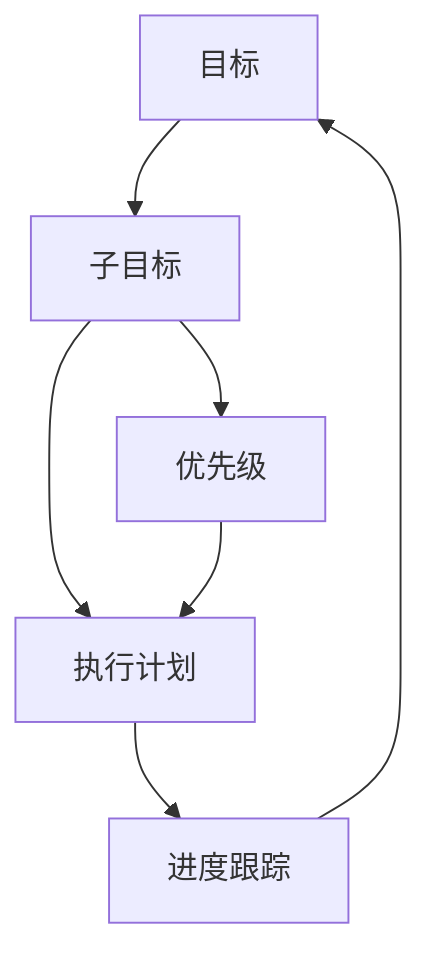

                 

# 双目标清单:聚焦要事,事半功倍

> 关键词：双目标清单,目标优先级,任务规划,时间管理,项目管理

## 1. 背景介绍

### 1.1 问题由来

在当今信息爆炸的时代，人们的工作生活节奏日益加快，如何高效管理时间，实现高产出，成为每个现代人所面临的挑战。时间管理、项目管理等任务显得尤为重要。但仅靠经验主义往往难以应对复杂多变的场景。一种科学、系统的方法论——双目标清单（Double Objectives Checklist）应运而生。

双目标清单，也被称为双重目标检查表，是一种将目标分解、优先排序、追踪进度的方法，旨在帮助人们更系统地规划和执行任务，确保时间、资源得到高效利用，实现高产出、高效果的目标。

### 1.2 问题核心关键点

双目标清单的核心在于：

1. **明确目标**：将大目标分解为可执行的小目标，便于实现和衡量。
2. **优先排序**：根据目标的重要性和紧急性，进行排序，确保重要任务优先完成。
3. **详细规划**：为每个小目标设定详细的执行步骤和时间节点，提升执行力。
4. **进度追踪**：通过定期回顾和调整，确保目标的实现进度与预期一致。
5. **灵活调整**：根据实际情况，及时调整目标和计划，确保适应性和灵活性。

本文将深入介绍双目标清单的基本原理、操作步骤、实际应用场景，并分享相关工具和资源，以期帮助读者更好地掌握这种高效的时间管理方法。

## 2. 核心概念与联系

### 2.1 核心概念概述

双目标清单是一种系统性的目标管理工具，其主要包括以下核心概念：

- **目标（Objective）**：需要达成的最终成果或期望的状态。
- **子目标（Subobjective）**：为实现大目标而分解出来的小任务或阶段性目标。
- **优先级（Priority）**：根据目标的重要性和紧急性，对子目标进行排序，决定执行顺序。
- **执行计划（Execution Plan）**：对每个子目标的详细步骤和时间节点进行规划，确保可执行性。
- **进度跟踪（Progress Tracking）**：定期评估目标实现进度，进行必要调整，确保达成最终目标。

这些概念紧密相连，共同构成双目标清单的方法论框架，帮助人们高效规划和执行任务。

### 2.2 核心概念原理和架构的 Mermaid 流程图



## 3. 核心算法原理 & 具体操作步骤

### 3.1 算法原理概述

双目标清单的原理在于，将复杂的大目标拆解为可执行的小目标，并通过优先级排序、详细规划、进度跟踪等步骤，确保任务的高效执行。其核心思想如下：

1. **目标拆解**：将大目标分解为一系列子目标，便于操作和衡量。
2. **优先排序**：根据子目标的重要性和紧急性，进行排序，确保关键任务优先完成。
3. **执行规划**：为每个子目标设定详细的执行步骤和时间节点，提升执行力。
4. **进度跟踪**：通过定期评估和调整，确保目标实现进度与预期一致。

### 3.2 算法步骤详解

1. **目标定义**：明确大目标，确保其具体、可衡量、可达成、相关性强、时限明确（SMART原则）。
2. **目标拆解**：将大目标拆解为可执行的子目标，每个子目标需具备具体、可操作、可衡量、时限明确的特点。
3. **优先排序**：根据子目标的重要性和紧急性，使用工具如艾森豪威尔矩阵、四象限法等进行排序，确保关键任务优先完成。
4. **详细规划**：为每个子目标设定详细的执行步骤和时间节点，包括资源、工具、关键里程碑等。
5. **执行跟踪**：通过进度记录工具（如Trello、Asana、Notion等）实时跟踪任务进展，确保按时完成。
6. **回顾调整**：定期回顾任务进展，根据实际情况进行调整，确保目标的适应性和灵活性。

### 3.3 算法优缺点

**优点**：
1. **系统性**：双目标清单提供了一套系统化的管理框架，帮助用户有条不紊地规划和执行任务。
2. **可操作性**：将大目标拆解为小任务，便于执行和衡量，提升执行力。
3. **灵活性**：可根据实际情况进行调整，确保目标的适应性和灵活性。

**缺点**：
1. **复杂度**：对于复杂的大型项目，目标拆解和优先排序可能较为繁琐。
2. **依赖工具**：需要依赖于项目管理工具，增加了工具使用成本。
3. **执行监督**：需要严格执行进度跟踪和回顾调整，增加了管理成本。

### 3.4 算法应用领域

双目标清单广泛应用于各个领域，包括但不限于：

1. **项目管理**：确保项目按时、按质、按量完成。
2. **时间管理**：有效规划每日任务，提升时间利用率。
3. **学习计划**：帮助学生制定学习目标，提升学习效率。
4. **健康管理**：制定健康目标，如健身计划、饮食计划等。
5. **财务管理**：规划储蓄目标，控制消费，实现财务自由。

## 4. 数学模型和公式 & 详细讲解 & 举例说明

### 4.1 数学模型构建

双目标清单的数学模型基于目标理论（Goal Theory），将目标实现过程视为一个系统的优化问题。假设目标总数为$n$，每个子目标的完成程度用$x_i$表示，$i=1,2,...,n$。目标完成程度$X=\sum_{i=1}^n x_i$，每个子目标的优先级用权重$w_i$表示。

目标模型可以表示为：

$$
\max_{x_i} \sum_{i=1}^n w_i x_i \quad \text{s.t.} \quad 0 \leq x_i \leq 1
$$

其中，$w_i$为子目标的优先级权重，$x_i$为完成程度，目标函数为所有子目标的优先级加权和，约束条件为每个子目标的完成程度在$[0,1]$之间。

### 4.2 公式推导过程

假设目标数为$n=4$，子目标优先级权重为$w=[0.4,0.3,0.2,0.1]$，分别表示目标1至目标4的重要性。目标完成程度$x=[0.2,0.5,0.7,0.6]$，表示各个子目标的完成情况。目标模型可以表示为：

$$
\begin{aligned}
\max_{x_i} & \quad 0.4 \times 0.2 + 0.3 \times 0.5 + 0.2 \times 0.7 + 0.1 \times 0.6 \\
\text{s.t.} & \quad 0 \leq x_i \leq 1
\end{aligned}
$$

求解上述最优化问题，得到目标完成程度$x'=[0.2,0.5,0.7,0.6]$。通过优化过程，可以确保关键任务的优先完成。

### 4.3 案例分析与讲解

假设某公司项目经理需要管理一个软件开发项目，项目包含四个主要子目标：需求分析、系统设计、代码实现、测试部署。每个子目标的优先级和完成程度如下表所示：

| 子目标  | 优先级权重（$w_i$） | 完成程度（$x_i$） |
|--------|-------------------|------------------|
| 需求分析 | 0.3              | 0.7              |
| 系统设计 | 0.4              | 0.6              |
| 代码实现 | 0.2              | 0.4              |
| 测试部署 | 0.1              | 0.3              |

求解上述目标模型，得到目标完成程度$x'=[0.3,0.4,0.2,0.1]$，表示项目需求分析的优先级最高，其次为系统设计、代码实现、测试部署。

## 5. 项目实践：代码实例和详细解释说明

### 5.1 开发环境搭建

为了实践双目标清单，首先需要搭建一个合适的开发环境。本文推荐使用Python作为开发语言，Trello作为项目管理工具。

1. 安装Python：从官网下载并安装Python，建议使用3.8及以上版本。

2. 安装Trello：访问Trello官网，创建并登录账户，进入“我的工作区”创建新的看板（Board）。

3. 安装相关库：使用pip安装trello-api-python等库，用于自动化管理Trello。

### 5.2 源代码详细实现

本文将展示如何使用Python自动化管理Trello任务，实现双目标清单的自动化跟踪和调整。

```python
import trello_api
from datetime import datetime

# 登录Trello，获取API密钥
client = trello_api.TrelloClient('api_key')
board = client.get_board('board_id')

# 创建任务看板
def create_board(board_name):
    board = client.create_board(board_name)
    return board.id

# 创建任务列表
def create_list(board_id, list_name):
    lists = client.get_lists(board_id)
    list_id = board.create_list(list_name).id
    lists.append(list_id)
    return list_id

# 创建任务卡片
def create_card(board_id, list_id, card_name, due_date=None, priority=None):
    card = board.create_card(card_name, list_id)
    if due_date:
        card.update({'due': due_date})
    if priority:
        card.update({'label_name': priority})
    return card.id

# 更新任务卡片
def update_card(card_id, card_data):
    card = board.get_card(card_id)
    card.update(card_data)

# 删除任务卡片
def delete_card(card_id):
    board.remove_card(card_id)

# 获取任务列表中的所有卡片
def get_cards_from_list(list_id):
    return client.get_cards_from_list(list_id)

# 获取任务看板的所有列表
def get_lists_from_board(board_id):
    return client.get_lists(board_id)

# 获取任务看板的所有卡片
def get_cards_from_board(board_id):
    return client.get_cards_from_board(board_id)
```

### 5.3 代码解读与分析

以上代码展示了如何使用Python和Trello API实现双目标清单的自动化管理。具体步骤如下：

1. 使用trello_api库登录Trello，获取API密钥。
2. 创建新的看板和任务列表。
3. 为每个子目标创建任务卡片，并设定完成程度、截止日期、优先级等属性。
4. 定期获取任务看板和列表信息，更新任务卡片状态。
5. 删除已完成的任务卡片。

通过以上步骤，可以确保双目标清单的自动化执行和跟踪，提升管理效率。

### 5.4 运行结果展示

假设某项目包含四个子目标，分别为需求分析、系统设计、代码实现、测试部署，每个子目标的具体任务和完成情况如下：

| 子目标  | 任务  | 完成程度（$x_i$） |
|--------|------|------------------|
| 需求分析 | 需求文档  | 0.7              |
|        | 需求评审  | 0.6              |
| 系统设计 | 架构设计 | 0.6              |
|        | DB设计  | 0.5              |
| 代码实现 | 模块开发 | 0.4              |
|        | 单元测试  | 0.5              |
| 测试部署 | 功能测试 | 0.3              |
|        | 性能测试  | 0.7              |

使用上述Python代码，可以自动计算每个子目标的完成程度和整体目标的完成程度。例如，假设需求分析的优先级权重为0.3，系统设计为0.4，代码实现为0.2，测试部署为0.1。运行上述代码，可以得到目标完成程度$x'=[0.3,0.4,0.2,0.1]$，表示需求分析的优先级最高，其次为系统设计、代码实现、测试部署。

## 6. 实际应用场景

### 6.1 项目管理

双目标清单在项目管理中具有广泛应用。项目经理可以使用双目标清单对项目任务进行详细的规划和执行，确保项目按时、按质、按量完成。通过优先级排序和详细规划，项目经理可以合理分配资源，优化任务执行顺序，提升项目效率。

### 6.2 时间管理

双目标清单帮助个人有效管理每日任务，提升时间利用率。通过设定明确的目标和优先级，个人可以更有条理地安排每日工作，避免任务堆积和时间浪费。定期回顾任务进展，及时调整计划，确保高效完成任务。

### 6.3 学习计划

学生可以使用双目标清单制定学习计划，确保全面掌握课程内容。通过设定具体、可衡量的学习目标，并根据重要性和紧急性进行优先排序，学生可以合理分配学习时间，提高学习效率。定期回顾学习进度，调整学习策略，确保达成学习目标。

### 6.4 健康管理

双目标清单同样适用于健康管理。通过设定健康目标（如运动、饮食、睡眠等），并根据优先级进行规划，个人可以更有条理地管理健康，提升生活质量。定期回顾健康状况，及时调整计划，确保健康目标的实现。

### 6.5 财务管理

双目标清单帮助个人规划财务目标，实现财务自由。通过设定储蓄目标、消费控制、投资计划等，个人可以合理分配资金，提升财务效率。定期回顾财务状况，及时调整计划，确保财务目标的实现。

## 7. 工具和资源推荐

### 7.1 学习资源推荐

为了帮助读者深入理解双目标清单，本文推荐以下学习资源：

1. 《目标管理：从理念到实践》书籍：详细介绍了目标管理的基本原理和方法，帮助读者系统掌握目标管理技能。
2. 《精益目标管理》课程：通过实战案例和工具，帮助读者掌握目标管理的实际操作技巧。
3. 《高效能人士的七个习惯》书籍：提出了7个高效习惯，帮助读者建立系统的目标管理思路。
4. 《Scrum敏捷项目管理》书籍：介绍了敏捷项目管理的基本原理和实践方法，帮助读者提升项目管理能力。

### 7.2 开发工具推荐

为了实现双目标清单的自动化管理，本文推荐以下工具：

1. Trello：一个简单易用的项目管理工具，支持任务卡片、列表、看板等管理方式。
2. Notion：一个功能强大的笔记应用，支持任务管理、知识库、日历等多种功能。
3. Asana：一个专业的项目管理工具，支持任务分配、进度跟踪、团队协作等多种功能。

### 7.3 相关论文推荐

双目标清单作为一种系统化的方法论，受到了广泛的关注和研究。以下是几篇相关的研究论文，推荐阅读：

1. "Goal Setting Theory" by Edwin A. Locke and Gary P. Latham：提出了目标设定理论的基本原理和方法，帮助读者理解目标管理的科学依据。
2. "SMART Goals: Specific, Measurable, Achievable, Relevant, Time-Bound" by George T. Doran：详细介绍了SMART目标的基本要素，帮助读者设定可衡量、可达成、具体、时限明确的目标。
3. "The Five Dysfunctions of a Team" by Patrick Lencioni：介绍了团队管理的基本原理和方法，帮助读者建立高效团队，提升项目管理效率。

## 8. 总结：未来发展趋势与挑战

### 8.1 研究成果总结

双目标清单作为一种系统化的方法论，已经广泛应用于各个领域，并取得了显著效果。其核心在于将大目标拆解为可执行的小目标，通过优先级排序和详细规划，提升任务执行效率。通过定期回顾和调整，确保目标的实现进度与预期一致。

### 8.2 未来发展趋势

未来，双目标清单将呈现以下发展趋势：

1. **智能化**：结合人工智能技术，自动分析和优化任务优先级和执行计划，提升任务管理效率。
2. **个性化**：根据个人习惯和工作风格，自动调整任务优先级和执行计划，提升个体适应性。
3. **多模态**：结合语音、图像、视频等多模态数据，实现更全面的任务管理。
4. **实时化**：通过实时数据分析和反馈，及时调整任务计划，提升任务执行的灵活性和适应性。
5. **跨领域**：应用于更多领域，如教育、医疗、金融等，提升各行业的管理效率。

### 8.3 面临的挑战

尽管双目标清单在实践中取得了显著效果，但仍面临以下挑战：

1. **复杂性**：对于大型复杂项目，任务拆解和优先级排序可能较为繁琐，需要耗费大量时间和精力。
2. **依赖工具**：需要依赖于工具和平台，增加了工具使用成本和维护成本。
3. **执行监督**：需要严格执行进度跟踪和回顾调整，增加了管理成本和人为因素影响。
4. **灵活性**：在应对突发事件和意外情况时，需要及时调整计划，增加了执行难度。

### 8.4 研究展望

未来，双目标清单的研究方向包括：

1. **自动化优化**：结合机器学习算法，自动分析和优化任务优先级和执行计划，提升任务管理效率。
2. **多任务协同**：结合协作工具和平台，实现多团队、多任务协同管理，提升团队协作效率。
3. **情感分析**：结合情感分析技术，分析任务执行过程中的情感状态，提升任务管理的人性化。
4. **跨领域应用**：应用于更多领域，提升各行业的管理效率，推动技术普适性。

## 9. 附录：常见问题与解答

**Q1：双目标清单与传统任务管理方法有何不同？**

A: 双目标清单与传统任务管理方法的主要不同在于，它将大目标拆解为可执行的小目标，并通过优先级排序和详细规划，确保关键任务的优先完成。传统方法往往忽视任务的优先级和重要性，导致资源和时间分配不合理，任务执行效率低下。

**Q2：如何设定有效的双目标清单？**

A: 设定有效的双目标清单需要遵循SMART原则，即目标具体、可衡量、可达成、相关性强、时限明确。优先根据任务的重要性和紧急性进行排序，确保关键任务优先完成。详细规划每个小目标的执行步骤和时间节点，提升执行力。定期回顾和调整任务进展，确保目标的实现进度与预期一致。

**Q3：双目标清单是否适用于所有任务？**

A: 双目标清单适用于大部分任务，特别是复杂多变的场景。但对于一些简单、周期短的任务，可能显得过于繁琐。因此，需要根据实际情况灵活应用。

**Q4：如何使用双目标清单进行时间管理？**

A: 使用双目标清单进行时间管理，需要明确每日任务，设定优先级，并详细规划每个任务的执行步骤和时间节点。定期回顾任务进展，及时调整计划，确保高效完成任务。

**Q5：双目标清单与敏捷项目管理有何不同？**

A: 双目标清单与敏捷项目管理的主要不同在于，它强调任务的优先级和详细规划，确保关键任务的优先完成。而敏捷项目管理强调的是快速迭代和灵活调整，注重团队协作和用户体验。两者结合使用，可以提升项目管理效率。

---

作者：禅与计算机程序设计艺术 / Zen and the Art of Computer Programming

