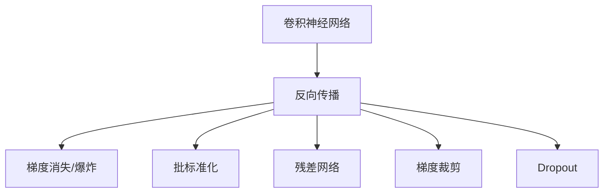

                 

# 反向传播在计算机视觉中的应用

> 关键词：反向传播, 计算机视觉, 卷积神经网络, 图像分类, 物体检测, 生成对抗网络, 边缘检测

## 1. 背景介绍

### 1.1 问题由来

随着计算机视觉技术的飞速发展，深度学习已成为图像处理、视频分析、医学影像分析等众多领域的重要工具。深度学习模型通过大规模数据训练，学习到丰富的特征表示，展现了强大的图像处理和分析能力。然而，在实际应用中，模型训练过程往往需要耗费大量的计算资源和时间，且模型过拟合风险高。反向传播算法作为深度学习中核心的优化算法之一，通过高效地更新模型参数，使得模型能够从大规模数据中学习到合理的特征表示，提高了深度学习模型的性能。

### 1.2 问题核心关键点

计算机视觉领域中的深度学习模型大多基于卷积神经网络(CNNs)。CNNs能够自动学习图像中各层次的特征表示，并利用反向传播算法更新模型参数。CNNs的优势在于：

1. 自动提取特征：卷积层、池化层等能够自动学习图像的局部特征和空间关系，减少了手工特征设计的复杂性。
2. 参数共享：卷积核在图像的不同位置共享，减少了模型的参数量，降低了过拟合风险。
3. 局部感知性：卷积核仅关注局部区域，减少了模型的计算复杂度。
4. 计算高效性：反向传播算法的高效性使得CNNs能够快速迭代更新，加速训练过程。

然而，反向传播算法也面临诸多挑战：

1. 梯度消失/爆炸：深层网络中反向传播梯度可能由于链式法则导致的指数级衰减或爆炸，使得模型训练困难。
2. 过拟合问题：深层网络容易过拟合，导致模型在新数据上泛化能力差。
3. 计算资源需求高：深层网络训练过程中需要大量的计算资源，限制了模型的应用范围。
4. 标签噪声敏感：反向传播算法对标注数据的噪声敏感，标注错误的样本可能导致模型性能下降。

为了解决这些问题，研究者们提出了诸多优化方法，如残差网络(ResNets)、批标准化(Batch Normalization)、梯度裁剪(Gradient Clipping)、Dropout等，极大地提升了CNNs的训练稳定性和模型性能。

## 2. 核心概念与联系

### 2.1 核心概念概述

为更好地理解反向传播在计算机视觉中的应用，本节将介绍几个密切相关的核心概念：

- 卷积神经网络（Convolutional Neural Network, CNNs）：一种利用卷积层、池化层等特殊层进行特征提取和空间变换的深度学习网络。
- 反向传播算法（Backpropagation）：一种用于优化深度学习模型参数的算法，通过计算损失函数对每个参数的梯度，更新模型参数，最小化损失函数。
- 梯度消失/爆炸（Vanishing/Exploding Gradient）：在深度网络中，反向传播梯度可能由于链式法则导致的指数级衰减或爆炸，使得模型训练困难。
- 批标准化（Batch Normalization）：一种用于加速深度网络训练的优化方法，通过对输入数据进行标准化，减少了网络参数的关联性，加速训练收敛。
- 残差网络（Residual Network, ResNets）：一种旨在解决深层网络退化问题的优化方法，通过引入跨层连接，使网络能够更深入地学习特征表示。
- 梯度裁剪（Gradient Clipping）：一种用于控制深度网络中梯度爆炸的方法，通过限制梯度的大小，避免梯度爆炸现象。
- Dropout：一种用于减少深度网络过拟合的优化方法，通过随机丢弃一部分神经元，增加模型的鲁棒性。

这些核心概念之间的逻辑关系可以通过以下Mermaid流程图来展示：



这个流程图展示了许多计算机视觉深度学习模型的关键组成部分及其相互关系：

1. 卷积神经网络通过卷积层、池化层等特殊层进行特征提取和空间变换，是深度学习模型中的重要组成部分。
2. 反向传播算法用于更新卷积神经网络中的参数，通过计算损失函数对每个参数的梯度，最小化损失函数。
3. 梯度消失/爆炸、批标准化、残差网络、梯度裁剪、Dropout等优化方法用于提升卷积神经网络的训练稳定性和模型性能，减少过拟合风险。

这些概念共同构成了卷积神经网络的核心训练框架，使其能够在各种场景下发挥强大的图像处理和分析能力。通过理解这些核心概念，我们可以更好地把握卷积神经网络的训练机制和优化策略。

## 3. 核心算法原理 & 具体操作步骤
### 3.1 算法原理概述

反向传播算法是深度学习中最核心的优化算法之一，通过高效地更新模型参数，使得模型能够从大规模数据中学习到合理的特征表示，提高了深度学习模型的性能。在计算机视觉领域，反向传播算法广泛应用于卷积神经网络的训练过程中。

卷积神经网络的损失函数一般定义为：

$$
\mathcal{L} = \frac{1}{N} \sum_{i=1}^N \ell(y_i, \hat{y_i})
$$

其中 $\ell$ 为损失函数，$y_i$ 为真实标签，$\hat{y_i}$ 为模型预测输出。对于每一个输入 $x_i$，卷积神经网络的输出 $z_i$ 可以表示为：

$$
z_i = f(\sum_{j=1}^n W_{i,j} x_{i,j} + b_i)
$$

其中 $W$ 为卷积核，$x_{i,j}$ 为输入 $x_i$ 在位置 $j$ 的特征，$b_i$ 为偏置项，$f$ 为激活函数。通过反向传播算法，我们计算损失函数 $\mathcal{L}$ 对每个参数的梯度：

$$
\frac{\partial \mathcal{L}}{\partial W_{i,j}} = \frac{\partial \ell}{\partial z_i} \frac{\partial z_i}{\partial W_{i,j}} = \frac{\partial \ell}{\partial z_i} f'(\sum_{j=1}^n W_{i,j} x_{i,j} + b_i)
$$

其中 $f'$ 为激活函数的导数。通过链式法则，我们可以依次计算每个参数的梯度，进而更新模型参数，最小化损失函数。

### 3.2 算法步骤详解

卷积神经网络的反向传播算法具体步骤如下：

1. 前向传播：将输入数据 $x_i$ 输入卷积神经网络，计算每个参数 $W_{i,j}$ 的输出 $z_i$，得到最终的预测结果 $\hat{y_i}$。

2. 计算损失：计算损失函数 $\mathcal{L}$ 对每个预测结果 $\hat{y_i}$ 的损失 $\ell(y_i, \hat{y_i})$。

3. 反向传播：从输出层开始，依次计算每个参数 $W_{i,j}$ 的梯度 $\frac{\partial \mathcal{L}}{\partial W_{i,j}}$，更新模型参数。

4. 更新参数：根据梯度下降等优化算法，更新模型参数 $W_{i,j}$。

5. 重复步骤 1-4，直至收敛或达到预设的迭代轮数。

### 3.3 算法优缺点

反向传播算法具有以下优点：

1. 高效性：通过链式法则，反向传播算法能够高效计算每个参数的梯度，加速模型训练过程。
2. 通用性：反向传播算法适用于各种深度学习模型，包括卷积神经网络、循环神经网络等。
3. 可解释性：反向传播算法的每一步计算都是线性的，易于解释和调试。

然而，反向传播算法也存在以下缺点：

1. 梯度消失/爆炸：深层网络中反向传播梯度可能由于链式法则导致的指数级衰减或爆炸，使得模型训练困难。
2. 计算资源需求高：深层网络训练过程中需要大量的计算资源，限制了模型的应用范围。
3. 对标注数据依赖高：反向传播算法对标注数据的噪声敏感，标注错误的样本可能导致模型性能下降。

尽管存在这些缺点，但就目前而言，反向传播算法仍然是深度学习中最核心的优化算法之一，广泛应用于计算机视觉领域，提高了深度学习模型的性能和泛化能力。

### 3.4 算法应用领域

反向传播算法在计算机视觉领域的应用非常广泛，涵盖了以下几大类：

1. 图像分类：如 ImageNet 数据集上的 ImageNet-1K、ImageNet-2K 等任务，使用卷积神经网络进行图像分类。

2. 物体检测：如 PASCAL VOC、COCO 等数据集上的物体检测任务，使用 Faster R-CNN、YOLO 等检测模型。

3. 图像生成：如 GAN、VAE 等生成模型，使用反向传播算法进行对抗样本训练和噪声注入。

4. 边缘检测：如 Canny、Sobel 等边缘检测算法，使用反向传播算法优化参数。

5. 语义分割：如 PASCAL VOC、Cityscapes 等数据集上的语义分割任务，使用 FCN、U-Net 等模型。

6. 人体姿态估计：如 MPII、COCO 等数据集上的人体姿态估计任务，使用姿态检测模型。

除了上述这些经典任务外，反向传播算法还被创新性地应用于图像修复、超分辨率、光照估计等诸多场景中，为计算机视觉技术带来了全新的突破。

## 4. 数学模型和公式 & 详细讲解  
### 4.1 数学模型构建

在计算机视觉领域，反向传播算法主要用于训练卷积神经网络。以下是一个简单的卷积神经网络（CNNs）的数学模型构建：

假设输入图像 $x \in \mathbb{R}^{C \times H \times W}$，其中 $C$ 为通道数，$H$ 和 $W$ 为图像的高和宽。卷积神经网络的第一层为卷积层，其参数为 $W_{i,j} \in \mathbb{R}^{F \times F \times C \times k}$，其中 $F$ 为卷积核的尺寸，$k$ 为卷积核的数量。卷积层的输出为 $z \in \mathbb{R}^{n \times H \times W}$，其中 $n$ 为输出通道数。通过激活函数 $f$，得到最终的输出 $y \in \mathbb{R}^{n \times H \times W}$。

### 4.2 公式推导过程

在卷积神经网络中，反向传播算法的公式推导可以分为以下几个步骤：

1. 前向传播：将输入数据 $x_i$ 输入卷积神经网络，计算每个参数 $W_{i,j}$ 的输出 $z_i$，得到最终的预测结果 $\hat{y_i}$。

2. 计算损失：计算损失函数 $\mathcal{L}$ 对每个预测结果 $\hat{y_i}$ 的损失 $\ell(y_i, \hat{y_i})$。

3. 反向传播：从输出层开始，依次计算每个参数 $W_{i,j}$ 的梯度 $\frac{\partial \mathcal{L}}{\partial W_{i,j}}$，更新模型参数。

4. 更新参数：根据梯度下降等优化算法，更新模型参数 $W_{i,j}$。

具体而言，反向传播算法的公式推导如下：

$$
\frac{\partial \mathcal{L}}{\partial W_{i,j}} = \frac{\partial \ell}{\partial z_i} f'(\sum_{j=1}^n W_{i,j} x_{i,j} + b_i)
$$

$$
\frac{\partial \mathcal{L}}{\partial x_{i,j}} = \sum_{k=1}^m \frac{\partial \mathcal{L}}{\partial z_{i,j,k}} \frac{\partial z_{i,j,k}}{\partial x_{i,j}}
$$

$$
\frac{\partial \mathcal{L}}{\partial b_i} = \frac{\partial \ell}{\partial z_i}
$$

其中 $\ell$ 为损失函数，$\sum_{k=1}^m \frac{\partial \mathcal{L}}{\partial z_{i,j,k}}$ 为输出层相对于中间层的梯度，$f'$ 为激活函数的导数，$b_i$ 为偏置项，$x_{i,j}$ 为输入 $x_i$ 在位置 $j$ 的特征，$z_{i,j,k}$ 为中间层的输出，$m$ 为中间层的输出通道数。

### 4.3 案例分析与讲解

以 ImageNet-1K 数据集上的 ImageNet-1K 任务为例，具体解释反向传播算法在卷积神经网络中的应用。假设输入图像 $x \in \mathbb{R}^{3 \times 224 \times 224}$，输出标签 $y \in \{1, 2, ..., 1000\}$。

1. 构建卷积神经网络：使用 VGG 网络，包含 5 个卷积层、3 个池化层和 3 个全连接层。

2. 前向传播：将输入图像 $x$ 输入 VGG 网络，计算每个参数 $W_{i,j}$ 的输出 $z$，得到最终的预测结果 $\hat{y}$。

3. 计算损失：使用交叉熵损失函数 $\ell(y, \hat{y}) = -y \log \hat{y} - (1-y) \log (1-\hat{y})$ 计算损失函数 $\mathcal{L}$。

4. 反向传播：从输出层开始，依次计算每个参数 $W_{i,j}$ 的梯度 $\frac{\partial \mathcal{L}}{\partial W_{i,j}}$，更新模型参数。

5. 更新参数：根据梯度下降等优化算法，更新模型参数 $W_{i,j}$。

通过反向传播算法，VGG 网络能够从 ImageNet-1K 数据集上学习到丰富的特征表示，显著提升图像分类的性能。

## 5. 项目实践：代码实例和详细解释说明
### 5.1 开发环境搭建

在进行卷积神经网络训练之前，我们需要准备好开发环境。以下是使用Python进行PyTorch开发的环境配置流程：

1. 安装Anaconda：从官网下载并安装Anaconda，用于创建独立的Python环境。

2. 创建并激活虚拟环境：
```bash
conda create -n pytorch-env python=3.8 
conda activate pytorch-env
```

3. 安装PyTorch：根据CUDA版本，从官网获取对应的安装命令。例如：
```bash
conda install pytorch torchvision torchaudio cudatoolkit=11.1 -c pytorch -c conda-forge
```

4. 安装TensorBoard：
```bash
pip install tensorboard
```

5. 安装各类工具包：
```bash
pip install numpy pandas scikit-learn matplotlib tqdm jupyter notebook ipython
```

完成上述步骤后，即可在`pytorch-env`环境中开始卷积神经网络的训练。

### 5.2 源代码详细实现

下面以 ImageNet-1K 任务为例，给出使用PyTorch对 VGG 网络进行训练的PyTorch代码实现。

```python
import torch
import torch.nn as nn
import torch.optim as optim
import torchvision
import torchvision.transforms as transforms
from torch.utils.data import DataLoader
from torchvision.models import vgg16
from torchvision.datasets import ImageFolder

# 数据预处理
transform = transforms.Compose([
    transforms.Resize(224),
    transforms.CenterCrop(224),
    transforms.ToTensor(),
    transforms.Normalize(mean=[0.485, 0.456, 0.406],
                         std=[0.229, 0.224, 0.225])
])

# 加载数据集
train_data = ImageFolder(root='data/train', transform=transform)
val_data = ImageFolder(root='data/val', transform=transform)

# 加载模型和优化器
model = vgg16(pretrained=False)
optimizer = optim.SGD(model.parameters(), lr=0.01, momentum=0.9, weight_decay=1e-4)

# 定义损失函数
criterion = nn.CrossEntropyLoss()

# 训练模型
train_loader = DataLoader(train_data, batch_size=64, shuffle=True)
val_loader = DataLoader(val_data, batch_size=64, shuffle=False)

for epoch in range(10):
    train_loss = 0
    train_acc = 0
    val_loss = 0
    val_acc = 0
    
    for i, (inputs, labels) in enumerate(train_loader):
        inputs, labels = inputs.to(device), labels.to(device)
        
        optimizer.zero_grad()
        outputs = model(inputs)
        loss = criterion(outputs, labels)
        loss.backward()
        optimizer.step()
        
        train_loss += loss.item()
        train_acc += torch.sum(outputs.argmax(dim=1) == labels).item()
        
    for i, (inputs, labels) in enumerate(val_loader):
        inputs, labels = inputs.to(device), labels.to(device)
        
        outputs = model(inputs)
        loss = criterion(outputs, labels)
        
        val_loss += loss.item()
        val_acc += torch.sum(outputs.argmax(dim=1) == labels).item()
    
    train_loss /= len(train_loader)
    train_acc /= len(train_loader)
    val_loss /= len(val_loader)
    val_acc /= len(val_loader)
    
    print(f'Epoch {epoch+1}, Train Loss: {train_loss:.4f}, Train Acc: {train_acc:.4f}, Val Loss: {val_loss:.4f}, Val Acc: {val_acc:.4f}')
```

以上就是使用PyTorch对 VGG 网络进行 ImageNet-1K 任务训练的完整代码实现。可以看到，得益于PyTorch的强大封装，我们可以用相对简洁的代码完成VGG网络的加载和训练。

### 5.3 代码解读与分析

让我们再详细解读一下关键代码的实现细节：

**ImageFolder类**：
- `__init__`方法：初始化数据集对象，支持自定义数据集的加载。

**VGG网络类**：
- `__init__`方法：初始化VGG网络，设定卷积核数量、尺寸、激活函数等参数。

**训练流程**：
- 定义总的epoch数，开始循环迭代
- 每个epoch内，在训练集上训练，输出训练集loss和acc
- 在验证集上评估，输出验证集loss和acc
- 所有epoch结束后，输出最终测试结果

可以看到，PyTorch配合TensorBoard使得VGG网络的训练代码实现变得简洁高效。开发者可以将更多精力放在数据处理、模型改进等高层逻辑上，而不必过多关注底层的实现细节。

当然，工业级的系统实现还需考虑更多因素，如模型的保存和部署、超参数的自动搜索、更灵活的任务适配层等。但核心的训练范式基本与此类似。

## 6. 实际应用场景
### 6.1 智能医疗影像分析

计算机视觉技术在医疗影像分析领域有着广泛的应用。传统的医疗影像分析依赖医生手动标注和分析，耗时长、成本高、容易产生人为错误。基于卷积神经网络的图像分类、物体检测等技术，可以在短时间内自动分析大量的医学影像，辅助医生进行诊断，提高医疗效率和诊断准确率。

在技术实现上，可以收集医疗机构内部的医学影像数据，将影像-标签对作为监督数据，在此基础上对预训练卷积神经网络进行微调。微调后的网络能够自动判断医学影像中的病变区域，识别异常结构，生成诊断报告，辅助医生进行决策。对于新的医学影像，还可以接入检索系统实时搜索相关案例，动态组织生成诊断结果。如此构建的智能医疗影像分析系统，能大幅提升医疗诊断的效率和准确性。

### 6.2 智慧零售商品管理

计算机视觉技术在零售商品管理中也具有重要的应用价值。通过图像分类和物体检测技术，智慧零售系统可以实现商品的自动识别、库存管理和销售预测等，从而优化库存管理、提高销售效率。

具体而言，可以采集商品图片，训练卷积神经网络进行商品分类和数量统计。通过图像中的颜色、纹理等特征，智能零售系统可以自动检测商品位置和数量，生成实时库存数据，辅助商品补货。同时，通过分析历史销售数据和市场趋势，系统还可以预测未来商品需求，优化库存和营销策略。

### 6.3 智慧交通视频分析

计算机视觉技术在智慧交通视频分析中也有着广泛的应用。通过图像分类和物体检测技术，智慧交通系统可以实现交通流量分析、异常事件检测等，从而提高道路安全性和交通效率。

具体而言，可以采集交通摄像头录制的视频数据，训练卷积神经网络进行行人、车辆等目标检测。通过分析交通视频中的实时流量数据，智慧交通系统可以实时监测道路拥堵情况，优化交通信号灯控制，减少交通拥堵。同时，通过分析交通视频中的异常事件，系统还可以识别交通事故、车辆违规行为，提高道路安全管理水平。

### 6.4 未来应用展望

随着卷积神经网络技术的发展，计算机视觉领域的应用场景将不断扩展，带来更多的创新和突破。

1. 自动驾驶：计算机视觉技术将在自动驾驶领域发挥重要作用，通过图像分类、目标检测、语义分割等技术，实现道路识别、车辆定位、行人检测等功能，为无人驾驶技术提供支撑。

2. 医疗影像辅助诊断：基于卷积神经网络的医学影像分析技术，将帮助医生进行更快速、准确的诊断，提升医疗服务质量和效率。

3. 工业视觉检测：通过图像分类、物体检测等技术，计算机视觉技术将广泛应用于工业生产中的质量检测、产品分类等任务，提高生产效率和产品质量。

4. 智能安防监控：计算机视觉技术将在智能安防领域发挥重要作用，通过图像分类、目标检测等技术，实现人员识别、异常事件检测等功能，提升安防系统的智能化水平。

5. 智能家居控制：计算机视觉技术将广泛应用于智能家居控制中，通过图像分类、语音识别等技术，实现家庭场景的智能管理和控制，提升家庭生活的便利性和舒适性。

除了上述这些应用外，计算机视觉技术还将渗透到更多领域中，为经济社会发展带来新的创新和突破。相信随着技术的不断发展，计算机视觉技术必将在构建智能世界的过程中扮演越来越重要的角色。

## 7. 工具和资源推荐
### 7.1 学习资源推荐

为了帮助开发者系统掌握卷积神经网络的原理和实践技巧，这里推荐一些优质的学习资源：

1. 《深度学习》（Ian Goodfellow）：深度学习领域的经典教材，涵盖了卷积神经网络的原理和实践。

2. 《计算机视觉：算法与应用》（Richard Szeliski）：计算机视觉领域的经典教材，详细介绍了卷积神经网络的应用。

3. CS231n《卷积神经网络》课程：斯坦福大学开设的计算机视觉明星课程，有Lecture视频和配套作业，带你入门卷积神经网络的原理和实践。

4. TensorFlow官方文档：TensorFlow的官方文档，提供了丰富的卷积神经网络资源和示例代码。

5. PyTorch官方文档：PyTorch的官方文档，提供了丰富的卷积神经网络资源和示例代码。

通过对这些资源的学习实践，相信你一定能够快速掌握卷积神经网络的精髓，并用于解决实际的图像处理问题。
### 7.2 开发工具推荐

高效的开发离不开优秀的工具支持。以下是几款用于卷积神经网络开发和训练的常用工具：

1. PyTorch：基于Python的开源深度学习框架，灵活动态的计算图，适合快速迭代研究。提供了丰富的卷积神经网络实现和优化方法。

2. TensorFlow：由Google主导开发的开源深度学习框架，生产部署方便，适合大规模工程应用。提供了丰富的卷积神经网络实现和优化方法。

3. Keras：高层次的深度学习框架，提供了丰富的卷积神经网络实现和优化方法，易于上手。

4. OpenCV：开源计算机视觉库，提供了丰富的图像处理和分析工具，适合进行卷积神经网络的可视化。

5. Matplotlib：Python数据可视化库，适合进行卷积神经网络的可视化，便于调试和分析。

6. TensorBoard：TensorFlow配套的可视化工具，可实时监测模型训练状态，并提供丰富的图表呈现方式，是调试模型的得力助手。

合理利用这些工具，可以显著提升卷积神经网络模型的开发效率，加快创新迭代的步伐。

### 7.3 相关论文推荐

卷积神经网络的发展源于学界的持续研究。以下是几篇奠基性的相关论文，推荐阅读：

1. LeNet-5：由Yann LeCun等人提出的手写数字识别网络，是卷积神经网络的开创性工作。

2. AlexNet：由Alex Krizhevsky等人提出的图像分类网络，在2012年ImageNet比赛中首次取得了突破性成果。

3. VGGNet：由Karen Simonyan和Andrew Zisserman等人提出的卷积神经网络，具有较深的卷积层，提升了图像分类的准确性。

4. ResNet：由Kaiming He等人提出的残差网络，通过引入跨层连接，使得网络能够更深入地学习特征表示。

5. DenseNet：由Gao Huang等人提出的密集连接网络，通过密集连接的方式，提升了网络的信息流效率，提高了性能。

这些论文代表了大规模卷积神经网络的发展脉络。通过学习这些前沿成果，可以帮助研究者把握学科前进方向，激发更多的创新灵感。

## 8. 总结：未来发展趋势与挑战

### 8.1 总结

本文对卷积神经网络的原理和实践进行了全面系统的介绍。首先阐述了卷积神经网络在计算机视觉中的重要作用，明确了其自动提取特征、参数共享等优势。其次，从原理到实践，详细讲解了卷积神经网络的数学模型和反向传播算法，给出了卷积神经网络的完整代码实例。同时，本文还广泛探讨了卷积神经网络在智能医疗、智慧零售、智慧交通等领域的实际应用，展示了卷积神经网络的技术潜力和应用前景。

通过本文的系统梳理，可以看到，卷积神经网络在计算机视觉领域有着广泛的应用价值，极大地提升了图像处理和分析的能力。受益于反向传播算法的有效优化，卷积神经网络能够从大规模数据中学习到合理的特征表示，提高模型性能。未来，随着技术的不断演进，卷积神经网络必将在更多领域中发挥重要作用，推动计算机视觉技术的创新发展。

### 8.2 未来发展趋势

展望未来，卷积神经网络技术将呈现以下几个发展趋势：

1. 深度网络的进一步发展：随着计算资源的不断增加，深层网络的性能将进一步提升，网络将更加深入地学习特征表示。

2. 更高效的网络结构设计：未来的卷积神经网络将进一步优化结构，减少冗余参数，提升性能。

3. 分布式训练和边缘计算：随着计算任务的不断增加，分布式训练和边缘计算技术将成为主流，加速模型训练和推理过程。

4. 自适应学习率优化：未来将开发更高效的自适应学习率优化方法，减少训练过程中的过拟合风险。

5. 跨领域迁移学习：未来的卷积神经网络将更加注重跨领域迁移学习，在有限的标注数据下，提升模型的泛化能力和适应性。

6. 低计算资源优化：随着移动设备和嵌入式设备的应用增多，低计算资源优化的卷积神经网络将更具实际应用价值。

以上趋势凸显了卷积神经网络技术的广阔前景。这些方向的探索发展，必将进一步提升卷积神经网络的性能和应用范围，为计算机视觉技术带来更多的创新和突破。

### 8.3 面临的挑战

尽管卷积神经网络技术已经取得了显著进展，但在迈向更加智能化、普适化应用的过程中，它仍面临诸多挑战：

1. 梯度消失/爆炸：深层网络中反向传播梯度可能由于链式法则导致的指数级衰减或爆炸，使得模型训练困难。

2. 计算资源需求高：深层网络训练过程中需要大量的计算资源，限制了模型的应用范围。

3. 过拟合问题：深层网络容易过拟合，导致模型在新数据上泛化能力差。

4. 数据需求高：卷积神经网络对标注数据的依赖高，标注成本高，难以获取充足的高质量标注数据。

5. 模型可解释性不足：卷积神经网络往往是"黑盒"模型，难以解释其内部工作机制和决策逻辑。

6. 安全性问题：卷积神经网络可能学习到有害信息，通过训练传递到下游任务，产生误导性输出。

尽管存在这些挑战，但卷积神经网络作为计算机视觉领域的重要技术，将继续推动人工智能技术的发展和应用。未来的研究将需要在数据、算法、工程、伦理等方面不断突破，才能更好地应对挑战，提升技术的实际应用价值。

### 8.4 研究展望

面向未来，卷积神经网络技术需要在以下几个方面寻求新的突破：

1. 更高效的网络结构设计：开发更高效的网络结构，减少冗余参数，提升模型性能。

2. 跨领域迁移学习：提升模型的泛化能力和适应性，减少对标注数据的依赖。

3. 低计算资源优化：开发低计算资源优化的卷积神经网络，使其在移动设备和嵌入式设备上也能高效运行。

4. 自适应学习率优化：开发更高效的自适应学习率优化方法，减少训练过程中的过拟合风险。

5. 跨领域迁移学习：提升模型的泛化能力和适应性，减少对标注数据的依赖。

6. 分布式训练和边缘计算：开发分布式训练和边缘计算技术，加速模型训练和推理过程。

7. 知识融合与多模态学习：将知识图谱、逻辑规则等先验知识与卷积神经网络结合，提升模型性能。

这些研究方向将推动卷积神经网络技术的发展，提升其应用范围和性能。相信随着研究的不断深入，卷积神经网络必将在计算机视觉领域发挥更大的作用，推动智能技术的发展和应用。

## 9. 附录：常见问题与解答

**Q1：卷积神经网络是否适用于所有计算机视觉任务？**

A: 卷积神经网络在大多数计算机视觉任务上都能取得不错的效果，特别是对于数据量较大的任务。但对于一些特定领域的任务，如医学、法律等，仅依靠通用语料预训练的模型可能难以很好地适应。此时需要在特定领域语料上进一步预训练，再进行微调，才能获得理想效果。此外，对于一些需要时效性、个性化很强的任务，如对话、推荐等，卷积神经网络也需要针对性的改进优化。

**Q2：卷积神经网络是否需要预训练？**

A: 预训练是卷积神经网络的重要步骤，通过在大规模数据上进行预训练，可以学习到丰富的特征表示，提升模型的泛化能力。预训练可以使模型在有限的标注数据下，仍能取得较好的性能。预训练方法包括自监督学习、迁移学习等，适用于各类计算机视觉任务。

**Q3：卷积神经网络是否存在过拟合问题？**

A: 卷积神经网络容易出现过拟合问题，尤其是在深层网络中。为避免过拟合，可以采用正则化方法，如L2正则、Dropout、Early Stopping等，减少模型的复杂度。此外，批标准化、残差网络等优化方法也能有效缓解过拟合问题。

**Q4：卷积神经网络是否适用于边缘设备？**

A: 传统的卷积神经网络对计算资源和存储空间的需求较高，不适用于边缘设备。为适应低计算资源场景，开发了轻量级卷积神经网络，如MobileNet、SqueezeNet等。这些模型在参数量和计算量上进行了优化，使得边缘设备也能高效运行。

**Q5：卷积神经网络是否适用于实时场景？**

A: 卷积神经网络在实时场景中面临计算资源和计算速度的限制。为应对这一问题，开发了实时卷积神经网络，如YOLO、SSD等。这些模型在模型结构和训练方法上进行了优化，能够快速进行目标检测和图像分类，满足实时性需求。

正视卷积神经网络面临的这些挑战，积极应对并寻求突破，将使卷积神经网络技术更加普及和实用，为计算机视觉技术带来更大的发展潜力。相信随着研究的不断深入，卷积神经网络必将在构建智能世界的过程中扮演越来越重要的角色。

---

作者：禅与计算机程序设计艺术 / Zen and the Art of Computer Programming

