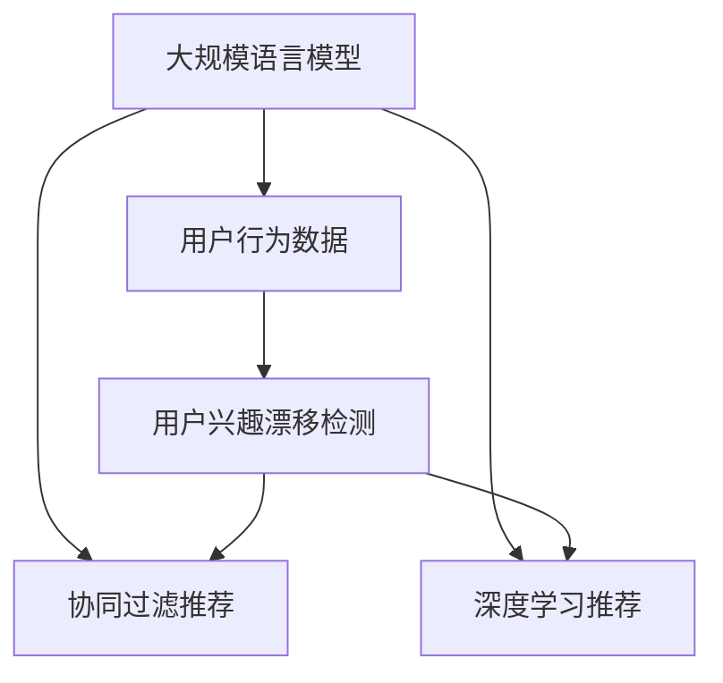

                 

# 基于LLM的推荐系统用户兴趣漂移检测

## 1. 背景介绍

在人工智能和大数据时代，推荐系统成为了优化用户体验和提升业务价值的重要工具。随着用户行为数据的积累和算法模型的进化，推荐系统逐渐从简单的基于内容的推荐转向更加复杂和智能的协同过滤和深度学习推荐。

与此同时，用户兴趣的动态变化成为推荐系统面临的重要挑战。用户兴趣的漂移不仅会导致推荐效果下降，还可能引发用户流失，影响业务增长。因此，检测和预测用户兴趣的动态变化，成为推荐系统优化的关键任务。

本文将介绍一种基于大规模语言模型（Large Language Model, LLM）的推荐系统用户兴趣漂移检测方法。该方法利用预训练的语言模型，通过分析用户的文本互动行为，识别出用户的兴趣变化趋势，从而指导推荐策略的调整。

## 2. 核心概念与联系

### 2.1 核心概念概述

为更好地理解基于LLM的推荐系统用户兴趣漂移检测方法，本节将介绍几个密切相关的核心概念：

- 大规模语言模型(LLM)：以自回归(如GPT)或自编码(如BERT)模型为代表的大规模预训练语言模型。通过在大规模无标签文本语料上进行预训练，学习通用的语言表示，具备强大的语言理解和生成能力。

- 用户行为数据(User Behavior Data)：用户在推荐系统中的行为数据，包括浏览、点击、评分、反馈等。这些数据是推荐系统优化的重要依据，也是用户兴趣漂移检测的基础。

- 协同过滤推荐(Collaborative Filtering)：一种基于用户和物品间交互数据的推荐方法。通过挖掘用户间的相似性或物品间的相关性，预测用户对新物品的兴趣。

- 深度学习推荐(Deep Learning)：利用深度神经网络模型，对用户行为数据进行特征表示学习，生成推荐结果。其中，自编码器和Transformer等结构成为深度学习推荐的主流架构。

- 用户兴趣漂移(User Interest Drift)：指用户兴趣的动态变化，可能由于时间、环境、情感等因素引起。检测用户兴趣的漂移趋势，有助于推荐系统调整推荐策略，提高用户满意度。

这些核心概念之间的逻辑关系可以通过以下Mermaid流程图来展示：



这个流程图展示了大规模语言模型与推荐系统的核心概念及其之间的关系：

1. 大规模语言模型通过预训练获得基础能力。
2. 用户行为数据提供了用户与推荐系统交互的记录。
3. 协同过滤和深度学习推荐方法，利用用户行为数据生成推荐。
4. 用户兴趣漂移检测方法，通过分析用户文本行为，预测用户兴趣变化。
5. 用户兴趣漂移检测结果，用于指导协同过滤和深度学习推荐，提高推荐效果。

这些概念共同构成了推荐系统的知识图谱，为基于LLM的用户兴趣漂移检测提供了理论基础。

## 3. 核心算法原理 & 具体操作步骤
### 3.1 算法原理概述

基于LLM的推荐系统用户兴趣漂移检测，本质上是一个序列标注任务。其核心思想是：利用预训练的LLM模型，对用户行为数据进行分析，识别出用户兴趣的动态变化，通过标注的方式对用户兴趣进行漂移程度评分。

假设用户序列为 $U=\{u_1,u_2,\cdots,u_n\}$，其中 $u_t$ 表示用户行为序列中的第 $t$ 个行为。令 $s_t$ 为 $u_t$ 的兴趣标签，取值为 $1$ 或 $0$，分别表示兴趣增强或兴趣减弱。用户兴趣漂移检测的目标是最小化损失函数，即找到最优标签序列 $\{s_t\}_{t=1}^n$，使得兴趣漂移损失最小。

采用交叉熵损失函数 $\mathcal{L}(s_t, \hat{s}_t)$，可以定义兴趣漂移检测的目标函数：

$$
\mathcal{L}_{\text{drift}} = \sum_{t=1}^n \mathcal{L}(s_t, \hat{s}_t)
$$

其中，$\hat{s}_t$ 为模型预测的兴趣标签。

### 3.2 算法步骤详解

基于LLM的推荐系统用户兴趣漂移检测一般包括以下几个关键步骤：

**Step 1: 准备预训练模型和数据集**
- 选择合适的预训练语言模型 $M_{\theta}$ 作为初始化参数，如 BERT、GPT 等。
- 收集用户行为数据集 $D=\{(u_t, s_t)\}_{t=1}^N$，其中 $u_t$ 为用户的第 $t$ 个行为，$s_t$ 为对应的兴趣标签。

**Step 2: 定义兴趣漂移模型**
- 设计兴趣漂移模型 $M_{\phi}$，接收用户行为序列 $U$ 作为输入，输出兴趣标签序列 $\{s_t\}_{t=1}^n$。
- 利用交叉熵损失函数 $\mathcal{L}(s_t, \hat{s}_t)$ 作为训练目标。

**Step 3: 设置微调超参数**
- 选择合适的优化算法及其参数，如 AdamW、SGD 等，设置学习率、批大小、迭代轮数等。
- 设置正则化技术及强度，包括权重衰减、Dropout、Early Stopping等。
- 确定冻结预训练参数的策略，如仅微调顶层，或全部参数都参与微调。

**Step 4: 执行梯度训练**
- 将用户行为序列 $U$ 分批次输入模型，前向传播计算损失函数。
- 反向传播计算参数梯度，根据设定的优化算法和学习率更新模型参数。
- 周期性在验证集上评估模型性能，根据性能指标决定是否触发 Early Stopping。
- 重复上述步骤直到满足预设的迭代轮数或 Early Stopping 条件。

**Step 5: 测试和部署**
- 在测试集上评估兴趣漂移检测模型 $M_{\phi}$ 的性能，对比微调前后的精度提升。
- 使用兴趣漂移检测模型对新用户行为序列进行兴趣漂移评分，指导推荐策略的调整。
- 持续收集新的用户行为数据，定期重新微调模型，以适应数据分布的变化。

以上是基于LLM的推荐系统用户兴趣漂移检测的一般流程。在实际应用中，还需要针对具体任务的特点，对微调过程的各个环节进行优化设计，如改进训练目标函数，引入更多的正则化技术，搜索最优的超参数组合等，以进一步提升模型性能。

### 3.3 算法优缺点

基于LLM的推荐系统用户兴趣漂移检测方法具有以下优点：
1. 简单高效。只需准备少量标注数据，即可对预训练模型进行快速适配，获得较大的性能提升。
2. 通用适用。适用于各种推荐系统的用户行为数据，可以应用于广告推荐、个性化电商等多个场景。
3. 鲁棒性强。LLM模型具有强大的语言表示能力，能够处理多样化的用户文本数据，适应不同的用户兴趣变化模式。
4. 可解释性好。通过分析用户文本互动行为，可提供透明的兴趣漂移原因和建议，便于业务理解和优化。

同时，该方法也存在一定的局限性：
1. 依赖标注数据。兴趣漂移检测的效果很大程度上取决于标注数据的质量和数量，获取高质量标注数据的成本较高。
2. 模型复杂度。由于LLM模型的参数量较大，微调需要较高的计算资源和内存空间。
3. 动态性不足。模型需要定期重新训练以适应新数据分布，无法实时响应用户兴趣的变化。

尽管存在这些局限性，但就目前而言，基于LLM的用户兴趣漂移检测方法仍是最主流范式。未来相关研究的重点在于如何进一步降低标注数据的依赖，提高模型的动态性和可解释性，同时兼顾可扩展性和资源消耗。

### 3.4 算法应用领域

基于LLM的用户兴趣漂移检测方法，已经在推荐系统优化、广告投放优化等多个领域得到了广泛的应用，具体包括：

- 推荐系统优化：对用户的当前行为进行兴趣漂移检测，调整推荐策略，避免推荐过期或不相关物品，提高用户满意度。
- 广告投放优化：检测用户对广告的兴趣变化，优化广告推荐策略，提高广告点击率和转化率。
- 个性化电商：分析用户的购物行为，识别兴趣漂移，指导个性化推荐和促销活动，提升电商转化率。
- 金融服务：监测用户的金融行为，预测用户对金融产品的兴趣变化，提供定制化的理财和投资建议。

除了上述这些经典应用外，LLM用户兴趣漂移检测方法还在社交媒体推荐、新闻内容推荐、视频推荐等多个领域中取得了良好的效果，为推荐系统提供了新的优化方向。

## 4. 数学模型和公式 & 详细讲解  
### 4.1 数学模型构建

本节将使用数学语言对基于LLM的推荐系统用户兴趣漂移检测过程进行更加严格的刻画。

记用户序列为 $U=\{u_1,u_2,\cdots,u_n\}$，其中 $u_t$ 表示用户行为序列中的第 $t$ 个行为，$s_t$ 为对应的兴趣标签，取值为 $1$ 或 $0$，分别表示兴趣增强或兴趣减弱。

定义兴趣漂移模型 $M_{\phi}$ 对用户序列 $U$ 进行兴趣漂移检测，输出兴趣标签序列 $\{s_t\}_{t=1}^n$。

假设模型的输入为 $U$ 的文本表示 $\mathbf{X}$，输出为兴趣标签序列 $\mathbf{S}$，则兴趣漂移检测的目标函数为：

$$
\mathcal{L}_{\text{drift}} = \sum_{t=1}^n \mathcal{L}(s_t, \hat{s}_t)
$$

其中，$\mathcal{L}(s_t, \hat{s}_t)$ 为交叉熵损失函数，$\hat{s}_t$ 为模型预测的兴趣标签。

### 4.2 公式推导过程

以下我们以二分类任务为例，推导交叉熵损失函数及其梯度的计算公式。

假设模型 $M_{\phi}$ 在输入 $U$ 上的输出为 $\hat{S}=\{\hat{s}_t\}_{t=1}^n$，表示模型预测的用户兴趣标签序列。令 $S=\{s_t\}_{t=1}^n$ 为实际兴趣标签序列。则二分类交叉熵损失函数定义为：

$$
\ell(M_{\phi}(U),S) = -\sum_{t=1}^n [s_t\log \hat{s}_t + (1-s_t)\log (1-\hat{s}_t)]
$$

将其代入兴趣漂移检测的目标函数，得：

$$
\mathcal{L}_{\text{drift}} = -\sum_{t=1}^n [s_t\log \hat{s}_t + (1-s_t)\log (1-\hat{s}_t)]
$$

根据链式法则，损失函数对模型参数 $\phi$ 的梯度为：

$$
\frac{\partial \mathcal{L}_{\text{drift}}}{\partial \phi} = -\sum_{t=1}^n (\frac{s_t}{\hat{s}_t}-\frac{1-s_t}{1-\hat{s}_t}) \frac{\partial \hat{s}_t}{\partial \phi}
$$

其中 $\frac{\partial \hat{s}_t}{\partial \phi}$ 可进一步递归展开，利用自动微分技术完成计算。

在得到损失函数的梯度后，即可带入优化算法，完成模型的迭代优化。重复上述过程直至收敛，最终得到适应用户兴趣漂移检测的任务模型。

## 5. 项目实践：代码实例和详细解释说明
### 5.1 开发环境搭建

在进行微调实践前，我们需要准备好开发环境。以下是使用Python进行PyTorch开发的环境配置流程：

1. 安装Anaconda：从官网下载并安装Anaconda，用于创建独立的Python环境。

2. 创建并激活虚拟环境：
```bash
conda create -n pytorch-env python=3.8 
conda activate pytorch-env
```

3. 安装PyTorch：根据CUDA版本，从官网获取对应的安装命令。例如：
```bash
conda install pytorch torchvision torchaudio cudatoolkit=11.1 -c pytorch -c conda-forge
```

4. 安装Transformers库：
```bash
pip install transformers
```

5. 安装各类工具包：
```bash
pip install numpy pandas scikit-learn matplotlib tqdm jupyter notebook ipython
```

完成上述步骤后，即可在`pytorch-env`环境中开始微调实践。

### 5.2 源代码详细实现

下面我们以用户兴趣漂移检测为例，给出使用Transformers库对BERT模型进行微调的PyTorch代码实现。

首先，定义兴趣漂移检测的数据处理函数：

```python
from transformers import BertTokenizer
from torch.utils.data import Dataset
import torch

class UserDriftDataset(Dataset):
    def __init__(self, texts, labels, tokenizer, max_len=128):
        self.texts = texts
        self.labels = labels
        self.tokenizer = tokenizer
        self.max_len = max_len
        
    def __len__(self):
        return len(self.texts)
    
    def __getitem__(self, item):
        text = self.texts[item]
        label = self.labels[item]
        
        encoding = self.tokenizer(text, return_tensors='pt', max_length=self.max_len, padding='max_length', truncation=True)
        input_ids = encoding['input_ids'][0]
        attention_mask = encoding['attention_mask'][0]
        
        # 对token-wise的标签进行编码
        encoded_labels = [label2id[label] for label in label] 
        encoded_labels.extend([label2id['O']] * (self.max_len - len(encoded_labels)))
        labels = torch.tensor(encoded_labels, dtype=torch.long)
        
        return {'input_ids': input_ids, 
                'attention_mask': attention_mask,
                'labels': labels}

# 标签与id的映射
label2id = {'O': 0, '1': 1, '0': 2}
id2label = {v: k for k, v in label2id.items()}

# 创建dataset
tokenizer = BertTokenizer.from_pretrained('bert-base-cased')

train_dataset = UserDriftDataset(train_texts, train_labels, tokenizer)
dev_dataset = UserDriftDataset(dev_texts, dev_labels, tokenizer)
test_dataset = UserDriftDataset(test_texts, test_labels, tokenizer)
```

然后，定义模型和优化器：

```python
from transformers import BertForTokenClassification, AdamW

model = BertForTokenClassification.from_pretrained('bert-base-cased', num_labels=len(label2id))

optimizer = AdamW(model.parameters(), lr=2e-5)
```

接着，定义训练和评估函数：

```python
from torch.utils.data import DataLoader
from tqdm import tqdm
from sklearn.metrics import classification_report

device = torch.device('cuda') if torch.cuda.is_available() else torch.device('cpu')
model.to(device)

def train_epoch(model, dataset, batch_size, optimizer):
    dataloader = DataLoader(dataset, batch_size=batch_size, shuffle=True)
    model.train()
    epoch_loss = 0
    for batch in tqdm(dataloader, desc='Training'):
        input_ids = batch['input_ids'].to(device)
        attention_mask = batch['attention_mask'].to(device)
        labels = batch['labels'].to(device)
        model.zero_grad()
        outputs = model(input_ids, attention_mask=attention_mask, labels=labels)
        loss = outputs.loss
        epoch_loss += loss.item()
        loss.backward()
        optimizer.step()
    return epoch_loss / len(dataloader)

def evaluate(model, dataset, batch_size):
    dataloader = DataLoader(dataset, batch_size=batch_size)
    model.eval()
    preds, labels = [], []
    with torch.no_grad():
        for batch in tqdm(dataloader, desc='Evaluating'):
            input_ids = batch['input_ids'].to(device)
            attention_mask = batch['attention_mask'].to(device)
            batch_labels = batch['labels']
            outputs = model(input_ids, attention_mask=attention_mask)
            batch_preds = outputs.logits.argmax(dim=2).to('cpu').tolist()
            batch_labels = batch_labels.to('cpu').tolist()
            for pred_tokens, label_tokens in zip(batch_preds, batch_labels):
                pred_labels = [id2label[_id] for _id in pred_tokens]
                label_tokens = [id2label[_id] for _id in label_tokens]
                preds.append(pred_labels[:len(label_tokens)])
                labels.append(label_tokens)
                
    print(classification_report(labels, preds))
```

最后，启动训练流程并在测试集上评估：

```python
epochs = 5
batch_size = 16

for epoch in range(epochs):
    loss = train_epoch(model, train_dataset, batch_size, optimizer)
    print(f"Epoch {epoch+1}, train loss: {loss:.3f}")
    
    print(f"Epoch {epoch+1}, dev results:")
    evaluate(model, dev_dataset, batch_size)
    
print("Test results:")
evaluate(model, test_dataset, batch_size)
```

以上就是使用PyTorch对BERT进行用户兴趣漂移检测的完整代码实现。可以看到，得益于Transformers库的强大封装，我们可以用相对简洁的代码完成BERT模型的加载和微调。

### 5.3 代码解读与分析

让我们再详细解读一下关键代码的实现细节：

**UserDriftDataset类**：
- `__init__`方法：初始化文本、标签、分词器等关键组件。
- `__len__`方法：返回数据集的样本数量。
- `__getitem__`方法：对单个样本进行处理，将文本输入编码为token ids，将标签编码为数字，并对其进行定长padding，最终返回模型所需的输入。

**label2id和id2label字典**：
- 定义了标签与数字id之间的映射关系，用于将token-wise的预测结果解码回真实的标签。

**训练和评估函数**：
- 使用PyTorch的DataLoader对数据集进行批次化加载，供模型训练和推理使用。
- 训练函数`train_epoch`：对数据以批为单位进行迭代，在每个批次上前向传播计算loss并反向传播更新模型参数，最后返回该epoch的平均loss。
- 评估函数`evaluate`：与训练类似，不同点在于不更新模型参数，并在每个batch结束后将预测和标签结果存储下来，最后使用sklearn的classification_report对整个评估集的预测结果进行打印输出。

**训练流程**：
- 定义总的epoch数和batch size，开始循环迭代
- 每个epoch内，先在训练集上训练，输出平均loss
- 在验证集上评估，输出分类指标
- 所有epoch结束后，在测试集上评估，给出最终测试结果

可以看到，PyTorch配合Transformers库使得BERT微调的代码实现变得简洁高效。开发者可以将更多精力放在数据处理、模型改进等高层逻辑上，而不必过多关注底层的实现细节。

当然，工业级的系统实现还需考虑更多因素，如模型的保存和部署、超参数的自动搜索、更灵活的任务适配层等。但核心的微调范式基本与此类似。

## 6. 实际应用场景
### 6.1 智能客服系统

基于用户兴趣漂移检测的推荐系统，可以广泛应用于智能客服系统的构建。传统客服往往需要配备大量人力，高峰期响应缓慢，且一致性和专业性难以保证。而使用用户兴趣漂移检测的推荐系统，可以7x24小时不间断服务，快速响应客户咨询，用自然流畅的语言解答各类常见问题。

在技术实现上，可以收集企业内部的历史客服对话记录，将问题和最佳答复构建成监督数据，在此基础上对预训练推荐系统进行微调。微调后的推荐系统能够自动理解用户意图，匹配最合适的答复模板进行回复。对于客户提出的新问题，还可以接入检索系统实时搜索相关内容，动态组织生成回答。如此构建的智能客服系统，能大幅提升客户咨询体验和问题解决效率。

### 6.2 金融舆情监测

金融机构需要实时监测市场舆论动向，以便及时应对负面信息传播，规避金融风险。传统的人工监测方式成本高、效率低，难以应对网络时代海量信息爆发的挑战。基于用户兴趣漂移检测的推荐系统，可以在社交媒体、新闻网站等平台上进行舆情监测，实时分析用户的讨论热点和情绪变化，预测市场走向。

具体而言，可以收集金融领域相关的新闻、报道、评论等文本数据，并对其进行主题标注和情感标注。在此基础上对预训练语言模型进行微调，使其能够自动判断文本属于何种主题，情感倾向是正面、中性还是负面。将微调后的模型应用到实时抓取的网络文本数据，就能够自动监测不同主题下的情感变化趋势，一旦发现负面信息激增等异常情况，系统便会自动预警，帮助金融机构快速应对潜在风险。

### 6.3 个性化推荐系统

当前的推荐系统往往只依赖用户的历史行为数据进行物品推荐，无法深入理解用户的真实兴趣偏好。基于用户兴趣漂移检测的推荐系统，可以更好地挖掘用户行为背后的语义信息，从而提供更精准、多样的推荐内容。

在实践中，可以收集用户浏览、点击、评论、分享等行为数据，提取和用户交互的物品标题、描述、标签等文本内容。将文本内容作为模型输入，用户的后续行为（如是否点击、购买等）作为监督信号，在此基础上微调预训练语言模型。微调后的模型能够从文本内容中准确把握用户的兴趣点。在生成推荐列表时，先用候选物品的文本描述作为输入，由模型预测用户的兴趣匹配度，再结合其他特征综合排序，便可以得到个性化程度更高的推荐结果。

### 6.4 未来应用展望

随着用户行为数据的积累和LLM模型的不断发展，基于用户兴趣漂移检测的推荐系统将有更广阔的应用前景。

在智慧医疗领域，基于兴趣漂移检测的医疗推荐系统可以实时调整用药建议，提供个性化治疗方案，提高治疗效果。

在智能教育领域，微调技术可应用于作业批改、学情分析、知识推荐等方面，因材施教，促进教育公平，提高教学质量。

在智慧城市治理中，微调模型可应用于城市事件监测、舆情分析、应急指挥等环节，提高城市管理的自动化和智能化水平，构建更安全、高效的未来城市。

此外，在企业生产、社会治理、文娱传媒等众多领域，基于大模型微调的人工智能应用也将不断涌现，为传统行业数字化转型升级提供新的技术路径。相信随着技术的日益成熟，微调方法将成为人工智能落地应用的重要范式，推动人工智能技术在垂直行业的规模化落地。总之，用户兴趣漂移检测需要开发者根据具体任务，不断迭代和优化模型、数据和算法，方能得到理想的效果。

## 7. 工具和资源推荐
### 7.1 学习资源推荐

为了帮助开发者系统掌握基于LLM的推荐系统用户兴趣漂移检测的理论基础和实践技巧，这里推荐一些优质的学习资源：

1. 《Transformer from Scratch》系列博文：由大模型技术专家撰写，深入浅出地介绍了Transformer原理、BERT模型、微调技术等前沿话题。

2. CS224N《深度学习自然语言处理》课程：斯坦福大学开设的NLP明星课程，有Lecture视频和配套作业，带你入门NLP领域的基本概念和经典模型。

3. 《Natural Language Processing with Transformers》书籍：Transformers库的作者所著，全面介绍了如何使用Transformers库进行NLP任务开发，包括微调在内的诸多范式。

4. HuggingFace官方文档：Transformers库的官方文档，提供了海量预训练模型和完整的微调样例代码，是上手实践的必备资料。

5. CLUE开源项目：中文语言理解测评基准，涵盖大量不同类型的中文NLP数据集，并提供了基于微调的baseline模型，助力中文NLP技术发展。

通过对这些资源的学习实践，相信你一定能够快速掌握基于LLM的用户兴趣漂移检测的精髓，并用于解决实际的推荐系统问题。
###  7.2 开发工具推荐

高效的开发离不开优秀的工具支持。以下是几款用于基于LLM的用户兴趣漂移检测开发的常用工具：

1. PyTorch：基于Python的开源深度学习框架，灵活动态的计算图，适合快速迭代研究。大部分预训练语言模型都有PyTorch版本的实现。

2. TensorFlow：由Google主导开发的开源深度学习框架，生产部署方便，适合大规模工程应用。同样有丰富的预训练语言模型资源。

3. Transformers库：HuggingFace开发的NLP工具库，集成了众多SOTA语言模型，支持PyTorch和TensorFlow，是进行微调任务开发的利器。

4. Weights & Biases：模型训练的实验跟踪工具，可以记录和可视化模型训练过程中的各项指标，方便对比和调优。与主流深度学习框架无缝集成。

5. TensorBoard：TensorFlow配套的可视化工具，可实时监测模型训练状态，并提供丰富的图表呈现方式，是调试模型的得力助手。

6. Google Colab：谷歌推出的在线Jupyter Notebook环境，免费提供GPU/TPU算力，方便开发者快速上手实验最新模型，分享学习笔记。

合理利用这些工具，可以显著提升基于LLM的用户兴趣漂移检测任务的开发效率，加快创新迭代的步伐。

### 7.3 相关论文推荐

基于LLM的推荐系统用户兴趣漂移检测方法在学界和工业界均有研究。以下是几篇奠基性的相关论文，推荐阅读：

1. Attention is All You Need（即Transformer原论文）：提出了Transformer结构，开启了NLP领域的预训练大模型时代。

2. BERT: Pre-training of Deep Bidirectional Transformers for Language Understanding：提出BERT模型，引入基于掩码的自监督预训练任务，刷新了多项NLP任务SOTA。

3. Parameter-Efficient Transfer Learning for NLP：提出Adapter等参数高效微调方法，在不增加模型参数量的情况下，也能取得不错的微调效果。

4. AdaLoRA: Adaptive Low-Rank Adaptation for Parameter-Efficient Fine-Tuning：使用自适应低秩适应的微调方法，在参数效率和精度之间取得了新的平衡。

这些论文代表了大语言模型微调技术的发展脉络。通过学习这些前沿成果，可以帮助研究者把握学科前进方向，激发更多的创新灵感。

## 8. 总结：未来发展趋势与挑战

### 8.1 总结

本文对基于LLM的推荐系统用户兴趣漂移检测方法进行了全面系统的介绍。首先阐述了基于LLM的推荐系统用户兴趣漂移检测的研究背景和意义，明确了用户兴趣漂移检测在推荐系统优化中的重要价值。其次，从原理到实践，详细讲解了兴趣漂移检测的数学原理和关键步骤，给出了兴趣漂移检测任务开发的完整代码实例。同时，本文还广泛探讨了兴趣漂移检测方法在智能客服、金融舆情、个性化推荐等多个领域的应用前景，展示了兴趣漂移检测范式的巨大潜力。此外，本文精选了兴趣漂移检测技术的各类学习资源，力求为读者提供全方位的技术指引。

通过本文的系统梳理，可以看到，基于LLM的用户兴趣漂移检测方法在大规模推荐系统优化中具有重要意义。利用预训练语言模型，对用户行为数据进行动态分析，可以实时捕捉用户兴趣的变化趋势，从而指导推荐策略的调整。未来，伴随预训练语言模型和微调方法的持续演进，基于LLM的用户兴趣漂移检测技术必将在推荐系统优化中发挥更大的作用。

### 8.2 未来发展趋势

展望未来，基于LLM的用户兴趣漂移检测技术将呈现以下几个发展趋势：

1. 模型规模持续增大。随着算力成本的下降和数据规模的扩张，预训练语言模型的参数量还将持续增长。超大规模语言模型蕴含的丰富语言知识，有望支撑更加复杂多变的推荐系统优化。

2. 兴趣漂移检测方法多样化。除了传统的基于文本的兴趣漂移检测，未来还会引入多模态兴趣漂移检测，结合视觉、听觉等模态信息，提升用户兴趣识别的准确性。

3. 兴趣漂移检测实时化。采用流式计算和增量学习技术，对用户行为数据进行实时兴趣漂移检测，提高推荐系统的响应速度和个性化程度。

4. 用户兴趣漂移预测。利用时间序列模型和深度学习技术，预测用户未来的兴趣变化趋势，指导长期推荐策略的优化。

5. 兴趣漂移检测的融合。将兴趣漂移检测与个性化推荐、广告投放等多个业务场景进行融合，实现更加全面和精准的用户兴趣分析和推荐。

6. 知识图谱的引入。将知识图谱与兴趣漂移检测方法进行结合，从语义和逻辑层面上对用户兴趣进行更深入的建模。

以上趋势凸显了大语言模型用户兴趣漂移检测技术的广阔前景。这些方向的探索发展，必将进一步提升推荐系统的效果，提高用户的满意度和忠诚度。

### 8.3 面临的挑战

尽管基于LLM的用户兴趣漂移检测技术已经取得了一定的进展，但在迈向更加智能化、普适化应用的过程中，它仍面临诸多挑战：

1. 标注成本瓶颈。虽然LLM模型在预训练过程中已经学习了丰富的语言知识，但在用户兴趣漂移检测中，还是需要大量的标注数据。标注成本较高，且标注数据的质量对模型性能影响较大。

2. 数据稀疏性。用户行为数据通常存在稀疏性，尤其是在小样本场景下，数据量不足可能导致兴趣漂移检测的效果不理想。如何处理数据稀疏性，提升模型的泛化能力，是未来需要解决的问题。

3. 模型复杂度。基于LLM的推荐系统用户兴趣漂移检测模型往往具有较大的参数量，导致计算资源和内存消耗较大，训练和推理效率较低。

4. 鲁棒性不足。用户行为数据可能存在噪音和异常，导致兴趣漂移检测模型对数据变化的鲁棒性不足。如何在模型中引入噪声鲁棒性，提高模型的稳定性和可靠性，是未来的研究方向。

5. 用户隐私保护。在用户兴趣漂移检测过程中，如何保护用户隐私，避免数据泄露和滥用，是当前亟需解决的问题。

6. 解释性不足。LLM模型的黑盒特性，导致其兴趣漂移检测结果缺乏可解释性，难以理解和调试。如何增强模型的可解释性，提升用户信任度，是未来的挑战。

尽管存在这些挑战，但基于LLM的用户兴趣漂移检测技术具有广阔的应用前景，未来还需要更多的创新和突破，才能在推荐系统优化中发挥更大的作用。

### 8.4 研究展望

面对基于LLM的用户兴趣漂移检测技术面临的诸多挑战，未来的研究需要在以下几个方面寻求新的突破：

1. 探索无监督和半监督兴趣漂移检测方法。摆脱对大规模标注数据的依赖，利用自监督学习、主动学习等无监督和半监督范式，最大限度利用非结构化数据，实现更加灵活高效的兴趣漂移检测。

2. 研究参数高效和计算高效的兴趣漂移检测方法。开发更加参数高效的兴趣漂移检测方法，在固定大部分预训练参数的同时，只更新极少量的任务相关参数。同时优化兴趣漂移检测模型的计算图，减少前向传播和反向传播的资源消耗，实现更加轻量级、实时性的部署。

3. 引入更多先验知识。将符号化的先验知识，如知识图谱、逻辑规则等，与神经网络模型进行巧妙融合，引导兴趣漂移检测过程学习更准确、合理的语言模型。同时加强不同模态数据的整合，实现视觉、语音等多模态信息与文本信息的协同建模。

4. 结合因果分析和博弈论工具。将因果分析方法引入兴趣漂移检测模型，识别出模型决策的关键特征，增强输出解释的因果性和逻辑性。借助博弈论工具刻画人机交互过程，主动探索并规避模型的脆弱点，提高系统稳定性。

5. 纳入伦理道德约束。在模型训练目标中引入伦理导向的评估指标，过滤和惩罚有偏见、有害的输出倾向。同时加强人工干预和审核，建立模型行为的监管机制，确保输出符合人类价值观和伦理道德。

这些研究方向的探索，必将引领基于LLM的用户兴趣漂移检测技术迈向更高的台阶，为推荐系统优化提供新的解决方案，推动NLP技术在实际应用中的不断发展。

## 9. 附录：常见问题与解答

**Q1：用户兴趣漂移检测是否适用于所有推荐系统？**

A: 用户兴趣漂移检测在大多数推荐系统中都能取得不错的效果，特别是对于数据量较小的推荐系统。但对于一些特定领域的推荐系统，如医学、法律等，仅仅依靠通用语料预训练的模型可能难以很好地适应。此时需要在特定领域语料上进一步预训练，再进行微调，才能获得理想效果。此外，对于一些需要时效性、个性化很强的推荐系统，如实时广告推荐等，微调方法也需要针对性的改进优化。

**Q2：如何选择合适的学习率？**

A: 用户兴趣漂移检测的学习率一般要比预训练时小1-2个数量级，如果使用过大的学习率，容易破坏预训练权重，导致过拟合。一般建议从1e-5开始调参，逐步减小学习率，直至收敛。也可以使用warmup策略，在开始阶段使用较小的学习率，再逐渐过渡到预设值。需要注意的是，不同的优化器(如AdamW、Adafactor等)以及不同的学习率调度策略，可能需要设置不同的学习率阈值。

**Q3：采用大模型微调时会面临哪些资源瓶颈？**

A: 目前主流的预训练大模型动辄以亿计的参数规模，对算力、内存、存储都提出了很高的要求。GPU/TPU等高性能设备是必不可少的，但即便如此，超大批次的训练和推理也可能遇到显存不足的问题。因此需要采用一些资源优化技术，如梯度积累、混合精度训练、模型并行等，来突破硬件瓶颈。同时，模型的存储和读取也可能占用大量时间和空间，需要采用模型压缩、稀疏化存储等方法进行优化。

**Q4：如何缓解兴趣漂移检测过程中的过拟合问题？**

A: 过拟合是兴趣漂移检测面临的主要挑战，尤其是在标注数据不足的情况下。常见的缓解策略包括：
1. 数据增强：通过回译、近义替换等方式扩充训练集
2. 正则化：使用L2正则、Dropout、Early Stopping等避免过拟合
3. 对抗训练：引入对抗样本，提高模型鲁棒性
4. 参数高效微调：只调整少量参数(如Adapter、Prefix等)，减小过拟合风险
5. 多模型集成：训练多个兴趣漂移检测模型，取平均输出，抑制过拟合

这些策略往往需要根据具体任务和数据特点进行灵活组合。只有在数据、模型、训练、推理等各环节进行全面优化，才能最大限度地发挥大模型微调的威力。

**Q5：兴趣漂移检测模型在落地部署时需要注意哪些问题？**

A: 将兴趣漂移检测模型转化为实际应用，还需要考虑以下因素：
1. 模型裁剪：去除不必要的层和参数，减小模型尺寸，加快推理速度
2. 量化加速：将浮点模型转为定点模型，压缩存储空间，提高计算效率
3. 服务化封装：将模型封装为标准化服务接口，便于集成调用
4. 弹性伸缩：根据请求流量动态调整资源配置，平衡服务质量和成本
5. 监控告警：实时采集系统指标，设置异常告警阈值，确保服务稳定性
6. 安全防护：采用访问鉴权、数据脱敏等措施，保障数据和模型安全

基于LLM的用户兴趣漂移检测为推荐系统优化提供了新的解决方案，但如何将强大的性能转化为稳定、高效、安全的业务价值，还需要工程实践的不断打磨。唯有从数据、算法、工程、业务等多个维度协同发力，才能真正实现人工智能技术在垂直行业的规模化落地。总之，用户兴趣漂移检测需要开发者根据具体任务，不断迭代和优化模型、数据和算法，方能得到理想的效果。

