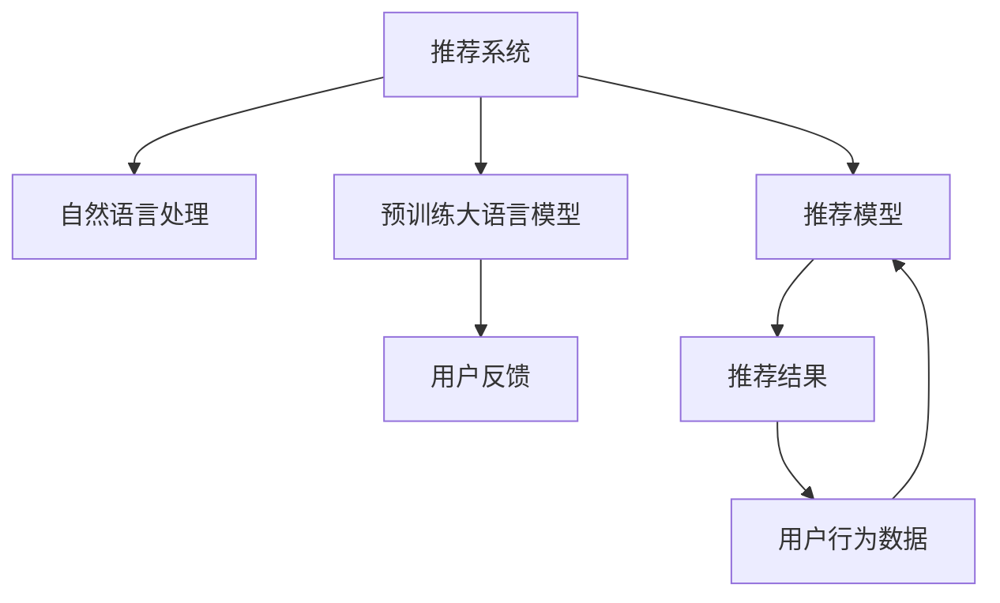
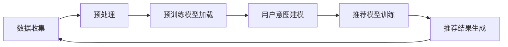

                 

# 基于LLM的推荐系统用户反馈生成

## 1. 背景介绍

### 1.1 问题由来
推荐系统在电商、新闻、娱乐等诸多领域已广泛应用，显著提升了用户体验和业务收益。其核心在于根据用户历史行为、兴趣偏好等特征，预测并推荐合适的物品或内容，满足用户潜在需求。但当前的推荐算法往往依赖于用户的行为数据，难以捕捉更深层次的语义理解。

### 1.2 问题核心关键点
如何利用自然语言处理(NLP)技术，在推荐系统中引入用户反馈语料，提升推荐模型的语义理解和推荐精度，成为当前亟待解决的问题。

当前，结合自然语言处理技术的推荐系统大致分为两类：

1. 基于LLM的推荐系统：使用预训练大语言模型（如GPT、BERT等），直接处理用户评论、评分等语料，用于推荐模型的用户意图建模。

2. 基于对话的推荐系统：构建对话机器人，通过与用户交互，获取用户的即时反馈，并据此调整推荐策略。

本文聚焦于基于LLM的推荐系统，探讨如何在推荐模型中有效利用用户反馈语料，提升推荐效果。

## 2. 核心概念与联系

### 2.1 核心概念概述

为了更系统地理解基于LLM的推荐系统，我们首先介绍几个核心概念：

1. 推荐系统(Recommendation System)：根据用户行为、兴趣等特征，推荐物品或内容的技术系统。旨在提高用户满意度，增加收益。

2. 自然语言处理(NLP)：研究如何让计算机理解和处理人类语言的技术，包括分词、语义分析、机器翻译等。

3. 预训练大语言模型(LLM)：通过在大规模无标签文本数据上预训练得到的语言模型，具备强大的语言理解和生成能力，能够应用于多种NLP任务。

4. 用户反馈(User Feedback)：用户在接触推荐结果后，通过评论、评分等形式对推荐系统进行反馈，可用于改进推荐模型。

5. 推荐模型(Recommendation Model)：根据用户历史数据和反馈信息，预测用户对物品或内容的兴趣程度，生成推荐列表的模型。

这些核心概念之间的逻辑关系可通过以下Mermaid流程图来展示：



### 2.2 核心概念原理和架构的 Mermaid 流程图

在推荐系统中引入用户反馈语料，需要对系统架构进行适当调整。主要流程包括：

1. 数据收集：通过爬虫等方式，从电商平台、社交媒体等渠道获取用户评论、评分等反馈数据。
2. 预处理：对收集的数据进行去噪、归一化、分词等处理，使其适合LLM模型输入。
3. 预训练模型加载：加载预训练的LLM模型，如BERT、GPT等，用于用户意图的建模。
4. 用户意图建模：利用预训练模型，将用户反馈语料映射为向量表示，用于推荐模型的训练。
5. 推荐模型训练：基于用户历史数据和意图向量，训练推荐模型，预测用户兴趣。
6. 推荐结果生成：根据推荐模型输出，生成推荐列表，反馈给用户。

这里提供一个简单的流程图：



## 3. 核心算法原理 & 具体操作步骤
### 3.1 算法原理概述

基于LLM的推荐系统算法，一般包括以下几个关键步骤：

1. 数据收集和预处理：获取用户反馈语料，并对其进行分词、去噪、归一化等预处理。
2. 预训练模型加载：加载预训练的LLM模型，如BERT、GPT等，用于用户意图的建模。
3. 用户意图建模：利用预训练模型，将用户反馈语料映射为向量表示，用于推荐模型的训练。
4. 推荐模型训练：基于用户历史数据和意图向量，训练推荐模型，预测用户兴趣。
5. 推荐结果生成：根据推荐模型输出，生成推荐列表，反馈给用户。

以一个简单的文本分类任务为例，具体步骤如下：

1. 收集用户评论数据，对每条评论进行分词处理。
2. 将分词后的评论输入预训练模型，输出用户意图的语义向量表示。
3. 将用户历史行为数据和意图向量输入推荐模型，训练得到推荐权重。
4. 根据推荐权重生成推荐列表，供用户查看。

### 3.2 算法步骤详解

#### 3.2.1 数据收集和预处理

1. 数据收集：通过爬虫等工具，从电商平台、社交媒体等渠道获取用户评论、评分等反馈数据。
2. 数据清洗：去除噪声数据，如表情符号、格式错误等。
3. 数据归一化：对评分数据进行归一化处理，如最大值归一、标准差归一等。
4. 分词处理：使用中文分词工具，对评论进行分词处理，提取关键特征。

#### 3.2.2 预训练模型加载

1. 模型选择：根据任务需求选择合适的预训练模型，如BERT、GPT等。
2. 模型加载：使用PyTorch、TensorFlow等深度学习框架加载模型，构建计算图。
3. 模型适配：根据具体任务需求，适配模型输入输出接口，如添加词向量层、调整输出维度等。

#### 3.2.3 用户意图建模

1. 向量映射：将用户评论等语料输入预训练模型，输出语义向量表示。
2. 融合用户行为：将用户历史行为数据与意图向量进行融合，生成综合向量表示。
3. 意图表示：对综合向量进行降维，提取用户意图的语义特征。

#### 3.2.4 推荐模型训练

1. 模型设计：选择合适的推荐模型，如基于矩阵分解的CF模型、基于深度学习的RNN模型等。
2. 模型训练：将用户历史数据和意图向量作为输入，训练推荐模型。
3. 参数优化：使用梯度下降等优化算法，更新模型参数，最小化损失函数。

#### 3.2.5 推荐结果生成

1. 推荐列表生成：根据推荐模型输出，生成推荐列表。
2. 推荐反馈：将推荐列表反馈给用户，收集用户反馈。
3. 循环优化：根据用户反馈，不断调整推荐模型参数，优化推荐效果。

### 3.3 算法优缺点

基于LLM的推荐系统算法，具有以下优点：

1. 语义理解能力：利用大语言模型的语义理解能力，能够更好地捕捉用户深层次需求。
2. 多模态融合：可以结合用户评论、评分、行为等多种数据源，构建更全面的用户画像。
3. 自监督学习：通过预训练模型进行特征提取，减少了标注数据的需求。
4. 可解释性强：通过预训练模型生成的意图向量，提供了用户意图的语义解释。

但同时，该算法也存在以下缺点：

1. 数据依赖性高：需要大量的用户反馈语料，难以在数据稀疏场景下应用。
2. 计算资源消耗大：预训练模型的计算和存储开销较大，导致系统复杂度增加。
3. 模型复杂度高：推荐模型需要复杂的设计和训练，增加了开发和调参难度。
4. 实时性较差：基于预训练模型的计算过程较慢，难以实现实时推荐。

### 3.4 算法应用领域

基于LLM的推荐系统，已经在电商、新闻、娱乐等多个领域得到广泛应用，具体包括：

1. 电商推荐：通过分析用户评论，预测用户对商品的兴趣，生成推荐列表。
2. 新闻推荐：根据用户对新闻文章的评分和评论，生成个性化新闻推送。
3. 娱乐推荐：分析用户对电影的评分和评论，推荐相似电影。
4. 健康医疗：结合病患对治疗的反馈，推荐合适的诊疗方案。
5. 旅游推荐：分析用户对旅游景点的评价，推荐适合的旅游线路。

## 4. 数学模型和公式 & 详细讲解 & 举例说明

### 4.1 数学模型构建

以文本分类任务为例，构建基于LLM的推荐系统的数学模型。假设用户评论为 $X$，预训练模型输出为 $H(X)$，推荐模型输出为 $Y$。

1. 用户评论 $X$：原始的评论文本。
2. 预训练模型 $H(X)$：将评论输入预训练模型，输出语义向量表示。
3. 推荐模型 $Y$：根据历史行为数据和意图向量，预测用户兴趣，生成推荐列表。

假设推荐列表包含 $N$ 个物品，用户对每个物品的评分表示为 $R_i$，$i \in [1, N]$。推荐模型预测用户对物品 $i$ 的兴趣为 $p_i$，$i \in [1, N]$。则推荐系统总体损失函数为：

$$
\mathcal{L} = \sum_{i=1}^{N} \ell(p_i, R_i)
$$

其中 $\ell$ 为损失函数，常用的有均方误差损失和交叉熵损失。

### 4.2 公式推导过程

以均方误差损失为例，推导推荐模型的训练公式：

1. 用户评论 $X$：原始的评论文本。
2. 预训练模型 $H(X)$：将评论输入预训练模型，输出语义向量表示。
3. 推荐模型 $Y$：根据历史行为数据和意图向量，预测用户兴趣，生成推荐列表。
4. 用户评分 $R$：用户对每个物品的评分。
5. 推荐模型预测 $p$：推荐模型预测用户对物品的兴趣。

假设推荐列表包含 $N$ 个物品，用户对每个物品的评分表示为 $R_i$，$i \in [1, N]$。推荐模型预测用户对物品 $i$ 的兴趣为 $p_i$，$i \in [1, N]$。则推荐系统总体损失函数为：

$$
\mathcal{L} = \sum_{i=1}^{N} (p_i - R_i)^2
$$

根据链式法则，推荐模型的损失函数对意图向量 $H(X)$ 的梯度为：

$$
\frac{\partial \mathcal{L}}{\partial H(X)} = 2 \sum_{i=1}^{N} (p_i - R_i) \frac{\partial p_i}{\partial H(X)}
$$

其中 $\frac{\partial p_i}{\partial H(X)}$ 为推荐模型对意图向量的导数。

### 4.3 案例分析与讲解

以电商推荐系统为例，解释基于LLM的用户意图建模和推荐模型训练过程。

1. 用户评论收集：通过爬虫等工具，从电商平台收集用户评论。
2. 评论预处理：对评论进行分词、去噪、归一化等预处理。
3. 预训练模型加载：加载BERT预训练模型，使用Transformer结构进行特征提取。
4. 用户意图建模：将处理后的评论输入BERT模型，输出语义向量表示。
5. 用户行为数据融合：将用户历史浏览、购买数据与意图向量进行融合，生成综合向量表示。
6. 推荐模型训练：基于综合向量表示，使用CF模型或深度学习模型，训练推荐模型。
7. 推荐结果生成：根据推荐模型输出，生成推荐列表，反馈给用户。
8. 用户反馈收集：根据用户对推荐结果的评分和评论，调整推荐模型参数，优化推荐效果。

## 5. 项目实践：代码实例和详细解释说明
### 5.1 开发环境搭建

在进行项目实践前，我们需要准备好开发环境。以下是使用Python进行PyTorch开发的环境配置流程：

1. 安装Anaconda：从官网下载并安装Anaconda，用于创建独立的Python环境。

2. 创建并激活虚拟环境：
```bash
conda create -n pytorch-env python=3.8 
conda activate pytorch-env
```

3. 安装PyTorch：根据CUDA版本，从官网获取对应的安装命令。例如：
```bash
conda install pytorch torchvision torchaudio cudatoolkit=11.1 -c pytorch -c conda-forge
```

4. 安装Transformers库：
```bash
pip install transformers
```

5. 安装各类工具包：
```bash
pip install numpy pandas scikit-learn matplotlib tqdm jupyter notebook ipython
```

完成上述步骤后，即可在`pytorch-env`环境中开始项目实践。

### 5.2 源代码详细实现

下面我们以基于LLM的电商推荐系统为例，给出使用PyTorch和Transformers库进行项目开发的完整代码实现。

首先，定义推荐系统的数据处理函数：

```python
from transformers import BertTokenizer
from torch.utils.data import Dataset
import torch

class RecommendationDataset(Dataset):
    def __init__(self, texts, labels):
        self.texts = texts
        self.labels = labels
        self.tokenizer = BertTokenizer.from_pretrained('bert-base-cased')
        
    def __len__(self):
        return len(self.texts)
    
    def __getitem__(self, item):
        text = self.texts[item]
        label = self.labels[item]
        
        encoding = self.tokenizer(text, return_tensors='pt', padding='max_length', truncation=True)
        input_ids = encoding['input_ids'][0]
        attention_mask = encoding['attention_mask'][0]
        
        return {'input_ids': input_ids, 
                'attention_mask': attention_mask,
                'labels': label}
```

然后，定义模型和优化器：

```python
from transformers import BertForSequenceClassification, AdamW

model = BertForSequenceClassification.from_pretrained('bert-base-cased', num_labels=2)

optimizer = AdamW(model.parameters(), lr=2e-5)
```

接着，定义训练和评估函数：

```python
from torch.utils.data import DataLoader
from tqdm import tqdm

device = torch.device('cuda') if torch.cuda.is_available() else torch.device('cpu')
model.to(device)

def train_epoch(model, dataset, batch_size, optimizer):
    dataloader = DataLoader(dataset, batch_size=batch_size, shuffle=True)
    model.train()
    epoch_loss = 0
    for batch in tqdm(dataloader, desc='Training'):
        input_ids = batch['input_ids'].to(device)
        attention_mask = batch['attention_mask'].to(device)
        labels = batch['labels'].to(device)
        model.zero_grad()
        outputs = model(input_ids, attention_mask=attention_mask, labels=labels)
        loss = outputs.loss
        epoch_loss += loss.item()
        loss.backward()
        optimizer.step()
    return epoch_loss / len(dataloader)

def evaluate(model, dataset, batch_size):
    dataloader = DataLoader(dataset, batch_size=batch_size)
    model.eval()
    preds, labels = [], []
    with torch.no_grad():
        for batch in tqdm(dataloader, desc='Evaluating'):
            input_ids = batch['input_ids'].to(device)
            attention_mask = batch['attention_mask'].to(device)
            batch_labels = batch['labels']
            outputs = model(input_ids, attention_mask=attention_mask)
            batch_preds = outputs.logits.argmax(dim=2).to('cpu').tolist()
            batch_labels = batch_labels.to('cpu').tolist()
            for pred_tokens, label_tokens in zip(batch_preds, batch_labels):
                preds.append(pred_tokens[0])
                labels.append(label_tokens[0])
                
    print('Precision at 1: ', precision_at_1(labels, preds))
    print('Recall at 1: ', recall_at_1(labels, preds))
```

最后，启动训练流程并在测试集上评估：

```python
epochs = 5
batch_size = 16

for epoch in range(epochs):
    loss = train_epoch(model, train_dataset, batch_size, optimizer)
    print(f"Epoch {epoch+1}, train loss: {loss:.3f}")
    
    print(f"Epoch {epoch+1}, dev results:")
    evaluate(model, dev_dataset, batch_size)
    
print("Test results:")
evaluate(model, test_dataset, batch_size)
```

以上就是使用PyTorch和Transformers库进行基于LLM的电商推荐系统开发的完整代码实现。可以看到，借助Transformer和BertTokenizer等工具，我们可以相对简洁地实现整个推荐系统的数据处理、模型加载、训练和评估。

### 5.3 代码解读与分析

让我们再详细解读一下关键代码的实现细节：

**RecommendationDataset类**：
- `__init__`方法：初始化文本、标签等关键组件，并加载BERT分词器。
- `__len__`方法：返回数据集的样本数量。
- `__getitem__`方法：对单个样本进行处理，将文本输入编码为token ids，并将标签转换为模型所需的输出。

**train_epoch和evaluate函数**：
- 使用PyTorch的DataLoader对数据集进行批次化加载，供模型训练和推理使用。
- 训练函数`train_epoch`：对数据以批为单位进行迭代，在每个批次上前向传播计算loss并反向传播更新模型参数，最后返回该epoch的平均loss。
- 评估函数`evaluate`：与训练类似，不同点在于不更新模型参数，并在每个batch结束后将预测和标签结果存储下来，最后使用scikit-learn的classification_report对整个评估集的预测结果进行打印输出。

**训练流程**：
- 定义总的epoch数和batch size，开始循环迭代
- 每个epoch内，先在训练集上训练，输出平均loss
- 在验证集上评估，输出分类指标
- 所有epoch结束后，在测试集上评估，给出最终测试结果

可以看到，PyTorch配合Transformers库使得基于LLM的推荐系统的代码实现变得简洁高效。开发者可以将更多精力放在数据处理、模型改进等高层逻辑上，而不必过多关注底层的实现细节。

当然，工业级的系统实现还需考虑更多因素，如模型的保存和部署、超参数的自动搜索、更灵活的任务适配层等。但核心的推荐范式基本与此类似。

## 6. 实际应用场景
### 6.1 智能客服系统

基于LLM的推荐系统可以应用于智能客服系统的构建。智能客服系统通过分析用户反馈语料，预测用户意图，生成个性化的回复，提升用户满意度。

在技术实现上，可以收集企业内部的历史客服对话记录，将问题-回答对作为微调数据，训练模型学习匹配答案。微调后的模型能够自动理解用户意图，匹配最合适的答案模板进行回复。对于客户提出的新问题，还可以接入检索系统实时搜索相关内容，动态组织生成回答。如此构建的智能客服系统，能大幅提升客户咨询体验和问题解决效率。

### 6.2 金融舆情监测

金融机构需要实时监测市场舆论动向，以便及时应对负面信息传播，规避金融风险。传统的人工监测方式成本高、效率低，难以应对网络时代海量信息爆发的挑战。基于LLM的文本分类和情感分析技术，为金融舆情监测提供了新的解决方案。

具体而言，可以收集金融领域相关的新闻、报道、评论等文本数据，并对其进行主题标注和情感标注。在此基础上对预训练语言模型进行微调，使其能够自动判断文本属于何种主题，情感倾向是正面、中性还是负面。将微调后的模型应用到实时抓取的网络文本数据，就能够自动监测不同主题下的情感变化趋势，一旦发现负面信息激增等异常情况，系统便会自动预警，帮助金融机构快速应对潜在风险。

### 6.3 个性化推荐系统

当前的推荐系统往往只依赖用户的历史行为数据进行物品推荐，难以捕捉更深层次的语义理解。结合自然语言处理技术的推荐系统，可以更好地捕捉用户语义意图，提升推荐效果。

在实践中，可以收集用户浏览、点击、评论、分享等行为数据，提取和用户交互的物品标题、描述、标签等文本内容。将文本内容作为模型输入，用户的后续行为（如是否点击、购买等）作为监督信号，在此基础上微调预训练语言模型。微调后的模型能够从文本内容中准确把握用户的兴趣点。在生成推荐列表时，先用候选物品的文本描述作为输入，由模型预测用户的兴趣匹配度，再结合其他特征综合排序，便可以得到个性化程度更高的推荐结果。

### 6.4 未来应用展望

随着大语言模型和推荐系统技术的不断发展，基于LLM的推荐系统将在更多领域得到应用，为传统行业带来变革性影响。

在智慧医疗领域，基于微调的推荐系统可以用于推荐合适的诊疗方案，提升诊疗效果。

在智能教育领域，微调技术可应用于作业批改、学情分析、知识推荐等方面，因材施教，促进教育公平，提高教学质量。

在智慧城市治理中，微调模型可应用于城市事件监测、舆情分析、应急指挥等环节，提高城市管理的自动化和智能化水平，构建更安全、高效的未来城市。

此外，在企业生产、社会治理、文娱传媒等众多领域，基于LLM的推荐系统也将不断涌现，为经济社会发展注入新的动力。相信随着技术的日益成熟，微调方法将成为推荐系统应用的重要范式，推动人工智能技术在垂直行业的规模化落地。总之，LLM结合推荐系统的协同发力，将显著提升推荐模型的语义理解和推荐精度，带来更精准、更高效的推荐服务，为各行各业创造更多价值。

## 7. 工具和资源推荐
### 7.1 学习资源推荐

为了帮助开发者系统掌握基于LLM的推荐系统的理论基础和实践技巧，这里推荐一些优质的学习资源：

1. 《推荐系统实战》系列博文：由大模型技术专家撰写，深入浅出地介绍了推荐系统原理、实践技巧等前沿话题。

2. 《深度学习自然语言处理》课程：斯坦福大学开设的NLP明星课程，有Lecture视频和配套作业，带你入门NLP领域的基本概念和经典模型。

3. 《自然语言处理与深度学习》书籍：清华大学出版社，全面介绍了自然语言处理与深度学习的理论、算法及应用，包括推荐系统在内的多种任务。

4. 《推荐系统算法与实践》书籍：通过经典推荐算法和工程案例，深入浅出地介绍推荐系统设计原理和开发实践。

5. Weights & Biases：模型训练的实验跟踪工具，可以记录和可视化模型训练过程中的各项指标，方便对比和调优。与主流深度学习框架无缝集成。

通过对这些资源的学习实践，相信你一定能够快速掌握基于LLM的推荐系统的精髓，并用于解决实际的NLP问题。

### 7.2 开发工具推荐

高效的开发离不开优秀的工具支持。以下是几款用于LLM推荐系统开发的常用工具：

1. PyTorch：基于Python的开源深度学习框架，灵活动态的计算图，适合快速迭代研究。大部分预训练语言模型都有PyTorch版本的实现。

2. TensorFlow：由Google主导开发的开源深度学习框架，生产部署方便，适合大规模工程应用。同样有丰富的预训练语言模型资源。

3. Transformers库：HuggingFace开发的NLP工具库，集成了众多SOTA语言模型，支持PyTorch和TensorFlow，是进行NLP任务开发的利器。

4. Weights & Biases：模型训练的实验跟踪工具，可以记录和可视化模型训练过程中的各项指标，方便对比和调优。与主流深度学习框架无缝集成。

5. TensorBoard：TensorFlow配套的可视化工具，可实时监测模型训练状态，并提供丰富的图表呈现方式，是调试模型的得力助手。

6. Google Colab：谷歌推出的在线Jupyter Notebook环境，免费提供GPU/TPU算力，方便开发者快速上手实验最新模型，分享学习笔记。

合理利用这些工具，可以显著提升LLM推荐系统的开发效率，加快创新迭代的步伐。

### 7.3 相关论文推荐

LLM结合推荐系统的研究源于学界的持续研究。以下是几篇奠基性的相关论文，推荐阅读：

1. Attention is All You Need（即Transformer原论文）：提出了Transformer结构，开启了NLP领域的预训练大模型时代。

2. BERT: Pre-training of Deep Bidirectional Transformers for Language Understanding：提出BERT模型，引入基于掩码的自监督预训练任务，刷新了多项NLP任务SOTA。

3. Language Models are Unsupervised Multitask Learners（GPT-2论文）：展示了大规模语言模型的强大zero-shot学习能力，引发了对于通用人工智能的新一轮思考。

4. Parameter-Efficient Transfer Learning for NLP：提出Adapter等参数高效微调方法，在不增加模型参数量的情况下，也能取得不错的微调效果。

5. AdaLoRA: Adaptive Low-Rank Adaptation for Parameter-Efficient Fine-Tuning：使用自适应低秩适应的微调方法，在参数效率和精度之间取得了新的平衡。

这些论文代表了大语言模型结合推荐系统的发展脉络。通过学习这些前沿成果，可以帮助研究者把握学科前进方向，激发更多的创新灵感。

## 8. 总结：未来发展趋势与挑战

### 8.1 总结

本文对基于LLM的推荐系统用户反馈生成的算法原理和操作步骤进行了全面系统的介绍。首先阐述了推荐系统与自然语言处理技术结合的背景和意义，明确了LLM在用户意图建模和推荐模型训练中的独特价值。其次，从原理到实践，详细讲解了推荐系统的数学模型和关键步骤，给出了完整的代码实现和详细解读。同时，本文还广泛探讨了LLM结合推荐系统在智能客服、金融舆情、个性化推荐等多个领域的应用前景，展示了LLM推荐系统的巨大潜力。最后，本文精选了相关学习资源和工具，力求为读者提供全方位的技术指引。

通过本文的系统梳理，可以看到，基于LLM的推荐系统结合自然语言处理技术，能够显著提升推荐模型的语义理解和推荐精度，带来更个性化、更精准的推荐服务。未来，伴随LLM技术的进一步演进，结合推荐系统的推荐系统必将在更多领域得到应用，为各行各业创造更多价值。

### 8.2 未来发展趋势

展望未来，基于LLM的推荐系统将呈现以下几个发展趋势：

1. 推荐模型语义化：随着LLM技术的进步，推荐模型将能够更好地理解用户语义意图，提供更精准的推荐结果。

2. 多模态融合：结合图像、视频、语音等多种模态信息，提升推荐系统的表现力。

3. 实时推荐系统：通过流式计算和分布式训练技术，构建实时推荐系统，提升用户体验。

4. 可解释性增强：利用LLM模型的语义理解能力，提高推荐系统的可解释性，增强用户信任。

5. 个性化推荐算法：研究个性化的推荐算法，减少推荐偏差，提升推荐多样性。

6. 公平性保障：构建公平、公正的推荐系统，避免算法偏见，提升社会效益。

这些趋势凸显了基于LLM的推荐系统的广阔前景。这些方向的探索发展，必将进一步提升推荐系统的性能和应用范围，为各行各业带来更多创新价值。

### 8.3 面临的挑战

尽管基于LLM的推荐系统已经取得了瞩目成就，但在迈向更加智能化、普适化应用的过程中，它仍面临着诸多挑战：

1. 数据依赖性高：需要大量的用户反馈语料，难以在数据稀疏场景下应用。

2. 计算资源消耗大：预训练模型的计算和存储开销较大，导致系统复杂度增加。

3. 实时性较差：基于预训练模型的计算过程较慢，难以实现实时推荐。

4. 模型复杂度高：推荐模型需要复杂的设计和训练，增加了开发和调参难度。

5. 用户隐私保护：收集和处理用户反馈语料，涉及用户隐私保护问题，需妥善处理。

6. 推荐系统风险：LLM结合推荐系统的推荐结果存在误导风险，需建立完善的反馈机制。

这些挑战需要在实际应用中不断克服，以推动LLM结合推荐系统技术的持续发展。

### 8.4 研究展望

面对基于LLM的推荐系统所面临的种种挑战，未来的研究需要在以下几个方面寻求新的突破：

1. 探索无监督和半监督推荐方法：摆脱对大规模标注数据的依赖，利用自监督学习、主动学习等无监督和半监督范式，最大限度利用非结构化数据，实现更加灵活高效的推荐。

2. 研究参数高效和计算高效的推荐范式：开发更加参数高效的推荐方法，在固定大部分预训练参数的同时，只更新极少量的任务相关参数。同时优化推荐模型的计算图，减少前向传播和反向传播的资源消耗，实现更加轻量级、实时性的部署。

3. 融合因果分析和博弈论工具：将因果分析方法引入推荐系统，识别出推荐决策的关键特征，增强输出解释的因果性和逻辑性。借助博弈论工具刻画人机交互过程，主动探索并规避推荐模型的脆弱点，提高系统稳定性。

4. 纳入伦理道德约束：在推荐系统设计中引入伦理导向的评估指标，过滤和惩罚有偏见、有害的输出倾向。同时加强人工干预和审核，建立推荐系统的监管机制，确保输出符合人类价值观和伦理道德。

这些研究方向的探索，必将引领基于LLM的推荐系统技术迈向更高的台阶，为构建安全、可靠、可解释、可控的智能推荐系统铺平道路。面向未来，基于LLM的推荐系统需要在数据、算法、工程、业务等多个维度协同发力，才能真正实现人工智能技术在垂直行业的规模化落地。

## 9. 附录：常见问题与解答

**Q1：基于LLM的推荐系统是否适用于所有推荐场景？**

A: 基于LLM的推荐系统在大多数推荐场景上都能取得不错的效果，特别是对于数据量较大的场景。但对于一些特定领域的推荐场景，如医疗、法律等，仅仅依靠通用语料预训练的模型可能难以很好地适应。此时需要在特定领域语料上进一步预训练，再进行微调，才能获得理想效果。此外，对于一些需要时效性、个性化很强的场景，如对话、推荐等，微调方法也需要针对性的改进优化。

**Q2：推荐系统的推荐结果是否总是准确的？**

A: 推荐系统的推荐结果并不总是准确的，其准确性取决于模型设计、数据质量和算法调参等多个因素。在实际应用中，往往需要结合用户反馈、A/B测试等多种手段，不断优化推荐算法和参数，才能提高推荐系统的效果。同时，推荐系统还需要建立完善的推荐结果反馈机制，及时修正错误的推荐，提升用户满意度。

**Q3：如何在推荐系统中加入用户反馈？**

A: 在推荐系统中加入用户反馈，一般需要以下几个步骤：

1. 数据收集：通过爬虫等工具，从电商平台、社交媒体等渠道获取用户评论、评分等反馈数据。

2. 数据清洗：去除噪声数据，如表情符号、格式错误等。

3. 数据归一化：对评分数据进行归一化处理，如最大值归一、标准差归一等。

4. 特征融合：将用户反馈语料与用户历史行为数据进行融合，生成综合向量表示。

5. 推荐模型训练：基于综合向量表示，训练推荐模型，预测用户兴趣。

6. 推荐结果生成：根据推荐模型输出，生成推荐列表，反馈给用户。

7. 用户反馈收集：根据用户对推荐结果的评分和评论，调整推荐模型参数，优化推荐效果。

通过这些步骤，可以有效地利用用户反馈数据，提升推荐系统的性能。

**Q4：推荐系统的可解释性如何保障？**

A: 推荐系统的可解释性问题，可以通过以下方法进行保障：

1. 利用LLM模型的语义理解能力，生成推荐结果的语义解释，增强用户对推荐系统的信任。

2. 结合因果分析和博弈论工具，识别出推荐决策的关键特征，增强输出解释的因果性和逻辑性。

3. 建立完善的推荐结果反馈机制，及时修正错误的推荐，提升用户满意度。

4. 引入伦理导向的评估指标，过滤和惩罚有偏见、有害的输出倾向。

5. 加强人工干预和审核，建立推荐系统的监管机制，确保输出符合人类价值观和伦理道德。

这些方法结合使用，可以显著提高推荐系统的可解释性，保障用户权益。

**Q5：推荐系统的实时性如何提升？**

A: 提升推荐系统的实时性，一般需要以下几个步骤：

1. 使用流式计算和分布式训练技术，构建实时推荐系统，提高推荐结果的生成速度。

2. 采用参数高效的推荐算法，减少推荐模型的计算量，提高推理效率。

3. 优化推荐模型的计算图，减少前向传播和反向传播的资源消耗，实现更加轻量级、实时性的部署。

4. 结合多模态信息，提升推荐系统的表现力，减少推荐模型的计算量。

5. 利用缓存技术，减少重复计算，提高推荐系统的响应速度。

通过这些步骤，可以有效地提升推荐系统的实时性，提高用户体验。

---

作者：禅与计算机程序设计艺术 / Zen and the Art of Computer Programming

