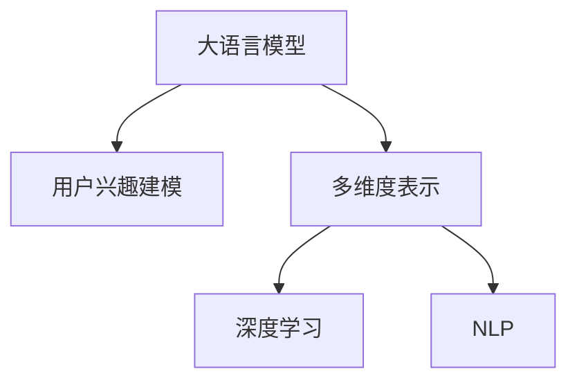

                 

# 基于LLM的用户兴趣多维度表示学习

> 关键词：语言模型, 用户兴趣, 多维度表示, 深度学习, 自然语言处理(NLP), 推荐系统

## 1. 背景介绍

### 1.1 问题由来

在现代互联网时代，推荐系统已成为驱动用户行为和提高用户体验的重要工具。传统的推荐系统主要基于用户行为数据（如浏览、购买、评分等），通过协同过滤或矩阵分解方法进行推荐。然而，这些方法往往依赖于用户行为数据，对于新用户的推荐效果有限。

近年来，语言模型（Language Model，简称LM）在推荐系统中逐渐受到关注。语言模型通过分析用户与产品之间的交互文本，可以获取用户的兴趣信息，进一步优化推荐效果。特别地，使用大语言模型（Large Language Model，简称LLM），如GPT-3、BERT等，可以更好地处理自然语言文本，从而在推荐系统等应用中取得优异效果。

### 1.2 问题核心关键点

LLM在推荐系统中的应用，主要集中在用户兴趣的建模和表示学习。通过分析用户与产品的交互文本，LLM可以学习用户对于产品或服务的偏好和兴趣，并将其表示为高维向量。这种多维度表示能够更加全面地反映用户的潜在需求和行为趋势。

为此，本文聚焦于基于LLM的用户兴趣多维度表示学习，旨在探索如何高效、准确地获取和建模用户兴趣，为推荐系统提供强大的底层支持。

## 2. 核心概念与联系

### 2.1 核心概念概述

为更好地理解基于LLM的用户兴趣多维度表示学习，本节将介绍几个密切相关的核心概念：

- 大语言模型（Large Language Model，简称LLM）：以自回归(如GPT-3)或自编码(如BERT)模型为代表的大规模预训练语言模型。通过在大规模无标签文本语料上进行预训练，学习通用的语言表示，具备强大的语言理解和生成能力。

- 用户兴趣建模：通过分析用户的自然语言文本，如评论、问答、搜索历史等，学习用户的兴趣偏好，并将其表示为高维向量。

- 多维度表示：使用多维向量表示用户兴趣，可以从不同角度（如情感、主题、风格等）理解用户偏好，提升推荐的全面性和准确性。

- 深度学习：使用多层神经网络对大规模数据进行训练，学习复杂的关系和模式，特别适用于处理自然语言文本。

- 自然语言处理（Natural Language Processing，简称NLP）：专注于处理、分析和生成自然语言文本的技术，是推荐系统中用户兴趣建模的关键。

这些核心概念之间的逻辑关系可以通过以下Mermaid流程图来展示：



这个流程图展示了大语言模型的核心概念及其之间的关系：

1. 大语言模型通过预训练获得基础能力。
2. 用户兴趣建模使用大语言模型学习用户兴趣，并将其表示为高维向量。
3. 多维度表示利用深度学习技术对高维向量进行进一步优化，形成更准确的兴趣表示。
4. 自然语言处理是用户兴趣建模的基础，提供高质量的自然语言数据输入。

这些概念共同构成了基于LLM的用户兴趣建模和表示学习的框架，使得LLM在推荐系统等应用中能够发挥更大的作用。

## 3. 核心算法原理 & 具体操作步骤

### 3.1 算法原理概述

基于LLM的用户兴趣多维度表示学习，本质上是将自然语言文本转化为高维向量，并对其进行聚类或嵌入优化，以便于在推荐系统中使用。其核心思想是：

- 利用大语言模型学习用户与产品的交互文本，提取用户的兴趣信息。
- 将兴趣信息映射到高维向量空间，利用深度学习技术进一步优化，得到多维度表示。
- 利用多维度表示，提升推荐系统的效果和用户体验。

这一过程可以形式化地表示为：

- 输入：用户与产品的交互文本 $x$。
- 输出：用户兴趣的高维向量 $z$。

其中，$z$ 可以从多个角度（如情感、主题、风格等）理解用户兴趣，提升推荐的全面性和准确性。

### 3.2 算法步骤详解

基于LLM的用户兴趣多维度表示学习一般包括以下几个关键步骤：

**Step 1: 数据预处理**

- 收集用户与产品的交互文本数据。可以是用户的评论、问答、搜索历史等。
- 对文本进行分词、去除停用词、词性标注等预处理，准备输入LLM。

**Step 2: 预训练大语言模型**

- 使用大语言模型（如GPT-3、BERT等）对文本数据进行预训练，学习语言的通用表示。
- 通过微调（Fine-tuning）等技术，使模型更适应特定任务，即用户兴趣建模。

**Step 3: 多维度表示学习**

- 使用预训练模型对用户文本进行编码，得到嵌入向量 $z$。
- 利用深度学习技术，如多层感知器（MLP）、卷积神经网络（CNN）等，对嵌入向量进行优化，得到高维向量表示。
- 通过多维度向量的组合，得到用户兴趣的全面表示。

**Step 4: 兴趣建模与推荐**

- 将用户兴趣的全面表示用于推荐系统中的用户画像构建。
- 结合用户历史行为数据，进行推荐排序，提升推荐效果。

### 3.3 算法优缺点

基于LLM的用户兴趣多维度表示学习具有以下优点：

1. **全面性**：通过多维度表示，能够全面地理解用户兴趣，提升推荐效果。
2. **高效性**：利用大语言模型的预训练能力，可以高效地学习用户兴趣，减少数据标注和特征工程的成本。
3. **灵活性**：可以根据具体任务需求，灵活设计表示学习过程，适应不同的用户行为数据。

同时，该方法也存在一定的局限性：

1. **数据依赖**：模型的性能很大程度上取决于文本数据的质量和数量，需要收集大量高质量用户行为数据。
2. **模型复杂性**：多维度表示和深度学习模型的复杂性较高，训练和推理速度较慢。
3. **可解释性不足**：基于深度学习模型的表示学习过程较难解释，难以理解其内部工作机制。
4. **隐私问题**：用户文本数据的收集和处理可能涉及隐私问题，需要采取相应的隐私保护措施。

尽管存在这些局限性，但就目前而言，基于LLM的用户兴趣多维度表示学习仍是一种高效的推荐系统技术范式。未来相关研究的重点在于如何进一步降低数据依赖，提高模型的可解释性和隐私保护。

### 3.4 算法应用领域

基于LLM的用户兴趣多维度表示学习在推荐系统、智能客服、情感分析等诸多领域中得到了广泛应用，为这些领域带来了新的突破。

- **推荐系统**：通过多维度表示，提升推荐效果和个性化程度，为用户推荐更满意的产品和服务。
- **智能客服**：利用用户输入的文本信息，自动理解用户需求，提供个性化服务。
- **情感分析**：分析用户评论和反馈，了解用户情感倾向，提升产品和服务质量。

除了这些经典应用，LLM在更多场景中也有创新性应用，如基于用户文本进行对话生成、医疗诊断、金融预测等，为各行各业带来了新的发展机会。

## 4. 数学模型和公式 & 详细讲解 & 举例说明

### 4.1 数学模型构建

本节将使用数学语言对基于LLM的用户兴趣多维度表示学习过程进行更加严格的刻画。

记用户与产品的交互文本为 $x$，长度为 $n$，即 $x = [x_1, x_2, ..., x_n]$。使用BERT等预训练语言模型对文本进行编码，得到嵌入向量 $z$，其中 $z \in \mathbb{R}^d$。

定义用户兴趣的多维度表示 $Z$，其中 $Z = [z_1, z_2, ..., z_k]$，$k$ 为维度数。为了更好地理解用户兴趣，可以使用以下模型：

- 情感模型：使用BERT对文本进行编码，通过附加情感标签训练，学习情感倾向。
- 主题模型：使用BERT对文本进行编码，通过附加主题标签训练，学习主题偏好。
- 风格模型：使用BERT对文本进行编码，通过附加风格标签训练，学习文本风格。

这些模型可以联合使用，得到更全面的用户兴趣表示。

### 4.2 公式推导过程

以情感模型为例，推导BERT情感表示的计算公式。

假设BERT模型对文本 $x$ 的编码输出为 $z$，情感标签为 $y$，则情感模型的训练目标为：

$$
\min_{\theta} \frac{1}{N} \sum_{i=1}^N (y_i \log P(z_i) + (1-y_i) \log (1-P(z_i)))
$$

其中 $P(z_i)$ 表示模型对情感标签 $y_i$ 的预测概率。利用softmax函数将 $z_i$ 映射到 $[0,1]$ 区间，即：

$$
P(z_i) = \frac{\exp(z_i \cdot \omega)}{\sum_{j=1}^m \exp(z_j \cdot \omega)}
$$

其中 $\omega$ 为情感标签 $y_i$ 对应的权重向量。在得到情感表示 $z_s = [z_{s1}, z_{s2}, ..., z_{sm}]$ 后，可以使用以下公式计算多维度表示：

$$
Z = [z_s, z_t, z_w]
$$

其中 $z_t$ 和 $z_w$ 分别为主题和风格表示。

### 4.3 案例分析与讲解

以电商平台推荐系统为例，分析LLM在用户兴趣建模中的应用。

假设用户在电商平台搜索产品，输入查询 $x = "手机" \| "冰箱" \| "书" \| ...$。通过BERT等预训练模型对用户查询进行编码，得到嵌入向量 $z = [z_1, z_2, ..., z_n]$。

利用情感模型对查询进行情感分析，得到情感表示 $z_s = [z_{s1}, z_{s2}, ..., z_{sm}]$。利用主题模型对查询进行主题分类，得到主题表示 $z_t = [z_{t1}, z_{t2}, ..., z_{tm}]$。利用风格模型对查询进行风格分析，得到风格表示 $z_w = [z_{w1}, z_{w2}, ..., z_{wm}]$。

最终得到用户兴趣的多维度表示 $Z = [z_s, z_t, z_w]$。结合用户历史行为数据，进行推荐排序，即可提升推荐效果。

## 5. 项目实践：代码实例和详细解释说明

### 5.1 开发环境搭建

在进行LLM用户兴趣多维度表示学习的实践前，我们需要准备好开发环境。以下是使用Python进行PyTorch开发的环境配置流程：

1. 安装Anaconda：从官网下载并安装Anaconda，用于创建独立的Python环境。

2. 创建并激活虚拟环境：
```bash
conda create -n pytorch-env python=3.8 
conda activate pytorch-env
```

3. 安装PyTorch：根据CUDA版本，从官网获取对应的安装命令。例如：
```bash
conda install pytorch torchvision torchaudio cudatoolkit=11.1 -c pytorch -c conda-forge
```

4. 安装Transformers库：
```bash
pip install transformers
```

5. 安装各类工具包：
```bash
pip install numpy pandas scikit-learn matplotlib tqdm jupyter notebook ipython
```

完成上述步骤后，即可在`pytorch-env`环境中开始LLM用户兴趣多维度表示学习的实践。

### 5.2 源代码详细实现

这里我们以BERT情感分析为例，给出使用Transformers库对用户文本进行编码和情感分类的PyTorch代码实现。

首先，定义情感分类任务的数据处理函数：

```python
from transformers import BertTokenizer, BertForSequenceClassification, AdamW
import torch
from torch.utils.data import Dataset, DataLoader

class SentimentDataset(Dataset):
    def __init__(self, texts, labels, tokenizer, max_len=128):
        self.texts = texts
        self.labels = labels
        self.tokenizer = tokenizer
        self.max_len = max_len
        
    def __len__(self):
        return len(self.texts)
    
    def __getitem__(self, item):
        text = self.texts[item]
        label = self.labels[item]
        
        encoding = self.tokenizer(text, return_tensors='pt', max_length=self.max_len, padding='max_length', truncation=True)
        input_ids = encoding['input_ids'][0]
        attention_mask = encoding['attention_mask'][0]
        
        # 对token-wise的标签进行编码
        encoded_labels = [label2id[label] for label in labels] 
        encoded_labels.extend([label2id['O']] * (self.max_len - len(encoded_labels)))
        labels = torch.tensor(encoded_labels, dtype=torch.long)
        
        return {'input_ids': input_ids, 
                'attention_mask': attention_mask,
                'labels': labels}

# 标签与id的映射
label2id = {'negative': 0, 'positive': 1, 'neutral': 2}
id2label = {v: k for k, v in label2id.items()}

# 创建dataset
tokenizer = BertTokenizer.from_pretrained('bert-base-cased')

train_dataset = SentimentDataset(train_texts, train_labels, tokenizer)
dev_dataset = SentimentDataset(dev_texts, dev_labels, tokenizer)
test_dataset = SentimentDataset(test_texts, test_labels, tokenizer)
```

然后，定义模型和优化器：

```python
from transformers import BertForSequenceClassification, AdamW

model = BertForSequenceClassification.from_pretrained('bert-base-cased', num_labels=len(label2id))

optimizer = AdamW(model.parameters(), lr=2e-5)
```

接着，定义训练和评估函数：

```python
from tqdm import tqdm

device = torch.device('cuda') if torch.cuda.is_available() else torch.device('cpu')
model.to(device)

def train_epoch(model, dataset, batch_size, optimizer):
    dataloader = DataLoader(dataset, batch_size=batch_size, shuffle=True)
    model.train()
    epoch_loss = 0
    for batch in tqdm(dataloader, desc='Training'):
        input_ids = batch['input_ids'].to(device)
        attention_mask = batch['attention_mask'].to(device)
        labels = batch['labels'].to(device)
        model.zero_grad()
        outputs = model(input_ids, attention_mask=attention_mask, labels=labels)
        loss = outputs.loss
        epoch_loss += loss.item()
        loss.backward()
        optimizer.step()
    return epoch_loss / len(dataloader)

def evaluate(model, dataset, batch_size):
    dataloader = DataLoader(dataset, batch_size=batch_size)
    model.eval()
    preds, labels = [], []
    with torch.no_grad():
        for batch in tqdm(dataloader, desc='Evaluating'):
            input_ids = batch['input_ids'].to(device)
            attention_mask = batch['attention_mask'].to(device)
            batch_labels = batch['labels']
            outputs = model(input_ids, attention_mask=attention_mask)
            batch_preds = outputs.logits.argmax(dim=2).to('cpu').tolist()
            batch_labels = batch_labels.to('cpu').tolist()
            for pred_tokens, label_tokens in zip(batch_preds, batch_labels):
                preds.append(pred_tokens[:len(label_tokens)])
                labels.append(label_tokens)
                
    print(classification_report(labels, preds))
```

最后，启动训练流程并在测试集上评估：

```python
epochs = 5
batch_size = 16

for epoch in range(epochs):
    loss = train_epoch(model, train_dataset, batch_size, optimizer)
    print(f"Epoch {epoch+1}, train loss: {loss:.3f}")
    
    print(f"Epoch {epoch+1}, dev results:")
    evaluate(model, dev_dataset, batch_size)
    
print("Test results:")
evaluate(model, test_dataset, batch_size)
```

以上就是使用PyTorch对BERT进行情感分析任务的完整代码实现。可以看到，得益于Transformers库的强大封装，我们可以用相对简洁的代码完成BERT模型的加载和训练。

### 5.3 代码解读与分析

让我们再详细解读一下关键代码的实现细节：

**SentimentDataset类**：
- `__init__`方法：初始化文本、标签、分词器等关键组件。
- `__len__`方法：返回数据集的样本数量。
- `__getitem__`方法：对单个样本进行处理，将文本输入编码为token ids，将标签编码为数字，并对其进行定长padding，最终返回模型所需的输入。

**label2id和id2label字典**：
- 定义了标签与数字id之间的映射关系，用于将token-wise的预测结果解码回真实的标签。

**训练和评估函数**：
- 使用PyTorch的DataLoader对数据集进行批次化加载，供模型训练和推理使用。
- 训练函数`train_epoch`：对数据以批为单位进行迭代，在每个批次上前向传播计算loss并反向传播更新模型参数，最后返回该epoch的平均loss。
- 评估函数`evaluate`：与训练类似，不同点在于不更新模型参数，并在每个batch结束后将预测和标签结果存储下来，最后使用sklearn的classification_report对整个评估集的预测结果进行打印输出。

**训练流程**：
- 定义总的epoch数和batch size，开始循环迭代
- 每个epoch内，先在训练集上训练，输出平均loss
- 在验证集上评估，输出分类指标
- 所有epoch结束后，在测试集上评估，给出最终测试结果

可以看到，PyTorch配合Transformers库使得BERT情感分析任务的代码实现变得简洁高效。开发者可以将更多精力放在数据处理、模型改进等高层逻辑上，而不必过多关注底层的实现细节。

当然，工业级的系统实现还需考虑更多因素，如模型的保存和部署、超参数的自动搜索、更灵活的任务适配层等。但核心的用户兴趣建模过程基本与此类似。

## 6. 实际应用场景

### 6.1 电商平台推荐系统

基于LLM的用户兴趣多维度表示学习，可以在电商平台推荐系统中发挥重要作用。用户搜索、浏览、点击、评论等行为数据，能够丰富LLM的预训练和微调过程，提升推荐系统的效果。

具体而言，可以收集用户的历史搜索记录、浏览记录、评分记录等数据，利用BERT等预训练模型进行编码，得到用户兴趣的情感、主题、风格等高维表示。结合用户历史行为数据，进行推荐排序，能够提供更加精准的个性化推荐。

### 6.2 智能客服系统

智能客服系统是LLM在用户兴趣建模中的另一个重要应用场景。通过分析用户输入的文本信息，LLM可以自动理解用户需求，提供个性化服务。

例如，用户咨询“退货流程”时，智能客服系统可以通过分析文本，自动获取用户的意图，调用相关的FAQ回答，或者生成新回答进行回复。用户咨询“配送时间”时，系统可以分析文本，调用相关API获取配送状态，并进行回复。

### 6.3 金融风险预警系统

金融风险预警系统需要实时监测市场舆情，避免金融风险。利用LLM对用户评论、新闻、社交媒体等文本数据进行情感分析和主题分类，可以及时发现市场动向和风险预警信号。

例如，利用BERT对金融领域的评论进行情感分析，可以得到市场的情绪变化趋势，及时进行风险预警。利用BERT对新闻进行主题分类，可以了解不同主题的市场动态，进行市场预测。

### 6.4 未来应用展望

随着LLM和用户兴趣建模技术的不断发展，基于LLM的用户兴趣多维度表示学习将在更多领域得到应用，为各行各业带来新的突破。

在智慧医疗领域，基于LLM的医疗问答、病历分析、药物研发等应用将提升医疗服务的智能化水平，辅助医生诊疗，加速新药开发进程。

在智能教育领域，利用LLM进行学生兴趣分析、学习效果评估、知识推荐等，因材施教，促进教育公平，提高教学质量。

在智慧城市治理中，利用LLM进行城市事件监测、舆情分析、应急指挥等环节，提高城市管理的自动化和智能化水平，构建更安全、高效的未来城市。

此外，在企业生产、社会治理、文娱传媒等众多领域，基于LLM的用户兴趣建模技术也将不断涌现，为传统行业数字化转型升级提供新的技术路径。相信随着技术的日益成熟，LLM用户兴趣建模必将在构建人机协同的智能时代中扮演越来越重要的角色。

## 7. 工具和资源推荐

### 7.1 学习资源推荐

为了帮助开发者系统掌握大语言模型在用户兴趣建模中的应用，这里推荐一些优质的学习资源：

1. 《深度学习与自然语言处理》课程：由斯坦福大学开设的NLP经典课程，涵盖深度学习、自然语言处理等多个方面，适合NLP领域的研究和开发者。

2. 《BERT: Pre-training of Deep Bidirectional Transformers for Language Understanding》论文：BERT模型的原论文，介绍了预训练语言模型的基本原理和实现方法。

3. 《Attention is All You Need》论文：Transformer模型的原论文，提出了自注意力机制，引领了NLP领域的预训练大模型时代。

4. 《Recurrent Neural Network-based Language Model》论文：基于RNN的语言模型论文，介绍了循环神经网络在自然语言处理中的应用。

5. 《Natural Language Processing with Transformers》书籍：Transformers库的作者所著，全面介绍了如何使用Transformers库进行NLP任务开发，包括用户兴趣建模在内的诸多范式。

通过对这些资源的学习实践，相信你一定能够快速掌握大语言模型在用户兴趣建模中的应用，并用于解决实际的NLP问题。

### 7.2 开发工具推荐

高效的开发离不开优秀的工具支持。以下是几款用于大语言模型用户兴趣建模的常用工具：

1. PyTorch：基于Python的开源深度学习框架，灵活动态的计算图，适合快速迭代研究。BERT等预训练语言模型都有PyTorch版本的实现。

2. TensorFlow：由Google主导开发的开源深度学习框架，生产部署方便，适合大规模工程应用。BERT等预训练语言模型也有对应的TensorFlow实现。

3. Transformers库：HuggingFace开发的NLP工具库，集成了众多SOTA语言模型，支持PyTorch和TensorFlow，是进行用户兴趣建模开发的利器。

4. Weights & Biases：模型训练的实验跟踪工具，可以记录和可视化模型训练过程中的各项指标，方便对比和调优。与主流深度学习框架无缝集成。

5. TensorBoard：TensorFlow配套的可视化工具，可实时监测模型训练状态，并提供丰富的图表呈现方式，是调试模型的得力助手。

6. Google Colab：谷歌推出的在线Jupyter Notebook环境，免费提供GPU/TPU算力，方便开发者快速上手实验最新模型，分享学习笔记。

合理利用这些工具，可以显著提升大语言模型用户兴趣建模的开发效率，加快创新迭代的步伐。

### 7.3 相关论文推荐

大语言模型和用户兴趣建模的发展源于学界的持续研究。以下是几篇奠基性的相关论文，推荐阅读：

1. Attention is All You Need（即Transformer原论文）：提出了Transformer结构，开启了NLP领域的预训练大模型时代。

2. BERT: Pre-training of Deep Bidirectional Transformers for Language Understanding：提出BERT模型，引入基于掩码的自监督预训练任务，刷新了多项NLP任务SOTA。

3. Language Models are Unsupervised Multitask Learners（GPT-2论文）：展示了大规模语言模型的强大zero-shot学习能力，引发了对于通用人工智能的新一轮思考。

4. Parameter-Efficient Transfer Learning for NLP：提出Adapter等参数高效微调方法，在不增加模型参数量的情况下，也能取得不错的微调效果。

5. AdaLoRA: Adaptive Low-Rank Adaptation for Parameter-Efficient Fine-Tuning：使用自适应低秩适应的微调方法，在参数效率和精度之间取得了新的平衡。

这些论文代表了大语言模型用户兴趣建模的发展脉络。通过学习这些前沿成果，可以帮助研究者把握学科前进方向，激发更多的创新灵感。

## 8. 总结：未来发展趋势与挑战

### 8.1 总结

本文对基于LLM的用户兴趣多维度表示学习进行了全面系统的介绍。首先阐述了用户兴趣建模的研究背景和意义，明确了LLM在用户兴趣建模中的独特价值。其次，从原理到实践，详细讲解了LLM在用户兴趣建模过程中的数学模型和操作步骤，给出了用户兴趣建模任务的完整代码实例。同时，本文还广泛探讨了LLM在推荐系统、智能客服、金融预警等领域的实际应用，展示了LLM的巨大潜力。

通过本文的系统梳理，可以看到，基于LLM的用户兴趣多维度表示学习已经成为用户兴趣建模领域的重要技术范式，极大地拓展了预训练语言模型的应用边界，催生了更多的落地场景。未来，伴随预训练语言模型和用户兴趣建模方法的不断进步，基于LLM的推荐系统必将更加智能化、个性化、高效化，为人类提供更加优质的服务。

### 8.2 未来发展趋势

展望未来，基于LLM的用户兴趣多维度表示学习将呈现以下几个发展趋势：

1. **多模态融合**：未来的用户兴趣建模将不再局限于文本数据，将融合视觉、语音、图像等多种数据模态，提升模型的综合能力。

2. **跨领域迁移**：LLM将能够更好地跨领域迁移，在不同领域中适应用户行为数据的分布，提升模型的泛化能力。

3. **模型压缩与加速**：为了提高模型的实时性，LLM用户兴趣建模将进一步压缩模型规模，加速推理速度，优化资源占用。

4. **动态更新与持续学习**：LLM用户兴趣建模将实现动态更新和持续学习，适应用户行为数据的实时变化，提升模型的时效性和稳定性。

5. **用户隐私保护**：在数据收集和处理过程中，将更加注重用户隐私保护，采用差分隐私、联邦学习等技术，确保用户数据的安全。

以上趋势凸显了基于LLM的用户兴趣建模技术的广阔前景。这些方向的探索发展，必将进一步提升用户兴趣建模的准确性和全面性，为推荐系统等应用提供更强大的底层支持。

### 8.3 面临的挑战

尽管基于LLM的用户兴趣多维度表示学习已经取得了显著进展，但在实现其大规模应用的过程中，仍面临以下挑战：

1. **数据隐私**：用户行为数据涉及隐私问题，如何保护用户隐私，确保数据安全，是用户兴趣建模中的重要挑战。

2. **模型复杂性**：大语言模型本身复杂度较高，训练和推理所需资源较多，如何在保证效果的前提下，降低模型复杂度，提高实时性，是用户兴趣建模的另一个关键问题。

3. **模型可解释性**：LLM用户兴趣建模的决策过程较为复杂，如何提高模型的可解释性，增强用户的信任感和透明度，是模型应用中的重要问题。

4. **跨模态融合**：多模态数据的融合增加了建模的复杂性，如何高效地融合多模态数据，提升模型的综合能力，是未来研究的重要方向。

5. **动态更新与维护**：LLM用户兴趣建模需要定期更新和维护，如何设计高效的更新机制，提升模型的长期稳定性，是实际应用中的重要挑战。

尽管存在这些挑战，但相信随着技术的发展和优化，这些难题终将被克服。LLM用户兴趣建模必将在未来实现更加广泛的应用，带来更加智能、高效、安全的用户体验。

### 8.4 研究展望

面对LLM用户兴趣建模所面临的挑战，未来的研究需要在以下几个方面寻求新的突破：

1. **跨模态融合技术**：研究如何高效地融合多模态数据，提升模型的综合能力，特别是在视频、图像等非文本数据上的应用。

2. **动态更新机制**：研究如何设计高效的动态更新机制，确保LLM用户兴趣建模能够及时适应用户行为数据的分布变化，提升模型的长期稳定性。

3. **用户隐私保护技术**：研究如何采用差分隐私、联邦学习等技术，保护用户隐私，确保数据安全。

4. **模型可解释性增强**：研究如何提高LLM用户兴趣建模的决策过程的可解释性，增强用户的信任感和透明度。

5. **智能推荐系统**：研究如何利用LLM用户兴趣建模技术，构建更加智能、高效、个性化的推荐系统，提升用户满意度。

这些研究方向将进一步推动基于LLM的用户兴趣建模技术的发展，为智能推荐系统、智能客服、金融预警等领域带来新的突破。相信通过技术创新和应用实践，LLM用户兴趣建模必将在未来实现更加广泛的应用，为人类提供更加优质的服务。

## 9. 附录：常见问题与解答

**Q1：基于LLM的用户兴趣建模需要哪些数据？**

A: 基于LLM的用户兴趣建模需要大量的用户行为数据，如搜索记录、浏览记录、评分记录、评论等。这些数据可以用于预训练和微调LLM，得到用户兴趣的多维度表示。

**Q2：如何处理数据的不平衡问题？**

A: 数据的不平衡问题可能影响模型的训练效果。可以采用欠采样、过采样、SMOTE等技术对数据进行平衡处理，确保模型能够全面学习各类用户行为。

**Q3：在实际应用中，如何保护用户隐私？**

A: 在数据收集和处理过程中，可以采用差分隐私、联邦学习等技术，保护用户隐私，确保数据安全。此外，可以设计匿名化机制，对用户行为数据进行脱敏处理。

**Q4：如何评估模型的性能？**

A: 在用户兴趣建模任务中，可以采用准确率、召回率、F1值等指标评估模型的性能。同时，可以结合用户反馈，进行A/B测试，优化模型效果。

**Q5：如何处理文本数据的噪声问题？**

A: 文本数据可能存在噪声、不完整等问题，可以采用文本清洗、去噪等技术，确保数据质量。同时，可以结合其他数据来源，如用户画像、社交网络等，进行数据增强。

这些回答旨在帮助读者更好地理解基于LLM的用户兴趣建模技术，并解决实际应用中可能遇到的问题。相信通过这些建议，能够更好地应用LLM，实现用户兴趣建模的智能化和高效化。

---

作者：禅与计算机程序设计艺术 / Zen and the Art of Computer Programming

