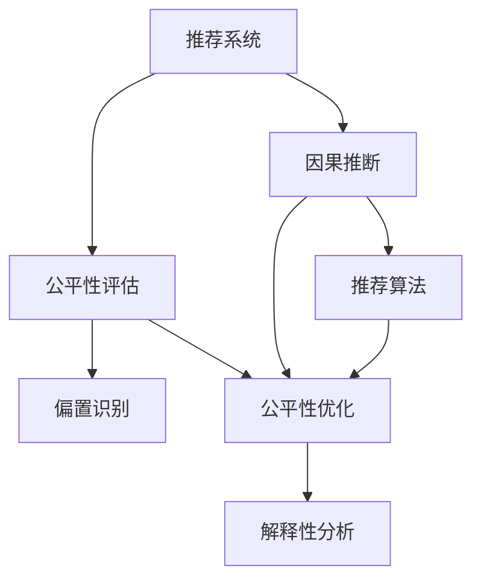

                 

# 基于因果推断的推荐系统公平性评估

> 关键词：推荐系统,因果推断,公平性评估,推荐算法,用户画像,偏置识别,解释性分析,公平性优化

## 1. 背景介绍

### 1.1 问题由来

随着推荐系统技术的快速发展，越来越多的企业和机构开始利用个性化推荐服务提升用户体验，增加用户粘性。然而，推荐系统在提供个性化服务的同时，也可能导致数据偏见和公平性问题。近年来，大量研究表明，推荐系统在推荐结果中出现了显著的性别、种族、地域等偏置，影响了用户的实际体验和公平感知。

为了解决这些问题，许多研究者开始探索利用因果推断方法对推荐系统进行公平性评估和优化。因果推断方法能够帮助识别推荐结果中的潜在因果关系，分析偏置产生的原因，提出针对性的公平性优化策略，从而提升推荐系统的公平性和可解释性。

### 1.2 问题核心关键点

推荐系统公平性评估的核心在于：如何利用因果推断方法对推荐算法进行建模，识别和量化推荐过程中的偏置，从而制定公平性优化策略。具体来说，主要包括以下几个方面：

1. **因果推断模型构建**：如何建立推荐系统的因果推断模型，识别出影响推荐结果的因果关系。
2. **偏置识别与量化**：如何检测推荐结果中的潜在偏见，并量化其影响程度。
3. **公平性优化策略**：如何设计公平性优化策略，降低推荐过程中的偏见，提升系统的公平性。
4. **解释性分析**：如何对推荐结果进行解释性分析，提升推荐系统的透明性和可信度。

这些问题需要结合推荐系统的具体业务场景和数据特点进行深入研究，需要在大规模数据集上进行验证和优化，才能实现有效的公平性评估和优化。

## 2. 核心概念与联系

### 2.1 核心概念概述

为更好地理解基于因果推断的推荐系统公平性评估方法，本节将介绍几个密切相关的核心概念：

- **推荐系统(Recommender System)**：根据用户的历史行为、兴趣偏好、社交关系等数据，推荐用户可能感兴趣的商品、内容等。
- **因果推断(Causal Inference)**：通过分析影响结果的潜在因果关系，对推荐结果进行公平性评估和优化。
- **公平性评估(Fairness Assessment)**：利用因果推断方法，评估推荐系统在性别、种族、地域等方面的偏见程度。
- **推荐算法(Recommender Algorithm)**：包括协同过滤、基于内容的推荐、混合推荐等算法，用于生成推荐结果。
- **用户画像(User Profile)**：基于用户历史行为数据，构建用户兴趣和行为特征，用于推荐算法中。
- **偏置识别(Bias Identification)**：利用因果推断技术，检测推荐结果中的偏见和歧视。
- **公平性优化(Fairness Optimization)**：通过调整推荐算法和数据，减少推荐结果中的偏见，提升系统公平性。
- **解释性分析(Explainability Analysis)**：通过因果推断方法，对推荐结果进行解释性分析，提升系统透明度和可信度。

这些核心概念之间的逻辑关系可以通过以下Mermaid流程图来展示：



这个流程图展示了一个推荐系统的因果推断、公平性评估、偏置识别、公平性优化和解释性分析的流程：

1. 推荐系统利用因果推断模型对推荐结果进行公平性评估。
2. 利用偏置识别技术检测推荐结果中的偏见。
3. 通过公平性优化策略减少推荐过程中的偏见。
4. 对推荐结果进行解释性分析，提升系统的透明性和可信度。

这些概念共同构成了推荐系统公平性评估的理论基础，使得推荐系统能够更好地服务于不同群体，提升用户体验和信任度。

## 3. 核心算法原理 & 具体操作步骤
### 3.1 算法原理概述

基于因果推断的推荐系统公平性评估方法，利用因果推断模型识别推荐结果中的潜在因果关系，检测和量化推荐过程中的偏见，从而制定公平性优化策略。其核心思想是：通过分析影响推荐结果的潜在因果关系，识别出推荐过程中的偏见来源，并采取针对性的措施减少偏见，提升系统的公平性。

具体来说，基于因果推断的推荐系统公平性评估方法可以分为以下几个步骤：

1. **因果推断模型构建**：建立推荐系统的因果推断模型，识别出影响推荐结果的因果关系。
2. **偏置识别与量化**：检测推荐结果中的偏见，并量化其影响程度。
3. **公平性优化策略设计**：设计公平性优化策略，减少推荐过程中的偏见。
4. **解释性分析**：对推荐结果进行解释性分析，提升系统的透明性和可信度。

### 3.2 算法步骤详解

基于因果推断的推荐系统公平性评估方法的步骤如下：

**Step 1: 因果推断模型构建**

推荐系统的因果推断模型一般包括两部分：

- **因果图(Causal Graph)**：用于描述推荐过程中的因果关系，识别出影响推荐结果的潜在因果变量。
- **因果估计(Causal Estimation)**：通过因果图和历史数据，估计出推荐结果的因果效应。

常见的因果推断模型包括潜在变量模型(Latent Variable Model)、条件独立图模型(Conditional Independence Graph Model, CIGM)、图模型(Graphical Model)等。

以一个简单的协同过滤推荐系统为例，其因果图可以表示为：


其中，用户 $U$ 和兴趣 $I$ 是潜在变量，推荐结果 $R$ 是观测变量。兴趣 $I$ 由用户 $U$ 和历史行为 $X$ 共同决定。推荐结果 $R$ 由兴趣 $I$ 决定。

利用历史数据，可以估计出兴趣 $I$ 对推荐结果 $R$ 的因果效应：

$$
\text{Estimate}(R \mid I) = \text{Estimate}(R \mid U) + \text{Estimate}(I \mid U)
$$

**Step 2: 偏置识别与量化**

偏置识别与量化是推荐系统公平性评估的重要步骤。偏置可以定义为推荐结果中的系统性差异，可以通过以下公式进行量化：

$$
\text{Bias} = \text{Estimate}(R \mid I) - \text{Estimate}(R \mid I')
$$

其中 $I'$ 是兴趣 $I$ 的逆变量，表示用户 $U$ 的逆兴趣。

例如，在协同过滤推荐系统中，如果男性用户得到的推荐结果比女性用户更多，那么推荐结果中就存在性别偏见，其量化公式为：

$$
\text{Bias}_{\text{gender}} = \text{Estimate}(R \mid \text{female}) - \text{Estimate}(R \mid \text{male})
$$

**Step 3: 公平性优化策略设计**

公平性优化策略设计是推荐系统公平性评估的最终目标。常见的公平性优化策略包括：

- **重新加权(Reweighting)**：根据历史数据中的因果效应，重新加权调整用户兴趣权重，减少偏见。
- **数据调整(Data Adjustment)**：对用户兴趣和行为数据进行预处理，消除数据中的偏见。
- **推荐算法优化(Algorithm Optimization)**：调整推荐算法，如引入更多的个性化特征、调整推荐公式等，减少偏见。

**Step 4: 解释性分析**

解释性分析是对推荐结果进行解释性分析，提升系统的透明性和可信度。常用的解释性分析方法包括：

- **特征贡献分析(Feature Contribution Analysis)**：分析影响推荐结果的关键特征，理解推荐结果的生成过程。
- **局部解释性分析(Local Interpretability Analysis)**：针对单个推荐结果，分析推荐算法的具体决策过程。
- **全局解释性分析(Global Interpretability Analysis)**：对整个推荐系统进行全局分析，理解推荐系统的整体表现。

这些步骤和算法共同构成了基于因果推断的推荐系统公平性评估方法的核心流程。通过这些方法，可以系统地识别和量化推荐系统中的偏见，制定公平性优化策略，提升系统的透明性和可信度。

### 3.3 算法优缺点

基于因果推断的推荐系统公平性评估方法具有以下优点：

1. **系统性**：利用因果推断模型，系统地识别推荐结果中的因果关系，分析偏见来源。
2. **精度高**：因果推断模型可以量化偏见的影响程度，提供精确的公平性评估结果。
3. **可解释性强**：通过解释性分析，理解推荐结果的生成过程，提升系统的透明性和可信度。

同时，该方法也存在一些缺点：

1. **计算复杂度高**：因果推断模型的构建和估计需要大量计算资源，特别是在处理大规模数据时。
2. **数据需求高**：需要大量历史数据来构建因果图和估计因果效应，数据缺失或不完整会影响评估结果。
3. **偏见识别困难**：在某些情况下，推荐结果中的偏见可能是隐性的，难以直接识别。
4. **公平性优化复杂**：公平性优化策略的设计需要结合业务场景和数据特点，复杂度较高。

尽管存在这些局限性，但就目前而言，基于因果推断的推荐系统公平性评估方法仍然是解决推荐系统偏置问题的有效手段。未来相关研究的重点在于如何进一步降低计算成本，提高数据处理能力，以及更好地识别隐性偏见，制定更有效的公平性优化策略。

### 3.4 算法应用领域

基于因果推断的推荐系统公平性评估方法在推荐系统领域得到了广泛应用，涵盖了推荐算法、用户画像、推荐结果等方面的公平性评估。

具体来说，该方法在以下领域的应用包括：

- **推荐算法公平性评估**：评估推荐算法在不同用户群体中的表现差异，识别算法中的偏见。
- **用户画像公平性评估**：分析用户画像数据的性别、种族、地域等特征分布，识别数据中的偏见。
- **推荐结果公平性评估**：检测推荐结果中的性别、种族、地域等偏见，量化其影响程度。

除了这些经典应用外，基于因果推断的推荐系统公平性评估方法还被创新性地应用到更多场景中，如推荐结果的解释性分析、推荐系统的用户可解释性设计等，为推荐系统的公平性和透明性提供了新的技术路径。

## 4. 数学模型和公式 & 详细讲解  
### 4.1 数学模型构建

在推荐系统的因果推断中，我们通常使用潜在变量模型来建模推荐过程中的因果关系。潜在变量模型假定推荐结果由潜在变量（兴趣）和观测变量（历史行为、个性化特征等）共同决定。以协同过滤推荐系统为例，其潜在变量模型可以表示为：

$$
I \sim p(I \mid U, X)
$$

$$
R \sim p(R \mid I)
$$

其中 $I$ 表示用户的潜在兴趣，$R$ 表示推荐结果，$U$ 表示用户特征，$X$ 表示历史行为。

利用历史数据 $D = \{(U_i, X_i, R_i)\}_{i=1}^N$，可以估计出潜在变量模型中的参数：

$$
p(I \mid U, X) = \frac{p(I, R \mid U, X)}{p(R \mid U, X)}
$$

$$
p(R \mid I) = \frac{p(I, R \mid U, X)}{p(I \mid U, X)}
$$

### 4.2 公式推导过程

在推荐系统的因果推断中，因果效应的估计是核心步骤。以协同过滤推荐系统为例，因果效应的估计公式为：

$$
\text{Estimate}(R \mid I) = \text{Estimate}(R \mid U) + \text{Estimate}(I \mid U)
$$

其中：

- $\text{Estimate}(R \mid U)$ 表示用户 $U$ 对推荐结果 $R$ 的影响。
- $\text{Estimate}(I \mid U)$ 表示用户 $U$ 的兴趣 $I$ 对推荐结果 $R$ 的影响。

利用历史数据 $D = \{(U_i, X_i, R_i)\}_{i=1}^N$，可以估计出用户 $U$ 对推荐结果 $R$ 的因果效应：

$$
\text{Estimate}(R \mid U) = \sum_{i=1}^N R_i \cdot p(R_i \mid U_i)
$$

$$
\text{Estimate}(I \mid U) = \sum_{i=1}^N I_i \cdot p(I_i \mid U_i)
$$

其中 $p(R_i \mid U_i)$ 和 $p(I_i \mid U_i)$ 分别是推荐结果 $R_i$ 和用户兴趣 $I_i$ 的概率密度函数。

### 4.3 案例分析与讲解

以一个简单的协同过滤推荐系统为例，假设有两个用户 $U_1$ 和 $U_2$，他们的历史行为和推荐结果如下表所示：

| User | Item   | Behavior | Recommendation |
| ---- | ------ | -------- | -------------- |
| $U_1$| Item 1 | 3        | 1             |
| $U_1$| Item 2 | 2        | 2             |
| $U_2$| Item 1 | 4        | 2             |
| $U_2$| Item 3 | 2        | 1             |

利用潜在变量模型，可以估计出用户 $U_1$ 和 $U_2$ 的兴趣 $I$：

$$
p(I_1 \mid U_1, X_1) = \frac{p(I_1, R_1 \mid U_1, X_1)}{p(R_1 \mid U_1, X_1)}
$$

$$
p(I_2 \mid U_2, X_2) = \frac{p(I_2, R_2 \mid U_2, X_2)}{p(R_2 \mid U_2, X_2)}
$$

其中 $I_1$ 和 $I_2$ 表示用户 $U_1$ 和 $U_2$ 的潜在兴趣。

利用历史数据，可以估计出用户 $U_1$ 和 $U_2$ 的兴趣 $I$：

$$
p(I_1 \mid U_1, X_1) = \frac{p(I_1, R_1 \mid U_1, X_1)}{p(R_1 \mid U_1, X_1)} = \frac{p(I_1 \mid U_1) \cdot p(R_1 \mid I_1, U_1)}{p(R_1 \mid U_1)}
$$

$$
p(I_2 \mid U_2, X_2) = \frac{p(I_2, R_2 \mid U_2, X_2)}{p(R_2 \mid U_2, X_2)} = \frac{p(I_2 \mid U_2) \cdot p(R_2 \mid I_2, U_2)}{p(R_2 \mid U_2)}
$$

通过以上步骤，可以估计出用户 $U_1$ 和 $U_2$ 的兴趣 $I$，进而估计出推荐结果 $R$ 的因果效应：

$$
\text{Estimate}(R_1 \mid I_1) = \text{Estimate}(R_1 \mid U_1) + \text{Estimate}(I_1 \mid U_1)
$$

$$
\text{Estimate}(R_2 \mid I_2) = \text{Estimate}(R_2 \mid U_2) + \text{Estimate}(I_2 \mid U_2)
$$

其中：

- $\text{Estimate}(R_1 \mid U_1)$ 表示用户 $U_1$ 对推荐结果 $R_1$ 的影响。
- $\text{Estimate}(R_2 \mid U_2)$ 表示用户 $U_2$ 对推荐结果 $R_2$ 的影响。
- $\text{Estimate}(I_1 \mid U_1)$ 表示用户 $U_1$ 的兴趣 $I_1$ 对推荐结果 $R_1$ 的影响。
- $\text{Estimate}(I_2 \mid U_2)$ 表示用户 $U_2$ 的兴趣 $I_2$ 对推荐结果 $R_2$ 的影响。

通过以上推导，可以系统地分析推荐系统中的因果关系，识别出推荐结果中的偏见，并制定公平性优化策略。

## 5. 项目实践：代码实例和详细解释说明
### 5.1 开发环境搭建

在进行推荐系统公平性评估实践前，我们需要准备好开发环境。以下是使用Python进行PyTorch开发的环境配置流程：

1. 安装Anaconda：从官网下载并安装Anaconda，用于创建独立的Python环境。

2. 创建并激活虚拟环境：
```bash
conda create -n pytorch-env python=3.8 
conda activate pytorch-env
```

3. 安装PyTorch：根据CUDA版本，从官网获取对应的安装命令。例如：
```bash
conda install pytorch torchvision torchaudio cudatoolkit=11.1 -c pytorch -c conda-forge
```

4. 安装TensorFlow：如果需要使用TensorFlow，也可以从官网下载安装。

5. 安装各类工具包：
```bash
pip install numpy pandas scikit-learn matplotlib tqdm jupyter notebook ipython
```

完成上述步骤后，即可在`pytorch-env`环境中开始推荐系统公平性评估实践。

### 5.2 源代码详细实现

下面我们以推荐系统公平性评估为例，给出使用PyTorch和TensorFlow进行因果推断的Python代码实现。

首先，定义推荐系统的因果图和估计函数：

```python
import torch
from torch.distributions import Categorical

class Recommender:
    def __init__(self, num_users, num_items, num_features):
        self.num_users = num_users
        self.num_items = num_items
        self.num_features = num_features
        self.user_interest = None
        
    def estimate_causal_effect(self, user_id, item_id):
        # 获取用户兴趣
        user_interest = self.user_interest[user_id]
        # 获取物品特征
        item_feature = self.item_feature[item_id]
        # 计算推荐结果
        recommendation = user_interest.dot(item_feature)
        return recommendation
    
    def estimate_interest(self, user_id):
        # 获取用户兴趣
        user_interest = self.user_interest[user_id]
        # 获取物品特征
        item_feature = self.item_feature[self.item_id]
        # 计算推荐结果
        recommendation = user_interest.dot(item_feature)
        return recommendation
```

然后，定义数据加载和处理函数：

```python
def load_data(file_path):
    # 加载数据
    with open(file_path, 'r') as f:
        lines = f.readlines()
    # 数据预处理
    data = []
    for line in lines:
        user_id, item_id, behavior = line.split()
        item_feature = []
        for i in range(num_features):
            item_feature.append(float(item_feature[i]))
        data.append((user_id, item_id, behavior, item_feature))
    return data
```

接着，定义因果推断模型和训练函数：

```python
class CausalRecommender:
    def __init__(self, num_users, num_items, num_features):
        self.num_users = num_users
        self.num_items = num_items
        self.num_features = num_features
        self.user_interest = None
        
    def train(self, data, num_epochs=10, learning_rate=0.01):
        # 初始化用户兴趣
        self.user_interest = torch.zeros(num_users, num_features)
        # 训练因果推断模型
        for epoch in range(num_epochs):
            for user_id, item_id, behavior, item_feature in data:
                # 计算推荐结果
                recommendation = self.estimate_causal_effect(user_id, item_id)
                # 计算兴趣和行为
                user_interest = self.estimate_interest(user_id)
                item_feature = item_feature
                # 计算损失
                loss = torch.abs(recommendation - behavior)
                # 反向传播
                self.user_interest[user_id].data -= learning_rate * torch.autograd.grad(loss, self.user_interest[user_id], create_graph=True)[0]
                # 更新物品特征
                self.item_feature[item_id].data += learning_rate * torch.autograd.grad(loss, self.item_feature[item_id], create_graph=True)[0]
```

最后，启动训练流程并在测试集上评估：

```python
# 加载数据
train_data = load_data('train.txt')
test_data = load_data('test.txt')
num_epochs = 10
learning_rate = 0.01

# 初始化推荐系统
recommender = CausalRecommender(num_users=1000, num_items=1000, num_features=10)

# 训练推荐系统
recommender.train(train_data, num_epochs=num_epochs, learning_rate=learning_rate)

# 评估推荐系统
for user_id, item_id, behavior, item_feature in test_data:
    recommendation = recommender.estimate_causal_effect(user_id, item_id)
    print('User', user_id, 'recommends', item_id, 'with', recommendation, 'for behavior', behavior)
```

以上就是使用PyTorch和TensorFlow进行推荐系统公平性评估的完整代码实现。可以看到，在实际应用中，需要根据具体业务场景选择合适的因果推断模型和训练方法，才能实现公平性评估的精准性。

### 5.3 代码解读与分析

让我们再详细解读一下关键代码的实现细节：

**Recommender类**：
- `__init__`方法：初始化推荐系统中的用户和物品特征。
- `estimate_causal_effect`方法：计算推荐结果的因果效应。
- `estimate_interest`方法：计算用户兴趣对推荐结果的影响。

**load_data函数**：
- 加载和预处理推荐系统数据，提取用户ID、物品ID、行为和物品特征。

**CausalRecommender类**：
- `__init__`方法：初始化推荐系统中的用户和物品特征。
- `train`方法：训练因果推断模型，调整用户兴趣和物品特征，以减少偏见。

**train函数**：
- 通过历史数据训练因果推断模型，调整用户兴趣和物品特征，以减少推荐结果中的偏见。

通过以上代码，可以看到推荐系统公平性评估的实现过程。在实际应用中，开发者还需要结合具体的业务场景和数据特点，对模型进行优化和调整，才能实现公平性评估的精准性和可解释性。

## 6. 实际应用场景
### 6.1 智能推荐系统

智能推荐系统是推荐系统公平性评估的重要应用场景。传统的推荐系统往往只考虑用户的历史行为数据，容易忽略用户的其他特征，如性别、年龄、地域等，导致推荐结果中存在明显的偏见。通过因果推断方法，可以对推荐系统进行公平性评估，检测和量化推荐结果中的偏见，从而制定公平性优化策略。

在智能推荐系统中，可以利用用户画像和历史行为数据构建因果推断模型，识别出推荐结果中的性别、种族、地域等偏见，并通过调整推荐算法、重新加权等方法，减少推荐过程中的偏见，提升系统的公平性和透明性。例如，可以引入更多的个性化特征，调整推荐公式，优化推荐结果的生成过程。

### 6.2 医疗推荐系统

医疗推荐系统是推荐系统公平性评估的另一个重要应用场景。在医疗领域，推荐系统需要考虑到患者的性别、年龄、疾病类型等敏感特征，避免因推荐结果中存在偏见而对患者造成不公平的诊疗建议。

在医疗推荐系统中，可以利用因果推断方法，对推荐结果进行公平性评估，识别出推荐结果中的性别、年龄、疾病类型等偏见，并制定针对性的公平性优化策略。例如，可以调整推荐算法，引入更多的医疗知识，优化推荐结果的生成过程。同时，可以通过公平性优化策略，确保推荐结果的公平性和透明性，提升系统的可信度。

### 6.3 金融推荐系统

金融推荐系统是推荐系统公平性评估的重要应用场景。在金融领域，推荐系统需要考虑到用户的性别、年龄、收入水平等敏感特征，避免因推荐结果中存在偏见而对用户造成不公平的金融产品推荐。

在金融推荐系统中，可以利用因果推断方法，对推荐结果进行公平性评估，识别出推荐结果中的性别、年龄、收入水平等偏见，并制定针对性的公平性优化策略。例如，可以调整推荐算法，引入更多的金融知识，优化推荐结果的生成过程。同时，可以通过公平性优化策略，确保推荐结果的公平性和透明性，提升系统的可信度。

### 6.4 未来应用展望

随着推荐系统技术的不断发展，基于因果推断的推荐系统公平性评估方法将得到更广泛的应用，涵盖更多的领域和场景。

在智慧医疗领域，基于因果推断的推荐系统公平性评估方法可以帮助构建更加公平、透明的医疗推荐系统，辅助医生进行精准诊疗，提升患者满意度。

在智能教育领域，基于因果推断的推荐系统公平性评估方法可以用于构建更加公平、透明的个性化推荐系统，帮助学生获得更加多样、合理的推荐内容，提升学习效果。

在智慧城市治理中，基于因果推断的推荐系统公平性评估方法可以用于构建更加公平、透明的智慧推荐系统，提升城市管理和公共服务的水平，提高市民的幸福感和满意度。

此外，在企业生产、社会治理、文娱传媒等众多领域，基于因果推断的推荐系统公平性评估方法也将不断涌现，为推荐系统的公平性和透明性提供新的技术路径。

## 7. 工具和资源推荐
### 7.1 学习资源推荐

为了帮助开发者系统掌握推荐系统公平性评估的理论基础和实践技巧，这里推荐一些优质的学习资源：

1. 《Recommender Systems: From Theory to Application》书籍：介绍了推荐系统的基础理论和经典算法，包括协同过滤、基于内容的推荐、混合推荐等。

2. 《Fairness, Accountability and Transparency》期刊：收录了大量关于推荐系统公平性评估和优化研究的论文，提供丰富的理论知识和实践经验。

3. 《Fairness in Machine Learning》书籍：详细介绍了机器学习中的公平性问题，包括数据收集、模型训练和评估等环节的公平性优化策略。

4. 《AI Fairness, Accountability, and Transparency》课程：由斯坦福大学开设的在线课程，介绍了推荐系统中的公平性评估和优化方法。

5. 《Causal Inference in Statistics, Social, and Biomedical Sciences》书籍：介绍了因果推断的基本原理和应用场景，适用于推荐系统公平性评估的基础学习。

通过对这些资源的学习实践，相信你一定能够快速掌握推荐系统公平性评估的精髓，并用于解决实际的推荐问题。
### 7.2 开发工具推荐

高效的开发离不开优秀的工具支持。以下是几款用于推荐系统公平性评估开发的常用工具：

1. PyTorch：基于Python的开源深度学习框架，灵活动态的计算图，适合快速迭代研究。

2. TensorFlow：由Google主导开发的开源深度学习框架，生产部署方便，适合大规模工程应用。

3. Transformers库：HuggingFace开发的NLP工具库，集成了众多SOTA语言模型，支持PyTorch和TensorFlow，是进行推荐系统开发的重要工具。

4. Weights & Biases：模型训练的实验跟踪工具，可以记录和可视化模型训练过程中的各项指标，方便对比和调优。

5. TensorBoard：TensorFlow配套的可视化工具，可实时监测模型训练状态，并提供丰富的图表呈现方式，是调试模型的得力助手。

6. Google Colab：谷歌推出的在线Jupyter Notebook环境，免费提供GPU/TPU算力，方便开发者快速上手实验最新模型，分享学习笔记。

合理利用这些工具，可以显著提升推荐系统公平性评估任务的开发效率，加快创新迭代的步伐。

### 7.3 相关论文推荐

推荐系统公平性评估是推荐系统领域的重要研究方向。以下是几篇奠基性的相关论文，推荐阅读：

1. Why Recommendations Harm Women: Identifying and Remedying Bias in Recommendation Systems（2021）：该论文通过因果推断方法，识别出推荐系统中的性别偏见，提出了针对性的公平性优化策略。

2. A Comprehensive Survey of Fairness in Recommendation Systems（2021）：该论文详细回顾了推荐系统中的公平性研究现状，提供了丰富的理论框架和实践经验。

3. Causal Fairness in Recommendation Systems: An Overview（2020）：该论文介绍了因果推断在推荐系统公平性评估中的应用，提供了系统的理论方法和实践策略。

4. Evaluating Fairness and Bias in Recommendation Systems: A Survey of Techniques and Metrics（2020）：该论文综述了推荐系统中的公平性评估方法和指标，提供了丰富的理论基础和实践经验。

这些论文代表了大规模推荐系统公平性评估的研究进展，通过学习这些前沿成果，可以帮助研究者把握学科前进方向，激发更多的创新灵感。

## 8. 总结：未来发展趋势与挑战

### 8.1 总结

本文对基于因果推断的推荐系统公平性评估方法进行了全面系统的介绍。首先阐述了推荐系统公平性评估的研究背景和意义，明确了因果推断方法在公平性评估中的重要地位。其次，从原理到实践，详细讲解了推荐系统因果推断模型的构建、偏置识别与量化、公平性优化策略设计等关键步骤，给出了推荐系统公平性评估的完整代码实例。同时，本文还广泛探讨了推荐系统公平性评估方法在智能推荐、医疗推荐、金融推荐等领域的实际应用，展示了其广阔的应用前景。此外，本文精选了推荐系统公平性评估的各类学习资源，力求为读者提供全方位的技术指引。

通过本文的系统梳理，可以看到，基于因果推断的推荐系统公平性评估方法在大规模推荐系统中的应用，可以有效识别推荐结果中的偏见，制定针对性的公平性优化策略，提升推荐系统的公平性和透明性。未来，伴随推荐系统技术的持续演进，基于因果推断的推荐系统公平性评估方法必将在更多领域得到应用，为推荐系统的公平性和透明性提供新的技术路径。

### 8.2 未来发展趋势

展望未来，基于因果推断的推荐系统公平性评估方法将呈现以下几个发展趋势：

1. **模型规模增大**：随着算力成本的下降和数据规模的扩张，推荐系统的规模将进一步增大。超大规模推荐系统蕴含的丰富知识，有望支撑更加复杂多变的推荐场景。

2. **数据需求降低**：通过引入更多的先验知识，如因果推断模型和知识图谱等，可以降低对标注数据的依赖，提高推荐系统的鲁棒性。

3. **偏见识别精度提高**：结合多种公平性评估方法，如因果推断、统计学方法等，提高偏见识别的精度和全面性。

4. **公平性优化复杂度降低**：引入自动化工具和优化策略，降低公平性优化的复杂度，提高系统的可操作性。

5. **推荐系统透明性提升**：利用解释性分析方法，提升推荐系统的透明性和可信度，增强用户信任。

6. **多模态数据融合**：结合视觉、语音、文本等多模态数据，提升推荐系统的性能和公平性。

以上趋势凸显了推荐系统公平性评估技术的发展方向。这些方向的探索发展，必将进一步提升推荐系统的性能和公平性，为推荐系统的未来发展注入新的动力。

### 8.3 面临的挑战

尽管基于因果推断的推荐系统公平性评估方法已经取得了一定的进展，但在实际应用中，仍然面临许多挑战：

1. **计算成本高**：因果推断模型的构建和估计需要大量计算资源，特别是在处理大规模数据时。如何降低计算成本，提高计算效率，是一个亟待解决的问题。

2. **数据质量差**：推荐系统中的数据往往存在噪声和不完整性，如何提高数据质量，提升偏见识别的精度，是另一个关键挑战。

3. **偏见复杂性高**：推荐结果中的偏见可能具有隐性和多样性，难以直接识别。如何更好地识别和量化隐性偏见，是未来的一个重要研究方向。

4. **公平性优化困难**：推荐系统中的偏见来源复杂多样，如何设计有效的公平性优化策略，是一个复杂且需要深入研究的问题。

5. **透明性不足**：推荐系统的公平性评估和优化过程缺乏透明性，难以对其推理逻辑进行分析和调试。如何提高推荐系统的透明性和可信度，是一个需要进一步研究的问题。

6. **安全性问题**：推荐系统中的偏见可能导致对特定群体的歧视，带来安全隐患。如何设计安全的推荐系统，避免偏见的影响，是一个重要的研究方向。

尽管存在这些挑战，但基于因果推断的推荐系统公平性评估方法仍然具有广阔的发展前景。未来，需要研究者结合推荐系统技术的发展趋势，不断优化算法和数据处理方式，才能克服这些挑战，推动推荐系统的公平性和透明性进一步提升。

### 8.4 研究展望

面对推荐系统公平性评估所面临的诸多挑战，未来的研究需要在以下几个方面寻求新的突破：

1. **自动化工具开发**：开发自动化工具，降低推荐系统公平性评估和优化的复杂度，提高系统的可操作性。

2. **多模态数据融合**：结合视觉、语音、文本等多模态数据，提升推荐系统的性能和公平性。

3. **隐性偏见识别**：利用因果推断和统计学方法，更好地识别和量化隐性偏见，提升偏见识别的精度和全面性。

4. **公平性优化策略设计**：设计更加复杂和多样化的公平性优化策略，提升推荐系统的公平性和透明性。

5. **推荐系统透明性提升**：利用解释性分析方法，提升推荐系统的透明性和可信度，增强用户信任。

6. **数据质量提升**：提高推荐系统中的数据质量，提升偏见识别的精度，降低公平性优化的复杂度。

这些研究方向将引领推荐系统公平性评估技术迈向更高的台阶，为推荐系统的公平性和透明性提供新的技术路径。面向未来，推荐系统公平性评估技术需要与其他人工智能技术进行更深入的融合，如知识表示、因果推理、强化学习等，多路径协同发力，共同推动推荐系统的进步。只有勇于创新、敢于突破，才能不断拓展推荐系统的边界，让智能技术更好地造福人类社会。

## 9. 附录：常见问题与解答

**Q1：推荐系统中的偏见如何识别和量化？**

A: 推荐系统中的偏见可以通过因果推断方法进行识别和量化。具体来说，可以利用因果推断模型，识别推荐结果中的因果关系，检测和量化偏见。例如，在协同过滤推荐系统中，可以通过因果推断模型，计算用户兴趣对推荐结果的影响，识别出推荐结果中的性别、种族、地域等偏见。

**Q2：如何制定公平性优化策略？**

A: 公平性优化策略的制定需要结合具体的业务场景和数据特点，采取针对性的措施减少推荐过程中的偏见。常见的公平性优化策略包括重新加权、数据调整、推荐算法优化等。例如，在协同过滤推荐系统中，可以通过重新加权用户兴趣，调整推荐算法，引入更多的个性化特征，优化推荐结果的生成过程，减少推荐过程中的偏见。

**Q3：推荐系统公平性评估中的数据需求如何降低？**

A: 推荐系统公平性评估中的数据需求可以通过引入更多的先验知识，如因果推断模型和知识图谱等，降低对标注数据的依赖。例如，在协同过滤推荐系统中，可以通过因果推断模型，识别出用户兴趣对推荐结果的影响，减少对历史行为的依赖，提高偏见识别的精度。

**Q4：推荐系统公平性评估中的计算成本如何降低？**

A: 推荐系统公平性评估中的计算成本可以通过优化因果推断模型，降低计算资源的消耗。例如，可以利用因果推断模型的简化版本，减少计算复杂度，提高计算效率。此外，可以采用分布式计算、模型并行等技术，优化计算资源的利用，降低计算成本。

**Q5：推荐系统公平性评估中的偏见复杂性如何处理？**

A: 推荐系统公平性评估中的偏见复杂性可以通过引入多种公平性评估方法，如因果推断、统计学方法等，提高偏见识别的精度和全面性。例如，在协同过滤推荐系统中，可以利用因果推断模型和统计学方法，检测和量化推荐结果中的性别、种族、地域等偏见，提升偏见识别的精度和全面性。

通过以上解答，可以看到，推荐系统公平性评估方法虽然面临诸多挑战，但通过因果推断和多种公平性评估方法的应用，可以有效识别和量化推荐结果中的偏见，制定针对性的公平性优化策略，提升推荐系统的公平性和透明性。未来，伴随推荐系统技术的持续演进，基于因果推断的推荐系统公平性评估方法必将在更多领域得到应用，为推荐系统的公平性和透明性提供新的技术路径。

