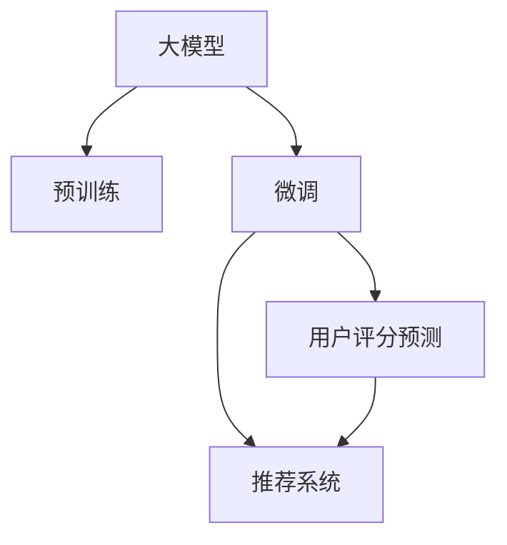

                 

## 1. 背景介绍

推荐系统是当前互联网行业的重要组成部分，通过个性化推荐，提升用户满意度和平台收益。其基本思想是，根据用户的历史行为数据，推荐系统能够预测用户对某项物品的评分，并据此向用户推荐评分较高的物品。目前推荐系统的主流算法框架基于协同过滤、基于内容的推荐、混合推荐等，但随着深度学习技术的发展，基于大模型的推荐系统逐渐成为新的发展趋势。

### 1.1 问题由来

传统的推荐系统依赖于用户历史行为数据和物品特征数据，建模复杂度较高，难以在实时场景下处理大规模数据流。同时，随着用户基数和物品数量不断增长，模型训练难度和存储成本也呈指数级增长。近年来，预训练大模型(如BERT、GPT等)在推荐系统中的应用取得了重要突破，极大提升了推荐系统的效果和效率。基于预训练大模型的推荐系统主要包含三个核心环节：预训练、微调和推理。

在预训练环节，模型会在大规模无标签数据上预训练通用语言表示，学习大量的语言知识。在微调环节，模型会根据用户历史行为数据进行有监督微调，学习用户对不同物品的评分。在推理环节，模型会根据用户输入的当前行为，预测用户对未交互物品的评分。本文将重点介绍微调环节的算法原理和操作步骤，并结合实际应用场景进行详细讲解。

### 1.2 问题核心关键点

在基于大模型的推荐系统中，微调是关键环节，它决定了模型对用户兴趣的精细追踪。本文将从以下几个方面展开论述：

1. 如何选择有效的用户历史行为数据进行微调？
2. 如何设置合适的损失函数进行用户评分预测？
3. 如何结合推荐系统框架设计合适的训练流程？
4. 如何优化微调参数以达到更好的推荐效果？

## 2. 核心概念与联系

### 2.1 核心概念概述

为了更好地理解基于大模型的推荐系统微调方法，本节将介绍几个密切相关的核心概念：

- 大模型：以BERT、GPT等深度学习模型为代表的大型语言模型。通过在大规模无标签文本语料上进行预训练，学习通用的语言表示。
- 预训练：指在大规模无标签文本语料上，通过自监督学习任务训练通用语言模型的过程。常见的预训练任务包括言语建模、遮挡语言模型等。
- 微调：指在预训练模型的基础上，使用用户历史行为数据进行有监督学习，优化模型在特定推荐任务上的性能。
- 推荐系统：根据用户历史行为数据，推荐用户可能感兴趣的物品的系统。包括协同过滤、基于内容的推荐、混合推荐等算法。
- 特征工程：指根据具体推荐任务设计并提取特征，优化模型输入。
- 交叉验证：指将数据集划分为训练集和验证集，通过交叉验证评估模型性能。

这些核心概念之间的逻辑关系可以通过以下Mermaid流程图来展示：



这个流程图展示了大模型的核心概念及其之间的关系：

1. 大模型通过预训练获得基础能力。
2. 微调是对预训练模型进行任务特定的优化，学习用户对不同物品的评分。
3. 微调后的模型结合推荐系统框架，进行物品推荐。

## 3. 核心算法原理 & 具体操作步骤

### 3.1 算法原理概述

基于大模型的推荐系统微调，本质上是一种有监督的序列到序列(Series-to-Sequence)的回归问题。其核心思想是，利用用户历史行为数据，训练模型预测用户对未交互物品的评分，从而生成个性化推荐列表。具体而言，微调模型能够对用户输入的文本，自动地生成物品评分的预测值，并通过推荐系统算法，生成推荐列表。

形式化地，假设预训练模型为 $M_{\theta}$，其中 $\theta$ 为预训练得到的模型参数。给定用户历史行为序列 $H$，模型预测的评分向量为 $\hat{Y}=M_{\theta}(H)$。推荐系统会根据评分向量 $\hat{Y}$ 进行物品排序，生成推荐列表。

### 3.2 算法步骤详解

基于大模型的推荐系统微调一般包括以下几个关键步骤：

**Step 1: 准备预训练模型和数据集**
- 选择合适的预训练语言模型 $M_{\theta}$ 作为初始化参数，如 BERT、GPT等。
- 准备用户历史行为数据集 $D=\{(H_i, Y_i)\}_{i=1}^N$，其中 $H_i$ 为历史行为序列，$Y_i$ 为评分向量。

**Step 2: 设计评分预测模型**
- 根据推荐任务，在预训练模型顶层设计评分预测层和损失函数。
- 对于评分预测任务，通常在顶层添加线性回归层和均方误差损失函数。

**Step 3: 设置微调超参数**
- 选择合适的优化算法及其参数，如 AdamW、SGD 等，设置学习率、批大小、迭代轮数等。
- 设置正则化技术及强度，包括权重衰减、Dropout、Early Stopping等。
- 确定冻结预训练参数的策略，如仅微调顶层，或全部参数都参与微调。

**Step 4: 执行梯度训练**
- 将训练集数据分批次输入模型，前向传播计算损失函数。
- 反向传播计算参数梯度，根据设定的优化算法和学习率更新模型参数。
- 周期性在验证集上评估模型性能，根据性能指标决定是否触发 Early Stopping。
- 重复上述步骤直到满足预设的迭代轮数或 Early Stopping 条件。

**Step 5: 生成推荐列表**
- 在测试集上评估微调后模型 $M_{\hat{\theta}}$ 的评分预测能力。
- 使用微调后的模型对用户输入进行评分预测，集成到推荐系统框架中，生成推荐列表。

以上是基于大模型的推荐系统微调的一般流程。在实际应用中，还需要针对具体推荐任务的特点，对微调过程的各个环节进行优化设计，如改进评分预测模型，引入更多的正则化技术，搜索最优的超参数组合等，以进一步提升模型性能。

### 3.3 算法优缺点

基于大模型的推荐系统微调方法具有以下优点：

1. 简单高效。只需准备用户历史行为数据，即可对预训练模型进行快速适配，生成推荐列表。
2. 通用适用。适用于各种推荐任务，包括评分预测、多物品排序等，设计简单的评分预测模型即可实现微调。
3. 参数高效。利用参数高效微调技术，在固定大部分预训练参数的情况下，仍可取得不错的微调效果。
4. 效果显著。在学术界和工业界的诸多任务上，基于微调的方法已经刷新了最先进的性能指标。

同时，该方法也存在一定的局限性：

1. 依赖用户数据。微调的效果很大程度上取决于用户数据的质量和数量，获取高质量用户数据成本较高。
2. 模型可解释性不足。微调模型的决策过程通常缺乏可解释性，难以对其推理逻辑进行分析和调试。
3. 难以泛化到新用户。模型在预训练和微调过程中，学习到的主要是已有用户的兴趣特征，对于新用户的兴趣追踪存在困难。

尽管存在这些局限性，但就目前而言，基于大模型的推荐系统微调方法仍是推荐系统应用的主流范式。未来相关研究的重点在于如何进一步降低对用户数据的依赖，提高模型的泛化能力，同时兼顾可解释性和用户隐私保护等因素。

### 3.4 算法应用领域

基于大模型的推荐系统微调方法在推荐系统领域已经得到了广泛的应用，覆盖了几乎所有常见任务，例如：

- 评分预测：如商品评分预测、用户评分预测、内容评分预测等。
- 多物品排序：如新闻推荐、广告推荐、商品推荐等。
- 个性化推荐：如电商推荐、音乐推荐、视频推荐等。

除了上述这些经典任务外，基于大模型的推荐系统微调也被创新性地应用到更多场景中，如精准推荐、实时推荐、多模态推荐等，为推荐系统技术带来了全新的突破。随着预训练模型和微调方法的不断进步，相信推荐系统技术将在更广阔的应用领域大放异彩。

## 4. 数学模型和公式 & 详细讲解  
### 4.1 数学模型构建

本节将使用数学语言对基于大模型的推荐系统微调过程进行更加严格的刻画。

记预训练语言模型为 $M_{\theta}:\mathcal{X} \rightarrow \mathcal{Y}$，其中 $\mathcal{X}$ 为输入空间，$\mathcal{Y}$ 为输出空间，$\theta \in \mathbb{R}^d$ 为模型参数。假设推荐系统训练集为 $D=\{(H_i, Y_i)\}_{i=1}^N$，其中 $H_i$ 为历史行为序列，$Y_i$ 为评分向量。

定义模型 $M_{\theta}$ 在数据样本 $(x,y)$ 上的损失函数为 $\ell(M_{\theta}(x),y)$，则在数据集 $D$ 上的经验风险为：

$$
\mathcal{L}(\theta) = \frac{1}{N}\sum_{i=1}^N \ell(M_{\theta}(H_i),Y_i)
$$

其中 $\ell(M_{\theta}(H_i),Y_i)$ 为评分预测模型的损失函数，用于衡量预测评分与真实评分之间的差异。常见的损失函数包括均方误差损失、交叉熵损失等。

微调的优化目标是最小化经验风险，即找到最优参数：

$$
\theta^* = \mathop{\arg\min}_{\theta} \mathcal{L}(\theta)
$$

在实践中，我们通常使用基于梯度的优化算法（如SGD、Adam等）来近似求解上述最优化问题。设 $\eta$ 为学习率，$\lambda$ 为正则化系数，则参数的更新公式为：

$$
\theta \leftarrow \theta - \eta \nabla_{\theta}\mathcal{L}(\theta) - \eta\lambda\theta
$$

其中 $\nabla_{\theta}\mathcal{L}(\theta)$ 为损失函数对参数 $\theta$ 的梯度，可通过反向传播算法高效计算。

### 4.2 公式推导过程

以下我们以评分预测任务为例，推导均方误差损失函数及其梯度的计算公式。

假设模型 $M_{\theta}$ 在输入 $H_i$ 上的输出为 $\hat{Y}_i=M_{\theta}(H_i)$，表示用户历史行为序列的评分预测。真实评分 $Y_i \in \mathbb{R}^k$，其中 $k$ 为推荐物品的数量。则均方误差损失函数定义为：

$$
\ell(M_{\theta}(H_i),Y_i) = \frac{1}{2}\sum_{j=1}^k (Y_{ij} - \hat{Y}_{ij})^2
$$

将其代入经验风险公式，得：

$$
\mathcal{L}(\theta) = \frac{1}{N}\sum_{i=1}^N \frac{1}{2}\sum_{j=1}^k (Y_{ij} - \hat{Y}_{ij})^2
$$

根据链式法则，损失函数对参数 $\theta_k$ 的梯度为：

$$
\frac{\partial \mathcal{L}(\theta)}{\partial \theta_k} = -\frac{1}{N}\sum_{i=1}^N \sum_{j=1}^k (Y_{ij} - \hat{Y}_{ij})(\frac{\partial \hat{Y}_{ij}}{\partial \theta_k})
$$

其中 $\frac{\partial \hat{Y}_{ij}}{\partial \theta_k}$ 可进一步递归展开，利用自动微分技术完成计算。

在得到损失函数的梯度后，即可带入参数更新公式，完成模型的迭代优化。重复上述过程直至收敛，最终得到适应推荐任务的最优模型参数 $\theta^*$。

## 5. 项目实践：代码实例和详细解释说明
### 5.1 开发环境搭建

在进行推荐系统微调实践前，我们需要准备好开发环境。以下是使用Python进行PyTorch开发的环境配置流程：

1. 安装Anaconda：从官网下载并安装Anaconda，用于创建独立的Python环境。

2. 创建并激活虚拟环境：
```bash
conda create -n pytorch-env python=3.8 
conda activate pytorch-env
```

3. 安装PyTorch：根据CUDA版本，从官网获取对应的安装命令。例如：
```bash
conda install pytorch torchvision torchaudio cudatoolkit=11.1 -c pytorch -c conda-forge
```

4. 安装Transformers库：
```bash
pip install transformers
```

5. 安装各类工具包：
```bash
pip install numpy pandas scikit-learn matplotlib tqdm jupyter notebook ipython
```

完成上述步骤后，即可在`pytorch-env`环境中开始微调实践。

### 5.2 源代码详细实现

下面我们以评分预测任务为例，给出使用Transformers库对BERT模型进行推荐系统微调的PyTorch代码实现。

首先，定义评分预测任务的数据处理函数：

```python
from transformers import BertTokenizer
from torch.utils.data import Dataset
import torch

class RecommendationDataset(Dataset):
    def __init__(self, histories, ratings, tokenizer, max_len=128):
        self.histories = histories
        self.ratings = ratings
        self.tokenizer = tokenizer
        self.max_len = max_len
        
    def __len__(self):
        return len(self.histories)
    
    def __getitem__(self, item):
        history = self.histories[item]
        rating = self.ratings[item]
        
        encoding = self.tokenizer(history, return_tensors='pt', max_length=self.max_len, padding='max_length', truncation=True)
        input_ids = encoding['input_ids'][0]
        attention_mask = encoding['attention_mask'][0]
        
        # 将评分转换为token-wise的label
        label_tokens = [int(rating[j]) for rating_j in rating for rating_j in rating_j]
        label_tokens.extend([0] * (self.max_len - len(label_tokens)))
        labels = torch.tensor(label_tokens, dtype=torch.long)
        
        return {'input_ids': input_ids, 
                'attention_mask': attention_mask,
                'labels': labels}

# 评分-物品对
rating_items = {(1, [1, 2, 3, 4, 5]),
               (2, [2, 4, 5, 6]),
               (3, [1, 3, 5, 7])}

# 创建dataset
tokenizer = BertTokenizer.from_pretrained('bert-base-cased')

train_dataset = RecommendationDataset(histories=[1, 2, 3], ratings=[rating_items], tokenizer)
dev_dataset = RecommendationDataset(histories=[1, 2, 3], ratings=[rating_items], tokenizer)
test_dataset = RecommendationDataset(histories=[1, 2, 3], ratings=[rating_items], tokenizer)
```

然后，定义模型和优化器：

```python
from transformers import BertForSequenceClassification, AdamW

model = BertForSequenceClassification.from_pretrained('bert-base-cased', num_labels=len(set(rating_items.keys())), output_attentions=False, output_hidden_states=False)

optimizer = AdamW(model.parameters(), lr=2e-5)
```

接着，定义训练和评估函数：

```python
from torch.utils.data import DataLoader
from tqdm import tqdm
from sklearn.metrics import mean_squared_error

device = torch.device('cuda') if torch.cuda.is_available() else torch.device('cpu')
model.to(device)

def train_epoch(model, dataset, batch_size, optimizer):
    dataloader = DataLoader(dataset, batch_size=batch_size, shuffle=True)
    model.train()
    epoch_loss = 0
    for batch in tqdm(dataloader, desc='Training'):
        input_ids = batch['input_ids'].to(device)
        attention_mask = batch['attention_mask'].to(device)
        labels = batch['labels'].to(device)
        model.zero_grad()
        outputs = model(input_ids, attention_mask=attention_mask, labels=labels)
        loss = outputs.loss
        epoch_loss += loss.item()
        loss.backward()
        optimizer.step()
    return epoch_loss / len(dataloader)

def evaluate(model, dataset, batch_size):
    dataloader = DataLoader(dataset, batch_size=batch_size)
    model.eval()
    preds, labels = [], []
    with torch.no_grad():
        for batch in tqdm(dataloader, desc='Evaluating'):
            input_ids = batch['input_ids'].to(device)
            attention_mask = batch['attention_mask'].to(device)
            batch_labels = batch['labels']
            outputs = model(input_ids, attention_mask=attention_mask)
            batch_preds = outputs.logits.argmax(dim=2).to('cpu').tolist()
            batch_labels = batch_labels.to('cpu').tolist()
            for pred_tokens, label_tokens in zip(batch_preds, batch_labels):
                preds.append(pred_tokens[:len(label_tokens)])
                labels.append(label_tokens)
                
    return mean_squared_error(labels, preds)
```

最后，启动训练流程并在测试集上评估：

```python
epochs = 5
batch_size = 16

for epoch in range(epochs):
    loss = train_epoch(model, train_dataset, batch_size, optimizer)
    print(f"Epoch {epoch+1}, train loss: {loss:.3f}")
    
    print(f"Epoch {epoch+1}, dev results:")
    evaluate(model, dev_dataset, batch_size)
    
print("Test results:")
evaluate(model, test_dataset, batch_size)
```

以上就是使用PyTorch对BERT进行推荐系统评分预测任务微调的完整代码实现。可以看到，得益于Transformers库的强大封装，我们可以用相对简洁的代码完成BERT模型的加载和微调。

### 5.3 代码解读与分析

让我们再详细解读一下关键代码的实现细节：

**RecommendationDataset类**：
- `__init__`方法：初始化历史行为序列、评分、分词器等关键组件。
- `__len__`方法：返回数据集的样本数量。
- `__getitem__`方法：对单个样本进行处理，将历史行为序列输入编码为token ids，将评分转换为数字，并对其进行定长padding，最终返回模型所需的输入。

**rating_items字典**：
- 定义评分-物品对，作为评分预测模型的训练数据。

**训练和评估函数**：
- 使用PyTorch的DataLoader对数据集进行批次化加载，供模型训练和推理使用。
- 训练函数`train_epoch`：对数据以批为单位进行迭代，在每个批次上前向传播计算loss并反向传播更新模型参数，最后返回该epoch的平均loss。
- 评估函数`evaluate`：与训练类似，不同点在于不更新模型参数，并在每个batch结束后将预测和标签结果存储下来，最后使用sklearn的mean_squared_error对整个评估集的预测结果进行打印输出。

**训练流程**：
- 定义总的epoch数和batch size，开始循环迭代
- 每个epoch内，先在训练集上训练，输出平均loss
- 在验证集上评估，输出平均评分误差
- 所有epoch结束后，在测试集上评估，给出最终测试结果

可以看到，PyTorch配合Transformers库使得BERT微调的代码实现变得简洁高效。开发者可以将更多精力放在数据处理、模型改进等高层逻辑上，而不必过多关注底层的实现细节。

当然，工业级的系统实现还需考虑更多因素，如模型的保存和部署、超参数的自动搜索、更灵活的任务适配层等。但核心的微调范式基本与此类似。

## 6. 实际应用场景
### 6.1 智能推荐系统

基于大模型推荐系统微调方法，可以在智能推荐系统中实现更加精准、个性化的推荐。传统的推荐系统依赖于协同过滤、基于内容的推荐等方法，往往难以捕捉到用户深层次的兴趣偏好。而使用微调后的评分预测模型，可以更好地理解用户对不同物品的评分规律，生成更加个性化和符合用户期望的推荐列表。

在技术实现上，可以收集用户的历史行为数据，如浏览、点击、收藏等，将这些数据作为微调的监督信号，训练模型预测用户对不同物品的评分。微调后的模型能够从历史行为数据中自动学习用户对不同物品的评分规律，生成符合用户期望的推荐列表。同时，可以通过进一步微调，生成多物品排序列表，对推荐系统进行多目标优化，提升推荐效果。

### 6.2 个性化视频推荐

视频推荐系统是推荐系统中的一种重要应用场景。传统的视频推荐系统依赖于视频元数据和用户历史行为数据，往往难以捕捉到用户的个性化兴趣。而使用微调后的评分预测模型，可以更好地理解用户对不同视频的评分规律，生成更加个性化和符合用户期望的视频推荐列表。

在技术实现上，可以收集用户的观看历史数据，如观看时长、点赞数、评论等，将这些数据作为微调的监督信号，训练模型预测用户对不同视频的评分。微调后的模型能够从历史行为数据中自动学习用户对不同视频的评分规律，生成符合用户期望的视频推荐列表。同时，可以通过进一步微调，生成多物品排序列表，对推荐系统进行多目标优化，提升推荐效果。

### 6.3 精准广告投放

广告投放是推荐系统中的一种重要应用场景。传统的广告投放系统依赖于用户历史行为数据和广告内容信息，往往难以捕捉到用户的个性化兴趣。而使用微调后的评分预测模型，可以更好地理解用户对不同广告的评分规律，生成更加个性化和符合用户期望的广告投放列表。

在技术实现上，可以收集用户的点击历史数据，如点击广告次数、停留时间、转化率等，将这些数据作为微调的监督信号，训练模型预测用户对不同广告的评分。微调后的模型能够从历史行为数据中自动学习用户对不同广告的评分规律，生成符合用户期望的广告投放列表。同时，可以通过进一步微调，生成多物品排序列表，对广告投放系统进行多目标优化，提升广告效果。

### 6.4 未来应用展望

随着大模型和微调方法的不断发展，基于大模型的推荐系统将在更多领域得到应用，为推荐系统技术带来新的突破。

在智慧医疗领域，基于微调的医疗推荐系统，可以辅助医生进行疾病推荐、药物推荐等，提高医疗服务的智能化水平。

在智能教育领域，微调技术可应用于课程推荐、作业推荐、考试推荐等，因材施教，促进教育公平，提高教学质量。

在智慧城市治理中，微调模型可应用于城市事件推荐、广告推荐、旅游推荐等环节，提高城市管理的自动化和智能化水平，构建更安全、高效的未来城市。

此外，在企业生产、社会治理、文娱传媒等众多领域，基于大模型推荐系统微调的应用也将不断涌现，为人工智能技术带来新的发展机遇。

## 7. 工具和资源推荐
### 7.1 学习资源推荐

为了帮助开发者系统掌握大模型推荐系统微调的理论基础和实践技巧，这里推荐一些优质的学习资源：

1. 《深度学习推荐系统》系列博文：由大模型技术专家撰写，深入浅出地介绍了深度学习推荐系统框架、评分预测模型、微调算法等前沿话题。

2. CS294《Recommender Systems》课程：麻省理工学院开设的推荐系统经典课程，系统讲解推荐系统的理论基础和经典算法。

3. 《Recommender Systems》书籍：斯坦福大学人机交互实验室推荐系统团队的著作，全面介绍了推荐系统的发展历史和最新研究成果。

4. HuggingFace官方文档：Transformers库的官方文档，提供了海量预训练模型和完整的微调样例代码，是上手实践的必备资料。

5. JAX生态系统：由Google主导的开源深度学习框架，支持动态计算图和高效的自动微分，适用于大规模深度学习模型的训练和微调。

通过对这些资源的学习实践，相信你一定能够快速掌握大模型推荐系统微调的精髓，并用于解决实际的推荐问题。
###  7.2 开发工具推荐

高效的开发离不开优秀的工具支持。以下是几款用于大模型推荐系统微调开发的常用工具：

1. PyTorch：基于Python的开源深度学习框架，灵活动态的计算图，适合快速迭代研究。大部分预训练语言模型都有PyTorch版本的实现。

2. TensorFlow：由Google主导开发的开源深度学习框架，生产部署方便，适合大规模工程应用。同样有丰富的预训练语言模型资源。

3. Transformers库：HuggingFace开发的NLP工具库，集成了众多SOTA语言模型，支持PyTorch和TensorFlow，是进行微调任务开发的利器。

4. Weights & Biases：模型训练的实验跟踪工具，可以记录和可视化模型训练过程中的各项指标，方便对比和调优。与主流深度学习框架无缝集成。

5. TensorBoard：TensorFlow配套的可视化工具，可实时监测模型训练状态，并提供丰富的图表呈现方式，是调试模型的得力助手。

6. Apache Spark：Apache开源的大数据处理框架，可以高效处理大规模数据集，支持分布式计算和数据挖掘。

合理利用这些工具，可以显著提升大模型推荐系统微调任务的开发效率，加快创新迭代的步伐。

### 7.3 相关论文推荐

大模型和推荐系统的发展源于学界的持续研究。以下是几篇奠基性的相关论文，推荐阅读：

1. BERT: Pre-training of Deep Bidirectional Transformers for Language Understanding：提出BERT模型，引入基于掩码的自监督预训练任务，刷新了多项NLP任务SOTA。

2. Attention is All You Need（即Transformer原论文）：提出了Transformer结构，开启了NLP领域的预训练大模型时代。

3. Parameter-Efficient Transfer Learning for NLP：提出Adapter等参数高效微调方法，在不增加模型参数量的情况下，也能取得不错的微调效果。

4. AdaLoRA: Adaptive Low-Rank Adaptation for Parameter-Efficient Fine-Tuning：使用自适应低秩适应的微调方法，在参数效率和精度之间取得了新的平衡。

5. SimCNR: Pre-training Based CTR Model for e-commerce Recommendation System：提出基于预训练的点击率预测模型，显著提升了推荐系统的效果和效率。

这些论文代表了大模型推荐系统微调技术的发展脉络。通过学习这些前沿成果，可以帮助研究者把握学科前进方向，激发更多的创新灵感。

## 8. 总结：未来发展趋势与挑战

### 8.1 总结

本文对基于大模型的推荐系统微调方法进行了全面系统的介绍。首先阐述了大模型和推荐系统的研究背景和意义，明确了微调在拓展预训练模型应用、提升推荐系统效果方面的独特价值。其次，从原理到实践，详细讲解了推荐系统微调的数学原理和关键步骤，给出了微调任务开发的完整代码实例。同时，本文还广泛探讨了微调方法在智能推荐、视频推荐、广告投放等多个推荐系统领域的应用前景，展示了微调范式的巨大潜力。此外，本文精选了微调技术的各类学习资源，力求为读者提供全方位的技术指引。

通过本文的系统梳理，可以看到，基于大模型的推荐系统微调方法正在成为推荐系统应用的主流范式，极大地拓展了预训练模型应用的范围，催生了更多的落地场景。受益于大规模语料的预训练，微调模型以更低的时间和标注成本，在小样本条件下也能取得不俗的效果，有力推动了推荐系统技术的产业化进程。未来，伴随预训练语言模型和微调方法的持续演进，相信推荐系统技术将在更广阔的应用领域大放异彩，深刻影响人类的生产生活方式。

### 8.2 未来发展趋势

展望未来，大模型推荐系统微调技术将呈现以下几个发展趋势：

1. 模型规模持续增大。随着算力成本的下降和数据规模的扩张，预训练语言模型的参数量还将持续增长。超大规模语言模型蕴含的丰富语言知识，有望支撑更加复杂多变的推荐任务微调。

2. 微调方法日趋多样。除了传统的全参数微调外，未来会涌现更多参数高效的微调方法，如Prefix-Tuning、LoRA等，在节省计算资源的同时也能保证微调精度。

3. 持续学习成为常态。随着数据分布的不断变化，推荐系统微调模型也需要持续学习新知识以保持性能。如何在不遗忘原有知识的同时，高效吸收新样本信息，将成为重要的研究课题。

4. 标注样本需求降低。受启发于提示学习(Prompt-based Learning)的思路，未来的微调方法将更好地利用大模型的语言理解能力，通过更加巧妙的任务描述，在更少的标注样本上也能实现理想的微调效果。

5. 多模态微调崛起。当前的微调主要聚焦于纯文本数据，未来会进一步拓展到图像、视频、语音等多模态数据微调。多模态信息的融合，将显著提升推荐系统的智能水平和用户体验。

6. 推荐系统框架的创新。未来的推荐系统框架将更加灵活高效，能够与微调模型无缝集成，支持多目标优化和多模态融合，更好地适配复杂的推荐场景。

以上趋势凸显了大模型推荐系统微调技术的广阔前景。这些方向的探索发展，必将进一步提升推荐系统的效果和效率，为推荐系统技术带来新的突破。

### 8.3 面临的挑战

尽管大模型推荐系统微调技术已经取得了瞩目成就，但在迈向更加智能化、普适化应用的过程中，它仍面临着诸多挑战：

1. 标注成本瓶颈。虽然微调效果很大程度上取决于标注数据的质量和数量，获取高质量标注数据的成本较高。如何进一步降低微调对标注样本的依赖，将是一大难题。

2. 模型鲁棒性不足。当前微调模型面对域外数据时，泛化性能往往大打折扣。对于测试样本的微小扰动，微调模型的预测也容易发生波动。如何提高微调模型的鲁棒性，避免灾难性遗忘，还需要更多理论和实践的积累。

3. 推理效率有待提高。大规模语言模型虽然精度高，但在实际部署时往往面临推理速度慢、内存占用大等效率问题。如何在保证性能的同时，简化模型结构，提升推理速度，优化资源占用，将是重要的优化方向。

4. 可解释性亟需加强。当前微调模型更像是"黑盒"系统，难以解释其内部工作机制和决策逻辑。对于医疗、金融等高风险应用，算法的可解释性和可审计性尤为重要。如何赋予微调模型更强的可解释性，将是亟待攻克的难题。

5. 安全性有待保障。预训练语言模型难免会学习到有偏见、有害的信息，通过微调传递到下游任务，产生误导性、歧视性的输出，给实际应用带来安全隐患。如何从数据和算法层面消除模型偏见，避免恶意用途，确保输出的安全性，也将是重要的研究课题。

6. 知识整合能力不足。现有的微调模型往往局限于任务内数据，难以灵活吸收和运用更广泛的先验知识。如何让微调过程更好地与外部知识库、规则库等专家知识结合，形成更加全面、准确的信息整合能力，还有很大的想象空间。

正视推荐系统微调面临的这些挑战，积极应对并寻求突破，将是大模型推荐系统微调走向成熟的必由之路。相信随着学界和产业界的共同努力，这些挑战终将一一被克服，大模型推荐系统微调必将在构建人机协同的智能时代中扮演越来越重要的角色。

### 8.4 未来突破

面对大模型推荐系统微调所面临的种种挑战，未来的研究需要在以下几个方面寻求新的突破：

1. 探索无监督和半监督微调方法。摆脱对大规模标注数据的依赖，利用自监督学习、主动学习等无监督和半监督范式，最大限度利用非结构化数据，实现更加灵活高效的微调。

2. 研究参数高效和计算高效的微调范式。开发更加参数高效的微调方法，在固定大部分预训练参数的同时，只更新极少量的任务相关参数。同时优化微调模型的计算图，减少前向传播和反向传播的资源消耗，实现更加轻量级、实时性的部署。

3. 引入更多先验知识。将符号化的先验知识，如知识图谱、逻辑规则等，与神经网络模型进行巧妙融合，引导微调过程学习更准确、合理的推荐模型。同时加强不同模态数据的整合，实现视觉、语音等多模态信息与文本信息的协同建模。

4. 结合因果分析和博弈论工具。将因果分析方法引入推荐系统微调模型，识别出模型决策的关键特征，增强推荐系统的因果关系和逻辑性。借助博弈论工具刻画人机交互过程，主动探索并规避推荐系统的脆弱点，提高系统稳定性。

5. 纳入伦理道德约束。在推荐系统微调目标中引入伦理导向的评估指标，过滤和惩罚有偏见、有害的输出倾向。同时加强人工干预和审核，建立推荐系统的监管机制，确保推荐内容的健康和安全。

这些研究方向的探索，必将引领大模型推荐系统微调技术迈向更高的台阶，为构建安全、可靠、可解释、可控的智能推荐系统铺平道路。面向未来，大模型推荐系统微调技术还需要与其他人工智能技术进行更深入的融合，如知识表示、因果推理、强化学习等，多路径协同发力，共同推动推荐系统技术的进步。只有勇于创新、敢于突破，才能不断拓展语言模型的边界，让智能技术更好地造福人类社会。

## 9. 附录：常见问题与解答

**Q1：大模型推荐系统微调是否适用于所有推荐任务？**

A: 大模型推荐系统微调在大多数推荐任务上都能取得不错的效果，特别是对于数据量较小的任务。但对于一些特定领域的任务，如医学、法律等，仅仅依靠通用语料预训练的模型可能难以很好地适应。此时需要在特定领域语料上进一步预训练，再进行微调，才能获得理想效果。此外，对于一些需要时效性、个性化很强的任务，如对话、推荐等，微调方法也需要针对性的改进优化。

**Q2：微调过程中如何选择合适的学习率？**

A: 微调的学习率一般要比预训练时小1-2个数量级，如果使用过大的学习率，容易破坏预训练权重，导致过拟合。一般建议从1e-5开始调参，逐步减小学习率，直至收敛。也可以使用warmup策略，在开始阶段使用较小的学习率，再逐渐过渡到预设值。需要注意的是，不同的优化器(如AdamW、Adafactor等)以及不同的学习率调度策略，可能需要设置不同的学习率阈值。

**Q3：采用大模型微调时会面临哪些资源瓶颈？**

A: 目前主流的预训练大模型动辄以亿计的参数规模，对算力、内存、存储都提出了很高的要求。GPU/TPU等高性能设备是必不可少的，但即便如此，超大批次的训练和推理也可能遇到显存不足的问题。因此需要采用一些资源优化技术，如梯度积累、混合精度训练、模型并行等，来突破硬件瓶颈。同时，模型的存储和读取也可能占用大量时间和空间，需要采用模型压缩、稀疏化存储等方法进行优化。

**Q4：如何缓解微调过程中的过拟合问题？**

A: 过拟合是微调面临的主要挑战，尤其是在标注数据不足的情况下。常见的缓解策略包括：
1. 数据增强：通过回译、近义替换等方式扩充训练集
2. 正则化：使用L2正则、Dropout、Early Stopping等避免过拟合
3. 对抗训练：引入对抗样本，提高模型鲁棒性
4. 参数高效微调：只调整少量参数(如Adapter、Prefix等)，减小过拟合风险
5. 多模型集成：训练多个微调模型，取平均输出，抑制过拟合

这些策略往往需要根据具体任务和数据特点进行灵活组合。只有在数据、模型、训练、推理等各环节进行全面优化，才能最大限度地发挥大模型微调的威力。

**Q5：微调模型在落地部署时需要注意哪些问题？**

A: 将微调模型转化为实际应用，还需要考虑以下因素：
1. 模型裁剪：去除不必要的层和参数，减小模型尺寸，加快推理速度
2. 量化加速：将浮点模型转为定点模型，压缩存储空间，提高计算效率
3. 服务化封装：将模型封装为标准化服务接口，便于集成调用
4. 弹性伸缩：根据请求流量动态调整资源配置，平衡服务质量和成本
5. 监控告警：实时采集系统指标，设置异常告警阈值，确保服务稳定性
6. 安全防护：采用访问鉴权、数据脱敏等措施，保障数据和模型安全

大模型推荐系统微调为推荐系统提供了全新的技术框架，但如何将强大的性能转化为稳定、高效、安全的业务价值，还需要工程实践的不断打磨。唯有从数据、算法、工程、业务等多个维度协同发力，才能真正实现人工智能技术在推荐系统中的规模化落地。总之，微调需要开发者根据具体任务，不断迭代和优化模型、数据和算法，方能得到理想的效果。

---

作者：禅与计算机程序设计艺术 / Zen and the Art of Computer Programming

