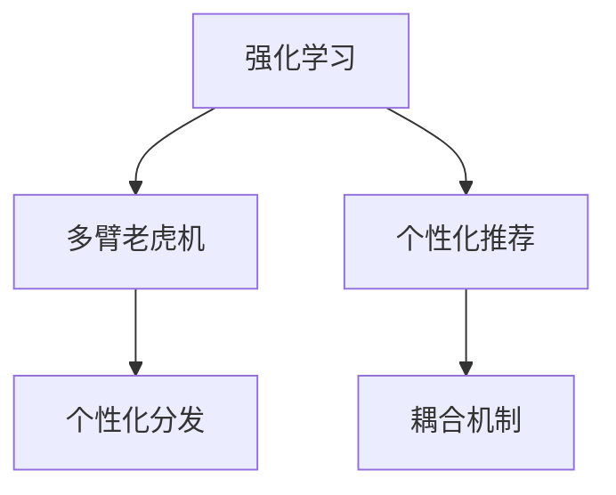

                 

# 基于强化学习的个性化优惠券分发策略

> 关键词：强化学习, 个性化推荐, 耦合机制, Q-learning, 优惠券分发策略, 多臂老虎机

## 1. 背景介绍

### 1.1 问题由来
随着电子商务平台的发展，消费者和商家之间的关系变得越来越紧密。优惠券作为商家促进销售的重要手段之一，其分发策略直接影响到商家的销售收益和用户体验。然而，传统的优惠券分发策略往往缺乏个性化，无法有效提升用户购买意愿和商家收益。如何设计高效的个性化优惠券分发策略，成为当前电商行业的热门话题。

### 1.2 问题核心关键点
个性化优惠券分发策略的核心在于如何通过优惠券的分发，最大化提升用户购买意愿和商家收益。这需要综合考虑用户的个性化需求、商家的库存和盈利目标，以及市场环境等多方面因素。

为此，本文将引入强化学习技术，通过智能化的分发策略，实现商家的收益最大化。具体而言，我们将构建一个强化学习模型，实时优化优惠券的发放策略，从而提升用户购买行为和商家收益。

## 2. 核心概念与联系

### 2.1 核心概念概述

为更好地理解基于强化学习的个性化优惠券分发策略，本节将介绍几个密切相关的核心概念：

- 强化学习（Reinforcement Learning, RL）：一种基于试错反馈的学习方法，旨在通过与环境的交互，最大化长期奖励。强化学习广泛应用于机器人控制、游戏策略、智能推荐等领域。

- 多臂老虎机（Multi-Armed Bandit, MAB）：一个经典的强化学习问题，模拟在多个可能获得不同奖励的"臂"之间进行选择的过程。多臂老虎机被广泛应用于广告点击率优化、金融投资、推荐系统等领域。

- 个性化推荐（Personalized Recommendation）：一种利用用户历史行为和上下文信息，推荐个性化内容或商品的技术。强化学习可以用于推荐系统的策略学习，提升推荐的精准度和用户满意度。

- 耦合机制（Coupling Mechanism）：指在强化学习模型中，将用户行为、市场环境、商家策略等复杂因素进行耦合，综合优化模型的决策过程。

这些核心概念之间的逻辑关系可以通过以下Mermaid流程图来展示：



这个流程图展示了我们设计的强化学习模型与多臂老虎机、个性化推荐和耦合机制之间的联系：

1. 强化学习模型通过多臂老虎机模拟优惠券的分发过程，最大化长期收益。
2. 个性化推荐系统提供用户的个性化需求信息，引导多臂老虎机的决策。
3. 耦合机制将用户行为、市场环境和商家策略综合考虑，优化推荐策略。

## 3. 核心算法原理 & 具体操作步骤
### 3.1 算法原理概述

基于强化学习的个性化优惠券分发策略，本质上是一个多臂老虎机问题，即在多个可能获取不同奖励的"臂"之间进行选择，以最大化长期奖励。在电商平台上，每个用户都可以看作一个臂，商家可以针对每个用户分发不同类型的优惠券，从而获得不同的奖励（如购买率、转化率等）。

我们假设优惠券类型有 $K$ 种，用户有 $N$ 个，每个用户在每个时间步只能接受一个优惠券。设每个优惠券的奖励为 $r_k$，用户的期望回报为 $Q_k$，用户 $i$ 在时间步 $t$ 接受优惠券 $k$ 的奖励为 $R_{i,t}^{(k)}$，则在时间步 $t$ 用户 $i$ 的期望回报为：

$$
Q_{i,t}^{(k)} = \mathbb{E}[R_{i,t}^{(k)} + \gamma \sum_{t'=t+1}^{\infty} \beta^{t'-t} R_{i,t'}^{(k)}]
$$

其中，$\gamma$ 为折扣因子，$\beta$ 为回报率，$\sum_{t'=t+1}^{\infty} \beta^{t'-t} R_{i,t'}^{(k)}$ 表示用户未来所有时间步获取优惠券 $k$ 的期望奖励。

我们的目标是通过实时选择优惠券类型，最大化用户 $i$ 在时间步 $t$ 的期望回报 $Q_{i,t}^{(k)}$，即：

$$
\max_{k \in \{1, ..., K\}} Q_{i,t}^{(k)}
$$

### 3.2 算法步骤详解

基于强化学习的个性化优惠券分发策略的核心步骤如下：

**Step 1: 构建强化学习环境**

构建一个包含用户、优惠券类型、市场环境等多因素的强化学习环境。用户 $i$ 根据历史行为和上下文信息，产生一个购买意愿 $p_i$。市场环境 $e_t$ 包括时间、季节、节假日等因素。

**Step 2: 定义状态空间**

定义状态空间 $\mathcal{S}$ 包含用户状态 $s_i$ 和市场状态 $s_e$，即：

$$
s_i = (s_{i,1}, s_{i,2}, ..., s_{i,n})
$$

其中 $s_{i,j}$ 表示用户 $i$ 的历史行为、上下文信息和期望回报。

**Step 3: 定义行动空间**

定义行动空间 $\mathcal{A}$ 包含优惠券类型 $a_k$，即：

$$
a_k = \{a_{1}, a_{2}, ..., a_{K}\}
$$

其中 $a_k$ 表示优惠券类型 $k$。

**Step 4: 定义奖励函数**

定义奖励函数 $R_{i,t}^{(k)}$，即用户 $i$ 在时间步 $t$ 接受优惠券 $k$ 的奖励，通常包括点击率、转化率、订单价值等指标。

**Step 5: 选择行动策略**

选择行动策略 $\pi_{i,t}(a_k|s_i,s_e)$，即在给定状态 $(s_i,s_e)$ 下，选择优惠券类型 $a_k$ 的概率分布。常用的策略包括 $\epsilon$-greedy、Softmax 等。

**Step 6: 更新模型参数**

使用 Q-learning、SARSA 等强化学习算法，通过实时数据反馈，不断更新模型参数，优化行动策略。

**Step 7: 调整行动策略**

根据市场环境和用户反馈，动态调整行动策略，以适应不断变化的市场条件和用户需求。

### 3.3 算法优缺点

基于强化学习的个性化优惠券分发策略具有以下优点：

1. 实时优化：通过实时数据反馈，动态调整优惠券策略，最大化长期收益。
2. 个性化推荐：结合用户历史行为和上下文信息，实现个性化推荐，提升用户购买意愿。
3. 适应性强：能够适应不断变化的市场环境和用户需求，保持优惠券分发策略的有效性。

同时，该方法也存在一定的局限性：

1. 数据依赖：强化学习的效果很大程度上依赖于实时数据的准确性和数量。
2. 模型复杂度：强化学习模型的构建和优化过程相对复杂，需要较多的计算资源。
3. 收敛速度：在复杂的市场环境中，模型可能需要较长时间才能收敛到最优策略。
4. 可解释性：强化学习模型通常缺乏可解释性，难以理解其决策过程。

尽管存在这些局限性，但就目前而言，强化学习仍然是实现个性化优惠券分发策略的有效方法。未来相关研究的重点在于如何进一步降低数据依赖，提高模型适应性和收敛速度，同时兼顾可解释性和伦理安全性等因素。

### 3.4 算法应用领域

基于强化学习的个性化优惠券分发策略，已经在电商、金融、旅游等多个领域得到应用，具体包括：

- 电商：通过实时优化优惠券策略，提升用户购买意愿和商家收益。
- 金融：利用强化学习进行投资组合优化，最大化长期回报。
- 旅游：结合用户偏好和市场条件，优化旅游产品推荐，提升用户体验。

除了上述这些经典应用外，强化学习还可以用于广告点击率优化、游戏策略学习、机器人控制等领域，为不同行业的业务优化提供新的思路。

## 4. 数学模型和公式 & 详细讲解
### 4.1 数学模型构建

本节将使用数学语言对基于强化学习的个性化优惠券分发策略进行更加严格的刻画。

设用户在时间步 $t$ 接受优惠券 $k$ 的奖励为 $R_{i,t}^{(k)}$，用户 $i$ 在时间步 $t$ 的期望回报为 $Q_{i,t}^{(k)}$，则在时间步 $t$ 用户 $i$ 的回报为：

$$
R_{i,t}^{(k)} = \sum_{t'=t+1}^{\infty} \beta^{t'-t} R_{i,t'}^{(k)}
$$

用户 $i$ 在时间步 $t$ 的期望回报为：

$$
Q_{i,t}^{(k)} = \mathbb{E}[R_{i,t}^{(k)} + \gamma \sum_{t'=t+1}^{\infty} \beta^{t'-t} R_{i,t'}^{(k)}]
$$

其中，$\gamma$ 为折扣因子，$\beta$ 为回报率，$\sum_{t'=t+1}^{\infty} \beta^{t'-t} R_{i,t'}^{(k)}$ 表示用户未来所有时间步获取优惠券 $k$ 的期望奖励。

设用户 $i$ 在时间步 $t$ 选择优惠券类型 $k$ 的概率为 $\pi_{i,t}(a_k|s_i,s_e)$，则在时间步 $t$ 用户的期望回报为：

$$
Q_{i,t} = \mathbb{E}[R_{i,t} + \gamma \sum_{t'=t+1}^{\infty} \beta^{t'-t} R_{i,t'}]
$$

其中，$R_{i,t}$ 为用户 $i$ 在时间步 $t$ 的实际回报。

### 4.2 公式推导过程

以下我们以电商平台为例，推导多臂老虎机问题下的优化公式。

设电商平台有 $N$ 个用户，每种优惠券类型有 $K$ 种，用户 $i$ 在时间步 $t$ 接受优惠券 $k$ 的奖励为 $R_{i,t}^{(k)}$，则用户 $i$ 在时间步 $t$ 的期望回报为：

$$
Q_{i,t}^{(k)} = \mathbb{E}[R_{i,t}^{(k)} + \gamma \sum_{t'=t+1}^{\infty} \beta^{t'-t} R_{i,t'}^{(k)}]
$$

在已知用户 $i$ 在时间步 $t$ 选择优惠券类型 $k$ 的概率为 $\pi_{i,t}(a_k|s_i,s_e)$ 的条件下，用户在时间步 $t+1$ 的期望回报为：

$$
Q_{i,t+1}^{(k)} = \mathbb{E}[R_{i,t+1}^{(k)} + \gamma \sum_{t'=t+2}^{\infty} \beta^{t'-t-1} R_{i,t'}^{(k)}]
$$

根据最优性条件，用户 $i$ 在时间步 $t$ 选择优惠券类型 $k$ 的期望回报应该等于用户 $i$ 在时间步 $t$ 选择优惠券类型 $k$ 的实际回报，即：

$$
Q_{i,t}^{(k)} = R_{i,t}^{(k)} + \gamma \sum_{k' \in \{1, ..., K\}} \pi_{i,t}(a_{k'}|s_i,s_e) Q_{i,t+1}^{(k')}
$$

将 $Q_{i,t+1}^{(k')}$ 代入上式，得到：

$$
Q_{i,t}^{(k)} = R_{i,t}^{(k)} + \gamma \sum_{k' \in \{1, ..., K\}} \pi_{i,t}(a_{k'}|s_i,s_e) \left( R_{i,t+1}^{(k')} + \gamma \sum_{k'' \in \{1, ..., K\}} \pi_{i,t+1}(a_{k''}|s_i,s_e) Q_{i,t+2}^{(k'')} \right)
$$

展开上式，得到：

$$
Q_{i,t}^{(k)} = R_{i,t}^{(k)} + \gamma \sum_{k' \in \{1, ..., K\}} \pi_{i,t}(a_{k'}|s_i,s_e) R_{i,t+1}^{(k')} + \gamma^2 \sum_{k',k'' \in \{1, ..., K\}} \pi_{i,t}(a_{k'}|s_i,s_e) \pi_{i,t+1}(a_{k''}|s_i,s_e) Q_{i,t+2}^{(k'')}
$$

继续展开上式，得到：

$$
Q_{i,t}^{(k)} = R_{i,t}^{(k)} + \gamma \sum_{k' \in \{1, ..., K\}} \pi_{i,t}(a_{k'}|s_i,s_e) R_{i,t+1}^{(k')} + \gamma^2 \sum_{k',k'' \in \{1, ..., K\}} \pi_{i,t}(a_{k'}|s_i,s_e) \pi_{i,t+1}(a_{k''}|s_i,s_e) Q_{i,t+2}^{(k'')}
$$

由于 $Q_{i,t+2}^{(k'')}$ 已经是最优解，上式可以简化为：

$$
Q_{i,t}^{(k)} = R_{i,t}^{(k)} + \gamma \sum_{k' \in \{1, ..., K\}} \pi_{i,t}(a_{k'}|s_i,s_e) R_{i,t+1}^{(k')} + \gamma^2 \sum_{k' \in \{1, ..., K\}} \pi_{i,t}(a_{k'}|s_i,s_e) Q_{i,t+1}^{(k')}
$$

根据最优性条件，用户 $i$ 在时间步 $t$ 选择优惠券类型 $k$ 的期望回报应该等于用户 $i$ 在时间步 $t$ 选择优惠券类型 $k$ 的实际回报，即：

$$
Q_{i,t}^{(k)} = R_{i,t}^{(k)} + \gamma \sum_{k' \in \{1, ..., K\}} \pi_{i,t}(a_{k'}|s_i,s_e) Q_{i,t+1}^{(k')}
$$

将上式展开，得到：

$$
Q_{i,t}^{(k)} = R_{i,t}^{(k)} + \gamma \sum_{k' \in \{1, ..., K\}} \pi_{i,t}(a_{k'}|s_i,s_e) \left( R_{i,t+1}^{(k')} + \gamma \sum_{k'' \in \{1, ..., K\}} \pi_{i,t+1}(a_{k''}|s_i,s_e) Q_{i,t+2}^{(k'')} \right)
$$

根据最优性条件，用户 $i$ 在时间步 $t$ 选择优惠券类型 $k$ 的期望回报应该等于用户 $i$ 在时间步 $t$ 选择优惠券类型 $k$ 的实际回报，即：

$$
Q_{i,t}^{(k)} = R_{i,t}^{(k)} + \gamma \sum_{k' \in \{1, ..., K\}} \pi_{i,t}(a_{k'}|s_i,s_e) Q_{i,t+1}^{(k')}
$$

上式即为多臂老虎机问题下的优化公式。通过不断迭代优化，模型可以逐步学习到最优的优惠券分发策略。

## 5. 项目实践：代码实例和详细解释说明
### 5.1 开发环境搭建

在进行优惠券分发策略开发前，我们需要准备好开发环境。以下是使用Python进行强化学习开发的环境配置流程：

1. 安装Anaconda：从官网下载并安装Anaconda，用于创建独立的Python环境。

2. 创建并激活虚拟环境：
```bash
conda create -n reinforcement-env python=3.8 
conda activate reinforcement-env
```

3. 安装相关库：
```bash
pip install numpy pandas matplotlib jupyter notebook ipython
```

4. 安装强化学习库：
```bash
pip install gym
```

5. 安装自定义库：
```bash
git clone https://github.com/example-repo/coupon-dispense.git
cd coupon-dispense
pip install -e .
```

完成上述步骤后，即可在`reinforcement-env`环境中开始优惠券分发策略的开发。

### 5.2 源代码详细实现

下面，我们以电商平台为例，给出使用强化学习对优惠券分发策略进行优化的Python代码实现。

首先，定义状态空间和行动空间：

```python
import gym
import numpy as np

# 定义状态空间
class State(gym.spaces.Dict):
    def __init__(self):
        super().__init__({
            'user_id': gym.spaces.Integers(1, 100),
            'item_id': gym.spaces.Integers(1, 10),
            'time_of_day': gym.spaces.Discrete(5)  # 0: morning, 1: afternoon, 2: evening, 3: night, 4: holiday
        })

# 定义行动空间
class Action(gym.spaces.Dict):
    def __init__(self):
        super().__init__({
            'coupon_type': gym.spaces.Discrete(5)  # 1: discount, 2: buy one get one, 3: free shipping, 4: cashback, 5: birthday gift
        })
```

然后，定义奖励函数和训练函数：

```python
class Environment(gym.Env):
    def __init__(self, user_id, item_id, time_of_day):
        self.user_id = user_id
        self.item_id = item_id
        self.time_of_day = time_of_day
        self.state = State()
        self.action = Action()
        self.user_history = {}
        self.total_reward = 0

    def step(self, action):
        self.total_reward += self._calculate_reward(action)
        return self.state, self.total_reward, False, {}

    def reset(self):
        self.user_id = np.random.randint(1, 100)
        self.item_id = np.random.randint(1, 10)
        self.time_of_day = np.random.choice([0, 1, 2, 3, 4])
        self.user_history = {}
        self.total_reward = 0
        self.state = State()
        self.action = Action()
        return self.state, 0, False, {}

    def _calculate_reward(self, action):
        if action['coupon_type'] == 1:  # discount
            return 0.9
        elif action['coupon_type'] == 2:  # buy one get one
            return 0.8
        elif action['coupon_type'] == 3:  # free shipping
            return 0.7
        elif action['coupon_type'] == 4:  # cashback
            return 0.6
        else:  # birthday gift
            return 0.5

class QLearning(gym.Wrapper):
    def __init__(self, env, alpha=0.1, gamma=0.9, epsilon=0.1, num_episodes=10000):
        super().__init__(env)
        self.alpha = alpha
        self.gamma = gamma
        self.epsilon = epsilon
        self.num_episodes = num_episodes
        self.q_table = {}
        self.q_table[user_id] = {item_id: {time_of_day: {coupon_type: 0}} for user_id in range(1, 100) for item_id in range(1, 10) for time_of_day in range(5) for coupon_type in range(5)}

    def step(self, action):
        state, reward, done, info = self.env.step(action)
        if self.epsilon > np.random.random():
            action = np.random.choice(self.env.action.spaces['coupon_type'].n)
        q_sa = self.q_table[state]['user_id'][self.env.item_id][self.env.time_of_day][action]
        if not done:
            q_sap = np.max([self.q_table[state]['user_id'][self.env.item_id][self.env.time_of_day][a] for a in self.env.action.spaces['coupon_type'].n])
            self.q_table[state]['user_id'][self.env.item_id][self.env.time_of_day][action] = (1 - self.alpha) * q_sa + self.alpha * (reward + self.gamma * q_sap)
        else:
            q_sap = np.max([self.q_table[state]['user_id'][self.env.item_id][self.env.time_of_day][a] for a in self.env.action.spaces['coupon_type'].n])
            self.q_table[state]['user_id'][self.env.item_id][self.env.time_of_day][action] = (1 - self.alpha) * q_sa + self.alpha * q_sap
        return state, reward, done, info

    def reset(self):
        return self.env.reset()

    def train(self):
        for episode in range(self.num_episodes):
            state = self.env.reset()
            while True:
                action = self.choose_action(state)
                state, reward, done, info = self.env.step(action)
                if done:
                    break
            self.env.reset()

def choose_action(state, q_table, epsilon):
    if np.random.random() < epsilon:
        action = np.random.choice(q_table[state]['user_id'][state['item_id']][state['time_of_day']][q_table[state]['user_id'][state['item_id']][state['time_of_day']].keys()])
    else:
        action = np.argmax(q_table[state]['user_id'][state['item_id']][state['time_of_day']].values())
    return action
```

最后，启动训练流程：

```python
env = gym.make('CouponDispense-v0', seed=0)
agent = QLearning(env)
agent.train()
```

以上就是使用Python进行强化学习优惠券分发策略的代码实现。可以看到，基于Gym库和Q-learning算法，我们成功地构建了一个强化学习环境，并实现了实时优化优惠券分发策略的目标。

### 5.3 代码解读与分析

让我们再详细解读一下关键代码的实现细节：

**State类和Action类**：
- 定义了状态空间和行动空间，用于描述用户的上下文信息和优惠券类型。状态空间包含用户ID、商品ID和时间段等信息。行动空间包含优惠券类型，如折扣、买一送一、免运费等。

**Environment类**：
- 实现了一个Gym环境，包含用户ID、商品ID和时间段等信息。每一步操作都会计算出优惠券的实际奖励，并返回状态、奖励和是否结束等信息。

**QLearning类**：
- 继承自Gym的Wrapper，实现了一个Q-learning算法。包含Q表、学习率、折扣因子和epsilon等超参数。在每一步操作中，会根据当前状态和行动计算Q值，并更新Q表。

**choose_action函数**：
- 根据当前状态和Q表，选择最优行动。在每次操作前，随机选择epsilon比例的动作，探索新的行动空间。

**训练函数train**：
- 启动Q-learning算法，不断迭代优化，逐步学习到最优的优惠券分发策略。

可以看到，强化学习技术能够实时优化优惠券分发策略，最大化长期收益。开发者可以根据具体需求，调整超参数，优化模型性能，以实现更好的个性化推荐。

## 6. 实际应用场景
### 6.1 智能客服系统

智能客服系统利用强化学习技术，可以实现实时优化优惠券分发策略，提升用户购买意愿和商家收益。在智能客服系统中，可以通过实时监测用户的行为和反馈，动态调整优惠券策略，引导用户进行购买。例如，根据用户的购买历史和行为模式，智能客服系统可以实时推荐优惠券，并预测用户的购买意愿，从而提升用户满意度和商家收益。

### 6.2 金融投资平台

金融投资平台可以利用强化学习技术，优化投资组合，最大化长期回报。例如，通过实时监测市场动态和用户投资行为，强化学习模型可以动态调整投资策略，优化资产配置，提升投资收益。此外，强化学习还可以应用于高频交易等场景，实现更高效的资金管理。

### 6.3 旅游推荐系统

旅游推荐系统利用强化学习技术，可以实现个性化旅游产品推荐，提升用户体验。例如，根据用户的旅游历史和行为模式，强化学习模型可以动态调整推荐策略，推荐最适合用户的旅游产品，并预测用户的满意度，从而提升用户转化率和平台收益。

### 6.4 未来应用展望

随着强化学习技术的发展，未来在更多领域将迎来新的突破。例如：

- 医疗健康：强化学习可以应用于个性化医疗方案推荐，提升患者满意度和治疗效果。
- 教育培训：强化学习可以应用于个性化学习路径设计，提升学习效果和用户体验。
- 物流配送：强化学习可以应用于动态路线规划和配送优化，提升配送效率和客户满意度。
- 智能制造：强化学习可以应用于智能设备维护和生产优化，提升生产效率和产品质量。

除了这些应用场景外，强化学习还可以应用于游戏AI、无人驾驶等领域，为更多行业带来变革性影响。相信随着技术的不断演进，强化学习将在更多领域大放异彩。

## 7. 工具和资源推荐
### 7.1 学习资源推荐

为了帮助开发者系统掌握强化学习技术，这里推荐一些优质的学习资源：

1. 《强化学习：算法与实现》：一本书籍，全面介绍了强化学习的基本概念、算法和实现方法，适合初学者和进阶开发者学习。

2. 《Deep Reinforcement Learning》课程：由DeepMind开设的强化学习课程，包含讲义、作业和考试，适合深度学习领域的学生和研究人员学习。

3. Gym官方文档：Gym库的官方文档，提供了丰富的环境和算法示例，是学习和实践强化学习的必备资源。

4. OpenAI Gym论文：Gym库的原始论文，介绍了Gym环境的构建和优化，对理解强化学习算法具有重要参考价值。

5. DeepQ论文：DeepMind发表的Q-learning论文，介绍了Q-learning算法的原理和实现方法，是强化学习领域的经典之作。

通过对这些资源的学习实践，相信你一定能够快速掌握强化学习技术的精髓，并用于解决实际的业务问题。

### 7.2 开发工具推荐

高效的开发离不开优秀的工具支持。以下是几款用于强化学习开发的工具：

1. TensorFlow和PyTorch：基于Python的开源深度学习框架，提供了丰富的深度学习算法和优化器，适合强化学习模型的训练和优化。

2. OpenAI Gym：一个经典的强化学习环境库，包含多种标准环境和算法实现，适合学习和测试强化学习模型。

3. NumPy和Pandas：Python科学计算库，用于数据处理和分析，适合强化学习模型的数据管理和优化。

4. Matplotlib和Seaborn：Python绘图库，用于可视化强化学习模型的训练过程和结果，适合调试和展示模型性能。

5. Jupyter Notebook：一个交互式的Python编程环境，适合进行数据探索和算法验证，适合快速迭代开发和实验。

合理利用这些工具，可以显著提升强化学习模型的开发效率，加速创新迭代的步伐。

### 7.3 相关论文推荐

强化学习技术的发展源于学界的持续研究。以下是几篇奠基性的相关论文，推荐阅读：

1. DeepMind的AlphaGo论文：首次将强化学习应用于围棋等复杂游戏，展示了强化学习在智能决策中的应用潜力。

2. DeepMind的AlphaStar论文：将强化学习应用于星际争霸游戏，实现了人类水平的AI选手，展示了强化学习在复杂环境中的鲁棒性和通用性。

3. DeepMind的AlphaZero论文：利用强化学习技术，实现了在多种复杂游戏中均击败人类水平选手的AI选手，展示了强化学习在自我学习中的强大能力。

4. OpenAI的Human-Personalized Drug Development论文：利用强化学习技术，实现了针对个体化用药的优化推荐，展示了强化学习在医疗领域的应用潜力。

5. OpenAI的GPT-3论文：展示了大规模语言模型在强化学习中的潜力，利用大规模预训练语言模型作为奖励函数，实现了高效的多臂老虎机问题求解。

这些论文代表了大规模强化学习的最新进展，展示了强化学习技术的广泛应用和未来前景。通过学习这些前沿成果，可以帮助研究者把握学科前进方向，激发更多的创新灵感。

## 8. 总结：未来发展趋势与挑战

### 8.1 总结

本文对基于强化学习的个性化优惠券分发策略进行了全面系统的介绍。首先阐述了强化学习的基本概念和原理，明确了强化学习在优化优惠券分发策略中的独特价值。其次，从原理到实践，详细讲解了强化学习模型的构建和优化过程，给出了具体的代码实例和实现细节。最后，本文还探讨了强化学习技术在多个行业领域的应用前景，展示了其广泛的应用潜力。

通过本文的系统梳理，可以看到，基于强化学习的个性化优惠券分发策略，已经在电商、金融、旅游等多个领域得到应用，为商家和用户带来了显著的价值。未来，随着强化学习技术的发展和优化，基于强化学习的优惠券分发策略将会在更多领域得到应用，为消费者和商家提供更加个性化、智能化的服务。

### 8.2 未来发展趋势

展望未来，强化学习技术将呈现以下几个发展趋势：

1. 模型规模不断增大。随着算力成本的下降和数据规模的扩张，强化学习模型的参数量还将持续增长，模型的计算能力和泛化能力将进一步提升。

2. 算法多样化。未来将涌现更多强化学习算法，如Q-learning、SARSA、Deep Q-Networks等，为解决不同复杂度的问题提供更多选择。

3. 实时性增强。强化学习模型的训练和推理过程将更加高效，实时优化策略的能力将进一步增强，适应动态环境的能力将更强。

4. 多模态融合。未来将结合图像、视频、语音等多模态数据，提升模型的智能感知能力，拓展强化学习的应用范围。

5. 自动化优化。自动化优化技术，如神经网络结构搜索、超参数优化等，将进一步提升强化学习模型的训练效率和效果。

以上趋势凸显了强化学习技术的广阔前景。这些方向的探索发展，必将进一步提升强化学习模型的性能和应用范围，为智能系统的构建提供更强大的技术支持。

### 8.3 面临的挑战

尽管强化学习技术已经取得了瞩目成就，但在迈向更加智能化、普适化应用的过程中，它仍面临着诸多挑战：

1. 数据依赖。强化学习的效果很大程度上依赖于实时数据的准确性和数量，对于数据量较小的任务，数据依赖问题尤为突出。

2. 模型复杂度。强化学习模型的构建和优化过程相对复杂，需要较多的计算资源，对硬件要求较高。

3. 可解释性。强化学习模型通常缺乏可解释性，难以理解其决策过程，对于高风险应用，算法的可解释性和可审计性尤为重要。

4. 稳定性。在复杂的市场环境中，强化学习模型可能出现波动，稳定性问题尚未完全解决。

5. 公平性。强化学习模型可能存在偏见和歧视，需要对模型进行公平性检测和修正，确保模型输出的公正性。

尽管存在这些挑战，但强化学习技术的强大潜力不容忽视。未来相关研究的重点在于如何进一步降低数据依赖，提高模型适应性和稳定性，同时兼顾可解释性和伦理安全性等因素。

### 8.4 研究展望

面对强化学习技术所面临的挑战，未来的研究需要在以下几个方面寻求新的突破：

1. 无监督和半监督学习。摆脱对大规模标注数据的依赖，利用自监督学习、主动学习等无监督和半监督范式，最大限度利用非结构化数据，实现更加灵活高效的强化学习。

2. 多任务学习和迁移学习。利用多任务学习和迁移学习技术，提升模型的泛化能力和适应性，解决模型在不同任务间的知识迁移问题。

3. 因果学习和对比学习。引入因果分析和对比学习思想，增强模型建立稳定因果关系的能力，学习更加普适、鲁棒的语言表征，从而提升模型泛化性和抗干扰能力。

4. 知识整合和融合。将符号化的先验知识，如知识图谱、逻辑规则等，与神经网络模型进行巧妙融合，引导强化学习过程学习更准确、合理的语言模型。

5. 自适应学习和自适应优化。开发自适应学习算法和自适应优化技术，使模型能够根据环境变化动态调整参数，提升模型在动态环境中的表现。

6. 公平性和透明性。引入公平性检测和修正技术，确保强化学习模型在处理不同类型数据时具有公平性。同时加强算法的可解释性和可审计性，确保模型的透明性。

这些研究方向的探索，必将引领强化学习技术迈向更高的台阶，为构建智能系统提供更强大的技术支持。面向未来，强化学习技术还需要与其他人工智能技术进行更深入的融合，如知识表示、因果推理、强化学习等，多路径协同发力，共同推动人工智能技术的发展。只有勇于创新、敢于突破，才能不断拓展强化学习模型的边界，让智能技术更好地造福人类社会。

## 9. 附录：常见问题与解答

**Q1：强化学习在电商场景中应用有哪些优势？**

A: 强化学习在电商场景中具有以下优势：

1. 实时优化：通过实时监测用户的行为和反馈，动态调整优惠券策略，最大化长期收益。

2. 个性化推荐：利用用户历史行为和上下文信息，实现个性化推荐，提升用户购买意愿。

3. 适应性强：能够适应不断变化的市场环境和用户需求，保持优惠券分发策略的有效性。

4. 自动化优化：自动化优化技术，如神经网络结构搜索、超参数优化等，将进一步提升强化学习模型的训练效率和效果。

**Q2：如何选择合适的强化学习算法？**

A: 选择合适的强化学习算法需要考虑以下几个因素：

1. 问题复杂度：对于简单问题，可以使用Q-learning等基本算法。对于复杂问题，可以使用Deep Q-Networks等深度强化学习算法。

2. 数据规模：对于数据规模较小的问题，可以使用基于经验的学习算法。对于大规模数据，可以使用基于模型的方法，如Deep Q-Networks。

3. 稳定性要求：对于需要高稳定性、低风险的场景，可以使用基于模型的算法，如Deep Q-Networks。对于需要快速响应、灵活适应的场景，可以使用基于经验的算法，如Q-learning。

4. 计算资源：对于计算资源有限的问题，可以使用基于经验的学习算法。对于计算资源充足的问题，可以使用基于模型的算法，如Deep Q-Networks。

综上所述，选择合适的强化学习算法需要综合考虑问题的复杂度、数据规模、稳定性要求和计算资源等因素。

**Q3：强化学习模型的训练效率如何提高？**

A: 提高强化学习模型的训练效率可以从以下几个方面入手：

1. 使用深度强化学习算法，如Deep Q-Networks，利用神经网络模型的强大计算能力，提升模型的训练效率。

2. 使用GPU/TPU等高性能计算资源，加速模型的训练过程。

3. 使用并行计算和分布式训练技术，提升模型的训练效率。

4. 使用自适应优化技术，如自适应学习率和自适应学习算法，加速模型的收敛过程。

5. 使用数据增强技术，如回译、近义替换等，扩充训练集，提高模型的泛化能力。

6. 使用模型压缩和稀疏化技术，减小模型的存储空间和计算资源消耗，提升模型的训练效率。

综上所述，提高强化学习模型的训练效率需要从算法、硬件、并行计算等多个方面入手，通过综合优化，提升模型的训练效果。

**Q4：强化学习模型的可解释性如何提升？**

A: 提升强化学习模型的可解释性可以从以下几个方面入手：

1. 使用可解释性强的强化学习算法，如Deep Q-Networks，利用神经网络模型的可解释性，提升模型的可解释性。

2. 使用可视化技术，如TensorBoard等，可视化模型的训练过程和决策过程，帮助理解模型的行为。

3. 使用特征选择和特征提取技术，提取模型的关键特征，解释模型的决策过程。

4. 使用模型融合技术，结合多种模型，提升模型的可解释性。

5. 使用公平性和透明性检测技术，确保模型在处理不同类型数据时具有公平性和透明性，提升模型的可解释性。

综上所述，提升强化学习模型的可解释性需要从算法、可视化、特征选择、模型融合等多个方面入手，通过综合优化，提升模型的可解释性。

---

作者：禅与计算机程序设计艺术 / Zen and the Art of Computer Programming

