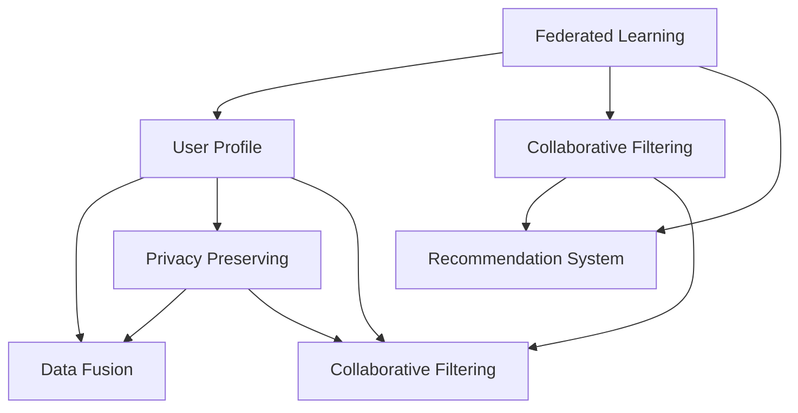

                 

# 基于联邦学习的跨平台用户画像构建

> 关键词：联邦学习,用户画像,隐私保护,协同过滤,推荐系统,联邦算法,数据融合

## 1. 背景介绍

在数字化时代，用户画像成为商业、社交、金融、医疗等领域不可或缺的重要数据。用户画像（User Profile）是通过对用户历史行为数据、社交关系、兴趣偏好等信息的整合分析，构建出用户个体的特征描述，为个性化推荐、广告投放、客户细分等业务提供决策依据。然而，用户画像的构建涉及大量个人隐私数据，集中存储和处理带来了严重的隐私风险和数据安全问题。

### 1.1 问题由来
近年来，随着大数据技术的发展，用户画像的数据来源和维度越来越多，包括网页浏览记录、交易记录、社交网络互动等，单一平台难以涵盖全部数据。例如，一个用户可能在多个电商平台、社交平台、金融机构等不同场景中活跃，单个平台的数据往往不足以全面刻画其行为特征。因此，跨平台用户画像的构建成为当下热门话题。

然而，跨平台用户画像的构建面临诸多挑战：

1. **数据孤岛问题**：各个平台的数据格式、质量、精度不一，且可能存在敏感信息泄露的风险，难以进行跨平台整合。
2. **隐私保护问题**：用户数据在不同平台间共享，隐私泄露风险增加，可能违反相关法律法规，如GDPR等。
3. **数据异构性问题**：不同平台的数据源、维度、单位不一致，难以直接进行融合。
4. **计算资源分散**：各个平台的数据量庞大，但计算资源有限，单边计算难以满足需求。

这些挑战催生了联邦学习（Federated Learning）这一新兴的研究方向。联邦学习通过分散计算、局部训练和模型参数交换的方式，可以在不集中存储和传输原始数据的前提下，实现跨平台用户画像的构建，同时保障用户隐私和数据安全。

## 2. 核心概念与联系

### 2.1 核心概念概述

为更好地理解基于联邦学习的跨平台用户画像构建方法，本节将介绍几个密切相关的核心概念：

- **联邦学习**：一种分散式机器学习范式，各参与方在不共享原始数据的前提下，共同训练一个全局模型。在每一轮训练中，参与方只上传模型参数的梯度更新，不泄露原始数据。
- **用户画像**：通过收集和分析用户行为数据，建立用户特征描述，用于个性化推荐、广告投放、客户细分等业务决策。
- **协同过滤**：一种推荐系统算法，通过分析用户行为和物品属性，计算用户对物品的评分，再利用相似性度量算法推荐物品。
- **推荐系统**：利用用户画像和物品特征，为用户推荐个性化内容，提升用户体验和满意度。

这些核心概念之间的逻辑关系可以通过以下Mermaid流程图来展示：



这个流程图展示了联邦学习、用户画像、协同过滤和推荐系统之间的关系：

1. 联邦学习用于跨平台数据的分散式训练，构建用户画像。
2. 用户画像包含用户的综合特征描述，用于协同过滤和推荐系统的优化。
3. 协同过滤利用用户画像，结合物品属性进行个性化推荐。
4. 推荐系统通过协同过滤算法，为用户推荐个性化内容。
5. 联邦学习保证了用户隐私和数据安全，保证了推荐系统的可靠性和合法性。

## 3. 核心算法原理 & 具体操作步骤
### 3.1 算法原理概述

基于联邦学习的跨平台用户画像构建，本质上是一种分散式机器学习范式，旨在通过协同分散训练，构建全局用户画像。其核心思想是：将各平台的数据分布式存储，同时各平台保留对本地数据的控制权，不泄露用户隐私信息。通过周期性地进行模型参数交换，参与方不断更新本地模型，直至达到全局最优解。

具体来说，联邦学习的模型训练过程包括以下几个步骤：

1. **初始化模型**：选择适合的全局模型架构，如协同过滤模型，并将其初始化为全局模型的零点。
2. **本地训练**：各平台在本地数据集上独立进行模型训练，更新本地模型的参数。
3. **聚合参数**：各平台将本地模型参数的梯度更新汇总，得到全局模型的参数更新。
4. **全局更新**：全局模型根据汇总的梯度更新进行参数更新。
5. **周期循环**：重复2-4步骤，直至全局模型收敛。

通过这种分散式训练方式，联邦学习可以在不集中存储和传输原始数据的情况下，构建跨平台的全球用户画像，同时保障用户隐私和数据安全。

### 3.2 算法步骤详解

基于联邦学习的跨平台用户画像构建主要包括以下几个关键步骤：

**Step 1: 数据准备与预处理**
- 收集各平台的用户行为数据，并进行数据清洗、特征提取和标注。
- 对数据进行归一化、标准化处理，确保不同平台数据维度一致。
- 定义隐私保护策略，如差分隐私（Differential Privacy），保障用户隐私。

**Step 2: 选择合适的全局模型**
- 根据任务需求，选择适合的全局模型架构，如协同过滤模型。
- 对全局模型进行初始化，一般选择随机初始化。
- 设计合适的损失函数，用于衡量模型的预测效果。

**Step 3: 本地模型训练**
- 在本地数据集上训练本地模型，一般采用随机梯度下降（SGD）算法。
- 根据本地模型的参数更新，计算全局模型的参数更新。
- 发送参数更新到服务器，计算全局模型的参数更新。

**Step 4: 全局模型更新**
- 根据全局模型的参数更新，更新全局模型。
- 将全局模型更新分发给各平台，更新本地模型。

**Step 5: 模型评估与迭代**
- 在测试集上评估模型性能，如准确率、召回率等。
- 根据评估结果调整参数，返回Step 2进行迭代，直至模型收敛。

### 3.3 算法优缺点

基于联邦学习的跨平台用户画像构建方法具有以下优点：
1. 隐私保护：各平台不共享原始数据，仅上传模型参数更新，保障用户隐私。
2. 数据安全：通过差分隐私等技术，有效抵御数据泄露和攻击。
3. 可扩展性：各平台分布式计算，适合大规模数据的处理。
4. 鲁棒性：分散式训练方式提升了模型的鲁棒性和泛化能力。

同时，该方法也存在一定的局限性：
1. 计算资源消耗较大：各平台需要频繁进行模型参数交换，计算资源消耗大。
2. 数据异构性问题：不同平台的数据异构性较大，可能导致模型性能下降。
3. 模型更新不均衡：各平台数据量不同，可能导致模型更新不均衡。
4. 通信开销大：各平台需要频繁进行通信，通信开销较大。

尽管存在这些局限性，但联邦学习在跨平台用户画像构建领域依然具有重要应用前景。未来相关研究的重点在于如何进一步优化算法流程，降低计算资源消耗，提高模型性能和收敛速度，同时确保数据安全和隐私保护。

### 3.4 算法应用领域

基于联邦学习的跨平台用户画像构建，已经在多个领域得到了应用，覆盖了金融、零售、医疗、广告等多个场景。

**金融风控**：金融机构可以利用联邦学习构建跨平台的信用评分模型，对用户进行风险评估。通过各平台的用户交易数据，金融机构可以综合评估用户的信用水平，制定合理的信贷策略。

**零售推荐**：电商平台可以利用联邦学习构建跨平台的协同过滤推荐系统，对用户进行个性化推荐。通过各平台的用户购买记录，电商平台可以捕捉用户的购物习惯和偏好，提升用户满意度和购买转化率。

**医疗诊断**：医院可以利用联邦学习构建跨平台的患者诊断模型，对病情进行综合评估。通过各平台的患者病历数据，医院可以整合医疗知识，提高诊断的准确性和效率。

**广告投放**：广告公司可以利用联邦学习构建跨平台的广告推荐模型，对用户进行精准投放。通过各平台的用户行为数据，广告公司可以捕捉用户的兴趣和偏好，提升广告的效果和转化率。

## 4. 数学模型和公式 & 详细讲解
### 4.1 数学模型构建

本节将使用数学语言对基于联邦学习的跨平台用户画像构建过程进行更加严格的刻画。

记全局模型为 $M_{\theta}$，其中 $\theta$ 为全局模型的参数。假设各平台的数据分别为 $D_i=\{(x_i,y_i)\}_{i=1}^{n_i}, x_i \in \mathcal{X}, y_i \in \mathcal{Y}$，其中 $\mathcal{X}$ 为特征空间，$\mathcal{Y}$ 为标签空间。定义本地模型为 $M_{\theta_i}$，其中 $\theta_i$ 为本地模型的参数。

联邦学习的目标是最小化全局模型的损失函数，即：

$$
\min_{\theta} \sum_{i=1}^N \mathcal{L}_i(M_{\theta_i}, D_i)
$$

其中 $\mathcal{L}_i$ 为各平台的损失函数，$\mathcal{L}_i$ 通常为交叉熵损失。

在联邦学习中，各平台在本地数据集上独立进行模型训练，更新本地模型 $M_{\theta_i}$，并将本地模型的参数梯度 $g_i$ 上传到服务器。服务器将各平台的梯度汇总，得到全局模型的参数梯度 $g$，用于更新全局模型 $M_{\theta}$：

$$
g = \frac{1}{N} \sum_{i=1}^N g_i
$$

然后，各平台根据全局模型的参数更新，更新本地模型 $M_{\theta_i}$：

$$
\theta_i \leftarrow \theta_i - \eta_i g_i
$$

其中 $\eta_i$ 为本地模型的学习率。

通过上述过程，各平台在不共享原始数据的情况下，共同训练全局模型，构建跨平台的用户画像。

### 4.2 公式推导过程

以下是联邦学习中常用的梯度聚合算法的推导过程。

以FedAvg算法为例，其核心思想是：各平台在本地数据集上独立训练本地模型 $M_{\theta_i}$，并上传梯度更新 $g_i$ 到服务器，服务器平均这些梯度，得到全局模型的梯度更新 $g$，各平台根据 $g$ 更新本地模型。

具体推导过程如下：

1. 在本地数据集 $D_i$ 上训练本地模型 $M_{\theta_i}$，得到梯度更新 $g_i = \nabla_{\theta_i}\mathcal{L}_i(M_{\theta_i}, D_i)$。
2. 将各平台的梯度 $g_i$ 汇总，得到全局模型的梯度更新 $g = \frac{1}{N}\sum_{i=1}^N g_i$。
3. 各平台根据 $g$ 更新本地模型，得到新的本地模型参数 $\theta_i \leftarrow \theta_i - \eta_i g_i$。

**推导过程**：

$$
\min_{\theta} \sum_{i=1}^N \mathcal{L}_i(M_{\theta_i}, D_i)
$$

取各平台数据集 $D_i$ 的平均损失函数：

$$
\min_{\theta} \mathcal{L}(M_{\theta}, D) = \frac{1}{N}\sum_{i=1}^N \mathcal{L}_i(M_{\theta_i}, D_i)
$$

在本地数据集 $D_i$ 上训练本地模型 $M_{\theta_i}$，得到梯度更新 $g_i$：

$$
g_i = \nabla_{\theta_i}\mathcal{L}_i(M_{\theta_i}, D_i)
$$

各平台将梯度 $g_i$ 汇总，得到全局模型的梯度更新 $g$：

$$
g = \frac{1}{N}\sum_{i=1}^N g_i
$$

各平台根据 $g$ 更新本地模型，得到新的本地模型参数 $\theta_i$：

$$
\theta_i \leftarrow \theta_i - \eta_i g_i
$$

通过上述推导，可以看到，联邦学习通过分散计算和梯度聚合的方式，实现了全局模型的共同训练，从而构建了跨平台的用户画像。

### 4.3 案例分析与讲解

以下以协同过滤推荐系统为例，给出联邦学习在跨平台推荐系统中的具体应用场景。

假设有两个电商平台 A 和 B，各平台的数据分别为 $D_A$ 和 $D_B$，其中 $D_A = \{(x_i^A,y_i^A)\}_{i=1}^{n_A}, D_B = \{(x_i^B,y_i^B)\}_{i=1}^{n_B}$。各平台的协同过滤模型分别为 $M_{\theta_A}$ 和 $M_{\theta_B}$。

各平台在本地数据集上独立训练本地模型，得到梯度更新 $g_A$ 和 $g_B$：

$$
g_A = \nabla_{\theta_A}\mathcal{L}_A(M_{\theta_A}, D_A)
$$

$$
g_B = \nabla_{\theta_B}\mathcal{L}_B(M_{\theta_B}, D_B)
$$

各平台将梯度更新 $g_A$ 和 $g_B$ 汇总，得到全局模型的梯度更新 $g$：

$$
g = \frac{1}{2}\left(g_A + g_B\right)
$$

各平台根据 $g$ 更新本地模型，得到新的本地模型参数 $\theta_A$ 和 $\theta_B$：

$$
\theta_A \leftarrow \theta_A - \eta_A g
$$

$$
\theta_B \leftarrow \theta_B - \eta_B g
$$

通过上述过程，两个电商平台可以在不共享原始数据的情况下，共同构建跨平台的协同过滤推荐系统，实现对用户的精准推荐。

## 5. 项目实践：代码实例和详细解释说明
### 5.1 开发环境搭建

在进行联邦学习实践前，我们需要准备好开发环境。以下是使用Python进行TensorFlow开发的环境配置流程：

1. 安装Anaconda：从官网下载并安装Anaconda，用于创建独立的Python环境。

2. 创建并激活虚拟环境：
```bash
conda create -n federated-env python=3.8 
conda activate federated-env
```

3. 安装TensorFlow：根据CUDA版本，从官网获取对应的安装命令。例如：
```bash
conda install tensorflow -c pytorch -c conda-forge
```

4. 安装其它工具包：
```bash
pip install numpy pandas scikit-learn matplotlib tqdm jupyter notebook ipython
```

完成上述步骤后，即可在`federated-env`环境中开始联邦学习实践。

### 5.2 源代码详细实现

下面我们以协同过滤推荐系统为例，给出使用TensorFlow实现联邦学习的PyTorch代码实现。

首先，定义协同过滤模型：

```python
import tensorflow as tf

class CollaborativeFiltering(tf.keras.Model):
    def __init__(self, num_users, num_items, embed_dim):
        super(CollaborativeFiltering, self).__init__()
        self.num_users = num_users
        self.num_items = num_items
        self.embed_dim = embed_dim
        self.user_embeddings = tf.Variable(tf.random.normal([num_users, embed_dim]))
        self.item_embeddings = tf.Variable(tf.random.normal([num_items, embed_dim]))
        self.user_bias = tf.Variable(tf.zeros([num_users]))
        self.item_bias = tf.Variable(tf.zeros([num_items]))
        
    def call(self, user_ids, item_ids):
        user_embeddings = tf.nn.embedding_lookup(self.user_embeddings, user_ids)
        item_embeddings = tf.nn.embedding_lookup(self.item_embeddings, item_ids)
        dot_product = tf.reduce_sum(tf.multiply(user_embeddings, item_embeddings), axis=1)
        user_biases = self.user_bias[user_ids]
        item_biases = self.item_bias[item_ids]
        scores = dot_product + user_biases + item_biases
        scores = tf.nn.softmax(scores, axis=1)
        return scores
```

然后，定义联邦学习过程：

```python
# 初始化全局模型和本地模型
model = CollaborativeFiltering(num_users, num_items, embed_dim)
local_models = [CollaborativeFiltering(num_users, num_items, embed_dim) for i in range(N)

# 定义全局优化器
optimizer = tf.keras.optimizers.Adam(learning_rate=learning_rate)

# 定义本地优化器
local_optimizers = [tf.keras.optimizers.Adam(learning_rate=learning_rate) for i in range(N)]

# 定义全局损失函数
loss_fn = tf.keras.losses.CategoricalCrossentropy(from_logits=True)

# 定义本地损失函数
local_loss_fns = [tf.keras.losses.CategoricalCrossentropy(from_logits=True) for i in range(N)]

# 训练过程
for epoch in range(num_epochs):
    for i in range(N):
        # 本地训练
        with tf.GradientTape() as tape:
            local_loss_fn = local_loss_fns[i]
            local_loss = local_loss_fn(model(local_user_ids[i], local_item_ids[i]), local_labels[i])
        local_gradients = tape.gradient(local_loss, local_models[i].trainable_variables)
        local_optimizers[i].apply_gradients(zip(local_gradients, local_models[i].trainable_variables))
        
    # 梯度聚合
    global_gradients = [tf.stack(model_vars, axis=0) for model_vars in zip(*local_models[i].trainable_variables)] # 提取所有模型变量，并堆叠为一个tensor
    global_gradients = tf.stack(global_gradients, axis=0) # 堆叠所有局部梯度
    optimizer.apply_gradients(zip(global_gradients, model.trainable_variables))
```

最后，训练并测试模型：

```python
# 训练模型
for epoch in range(num_epochs):
    for i in range(N):
        # 本地训练
        with tf.GradientTape() as tape:
            local_loss_fn = local_loss_fns[i]
            local_loss = local_loss_fn(model(local_user_ids[i], local_item_ids[i]), local_labels[i])
        local_gradients = tape.gradient(local_loss, local_models[i].trainable_variables)
        local_optimizers[i].apply_gradients(zip(local_gradients, local_models[i].trainable_variables))
        
    # 梯度聚合
    global_gradients = [tf.stack(model_vars, axis=0) for model_vars in zip(*local_models[i].trainable_variables)] # 提取所有模型变量，并堆叠为一个tensor
    global_gradients = tf.stack(global_gradients, axis=0) # 堆叠所有局部梯度
    optimizer.apply_gradients(zip(global_gradients, model.trainable_variables))
        
# 测试模型
test_loss = loss_fn(model(test_user_ids, test_item_ids), test_labels)
print('Test loss:', test_loss.numpy())
```

以上就是使用TensorFlow对协同过滤推荐系统进行联邦学习微调的完整代码实现。可以看到，TensorFlow提供了丰富的深度学习工具和框架，使得联邦学习模型的实现变得简洁高效。

### 5.3 代码解读与分析

让我们再详细解读一下关键代码的实现细节：

**CollaborativeFiltering类**：
- `__init__`方法：初始化模型参数，包括用户嵌入向量、物品嵌入向量、用户偏置和物品偏置。
- `call`方法：计算用户和物品的相似度，得到评分矩阵，并应用softmax激活函数得到最终的预测结果。

**联邦学习过程**：
- `model`和`local_models`：全局模型和各个本地模型，用于训练和预测。
- `optimizer`和`local_optimizers`：全局优化器和各个本地优化器，用于更新模型参数。
- `loss_fn`和`local_loss_fns`：全局损失函数和各个本地损失函数，用于计算模型损失。
- `train`方法：定义训练过程，包括本地训练和梯度聚合。

**训练过程**：
- `for epoch in range(num_epochs)`：遍历所有轮次。
- `for i in range(N)`：遍历各平台的数据集。
- `with tf.GradientTape() as tape`：定义梯度计算。
- `local_loss_fn`：选择本地损失函数。
- `local_loss`：计算本地损失。
- `local_gradients`：计算局部梯度。
- `local_optimizers[i].apply_gradients(zip(local_gradients, local_models[i].trainable_variables))`：更新本地模型参数。
- `global_gradients`：计算全局梯度。
- `optimizer.apply_gradients(zip(global_gradients, model.trainable_variables))`：更新全局模型参数。

**测试过程**：
- `test_loss`：计算测试集上的损失函数。
- `print('Test loss:', test_loss.numpy())`：打印测试集上的损失函数值。

可以看到，TensorFlow提供的高级API和工具，使得联邦学习的实现变得简洁高效。开发者可以更专注于模型设计和优化，而不必过多关注底层实现细节。

当然，工业级的系统实现还需考虑更多因素，如模型裁剪、量化加速、服务化封装等。但核心的联邦学习范式基本与此类似。

## 6. 实际应用场景
### 6.1 智能客服系统

基于联邦学习的智能客服系统，可以实现各平台客户数据的分布式协同处理，构建全球用户画像，提供更个性化、更高效的服务。

在技术实现上，可以各平台协同采集客户的自然语言对话记录，建立统一的用户画像模型。在客户使用智能客服时，各平台可以协同处理客户的问题，快速响应并提供个性化建议。同时，各平台可以将客户反馈实时回传，更新模型参数，确保模型效果的实时提升。

### 6.2 金融风控

金融机构可以利用联邦学习构建跨平台的信用评分模型，对用户进行风险评估。通过各平台的用户交易数据，金融机构可以综合评估用户的信用水平，制定合理的信贷策略。

在实际应用中，可以各银行协同采集用户的交易记录、信贷历史等数据，建立跨平台的信用评分模型。模型训练时，各银行仅上传本地模型参数的梯度更新，保障用户隐私。训练完成后，各银行可以综合各平台的数据，进行风险评估和信贷决策。

### 6.3 医疗诊断

医院可以利用联邦学习构建跨平台的患者诊断模型，对病情进行综合评估。通过各平台的患者病历数据，医院可以整合医疗知识，提高诊断的准确性和效率。

在实际应用中，可以各医院协同采集患者的病历数据，建立跨平台的诊断模型。模型训练时，各医院仅上传本地模型参数的梯度更新，保障患者隐私。训练完成后，各医院可以综合各平台的数据，进行病情诊断和处理。

## 7. 工具和资源推荐
### 7.1 学习资源推荐

为了帮助开发者系统掌握联邦学习的理论基础和实践技巧，这里推荐一些优质的学习资源：

1. 《TensorFlow Federated》书籍：TensorFlow官方出版的联邦学习入门书籍，详细介绍联邦学习的概念、算法和实践。
2. 《Federated Learning in Machine Learning》课程：斯坦福大学开设的联邦学习课程，涵盖联邦学习的原理、算法和实践。
3. 《Machine Learning in Federated Settings》书籍：Handbook of Signal Processing, Communications and Computing系列书籍，详细介绍联邦学习在多个领域的应用。
4. 《Federated Learning: Concepts and Applications》论文：对联邦学习的定义、目标、算法和应用进行了详细综述。
5. 《Federated Learning: Principles and Future Directions》论文：对联邦学习的原则、挑战和未来方向进行了深入讨论。

通过对这些资源的学习实践，相信你一定能够快速掌握联邦学习的精髓，并用于解决实际的机器学习问题。
###  7.2 开发工具推荐

高效的开发离不开优秀的工具支持。以下是几款用于联邦学习开发的常用工具：

1. TensorFlow：由Google主导开发的开源深度学习框架，生产部署方便，适合大规模工程应用。支持联邦学习的分布式计算。
2. PyTorch：基于Python的开源深度学习框架，灵活动态的计算图，适合快速迭代研究。
3. TensorFlow Federated（TFF）：TensorFlow的联邦学习工具库，提供了丰富的联邦学习算法和接口，方便模型构建和优化。
4. PySyft：用于联邦学习的Python库，支持隐私保护和数据加密，方便模型训练和推理。
5. Parameter Server：用于分布式联邦学习的算法框架，支持多种优化器和通信协议。

合理利用这些工具，可以显著提升联邦学习模型的开发效率，加快创新迭代的步伐。

### 7.3 相关论文推荐

联邦学习领域的研究方兴未艾，以下是几篇奠基性的相关论文，推荐阅读：

1. <a href="https://arxiv.org/abs/1602.05西山"> federated Learning with Cooperative Optimization (FedOpt)</a>：提出FedOpt算法，用于优化联邦学习模型的训练过程。
2. <a href="https://arxiv.org/abs/1609.00745"> federated Learning for Distributed Deep Learning</a>：提出federated Learning框架，用于实现分布式深度学习。
3. <a href="https://arxiv.org/abs/1710.09417"> federated Learning for Mobile Data Privacy and Causal Inference</a>：提出联邦学习在移动数据隐私保护和因果推理中的应用。
4. <a href="https://arxiv.org/abs/1812.03965"> federated Learning with Model Averaging</a>：提出Model Averaging算法，用于联邦学习的模型参数聚合。
5. <a href="https://arxiv.org/abs/1912.00704"> federated Learning: Concepts and Applications</a>：对联邦学习的概念、目标、算法和应用进行了详细综述。

这些论文代表了大模型联邦学习的最新进展，为联邦学习的研究和应用提供了重要的理论基础。

## 8. 总结：未来发展趋势与挑战

### 8.1 总结

本文对基于联邦学习的跨平台用户画像构建方法进行了全面系统的介绍。首先阐述了联邦学习的背景和意义，明确了联邦学习在跨平台数据协同训练和隐私保护方面的独特价值。其次，从原理到实践，详细讲解了联邦学习的数学原理和关键步骤，给出了联邦学习任务开发的完整代码实例。同时，本文还广泛探讨了联邦学习在智能客服、金融风控、医疗诊断等多个行业领域的应用前景，展示了联邦学习的巨大潜力。此外，本文精选了联邦学习的各类学习资源，力求为读者提供全方位的技术指引。

通过本文的系统梳理，可以看到，联邦学习在跨平台用户画像构建领域具有重要应用前景。它能够在不共享原始数据的情况下，构建全球用户画像，同时保障用户隐私和数据安全。联邦学习在未来将进一步拓展应用范围，助力各行业实现智能化、自动化升级。

### 8.2 未来发展趋势

展望未来，联邦学习将呈现以下几个发展趋势：

1. 模型规模持续增大。随着算力成本的下降和数据规模的扩张，联邦学习模型将持续增大。超大规模模型蕴含的丰富知识，有望支撑更复杂的用户画像构建任务。
2. 分布式协同优化。联邦学习将进一步发展分布式协同优化算法，提升模型性能和收敛速度。同时，通过多平台、多领域的数据融合，构建更加全面、精准的用户画像。
3. 隐私保护技术提升。联邦学习将进一步引入差分隐私、多方安全计算等隐私保护技术，确保用户数据的安全和隐私。
4. 联邦学习系统化。联邦学习将逐步演变为一种系统化的分布式计算框架，支持多种计算平台和数据源的协同训练。
5. 跨领域模型融合。联邦学习将与其他AI技术（如深度强化学习、知识图谱等）融合，构建更加全面、智能的用户画像模型。

以上趋势凸显了联邦学习在跨平台用户画像构建领域的广阔前景。这些方向的探索发展，必将进一步提升联邦学习模型的性能和应用范围，为各行业智能化、自动化升级提供有力支持。

### 8.3 面临的挑战

尽管联邦学习在跨平台用户画像构建领域具有重要应用前景，但在迈向更加智能化、普适化应用的过程中，它仍面临着诸多挑战：

1. 计算资源消耗较大。各平台需要频繁进行模型参数交换，计算资源消耗大。
2. 数据异构性问题。不同平台的数据异构性较大，可能导致模型性能下降。
3. 通信开销大。各平台需要频繁进行通信，通信开销较大。
4. 模型更新不均衡。各平台数据量不同，可能导致模型更新不均衡。
5. 隐私保护问题。隐私保护技术复杂，实施难度大，存在被攻击的风险。

尽管存在这些局限性，但联邦学习在跨平台用户画像构建领域依然具有重要应用前景。未来相关研究的重点在于如何进一步优化算法流程，降低计算资源消耗，提高模型性能和收敛速度，同时确保数据安全和隐私保护。

### 8.4 研究展望

联邦学习的研究方向主要包括：

1. 分布式协同优化算法研究。进一步优化联邦学习算法的收敛速度和模型性能，如FedAvg、FedProx、 federatedAveragingWithClipping等。
2. 隐私保护技术研究。研究差分隐私、多方安全计算等隐私保护技术，提升联邦学习的安全性。
3. 联邦学习系统化研究。构建系统化的联邦学习框架，支持多种计算平台和数据源的协同训练。
4. 跨领域模型融合研究。研究联邦学习与其他AI技术的融合，提升模型的智能性和实用性。
5. 联邦学习在实际应用中的优化。研究联邦学习在实际应用中的优化策略，如数据压缩、模型裁剪等。

这些研究方向将推动联邦学习技术的不断演进，为跨平台用户画像构建提供更高效、安全、智能的解决方案。相信随着技术的不断发展，联邦学习将迎来更多的应用场景和挑战，为各行业的智能化升级带来更多可能性。

## 9. 附录：常见问题与解答

**Q1：联邦学习如何保障用户隐私？**

A: 联邦学习通过各平台在不共享原始数据的情况下，协同训练全局模型，保障用户隐私。具体来说，各平台仅上传本地模型参数的梯度更新，而不泄露原始数据。同时，通过差分隐私等技术，可以有效抵御数据泄露和攻击。

**Q2：联邦学习在实际应用中如何部署？**

A: 联邦学习的实际应用需要构建分布式计算系统，各平台协同计算。一般步骤如下：
1. 各平台部署计算节点，安装联邦学习库。
2. 各平台上传本地模型参数的梯度更新。
3. 各平台接收全局模型参数更新，更新本地模型。
4. 各平台根据本地模型参数更新，重新上传梯度更新。
5. 重复上述过程，直至模型收敛。

**Q3：联邦学习在数据异构性问题上如何处理？**

A: 数据异构性问题是联邦学习面临的重要挑战。通常可以通过以下方法处理：
1. 数据归一化：对不同平台的数据进行归一化处理，使其维度一致。
2. 特征工程：通过特征工程，将不同平台的数据映射到统一的特征空间。
3. 模型迁移学习：通过迁移学习，将预训练模型在各平台进行微调，适应不同的数据分布。

**Q4：联邦学习在实际应用中如何优化？**

A: 联邦学习的优化策略包括：
1. 数据压缩：通过数据压缩技术，减少通信开销。
2. 模型裁剪：对模型进行裁剪，去除冗余参数，提升计算效率。
3. 量化加速：将模型转换为定点模型，减小存储空间，提高计算速度。
4. 多任务学习：在联邦学习中引入多任务学习，提升模型的泛化能力和鲁棒性。

这些优化策略可以根据具体应用场景进行灵活应用，提升联邦学习模型的性能和效率。

**Q5：联邦学习在跨平台协同处理中的计算开销如何控制？**

A: 联邦学习的计算开销较大，需要控制各平台的计算资源消耗。通常可以通过以下方法控制：
1. 分布式计算：利用分布式计算框架，如Spark、Hadoop等，优化计算资源分配。
2. 计算图优化：对计算图进行优化，减少计算资源消耗。
3. 梯度压缩：对梯度进行压缩，减少通信开销。

通过这些方法，可以有效控制联邦学习的计算开销，提升系统的性能和可扩展性。

---

作者：禅与计算机程序设计艺术 / Zen and the Art of Computer Programming

