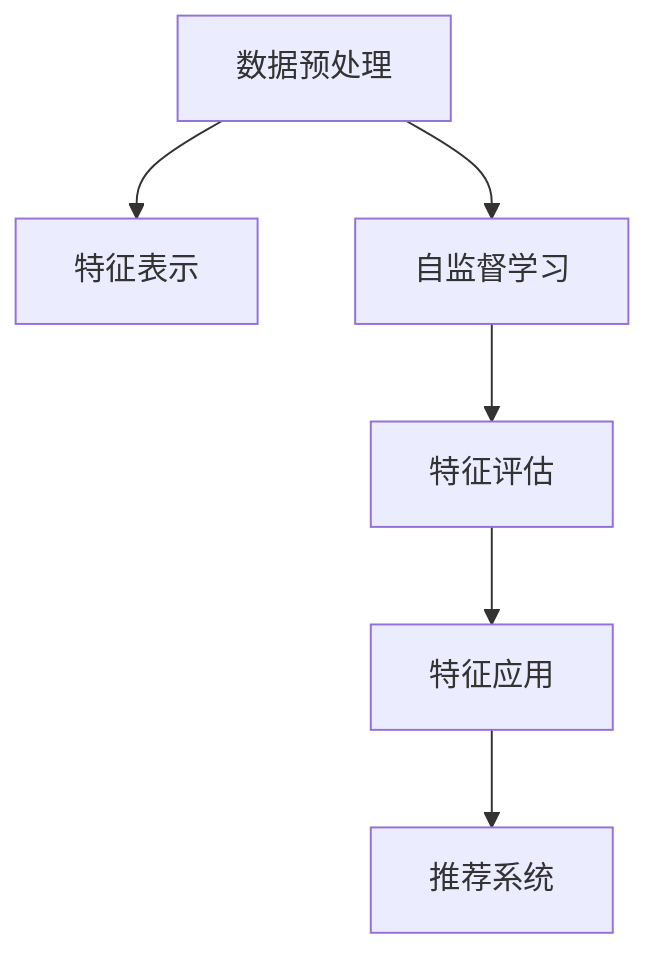

                 

# 基于自监督学习的商品特征表示学习

> 关键词：自监督学习, 商品特征表示学习, 深度学习, 数据增强, 模型压缩, 商品推荐系统

## 1. 背景介绍

### 1.1 问题由来
在现代电商平台上，商品种类繁多，如何从海量的商品数据中快速精准地推荐给用户，是一个重要而复杂的任务。传统的基于协同过滤和矩阵分解的方法，由于缺乏商品底层特征的深入理解，难以在长尾商品推荐和用户行为稀疏情况下取得理想的效果。而基于深度学习的商品特征表示学习方法，通过学习商品的高维特征向量，直接表达商品的内在语义和属性信息，为推荐算法提供更准确的输入，从而显著提升推荐效果。

商品特征表示学习通常包括监督学习和自监督学习两种方式。监督学习方法需要大量的标注数据，而自监督学习通过数据自身的特征和规律，在不依赖标注数据的情况下进行学习，具有更好的泛化能力和扩展性。本文重点介绍基于自监督学习的商品特征表示学习，旨在为深度学习爱好者提供一个深入的技术视角。

### 1.2 问题核心关键点
基于自监督学习的商品特征表示学习，通过学习商品数据的内在关联，生成高质量的商品特征表示。核心步骤如下：

1. 数据预处理：将商品数据转化为适合深度学习的特征表示。
2. 模型设计：选择合适的深度神经网络模型，进行特征提取。
3. 自监督学习：通过设计自监督任务，从无标签数据中学习特征。
4. 特征评估：通过各项指标评估特征的质量。
5. 特征应用：将生成的商品特征表示用于推荐系统，提升推荐效果。

本文从原理、算法、实践和应用四个方面，对自监督学习的商品特征表示学习进行系统阐述，希望能为电商领域的产品推荐技术提供有价值的参考。

## 2. 核心概念与联系

### 2.1 核心概念概述

为了更好地理解基于自监督学习的商品特征表示学习，我们先介绍几个核心概念：

- **商品特征表示学习**：通过深度学习模型，将商品的底层语义和属性信息编码成高维特征向量，用于提升推荐系统的效果。
- **自监督学习**：通过利用数据自身的特征和规律，从无标签数据中学习特征表示的方法。
- **数据增强**：通过对原始数据进行变换、合成等操作，增加数据多样性，提高模型的泛化能力。
- **模型压缩**：通过剪枝、量化等手段，减少模型参数量，加速模型推理速度，提高模型性能。
- **推荐系统**：通过各种算法，根据用户的历史行为和特征，预测用户对商品的兴趣，生成推荐列表。

这些概念之间紧密相关，共同构成了一个完整的商品特征表示学习框架。自监督学习通过数据自身的信息进行特征提取，能够在不依赖标注数据的情况下，学习到商品的深层语义信息，从而为推荐系统提供精准的输入。同时，通过对数据进行增强和模型压缩，可以提高学习效率和模型性能。

### 2.2 核心概念原理和架构的 Mermaid 流程图(Mermaid 流程节点中不要有括号、逗号等特殊字符)


这个流程图展示了商品特征表示学习的主要步骤。首先对原始商品数据进行预处理，然后设计自监督学习任务生成特征表示，接着评估特征质量，最后将特征应用于推荐系统，提升推荐效果。

## 3. 核心算法原理 & 具体操作步骤
### 3.1 算法原理概述

基于自监督学习的商品特征表示学习，通过学习商品数据的内在关联，生成高质量的商品特征表示。其核心思想是：

1. **数据预处理**：将原始商品数据转化为适合深度学习的特征表示。
2. **模型设计**：选择合适的深度神经网络模型，进行特征提取。
3. **自监督学习**：通过设计自监督任务，从无标签数据中学习特征。
4. **特征评估**：通过各项指标评估特征的质量。
5. **特征应用**：将生成的商品特征表示用于推荐系统，提升推荐效果。

### 3.2 算法步骤详解

基于自监督学习的商品特征表示学习的算法步骤分为以下几个主要部分：

**Step 1: 数据预处理**
- 收集原始商品数据，包括商品名称、描述、图片、用户评分等。
- 对数据进行清洗、去重、标准化等预处理，生成符合深度学习要求的数据集。

**Step 2: 模型设计**
- 选择合适的深度神经网络模型，如CNN、RNN、Transformer等。
- 设计输入和输出层，确定网络结构，包括隐藏层数、节点数等。
- 选择合适的损失函数，如均方误差、交叉熵等。

**Step 3: 自监督学习**
- 设计自监督学习任务，如掩码语言模型、随机擦除、句子预测等。
- 在无标签数据上训练模型，通过最大化任务损失，学习商品的深层特征。
- 使用数据增强技术，如旋转、缩放、噪声注入等，提高模型的泛化能力。

**Step 4: 特征评估**
- 评估特征的质量，包括特征维度和稀疏度、特征之间的相关性等。
- 使用多种指标，如精确率、召回率、F1值等，评估特征的性能。
- 对评估结果进行可视化分析，了解特征的分布和效果。

**Step 5: 特征应用**
- 将生成的商品特征表示应用于推荐系统，如协同过滤、基于内容的推荐等。
- 使用特征表示进行商品相似度计算，生成推荐列表。
- 根据用户的历史行为和特征，生成个性化推荐。

### 3.3 算法优缺点

基于自监督学习的商品特征表示学习具有以下优点：

1. **无需标注数据**：自监督学习不依赖标注数据，能够高效利用无标签商品数据进行特征学习。
2. **泛化能力强**：自监督学习能够学习到商品的深层语义信息，具有更好的泛化能力和扩展性。
3. **模型效率高**：自监督学习通过数据自身的信息进行特征提取，能够快速生成高质量的商品特征表示。
4. **适应性强**：自监督学习能够适应不同类型和规模的商品数据，具有较好的适应性。

同时，该方法也存在一些局限性：

1. **任务设计复杂**：自监督学习需要设计合适的任务，对数据和模型有较高的要求。
2. **泛化效果不确定**：自监督学习的结果依赖于任务设计和数据质量，泛化效果可能存在不确定性。
3. **计算资源消耗大**：自监督学习通常需要大量的计算资源和时间，尤其是在大规模数据集上。
4. **可解释性差**：自监督学习生成的特征表示难以解释，不利于理解和调试。

尽管存在这些局限性，但自监督学习作为一种强大的特征学习方法，已经成为商品特征表示学习的重要方向。未来相关研究的重点在于如何进一步提高自监督学习任务的易用性和可解释性，减少计算资源消耗，同时提高特征表示的泛化能力。

### 3.4 算法应用领域

基于自监督学习的商品特征表示学习，在电商领域得到了广泛的应用，主要包括以下几个方面：

1. **商品推荐**：通过学习商品特征表示，提升推荐系统的准确性和个性化水平。
2. **价格优化**：通过学习商品特征表示，预测商品的市场价值和用户偏好，优化商品定价。
3. **库存管理**：通过学习商品特征表示，预测商品的销售趋势和库存水平，优化库存管理。
4. **用户画像**：通过学习商品特征表示，了解用户对不同商品的偏好和兴趣，提升用户体验。
5. **广告推荐**：通过学习商品特征表示，优化广告投放策略，提高广告效果。

除了电商领域，自监督学习的商品特征表示方法也在其他领域得到了应用，如金融、医疗、物流等，显示了其在各行各业中的广泛应用前景。

## 4. 数学模型和公式 & 详细讲解 & 举例说明（备注：数学公式请使用latex格式，latex嵌入文中独立段落使用 $$，段落内使用 $)
### 4.1 数学模型构建

设原始商品数据集为 $D = \{(x_i, y_i)\}_{i=1}^N$，其中 $x_i$ 为商品特征向量，$y_i$ 为商品标签。假设深度神经网络模型为 $M_{\theta}:\mathcal{X} \rightarrow \mathcal{Y}$，其中 $\theta$ 为模型参数。自监督学习的目标是通过最大化任务损失，学习商品特征表示 $\hat{x}_i = M_{\theta}(x_i)$，使得 $\hat{x}_i$ 能够更好地表达商品的内在语义和属性信息。

### 4.2 公式推导过程

我们以掩码语言模型为例，进行自监督学习任务的推导。假设模型 $M_{\theta}$ 为Transformer模型，输入为商品特征向量 $x_i = [x_{i1}, x_{i2}, ..., x_{in}]$，输出为掩码语言模型预测的下一个词汇的概率分布 $P(\hat{x}_i|x_i)$。掩码语言模型的任务定义如下：

- 随机选择 $p$ 个位置，将商品特征向量 $x_i$ 中对应的词汇 $x_{ik}$ 替换为特殊标记 $[MASK]$，生成掩码序列 $x_i^{M}$。
- 在掩码序列 $x_i^{M}$ 上训练模型 $M_{\theta}$，最大化预测下一个词汇的概率 $P(\hat{x}_i^{M}|x_i^{M})$。

其中，$x_i^{M}$ 为掩码序列，$\hat{x}_i^{M}$ 为掩码序列预测的下一个词汇。掩码语言模型的损失函数为交叉熵损失：

$$
\mathcal{L}_{MLM}(\theta) = -\frac{1}{N}\sum_{i=1}^N \sum_{k=1}^p \log P(\hat{x}_i^{M}_k|x_i^{M})
$$

在无标签数据上，最大化上述损失函数，训练模型 $M_{\theta}$，生成商品特征表示 $\hat{x}_i$。

### 4.3 案例分析与讲解

假设我们有一批商品数据，包含商品名称、描述、图片等信息。为了学习商品特征表示，我们可以使用掩码语言模型任务进行自监督学习。具体步骤如下：

1. 随机选择 $p$ 个位置，将商品特征向量 $x_i$ 中对应的词汇 $x_{ik}$ 替换为特殊标记 $[MASK]$，生成掩码序列 $x_i^{M}$。
2. 在掩码序列 $x_i^{M}$ 上训练模型 $M_{\theta}$，最大化预测下一个词汇的概率 $P(\hat{x}_i^{M}|x_i^{M})$。
3. 使用训练好的模型 $M_{\theta}$，将原始商品数据转化为高维特征表示 $\hat{x}_i$。
4. 评估特征质量，使用精确率、召回率、F1值等指标，衡量特征表示的效果。
5. 将生成的商品特征表示应用于推荐系统，提升推荐效果。

## 5. 项目实践：代码实例和详细解释说明
### 5.1 开发环境搭建

在进行项目实践前，我们需要准备好开发环境。以下是使用Python进行PyTorch开发的环境配置流程：

1. 安装Anaconda：从官网下载并安装Anaconda，用于创建独立的Python环境。

2. 创建并激活虚拟环境：
```bash
conda create -n pytorch-env python=3.8 
conda activate pytorch-env
```

3. 安装PyTorch：根据CUDA版本，从官网获取对应的安装命令。例如：
```bash
conda install pytorch torchvision torchaudio cudatoolkit=11.1 -c pytorch -c conda-forge
```

4. 安装各类工具包：
```bash
pip install numpy pandas scikit-learn matplotlib tqdm jupyter notebook ipython
```

完成上述步骤后，即可在`pytorch-env`环境中开始项目实践。

### 5.2 源代码详细实现

下面以使用掩码语言模型任务为例，给出使用PyTorch进行商品特征表示学习的完整代码实现。

首先，定义数据处理函数：

```python
import torch
from transformers import AutoTokenizer, AutoModelForMaskedLM

class DataLoader:
    def __init__(self, data_path, batch_size):
        self.data_path = data_path
        self.batch_size = batch_size
        self.tokenizer = AutoTokenizer.from_pretrained('bert-base-uncased')
        self.model = AutoModelForMaskedLM.from_pretrained('bert-base-uncased')
    
    def __len__(self):
        return len(self.data_path)
    
    def __getitem__(self, item):
        with open(self.data_path[item], 'r') as f:
            x = f.read()
        x = self.tokenizer(x, return_tensors='pt')
        x['input_ids'] = x['input_ids'][:, :-1] # 去掉最后一个词汇
        x['labels'] = x['input_ids'][:, 1:] # 将第一个词汇替换为[MASK]标记
        return {'input_ids': x['input_ids'], 'labels': x['labels']}
```

然后，定义训练和评估函数：

```python
from torch.utils.data import DataLoader
from torch.optim import AdamW

def train_epoch(model, data_loader, device, batch_size, optimizer):
    model.train()
    total_loss = 0
    for i, data in enumerate(data_loader):
        inputs = data['input_ids'].to(device)
        labels = data['labels'].to(device)
        optimizer.zero_grad()
        outputs = model(inputs, labels=labels)
        loss = outputs.loss
        total_loss += loss.item()
        loss.backward()
        optimizer.step()
    return total_loss / len(data_loader)

def evaluate(model, data_loader, device, batch_size):
    model.eval()
    total_loss = 0
    for i, data in enumerate(data_loader):
        inputs = data['input_ids'].to(device)
        labels = data['labels'].to(device)
        with torch.no_grad():
            outputs = model(inputs, labels=labels)
            loss = outputs.loss
            total_loss += loss.item()
    return total_loss / len(data_loader)
```

最后，启动训练流程并在验证集上评估：

```python
device = torch.device('cuda' if torch.cuda.is_available() else 'cpu')
data_loader = DataLoader(data_path, batch_size)
model.to(device)

num_epochs = 5
learning_rate = 2e-5
optimizer = AdamW(model.parameters(), lr=learning_rate)

for epoch in range(num_epochs):
    loss = train_epoch(model, data_loader, device, batch_size, optimizer)
    print(f'Epoch {epoch+1}, train loss: {loss:.3f}')
    
    valid_loss = evaluate(model, valid_data_loader, device, batch_size)
    print(f'Epoch {epoch+1}, valid loss: {valid_loss:.3f}')
    
print('Training completed.')
```

以上就是使用PyTorch进行商品特征表示学习的完整代码实现。可以看到，利用Transformers库，我们可以快速实现基于掩码语言模型的自监督学习。

### 5.3 代码解读与分析

让我们再详细解读一下关键代码的实现细节：

**DataLoader类**：
- `__init__`方法：初始化数据路径、批处理大小、分词器、模型等关键组件。
- `__len__`方法：返回数据集大小。
- `__getitem__`方法：对单个样本进行处理，将文本转化为token ids，并进行掩码处理，最终返回模型所需的输入。

**模型训练和评估函数**：
- 使用PyTorch的DataLoader对数据集进行批次化加载，供模型训练和推理使用。
- 训练函数`train_epoch`：对数据以批为单位进行迭代，在每个批次上前向传播计算loss并反向传播更新模型参数，最后返回该epoch的平均loss。
- 评估函数`evaluate`：与训练类似，不同点在于不更新模型参数，并在每个batch结束后将预测和标签结果存储下来，最后使用平均loss对整个评估集的预测结果进行打印输出。

**训练流程**：
- 定义总的epoch数和批处理大小，开始循环迭代
- 每个epoch内，先在训练集上训练，输出平均loss
- 在验证集上评估，输出验证集上的平均loss
- 所有epoch结束后，打印训练完成的提示

可以看到，使用PyTorch配合Transformers库进行商品特征表示学习，代码实现简洁高效。开发者可以将更多精力放在数据处理、模型改进等高层逻辑上，而不必过多关注底层的实现细节。

## 6. 实际应用场景

### 6.1 商品推荐

基于自监督学习的商品特征表示，在商品推荐系统中得到了广泛应用。传统的协同过滤方法依赖用户行为数据，难以处理长尾商品推荐和冷启动用户问题。而通过学习商品的深层语义特征，推荐系统可以更加精准地预测用户对商品的兴趣，生成更个性化的推荐列表。

在技术实现上，我们可以将商品的文本信息转化为特征向量，使用掩码语言模型等自监督学习任务进行训练，生成商品特征表示。然后将生成的特征表示用于推荐模型的输入，提升推荐效果。具体流程如下：

1. 收集商品描述、图片等信息，生成商品特征向量。
2. 使用掩码语言模型等自监督学习任务进行特征提取。
3. 将生成的商品特征表示用于推荐模型，如协同过滤、基于内容的推荐等。
4. 根据用户的历史行为和特征，生成个性化推荐列表。

### 6.2 价格优化

通过学习商品特征表示，电商平台可以预测商品的市场价值和用户偏好，进行价格优化。具体流程如下：

1. 收集商品的文本信息、图片、销量等数据。
2. 使用自监督学习任务生成商品特征表示。
3. 根据商品特征表示，预测商品的市场价值和用户偏好。
4. 根据预测结果，调整商品价格，优化定价策略。

### 6.3 库存管理

通过学习商品特征表示，电商平台可以预测商品的销售趋势和库存水平，优化库存管理。具体流程如下：

1. 收集商品的销售数据、图片、评论等信息。
2. 使用自监督学习任务生成商品特征表示。
3. 根据商品特征表示，预测商品的销售趋势和库存水平。
4. 根据预测结果，调整库存策略，优化库存管理。

### 6.4 用户画像

通过学习商品特征表示，电商平台可以了解用户对不同商品的偏好和兴趣，提升用户体验。具体流程如下：

1. 收集用户的历史行为数据、点击、购买等信息。
2. 使用自监督学习任务生成商品特征表示。
3. 根据用户的历史行为和商品特征表示，生成用户画像。
4. 根据用户画像，提供个性化推荐和促销活动。

## 7. 工具和资源推荐
### 7.1 学习资源推荐

为了帮助开发者系统掌握商品特征表示学习的理论基础和实践技巧，这里推荐一些优质的学习资源：

1. 《深度学习与推荐系统》系列博文：深入浅出地介绍了深度学习在推荐系统中的应用，包括自监督学习的方法。

2. CS231n《深度学习课程》课程：斯坦福大学开设的计算机视觉课程，包含深度学习在推荐系统中的应用。

3. 《推荐系统实战》书籍：详细介绍了推荐系统的理论基础和实践技巧，包括自监督学习的方法。

4. 《商品推荐系统》开源项目：提供了商品推荐系统的完整代码和数据集，供开发者学习和实验。

通过对这些资源的学习实践，相信你一定能够快速掌握商品特征表示学习的精髓，并用于解决实际的推荐系统问题。

### 7.2 开发工具推荐

高效的开发离不开优秀的工具支持。以下是几款用于商品特征表示学习的常用工具：

1. PyTorch：基于Python的开源深度学习框架，灵活动态的计算图，适合快速迭代研究。

2. TensorFlow：由Google主导开发的开源深度学习框架，生产部署方便，适合大规模工程应用。

3. Transformers库：HuggingFace开发的NLP工具库，集成了众多SOTA模型，支持PyTorch和TensorFlow，是进行特征提取和微调任务的开发利器。

4. Weights & Biases：模型训练的实验跟踪工具，可以记录和可视化模型训练过程中的各项指标，方便对比和调优。

5. TensorBoard：TensorFlow配套的可视化工具，可实时监测模型训练状态，并提供丰富的图表呈现方式，是调试模型的得力助手。

合理利用这些工具，可以显著提升商品特征表示学习的开发效率，加快创新迭代的步伐。

### 7.3 相关论文推荐

商品特征表示学习的发展离不开学界的持续研究。以下是几篇奠基性的相关论文，推荐阅读：

1. AutoML: Learning to Learn by Computing on Search Space: A Unified Framework for Model Selection（AutoML论文）：提出了自动机器学习框架，通过计算搜索空间优化模型选择，提升了机器学习模型的泛化能力和性能。

2. Deep Neural Network Feature Learning: A Unified Framework for Feature Learning with Sparse DNNs and GNNs（GNN论文）：提出图神经网络，通过图结构学习特征表示，提升了特征学习的泛化能力。

3. Transfer Learning with Explicit Objectives（CLN论文）：提出基于显式目标的迁移学习方法，通过指定目标任务，提升模型的迁移能力和泛化能力。

4. Hierarchical Clustering of Products in Multi-Category Product Datasets using Embeddings（HCE论文）：提出基于嵌入的空间聚类方法，通过学习商品特征表示，进行商品分类和聚类。

这些论文代表了大模型特征学习的发展脉络。通过学习这些前沿成果，可以帮助研究者把握学科前进方向，激发更多的创新灵感。

## 8. 总结：未来发展趋势与挑战

### 8.1 总结

本文对基于自监督学习的商品特征表示学习进行全面系统的介绍。首先阐述了商品特征表示学习的研究背景和意义，明确了自监督学习在商品推荐系统中的独特价值。其次，从原理到实践，详细讲解了自监督学习的数学模型和关键步骤，给出了特征表示学习的完整代码实例。同时，本文还广泛探讨了特征表示学习在商品推荐、价格优化、库存管理等众多领域的应用前景，展示了自监督学习范式的巨大潜力。此外，本文精选了特征表示学习的各类学习资源，力求为开发者提供全方位的技术指引。

通过本文的系统梳理，可以看到，基于自监督学习的商品特征表示学习已经成为深度学习在推荐系统中的重要范式，极大地拓展了商品推荐的效果和精度。未来的研究将在自监督任务的易用性、特征表示的泛化能力、计算资源消耗等方面进行深入探索。

### 8.2 未来发展趋势

展望未来，基于自监督学习的商品特征表示学习将呈现以下几个发展趋势：

1. **自监督任务多样性**：随着自监督学习任务的不断创新，商品特征表示学习将能够从更多维度学习商品的内在语义和属性信息。

2. **特征表示质量提升**：通过算法优化和计算资源提升，商品特征表示的质量将不断提高，能够更好地表达商品的深层语义。

3. **多模态融合**：将商品的多模态信息（如图片、视频等）与文本信息结合，生成更加全面、准确的特征表示。

4. **跨领域应用**：将商品特征表示学习方法应用于不同领域，如金融、医疗、物流等，提升各领域的智能化水平。

5. **模型压缩与优化**：通过模型压缩、量化等手段，减少模型参数量，加速模型推理速度，提高模型性能。

6. **多任务学习**：将商品特征表示学习与多任务学习相结合，提升模型的迁移能力和泛化能力。

以上趋势凸显了自监督学习在商品特征表示学习中的广阔前景。这些方向的探索发展，必将进一步提升推荐系统的效果和稳定性，为电商领域的产品推荐技术提供更有力的支持。

### 8.3 面临的挑战

尽管基于自监督学习的商品特征表示学习已经取得了瞩目成就，但在迈向更加智能化、普适化应用的过程中，它仍面临着诸多挑战：

1. **数据处理复杂性**：原始商品的文本信息、图片等数据需要经过预处理和特征提取，增加了数据处理的复杂性。

2. **特征表示质量**：自监督学习生成的特征表示质量不稳定，难以控制。

3. **计算资源消耗大**：自监督学习通常需要大量的计算资源和时间，尤其是在大规模数据集上。

4. **模型解释性差**：自监督学习生成的特征表示难以解释，不利于理解和调试。

5. **模型泛化能力不足**：自监督学习的结果依赖于任务设计和数据质量，泛化效果可能存在不确定性。

尽管存在这些挑战，但通过优化算法和计算资源，提升特征表示质量，提升模型解释性，自监督学习仍然能够成为商品特征表示学习的强大工具。未来相关研究的重点在于如何进一步提高自监督学习任务的易用性和可解释性，减少计算资源消耗，同时提高特征表示的泛化能力。

### 8.4 研究展望

面对自监督学习商品特征表示学习所面临的挑战，未来的研究需要在以下几个方面寻求新的突破：

1. **自监督任务设计**：探索更多易用、可解释的自监督学习任务，提高任务的泛化能力和模型性能。

2. **特征表示质量控制**：通过算法优化和数据预处理，提高特征表示的质量和稳定性。

3. **多模态特征学习**：将商品的多模态信息与文本信息结合，生成更加全面、准确的特征表示。

4. **模型压缩与优化**：通过模型压缩、量化等手段，减少模型参数量，加速模型推理速度，提高模型性能。

5. **多任务学习**：将商品特征表示学习与多任务学习相结合，提升模型的迁移能力和泛化能力。

6. **模型解释性**：研究模型解释性方法，提高自监督学习模型的可解释性和可控性。

这些研究方向的探索，必将引领自监督学习商品特征表示学习技术迈向更高的台阶，为电商领域的产品推荐技术提供更有力的支持。面向未来，自监督学习仍然需要与其他人工智能技术进行更深入的融合，如知识表示、因果推理、强化学习等，多路径协同发力，共同推动商品特征表示学习的进步。只有勇于创新、敢于突破，才能不断拓展商品特征表示学习的边界，让智能技术更好地造福电商领域。

## 9. 附录：常见问题与解答

**Q1：自监督学习是否适用于所有商品数据？**

A: 自监督学习适用于大多数商品数据，但对于一些特定类型的商品，如动态数据、时间序列数据等，可能存在数据处理和特征提取的挑战。此时需要结合具体的业务场景和数据特点，选择合适的特征提取方法。

**Q2：如何选择自监督学习任务？**

A: 选择自监督学习任务时，需要考虑数据类型、任务复杂度、计算资源等因素。常见的自监督任务包括掩码语言模型、句子预测、随机擦除等。具体选择时，可以参考学术界的研究成果，并根据实际情况进行优化。

**Q3：如何提高自监督学习任务的泛化能力？**

A: 提高自监督学习任务的泛化能力，可以从以下几个方面入手：
1. 数据增强：通过对原始数据进行变换、合成等操作，增加数据多样性。
2. 正则化：使用L2正则、Dropout等技术，避免过拟合。
3. 多任务学习：将自监督学习任务与其他任务结合，提升模型的泛化能力。
4. 模型压缩：通过剪枝、量化等手段，减少模型参数量，提高模型的泛化能力。

**Q4：如何评估自监督学习任务的性能？**

A: 评估自监督学习任务的性能，可以使用多项指标，如精确率、召回率、F1值等。具体评估时，需要根据任务特点选择适当的指标。同时，可以通过可视化方法，了解特征表示的分布和效果。

**Q5：如何应用自监督学习生成的商品特征表示？**

A: 将自监督学习生成的商品特征表示应用于推荐系统时，可以用于协同过滤、基于内容的推荐等任务。具体应用时，需要将特征表示用于商品相似度计算，生成推荐列表。

通过以上问题的详细解答，相信你能够更好地理解自监督学习商品特征表示的原理和应用，快速掌握相关技术，并应用于实际项目中。

---

作者：禅与计算机程序设计艺术 / Zen and the Art of Computer Programming

