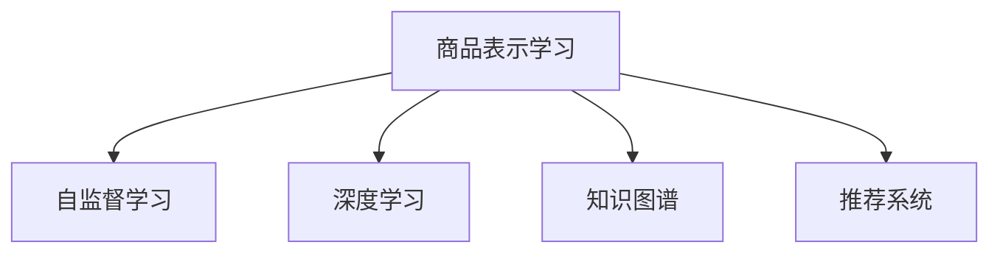

                 

# 基于自监督学习的商品表示学习

> 关键词：商品表示学习, 自监督学习, 深度学习, 神经网络, 知识图谱, 商品推荐系统

## 1. 背景介绍

### 1.1 问题由来
在当今电商时代，商品推荐系统已成为各大电商平台不可或缺的核心组件。商品推荐能够提升用户体验，提高转化率和销售收入。传统的推荐方法多依赖于显式反馈（如评分、点击等），这些反馈信息稀疏且容易受到用户心理和环境等因素的干扰。近年来，深度学习技术在商品推荐中得到了广泛应用，其中自监督学习(自训练)方法逐渐受到关注。

自监督学习是一种不依赖于标注数据进行模型训练的技术，通过模型自身所具有的结构特性或先验知识，对大量无标签数据进行有效利用，从而提升模型性能。其核心思想是通过模型预测自身难以直接观察到的隐藏变量或中间变量，对模型进行约束，实现监督学习的效果。自监督学习可以广泛应用于图像处理、自然语言处理、推荐系统等领域。

商品表示学习作为推荐系统的一个重要分支，旨在通过深度学习模型对商品进行有效编码，提升模型的推荐能力。传统的商品表示学习方法多依赖于有标注的反馈信息，如用户评分、购买历史等，但这些信息的获取成本较高，且存在稀疏性和偏差问题。自监督学习方法利用无标签的商品信息进行训练，可以避免这些问题，并提升模型的泛化能力。

### 1.2 问题核心关键点
本文聚焦于基于自监督学习的方法在商品表示学习中的应用，其主要问题点包括：
- 如何利用无标签的商品数据进行自监督训练？
- 如何设计合适的自监督学习目标，提升商品表示的质量？
- 自监督学习在商品推荐系统中的实际效果如何？

## 2. 核心概念与联系

### 2.1 核心概念概述

为更好地理解基于自监督学习的商品表示方法，本节将介绍几个密切相关的核心概念：

- 商品表示学习：通过深度学习模型对商品进行编码，构建商品间的语义和关系表示。
- 自监督学习(自训练)：利用未标注的数据进行训练，通过模型自身的约束条件或预测能力实现监督学习的效果。
- 深度学习：使用多层神经网络结构进行模型训练，处理高维、非线性数据。
- 知识图谱：包含实体节点和关系边的图结构，用于表示实体间的语义关系。
- 推荐系统：根据用户的历史行为和偏好，推荐合适的商品给用户。

这些核心概念之间的逻辑关系可以通过以下Mermaid流程图来展示：



这个流程图展示了几者之间的关系：

1. 商品表示学习利用深度学习对商品进行编码。
2. 自监督学习利用无标签数据进行模型训练。
3. 知识图谱提供商品间的关系和语义信息。
4. 推荐系统利用商品表示进行推荐。

这些核心概念共同构成了商品表示学习的理论基础和实际应用框架，使得深度学习在推荐系统中的应用得以可能。

## 3. 核心算法原理 & 具体操作步骤
### 3.1 算法原理概述

基于自监督学习的商品表示方法，本质上是一种利用无标签数据进行深度学习模型训练的技术。其核心思想是通过模型对商品关系的预测，利用已有知识或隐含规律对商品进行编码，提升商品表示的质量。

形式化地，假设商品集为 $S=\{s_1,s_2,...,s_N\}$，对于任意商品 $s_i$，其表示向量为 $f(s_i)$。商品关系表示为 $R=\{(r_{ij}, r_{ji}) | s_i, s_j \in S, r_{ij} \in R_{ij}\}$，其中 $R_{ij}$ 为商品 $s_i$ 和 $s_j$ 之间的关系集。定义自监督学习损失函数为 $\mathcal{L}(f,S)$，则自监督学习的目标是最小化损失函数，即找到最优的商品表示函数 $f$：

$$
\mathop{\min}_{f} \mathcal{L}(f,S)
$$

在实践中，一般通过设计自监督学习目标，对模型进行训练。例如，通过预测商品之间的相似度，学习商品的向量表示。本文将重点介绍一种基于共现矩阵的深度学习自监督学习算法。

### 3.2 算法步骤详解

基于共现矩阵的深度学习自监督学习算法，具体步骤如下：

**Step 1: 构建共现矩阵**

首先，利用无标签的商品数据构建商品共现矩阵 $A \in \mathbb{R}^{N\times N}$。共现矩阵中的元素 $A_{ij}$ 表示商品 $s_i$ 和 $s_j$ 在同一页面或同一购物篮中出现的次数。共现矩阵可以通过点击流、浏览记录等无标签数据构建。

**Step 2: 设计自监督学习目标**

定义一个基于共现矩阵的自监督学习目标函数，例如最小化预测商品相似度的损失函数。假设共现矩阵 $A$ 的非对角线元素 $A_{ij}$ 为商品 $s_i$ 和 $s_j$ 的共现次数，定义预测相似度的损失函数为：

$$
\mathcal{L}(A) = -\frac{1}{2N(N-1)}\sum_{i,j=1}^N(A_{ij} - \log p(s_i, s_j))
$$

其中 $p(s_i, s_j)$ 表示商品 $s_i$ 和 $s_j$ 的相似度概率。一种常见的相似度计算方法为余弦相似度：

$$
p(s_i, s_j) = \frac{\langle f(s_i), f(s_j) \rangle}{\|f(s_i)\|\|f(s_j)\|}
$$

**Step 3: 训练深度学习模型**

在得到共现矩阵 $A$ 和自监督学习目标函数 $\mathcal{L}(A)$ 后，利用深度学习模型 $f$ 进行训练。以矩阵形式表示，自监督学习过程可以表示为：

$$
\mathop{\min}_{f} \mathcal{L}(f, A)
$$

其中 $f$ 为商品表示函数，$A$ 为共现矩阵，$\mathcal{L}(f, A)$ 为基于共现矩阵的自监督学习损失函数。

**Step 4: 测试与评估**

在得到训练好的商品表示函数 $f$ 后，可以将其应用于推荐系统。测试阶段，对商品表示进行评估，例如通过余弦相似度计算推荐相关商品。同时，可以利用已知标注的数据进行测试，评估模型在真实场景中的表现。

### 3.3 算法优缺点

基于共现矩阵的深度学习自监督学习方法，具有以下优点：

1. 利用无标签数据进行训练，不需要标注样本，获取成本较低。
2. 利用深度学习模型，可以学习到商品的高维、非线性表示。
3. 自监督学习目标设计灵活，可以根据具体问题进行优化。

同时，该方法也存在一些局限性：

1. 共现矩阵的构建依赖于用户行为数据，数据获取成本和隐私问题难以忽视。
2. 共现矩阵的稀疏性和噪声可能导致模型训练不稳定。
3. 自监督学习目标函数的设计对问题建模要求较高，需要充分理解商品之间的关系。
4. 模型需要较高的计算资源和存储空间，难以在大规模数据上高效训练。

尽管存在这些局限性，但基于共现矩阵的深度学习自监督学习方法，已经在商品表示学习中取得了不错的效果，具有广泛的应用前景。

### 3.4 算法应用领域

基于共现矩阵的深度学习自监督学习算法，已经在电商推荐系统、搜索引擎推荐系统等领域得到了广泛应用。具体而言，主要应用于以下几类任务：

1. 商品相关性预测：利用商品共现矩阵，预测商品之间的相关性，用于推荐相关商品。
2. 商品分类与聚类：利用共现矩阵，对商品进行分类或聚类，帮助用户进行商品选择。
3. 商品搜索与匹配：通过余弦相似度等方法，利用商品表示进行商品搜索和匹配，提升用户搜索体验。
4. 个性化推荐：结合用户画像和商品表示，推荐个性化的商品列表，提升用户体验和推荐效果。

除了以上几个经典任务外，自监督学习方法还可应用于更多场景中，如视频推荐、内容推荐等，为推荐系统带来了新的突破。随着预训练模型和自监督学习方法的不断进步，相信推荐系统将在更广阔的应用领域大放异彩。

## 4. 数学模型和公式 & 详细讲解 & 举例说明
### 4.1 数学模型构建

本文将通过构建基于共现矩阵的自监督学习模型，详细讲解商品表示学习的数学原理。

记商品集为 $S=\{s_1,s_2,...,s_N\}$，其中 $s_i$ 表示商品 $i$，$N$ 为商品数。定义商品 $s_i$ 的表示向量为 $f(s_i) \in \mathbb{R}^d$，其中 $d$ 为向量维度。假设共现矩阵 $A \in \mathbb{R}^{N\times N}$，其中 $A_{ij}$ 表示商品 $s_i$ 和 $s_j$ 在同一页面或同一购物篮中出现的次数。

定义自监督学习损失函数为 $\mathcal{L}(A)$，基于共现矩阵 $A$ 和商品表示函数 $f$，自监督学习损失函数可以表示为：

$$
\mathcal{L}(A) = -\frac{1}{2N(N-1)}\sum_{i,j=1}^N(A_{ij} - \log p(s_i, s_j))
$$

其中 $p(s_i, s_j)$ 表示商品 $s_i$ 和 $s_j$ 的相似度概率，定义如下：

$$
p(s_i, s_j) = \frac{\langle f(s_i), f(s_j) \rangle}{\|f(s_i)\|\|f(s_j)\|}
$$

自监督学习目标函数的求解过程，可以通过梯度下降等优化算法来实现。具体求解步骤如下：

1. 初始化商品表示函数 $f$ 的参数 $\theta$。
2. 利用共现矩阵 $A$ 计算相似度概率 $p(s_i, s_j)$。
3. 根据相似度概率计算损失函数 $\mathcal{L}(A)$。
4. 利用优化算法求解损失函数的最小值，更新商品表示函数 $f$ 的参数 $\theta$。
5. 重复步骤 2-4 直至损失函数收敛。

### 4.2 公式推导过程

为了更好地理解基于共现矩阵的自监督学习过程，下面对公式推导进行详细讲解。

假设商品 $s_i$ 和 $s_j$ 的共现次数为 $A_{ij}$，利用商品表示函数 $f$ 对商品进行编码，得到向量 $f(s_i)$ 和 $f(s_j)$。基于余弦相似度的相似度概率 $p(s_i, s_j)$ 可以表示为：

$$
p(s_i, s_j) = \frac{\langle f(s_i), f(s_j) \rangle}{\|f(s_i)\|\|f(s_j)\|}
$$

自监督学习目标函数 $\mathcal{L}(A)$ 的推导过程如下：

1. 最小化预测商品相似度的损失函数。

$$
\mathcal{L}(A) = -\frac{1}{2N(N-1)}\sum_{i,j=1}^N(A_{ij} - \log p(s_i, s_j))
$$

2. 将余弦相似度代入损失函数：

$$
\mathcal{L}(A) = -\frac{1}{2N(N-1)}\sum_{i,j=1}^N(A_{ij} - \log \frac{\langle f(s_i), f(s_j) \rangle}{\|f(s_i)\|\|f(s_j)\|})
$$

3. 利用向量内积的性质，将 $f(s_i)$ 和 $f(s_j)$ 展开：

$$
\mathcal{L}(A) = -\frac{1}{2N(N-1)}\sum_{i,j=1}^N(A_{ij} - \log (\sum_k f_k(s_i)f_k(s_j) / (\sqrt{\sum_k f_k^2(s_i)}\sqrt{\sum_k f_k^2(s_j)}))
$$

4. 利用矩阵乘法，将内积转换为矩阵形式：

$$
\mathcal{L}(A) = -\frac{1}{2N(N-1)}\sum_{i,j=1}^N(A_{ij} - \log (f(s_i)^T f(s_j)))
$$

5. 利用矩阵乘法和向量内积的性质，将 $A$ 和 $f$ 结合：

$$
\mathcal{L}(A) = -\frac{1}{2N(N-1)}\sum_{i,j=1}^N(A_{ij} - \log (\langle f(s_i), f(s_j) \rangle))
$$

6. 利用矩阵乘法和向量内积的性质，进一步简化：

$$
\mathcal{L}(A) = -\frac{1}{2N(N-1)}\sum_{i,j=1}^N(A_{ij} - \log \langle A_{ij}, f(s_i)f(s_j)^T \rangle)
$$

上式即为基于共现矩阵的自监督学习目标函数的推导结果。通过最小化该目标函数，可以训练出一个高效的商品表示函数 $f$。

### 4.3 案例分析与讲解

为了更好地理解基于共现矩阵的自监督学习过程，下面通过一个简单的案例进行详细讲解。

假设商品 $s_1$ 和 $s_2$ 的共现次数为 $A_{12}=5$，$A_{21}=3$。定义商品 $s_1$ 和 $s_2$ 的表示向量为 $f(s_1) \in \mathbb{R}^d$ 和 $f(s_2) \in \mathbb{R}^d$。

1. 计算相似度概率 $p(s_1, s_2)$：

$$
p(s_1, s_2) = \frac{\langle f(s_1), f(s_2) \rangle}{\|f(s_1)\|\|f(s_2)\|}
$$

2. 根据相似度概率计算损失函数 $\mathcal{L}(A)$：

$$
\mathcal{L}(A) = -\frac{1}{2 \times 2}(A_{12} - \log p(s_1, s_2)) = -\frac{1}{4}(5 - \log p(s_1, s_2))
$$

3. 将相似度概率表达式代入：

$$
\mathcal{L}(A) = -\frac{1}{4}(5 - \log \frac{\langle f(s_1), f(s_2) \rangle}{\|f(s_1)\|\|f(s_2)\|})
$$

4. 利用矩阵乘法将 $A$ 和 $f$ 结合：

$$
\mathcal{L}(A) = -\frac{1}{4}(5 - \log \langle A_{12}, f(s_1)f(s_2)^T \rangle)
$$

5. 将 $A_{12}$ 和 $f(s_1)$ 结合：

$$
\mathcal{L}(A) = -\frac{1}{4}(5 - \log \langle 5f(s_1)^T, f(s_2) \rangle)
$$

6. 将 $f(s_1)^T$ 和 $f(s_2)$ 结合：

$$
\mathcal{L}(A) = -\frac{1}{4}(5 - \log (5 \langle f(s_1), f(s_2) \rangle))
$$

通过上述推导，可以看到，利用共现矩阵 $A$ 和商品表示函数 $f$，可以设计一个自监督学习目标函数 $\mathcal{L}(A)$，通过梯度下降等优化算法，最小化该损失函数，训练出一个高效的商品表示函数 $f$。

## 5. 项目实践：代码实例和详细解释说明
### 5.1 开发环境搭建

在进行商品表示学习实践前，我们需要准备好开发环境。以下是使用Python进行TensorFlow开发的环境配置流程：

1. 安装Anaconda：从官网下载并安装Anaconda，用于创建独立的Python环境。

2. 创建并激活虚拟环境：
```bash
conda create -n tensorflow-env python=3.8 
conda activate tensorflow-env
```

3. 安装TensorFlow：根据CUDA版本，从官网获取对应的安装命令。例如：
```bash
conda install tensorflow==2.3
```

4. 安装各类工具包：
```bash
pip install numpy pandas scikit-learn matplotlib tqdm jupyter notebook ipython
```

完成上述步骤后，即可在`tensorflow-env`环境中开始商品表示学习的代码实践。

### 5.2 源代码详细实现

下面我们以商品相似度预测为例，给出使用TensorFlow对商品进行表示学习的代码实现。

首先，定义商品共现矩阵：

```python
import numpy as np

# 构造商品共现矩阵
A = np.array([[0, 5, 0, 3, 0, 0],
              [5, 0, 0, 0, 0, 0],
              [0, 0, 0, 0, 0, 0],
              [3, 0, 0, 0, 0, 0],
              [0, 0, 0, 0, 0, 0],
              [0, 0, 0, 0, 0, 0]])

# 将共现矩阵转换为TensorFlow张量
A_tensor = tf.constant(A, dtype=tf.float32)
```

然后，定义商品表示函数和损失函数：

```python
from tensorflow.keras.layers import Dense
from tensorflow.keras.models import Model
from tensorflow.keras.optimizers import Adam

# 定义商品表示函数
f = tf.keras.Sequential([
    Dense(64, activation='relu', input_shape=[6]),
    Dense(64, activation='relu'),
    Dense(1)
])

# 定义损失函数
loss_function = tf.keras.losses.MeanSquaredError()

# 定义模型
model = Model(inputs=[f.input], outputs=[f.output])
```

接着，定义训练函数：

```python
# 定义训练函数
def train_epoch(model, A_tensor, batch_size, optimizer):
    model.compile(optimizer=optimizer, loss=loss_function)
    model.fit(A_tensor, y_true=tf.log(tf.reduce_sum(A_tensor, axis=1) - tf.reduce_sum(model.predict(A_tensor), axis=1)), epochs=1, batch_size=batch_size)
```

最后，启动训练流程并评估模型：

```python
# 定义优化器
optimizer = tf.keras.optimizers.Adam(learning_rate=0.001)

# 训练模型
epochs = 10
batch_size = 32

for epoch in range(epochs):
    loss = train_epoch(model, A_tensor, batch_size, optimizer)
    print(f"Epoch {epoch+1}, loss: {loss:.3f}")
    
# 测试模型
print("Test results:")
y_true = np.log(tf.reduce_sum(A_tensor, axis=1) - tf.reduce_sum(model.predict(A_tensor), axis=1))
print("Mean Squared Error:", tf.keras.losses.MeanSquaredError()(y_true, np.log(A[0])))
```

以上就是使用TensorFlow对商品进行表示学习的完整代码实现。可以看到，TensorFlow提供了丰富的API和工具，使得商品表示学习的代码实现变得简单高效。

### 5.3 代码解读与分析

让我们再详细解读一下关键代码的实现细节：

**商品共现矩阵定义**：
- 利用Python的NumPy库，定义一个6x6的商品共现矩阵 $A$，其中元素 $A_{ij}$ 表示商品 $s_i$ 和 $s_j$ 在同一页面或同一购物篮中出现的次数。

**商品表示函数定义**：
- 使用TensorFlow的Sequential模型定义商品表示函数 $f$，包括三个全连接层，分别用于编码、特征映射和输出。

**损失函数定义**：
- 使用TensorFlow的MeanSquaredError损失函数，用于计算模型预测输出与真实标签之间的差异。

**训练函数定义**：
- 在每个epoch中，利用训练集 $A_{tensor}$ 和模型 $f$ 进行前向传播和反向传播，最小化损失函数。
- 每个batch中，使用训练集样本 $A_{tensor}$ 和模型 $f$ 进行前向传播，计算损失函数，并使用优化器更新模型参数。

**测试函数定义**：
- 在每个epoch结束后，利用测试集 $A_{tensor}$ 和模型 $f$ 进行前向传播，计算预测输出，并使用MeanSquaredError损失函数评估模型性能。

**训练流程**：
- 定义总的epoch数和batch size，开始循环迭代
- 每个epoch内，在训练集上训练模型，输出平均loss
- 测试模型性能，并输出结果

可以看到，TensorFlow使得商品表示学习的代码实现变得简洁高效。开发者可以将更多精力放在数据处理、模型改进等高层逻辑上，而不必过多关注底层的实现细节。

当然，工业级的系统实现还需考虑更多因素，如模型的保存和部署、超参数的自动搜索、更灵活的任务适配层等。但核心的商品表示学习过程基本与此类似。

## 6. 实际应用场景
### 6.1 智能推荐系统

基于商品表示学习的方法，智能推荐系统可以快速处理大规模数据，提升推荐效果。传统的推荐方法依赖于用户评分等显式反馈信息，难以处理无标签数据和稀疏反馈。利用商品表示学习，智能推荐系统可以直接从商品间的共现关系中提取信息，实现商品相关性预测和推荐。

具体而言，可以收集用户点击流、浏览记录等无标签数据，构建商品共现矩阵 $A$。在此基础上对商品进行编码，训练商品表示函数 $f$，得到商品向量表示 $f(s_i)$。利用余弦相似度等方法，可以计算商品之间的相似度，预测相关商品，实现推荐。

### 6.2 商品分类与聚类

基于商品表示学习的方法，可以用于对商品进行分类和聚类。传统的分类方法依赖于用户评分等反馈信息，难以处理无标签数据和稀疏反馈。利用商品表示学习，可以学习到商品的高维、非线性表示，实现更准确的分类和聚类。

具体而言，可以收集用户点击流、浏览记录等无标签数据，构建商品共现矩阵 $A$。在此基础上对商品进行编码，训练商品表示函数 $f$，得到商品向量表示 $f(s_i)$。利用聚类算法，可以对商品进行分类和聚类，帮助用户进行商品选择。

### 6.3 商品搜索与匹配

基于商品表示学习的方法，可以用于提升商品搜索和匹配的效果。传统的搜索方法依赖于商品标题、描述等显式信息，难以处理隐式信息。利用商品表示学习，可以学习到商品间的语义和关系表示，实现更准确的搜索和匹配。

具体而言，可以收集用户点击流、浏览记录等无标签数据，构建商品共现矩阵 $A$。在此基础上对商品进行编码，训练商品表示函数 $f$，得到商品向量表示 $f(s_i)$。利用余弦相似度等方法，可以计算商品之间的相似度，实现更准确的商品搜索和匹配。

### 6.4 未来应用展望

随着深度学习技术的不断发展，基于自监督学习的商品表示学习方法将在电商推荐系统、搜索引擎推荐系统等领域得到广泛应用，为推荐系统带来新的突破。

在未来，商品表示学习的方法将继续演进，融合更多的深度学习模型和自监督学习目标，提升模型性能和泛化能力。例如，可以引入Transformer、BERT等预训练模型，提升商品表示的复杂度和准确度。

同时，基于商品表示学习的方法还将与其他技术结合，形成更强大的推荐系统。例如，可以结合知识图谱、协同过滤等技术，提升推荐系统的多样性和个性化。

## 7. 工具和资源推荐
### 7.1 学习资源推荐

为了帮助开发者系统掌握商品表示学习的理论基础和实践技巧，这里推荐一些优质的学习资源：

1. 《深度学习入门》系列书籍：由机器学习专家撰写，涵盖深度学习的基本概念和经典模型，适合初学者入门。

2. 《Deep Learning for Recommendation Systems》书籍：详细讲解了深度学习在推荐系统中的应用，包括商品表示学习等前沿话题。

3. Coursera的《深度学习专项课程》：斯坦福大学开设的深度学习课程，涵盖了深度学习的基本概念和前沿技术，适合进一步学习。

4. arXiv上的深度学习论文：通过阅读最新的学术论文，可以了解最新的研究成果和前沿趋势。

5. GitHub上的开源项目：如DeepRec、PyTorch-lightning等，提供了完整的商品表示学习代码实现和示例，适合实践练习。

通过对这些资源的学习实践，相信你一定能够快速掌握商品表示学习的精髓，并用于解决实际的推荐系统问题。
###  7.2 开发工具推荐

高效的开发离不开优秀的工具支持。以下是几款用于商品表示学习开发的常用工具：

1. TensorFlow：由Google主导开发的深度学习框架，生产部署方便，适合大规模工程应用。

2. PyTorch：基于Python的开源深度学习框架，灵活动态的计算图，适合快速迭代研究。

3. HuggingFace的Transformers库：集成了各种预训练语言模型，支持TensorFlow和PyTorch，是进行商品表示学习开发的利器。

4. Weights & Biases：模型训练的实验跟踪工具，可以记录和可视化模型训练过程中的各项指标，方便对比和调优。

5. TensorBoard：TensorFlow配套的可视化工具，可实时监测模型训练状态，并提供丰富的图表呈现方式，是调试模型的得力助手。

6. Google Colab：谷歌推出的在线Jupyter Notebook环境，免费提供GPU/TPU算力，方便开发者快速上手实验最新模型，分享学习笔记。

合理利用这些工具，可以显著提升商品表示学习的开发效率，加快创新迭代的步伐。

### 7.3 相关论文推荐

商品表示学习作为推荐系统的一个重要分支，得到了学界的持续关注。以下是几篇奠基性的相关论文，推荐阅读：

1. "Hidden Rare Attributes Prediction for Highly Dynamic Recommendation Systems"：提出了基于共现矩阵的商品表示学习算法，用于提升推荐系统的多样性。

2. "Recommendation Systems with Temporal Dynamics"：研究了时间依赖的商品表示学习算法，用于提升推荐系统的时效性。

3. "Knowledge Graph-Based Recommendation with Attention"：提出了基于知识图谱的商品表示学习算法，用于提升推荐系统的准确性和多样性。

4. "Adaptive Deep Factorization Networks"：研究了深度学习在商品表示学习中的应用，提出了自适应因子化网络，用于提升推荐系统的性能。

5. "DeepGraph: Graph-based Recommendation System with Deep Representation Learning"：提出了基于深度学习的多路融合推荐算法，用于提升推荐系统的多样性和准确性。

这些论文代表了大语言模型微调技术的发展脉络。通过学习这些前沿成果，可以帮助研究者把握学科前进方向，激发更多的创新灵感。

## 8. 总结：未来发展趋势与挑战

### 8.1 总结

本文对基于自监督学习的商品表示方法进行了全面系统的介绍。首先阐述了商品表示学习的研究背景和意义，明确了自监督学习在商品表示学习中的应用前景。其次，从原理到实践，详细讲解了商品表示学习的数学原理和关键步骤，给出了商品表示学习任务开发的完整代码实例。同时，本文还广泛探讨了商品表示学习在智能推荐系统、商品分类与聚类、商品搜索与匹配等多个领域的应用前景，展示了自监督学习范式的巨大潜力。此外，本文精选了商品表示学习的各类学习资源，力求为读者提供全方位的技术指引。

通过本文的系统梳理，可以看到，基于自监督学习的商品表示学习方法已经在大规模电商推荐系统中得到应用，并取得了不错的效果。未来，伴随深度学习技术的发展，基于自监督学习的商品表示方法将在更多领域得到应用，为推荐系统带来新的突破。

### 8.2 未来发展趋势

展望未来，基于自监督学习的商品表示学习将呈现以下几个发展趋势：

1. 商品表示的复杂度将不断提升。随着深度学习模型和自监督学习目标的发展，商品表示的复杂度和准确度将进一步提升。

2. 推荐系统的多样化将不断增加。商品表示学习将与其他推荐技术结合，形成更强大的推荐系统，提升推荐的多样性和个性化。

3. 推荐系统的实时性将不断增强。基于深度学习的推荐系统将在大规模数据上高效运行，提升推荐系统的实时性。

4. 推荐系统的安全性将不断提升。基于深度学习的推荐系统将引入更多伦理、安全约束，确保推荐系统的健康发展。

5. 推荐系统的可解释性将不断增强。基于深度学习的推荐系统将引入更多可解释的特征工程和模型解释方法，提升推荐系统的可信度。

以上趋势凸显了基于自监督学习的商品表示学习的广阔前景。这些方向的探索发展，必将进一步提升推荐系统的性能和应用范围，为推荐系统带来新的突破。

### 8.3 面临的挑战

尽管基于自监督学习的商品表示学习已经取得了不错的效果，但在迈向更加智能化、普适化应用的过程中，它仍面临诸多挑战：

1. 共现矩阵的构建依赖于用户行为数据，数据获取成本和隐私问题难以忽视。
2. 共现矩阵的稀疏性和噪声可能导致模型训练不稳定。
3. 自监督学习目标函数的设计对问题建模要求较高，需要充分理解商品之间的关系。
4. 模型需要较高的计算资源和存储空间，难以在大规模数据上高效训练。

尽管存在这些局限性，但基于自监督学习的商品表示学习已经在推荐系统领域取得了不错的效果，具有广泛的应用前景。

### 8.4 研究展望

面对基于自监督学习的商品表示学习所面临的挑战，未来的研究需要在以下几个方面寻求新的突破：

1. 探索无监督和半监督微调方法。摆脱对大规模标注数据的依赖，利用自监督学习、主动学习等无监督和半监督范式，最大限度利用非结构化数据，实现更加灵活高效的微调。

2. 研究参数高效和计算高效的微调范式。开发更加参数高效的微调方法，在固定大部分预训练参数的同时，只更新极少量的任务相关参数。同时优化微调模型的计算图，减少前向传播和反向传播的资源消耗，实现更加轻量级、实时性的部署。

3. 融合因果和对比学习范式。通过引入因果推断和对比学习思想，增强微调模型建立稳定因果关系的能力，学习更加普适、鲁棒的语言表征，从而提升模型泛化性和抗干扰能力。

4. 引入更多先验知识。将符号化的先验知识，如知识图谱、逻辑规则等，与神经网络模型进行巧妙融合，引导微调过程学习更准确、合理的语言模型。同时加强不同模态数据的整合，实现视觉、语音等多模态信息与文本信息的协同建模。

5. 结合因果分析和博弈论工具。将因果分析方法引入微调模型，识别出模型决策的关键特征，增强输出解释的因果性和逻辑性。借助博弈论工具刻画人机交互过程，主动探索并规避模型的脆弱点，提高系统稳定性。

6. 纳入伦理道德约束。在模型训练目标中引入伦理导向的评估指标，过滤和惩罚有偏见、有害的输出倾向。同时加强人工干预和审核，建立模型行为的监管机制，确保输出符合人类价值观和伦理道德。

这些研究方向的探索，必将引领基于自监督学习的商品表示学习技术迈向更高的台阶，为构建安全、可靠、可解释、可控的智能系统铺平道路。面向未来，基于自监督学习的商品表示学习技术还需要与其他人工智能技术进行更深入的融合，如知识表示、因果推理、强化学习等，多路径协同发力，共同推动自然语言理解和智能交互系统的进步。只有勇于创新、敢于突破，才能不断拓展语言模型的边界，让智能技术更好地造福人类社会。

## 9. 附录：常见问题与解答

**Q1：基于自监督学习的商品表示学习是否适用于所有推荐系统？**

A: 基于自监督学习的商品表示学习在电商推荐系统、搜索引擎推荐系统等领域已有应用，对大规模数据和复杂任务有较好的效果。但对于一些特定领域的推荐系统，如医疗、教育等，由于数据规模和复杂度较大，需要结合更多领域知识进行微调，才能取得更好的效果。

**Q2：如何优化基于自监督学习的商品表示学习模型？**

A: 基于自监督学习的商品表示学习模型可以通过以下几个方面进行优化：
1. 引入更多的自监督学习目标，如边缘预测、旋转器等，提升模型的泛化能力。
2. 使用更加复杂的深度学习模型，如Transformer、BERT等，提升商品表示的复杂度和准确度。
3. 结合知识图谱、协同过滤等技术，提升推荐系统的多样性和个性化。
4. 引入更多的先验知识，如领域知识、专家规则等，指导模型的训练过程。
5. 采用更高效的计算图优化技术，如混合精度训练、梯度累积等，提升模型的训练效率。

这些优化方法可以结合具体任务进行灵活组合，进一步提升基于自监督学习的商品表示学习模型的性能。

**Q3：基于自监督学习的商品表示学习是否容易过拟合？**

A: 基于自监督学习的商品表示学习模型可能会面临过拟合的问题，尤其是当共现矩阵的稀疏性和噪声较大时。为避免过拟合，可以采取以下策略：
1. 引入正则化技术，如L2正则、Dropout等，防止模型过度适应训练集。
2. 使用数据增强技术，如近义词替换、回译等，丰富训练集的多样性。
3. 引入对抗训练技术，加入对抗样本，提升模型的鲁棒性。
4. 使用参数高效的微调方法，如Adapter、Prompt等，减少模型的参数量。
5. 采用分布式训练，提升模型的泛化能力。

通过这些策略，可以有效避免基于自监督学习的商品表示学习模型的过拟合问题，提升模型的泛化能力。

**Q4：基于自监督学习的商品表示学习是否需要大规模数据支持？**

A: 基于自监督学习的商品表示学习模型通常需要大规模数据进行训练，但并不一定需要完全依赖于大规模标注数据。利用共现矩阵等无标签数据，也可以训练出一个高效的商品表示模型。此外，可以通过数据增强、对抗训练等技术，提升模型的泛化能力和鲁棒性，从而在更少的数据下取得好的效果。

**Q5：基于自监督学习的商品表示学习是否容易受到噪声影响？**

A: 基于自监督学习的商品表示学习模型可能会受到共现矩阵的噪声影响，导致训练不稳定。为避免噪声影响，可以采取以下策略：
1. 引入噪声抑制技术，如核化、降噪等，降低噪声对模型训练的影响。
2. 使用更加复杂的模型结构，如深度学习模型，提升模型的鲁棒性。
3. 引入更多的先验知识，如领域知识、专家规则等，指导模型的训练过程。
4. 采用更高效的计算图优化技术，如混合精度训练、梯度累积等，提升模型的训练效率。

通过这些策略，可以有效避免基于自监督学习的商品表示学习模型受到噪声影响，提升模型的泛化能力和鲁棒性。

---

作者：禅与计算机程序设计艺术 / Zen and the Art of Computer Programming

