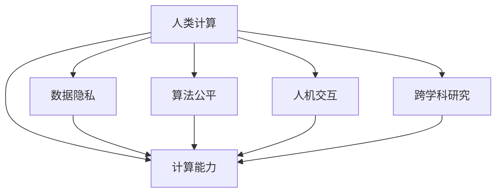

                 

## 1. 背景介绍

### 1.1 问题由来

随着科技的迅猛发展和计算能力的不断提升，人类计算已经从传统的机械式计算，逐步迈向智能式计算。在数字化时代，计算已经成为推动经济增长、社会进步、生活改善的重要引擎。然而，尽管计算能力日益强大，但人类在计算中的核心作用仍不可替代。

### 1.2 问题核心关键点

当前，人类计算在数字化时代扮演着以下关键角色：

1. **数据洞察与决策支持**：通过分析海量数据，人类计算能够提炼出有价值的洞见，辅助决策者制定战略和规划。
2. **知识创新与技术突破**：人类凭借丰富的领域知识，推动新技术、新理论、新方法的产生和发展。
3. **伦理监管与价值引导**：在计算过程中，人类能够对数据隐私、算法公平、社会伦理等方面进行监督和引导，确保计算的可持续性和人性化。
4. **人际交互与用户体验**：在计算系统的设计和使用中，人类发挥着关键的桥梁作用，提升系统的人机交互体验和用户满意度。
5. **交叉融合与跨学科研究**：计算与多个学科领域的深度融合，推动了跨学科研究的发展，为解决复杂问题提供了新的视角和方法。

这些关键点体现了人类计算在数字时代的多维度作用，是实现可持续发展和社会进步的基石。

### 1.3 问题研究意义

深入研究人类计算在数字化时代的作用，对于推动技术进步、促进社会和谐、保障个人隐私等方面具有重要意义：

1. **技术创新**：理解人类计算的核心作用，有助于探索计算技术的边界，推动新技术、新方法的发展。
2. **社会责任**：明确计算的伦理边界，确保技术进步能够造福全人类，避免技术滥用带来的负面影响。
3. **经济增长**：通过优化计算过程和增强用户体验，推动数字经济的发展，促进经济增长和就业。
4. **文化传承**：在计算中融入人文精神和道德伦理，弘扬中华优秀传统文化，促进文化繁荣。

## 2. 核心概念与联系

### 2.1 核心概念概述

为更好地理解人类计算在数字时代的作用，本节将介绍几个密切相关的核心概念：

- **人类计算**：指人类运用自身的认知能力、逻辑推理能力和创造力，在计算过程中发挥的关键作用。
- **计算能力**：指计算机系统处理数据、执行任务的能力，是计算的基础设施。
- **数据隐私**：指在计算过程中，保护个人和组织数据不被滥用、泄露的措施和制度。
- **算法公平**：指在计算模型和算法设计中，确保不同群体、不同背景的人能够公平受益。
- **人机交互**：指人类与计算机系统之间的信息交换和操作过程，是计算系统的核心环节。
- **跨学科研究**：指将计算技术与多个学科领域的知识和方法进行交叉融合，解决复杂问题。

这些核心概念之间的逻辑关系可以通过以下Mermaid流程图来展示：



这个流程图展示的人类计算的核心概念及其之间的关系：

1. 人类计算依托于强大的计算能力，提供数据洞察和决策支持。
2. 数据隐私和算法公平确保计算的可持续性和人性化。
3. 人机交互提升用户体验，确保计算系统的易用性。
4. 跨学科研究推动技术进步，解决复杂问题。

这些概念共同构成了数字时代计算的基础框架，使得计算能够更好地服务于社会和人类。

## 3. 核心算法原理 & 具体操作步骤

### 3.1 算法原理概述

人类计算的核心算法原理主要包括以下几个方面：

- **数据挖掘与分析**：通过数据挖掘技术，从海量数据中提取有价值的洞见，辅助决策制定。
- **模式识别与预测**：利用机器学习算法，识别数据中的模式和趋势，进行预测和推断。
- **自然语言处理**：通过自然语言处理技术，理解和生成自然语言，实现人机交互。
- **知识图谱构建**：构建知识图谱，将知识和信息以结构化的形式进行表示，提升计算的准确性和可靠性。
- **计算伦理与规范**：制定计算伦理规范，确保计算过程的透明性、公正性和安全性。

### 3.2 算法步骤详解

基于人类计算的核心算法原理，一般的计算步骤包括：

1. **数据采集与清洗**：收集和处理原始数据，去除噪音和冗余信息。
2. **模型训练与优化**：使用机器学习算法，训练和优化模型，提升预测和推断能力。
3. **结果解读与反馈**：解析模型输出结果，结合领域知识进行解读，形成决策支持。
4. **系统部署与监控**：将计算模型部署到实际应用中，实时监控和调整系统性能。
5. **用户交互与反馈**：与用户进行交互，收集反馈，持续改进计算系统。

### 3.3 算法优缺点

人类计算的核心算法具有以下优点：

- **灵活性高**：能够根据具体任务和场景灵活调整计算模型和参数，适应性强。
- **知识密集**：结合人类领域知识，提升计算的准确性和可靠性。
- **人机协同**：实现人机协同，提升计算的效率和用户体验。

同时，也存在一些局限性：

- **资源消耗高**：计算过程依赖大量数据和计算资源，成本较高。
- **复杂度大**：涉及多学科知识的交叉融合，复杂度高。
- **不确定性**：计算结果受数据质量和模型选择的影响，存在一定的不确定性。

尽管存在这些局限性，但人类计算的独特优势，使得其在数字时代仍然占据重要地位。未来，随着计算技术的不断进步和资源成本的降低，人类计算的作用将更加凸显。

### 3.4 算法应用领域

人类计算的核心算法在多个领域得到了广泛应用：

- **医疗健康**：利用计算技术进行疾病诊断、患者监护、药物研发等，提升医疗服务水平。
- **金融科技**：在风险管理、投资决策、智能客服等领域，提升金融服务的智能化和精准度。
- **教育培训**：在智能推荐、智能评估、智能辅导等领域，提升教育培训的个性化和有效性。
- **工业制造**：在预测维护、智能制造、质量控制等领域，提升工业生产的自动化和智能化水平。
- **智慧城市**：在城市管理、交通调度、公共安全等领域，提升城市的智能化和便捷性。

## 4. 数学模型和公式 & 详细讲解

### 4.1 数学模型构建

本节将使用数学语言对人类计算的核心算法进行更加严格的刻画。

假设输入数据为 $x$，输出结果为 $y$，计算过程可表示为函数 $f(x)$，即 $y=f(x)$。

在实际计算中，数据 $x$ 通常为高维向量，计算过程 $f$ 通常为复杂函数。因此，为了简化计算，需要定义适当的数学模型。

### 4.2 公式推导过程

以线性回归模型为例，假设数据 $x$ 和输出 $y$ 之间的关系可以表示为线性方程 $y=wx+b$，其中 $w$ 和 $b$ 为模型参数。

通过最小二乘法，可以得到模型参数的优化公式：

$$
w=\frac{\sum_{i=1}^N(x_i-\bar{x})(y_i-\bar{y})}{\sum_{i=1}^N(x_i-\bar{x})^2}, \quad b=\bar{y}-w\bar{x}
$$

其中，$\bar{x}$ 和 $\bar{y}$ 分别为数据 $x$ 和 $y$ 的均值。

通过求解上述优化公式，可以得到线性回归模型的参数 $w$ 和 $b$，用于预测新的数据。

### 4.3 案例分析与讲解

以金融风险管理为例，通过计算技术，可以构建风险评估模型，对客户信用风险进行预测。

具体而言，收集客户的财务数据和信用历史数据，构建特征向量 $x$，利用上述线性回归模型，预测客户未来的违约概率 $y$。

在模型训练和优化过程中，需要采用交叉验证、正则化等技术，避免过拟合和欠拟合，提升模型的泛化能力。

## 5. 项目实践：代码实例和详细解释说明

### 5.1 开发环境搭建

在进行计算项目实践前，我们需要准备好开发环境。以下是使用Python进行Scikit-learn开发的环境配置流程：

1. 安装Anaconda：从官网下载并安装Anaconda，用于创建独立的Python环境。

2. 创建并激活虚拟环境：
```bash
conda create -n myenv python=3.8 
conda activate myenv
```

3. 安装Scikit-learn：
```bash
pip install scikit-learn
```

4. 安装各类工具包：
```bash
pip install numpy pandas scikit-learn matplotlib tqdm jupyter notebook ipython
```

完成上述步骤后，即可在`myenv`环境中开始计算实践。

### 5.2 源代码详细实现

下面我们以金融风险管理为例，给出使用Scikit-learn进行线性回归模型训练和预测的PyTorch代码实现。

```python
import pandas as pd
import numpy as np
from sklearn.model_selection import train_test_split
from sklearn.linear_model import LinearRegression
from sklearn.metrics import mean_squared_error

# 加载数据
data = pd.read_csv('credit_data.csv')
X = data[['income', 'loan_amount', 'loan_term', 'credit_score']]
y = data['default']

# 划分训练集和测试集
X_train, X_test, y_train, y_test = train_test_split(X, y, test_size=0.2, random_state=42)

# 定义模型
model = LinearRegression()

# 训练模型
model.fit(X_train, y_train)

# 预测结果
y_pred = model.predict(X_test)

# 评估模型
mse = mean_squared_error(y_test, y_pred)
print(f"Mean Squared Error: {mse:.2f}")
```

### 5.3 代码解读与分析

让我们再详细解读一下关键代码的实现细节：

**数据加载与划分**：
- 使用pandas库加载数据集，提取特征和标签。
- 使用train_test_split函数划分训练集和测试集。

**模型定义与训练**：
- 定义线性回归模型，使用fit函数对训练集进行模型拟合。

**预测与评估**：
- 使用predict函数对测试集进行预测，使用mean_squared_error函数评估模型性能。

可以看到，Scikit-learn提供了简洁高效的API，使得模型的开发和评估变得轻松便捷。通过几行代码，就能构建、训练和评估一个简单的线性回归模型。

## 6. 实际应用场景

### 6.1 智能医疗

在智能医疗领域，人类计算的应用主要集中在疾病诊断、治疗方案推荐和健康管理等方面。

通过计算技术，可以构建医疗知识图谱，整合大量的医学文献、临床数据和患者信息，提升诊断的准确性和治疗方案的个性化。例如，利用深度学习算法，对医学影像进行分析和诊断，提高早期筛查的效率和准确度。

### 6.2 智能金融

在智能金融领域，人类计算的应用主要集中在风险管理、投资决策和智能客服等方面。

通过计算技术，可以构建金融风险评估模型，对客户信用进行预测，辅助贷款审批。同时，利用自然语言处理技术，构建智能客服系统，提升客户服务体验。

### 6.3 智能教育

在智能教育领域，人类计算的应用主要集中在智能推荐、智能评估和智能辅导等方面。

通过计算技术，可以构建智能推荐系统，根据学生的学习行为和成绩，推荐合适的学习资源和练习题。利用自然语言处理技术，构建智能评估系统，自动批改作业和考试，提供详细的反馈。同时，利用聊天机器人等技术，构建智能辅导系统，提供个性化的学习辅导。

### 6.4 未来应用展望

随着计算技术的不断进步，人类计算将在更多领域得到应用，为社会和人类带来深远影响。

在智慧城市治理中，利用计算技术，可以实现智能交通、智能安防、智能公共服务等功能，提升城市的智能化和便捷性。

在环境监测和保护中，利用计算技术，可以实时监测环境数据，预警环境风险，提升环保工作的效率和效果。

在文化娱乐中，利用计算技术，可以实现智能推荐、智能创作和智能分析等功能，提升文化娱乐的体验和质量。

## 7. 工具和资源推荐

### 7.1 学习资源推荐

为了帮助开发者系统掌握人类计算的理论基础和实践技巧，这里推荐一些优质的学习资源：

1. 《深度学习》系列书籍：由深度学习领域的权威专家撰写，系统介绍了深度学习的基本原理和实际应用。
2. 《机器学习实战》系列书籍：提供大量实际案例，帮助读者理解和应用机器学习算法。
3. 《Python数据科学手册》：详细介绍了Python在数据科学中的应用，包括数据处理、分析和可视化。
4. Kaggle平台：提供丰富的数据集和竞赛项目，帮助开发者提高数据处理和模型训练的能力。
5. Coursera平台：提供各类机器学习和数据科学课程，涵盖从入门到高级的各个阶段。

通过这些学习资源，相信你一定能够快速掌握人类计算的理论基础和实践技巧，并用于解决实际的计算问题。

### 7.2 开发工具推荐

高效的开发离不开优秀的工具支持。以下是几款用于人类计算开发的常用工具：

1. Python：Python语言简洁易用，生态系统丰富，是计算领域的主流编程语言。
2. Jupyter Notebook：提供交互式编程环境，支持代码和文本的混合编辑，方便数据处理和模型训练。
3. Scikit-learn：提供丰富的机器学习算法和工具，支持数据预处理、模型训练和评估。
4. TensorFlow和PyTorch：提供强大的深度学习框架，支持复杂的神经网络模型训练和推理。
5. Hadoop和Spark：提供大规模数据处理和分布式计算能力，支持海量数据的存储和分析。

合理利用这些工具，可以显著提升人类计算的开发效率，加快创新迭代的步伐。

### 7.3 相关论文推荐

人类计算的研究源于学界的持续研究。以下是几篇奠基性的相关论文，推荐阅读：

1. "A Tutorial on Support Vector Regression"：介绍了支持向量回归算法，应用于金融风险预测等领域。
2. "Deep Learning for Health"：综述了深度学习在医疗健康领域的应用，包括医学影像分析、疾病诊断等。
3. "Advances in Natural Language Processing: A Survey of Surveys"：综述了自然语言处理领域的进展，涵盖文本分类、语言模型等。
4. "GANs Trained by a Two Time-Scale Update Rule Converge to the Naive Mode"：介绍了生成对抗网络（GAN），应用于图像生成、数据增强等领域。
5. "Human-AI Collaboration in Medicine: Can Computers Be Doctors, or Should They Be Assistants?"：讨论了人类与AI在医疗领域的合作模式，提出了未来医疗AI的发展方向。

这些论文代表了大数据和计算技术的发展脉络。通过学习这些前沿成果，可以帮助研究者把握学科前进方向，激发更多的创新灵感。

## 8. 总结：未来发展趋势与挑战

### 8.1 总结

本文对人类计算在数字化时代的作用进行了全面系统的介绍。首先阐述了人类计算的核心作用，明确了计算在数据洞察、知识创新、伦理监管等方面的独特价值。其次，从原理到实践，详细讲解了人类计算的数学模型和核心算法，给出了人类计算任务开发的完整代码实例。同时，本文还广泛探讨了人类计算在医疗、金融、教育等多个行业领域的应用前景，展示了人类计算的巨大潜力。此外，本文精选了人类计算技术的各类学习资源，力求为读者提供全方位的技术指引。

通过本文的系统梳理，可以看到，人类计算在数字时代的多维度作用，是实现可持续发展和社会进步的基石。人类计算的核心算法能够与计算技术深度融合，推动技术进步，促进社会和谐，保障个人隐私，提升用户体验，传承中华优秀传统文化，推动文化繁荣。

### 8.2 未来发展趋势

展望未来，人类计算将呈现以下几个发展趋势：

1. **计算技术的融合创新**：计算技术与人工智能、大数据、物联网等领域的深度融合，将带来更多创新应用，提升社会治理和服务的智能化水平。
2. **多模态计算的普及**：计算技术将从单一模态向多模态发展，支持跨模态数据的整合和分析，提升数据处理和应用的多样性。
3. **计算伦理的规范完善**：随着计算技术的广泛应用，计算伦理规范的制定和完善将日益重要，确保计算过程的透明性、公正性和安全性。
4. **计算系统的跨学科研究**：计算技术与各学科领域的深度融合，将推动跨学科研究的发展，解决更多复杂问题。

这些趋势将引领人类计算技术迈向更高的台阶，为构建安全、可靠、可解释、可控的智能系统铺平道路。

### 8.3 面临的挑战

尽管人类计算已经取得了瞩目成就，但在迈向更加智能化、普适化应用的过程中，它仍面临着诸多挑战：

1. **数据隐私和安全**：随着数据量的增长，数据隐私和安全问题日益突出，如何在保障隐私的前提下，实现高效的数据处理和分析，是一个重要挑战。
2. **计算资源消耗**：大规模计算任务对计算资源的需求不断增加，如何在资源有限的情况下，提升计算效率和性能，是一个亟待解决的问题。
3. **计算模型的透明性**：复杂计算模型的决策过程难以解释，如何提高模型的透明性和可解释性，是一个重要研究方向。
4. **计算技术的伦理问题**：计算技术的广泛应用可能带来伦理问题，如何确保技术的公正性和普适性，是一个亟待解决的问题。
5. **计算系统的可维护性**：随着计算系统的复杂度增加，系统的可维护性面临挑战，如何提高系统的可维护性和可扩展性，是一个重要研究方向。

这些挑战需要学界和产业界的共同努力，才能逐步克服，推动人类计算技术的可持续发展。

### 8.4 研究展望

未来，在人类计算技术的研究方向上，有以下几个重点方向：

1. **计算伦理与规范**：制定计算伦理规范，确保计算过程的透明性、公正性和安全性。
2. **计算模型的透明性**：提高计算模型的透明性和可解释性，增强计算系统的可信度和可维护性。
3. **计算资源优化**：优化计算资源的使用，提高计算效率和性能，降低资源成本。
4. **跨学科融合**：推动计算技术与各学科领域的深度融合，解决更多复杂问题，推动科学研究和技术进步。

通过这些研究方向的研究和实践，人类计算技术必将在数字时代发挥更加重要的作用，为构建安全、可靠、可解释、可控的智能系统提供新的突破。

## 9. 附录：常见问题与解答

**Q1：人类计算在数据隐私方面如何保护数据安全？**

A: 数据隐私保护是计算过程中不可或缺的重要环节。为了保护数据隐私，可以采用以下方法：

1. **数据脱敏**：将敏感信息进行脱敏处理，保护用户隐私。
2. **加密技术**：使用加密算法对数据进行加密，确保数据传输和存储的安全性。
3. **访问控制**：通过访问控制机制，限制数据访问权限，确保数据只被授权人员访问。
4. **差分隐私**：在数据分析过程中，引入差分隐私技术，保护数据个体隐私。

这些方法可以在数据采集、存储、传输和分析的各个环节进行应用，确保数据隐私和安全。

**Q2：人类计算在计算效率方面如何提升计算性能？**

A: 计算效率是衡量计算性能的重要指标，提升计算效率的方法包括：

1. **并行计算**：利用多核CPU、GPU、TPU等设备进行并行计算，提高计算速度。
2. **分布式计算**：将计算任务分配到多个计算节点上，实现分布式计算，提高计算效率。
3. **算法优化**：优化计算算法，减少计算复杂度，提高计算效率。
4. **数据压缩**：对数据进行压缩，减少数据存储和传输的体积，提高计算效率。

这些方法可以在数据处理、模型训练、模型推理等各个环节进行应用，提升计算性能。

**Q3：人类计算在计算透明性方面如何增强模型可解释性？**

A: 计算透明性是确保计算过程可信度的重要因素，增强模型可解释性的方法包括：

1. **模型可视化**：通过模型可视化技术，展示模型的决策过程和特征重要性，帮助用户理解模型。
2. **可解释性算法**：采用可解释性算法，如LIME、SHAP等，解释模型的预测结果。
3. **知识图谱**：构建知识图谱，将领域知识和计算模型相结合，增强模型的解释性和可信度。

这些方法可以在模型训练和应用的过程中进行应用，增强计算系统的透明性和可解释性。

**Q4：人类计算在计算技术伦理方面如何确保技术的公正性和普适性？**

A: 计算技术的伦理问题是一个复杂且重要的研究方向，确保技术的公正性和普适性的方法包括：

1. **伦理规范制定**：制定计算伦理规范，确保计算过程的透明性、公正性和安全性。
2. **算法公平性**：在算法设计过程中，确保不同群体、不同背景的人能够公平受益，避免算法偏见。
3. **用户参与**：鼓励用户参与计算系统的设计和优化，确保系统的公正性和普适性。
4. **持续监督**：对计算系统进行持续监督和评估，确保系统的公正性和普适性。

这些方法可以在计算系统的设计、开发、应用和监督的各个环节进行应用，确保技术的公正性和普适性。

---

作者：禅与计算机程序设计艺术 / Zen and the Art of Computer Programming

