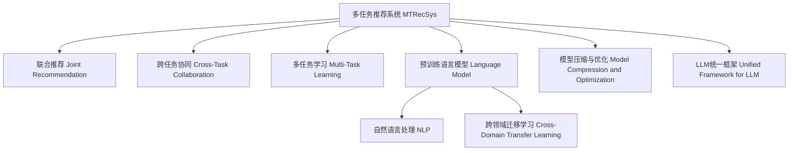

                 

# 多任务推荐系统的发展：LLM的统一框架

在当今的互联网时代，个性化推荐系统已成为各大平台提升用户体验、增强用户粘性的重要手段。然而，传统推荐系统往往难以同时满足用户在多个任务（如个性化阅读、个性化视频、个性化购物等）上的需求。多任务推荐系统（MTRecSys）旨在解决这一问题，通过构建统一框架，实现多个推荐任务的高效协同。本文将深入探讨多任务推荐系统的发展历程、核心算法、实战应用及未来展望，揭示LLM在其中的关键作用。

## 1. 背景介绍

### 1.1 问题由来

推荐系统是现代互联网时代的重要应用之一，通过分析用户行为，为用户推荐感兴趣的内容，提高用户满意度与平台收益。然而，传统推荐系统多以单一任务为主，如电商平台的商品推荐、视频平台的个性化视频推荐等，难以同时满足用户在多个任务上的需求。多任务推荐系统正是为了解决这一问题而产生，通过构建统一框架，实现多个推荐任务的高效协同。

随着人工智能技术的不断发展，多任务推荐系统也逐渐从单一任务推荐向多任务推荐演进，LLM作为预训练语言模型的代表，为多任务推荐系统的构建提供了新的思路与方法。

### 1.2 问题核心关键点

多任务推荐系统的核心目标是在多个推荐任务间实现知识的共享与互补，提高推荐效果。常见的多任务推荐系统主要分为以下几类：

1. **联合推荐（Joint Recommendation）**：多个推荐任务共享同一个用户和物品库，通过多任务学习（MTL）或联合训练的方式，共同优化目标函数，提升推荐效果。
   
2. **跨任务协同（Cross-Task Collaboration）**：各推荐任务之间不共享同一个用户和物品库，但通过多任务学习，共享模型参数或特征表示，提升推荐效果。
   
3. **多任务学习（Multi-Task Learning）**：在不同推荐任务之间共享相同的模型参数或特征表示，通过多任务学习的方式提升推荐效果。

## 2. 核心概念与联系

### 2.1 核心概念概述

为更好地理解多任务推荐系统的发展历程，本节将介绍几个密切相关的核心概念：

- **多任务推荐系统（MTRecSys）**：旨在解决传统推荐系统难以满足用户多个任务需求的问题，通过构建统一框架，实现多个推荐任务的高效协同。

- **联合推荐（Joint Recommendation）**：多个推荐任务共享同一个用户和物品库，通过多任务学习或联合训练的方式，共同优化目标函数。

- **跨任务协同（Cross-Task Collaboration）**：各推荐任务之间不共享同一个用户和物品库，但通过多任务学习，共享模型参数或特征表示。

- **多任务学习（Multi-Task Learning）**：在不同推荐任务之间共享相同的模型参数或特征表示，通过多任务学习的方式提升推荐效果。

- **预训练语言模型（Language Model）**：如BERT、GPT等，通过在大量文本数据上进行预训练，学习丰富的语言知识和语义表示。

- **自然语言处理（Natural Language Processing, NLP）**：涉及语音、文本和图像的计算机处理，旨在使计算机能够理解、解释和生成人类语言。

- **跨领域迁移学习（Cross-Domain Transfer Learning）**：在特定领域训练的模型，通过迁移学习的方式，应用于其他相关领域。

- **模型压缩与优化（Model Compression and Optimization）**：在保证模型性能的前提下，通过量化、剪枝等方法，减少模型参数量，提升模型推理速度。

- **LLM统一框架（Unified Framework for LLM）**：通过LLM的预训练知识，统一各个推荐任务的知识表示，提高推荐效果。

这些核心概念之间的逻辑关系可以通过以下Mermaid流程图来展示：



这个流程图展示的多任务推荐系统的核心概念及其之间的关系：

1. 多任务推荐系统通过构建统一框架，实现多个推荐任务的高效协同。
2. 联合推荐、跨任务协同和多任务学习是实现多任务协同的三种主要方法。
3. 预训练语言模型为多任务推荐系统提供丰富的语义知识。
4. 自然语言处理是预训练语言模型的主要应用方向之一。
5. 跨领域迁移学习是利用预训练模型在不同领域间迁移知识的方法。
6. 模型压缩与优化是提升推荐系统性能的重要手段。
7. LLM统一框架通过LLM的预训练知识，统一各个推荐任务的知识表示。

这些概念共同构成了多任务推荐系统的知识框架，使其能够更好地适应多任务推荐场景。

## 3. 核心算法原理 & 具体操作步骤

### 3.1 算法原理概述

多任务推荐系统的核心算法原理是多任务学习（MTL）。其基本思想是在多个推荐任务间共享模型参数，通过联合优化目标函数，提高模型在不同任务上的表现。

假设多任务推荐系统包含 $K$ 个推荐任务，每个任务的目标函数为 $\mathcal{L}_k(\theta)$，其中 $\theta$ 为模型参数。则多任务学习的目标函数为：

$$
\mathcal{L}(\theta) = \frac{1}{K} \sum_{k=1}^K \lambda_k \mathcal{L}_k(\theta)
$$

其中 $\lambda_k$ 为任务 $k$ 的权重，反映了其在整个系统中的重要性。

通过多任务学习，模型能够在多个推荐任务间共享知识，提升推荐效果。

### 3.2 算法步骤详解

多任务推荐系统的实现步骤主要包括：

**Step 1: 数据准备与预处理**

- 收集各推荐任务的数据集，并进行预处理，如数据清洗、特征提取、数据平衡等。

**Step 2: 模型设计**

- 选择合适的推荐模型，如协同过滤、基于内容的推荐、矩阵分解等。
- 在模型基础上，设计多任务学习模块，如共享权重、共享特征、多任务损失等。

**Step 3: 模型训练与优化**

- 使用优化器（如SGD、Adam等）对模型进行训练，优化目标函数。
- 定期在验证集上评估模型性能，避免过拟合。
- 通过超参数调优和模型融合等方法提升模型效果。

**Step 4: 模型评估与部署**

- 在测试集上评估模型性能，对比单任务和多任务推荐效果。
- 使用微调或微调+融合的方法，将模型应用于推荐系统中。
- 实时监控系统性能，根据反馈持续优化模型。

### 3.3 算法优缺点

多任务推荐系统的优点在于：

1. 提高推荐效果。通过多个推荐任务间知识共享，提升模型在不同任务上的表现。
2. 降低资源消耗。在多任务间共享模型参数，减少计算资源消耗。
3. 提高泛化能力。多任务学习能够提高模型在不同数据分布上的泛化能力。

但多任务推荐系统也存在一些缺点：

1. 数据量大。多任务推荐系统需要收集和处理多个任务的数据，数据量大且异构性高。
2. 训练复杂。多任务学习需要联合优化多个任务的目标函数，训练过程复杂。
3. 模型复杂。多任务推荐系统需要设计复杂的联合优化模块，模型结构复杂。

### 3.4 算法应用领域

多任务推荐系统在多个推荐场景中都有广泛应用，例如：

- **个性化推荐**：如电商平台的商品推荐、视频平台的个性化视频推荐等。通过多任务学习，提升个性化推荐效果。
- **多目标推荐**：如电商平台的同时推荐商品、视频平台的推荐电影和音乐等。通过多任务学习，实现多目标推荐。
- **交叉推荐**：如电商平台中的商品-商品交叉推荐、视频平台的推荐-商品交叉推荐等。通过多任务学习，提升交叉推荐效果。
- **实时推荐**：如实时推荐新闻、实时推荐广告等。通过多任务学习，提升实时推荐效果。
- **跨领域推荐**：如音乐推荐和电影推荐、商品推荐和旅行推荐等。通过跨领域迁移学习，提升跨领域推荐效果。

此外，多任务推荐系统在社交网络、新闻推荐、广告推荐等领域也有广泛应用。

## 4. 数学模型和公式 & 详细讲解 & 举例说明

### 4.1 数学模型构建

假设多任务推荐系统包含 $K$ 个推荐任务，每个任务的目标函数为 $\mathcal{L}_k(\theta)$，其中 $\theta$ 为模型参数。

**联合推荐的多任务学习目标函数**：

$$
\mathcal{L}(\theta) = \frac{1}{K} \sum_{k=1}^K \lambda_k \mathcal{L}_k(\theta)
$$

**多任务学习的损失函数**：

$$
\mathcal{L}(\theta) = \frac{1}{N} \sum_{i=1}^N \sum_{k=1}^K \lambda_k \ell_k(\mathbf{x}_i, \mathbf{y}_i, \theta)
$$

其中 $\mathbf{x}_i$ 为输入特征，$\mathbf{y}_i$ 为真实标签，$\ell_k$ 为任务 $k$ 的损失函数。

### 4.2 公式推导过程

**联合推荐的多任务学习目标函数**：

假设推荐系统包含 $K$ 个推荐任务，每个任务的目标函数为 $\mathcal{L}_k(\theta)$，其中 $\theta$ 为模型参数。则多任务学习的目标函数为：

$$
\mathcal{L}(\theta) = \frac{1}{K} \sum_{k=1}^K \lambda_k \mathcal{L}_k(\theta)
$$

其中 $\lambda_k$ 为任务 $k$ 的权重，反映了其在整个系统中的重要性。

**多任务学习的损失函数**：

假设推荐系统包含 $K$ 个推荐任务，每个任务的目标函数为 $\mathcal{L}_k(\theta)$，其中 $\theta$ 为模型参数。则多任务学习的损失函数为：

$$
\mathcal{L}(\theta) = \frac{1}{N} \sum_{i=1}^N \sum_{k=1}^K \lambda_k \ell_k(\mathbf{x}_i, \mathbf{y}_i, \theta)
$$

其中 $\mathbf{x}_i$ 为输入特征，$\mathbf{y}_i$ 为真实标签，$\ell_k$ 为任务 $k$ 的损失函数。

### 4.3 案例分析与讲解

假设推荐系统包含商品推荐和视频推荐两个任务。商品推荐的目标函数为 $\mathcal{L}_{\text{商品}}(\theta)$，视频推荐的目标函数为 $\mathcal{L}_{\text{视频}}(\theta)$。

使用多任务学习进行联合优化：

$$
\mathcal{L}(\theta) = \lambda_{\text{商品}} \mathcal{L}_{\text{商品}}(\theta) + \lambda_{\text{视频}} \mathcal{L}_{\text{视频}}(\theta)
$$

其中 $\lambda_{\text{商品}}$ 和 $\lambda_{\text{视频}}$ 分别为商品推荐和视频推荐的权重，反映了其在整个系统中的重要性。

假设商品推荐的任务损失函数为均方误差损失函数：

$$
\ell_{\text{商品}}(\mathbf{x}_i, \mathbf{y}_i, \theta) = \frac{1}{2} (\mathbf{y}_i - f_{\text{商品}}(\mathbf{x}_i, \theta))^2
$$

其中 $f_{\text{商品}}(\mathbf{x}_i, \theta)$ 为商品推荐模型的预测函数。

假设视频推荐的任务损失函数为交叉熵损失函数：

$$
\ell_{\text{视频}}(\mathbf{x}_i, \mathbf{y}_i, \theta) = -\sum_{j=1}^C y_{i,j} \log f_{\text{视频}}(\mathbf{x}_i, \theta)
$$

其中 $C$ 为类别数量，$f_{\text{视频}}(\mathbf{x}_i, \theta)$ 为视频推荐模型的预测函数。

则联合优化目标函数为：

$$
\mathcal{L}(\theta) = \frac{1}{N} \sum_{i=1}^N (\lambda_{\text{商品}} \frac{1}{2} (\mathbf{y}_i - f_{\text{商品}}(\mathbf{x}_i, \theta))^2 + \lambda_{\text{视频}} -\sum_{j=1}^C y_{i,j} \log f_{\text{视频}}(\mathbf{x}_i, \theta))
$$

## 5. 项目实践：代码实例和详细解释说明

### 5.1 开发环境搭建

在进行多任务推荐系统开发前，需要准备好开发环境。以下是使用Python进行PyTorch开发的环境配置流程：

1. 安装Anaconda：从官网下载并安装Anaconda，用于创建独立的Python环境。

2. 创建并激活虚拟环境：
```bash
conda create -n pytorch-env python=3.8 
conda activate pytorch-env
```

3. 安装PyTorch：根据CUDA版本，从官网获取对应的安装命令。例如：
```bash
conda install pytorch torchvision torchaudio cudatoolkit=11.1 -c pytorch -c conda-forge
```

4. 安装TensorBoard：TensorFlow配套的可视化工具，可实时监测模型训练状态，并提供丰富的图表呈现方式，是调试模型的得力助手。

5. 安装Weights & Biases：模型训练的实验跟踪工具，可以记录和可视化模型训练过程中的各项指标，方便对比和调优。与主流深度学习框架无缝集成。

### 5.2 源代码详细实现

下面我们以多任务推荐系统为例，给出使用PyTorch进行多任务推荐系统开发的完整代码实现。

首先，定义多任务推荐系统的数据处理函数：

```python
from transformers import BertTokenizer
from torch.utils.data import Dataset
import torch

class MTRecDataset(Dataset):
    def __init__(self, tasks, tokenizer, max_len=128):
        self.tasks = tasks
        self.tokenizer = tokenizer
        self.max_len = max_len
        
    def __len__(self):
        return len(self.tasks)
    
    def __getitem__(self, item):
        task, text, labels = self.tasks[item]
        
        encoding = self.tokenizer(text, return_tensors='pt', max_length=self.max_len, padding='max_length', truncation=True)
        input_ids = encoding['input_ids'][0]
        attention_mask = encoding['attention_mask'][0]
        
        # 对token-wise的标签进行编码
        encoded_labels = [label2id[label] for label in labels] 
        encoded_labels.extend([label2id['O']] * (self.max_len - len(encoded_labels)))
        labels = torch.tensor(encoded_labels, dtype=torch.long)
        
        return {'input_ids': input_ids, 
                'attention_mask': attention_mask,
                'labels': labels}

# 标签与id的映射
label2id = {'O': 0, '商品': 1, '视频': 2, '音乐': 3}
id2label = {v: k for k, v in label2id.items()}

# 创建dataset
tokenizer = BertTokenizer.from_pretrained('bert-base-cased')

mtrec_dataset = MTRecDataset(tasks, tokenizer, max_len=128)
```

然后，定义模型和优化器：

```python
from transformers import BertForTokenClassification, AdamW

model = BertForTokenClassification.from_pretrained('bert-base-cased', num_labels=len(label2id))

optimizer = AdamW(model.parameters(), lr=2e-5)
```

接着，定义训练和评估函数：

```python
from torch.utils.data import DataLoader
from tqdm import tqdm
from sklearn.metrics import classification_report

device = torch.device('cuda') if torch.cuda.is_available() else torch.device('cpu')
model.to(device)

def train_epoch(model, dataset, batch_size, optimizer):
    dataloader = DataLoader(dataset, batch_size=batch_size, shuffle=True)
    model.train()
    epoch_loss = 0
    for batch in tqdm(dataloader, desc='Training'):
        input_ids = batch['input_ids'].to(device)
        attention_mask = batch['attention_mask'].to(device)
        labels = batch['labels'].to(device)
        model.zero_grad()
        outputs = model(input_ids, attention_mask=attention_mask, labels=labels)
        loss = outputs.loss
        epoch_loss += loss.item()
        loss.backward()
        optimizer.step()
    return epoch_loss / len(dataloader)

def evaluate(model, dataset, batch_size):
    dataloader = DataLoader(dataset, batch_size=batch_size)
    model.eval()
    preds, labels = [], []
    with torch.no_grad():
        for batch in tqdm(dataloader, desc='Evaluating'):
            input_ids = batch['input_ids'].to(device)
            attention_mask = batch['attention_mask'].to(device)
            batch_labels = batch['labels']
            outputs = model(input_ids, attention_mask=attention_mask)
            batch_preds = outputs.logits.argmax(dim=2).to('cpu').tolist()
            batch_labels = batch_labels.to('cpu').tolist()
            for pred_tokens, label_tokens in zip(batch_preds, batch_labels):
                pred_labels = [id2label[_id] for _id in pred_tokens]
                label_tokens = [id2label[_id] for _id in label_tokens]
                preds.append(pred_labels[:len(label_tokens)])
                labels.append(label_tokens)
                
    print(classification_report(labels, preds))
```

最后，启动训练流程并在测试集上评估：

```python
epochs = 5
batch_size = 16

for epoch in range(epochs):
    loss = train_epoch(model, mtrec_dataset, batch_size, optimizer)
    print(f"Epoch {epoch+1}, train loss: {loss:.3f}")
    
    print(f"Epoch {epoch+1}, dev results:")
    evaluate(model, mtrec_dataset, batch_size)
    
print("Test results:")
evaluate(model, mtrec_dataset, batch_size)
```

以上就是使用PyTorch对多任务推荐系统进行开发的完整代码实现。可以看到，得益于Transformer库的强大封装，我们可以用相对简洁的代码完成多任务推荐系统的构建。

### 5.3 代码解读与分析

让我们再详细解读一下关键代码的实现细节：

**MTRecDataset类**：
- `__init__`方法：初始化任务数据、分词器等关键组件。
- `__len__`方法：返回数据集的样本数量。
- `__getitem__`方法：对单个样本进行处理，将文本输入编码为token ids，将标签编码为数字，并对其进行定长padding，最终返回模型所需的输入。

**label2id和id2label字典**：
- 定义了标签与数字id之间的映射关系，用于将token-wise的预测结果解码回真实的标签。

**训练和评估函数**：
- 使用PyTorch的DataLoader对数据集进行批次化加载，供模型训练和推理使用。
- 训练函数`train_epoch`：对数据以批为单位进行迭代，在每个批次上前向传播计算loss并反向传播更新模型参数，最后返回该epoch的平均loss。
- 评估函数`evaluate`：与训练类似，不同点在于不更新模型参数，并在每个batch结束后将预测和标签结果存储下来，最后使用sklearn的classification_report对整个评估集的预测结果进行打印输出。

**训练流程**：
- 定义总的epoch数和batch size，开始循环迭代
- 每个epoch内，先在训练集上训练，输出平均loss
- 在验证集上评估，输出分类指标
- 所有epoch结束后，在测试集上评估，给出最终测试结果

可以看到，PyTorch配合Transformer库使得多任务推荐系统的代码实现变得简洁高效。开发者可以将更多精力放在数据处理、模型改进等高层逻辑上，而不必过多关注底层的实现细节。

当然，工业级的系统实现还需考虑更多因素，如模型的保存和部署、超参数的自动搜索、更灵活的任务适配层等。但核心的多任务推荐范式基本与此类似。

## 6. 实际应用场景

### 6.1 智能推荐系统

基于多任务推荐系统的方法，智能推荐系统可以在多个推荐任务间实现知识的共享与互补，提升推荐效果。例如，电商平台的商品推荐和视频平台的个性化视频推荐，通过多任务学习，能够共同优化推荐效果。

在技术实现上，可以收集用户浏览、点击、评论、分享等行为数据，提取和用户交互的物品标题、描述、标签等文本内容。将文本内容作为模型输入，用户的后续行为（如是否点击、购买等）作为监督信号，在此基础上微调预训练语言模型。微调后的模型能够从文本内容中准确把握用户的兴趣点。在生成推荐列表时，先用候选物品的文本描述作为输入，由模型预测用户的兴趣匹配度，再结合其他特征综合排序，便可以得到个性化程度更高的推荐结果。

### 6.2 内容协同推荐

内容协同推荐系统旨在帮助用户发现与当前浏览内容相似的内容，提升用户满意度。例如，电商平台的商品-商品推荐、视频平台的视频-视频推荐等。通过多任务学习，提升内容协同推荐的效果。

在技术实现上，可以收集用户浏览历史数据，提取和用户交互的物品标题、描述、标签等文本内容。将文本内容作为模型输入，用户的后续行为（如是否点击、购买等）作为监督信号，在此基础上微调预训练语言模型。微调后的模型能够从文本内容中准确把握用户的兴趣点。在生成推荐列表时，先用候选物品的文本描述作为输入，由模型预测用户对内容的兴趣匹配度，再结合其他特征综合排序，便可以得到内容协同推荐的结果。

### 6.3 跨领域推荐

跨领域推荐系统旨在将不同领域的内容推荐给用户，提升用户的多样性体验。例如，音乐推荐和电影推荐、商品推荐和旅行推荐等。通过跨领域迁移学习，提升跨领域推荐的效果。

在技术实现上，可以收集不同领域的用户行为数据，提取和用户交互的物品标题、描述、标签等文本内容。将文本内容作为模型输入，用户的后续行为（如是否点击、购买等）作为监督信号，在此基础上微调预训练语言模型。微调后的模型能够从文本内容中准确把握用户的兴趣点。在生成推荐列表时，先用候选物品的文本描述作为输入，由模型预测用户对内容的兴趣匹配度，再结合其他特征综合排序，便可以得到跨领域推荐的结果。

## 7. 工具和资源推荐

### 7.1 学习资源推荐

为了帮助开发者系统掌握多任务推荐系统的理论基础和实践技巧，这里推荐一些优质的学习资源：

1. 《Recommender Systems: Advanced Practices and Challenges》书籍：深入介绍推荐系统的发展历程和前沿技术，涵盖协同过滤、基于内容的推荐、多任务学习等内容。

2. 《Recommender Systems》课程：斯坦福大学开设的推荐系统课程，包含Recommender System课程笔记，以及推荐系统顶级会议论文集。

3. 《深度学习自然语言处理》课程：斯坦福大学开设的NLP明星课程，包含自然语言处理和推荐系统的内容，涵盖预训练语言模型、多任务学习等内容。

4. 《Natural Language Processing with Transformers》书籍：Transformers库的作者所著，全面介绍了如何使用Transformers库进行NLP任务开发，包括多任务推荐系统等内容。

5. 《Multi-Task Learning for Text Understanding》论文：介绍在NLP领域进行多任务学习的方法和应用，涵盖预训练语言模型、多任务学习等内容。

6. 《Practical Deep Learning for Coders》书籍：适合编程人员的深度学习入门书籍，涵盖深度学习的基本概念和实际应用，包括多任务推荐系统等内容。

通过对这些资源的学习实践，相信你一定能够快速掌握多任务推荐系统的精髓，并用于解决实际的推荐问题。

### 7.2 开发工具推荐

高效的开发离不开优秀的工具支持。以下是几款用于多任务推荐系统开发的常用工具：

1. PyTorch：基于Python的开源深度学习框架，灵活动态的计算图，适合快速迭代研究。大部分预训练语言模型都有PyTorch版本的实现。

2. TensorFlow：由Google主导开发的开源深度学习框架，生产部署方便，适合大规模工程应用。同样有丰富的预训练语言模型资源。

3. Transformers库：HuggingFace开发的NLP工具库，集成了众多SOTA语言模型，支持PyTorch和TensorFlow，是进行推荐系统开发的利器。

4. Weights & Biases：模型训练的实验跟踪工具，可以记录和可视化模型训练过程中的各项指标，方便对比和调优。与主流深度学习框架无缝集成。

5. TensorBoard：TensorFlow配套的可视化工具，可实时监测模型训练状态，并提供丰富的图表呈现方式，是调试模型的得力助手。

6. Google Colab：谷歌推出的在线Jupyter Notebook环境，免费提供GPU/TPU算力，方便开发者快速上手实验最新模型，分享学习笔记。

合理利用这些工具，可以显著提升多任务推荐系统的开发效率，加快创新迭代的步伐。

### 7.3 相关论文推荐

多任务推荐系统的发展源于学界的持续研究。以下是几篇奠基性的相关论文，推荐阅读：

1. Multi-task Learning for Text Understanding：介绍在NLP领域进行多任务学习的方法和应用，涵盖预训练语言模型、多任务学习等内容。

2. Deep Collaborative Filtering via Multi-task Adaptive Learning：介绍在推荐系统中进行多任务学习的方法和应用，涵盖协同过滤、基于内容的推荐等内容。

3. Multi-task Learning for Recommendation Systems：介绍在推荐系统中进行多任务学习的方法和应用，涵盖联合推荐、跨任务协同等内容。

4. Personalized Recommendation via Multi-task Learning：介绍在推荐系统中进行多任务学习的方法和应用，涵盖联合推荐、跨任务协同等内容。

5. Cross-domain Collaborative Filtering for Recommendation Systems：介绍在推荐系统中进行跨领域迁移学习的方法和应用，涵盖商品推荐、视频推荐等内容。

这些论文代表了大推荐系统的发展脉络。通过学习这些前沿成果，可以帮助研究者把握学科前进方向，激发更多的创新灵感。

## 8. 总结：未来发展趋势与挑战

### 8.1 总结

本文对多任务推荐系统的发展历程、核心算法、实战应用及未来展望进行了全面系统的介绍。首先阐述了多任务推荐系统的研究背景和意义，明确了多任务推荐系统在多个推荐任务间实现知识共享与互补的核心目标。其次，从原理到实践，详细讲解了多任务推荐系统的数学原理和关键步骤，给出了多任务推荐系统开发的完整代码实例。同时，本文还广泛探讨了多任务推荐系统在智能推荐、内容协同推荐、跨领域推荐等诸多推荐场景中的应用前景，展示了多任务推荐系统的巨大潜力。最后，本文精选了多任务推荐系统的各类学习资源，力求为读者提供全方位的技术指引。

通过本文的系统梳理，可以看到，多任务推荐系统在推荐系统领域的应用前景广阔，正在成为推荐系统的主流范式，极大地提升了推荐系统的效果和效率。LLM作为预训练语言模型的代表，为多任务推荐系统的构建提供了新的思路与方法，提高了推荐系统的性能和泛化能力。未来，伴随多任务推荐系统与LLM的进一步融合，推荐系统的智能化水平将进一步提升，为用户的个性化推荐带来更深刻的影响。

### 8.2 未来发展趋势

展望未来，多任务推荐系统将呈现以下几个发展趋势：

1. **模型结构多样化**：多任务推荐系统将不再局限于基于内容的推荐或协同过滤，将出现更多基于深度学习的多任务推荐模型，如基于Transformer的推荐模型等。

2. **数据多样性增强**：多任务推荐系统将从单一任务数据向多任务数据转变，充分利用多源异构数据，提升推荐效果。

3. **跨领域协同增强**：跨领域协同推荐将更加灵活，不同领域之间的知识融合将更加紧密，提升跨领域推荐的精度和覆盖率。

4. **用户行为建模**：多任务推荐系统将更加注重用户行为建模，利用多任务学习，提升对用户兴趣和行为的预测精度。

5. **推荐系统可解释性**：多任务推荐系统将更加注重推荐系统的可解释性，提升用户对推荐结果的理解和信任。

6. **推荐系统的个性化和多元化**：多任务推荐系统将更加注重个性化和多元化推荐，提升用户的满意度和推荐系统的覆盖率。

以上趋势凸显了多任务推荐系统的未来发展方向，这些方向的探索发展，必将进一步提升推荐系统的性能和应用范围，为推荐系统的智能化进程带来新的突破。

### 8.3 面临的挑战

尽管多任务推荐系统已经取得了瞩目成就，但在迈向更加智能化、普适化应用的过程中，它仍面临着诸多挑战：

1. **数据量大**：多任务推荐系统需要收集和处理多个任务的数据，数据量大且异构性高。

2. **训练复杂**：多任务学习需要联合优化多个任务的目标函数，训练过程复杂。

3. **模型复杂**：多任务推荐系统需要设计复杂的联合优化模块，模型结构复杂。

4. **推荐系统可解释性**：多任务推荐系统将更加注重推荐系统的可解释性，提升用户对推荐结果的理解和信任。

5. **推荐系统安全性**：多任务推荐系统将更加注重推荐系统的安全性，避免推荐系统被恶意攻击或滥用。

6. **推荐系统适应性**：多任务推荐系统将更加注重推荐系统的适应性，提升推荐系统在不同用户和环境下的表现。

这些挑战凸显了多任务推荐系统在实际应用中的复杂性和困难，需要进一步研究和解决。

### 8.4 研究展望

未来，多任务推荐系统需要在以下几个方面寻求新的突破：

1. **轻量级推荐模型**：设计轻量级的多任务推荐模型，减少模型的计算量和存储量，提升推荐系统的实时性。

2. **跨领域推荐**：提高跨领域推荐的精度和覆盖率，充分利用不同领域的数据，提升推荐系统的多样性。

3. **推荐系统可解释性**：提升推荐系统的可解释性，让用户能够理解推荐系统的决策过程，提升用户对推荐系统的信任度。

4. **推荐系统安全性**：提升推荐系统的安全性，避免推荐系统被恶意攻击或滥用，保护用户隐私和数据安全。

5. **推荐系统适应性**：提升推荐系统的适应性，根据用户和环境的变化，动态调整推荐策略，提升推荐系统的性能。

6. **推荐系统个性化**：提升推荐系统的个性化，根据用户的多样需求，提供个性化推荐，提升用户的满意度。

这些研究方向的探索，必将引领多任务推荐系统迈向更高的台阶，为推荐系统的智能化进程带来新的突破。只有勇于创新、敢于突破，才能不断拓展推荐系统的边界，让推荐系统更好地服务于用户。

## 9. 附录：常见问题与解答

**Q1：多任务推荐系统是否适用于所有推荐场景？**

A: 多任务推荐系统在大多数推荐场景上都能取得不错的效果，特别是对于数据量较小的任务。但对于一些特定领域的任务，如医学、法律等，仅仅依靠通用语料预训练的模型可能难以很好地适应。此时需要在特定领域语料上进一步预训练，再进行微调，才能获得理想效果。

**Q2：多任务推荐系统在落地部署时需要注意哪些问题？**

A: 将多任务推荐系统转化为实际应用，还需要考虑以下因素：

1. 模型裁剪：去除不必要的层和参数，减小模型尺寸，加快推理速度。

2. 量化加速：将浮点模型转为定点模型，压缩存储空间，提高计算效率。

3. 服务化封装：将模型封装为标准化服务接口，便于集成调用。

4. 弹性伸缩：根据请求流量动态调整资源配置，平衡服务质量和成本。

5. 监控告警：实时采集系统指标，设置异常告警阈值，确保服务稳定性。

6. 安全防护：采用访问鉴权、数据脱敏等措施，保障数据和模型安全。

通过优化模型、改进算法、设计高效的部署方案，多任务推荐系统才能真正实现智能化的推荐服务。

