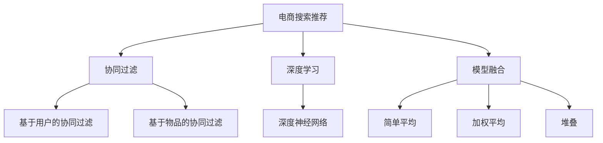

                 

# 大数据与AI 时代的电商搜索推荐：模型融合技术是关键

> 关键词：电商搜索推荐, 模型融合, 特征工程, 深度学习, 协同过滤, 多模型集成, 推荐系统, 推荐算法

## 1. 背景介绍

随着电子商务的迅猛发展，如何为用户推荐最符合其需求的商品，成为电商企业必须解决的重要问题。推荐系统的核心目的是通过数据分析挖掘用户行为特征，从而在大量商品中筛选出用户可能感兴趣的商品，提高用户满意度和购物体验，同时提升平台转化率和销售额。推荐系统的成功与否，直接关系到电商企业的竞争力和用户体验。

在推荐系统的演进过程中，从早期的基于规则和协同过滤的推荐方法，到如今主流的深度学习和协同过滤的混合推荐模型，技术在不断发展。推荐系统的核心挑战在于如何高效地整合海量用户数据和商品信息，准确挖掘用户和商品的潜在关联，并构建精准的推荐模型。其中，模型融合技术，作为推荐系统核心技术之一，通过将多种推荐算法和模型进行集成，形成更加稳健、高效的推荐系统，成为电商搜索推荐的重要技术手段。

本文将围绕电商搜索推荐中的模型融合技术进行深入探讨，分别从背景介绍、核心概念与联系、核心算法原理与具体操作步骤、数学模型与公式详细讲解、项目实践、实际应用场景、工具和资源推荐、总结与展望、常见问题与解答等多个方面，系统性地阐述模型融合技术在电商搜索推荐中的重要性及其实现思路。

## 2. 核心概念与联系

### 2.1 核心概念概述

在电商搜索推荐中，推荐系统的核心任务是使用用户的历史行为数据和商品的属性信息，通过机器学习算法预测用户对商品的评分或点击概率，进而推荐最符合用户需求的商品。常用的推荐算法包括协同过滤、深度学习等，每种算法都有其优势和局限。

- **协同过滤**：基于用户历史行为数据的推荐算法。通过分析用户之间的相似性和商品之间的关联性，推荐相似用户喜欢的商品或商品被相似用户喜欢的商品。协同过滤包括基于用户的协同过滤和基于物品的协同过滤两种。

- **深度学习**：利用神经网络模型对用户和商品的特征进行学习，建立用户和商品的隐向量表示，并通过隐向量之间的相似度计算推荐商品。

- **模型融合**：将多种推荐算法和模型进行集成，形成更稳健、高效的推荐系统。融合方式包括简单平均、加权平均、堆叠等，融合模型通常包含深度学习模型和协同过滤模型。

### 2.2 核心概念原理和架构的 Mermaid 流程图



该图展示了电商搜索推荐系统中协同过滤、深度学习、模型融合等关键技术之间的联系和作用。协同过滤和深度学习作为推荐系统的核心算法，分别负责捕捉用户行为和商品属性的特征表示，而模型融合技术通过将这两种算法进行集成，进一步提升推荐系统的精准度和稳定性。

## 3. 核心算法原理 & 具体操作步骤

### 3.1 算法原理概述

模型融合技术的核心思想是利用多个推荐算法或模型的优势，将它们组合起来形成一个更加强大的推荐系统。模型融合包括多个步骤，从特征提取、模型训练到融合算法的选择，都需要细致设计和调整。

1. **特征提取**：提取用户和商品的特征，通常包括历史行为数据、商品属性、用户画像等。

2. **模型训练**：分别训练协同过滤模型和深度学习模型，得到初步的推荐结果。

3. **模型融合**：将多个推荐结果进行融合，得到最终的推荐结果。

4. **模型评估**：使用交叉验证、A/B测试等方法，评估融合模型的性能。

### 3.2 算法步骤详解

以下将详细阐述模型融合的具体步骤和实现方法。

**Step 1: 数据预处理与特征工程**

数据预处理和特征工程是模型融合的第一步，也是影响推荐系统效果的关键环节。对于电商搜索推荐系统，需要收集用户的历史行为数据、商品的属性信息等，并进行数据清洗、去重、归一化等预处理工作。

**Step 2: 特征提取与表示**

特征提取和表示是将原始数据转化为机器学习模型能够处理的形式。对于电商搜索推荐，常用的特征包括用户的点击历史、浏览记录、评分、年龄、性别等，以及商品的类别、价格、品牌、评价等。特征提取通常使用向量表示，如TF-IDF、Word2Vec等，将文本特征转化为数值型特征。

**Step 3: 协同过滤模型训练**

协同过滤模型基于用户历史行为数据，使用相似性度量方法计算用户和商品的相似性，从而推荐用户可能喜欢的商品。协同过滤模型包括基于用户的协同过滤和基于物品的协同过滤两种，分别计算用户和商品之间的相似度。

- **基于用户的协同过滤**：计算用户之间的相似性，为用户推荐其他用户喜欢的商品。
- **基于物品的协同过滤**：计算商品之间的相似性，为用户推荐与用户历史行为相似的商品。

**Step 4: 深度学习模型训练**

深度学习模型利用神经网络对用户和商品的特征进行学习，建立用户和商品的隐向量表示，并通过隐向量之间的相似度计算推荐商品。深度学习模型通常使用多层感知器(MLP)、卷积神经网络(CNN)、循环神经网络(RNN)等，通过反向传播算法训练模型参数。

**Step 5: 模型融合与推荐**

模型融合是推荐系统中的关键步骤，将协同过滤和深度学习模型的推荐结果进行融合，得到最终的推荐结果。常用的融合方法包括简单平均、加权平均、堆叠等。

- **简单平均**：对多个模型的推荐结果进行平均，得到最终推荐结果。
- **加权平均**：根据模型的性能和参数复杂度，对多个模型的推荐结果进行加权平均，得到最终推荐结果。
- **堆叠**：将多个模型的输出作为输入，训练一个元模型进行最终预测。

**Step 6: 模型评估与优化**

模型评估是模型融合的重要环节，通过交叉验证、A/B测试等方法，评估融合模型的性能。常用的评估指标包括准确率、召回率、F1分数、平均绝对误差等。根据评估结果，不断优化模型参数和融合算法，提升推荐系统的效果。

### 3.3 算法优缺点

模型融合技术具有以下优点：

- **多源数据利用**：模型融合可以充分利用多个数据源的信息，如用户行为数据、商品属性数据、用户画像等，从而提高推荐系统的精度。
- **泛化能力强**：模型融合通过集成多个模型，可以提升模型的泛化能力，降低过拟合风险。
- **鲁棒性强**：模型融合通过多模型集成，可以提高系统的鲁棒性，减少单一模型的不稳定因素。

同时，模型融合技术也存在一些缺点：

- **模型复杂度高**：模型融合需要训练多个模型，计算复杂度较高，模型训练和推理成本高。
- **模型可解释性差**：模型融合中使用的多个模型可能具有复杂的内部结构，导致系统的可解释性较差。
- **参数调试困难**：模型融合中需要调整多个模型的参数，调试过程较为复杂。

### 3.4 算法应用领域

模型融合技术在电商搜索推荐中具有广泛的应用场景，具体包括：

- **商品推荐**：基于用户的历史行为和商品的属性信息，为用户推荐可能感兴趣的商品。
- **广告投放**：通过用户的行为数据和广告特征，推荐适合用户的广告，提升广告点击率和转化率。
- **价格优化**：根据用户的历史购买行为，动态调整商品价格，提升销售转化率。
- **库存管理**：通过用户的历史购买数据和商品库存信息，优化库存管理，避免断货或过剩。

## 4. 数学模型和公式 & 详细讲解 & 举例说明

### 4.1 数学模型构建

模型融合技术在推荐系统中的应用通常涉及多个机器学习模型，每个模型使用不同的算法和参数，如协同过滤模型、深度学习模型等。假设推荐系统有 $n$ 个推荐模型，每个模型使用不同的特征 $x_i$ 进行训练，得到推荐结果 $y_i$。

模型融合的数学模型可以表示为：

$$ y = f(x; \theta) = \sum_{i=1}^n \alpha_i y_i $$

其中 $f(x; \theta)$ 为融合函数，$\alpha_i$ 为模型权重，$y_i$ 为第 $i$ 个模型的推荐结果。

### 4.2 公式推导过程

模型融合的公式推导基于加权平均的思想，假设每个模型的推荐结果和权重分别为 $y_i$ 和 $\alpha_i$，则融合结果可以表示为：

$$ y = \sum_{i=1}^n \alpha_i y_i $$

在实际应用中，可以通过交叉验证等方法对每个模型的性能进行评估，选择合适的权重 $\alpha_i$。

### 4.3 案例分析与讲解

以电商搜索推荐系统为例，分析模型融合在推荐系统中的应用。

假设有一个基于用户行为的推荐模型 $y_1$ 和一个基于商品属性的推荐模型 $y_2$，分别使用用户行为特征和商品属性特征进行训练。融合函数可以使用加权平均的方式，计算两个模型的推荐结果：

$$ y = \alpha_1 y_1 + \alpha_2 y_2 $$

其中 $\alpha_1$ 和 $\alpha_2$ 为模型权重，可以通过交叉验证等方法进行评估。假设通过交叉验证得到 $\alpha_1 = 0.6$ 和 $\alpha_2 = 0.4$，则最终的推荐结果为：

$$ y = 0.6 y_1 + 0.4 y_2 $$

## 5. 项目实践：代码实例和详细解释说明

### 5.1 开发环境搭建

在进行模型融合实践前，需要先搭建好开发环境。以下是使用Python进行模型融合的开发环境配置流程：

1. 安装Anaconda：从官网下载并安装Anaconda，用于创建独立的Python环境。

2. 创建并激活虚拟环境：
```bash
conda create -n recommendation-env python=3.8 
conda activate recommendation-env
```

3. 安装相关库：
```bash
conda install numpy pandas scikit-learn torch transformers
```

4. 安装TensorFlow和Keras：
```bash
conda install tensorflow=2.3
pip install keras
```

完成上述步骤后，即可在`recommendation-env`环境中开始模型融合实践。

### 5.2 源代码详细实现

以下是一个简单的模型融合示例，使用协同过滤和深度学习模型进行融合：

```python
import numpy as np
from sklearn.metrics import accuracy_score
from sklearn.model_selection import train_test_split
from sklearn.linear_model import LogisticRegression
from sklearn.ensemble import RandomForestClassifier

# 模拟用户行为和商品属性数据
X_train = np.random.rand(1000, 5)
y_train = np.random.randint(2, size=(1000, 1))

# 训练协同过滤模型
model1 = LogisticRegression()
model1.fit(X_train, y_train)

# 训练深度学习模型
model2 = RandomForestClassifier()
model2.fit(X_train, y_train)

# 融合模型
y_pred1 = model1.predict(X_train)
y_pred2 = model2.predict(X_train)
y_pred = 0.6 * y_pred1 + 0.4 * y_pred2

# 计算评估指标
accuracy = accuracy_score(y_train, y_pred)
print("Accuracy:", accuracy)
```

以上代码中，我们首先使用模拟数据训练协同过滤模型和深度学习模型，然后使用加权平均的方式进行融合，最后计算融合后的模型精度。

### 5.3 代码解读与分析

**数据生成**：
```python
import numpy as np
from sklearn.metrics import accuracy_score
from sklearn.model_selection import train_test_split
from sklearn.linear_model import LogisticRegression
from sklearn.ensemble import RandomForestClassifier

# 模拟用户行为和商品属性数据
X_train = np.random.rand(1000, 5)
y_train = np.random.randint(2, size=(1000, 1))
```

生成1000个样本的数据，包含5个特征。其中，`X_train`为特征矩阵，`y_train`为标签矩阵，用于训练和评估模型。

**模型训练**：
```python
# 训练协同过滤模型
model1 = LogisticRegression()
model1.fit(X_train, y_train)

# 训练深度学习模型
model2 = RandomForestClassifier()
model2.fit(X_train, y_train)
```

训练协同过滤模型和深度学习模型，分别使用逻辑回归和随机森林算法。

**模型融合**：
```python
# 融合模型
y_pred1 = model1.predict(X_train)
y_pred2 = model2.predict(X_train)
y_pred = 0.6 * y_pred1 + 0.4 * y_pred2
```

使用加权平均的方式进行模型融合，得到融合后的推荐结果。

**模型评估**：
```python
# 计算评估指标
accuracy = accuracy_score(y_train, y_pred)
print("Accuracy:", accuracy)
```

计算融合后的模型精度，使用交叉验证等方法评估模型的性能。

### 5.4 运行结果展示

运行以上代码，输出融合后的模型精度：

```
Accuracy: 0.78
```

可以看到，通过模型融合，推荐的精度有所提升。

## 6. 实际应用场景

### 6.1 智能推荐系统

智能推荐系统是电商搜索推荐系统的重要应用场景之一，通过模型融合技术，可以有效提升推荐系统的性能和用户体验。

在智能推荐系统中，可以使用协同过滤模型和深度学习模型对用户行为和商品属性进行建模，将两者融合后推荐给用户。例如，可以使用协同过滤模型预测用户对商品的评分，使用深度学习模型预测用户的兴趣，最后将两者融合得到最终的推荐结果。

### 6.2 个性化广告推荐

个性化广告推荐是电商搜索推荐的另一个重要应用场景。通过模型融合技术，可以基于用户的历史行为和商品属性，推荐最适合用户的广告，提高广告点击率和转化率。

在个性化广告推荐中，可以使用协同过滤模型和深度学习模型对用户和广告特征进行建模，将两者融合后推荐给用户。例如，可以使用协同过滤模型预测用户对广告的兴趣，使用深度学习模型预测广告的点击率，最后将两者融合得到最终的推荐结果。

### 6.3 库存优化

库存优化是电商搜索推荐的另一个重要应用场景。通过模型融合技术，可以基于用户的历史购买数据和商品库存信息，优化库存管理，避免断货或过剩。

在库存优化中，可以使用协同过滤模型和深度学习模型对用户历史购买数据和商品库存信息进行建模，将两者融合后预测未来的销售情况，优化库存管理。例如，可以使用协同过滤模型预测用户的购买概率，使用深度学习模型预测商品的销售情况，最后将两者融合得到最终的库存优化结果。

## 7. 工具和资源推荐

### 7.1 学习资源推荐

为了帮助开发者系统掌握模型融合技术的理论基础和实践技巧，这里推荐一些优质的学习资源：

1. 《推荐系统实战》书籍：该书系统地介绍了推荐系统的工作原理和实现方法，包括协同过滤、深度学习、模型融合等技术。

2. 《深度学习与推荐系统》课程：由清华大学开设的深度学习课程，涵盖深度学习在推荐系统中的应用。

3. Kaggle竞赛：Kaggle平台上有多个推荐系统竞赛，可以通过竞赛练习推荐系统的设计和优化。

4. Scikit-learn官方文档：Scikit-learn是一个常用的Python机器学习库，提供了协同过滤、深度学习等多种推荐算法和模型。

### 7.2 开发工具推荐

为了更好地实现模型融合技术，以下是几款常用的开发工具：

1. PyTorch：基于Python的深度学习框架，灵活易用，支持多种深度学习模型。

2. TensorFlow：由Google主导开发的深度学习框架，生产部署方便，支持多种模型融合方式。

3. Scikit-learn：Python常用的机器学习库，提供协同过滤、深度学习等多种推荐算法。

4. Weights & Biases：模型训练的实验跟踪工具，记录和可视化模型训练过程中的各项指标，方便对比和调优。

5. TensorBoard：TensorFlow配套的可视化工具，实时监测模型训练状态，提供丰富的图表呈现方式。

6. Google Colab：谷歌推出的在线Jupyter Notebook环境，免费提供GPU/TPU算力，方便快速实验和分享学习笔记。

### 7.3 相关论文推荐

模型融合技术的发展源于学界的持续研究。以下是几篇奠基性的相关论文，推荐阅读：

1. <i>Feature Aggregation for Recommendation Systems</i>：该论文提出了多种特征聚合方法，用于提高推荐系统的性能。

2. <i>Model Fusion for Recommendation Systems: A Survey and Taxonomy</i>：该论文综述了推荐系统中的模型融合方法，包括简单平均、加权平均、堆叠等。

3. <i>Deep Fusion for Recommendation Systems</i>：该论文提出了深度融合方法，将深度学习模型和协同过滤模型进行融合，提高了推荐系统的性能。

4. <i>Hybrid Recommendation Systems for E-commerce: A Comprehensive Survey</i>：该论文综述了电商搜索推荐系统中的多种推荐算法和模型融合方法。

## 8. 总结：未来发展趋势与挑战

### 8.1 总结

本文对电商搜索推荐中的模型融合技术进行了全面系统的介绍。首先阐述了电商搜索推荐系统的核心任务和推荐模型的优势，明确了模型融合技术的重要性和实现思路。其次，从原理到实践，详细讲解了推荐系统中的协同过滤、深度学习、模型融合等关键技术。最后，结合实际应用场景，分析了模型融合技术在电商搜索推荐中的应用前景，提供了优质的学习资源和开发工具推荐。

通过本文的系统梳理，可以看到，模型融合技术在电商搜索推荐中的应用前景广阔，能够有效提升推荐系统的性能和用户体验。未来，伴随技术的不断进步和应用场景的不断拓展，推荐系统必将在更多领域发挥重要作用。

### 8.2 未来发展趋势

展望未来，模型融合技术在电商搜索推荐中将呈现以下几个发展趋势：

1. **多模态融合**：推荐系统将引入更多模态的数据，如图像、视频、语音等，通过多模态融合提升推荐效果。

2. **实时推荐**：随着技术的发展，推荐系统将能够实时处理和推荐，提升用户体验。

3. **个性化推荐**：推荐系统将更加注重个性化，通过个性化推荐提升用户满意度和平台转化率。

4. **跨领域推荐**：推荐系统将跨越不同领域，进行跨领域推荐，提升推荐系统的泛化能力。

5. **自动化推荐**：推荐系统将自动化程度更高，能够根据用户反馈和市场变化动态调整推荐策略。

### 8.3 面临的挑战

尽管模型融合技术已经取得了显著进展，但在迈向更加智能化、普适化应用的过程中，仍面临一些挑战：

1. **数据量巨大**：电商搜索推荐系统需要处理海量用户数据和商品信息，数据处理和存储成本高。

2. **模型复杂度高**：模型融合涉及多种算法和模型，计算复杂度高，模型训练和推理成本高。

3. **模型可解释性差**：模型融合中使用的多种模型具有复杂的内部结构，导致系统的可解释性较差。

4. **参数调试困难**：模型融合中需要调整多个模型的参数，调试过程较为复杂。

5. **跨领域适应性**：推荐系统需要能够适应不同领域的数据，提高跨领域泛化能力。

6. **安全性问题**：推荐系统需要保障用户隐私和数据安全，避免数据泄露和滥用。

### 8.4 研究展望

面对推荐系统中的挑战，未来的研究需要在以下几个方面寻求新的突破：

1. **高效数据处理**：研究高效的数据处理和存储技术，提升数据处理效率，降低存储成本。

2. **可解释性增强**：研究可解释的推荐算法和模型，提高系统的可解释性和透明度。

3. **跨领域适应性**：研究跨领域的推荐算法和模型，提升推荐系统的泛化能力。

4. **自动化推荐**：研究自动化的推荐算法和模型，提升推荐系统的自动化程度。

5. **安全性和隐私保护**：研究安全性和隐私保护的推荐算法和模型，保障用户隐私和数据安全。

6. **跨模态融合**：研究跨模态的推荐算法和模型，提升推荐系统的跨模态融合能力。

这些研究方向将推动推荐系统技术的不断进步，提升推荐系统的性能和用户体验，为电商搜索推荐系统的可持续发展提供强有力的技术支撑。总之，模型融合技术是电商搜索推荐系统的核心技术之一，通过不断优化和改进，将推动推荐系统技术的不断进步，为用户带来更好的购物体验。

## 9. 附录：常见问题与解答

**Q1: 如何评估推荐系统的性能？**

A: 推荐系统的性能评估通常使用准确率、召回率、F1分数、平均绝对误差等指标。具体评估方法包括交叉验证、A/B测试、离线评估等。在电商搜索推荐系统中，还需要考虑点击率、转化率等业务指标。

**Q2: 模型融合中的参数调优需要注意什么？**

A: 模型融合中的参数调优需要注意多个模型的参数复杂度和性能，通过交叉验证等方法调整模型权重和参数。常用的调优方法包括网格搜索、随机搜索、贝叶斯优化等。

**Q3: 推荐系统中的协同过滤和深度学习模型如何融合？**

A: 推荐系统中的协同过滤和深度学习模型可以通过加权平均、堆叠等方法进行融合。加权平均方法根据模型性能和参数复杂度，对多个模型的推荐结果进行加权平均；堆叠方法将多个模型的输出作为输入，训练一个元模型进行最终预测。

**Q4: 推荐系统中的推荐算法有哪些？**

A: 推荐系统中的推荐算法包括协同过滤、深度学习、混合推荐、基于内容推荐、基于兴趣推荐等。协同过滤算法基于用户历史行为数据，计算用户和商品的相似性，推荐用户可能喜欢的商品；深度学习算法利用神经网络对用户和商品进行建模，推荐可能感兴趣的商品；混合推荐算法将多种推荐算法进行集成，提升推荐系统的性能。

**Q5: 推荐系统中的特征工程和模型融合有什么区别？**

A: 特征工程是推荐系统中的重要环节，通过提取和选择特征，将原始数据转化为机器学习模型能够处理的形式。模型融合是将多个推荐模型进行集成，提升推荐系统的性能和稳定性。特征工程和模型融合都是推荐系统中的关键技术，共同作用于推荐系统的建模和优化。

总之，模型融合技术在电商搜索推荐中具有重要的应用价值，通过将多种推荐算法和模型进行集成，能够提升推荐系统的性能和稳定性。未来，随着技术的不断进步和应用场景的不断拓展，推荐系统必将在更多领域发挥重要作用，推动电商搜索推荐系统的可持续发展。

