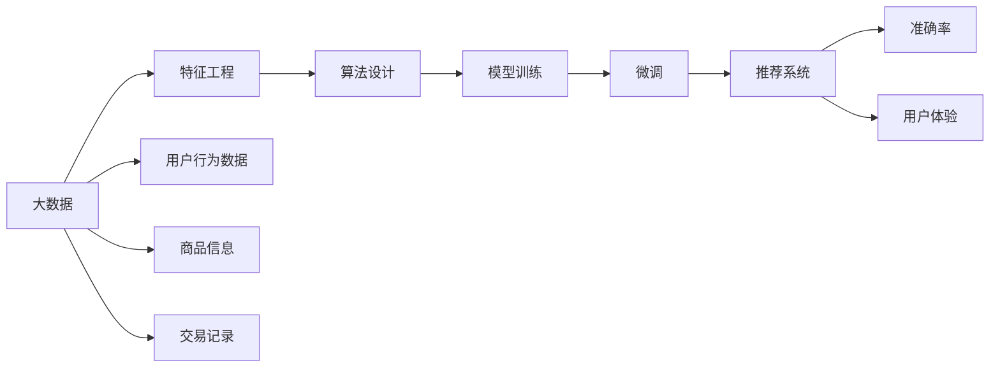

                 

# 大数据与AI 驱动的电商搜索推荐：以准确率与用户体验为核心

## 1. 背景介绍

### 1.1 问题由来

随着电子商务的发展，线上购物已成为许多人的首选。电商平台的搜索推荐系统不仅要保证搜索结果的准确性，还要提高用户体验。传统的搜索推荐系统通常基于简单的统计模型，难以适应海量数据和多维度特征的复杂性。而大数据与人工智能的结合，为电商搜索推荐带来了新的突破。

大数据的浪潮下，电商平台积累了大量的用户行为数据、商品信息和交易记录。这些数据为人工智能算法的训练提供了丰富的素材。通过构建基于AI的推荐系统，平台能够更精准地理解用户需求，预测用户行为，从而提供个性化、高效的推荐服务。

### 1.2 问题核心关键点

现代电商搜索推荐的核心关键点在于如何高效利用大数据，结合先进的AI技术，提升推荐系统的准确性和用户体验。具体包括以下几个方面：

1. **数据处理与特征工程**：电商平台的数据量庞大且复杂，需要高效的数据处理和特征工程技术，从原始数据中提取出对推荐有用的特征。
2. **算法设计与优化**：设计并优化推荐算法，确保其能够从海量数据中提取有价值的信息，并作出准确预测。
3. **模型训练与微调**：通过深度学习等算法，在大规模数据上进行模型训练和微调，以提升推荐性能。
4. **实时性要求**：电商平台的搜索推荐系统需要能够快速响应用户请求，提供实时推荐服务。
5. **用户体验优化**：优化推荐算法，提升推荐内容的个性化、多样性，增强用户满意度。

### 1.3 问题研究意义

构建高效、智能的电商搜索推荐系统，具有重要的理论和实践意义：

1. **提升用户体验**：个性化推荐可以显著提升用户满意度，增加用户黏性，促进交易转化。
2. **优化运营成本**：通过精准推荐，减少无效点击和浏览，降低广告投放成本，提高运营效率。
3. **开拓市场空间**：精准推荐能够帮助电商平台发现新的市场机会，扩大市场份额。
4. **强化平台竞争力**：高精度的推荐系统可以提升平台在用户中的口碑和信任度，增强竞争力。
5. **驱动技术创新**：电商搜索推荐技术的突破，能够带动大数据、AI等前沿技术的发展，推动产业升级。

## 2. 核心概念与联系

### 2.1 核心概念概述

为了更好地理解基于大数据与AI的电商搜索推荐系统，本节将介绍几个核心概念及其之间的联系：

- **大数据 (Big Data)**：指的是数据量庞大、类型多样、价值密度低的大规模数据集，通常包括用户行为数据、商品信息、交易记录等。
- **人工智能 (AI)**：通过计算机模拟人类智能行为的技术，包括机器学习、深度学习、自然语言处理等。
- **推荐系统 (Recommendation System)**：利用用户数据和商品特征，为用户提供个性化的推荐服务。
- **电商搜索推荐 (E-commerce Search & Recommendation)**：在电商平台上，结合搜索和推荐技术，为用户提供快速、准确的商品推荐。
- **准确率 (Accuracy)**：衡量推荐系统预测结果的准确性，即推荐的商品是否符合用户实际需求。
- **用户体验 (User Experience, UX)**：包括界面友好性、操作便捷性、内容相关性等，直接影响用户对平台的满意度。
- **推荐算法 (Recommendation Algorithms)**：用于计算推荐结果的算法，如协同过滤、基于内容的推荐、深度学习等。

这些概念之间存在紧密的联系。大数据为AI提供了训练素材，AI算法能够从数据中挖掘有价值的特征，推荐系统利用这些特征进行精准推荐，而准确率和用户体验则是评估推荐系统效果的两个重要指标。

### 2.2 核心概念原理和架构的 Mermaid 流程图



这个流程图展示了大数据与AI驱动的电商搜索推荐系统的主要环节：

1. 大数据收集与清洗：从用户行为数据、商品信息和交易记录中提取有用信息。
2. 特征工程：对原始数据进行预处理和特征提取，生成可用于推荐算法的输入特征。
3. 算法设计：选择合适的推荐算法，如协同过滤、深度学习等，设计推荐模型。
4. 模型训练与微调：在大规模数据上训练模型，并根据用户反馈进行微调，提升推荐性能。
5. 推荐系统部署：将训练好的模型部署到电商平台上，实时响应用户搜索请求。
6. 评估指标：通过准确率和用户体验等指标评估推荐效果。

## 3. 核心算法原理 & 具体操作步骤
### 3.1 算法原理概述

电商搜索推荐系统的核心算法原理基于用户行为数据和商品特征的分析和挖掘，通过机器学习或深度学习等技术，构建精准的推荐模型。

算法核心在于：

1. **数据预处理与特征工程**：对原始数据进行清洗、归一化、降维等预处理，提取出对推荐有用的特征。
2. **算法选择与设计**：根据任务特点和数据特征，选择合适的推荐算法，设计合适的模型结构。
3. **模型训练与微调**：在大规模数据上训练模型，并根据用户反馈进行微调，提升推荐性能。
4. **推荐结果输出**：根据用户输入的查询，结合推荐模型计算推荐结果，生成推荐列表。

### 3.2 算法步骤详解

电商搜索推荐系统的构建通常包括以下几个关键步骤：

**Step 1: 数据收集与预处理**

1. **数据收集**：收集用户的浏览历史、购买记录、评分信息等行为数据，以及商品的属性、价格、评论等特征数据。
2. **数据清洗**：处理缺失值、异常值，进行数据规范化处理，确保数据质量。
3. **特征工程**：提取有用的特征，如用户兴趣、商品类别、时间特征等，生成可用于推荐算法的特征向量。

**Step 2: 算法设计与训练**

1. **算法选择**：根据任务特点，选择合适的推荐算法，如协同过滤、基于内容的推荐、深度学习等。
2. **模型设计**：设计推荐模型的架构，如使用多层感知器(MLP)、卷积神经网络(CNN)、循环神经网络(RNN)等。
3. **模型训练**：使用历史数据对模型进行训练，最小化损失函数，优化模型参数。

**Step 3: 模型微调与优化**

1. **模型微调**：根据用户反馈和新的数据，对模型进行微调，提升推荐效果。
2. **优化算法**：选择适合的小样本学习算法，如在线学习、增量学习等，确保模型能够快速适应数据变化。

**Step 4: 实时推荐服务**

1. **推荐引擎**：将训练好的模型部署到实时推荐引擎中，实时响应用户搜索请求。
2. **推荐结果生成**：根据用户输入的查询，结合推荐模型计算推荐结果，生成推荐列表。

**Step 5: 评估与反馈**

1. **评估指标**：通过准确率和用户体验等指标评估推荐效果。
2. **用户反馈**：收集用户对推荐结果的反馈，进行模型优化。

### 3.3 算法优缺点

基于大数据与AI的电商搜索推荐系统具有以下优点：

1. **高准确率**：通过深度学习等先进算法，能够从海量数据中提取有价值的信息，提高推荐的准确性。
2. **高效率**：实时推荐引擎能够快速响应用户请求，提升用户体验。
3. **个性化推荐**：能够根据用户历史行为和偏好，提供个性化的推荐服务。
4. **自动化优化**：通过模型训练和微调，自动优化推荐效果，降低人工干预。

同时，该系统也存在以下缺点：

1. **数据隐私问题**：用户行为数据涉及隐私，需要严格保护。
2. **高计算成本**：深度学习等算法的计算复杂度高，需要强大的计算资源支持。
3. **模型过拟合**：在大规模数据上训练的模型可能过拟合，需要进行合理的正则化处理。
4. **高误判风险**：模型预测结果可能存在误差，需要进行多层次的验证和纠错。
5. **用户体验不一致**：不同用户和场景下的推荐结果可能不一致，需要灵活调整推荐策略。

### 3.4 算法应用领域

基于大数据与AI的电商搜索推荐系统已经在多个电商平台上得到了广泛应用，涵盖了商品推荐、用户画像生成、个性化营销等多个领域。具体应用包括：

1. **商品推荐**：基于用户行为数据，推荐相关商品，提升用户购买率。
2. **用户画像生成**：通过分析用户行为数据，构建用户画像，理解用户需求和偏好。
3. **个性化营销**：根据用户画像和历史行为，定制化推送广告和优惠活动，提高转化率。
4. **搜索结果优化**：通过推荐算法优化搜索结果，提高搜索质量。
5. **实时推荐**：结合实时数据，动态调整推荐策略，提升推荐效果。

此外，基于大数据与AI的电商搜索推荐系统还被应用于金融、医疗、娱乐等多个领域，为不同行业的智能化转型提供了有力支持。

## 4. 数学模型和公式 & 详细讲解 & 举例说明
### 4.1 数学模型构建

在电商搜索推荐系统中，常见的推荐模型包括协同过滤、基于内容的推荐、深度学习等。这里以协同过滤算法为例，构建推荐模型。

协同过滤算法基于用户行为数据，推荐用户可能感兴趣的商品。假设用户集合为 $U=\{u_1, u_2, \dots, u_m\}$，商品集合为 $I=\{i_1, i_2, \dots, i_n\}$，用户 $u_i$ 对商品 $i_j$ 的评分记为 $r_{ij}$。

协同过滤算法分为两种类型：

1. **基于用户的协同过滤**：
   - 根据用户 $u_i$ 对商品 $i_j$ 的评分 $r_{ij}$，计算用户 $u_i$ 对商品 $i_j$ 的评分预测 $r_{u_i,i_j}$，即：
     $$
     r_{u_i,i_j} = \sum_{u_k \in N_{u_i}}\alpha_k \frac{r_{k,i_j}}{\sqrt{\sum_{i' \in I} r_{k,i'}^2}} \frac{1}{\sqrt{\sum_{j' \in I} r_{u_i,j'}^2}}
     $$
     其中 $N_{u_i}$ 表示与用户 $u_i$ 相似的其他用户集合，$\alpha_k$ 表示用户 $u_k$ 对用户 $u_i$ 的影响权重。
2. **基于物品的协同过滤**：
   - 根据用户 $u_i$ 对商品 $i_j$ 的评分 $r_{ij}$，计算商品 $i_j$ 对用户 $u_i$ 的评分预测 $r_{u_i,i_j}$，即：
     $$
     r_{u_i,i_j} = \sum_{i_k \in N_{i_j}}\alpha_k \frac{r_{i_k,u_l}}{\sqrt{\sum_{u' \in U} r_{i_k,u'}^2}} \frac{1}{\sqrt{\sum_{j' \in I} r_{i_j,j'}^2}}
     $$
     其中 $N_{i_j}$ 表示与商品 $i_j$ 相似的其他商品集合，$\alpha_k$ 表示商品 $i_k$ 对商品 $i_j$ 的影响权重。

### 4.2 公式推导过程

协同过滤算法的核心在于计算用户和商品之间的相似度，然后根据相似度进行评分预测。

对于基于用户的协同过滤算法，假设用户 $u_i$ 和用户 $u_k$ 的相似度为 $\theta_{ik}$，则有：
$$
\theta_{ik} = \frac{\sum_{i' \in I} r_{ik,i'} r_{iu',i'}}{\sqrt{\sum_{i' \in I} r_{ik,i'}^2} \sqrt{\sum_{i' \in I} r_{iu',i'}^2}}
$$

对于基于物品的协同过滤算法，假设商品 $i_j$ 和商品 $i_k$ 的相似度为 $\theta_{kj}$，则有：
$$
\theta_{kj} = \frac{\sum_{u' \in U} r_{u'k,u'j} r_{u'i,u'j}}{\sqrt{\sum_{u' \in U} r_{u'k,u'}^2} \sqrt{\sum_{u' \in U} r_{u'i,u'}^2}}
$$

在实际应用中，可以使用更高效的计算方法，如矩阵分解、梯度下降等，进一步优化协同过滤算法的性能。

### 4.3 案例分析与讲解

以Amazon平台为例，分析基于大数据与AI的电商搜索推荐系统的具体应用。

1. **数据收集**：Amazon平台每天产生大量用户行为数据，包括浏览记录、购买记录、评分信息等。
2. **特征工程**：从原始数据中提取有用的特征，如用户ID、商品ID、购买时间、浏览时长等。
3. **算法选择**：基于物品的协同过滤算法能够有效利用用户行为数据，推荐相关商品。
4. **模型训练**：使用历史数据对模型进行训练，优化评分预测准确度。
5. **模型微调**：根据用户反馈和新数据，对模型进行微调，提升推荐效果。
6. **推荐引擎**：将训练好的模型部署到推荐引擎中，实时响应用户搜索请求。
7. **评估与反馈**：通过准确率和用户体验等指标评估推荐效果，收集用户反馈进行模型优化。

## 5. 项目实践：代码实例和详细解释说明
### 5.1 开发环境搭建

在进行项目实践前，需要先搭建好开发环境。以下是使用Python进行开发的环境配置流程：

1. 安装Anaconda：从官网下载并安装Anaconda，用于创建独立的Python环境。
2. 创建并激活虚拟环境：
```bash
conda create -n recommendation-env python=3.8 
conda activate recommendation-env
```
3. 安装相关库：
```bash
pip install pandas numpy scikit-learn torch
```

### 5.2 源代码详细实现

这里以基于用户的协同过滤算法为例，给出使用Python和PyTorch实现推荐模型的代码：

```python
import torch
import torch.nn as nn
import torch.optim as optim
import pandas as pd
from sklearn.model_selection import train_test_split

class协同过滤模型(nn.Module):
    def __init__(self, n_users, n_items, n_factors=10):
        super(协同过滤模型, self).__init__()
        self.user_embed = nn.Embedding(n_users, n_factors)
        self.item_embed = nn.Embedding(n_items, n_factors)
        self.sigmoid = nn.Sigmoid()

    def forward(self, user_id, item_id):
        user_embed = self.user_embed(user_id)
        item_embed = self.item_embed(item_id)
        dot_product = (user_embed * item_embed).sum(dim=1)
        return self.sigmoid(dot_product)

# 加载数据
data = pd.read_csv('rating.csv')
user_ids, item_ids, ratings = data['user_id'], data['item_id'], data['rating']

# 数据预处理
user_ids, item_ids = user_ids.astype(int), item_ids.astype(int)
user_ids, item_ids, ratings = train_test_split(user_ids, item_ids, ratings, test_size=0.2, random_state=42)

# 模型初始化
model =协同过滤模型(n_users=len(user_ids), n_items=len(item_ids))

# 定义损失函数和优化器
criterion = nn.BCELoss()
optimizer = optim.Adam(model.parameters(), lr=0.001)

# 训练模型
for epoch in range(10):
    for i, (user_id, item_id, rating) in enumerate(zip(user_ids, item_ids, ratings)):
        optimizer.zero_grad()
        output = model(user_id, item_id)
        loss = criterion(output, torch.tensor(rating, dtype=torch.float32))
        loss.backward()
        optimizer.step()
        print(f'Epoch {epoch+1}, Batch {i+1}, Loss: {loss.item()}')

# 测试模型
test_user_ids, test_item_ids, test_ratings = user_ids[-1000:], item_ids[-1000:], ratings[-1000:]
with torch.no_grad():
    test_output = model(test_user_ids, test_item_ids)
    test_predictions = (test_output > 0.5).float()
    print(classification_report(test_ratings, test_predictions))
```

### 5.3 代码解读与分析

让我们详细解读一下关键代码的实现细节：

**协同过滤模型类**：
- `__init__`方法：初始化用户和商品的嵌入层，以及输出层。
- `forward`方法：定义模型的前向传播过程，计算用户和商品的嵌入向量点积，并通过Sigmoid函数进行评分预测。

**数据预处理**：
- 将用户ID和商品ID转换为整数类型，并进行train-test划分。
- 使用train_test_split函数将数据集分为训练集和测试集。

**模型训练**：
- 定义损失函数（二分类交叉熵）和优化器（Adam）。
- 在每个epoch内，对每个训练样本进行前向传播和反向传播，计算损失并更新模型参数。

**模型测试**：
- 使用测试集进行模型测试，计算预测结果和真实标签之间的差异，并输出分类报告。

可以看到，通过PyTorch和Scikit-learn库，可以高效地构建和训练基于协同过滤的推荐模型，并验证其预测性能。

## 6. 实际应用场景
### 6.1 智能客服系统

基于大数据与AI的电商搜索推荐系统不仅可以用于商品推荐，还可以通过进一步优化，实现智能客服系统的构建。

智能客服系统能够自动处理用户咨询，解答常见问题，提供个性化推荐，提升用户体验。具体实现可以结合NLP技术，将用户输入的问题通过文本分类和情感分析等技术进行处理，然后基于推荐模型生成回答。

### 6.2 金融舆情监测

金融领域也需要实时监测舆情，及时发现和防范风险。基于大数据与AI的推荐系统可以通过分析金融新闻、评论、社交媒体等数据，预测市场走势和投资机会，提供实时预警。

具体应用可以包括：

1. **新闻推荐**：根据用户兴趣和偏好，推荐相关的金融新闻和分析文章。
2. **舆情监测**：分析金融媒体评论，预测市场情绪，识别潜在的风险信号。
3. **投资建议**：基于历史数据和市场趋势，提供个性化的投资建议和策略。

### 6.3 个性化推荐系统

个性化推荐系统能够帮助用户快速找到所需商品，提升购物体验。基于大数据与AI的推荐系统可以通过协同过滤、基于内容的推荐、深度学习等多种算法，实现精准推荐。

具体应用可以包括：

1. **商品推荐**：根据用户浏览和购买历史，推荐相关商品。
2. **活动推荐**：根据用户行为和兴趣，推荐优惠活动和促销信息。
3. **个性化搜索结果**：结合搜索和推荐技术，优化搜索结果，提升搜索质量。

### 6.4 未来应用展望

随着大数据与AI技术的不断进步，基于推荐系统的应用场景将不断扩展，为各个行业带来更深刻的变革。

1. **智能制造**：结合推荐系统，实现个性化定制生产，提高生产效率和客户满意度。
2. **智慧医疗**：通过推荐系统，推荐个性化的医疗方案和治疗建议，提升医疗服务质量。
3. **智能交通**：基于推荐系统，推荐最优出行路线和时间，提高出行效率和舒适度。
4. **智能家居**：结合推荐系统，推荐个性化家居方案和生活方式，提升居住体验。
5. **智能教育**：通过推荐系统，推荐个性化学习资源和教学方法，提高学习效果。

## 7. 工具和资源推荐
### 7.1 学习资源推荐

为了帮助开发者掌握大数据与AI驱动的电商搜索推荐技术，这里推荐一些优质的学习资源：

1. **《推荐系统实战》书籍**：详细介绍了推荐系统的构建和优化方法，包括协同过滤、深度学习等技术。
2. **Coursera《机器学习》课程**：由斯坦福大学开设，涵盖机器学习的基本概念和算法，适合初学者。
3. **Kaggle推荐系统竞赛**：通过参与实际竞赛，掌握推荐系统的应用和优化方法。
4. **PyTorch官方文档**：提供了详细的PyTorch使用指南和示例代码，适合快速上手。
5. **Google Cloud推荐引擎**：提供实时的推荐服务，支持多种推荐算法和模型。

通过这些资源的学习和实践，相信你一定能够掌握大数据与AI驱动的电商搜索推荐技术的精髓，并用于解决实际的推荐问题。

### 7.2 开发工具推荐

高效的开发离不开优秀的工具支持。以下是几款用于推荐系统开发的常用工具：

1. **PyTorch**：基于Python的开源深度学习框架，灵活动态的计算图，适合快速迭代研究。
2. **TensorFlow**：由Google主导开发的开源深度学习框架，生产部署方便，适合大规模工程应用。
3. **Scikit-learn**：基于Python的机器学习库，提供简单易用的API，适合快速原型开发。
4. **Apache Spark**：大数据处理框架，支持分布式计算，适合处理大规模数据集。
5. **Elasticsearch**：分布式搜索引擎，支持全文搜索和推荐算法，适合实时推荐服务。

合理利用这些工具，可以显著提升推荐系统的开发效率，加快创新迭代的步伐。

### 7.3 相关论文推荐

大数据与AI驱动的电商搜索推荐技术的发展离不开学界的持续研究。以下是几篇奠基性的相关论文，推荐阅读：

1. **《基于协同过滤的推荐系统》**：详细介绍了协同过滤算法的原理和实现方法，是推荐系统研究的基础。
2. **《深度学习在推荐系统中的应用》**：探讨了深度学习在推荐系统中的潜力，介绍了多种深度学习架构。
3. **《大数据驱动的推荐系统》**：分析了大数据在推荐系统中的应用，提出了多维度特征提取的方法。
4. **《实时推荐系统：架构与算法》**：介绍了实时推荐系统的架构和关键技术，适合工程实践。
5. **《基于用户行为数据的推荐系统》**：结合用户行为数据，构建个性化推荐模型，提升推荐效果。

这些论文代表了推荐系统研究的最新进展，对于深入理解大数据与AI驱动的电商搜索推荐技术具有重要的参考价值。

## 8. 总结：未来发展趋势与挑战
### 8.1 总结

本文对基于大数据与AI的电商搜索推荐系统进行了全面系统的介绍。首先阐述了电商搜索推荐系统的背景和意义，明确了其核心关键点。其次，从原理到实践，详细讲解了推荐算法的数学模型和实现步骤，给出了代码实例。同时，本文还广泛探讨了推荐系统在多个领域的应用场景，展示了其广阔前景。

通过本文的系统梳理，可以看到，基于大数据与AI的电商搜索推荐系统正在成为电商行业的重要技术范式，极大地提升了用户体验和运营效率。未来，伴随大数据与AI技术的进一步发展，基于推荐系统的应用将更加广泛，为各行各业带来深刻变革。

### 8.2 未来发展趋势

展望未来，基于大数据与AI的电商搜索推荐系统将呈现以下几个发展趋势：

1. **多模态推荐**：结合文本、图像、视频等多种数据源，构建更加全面、精准的推荐模型。
2. **实时化推荐**：通过实时数据流处理技术，实现动态推荐，提升推荐效果和用户体验。
3. **联邦推荐**：通过联邦学习等技术，保护用户隐私的同时，提升推荐系统的性能。
4. **跨领域推荐**：结合不同领域的数据和知识，构建跨领域的推荐模型，提高推荐的多样性和覆盖面。
5. **个性化推荐**：结合用户行为数据和上下文信息，实现更加个性化的推荐服务。
6. **透明化推荐**：通过可解释AI技术，提高推荐模型的透明性和可解释性，增强用户信任。

以上趋势凸显了推荐系统技术的广阔前景。这些方向的探索发展，必将进一步提升推荐系统的性能和用户体验，推动大数据与AI技术的进一步进步。

### 8.3 面临的挑战

尽管基于大数据与AI的电商搜索推荐系统已经取得了显著成效，但在迈向更加智能化、普适化应用的过程中，仍面临诸多挑战：

1. **数据隐私和安全**：用户数据涉及隐私，如何保护用户数据安全，防止数据泄露，是一个重要的挑战。
2. **计算资源限制**：深度学习等算法的计算复杂度高，需要强大的计算资源支持。如何优化算法和硬件，提高推荐系统的计算效率，是未来的一个重要研究方向。
3. **算法公平性**：推荐系统可能存在偏见和歧视，如何构建公平、无偏见的推荐算法，是一个重要的课题。
4. **模型泛化能力**：推荐模型可能对新用户和新商品存在冷启动问题，如何提高模型的泛化能力，是一个重要的挑战。
5. **系统实时性**：实时推荐系统需要高效处理海量数据流，如何提高系统实时性和稳定性，是一个重要的研究方向。

### 8.4 研究展望

面对推荐系统所面临的种种挑战，未来的研究需要在以下几个方面寻求新的突破：

1. **数据隐私保护**：结合联邦学习、差分隐私等技术，保护用户隐私，同时提升推荐系统性能。
2. **计算资源优化**：结合分布式计算、硬件加速等技术，优化推荐系统算法和硬件，提高计算效率。
3. **公平性优化**：结合对抗性训练、公平性约束等技术，构建公平、无偏见的推荐模型。
4. **冷启动问题解决**：结合知识图谱、协同过滤等技术，提高推荐模型的泛化能力。
5. **实时系统优化**：结合流处理、分布式计算等技术，提高推荐系统的实时性和稳定性。
6. **推荐系统透明化**：结合可解释AI技术，提高推荐模型的透明性和可解释性，增强用户信任。

这些研究方向的探索，必将引领推荐系统技术的不断进步，为构建更智能、更公平、更透明的推荐系统提供有力支持。面向未来，大数据与AI驱动的电商搜索推荐系统还需要与其他人工智能技术进行更深入的融合，如自然语言处理、计算机视觉等，多路径协同发力，共同推动推荐系统的进步。只有勇于创新、敢于突破，才能不断拓展推荐系统的边界，让AI技术更好地服务于人类社会。

## 9. 附录：常见问题与解答

**Q1：电商推荐系统的推荐算法有哪些？**

A: 电商推荐系统的推荐算法主要包括：

1. **协同过滤算法**：通过分析用户行为数据和商品特征，推荐用户可能感兴趣的商品。
2. **基于内容的推荐算法**：通过分析商品的属性和特征，推荐与用户历史行为相似的商品。
3. **深度学习算法**：使用神经网络等深度学习模型，学习商品和用户之间的关联，提升推荐效果。
4. **混合推荐算法**：结合多种推荐算法，取长补短，提高推荐性能。
5. **知识图谱推荐算法**：结合知识图谱和推荐算法，提供更加全面和准确的推荐结果。

这些算法各有优缺点，需要根据具体场景和数据特点进行选择和优化。

**Q2：电商推荐系统的模型如何训练和优化？**

A: 电商推荐系统的模型训练和优化主要包括以下几个步骤：

1. **数据预处理**：对原始数据进行清洗、归一化、降维等预处理，提取有用的特征。
2. **模型选择**：根据任务特点和数据特征，选择合适的推荐算法和模型结构。
3. **模型训练**：使用历史数据对模型进行训练，最小化损失函数，优化模型参数。
4. **模型微调**：根据用户反馈和新数据，对模型进行微调，提升推荐效果。
5. **优化算法**：选择适合的小样本学习算法，如在线学习、增量学习等，确保模型能够快速适应数据变化。

在实际应用中，可以通过A/B测试、多臂老虎机等方法，不断优化推荐系统的性能。

**Q3：电商推荐系统的准确率和用户体验如何评估？**

A: 电商推荐系统的评估主要包括以下几个指标：

1. **准确率**：衡量推荐系统预测结果的准确性，即推荐的商品是否符合用户实际需求。
2. **召回率**：衡量推荐系统覆盖用户的程度，即推荐系统中包含用户感兴趣商品的多少。
3. **点击率**：衡量用户点击推荐商品的意愿，即推荐的商品是否能吸引用户注意。
4. **转化率**：衡量用户购买推荐商品的意愿，即推荐的商品是否能转化为实际交易。
5. **用户体验**：包括界面友好性、操作便捷性、内容相关性等，直接影响用户对平台的满意度。

可以通过这些指标评估推荐系统的性能，并通过A/B测试、用户调查等方法，收集用户反馈进行模型优化。

**Q4：电商推荐系统的冷启动问题如何解决？**

A: 电商推荐系统的冷启动问题可以通过以下几种方法解决：

1. **基于内容的推荐**：根据商品的属性和特征，推荐与用户历史行为相似的商品。
2. **协同过滤**：利用用户相似性，推荐其他用户喜欢的商品。
3. **混合推荐**：结合多种推荐算法，提高推荐模型的泛化能力。
4. **知识图谱**：结合知识图谱和推荐算法，提供更加全面和准确的推荐结果。
5. **先验知识结合**：将专家知识与推荐模型结合，提升推荐系统的性能。

这些方法可以结合实际场景和数据特点进行选择和优化，解决冷启动问题，提升推荐效果。

**Q5：电商推荐系统如何保护用户隐私？**

A: 电商推荐系统保护用户隐私可以通过以下几种方法实现：

1. **数据匿名化**：对用户数据进行匿名化处理，保护用户隐私。
2. **差分隐私**：结合差分隐私技术，保护用户数据隐私，同时确保推荐系统性能。
3. **联邦学习**：结合联邦学习技术，保护用户数据隐私，同时提升推荐系统性能。
4. **加密技术**：结合加密技术，保护用户数据隐私，同时确保数据传输安全。
5. **用户控制**：赋予用户数据控制权，让用户自主选择是否共享数据。

这些方法可以结合实际场景和数据特点进行选择和优化，保护用户隐私，提升推荐系统性能。

---

作者：禅与计算机程序设计艺术 / Zen and the Art of Computer Programming

