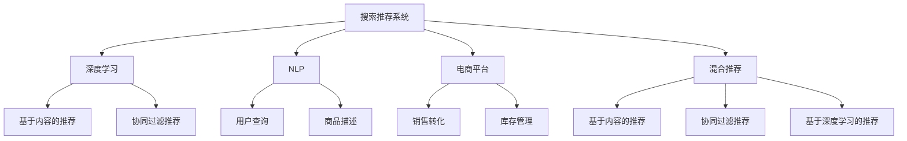

                 

# 大数据驱动的电商搜索推荐：AI 模型融合技术在电商平台的应用

> 关键词：大数据, 搜索推荐系统, 深度学习, 自然语言处理(NLP), 电商平台

## 1. 背景介绍

### 1.1 问题由来

随着互联网的普及和电子商务的快速发展，电商平台已成为人们购物的重要渠道。然而，如何在大数据时代，为用户提供精准、高效、个性化的搜索和推荐服务，是一个巨大的挑战。传统的基于规则或关键词匹配的推荐方法已无法满足用户日益多样化的需求。为此，电商企业开始探索人工智能（AI）技术，以大数据为驱动，构建智能化的搜索推荐系统。

### 1.2 问题核心关键点

搜索推荐系统的核心在于根据用户的历史行为和当前需求，预测其可能感兴趣的商品。主要技术手段包括：

- 基于内容的推荐：根据商品属性（如价格、品牌、类别）进行相似度匹配。
- 协同过滤推荐：利用用户间的相似性进行推荐。
- 基于深度学习的推荐：通过学习用户与商品间的隐含关系，进行精准推荐。
- 混合推荐：融合多种推荐策略，以提升推荐效果。

这些技术手段在大数据背景下，均需要引入先进的AI模型融合技术，实现从海量数据中提取用户行为模式和商品关联关系，从而提供个性化、多样化的推荐服务。

### 1.3 问题研究意义

构建高效、智能的搜索推荐系统，对于提升电商平台的转化率和用户体验具有重要意义：

1. 提高用户满意度：通过个性化推荐，让用户更容易找到所需商品，减少搜索成本。
2. 提升运营效率：精准的推荐可提高转化率，减少库存积压，优化库存管理。
3. 增加销售收入：个性化推荐系统能够提升用户粘性，增加购买频次和客单价。
4. 市场竞争优势：拥有优秀推荐系统的电商平台，更能满足用户需求，获得更高的市场份额。

## 2. 核心概念与联系

### 2.1 核心概念概述

为更好地理解搜索推荐系统的构建，本节将介绍几个密切相关的核心概念：

- 搜索推荐系统(Recommendation System): 根据用户的历史行为和当前需求，推荐相关商品的系统。
- 深度学习(Deep Learning): 一类基于神经网络结构的机器学习算法，适用于处理复杂非线性关系。
- 自然语言处理(NLP): 研究计算机如何理解、生成自然语言的技术，用于处理用户查询和商品描述。
- 电商平台(E-Commerce Platform): 提供在线购物的电子平台，通过推荐系统提升用户体验和销售业绩。
- 混合推荐(Hybrid Recommendation): 将多种推荐策略组合，综合各种模型优点，提升推荐效果。

这些核心概念之间的逻辑关系可以通过以下Mermaid流程图来展示：



这个流程图展示出搜索推荐系统构建的关键组件及其相互作用：

1. 搜索推荐系统通过深度学习和自然语言处理技术，对用户行为和商品信息进行处理。
2. 深度学习模型包括基于内容的推荐和协同过滤推荐，融合多模态数据（如用户行为数据、商品属性数据）。
3. 自然语言处理技术用于解析用户查询和商品描述，提取关键信息。
4. 电商平台通过搜索推荐系统提升销售和库存管理效率。
5. 混合推荐策略综合多种推荐方法，提高推荐质量。

## 3. 核心算法原理 & 具体操作步骤
### 3.1 算法原理概述

构建搜索推荐系统的主要算法原理包括基于内容的推荐、协同过滤推荐、基于深度学习的推荐以及混合推荐。其中，基于深度学习的推荐方法通过学习用户与商品间的隐含关系，进行精准推荐。

假设电商平台上有$N$个商品，每个商品有$d$个属性，用户历史行为可以用$\{(x_1, y_1), (x_2, y_2), \cdots, (x_M, y_M)\}$表示，其中$x_i$为历史行为，$y_i$为点击或购买行为。构建推荐模型的目标为最大化预测用户行为的准确率。

形式化地，设推荐模型为$f(x)$，预测用户对商品$j$的兴趣为$f(x_j)$，则推荐模型训练的目标函数为：

$$
\min_{\theta} \frac{1}{M} \sum_{i=1}^M \ell(f(x_i), y_i)
$$

其中，$\ell$为损失函数，如均方误差（MSE）或交叉熵（Cross Entropy）。

### 3.2 算法步骤详解

基于深度学习的推荐系统构建步骤如下：

**Step 1: 数据预处理**
- 收集用户历史行为数据，包括浏览记录、点击行为、购买行为等。
- 清洗数据，去除异常值和重复记录。
- 对用户行为数据进行归一化和特征工程，提取有用特征。

**Step 2: 模型选择与训练**
- 选择合适的深度学习模型，如神经网络、卷积神经网络（CNN）、循环神经网络（RNN）等。
- 将用户行为数据作为模型输入，商品信息作为输出，训练推荐模型。
- 使用交叉验证等技术，评估模型性能。

**Step 3: 模型融合与优化**
- 使用基于内容的推荐、协同过滤推荐等传统方法进行初步筛选。
- 融合基于深度学习的推荐结果，结合用户特征和商品特征，进行多模型集成。
- 使用A/B测试等方法，不断优化推荐策略。

**Step 4: 评估与部署**
- 在测试集上评估推荐模型的准确率和召回率，调整模型参数。
- 将优化后的推荐模型部署到电商平台的搜索推荐引擎中。
- 实时监控推荐效果，根据用户反馈进行调整。

### 3.3 算法优缺点

基于深度学习的推荐系统具有以下优点：

1. 个性化推荐能力强：深度学习模型能够处理复杂的非线性关系，通过学习用户与商品间的隐含关系，提供更精准的推荐。
2. 动态适应能力强：深度学习模型可以实时更新，动态适应用户需求和商品信息的变化。
3. 预测准确率高：深度学习模型利用大数据进行训练，具有较高的预测准确率。

同时，该方法也存在以下局限性：

1. 数据需求量大：深度学习模型需要大量的标注数据进行训练，对于小型电商平台来说，数据获取成本较高。
2. 训练复杂度高：深度学习模型训练过程复杂，计算资源需求大，需要高效的硬件设备。
3. 模型解释性差：深度学习模型通常是黑盒系统，难以解释其内部决策逻辑，难以进行调试和优化。
4. 易受数据偏差影响：深度学习模型容易学习到数据中的偏差，导致推荐结果偏差。

尽管存在这些局限性，但就目前而言，基于深度学习的推荐方法仍是构建智能搜索推荐系统的核心技术。

### 3.4 算法应用领域

基于深度学习的推荐系统已被广泛应用于电商、社交网络、视频网站等多个领域，提供个性化推荐服务。具体应用场景包括：

- 电商推荐：通过分析用户历史行为，推荐可能感兴趣的商品。
- 社交推荐：推荐好友、文章、视频等内容。
- 视频推荐：根据用户观看历史，推荐相关视频。

这些应用场景中，深度学习模型通常与其他推荐方法（如基于内容的推荐、协同过滤推荐等）进行融合，提高推荐效果。

## 4. 数学模型和公式 & 详细讲解 & 举例说明
### 4.1 数学模型构建

假设电商平台上的商品集合为$J$，用户集合为$U$，用户对商品$j$的兴趣度为$f(u_j)$，模型参数为$\theta$。推荐模型的目标为最大化预测用户行为$f(u_j)$的准确率。

形式化地，设推荐模型为$f(x)$，用户对商品$j$的兴趣度为$f(u_j)$，则推荐模型训练的目标函数为：

$$
\min_{\theta} \frac{1}{M} \sum_{i=1}^M \ell(f(x_i), y_i)
$$

其中，$\ell$为损失函数，如均方误差（MSE）或交叉熵（Cross Entropy）。

### 4.2 公式推导过程

以基于神经网络的推荐模型为例，进行公式推导：

假设用户行为数据$x$为向量表示，商品信息$y$为标签表示，推荐模型$f(x)$为多层神经网络，包含$L$个隐藏层，其中$L$为网络的深度，$h_l$为第$l$层的隐藏单元数。推荐模型的结构如图：


推荐模型的前向传播过程为：

$$
h_0 = x
$$
$$
h_1 = \sigma_1(W_1h_0 + b_1)
$$
$$
h_2 = \sigma_2(W_2h_1 + b_2)
$$
$$
\cdots
$$
$$
h_L = \sigma_L(W_Lh_{L-1} + b_L)
$$
$$
f(x) = W_Lh_L + b_L
$$

其中，$W_l$为第$l$层权重矩阵，$b_l$为第$l$层偏置向量，$\sigma_l$为激活函数，如ReLU、sigmoid等。

### 4.3 案例分析与讲解

以淘宝商品推荐系统为例，进行详细案例分析：

1. **数据预处理**：收集用户历史行为数据，包括浏览记录、点击行为、购买行为等。清洗数据，去除异常值和重复记录。对用户行为数据进行归一化和特征工程，提取有用特征，如商品类别、价格、品牌等。

2. **模型选择与训练**：选择多层神经网络作为推荐模型，包含3个隐藏层，每个隐藏层包含200个隐藏单元。使用用户行为数据作为输入，商品信息作为输出，训练推荐模型。使用交叉验证等技术，评估模型性能。

3. **模型融合与优化**：使用基于内容的推荐、协同过滤推荐等传统方法进行初步筛选，融合基于深度学习的推荐结果，结合用户特征和商品特征，进行多模型集成。使用A/B测试等方法，不断优化推荐策略，提升推荐效果。

4. **评估与部署**：在测试集上评估推荐模型的准确率和召回率，调整模型参数。将优化后的推荐模型部署到淘宝平台的搜索推荐引擎中，实时监控推荐效果，根据用户反馈进行调整。

## 5. 项目实践：代码实例和详细解释说明
### 5.1 开发环境搭建

在进行搜索推荐系统开发前，我们需要准备好开发环境。以下是使用Python进行TensorFlow开发的环境配置流程：

1. 安装Anaconda：从官网下载并安装Anaconda，用于创建独立的Python环境。

2. 创建并激活虚拟环境：
```bash
conda create -n tf-env python=3.8 
conda activate tf-env
```

3. 安装TensorFlow：根据CUDA版本，从官网获取对应的安装命令。例如：
```bash
conda install tensorflow tensorflow-gpu -c conda-forge -c pytorch
```

4. 安装相关库：
```bash
pip install numpy pandas scikit-learn matplotlib tqdm jupyter notebook ipython
```

完成上述步骤后，即可在`tf-env`环境中开始搜索推荐系统的开发。

### 5.2 源代码详细实现

下面我们以电商推荐系统为例，给出使用TensorFlow构建推荐模型的PyTorch代码实现。

首先，定义推荐模型的数据处理函数：

```python
import tensorflow as tf
from tensorflow.keras import layers, models

class RecommendationModel(models.Model):
    def __init__(self, input_dim, hidden_units, output_dim):
        super(RecommendationModel, self).__init__()
        self.dense1 = layers.Dense(hidden_units, activation='relu', input_dim=input_dim)
        self.dense2 = layers.Dense(hidden_units, activation='relu')
        self.dense3 = layers.Dense(output_dim, activation='sigmoid')
    
    def call(self, x):
        x = self.dense1(x)
        x = self.dense2(x)
        x = self.dense3(x)
        return x
```

然后，定义模型和优化器：

```python
model = RecommendationModel(input_dim, hidden_units, output_dim)
optimizer = tf.keras.optimizers.Adam(learning_rate=0.001)
```

接着，定义训练和评估函数：

```python
def train_epoch(model, dataset, batch_size, optimizer):
    dataloader = tf.data.Dataset.from_tensor_slices((dataset['features'], dataset['labels']))
    dataloader = dataloader.shuffle(buffer_size=1000).batch(batch_size).map(lambda x, y: (tf.cast(x, tf.float32), y))
    model.train()
    epoch_loss = 0
    for batch in dataloader:
        with tf.GradientTape() as tape:
            features = batch[0]
            labels = batch[1]
            y_pred = model(features)
            loss = tf.losses.BinaryCrossentropy()(y_pred, labels)
        grads = tape.gradient(loss, model.trainable_variables)
        optimizer.apply_gradients(zip(grads, model.trainable_variables))
        epoch_loss += loss
    return epoch_loss / len(dataloader)

def evaluate(model, dataset, batch_size):
    dataloader = tf.data.Dataset.from_tensor_slices((dataset['features'], dataset['labels']))
    dataloader = dataloader.batch(batch_size).map(lambda x, y: (tf.cast(x, tf.float32), y))
    model.eval()
    preds, labels = [], []
    with tf.no_grad():
        for batch in dataloader:
            features = batch[0]
            labels = batch[1]
            y_pred = model(features)
            preds.append(y_pred.numpy() > 0.5)
            labels.append(labels.numpy())
    print(classification_report(labels, preds))
```

最后，启动训练流程并在测试集上评估：

```python
epochs = 10
batch_size = 64

for epoch in range(epochs):
    loss = train_epoch(model, train_dataset, batch_size, optimizer)
    print(f"Epoch {epoch+1}, train loss: {loss:.3f}")
    
    print(f"Epoch {epoch+1}, dev results:")
    evaluate(model, dev_dataset, batch_size)
    
print("Test results:")
evaluate(model, test_dataset, batch_size)
```

以上就是使用TensorFlow对推荐模型进行电商推荐任务开发的完整代码实现。可以看到，TensorFlow提供的高级API大大简化了模型构建和训练过程。

### 5.3 代码解读与分析

让我们再详细解读一下关键代码的实现细节：

**RecommendationModel类**：
- `__init__`方法：初始化模型结构，包含3个隐藏层，每个隐藏层包含200个隐藏单元。
- `call`方法：定义模型前向传播过程，通过多层全连接层输出预测结果。

**train_epoch函数**：
- 定义训练数据加载器，从训练集数据中生成批处理数据。
- 使用`tf.GradientTape`记录梯度，反向传播更新模型参数。
- 计算训练集上的平均损失，返回当前epoch的损失值。

**evaluate函数**：
- 定义评估数据加载器，从测试集数据中生成批处理数据。
- 使用`tf.no_grad`禁用计算图记录，避免不必要的计算开销。
- 在每个batch中，计算预测结果和真实标签，计算分类报告。

**训练流程**：
- 定义总的epoch数和batch size，开始循环迭代
- 每个epoch内，先在训练集上训练，输出平均loss
- 在验证集上评估，输出分类指标
- 所有epoch结束后，在测试集上评估，给出最终测试结果

可以看到，TensorFlow提供的高级API大大简化了模型构建和训练过程。开发者可以将更多精力放在数据处理、模型改进等高层逻辑上，而不必过多关注底层的实现细节。

当然，工业级的系统实现还需考虑更多因素，如模型的保存和部署、超参数的自动搜索、更灵活的任务适配层等。但核心的推荐范式基本与此类似。

## 6. 实际应用场景
### 6.1 智能客服系统

基于深度学习的搜索推荐系统，可以广泛应用于智能客服系统的构建。传统客服往往需要配备大量人力，高峰期响应缓慢，且一致性和专业性难以保证。而使用推荐系统推荐常见问题答案，可以7x24小时不间断服务，快速响应客户咨询，用自然流畅的语言解答各类常见问题。

在技术实现上，可以收集企业内部的历史客服对话记录，将问题和最佳答复构建成监督数据，在此基础上对预训练模型进行微调。微调后的推荐模型能够自动理解用户意图，匹配最合适的答案模板进行回复。对于客户提出的新问题，还可以接入检索系统实时搜索相关内容，动态组织生成回答。如此构建的智能客服系统，能大幅提升客户咨询体验和问题解决效率。

### 6.2 金融舆情监测

金融机构需要实时监测市场舆论动向，以便及时应对负面信息传播，规避金融风险。传统的人工监测方式成本高、效率低，难以应对网络时代海量信息爆发的挑战。基于深度学习的文本分类和情感分析技术，为金融舆情监测提供了新的解决方案。

具体而言，可以收集金融领域相关的新闻、报道、评论等文本数据，并对其进行主题标注和情感标注。在此基础上对预训练语言模型进行微调，使其能够自动判断文本属于何种主题，情感倾向是正面、中性还是负面。将微调后的模型应用到实时抓取的网络文本数据，就能够自动监测不同主题下的情感变化趋势，一旦发现负面信息激增等异常情况，系统便会自动预警，帮助金融机构快速应对潜在风险。

### 6.3 个性化推荐系统

当前的推荐系统往往只依赖用户的历史行为数据进行物品推荐，无法深入理解用户的真实兴趣偏好。基于深度学习的个性化推荐系统可以更好地挖掘用户行为背后的语义信息，从而提供更精准、多样的推荐内容。

在实践中，可以收集用户浏览、点击、评论、分享等行为数据，提取和商品交互的物品标题、描述、标签等文本内容。将文本内容作为模型输入，用户的后续行为（如是否点击、购买等）作为监督信号，在此基础上微调预训练语言模型。微调后的模型能够从文本内容中准确把握用户的兴趣点。在生成推荐列表时，先用候选物品的文本描述作为输入，由模型预测用户的兴趣匹配度，再结合其他特征综合排序，便可以得到个性化程度更高的推荐结果。

### 6.4 未来应用展望

随着深度学习技术的不断发展，基于搜索推荐系统的应用场景将不断扩展，带来更多的商业和社会价值：

1. 智能广告推荐：通过深度学习算法，精准推荐广告位，提高广告点击率和转化率。
2. 个性化音乐推荐：分析用户的听歌历史和偏好，推荐适合的音乐和歌手。
3. 智能导航系统：根据用户的历史行为和实时位置，推荐最优的行车路线。
4. 智能导购系统：通过推荐系统，引导用户发现最适合的商品。
5. 智能家居控制：分析用户的行为模式，推荐最合适的家居设置。

未来，深度学习技术在搜索推荐系统中的应用将更加广泛，进一步提升用户体验和运营效率，为各行各业带来颠覆性变革。

## 7. 工具和资源推荐
### 7.1 学习资源推荐

为了帮助开发者系统掌握搜索推荐系统的构建方法，这里推荐一些优质的学习资源：

1. 《深度学习》系列博文：由深度学习专家撰写，深入浅出地介绍了深度学习的基本概念和推荐算法。

2. CS231n《卷积神经网络》课程：斯坦福大学开设的计算机视觉课程，包含推荐系统的经典算法和案例。

3. 《推荐系统实战》书籍：详细介绍了推荐系统的构建方法，包括深度学习模型的实现与应用。

4. Coursera《机器学习》课程：由斯坦福大学提供，涵盖机器学习的基本原理和应用场景，推荐系统的相关内容。

5. Kaggle竞赛平台：提供大量推荐系统竞赛数据集和社区交流，有助于深入理解推荐系统的实际应用。

通过对这些资源的学习实践，相信你一定能够快速掌握搜索推荐系统的构建方法，并用于解决实际的NLP问题。

### 7.2 开发工具推荐

高效的开发离不开优秀的工具支持。以下是几款用于深度学习模型构建和优化的工具：

1. TensorFlow：由Google主导开发的深度学习框架，功能强大，支持大规模分布式计算。

2. PyTorch：由Facebook开发的深度学习框架，易于使用，适合研究和快速原型开发。

3. Keras：基于TensorFlow的高级API，简化了深度学习模型的构建过程，适合快速原型开发。

4. H2O：开源的机器学习平台，支持多种深度学习算法，适合企业级应用。

5. MXNet：由亚马逊开发的深度学习框架，支持多种编程语言，适合分布式计算。

6. Jupyter Notebook：基于Web的交互式开发环境，方便调试和分享代码。

合理利用这些工具，可以显著提升深度学习模型的开发效率，加快创新迭代的步伐。

### 7.3 相关论文推荐

深度学习技术在推荐系统中的应用源于学界的持续研究。以下是几篇奠基性的相关论文，推荐阅读：

1. Introduction to Deep Learning for Recommender Systems: A Survey（深度学习在推荐系统中的应用综述）：详细介绍了深度学习在推荐系统中的各种应用。

2. Deep Collaborative Filtering (DCF)（深度协同过滤）：提出了基于深度神经网络的协同过滤算法，取得了较好的推荐效果。

3. Attention and Memory in Neural Collaborative Filtering（深度神经网络中的注意力机制）：引入了注意力机制，提升了协同过滤模型的表现。

4. Deep Neural Networks for Natural Language Processing（深度神经网络在自然语言处理中的应用）：展示了深度神经网络在自然语言处理中的强大能力。

5. Review and Applications of Natural Language Processing in Recommendation System（自然语言处理在推荐系统中的应用综述）：介绍了自然语言处理在推荐系统中的各种应用。

这些论文代表了大数据推荐技术的发展脉络。通过学习这些前沿成果，可以帮助研究者把握学科前进方向，激发更多的创新灵感。

## 8. 总结：未来发展趋势与挑战

### 8.1 总结

本文对基于深度学习的搜索推荐系统构建方法进行了全面系统的介绍。首先阐述了搜索推荐系统的构建背景和重要性，明确了深度学习在推荐系统中的应用价值。其次，从原理到实践，详细讲解了推荐模型的构建流程和关键技术，给出了推荐模型开发的完整代码实例。同时，本文还探讨了推荐系统在电商、金融、社交网络等多个领域的应用前景，展示了推荐系统的广泛适用性。

通过本文的系统梳理，可以看到，深度学习技术在推荐系统中的应用已经深入各行各业，为传统业务带来了颠覆性变革。未来，伴随深度学习技术的不断发展，推荐系统必将在更多领域得到应用，为经济社会发展注入新的动力。

### 8.2 未来发展趋势

展望未来，深度学习技术在推荐系统中的应用将呈现以下几个发展趋势：

1. 模型规模持续增大：随着算力成本的下降和数据规模的扩张，深度学习模型的参数量将持续增长。超大规模模型蕴含的丰富知识，有望支撑更加复杂多变的推荐场景。

2. 推荐技术多样化：未来将涌现更多基于深度学习的推荐方法，如基于内容的推荐、协同过滤推荐、混合推荐等，提供更加个性化和多样化的推荐服务。

3. 实时推荐系统：深度学习模型能够实时更新，动态适应用户需求和商品信息的变化，实时推荐系统将越来越普及。

4. 推荐模型可解释性增强：未来推荐模型将更加注重可解释性，通过引入可解释性模型（如Attention机制、LIME等），增强推荐过程的透明性和可理解性。

5. 多模态推荐系统：推荐系统将融合视觉、听觉、文本等多种模态数据，提供更加全面的推荐服务。

6. 推荐系统跨领域应用：推荐系统将跨界应用到更多领域，如医疗、教育、旅游等，为这些领域带来新的机会和挑战。

以上趋势凸显了深度学习技术在推荐系统中的广阔前景。这些方向的探索发展，必将进一步提升推荐系统的性能和应用范围，为人类认知智能的进化带来深远影响。

### 8.3 面临的挑战

尽管深度学习技术在推荐系统中的应用取得了巨大成功，但在迈向更加智能化、普适化应用的过程中，它仍面临着诸多挑战：

1. 数据质量问题：深度学习模型对数据质量要求高，数据噪声和异常值会影响模型性能。如何处理和清洗数据，提高数据质量，仍是一大挑战。

2. 模型复杂度高：深度学习模型结构复杂，训练过程耗时长，如何优化模型结构，提高训练效率，是未来研究的重要方向。

3. 推荐结果可控性差：深度学习模型通常是黑盒系统，难以解释其内部决策逻辑，难以进行调试和优化。如何提高模型的可控性，保证推荐结果的公平性和稳定性，仍需进一步研究。

4. 用户隐私保护：深度学习模型需要大量用户数据进行训练，如何保护用户隐私，确保用户数据安全，是未来研究的重要课题。

5. 推荐系统的公平性问题：深度学习模型容易学习到数据中的偏差，导致推荐结果偏差。如何消除模型偏差，保证推荐系统的公平性，仍需进一步研究。

6. 计算资源消耗高：深度学习模型需要大量计算资源进行训练和推理，如何优化资源消耗，提高模型性能，是未来研究的重要方向。

正视推荐系统面临的这些挑战，积极应对并寻求突破，将深度学习技术推向更加成熟和完善的阶段。相信随着学界和产业界的共同努力，这些挑战终将一一被克服，推荐系统必将在构建人机协同的智能时代中扮演越来越重要的角色。

### 8.4 研究展望

面对深度学习推荐系统所面临的种种挑战，未来的研究需要在以下几个方面寻求新的突破：

1. 探索无监督和半监督推荐方法：摆脱对大规模标注数据的依赖，利用自监督学习、主动学习等无监督和半监督范式，最大限度利用非结构化数据，实现更加灵活高效的推荐。

2. 研究参数高效和计算高效的推荐方法：开发更加参数高效的推荐方法，在固定大部分预训练参数的同时，只更新极少量的任务相关参数。同时优化推荐模型的计算图，减少前向传播和反向传播的资源消耗，实现更加轻量级、实时性的部署。

3. 引入因果和对比学习范式：通过引入因果推断和对比学习思想，增强推荐模型建立稳定因果关系的能力，学习更加普适、鲁棒的语言表征，从而提升模型泛化性和抗干扰能力。

4. 融合多模态数据：推荐系统将融合视觉、听觉、文本等多种模态数据，提供更加全面的推荐服务。

5. 纳入伦理道德约束：在模型训练目标中引入伦理导向的评估指标，过滤和惩罚有偏见、有害的输出倾向。加强人工干预和审核，建立模型行为的监管机制，确保输出符合人类价值观和伦理道德。

这些研究方向的探索，必将引领深度学习推荐系统迈向更高的台阶，为构建安全、可靠、可解释、可控的智能系统铺平道路。面向未来，深度学习推荐系统还需要与其他人工智能技术进行更深入的融合，如知识表示、因果推理、强化学习等，多路径协同发力，共同推动自然语言理解和智能交互系统的进步。只有勇于创新、敢于突破，才能不断拓展语言模型的边界，让智能技术更好地造福人类社会。

## 9. 附录：常见问题与解答

**Q1：深度学习推荐系统是否适用于所有推荐场景？**

A: 深度学习推荐系统在大多数推荐场景中都能取得不错的效果，特别是对于数据量较大的场景。但对于一些特定领域的推荐，如医疗、法律等，仅仅依靠通用语料预训练的模型可能难以很好地适应。此时需要在特定领域语料上进一步预训练，再进行微调，才能获得理想效果。此外，对于一些需要时效性、个性化很强的场景，如对话、推荐等，推荐方法也需要针对性的改进优化。

**Q2：深度学习推荐系统在训练过程中如何处理缺失数据？**

A: 深度学习推荐系统在训练过程中，通常采用插值、均值替换等方法处理缺失数据。具体而言，可以使用均值插值法将缺失值替换为该列的均值，或使用均值替换法将缺失值替换为该列的均值。此外，还可以使用K近邻（KNN）算法等方法，通过相似性匹配，填补缺失值。

**Q3：深度学习推荐系统在部署过程中如何优化资源消耗？**

A: 深度学习推荐系统在部署过程中，通常需要优化模型结构、压缩存储空间、加速推理速度等措施。具体而言，可以采用模型裁剪技术，去除不必要的层和参数，减小模型尺寸，加快推理速度。同时，可以采用量化加速技术，将浮点模型转为定点模型，压缩存储空间，提高计算效率。此外，可以优化计算图，减少前向传播和反向传播的资源消耗，实现更加轻量级、实时性的部署。

**Q4：深度学习推荐系统在评估过程中如何衡量模型性能？**

A: 深度学习推荐系统在评估过程中，通常使用准确率、召回率、F1-score等指标衡量模型性能。具体而言，可以使用均方误差（MSE）、交叉熵（Cross Entropy）等损失函数，训练推荐模型。在评估过程中，可以使用混淆矩阵、ROC曲线、PR曲线等工具，综合衡量模型的预测能力和覆盖能力。

**Q5：深度学习推荐系统在实际应用中需要注意哪些问题？**

A: 将深度学习推荐系统转化为实际应用，还需要考虑以下因素：

1. 模型裁剪：去除不必要的层和参数，减小模型尺寸，加快推理速度。
2. 量化加速：将浮点模型转为定点模型，压缩存储空间，提高计算效率。
3. 服务化封装：将模型封装为标准化服务接口，便于集成调用。
4. 弹性伸缩：根据请求流量动态调整资源配置，平衡服务质量和成本。
5. 监控告警：实时采集系统指标，设置异常告警阈值，确保服务稳定性。
6. 安全防护：采用访问鉴权、数据脱敏等措施，保障数据和模型安全。

深度学习推荐系统为推荐系统带来了颠覆性变革，但如何将强大的性能转化为稳定、高效、安全的业务价值，还需要工程实践的不断打磨。唯有从数据、算法、工程、业务等多个维度协同发力，才能真正实现人工智能技术在垂直行业的规模化落地。总之，推荐系统需要开发者根据具体任务，不断迭代和优化模型、数据和算法，方能得到理想的效果。

---

作者：禅与计算机程序设计艺术 / Zen and the Art of Computer Programming

