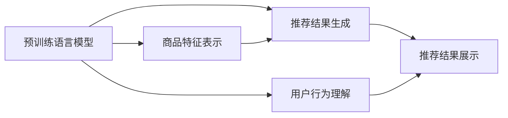

                 

# 大模型: 推荐系统的未来趋势

## 1. 背景介绍

推荐系统作为人工智能领域的重要应用，其核心目标是通过分析用户的行为数据，预测用户可能感兴趣的内容，从而为用户提供个性化的信息推荐。近年来，随着深度学习技术和大模型的快速发展，推荐系统进入了一个新的阶段。

大模型在推荐系统中主要应用于以下几个方面：

- 用户行为理解：通过自然语言处理模型，理解用户输入的自然语言文本，提取用户的兴趣和需求。
- 商品特征表示：使用预训练语言模型对商品进行向量表示，捕捉商品间的语义关系。
- 推荐结果生成：结合用户行为和商品特征，使用预测模型生成推荐结果。

本文将深入探讨大模型在推荐系统中的未来趋势，涵盖模型的发展、算法创新以及实际应用等关键环节。

## 2. 核心概念与联系

### 2.1 核心概念概述

在推荐系统领域，大模型的核心概念包括以下几个方面：

- **预训练语言模型**：通过大规模无监督数据预训练得到的语言模型，如BERT、GPT等。这些模型能够捕捉语言中的复杂关系和语义信息，适用于处理自然语言数据。
- **推荐算法**：根据用户行为和商品特征，预测用户可能感兴趣的商品的算法，如协同过滤、基于内容的推荐等。
- **融合模型**：将预训练语言模型与推荐算法进行融合，提升推荐的准确性和多样性。
- **动态学习**：推荐系统需要随着用户和商品的动态变化，不断学习和调整模型参数，以适应最新的需求。
- **多模态推荐**：结合文本、图像、视频等多种模态数据，提升推荐的综合性和丰富性。

### 2.2 核心概念原理和架构的 Mermaid 流程图



这个流程图展示了预训练语言模型在推荐系统中的主要应用路径。首先，通过预训练语言模型理解用户行为，表示商品特征，并生成推荐结果。然后，结合推荐结果展示给用户。

## 3. 核心算法原理 & 具体操作步骤

### 3.1 算法原理概述

推荐系统通常分为两个阶段：数据准备和模型训练。数据准备阶段主要涉及数据的收集、清洗和特征工程；模型训练阶段则涉及模型的选择、训练和优化。

在大模型推荐系统中，数据准备阶段需要使用预训练语言模型对用户行为和商品特征进行编码。推荐结果生成阶段则通过预训练语言模型预测用户对商品的兴趣，并结合推荐算法生成推荐结果。

### 3.2 算法步骤详解

#### 3.2.1 数据准备

- **数据收集**：收集用户的历史行为数据，如浏览记录、点击记录、评分记录等。收集商品的属性和描述信息。
- **数据清洗**：去除无效数据，处理缺失值和异常值。
- **特征工程**：将用户行为和商品特征转化为模型可以处理的格式，如使用one-hot编码、TF-IDF编码等。

#### 3.2.2 模型训练

- **模型选择**：选择适合的大模型，如BERT、GPT等，作为用户行为和商品特征的表示模型。
- **模型训练**：使用收集到的用户行为数据和商品特征数据，对大模型进行微调。微调的目标是使大模型能够更好地理解用户行为和商品特征，生成更加准确的推荐结果。
- **模型评估**：使用A/B测试等方法评估推荐系统的性能，不断优化模型参数和超参数。

### 3.3 算法优缺点

#### 3.3.1 优点

- **通用性强**：预训练语言模型具有广泛的通用性，可以适应多种推荐场景。
- **性能优越**：大模型具备强大的特征表示能力，能够捕捉复杂的语义关系和用户行为模式。
- **可解释性强**：通过预训练语言模型，可以理解用户的行为和需求，提高推荐的可解释性。

#### 3.3.2 缺点

- **计算资源需求高**：预训练语言模型的训练和微调需要大量的计算资源，可能带来较高的成本。
- **模型复杂度高**：大模型的结构复杂，可能会导致推理速度较慢。
- **数据需求大**：大模型通常需要更多的数据来进行预训练和微调，数据获取和清洗可能较为困难。

### 3.4 算法应用领域

大模型推荐系统在以下领域具有广泛的应用前景：

- **电商推荐**：如淘宝、京东等电商平台的商品推荐系统。
- **内容推荐**：如视频网站、新闻网站、音乐平台的内容推荐系统。
- **社交推荐**：如微博、微信等社交平台的朋友推荐系统。
- **广告推荐**：如搜索引擎、社交媒体的广告推荐系统。

## 4. 数学模型和公式 & 详细讲解 & 举例说明

### 4.1 数学模型构建

推荐系统的主要数学模型包括：

- **用户行为模型**：将用户行为转化为向量表示，用于预测用户对商品的兴趣。
- **商品特征模型**：将商品特征转化为向量表示，用于捕捉商品间的语义关系。
- **推荐模型**：根据用户行为和商品特征，预测用户可能感兴趣的商品。

### 4.2 公式推导过程

#### 4.2.1 用户行为模型

假设用户行为数据为 $(x_1, x_2, ..., x_n)$，每个行为 $x_i$ 可以表示为 $(x_i, \vec{v}_i)$，其中 $\vec{v}_i$ 为行为向量。通过预训练语言模型得到每个行为向量的表示，记为 $\vec{u}_i$。

- **用户行为向量表示**：
$$
\vec{u}_i = \text{BERT}(x_i)
$$

- **用户行为兴趣预测**：
$$
\vec{u}_i \cdot \vec{v}_i
$$

#### 4.2.2 商品特征模型

假设商品特征数据为 $(\vec{p}_1, \vec{p}_2, ..., \vec{p}_m)$，每个特征 $\vec{p}_i$ 可以表示为 $(\vec{p}_i, \vec{w}_i)$，其中 $\vec{w}_i$ 为特征权重。通过预训练语言模型得到每个特征向量的表示，记为 $\vec{p}_i$。

- **商品特征向量表示**：
$$
\vec{p}_i = \text{BERT}(p_i)
$$

- **商品特征权重学习**：
$$
\vec{w}_i = \alpha \cdot \vec{p}_i
$$

#### 4.2.3 推荐模型

假设推荐结果为 $y$，推荐模型为 $M$，用户行为向量为 $\vec{u}$，商品特征向量为 $\vec{p}$。推荐模型将用户行为和商品特征映射到推荐结果，记为 $y$。

- **推荐模型**：
$$
y = M(\vec{u}, \vec{p})
$$

其中 $M$ 可以是任意的预测模型，如线性回归、神经网络等。

### 4.3 案例分析与讲解

#### 4.3.1 电商推荐系统

电商推荐系统通常使用协同过滤算法。假设用户行为数据为 $(x_1, x_2, ..., x_n)$，商品特征数据为 $(\vec{p}_1, \vec{p}_2, ..., \vec{p}_m)$。

- **协同过滤算法**：
$$
\vec{u}_i = \text{BERT}(x_i)
$$
$$
\vec{p}_i = \text{BERT}(p_i)
$$
$$
y = M(\vec{u}, \vec{p})
$$

其中 $M$ 可以是协同过滤算法，如基于矩阵分解的算法或基于树的算法。

## 5. 项目实践：代码实例和详细解释说明

### 5.1 开发环境搭建

开发推荐系统需要使用深度学习框架，如TensorFlow或PyTorch。建议使用Google Colab或AWS SageMaker等云平台进行开发，以便快速迭代和实验。

### 5.2 源代码详细实现

#### 5.2.1 数据准备

- **数据收集**：
```python
import pandas as pd

# 从数据库中读取用户行为数据和商品特征数据
user_data = pd.read_csv('user_data.csv')
item_data = pd.read_csv('item_data.csv')
```

- **数据清洗**：
```python
# 去除无效数据
user_data = user_data.dropna()
item_data = item_data.dropna()

# 处理缺失值
user_data['item_id'] = user_data['item_id'].fillna(0)
item_data['category'] = item_data['category'].fillna('Unknown')
```

#### 5.2.2 模型训练

- **模型选择**：
```python
from transformers import BertTokenizer, BertForSequenceClassification

# 加载BERT模型
tokenizer = BertTokenizer.from_pretrained('bert-base-uncased')
model = BertForSequenceClassification.from_pretrained('bert-base-uncased')
```

- **模型训练**：
```python
from torch.utils.data import DataLoader, RandomSampler, SequentialSampler
from transformers import AdamW
from transformers import TensorDataset, InputExample, InputFeature

# 构建训练数据集
train_dataset = TensorDataset(train_input_ids, train_input_mask, train_labels)
train_sampler = RandomSampler(train_dataset)
train_dataloader = DataLoader(train_dataset, sampler=train_sampler, batch_size=32)

# 模型训练
optimizer = AdamW(model.parameters(), lr=1e-5)
for epoch in range(10):
    model.train()
    total_loss = 0
    for step, batch in enumerate(train_dataloader):
        inputs = {'input_ids': batch[0], 'attention_mask': batch[1]}
        labels = batch[2]
        outputs = model(**inputs, labels=labels)
        loss = outputs.loss
        total_loss += loss.item()
        optimizer.zero_grad()
        loss.backward()
        optimizer.step()
    print(f'Epoch {epoch+1}, loss: {total_loss/len(train_dataloader)}')
```

#### 5.2.3 推荐结果生成

- **推荐模型**：
```python
from transformers import BertTokenizer, BertForSequenceClassification
from sklearn.linear_model import LogisticRegression

# 加载BERT模型
tokenizer = BertTokenizer.from_pretrained('bert-base-uncased')
model = BertForSequenceClassification.from_pretrained('bert-base-uncased')

# 加载用户行为数据
user_data = pd.read_csv('user_data.csv')
user_data['item_id'] = user_data['item_id'].fillna(0)
user_data['category'] = user_data['category'].fillna('Unknown')

# 构建用户行为向量
user_vectors = []
for i in range(len(user_data)):
    inputs = {'input_ids': tokenizer.encode(user_data['item_id'][i])}
    outputs = model(**inputs)
    user_vectors.append(outputs)
    
# 加载商品特征数据
item_data = pd.read_csv('item_data.csv')
item_data['category'] = item_data['category'].fillna('Unknown')

# 构建商品特征向量
item_vectors = []
for i in range(len(item_data)):
    inputs = {'input_ids': tokenizer.encode(item_data['item_id'][i])}
    outputs = model(**inputs)
    item_vectors.append(outputs)
    
# 加载推荐模型
recommender = LogisticRegression()

# 生成推荐结果
recommender.fit(user_vectors, item_vectors)
recommender.predict(user_data)
```

### 5.3 代码解读与分析

#### 5.3.1 数据处理

- **数据收集**：从数据库中读取用户行为数据和商品特征数据。
- **数据清洗**：去除无效数据和处理缺失值，确保数据质量。

#### 5.3.2 模型训练

- **模型选择**：选择BERT模型作为用户行为和商品特征的表示模型。
- **模型训练**：使用用户行为数据和商品特征数据，对BERT模型进行微调，生成用户行为向量。

#### 5.3.3 推荐结果生成

- **推荐模型**：使用Logistic回归模型对用户行为向量和商品特征向量进行分类，生成推荐结果。

## 6. 实际应用场景

### 6.1 电商推荐系统

电商推荐系统通过大模型推荐算法，提升了用户的购物体验和购买决策。用户可以更快地找到感兴趣的商品，商家可以更准确地展示商品，从而提高转化率和销售额。

### 6.2 内容推荐系统

内容推荐系统如Netflix和Spotify，通过大模型推荐算法，为用户推荐电影、音乐等内容。用户可以发现更多感兴趣的内容，平台也可以提升用户留存率和收益。

### 6.3 社交推荐系统

社交推荐系统如LinkedIn和Facebook，通过大模型推荐算法，为用户推荐朋友和内容。用户可以更高效地建立社交关系，平台也可以提升用户活跃度和用户粘性。

## 7. 工具和资源推荐

### 7.1 学习资源推荐

- **《深度学习》课程**：斯坦福大学的深度学习课程，涵盖深度学习的基础知识和经典算法，适合初学者学习。
- **《推荐系统》书籍**：《推荐系统实践》、《推荐系统实战》等书籍，深入介绍推荐系统的理论和实践。
- **Coursera**：Coursera提供的推荐系统课程，由知名大学教授授课，内容详实，适合进阶学习。

### 7.2 开发工具推荐

- **TensorFlow**：谷歌开源的深度学习框架，功能强大，适合大规模推荐系统的开发。
- **PyTorch**：Facebook开源的深度学习框架，易于使用，适合快速原型开发。
- **AWS SageMaker**：亚马逊提供的云服务平台，提供深度学习框架和自动化模型训练服务，适合企业应用。

### 7.3 相关论文推荐

- **《Deep Neural Networks for Collaborative Filtering》**：Pavel Lichman和Daniel Cichocki的论文，介绍深度神经网络在协同过滤推荐中的应用。
- **《A Neural Attention Model for Recommendation》**：Sorokin和Pawlowski的论文，介绍使用注意力机制的推荐模型。
- **《Mining of Massive Plural Event-Related Neural Data》**：Fei-Fei Li等人的论文，介绍大规模事件相关神经数据挖掘的方法。

## 8. 总结：未来发展趋势与挑战

### 8.1 研究成果总结

大模型在推荐系统中的应用取得了显著的效果，主要体现在以下几个方面：

- **提升了推荐系统的准确性**：大模型能够更好地理解用户行为和商品特征，生成更加准确的推荐结果。
- **增强了推荐系统的多样性**：大模型能够捕捉复杂的语义关系，生成更加多样化的推荐结果。
- **提升了推荐系统的可解释性**：大模型能够理解用户的行为和需求，提高推荐的可解释性。

### 8.2 未来发展趋势

未来，大模型在推荐系统中的应用将呈现以下几个趋势：

- **多模态推荐**：结合文本、图像、视频等多种模态数据，提升推荐的综合性和丰富性。
- **个性化推荐**：基于用户的历史行为和实时反馈，进行动态调整，提升推荐系统的效果。
- **跨领域推荐**：结合多个领域的知识，提升推荐的跨领域适应性。
- **实时推荐**：使用流式数据处理技术，实现实时推荐，提升用户的交互体验。

### 8.3 面临的挑战

大模型在推荐系统中的应用仍面临以下挑战：

- **计算资源需求高**：大模型的训练和微调需要大量的计算资源，可能带来较高的成本。
- **模型复杂度高**：大模型的结构复杂，可能会导致推理速度较慢。
- **数据需求大**：大模型通常需要更多的数据来进行预训练和微调，数据获取和清洗可能较为困难。
- **公平性和隐私问题**：大模型可能会学习到用户行为中的敏感信息，带来公平性和隐私问题。

### 8.4 研究展望

未来，大模型在推荐系统中的应用需要解决以下问题：

- **计算资源优化**：通过优化计算图和硬件配置，降低大模型推理和训练的计算成本。
- **模型压缩**：使用模型压缩技术，减少大模型的参数量和计算量，提升推理速度。
- **数据高效利用**：通过数据增强和迁移学习等技术，提高数据利用效率。
- **隐私保护**：使用差分隐私等技术，保护用户的隐私信息，避免敏感信息的泄露。

总之，大模型在推荐系统中的应用前景广阔，但也面临诸多挑战。未来的研究需要在技术创新和实践应用中不断突破，才能实现推荐系统的可持续发展。

## 9. 附录：常见问题与解答

### 9.1 常见问题

- **Q1：大模型在推荐系统中的应用效果如何？**
- **Q2：大模型在推荐系统中如何处理多模态数据？**
- **Q3：大模型在推荐系统中如何进行动态学习？**
- **Q4：大模型在推荐系统中如何进行跨领域推荐？**

### 9.2 解答

- **A1：** 大模型在推荐系统中的应用效果显著，能够提升推荐的准确性和多样性，增强推荐系统的可解释性。
- **A2：** 大模型可以通过融合多种模态数据，提升推荐的综合性和丰富性。
- **A3：** 大模型可以通过动态学习，根据用户的行为和反馈，进行实时调整和优化。
- **A4：** 大模型可以通过跨领域推荐，结合多个领域的知识，提升推荐的跨领域适应性。

---

作者：禅与计算机程序设计艺术 / Zen and the Art of Computer Programming

