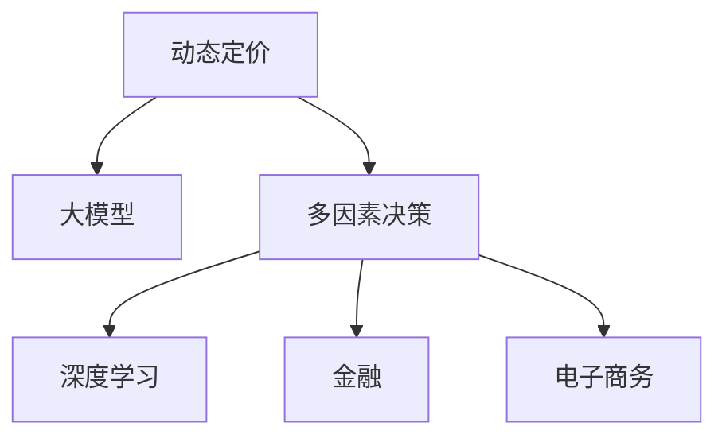

                 

# 大模型在动态定价中的多因素决策应用

> 关键词：大模型,动态定价,多因素决策,深度学习,金融,电子商务

## 1. 背景介绍

### 1.1 问题由来

动态定价是指企业根据市场需求和竞争状况实时调整商品或服务的售价，以实现利润最大化。在现代商业环境中，随着在线交易平台和移动支付的普及，市场竞争更加激烈，消费者行为更加复杂多变。如何在瞬息万变的环境中，及时精准地进行动态定价，成为企业亟需解决的难题。

近年来，随着深度学习和大模型的快速发展，企业开始尝试使用大模型进行动态定价的决策，以期获得更精准的预测和更优的定价策略。特别是在电商和金融领域，大模型在实时处理大规模数据、捕捉用户行为变化等方面的优势，使其成为动态定价的重要工具。

### 1.2 问题核心关键点

动态定价问题本质上是一个多因素决策问题。通过观察和分析，影响商品或服务价格的因素包括但不限于：
- 市场需求量
- 竞争对手价格
- 商品库存量
- 用户行为（浏览、购买、评论等）
- 时间（节假日、季节性变化等）
- 特殊事件（促销活动、价格波动等）

解决动态定价问题，需要建立一套包含上述多种因素的预测模型，并通过实时数据进行动态调价，以适应不断变化的市场条件。

### 1.3 问题研究意义

研究大模型在动态定价中的应用，对于企业提升市场竞争力、优化利润结构、降低运营成本具有重要意义。在实际操作中，企业可以利用大模型的强大预测能力，实现更灵活的定价策略，及时响应市场变化，从而在激烈的市场竞争中获得优势。

大模型技术在动态定价中的应用，还为市场营销策略的优化、客户行为分析等提供了新的视角和方法。企业可以更加深入地理解客户需求，优化产品和服务，提升客户满意度和忠诚度。

## 2. 核心概念与联系

### 2.1 核心概念概述

为更好地理解大模型在动态定价中的应用，本节将介绍几个密切相关的核心概念：

- 动态定价(Dynamic Pricing)：根据市场需求和竞争状况实时调整商品或服务的售价，以实现利润最大化。
- 大模型(Large Model)：以深度学习框架为代表的，在大规模无标签数据上预训练得到的复杂神经网络模型。
- 多因素决策(Multi-factor Decision)：在决策过程中综合考虑多种因素，以提高决策的准确性和鲁棒性。
- 深度学习(Deep Learning)：通过多层神经网络模型，从数据中自动学习特征表示，实现复杂的预测和分类任务。
- 金融(Finance)：涉及资金管理和资金流通的学科，是动态定价的重要应用场景之一。
- 电子商务(E-commerce)：指通过互联网进行商品和服务交易的活动，也是动态定价的典型应用场景。

这些核心概念之间的逻辑关系可以通过以下Mermaid流程图来展示：



这个流程图展示了大模型在动态定价中的应用框架：

1. 动态定价问题需要综合考虑多种因素，可以借助多因素决策模型进行处理。
2. 大模型作为多因素决策模型的核心组成部分，可以自动从海量数据中学习特征表示。
3. 深度学习是实现大模型的关键技术，通过多层网络结构的建模，提升预测准确性。
4. 金融和电子商务领域是大模型在动态定价中重要的应用场景，具备实际应用价值。

## 3. 核心算法原理 & 具体操作步骤
### 3.1 算法原理概述

基于大模型的动态定价算法，通过综合考虑市场需求、竞争状况、库存量、用户行为等多种因素，建立一个预测模型，实时输出商品或服务的价格。该模型的核心思想是：

1. **数据驱动**：利用历史数据和实时数据，训练出一个高精度的预测模型，以支持动态定价决策。
2. **实时更新**：通过在线学习的方式，不断更新模型参数，以适应实时市场变化。
3. **多因素融合**：将多种影响因素综合考虑，通过深度学习模型进行优化，提升决策的准确性和鲁棒性。

具体来说，假设商品或服务的动态定价问题为 $P(t)$，其中 $t$ 表示时间。影响 $P(t)$ 的因素包括市场需求 $D(t)$、竞争状况 $C(t)$、库存量 $S(t)$、用户行为 $B(t)$ 等。动态定价的目标是最大化利润函数 $ \pi(P(t)) $。

通过大模型，可以建立一个基于多因素决策的预测模型，形式化为：

$$
P(t) = f(D(t), C(t), S(t), B(t), \theta)
$$

其中，$f$ 为模型函数，$\theta$ 为模型参数。该模型将多种因素综合考虑，通过深度学习自动学习特征表示，实现对动态定价的预测。

### 3.2 算法步骤详解

基于大模型的动态定价算法主要包括以下几个关键步骤：

**Step 1: 数据准备**
- 收集历史交易数据、市场数据、库存数据、用户行为数据等，作为训练数据。
- 将数据进行预处理，包括特征工程、数据清洗、归一化等操作。

**Step 2: 模型设计**
- 选择合适的大模型框架（如TensorFlow、PyTorch），设计多因素决策模型。
- 将多种因素通过神经网络模型进行编码，构建输入特征向量。
- 设计合适的损失函数和优化器，以支持实时更新的需求。

**Step 3: 模型训练**
- 使用历史数据对模型进行训练，最小化预测误差。
- 在训练过程中，逐步引入实时数据，实现模型的在线学习。
- 定期在验证集上评估模型性能，调整模型参数。

**Step 4: 实时预测**
- 将实时市场需求、竞争状况、库存量、用户行为等数据输入模型。
- 模型实时输出商品或服务的价格，根据预测结果进行动态调价。

**Step 5: 结果反馈**
- 收集实际交易数据，更新模型参数，进一步提升模型精度。
- 持续监控市场变化，调整模型结构和参数，保持模型的高效运行。

### 3.3 算法优缺点

基于大模型的动态定价算法具有以下优点：
1. **高精度**：大模型能够自动学习复杂特征表示，提升预测精度。
2. **实时更新**：通过在线学习，模型能够及时响应市场变化，实现实时定价。
3. **多因素融合**：将多种影响因素综合考虑，提高决策的全面性和鲁棒性。
4. **可扩展性强**：模型可以轻松扩展到不同商品或服务，具备广泛的应用前景。

同时，该算法也存在一些局限性：
1. **数据依赖性强**：模型依赖于历史数据和实时数据的质量和完整性，数据缺失或不准可能导致预测误差。
2. **计算资源消耗大**：大模型的训练和推理需要大量计算资源，可能对硬件设备要求较高。
3. **模型复杂度高**：模型参数量庞大，可能导致过拟合和计算负担。

尽管存在这些局限性，但就目前而言，基于大模型的动态定价算法仍是解决复杂定价问题的有效手段。未来相关研究的重点在于如何进一步优化模型结构，降低计算资源消耗，同时提升模型的泛化能力和可解释性。

### 3.4 算法应用领域

基于大模型的动态定价算法在金融和电子商务领域具有广泛的应用前景：

- **金融领域**：用于股票、期货、外汇等金融产品的动态定价。通过综合考虑市场情绪、流动性、波动率等因素，实现实时定价和风险管理。
- **电子商务领域**：用于商品、服务、广告等的价格动态调整。通过分析用户行为、竞争对手价格、库存量等因素，实现精准定价和促销策略优化。

除了上述这些经典应用外，大模型的动态定价方法还可以扩展到更多场景中，如能源定价、交通定价、旅游定价等，为不同行业的定价决策提供新的工具和方法。

## 4. 数学模型和公式 & 详细讲解 & 举例说明

### 4.1 数学模型构建

本节将使用数学语言对基于大模型的动态定价模型进行更加严格的刻画。

假设影响商品或服务价格的因素为 $X_1, X_2, \ldots, X_n$，其中 $X_i$ 表示第 $i$ 个因素，如市场需求、库存量等。设 $P$ 为商品或服务的价格，$D$ 为市场需求，$C$ 为竞争状况，$S$ 为库存量，$B$ 为用户行为。动态定价模型可以表示为：

$$
P = f(D, C, S, B; \theta)
$$

其中 $f$ 为预测函数，$\theta$ 为模型参数。

在实际应用中，我们可以将上述函数表示为神经网络模型：

$$
P = W\cdot X + b
$$

其中 $W$ 为权重矩阵，$b$ 为偏置项，$X$ 为输入特征向量，形式化为：

$$
X = [D, C, S, B]
$$

### 4.2 公式推导过程

在深度学习框架中，预测函数 $f$ 可以通过多层神经网络实现，形式为：

$$
P = M_1 \cdot M_2 \cdot \ldots \cdot M_L \cdot X
$$

其中 $M_i$ 为第 $i$ 层神经网络，$L$ 为神经网络深度。通过反向传播算法，可以更新模型参数 $\theta$，最小化预测误差。

假设模型输出的预测价格为 $\hat{P}$，真实价格为 $P$，则损失函数为：

$$
\mathcal{L} = \frac{1}{N} \sum_{i=1}^N (P_i - \hat{P_i})^2
$$

其中 $N$ 为样本数量，$P_i$ 为第 $i$ 个样本的真实价格，$\hat{P_i}$ 为模型的预测价格。通过梯度下降等优化算法，最小化损失函数，更新模型参数 $\theta$。

在得到损失函数的梯度后，即可带入参数更新公式，完成模型的迭代优化。重复上述过程直至收敛，最终得到适应实时市场变化的动态定价模型。

### 4.3 案例分析与讲解

假设某电商平台希望通过大模型进行动态定价，预测某款商品的实时价格。已知商品的历史销售数据、市场需求、库存量、用户行为等数据，可以通过以下步骤进行建模和预测：

**Step 1: 数据准备**
- 收集历史交易数据、市场需求数据、库存数据、用户行为数据等。
- 将数据进行预处理，包括特征工程、数据清洗、归一化等操作。

**Step 2: 模型设计**
- 选择合适的大模型框架（如TensorFlow、PyTorch），设计多因素决策模型。
- 将市场需求、库存量、用户行为等数据通过神经网络模型进行编码，构建输入特征向量。
- 设计合适的损失函数和优化器，如均方误差损失函数、Adam优化器。

**Step 3: 模型训练**
- 使用历史数据对模型进行训练，最小化预测误差。
- 在训练过程中，逐步引入实时数据，实现模型的在线学习。
- 定期在验证集上评估模型性能，调整模型参数。

**Step 4: 实时预测**
- 将实时市场需求、库存量、用户行为等数据输入模型。
- 模型实时输出商品的价格，根据预测结果进行动态调价。

**Step 5: 结果反馈**
- 收集实际交易数据，更新模型参数，进一步提升模型精度。
- 持续监控市场变化，调整模型结构和参数，保持模型的高效运行。

通过上述步骤，电商平台可以实现基于大模型的动态定价，及时响应市场需求，优化商品价格，提升用户满意度和平台收益。

## 5. 项目实践：代码实例和详细解释说明
### 5.1 开发环境搭建

在进行动态定价实践前，我们需要准备好开发环境。以下是使用Python进行TensorFlow开发的环境配置流程：

1. 安装Anaconda：从官网下载并安装Anaconda，用于创建独立的Python环境。

2. 创建并激活虚拟环境：
```bash
conda create -n tf-env python=3.8 
conda activate tf-env
```

3. 安装TensorFlow：根据CUDA版本，从官网获取对应的安装命令。例如：
```bash
conda install tensorflow -c tf -c conda-forge
```

4. 安装各类工具包：
```bash
pip install numpy pandas scikit-learn matplotlib tqdm jupyter notebook ipython
```

完成上述步骤后，即可在`tf-env`环境中开始动态定价实践。

### 5.2 源代码详细实现

下面我们以电商平台的动态定价为例，给出使用TensorFlow对大模型进行动态定价的Python代码实现。

首先，定义模型输入和输出：

```python
import tensorflow as tf

# 输入数据
X = tf.keras.layers.Input(shape=(4,))

# 输出数据
Y = tf.keras.layers.Dense(1, activation='linear')(X)

# 定义模型
model = tf.keras.Model(inputs=X, outputs=Y)
```

然后，定义模型损失函数和优化器：

```python
# 定义均方误差损失函数
loss = tf.keras.losses.MeanSquaredError()

# 定义Adam优化器
optimizer = tf.keras.optimizers.Adam(learning_rate=0.001)
```

接着，定义训练和评估函数：

```python
# 训练函数
def train(model, train_data, epochs):
    for epoch in range(epochs):
        loss = 0
        for i in range(len(train_data)):
            inputs, targets = train_data[i]
            with tf.GradientTape() as tape:
                predictions = model(inputs)
                loss += loss(targets, predictions)
            grads = tape.gradient(loss, model.trainable_variables)
            optimizer.apply_gradients(zip(grads, model.trainable_variables))
        print(f'Epoch {epoch+1}, Loss: {loss:.4f}')

# 评估函数
def evaluate(model, test_data):
    loss = 0
    for i in range(len(test_data)):
        inputs, targets = test_data[i]
        predictions = model(inputs)
        loss += loss(targets, predictions)
    print(f'Test Loss: {loss:.4f}')
```

最后，启动训练流程并在测试集上评估：

```python
# 训练数据和测试数据
train_data = [(X_train, Y_train), (X_val, Y_val), (X_test, Y_test)]
test_data = [(X_val, Y_val), (X_test, Y_test)]

# 训练模型
model.compile(optimizer=optimizer, loss=loss)
train(model, train_data, epochs=10)

# 评估模型
evaluate(model, test_data)
```

以上就是使用TensorFlow对大模型进行动态定价的完整代码实现。可以看到，得益于TensorFlow的高效计算能力和丰富的API，代码实现相对简洁，易于理解和调试。

### 5.3 代码解读与分析

让我们再详细解读一下关键代码的实现细节：

**定义输入和输出**
- `tf.keras.layers.Input`：定义模型的输入，这里设定输入数据的形状为(4,)，即包含4个特征。

**定义输出层**
- `tf.keras.layers.Dense`：定义输出层，使用线性激活函数，输出一个标量值，表示商品的实时价格。

**损失函数和优化器**
- `tf.keras.losses.MeanSquaredError`：定义均方误差损失函数，用于衡量预测价格与真实价格之间的差异。
- `tf.keras.optimizers.Adam`：定义Adam优化器，用于更新模型参数，最小化损失函数。

**训练和评估函数**
- `train`函数：遍历训练数据，对每个样本进行前向传播和反向传播，计算损失并更新模型参数。
- `evaluate`函数：遍历测试数据，计算预测价格与真实价格之间的均方误差。

**模型训练和评估**
- 在`train`函数中，通过`tf.GradientTape`计算梯度，并使用`optimizer.apply_gradients`更新模型参数。
- 在`evaluate`函数中，直接计算预测价格与真实价格之间的均方误差，给出评估结果。

可以看到，TensorFlow提供了丰富的API和灵活的设计思路，能够快速构建和训练动态定价模型。开发者可以根据具体需求，灵活设计模型结构和优化算法，实现精准定价和实时调价。

## 6. 实际应用场景
### 6.1 智能客服系统

在智能客服系统中，动态定价可以用于优化客户服务体验和平台收益。例如，电商平台可以根据用户的历史购买行为、实时浏览记录、库存量等数据，动态调整商品价格，实现个性化推荐和精准定价。

具体实现中，可以通过大模型预测用户可能感兴趣的商品，并实时调整价格，提高用户的购买意愿和平台收益。同时，大模型还可以分析用户的满意度反馈，优化定价策略，提升客户体验。

### 6.2 金融领域

在金融领域，动态定价可以用于股票、期货、外汇等金融产品的实时定价和风险管理。例如，金融机构可以根据市场情绪、流动性、波动率等因素，实时调整金融产品的价格，以实现风险控制和收益最大化。

具体实现中，可以通过大模型预测市场走势，调整金融产品的价格和利率，优化投资组合和风险管理策略。同时，大模型还可以实时监控市场变化，预警风险，确保金融系统的稳定运行。

### 6.3 电子商务领域

在电子商务领域，动态定价可以用于商品、服务、广告等的价格调整和促销策略优化。例如，电商平台可以根据实时市场需求、库存量、用户行为等数据，动态调整商品价格，实现精准定价和促销优化。

具体实现中，可以通过大模型预测用户购买意向，动态调整商品价格和促销策略，提高用户满意度和平台收益。同时，大模型还可以分析用户反馈，优化商品推荐和营销策略，提升用户粘性和平台活跃度。

### 6.4 未来应用展望

随着大模型和动态定价技术的不断发展，未来在更多领域将出现新的应用场景：

- **能源定价**：能源公司可以实时调整电价、天然气价等，以应对市场需求和供应变化，优化能源分配和节约资源。
- **交通定价**：公共交通公司可以根据实时客流量、车辆运行状况等因素，动态调整票价和班次，提高运输效率和服务质量。
- **旅游定价**：旅游公司可以根据实时市场需求、季节性变化等因素，动态调整旅游产品价格，提升旅游体验和收益。

以上应用场景展示了动态定价技术的广泛前景。未来，大模型将在大数据和实时计算的支持下，进一步提升动态定价的精度和效率，为各行业的决策支持提供强大的技术支撑。

## 7. 工具和资源推荐
### 7.1 学习资源推荐

为了帮助开发者系统掌握动态定价的原理和大模型的应用，这里推荐一些优质的学习资源：

1. TensorFlow官方文档：提供了完整的动态定价模型构建和训练教程，是快速入门和学习的重要资料。

2. Kaggle动态定价比赛：Kaggle平台上的动态定价竞赛，可以积累实际应用经验，学习先进技术和算法。

3. 《深度学习入门：基于TensorFlow》书籍：由深度学习领域的知名专家撰写，详细介绍了TensorFlow的使用方法和动态定价的应用案例。

4. Coursera深度学习课程：Coursera平台上的深度学习课程，涵盖深度学习基础和动态定价等实际应用场景，适合进阶学习。

5. 《Python深度学习》书籍：由深度学习领域的顶尖专家编写，介绍了TensorFlow、PyTorch等框架的使用，涵盖动态定价等实际应用。

通过对这些资源的学习实践，相信你一定能够快速掌握大模型在动态定价中的应用，并用于解决实际的商业问题。

### 7.2 开发工具推荐

高效的开发离不开优秀的工具支持。以下是几款用于动态定价和大模型应用的常用工具：

1. TensorFlow：基于Google开源的深度学习框架，提供灵活的计算图设计和高效的模型训练。

2. PyTorch：由Facebook开源的深度学习框架，支持动态计算图和高效的分布式训练。

3. Jupyter Notebook：支持Python、R等编程语言的交互式编程环境，方便快速迭代和调试。

4. TensorBoard：TensorFlow的可视化工具，实时监控模型训练状态，提供丰富的图表呈现方式。

5. Weights & Biases：模型训练的实验跟踪工具，记录和可视化模型训练过程中的各项指标，方便对比和调优。

合理利用这些工具，可以显著提升动态定价和大模型应用的开发效率，加快创新迭代的步伐。

### 7.3 相关论文推荐

动态定价和大模型技术的发展源于学界的持续研究。以下是几篇奠基性的相关论文，推荐阅读：

1. 《Deep Learning for Dynamic Pricing in Online Marketplaces》：介绍基于深度学习的大模型在动态定价中的应用，展示了在电商领域的实证效果。

2. 《Multi-factor Dynamic Pricing Using Deep Reinforcement Learning》：提出基于强化学习的大模型动态定价方法，展示了在金融领域的实证效果。

3. 《Real-time Dynamic Pricing in E-commerce》：介绍动态定价的实时计算方法和大模型的应用，展示了在电商领域的实证效果。

4. 《Adaptive Dynamic Pricing in E-commerce》：提出基于适应性学习的大模型动态定价方法，展示了在电商领域的实证效果。

5. 《Dynamic Pricing with Deep Neural Networks》：综述了深度学习在动态定价中的应用，展示了在电商和金融领域的实证效果。

这些论文代表了大模型在动态定价技术的发展脉络。通过学习这些前沿成果，可以帮助研究者把握学科前进方向，激发更多的创新灵感。

## 8. 总结：未来发展趋势与挑战

### 8.1 总结

本文对基于大模型的动态定价方法进行了全面系统的介绍。首先阐述了动态定价和大模型的研究背景和意义，明确了动态定价在市场竞争、收益优化、客户服务等方面的重要作用。其次，从原理到实践，详细讲解了大模型在动态定价中的应用过程，给出了动态定价的完整代码实例。同时，本文还广泛探讨了动态定价方法在智能客服、金融、电子商务等多个行业领域的应用前景，展示了动态定价技术的广阔前景。

通过本文的系统梳理，可以看到，基于大模型的动态定价方法正在成为商业决策的重要工具，极大地提升了企业的市场竞争力和客户满意度。未来，伴随大模型技术的不断演进，动态定价将具有更加广泛的应用场景和更加显著的实际效果。

### 8.2 未来发展趋势

展望未来，动态定价技术将呈现以下几个发展趋势：

1. **实时计算能力提升**：随着计算资源和硬件设备的不断进步，动态定价的实时计算能力将进一步提升，能够支持更复杂、更高频率的实时定价决策。

2. **多因素融合深度化**：动态定价模型将更加注重多因素的融合，通过引入更多、更复杂的因素，提升定价决策的全面性和准确性。

3. **自适应学习增强**：通过自适应学习算法，动态定价模型能够实时调整模型参数，适应市场变化，提高决策的灵活性和鲁棒性。

4. **跨领域应用拓展**：动态定价技术将逐步拓展到更多领域，如能源、交通、旅游等，为各行业的决策支持提供新的工具和方法。

5. **可解释性提升**：动态定价模型将更加注重可解释性，通过引入可解释性技术，增强模型决策的透明度和可信度。

以上趋势凸显了动态定价技术的广阔前景。这些方向的探索发展，必将进一步提升定价决策的准确性和效率，为各行业的运营优化提供新的动力。

### 8.3 面临的挑战

尽管动态定价技术已经取得了显著成效，但在迈向更加智能化、普适化应用的过程中，它仍面临着诸多挑战：

1. **数据质量问题**：动态定价依赖于高质量的历史和实时数据，数据缺失或不准可能导致预测误差。如何提高数据质量，确保数据的完整性和准确性，将是未来研究的重要方向。

2. **计算资源消耗大**：大模型的训练和推理需要大量计算资源，可能对硬件设备要求较高。如何优化模型结构和算法，降低计算资源消耗，将是一个重要的研究方向。

3. **模型复杂度高**：动态定价模型参数量庞大，可能导致过拟合和计算负担。如何简化模型结构，提高模型的泛化能力和可解释性，将是未来研究的重要课题。

4. **模型鲁棒性不足**：动态定价模型面对域外数据时，泛化性能往往大打折扣。如何提高模型的鲁棒性，避免灾难性遗忘，还需要更多理论和实践的积累。

5. **系统稳定性问题**：动态定价系统需要高度稳定的运行环境，避免异常和故障。如何设计稳定可靠的系统架构，确保系统的高可用性，将是未来研究的重要方向。

6. **伦理道德约束**：动态定价模型可能涉及敏感数据和隐私保护问题，如何设计合规合法的算法，确保用户隐私和数据安全，将是未来研究的重要课题。

正视动态定价面临的这些挑战，积极应对并寻求突破，将是大模型在动态定价中走向成熟的必由之路。相信随着学界和产业界的共同努力，这些挑战终将一一被克服，动态定价技术必将在构建智能化决策体系中发挥更大的作用。

### 8.4 研究展望

面对动态定价所面临的种种挑战，未来的研究需要在以下几个方面寻求新的突破：

1. **数据预处理和增强**：探索更多数据预处理和增强技术，提升数据质量和多样性，确保动态定价模型的准确性和泛化能力。

2. **多因素融合模型**：研究多因素融合模型，引入更多、更复杂的因素，提升定价决策的全面性和准确性。

3. **自适应学习算法**：开发自适应学习算法，使动态定价模型能够实时调整模型参数，适应市场变化，提高决策的灵活性和鲁棒性。

4. **模型结构优化**：简化模型结构，引入模型压缩、稀疏化存储等技术，降低计算资源消耗，提高模型的泛化能力和可解释性。

5. **可解释性提升**：引入可解释性技术，增强模型决策的透明度和可信度，提升用户信任和满意度。

6. **伦理道德保障**：设计合规合法的算法，确保用户隐私和数据安全，确保算法的公平性和透明性。

这些研究方向的探索，必将引领动态定价技术迈向更高的台阶，为构建稳定、可靠、高效的智能决策系统铺平道路。面向未来，动态定价技术还需要与其他人工智能技术进行更深入的融合，如知识表示、因果推理、强化学习等，多路径协同发力，共同推动决策系统的进步。只有勇于创新、敢于突破，才能不断拓展动态定价技术的边界，让智能决策系统更好地服务于社会和经济的发展。

## 9. 附录：常见问题与解答

**Q1：动态定价与传统定价有何不同？**

A: 动态定价与传统定价的最大不同在于，动态定价能够实时响应市场需求和竞争状况，通过复杂计算模型进行优化决策，实现利润最大化。而传统定价则依赖经验和方法论，无法及时捕捉市场变化，可能导致价格失衡和利润损失。

**Q2：大模型在动态定价中如何处理多因素？**

A: 大模型通过神经网络结构，将多因素通过特征表示嵌入模型中，通过反向传播算法自动学习特征之间的关系。具体来说，可以将多种因素表示为向量，通过多层网络结构进行融合，最终输出定价结果。

**Q3：动态定价的计算资源需求高，如何解决？**

A: 可以通过模型简化、分布式训练、模型压缩等技术，降低动态定价的计算资源消耗。同时，选择合适的计算设备和优化算法，也是提升动态定价效率的重要措施。

**Q4：动态定价的模型鲁棒性不足，如何提升？**

A: 可以通过引入对抗训练、自适应学习等技术，提升动态定价模型的鲁棒性，避免过拟合和灾难性遗忘。同时，通过多模型集成和模型泛化技术，提升模型的泛化能力。

**Q5：动态定价的系统稳定性如何保障？**

A: 可以通过设计稳定可靠的系统架构，包括冗余设计、故障恢复机制、实时监控等措施，确保动态定价系统的稳定运行。同时，合理配置资源，避免系统过载和瓶颈。

通过以上问题的解答，可以看到，动态定价技术和大模型的结合，为企业的定价决策带来了新的机遇和挑战。只有不断优化模型、提升数据质量、保障系统稳定，才能真正实现动态定价的高效和精准，为企业带来更大的市场竞争力和经济效益。

---

作者：禅与计算机程序设计艺术 / Zen and the Art of Computer Programming

