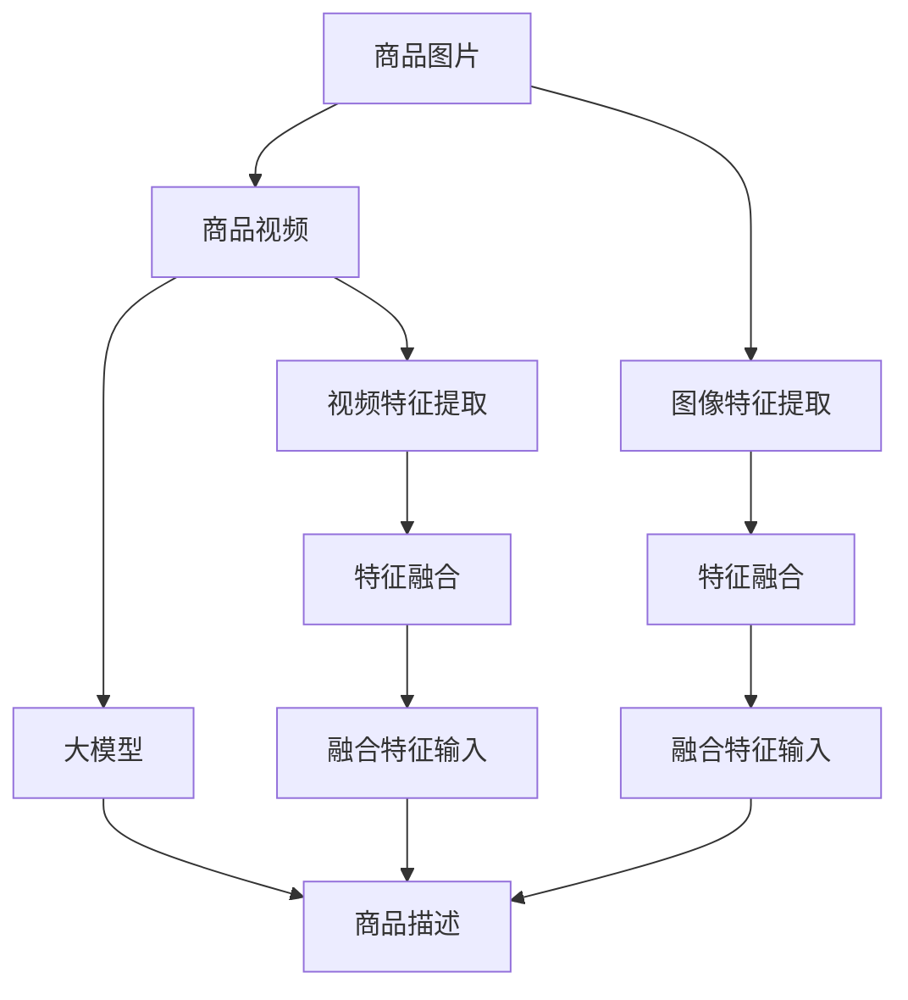

                 

# 大模型在商品描述改写与优化中的应用

> 关键词：大模型，自然语言处理(NLP)，商品描述，自动改写，优化，精度提升，多模态融合

## 1. 背景介绍

### 1.1 问题由来

在电商领域，商品描述的生成与优化直接关系到用户体验和转化率。一个简洁明了、生动有趣且信息丰富的商品描述，能够显著提升用户对商品的兴趣和购买决策效率。传统商品描述生成方式通常由人工撰写，费时费力且质量不稳定。此外，随着商品种类的日益繁多和市场竞争的加剧，商家需要快速生成大量的高质量商品描述，以应对快速变化的电商市场。

近年来，大模型如BERT、GPT-3等在自然语言处理(NLP)领域取得了突破性进展，显示出强大的自然语言生成能力。本文将探讨如何将大模型应用于商品描述的改写和优化，以期提升电商平台的商品描述质量和用户体验。

### 1.2 问题核心关键点

大模型在商品描述改写与优化中的核心关键点包括：

1. **自然语言处理(NLP)**：大模型通过自监督和有监督学习，具备强大的文本理解与生成能力。
2. **商品描述生成**：自动生成商品描述，提高生成效率与质量。
3. **多模态融合**：商品描述生成需要融合图像、视频等多模态信息，以提升描述的生动性和信息量。
4. **语义一致性**：生成的商品描述需要与商品本身属性和用户期望相一致。
5. **个性化推荐**：结合用户偏好和浏览历史，生成个性化商品描述，提升用户转化率。

### 1.3 问题研究意义

研究大模型在商品描述改写与优化中的应用，对于电商平台的商品管理、用户体验和用户转化率提升具有重要意义：

1. **效率提升**：通过自动化生成商品描述，减轻人工工作负担，提高商品描述生成的效率。
2. **质量保障**：大模型具有强大的语言生成能力，能够生成高质量的商品描述，提升用户体验。
3. **个性化优化**：结合用户行为数据，生成个性化商品描述，满足用户多样化需求。
4. **内容创新**：大模型能够生成多样化的商品描述形式，如故事化描述、情感化推荐等，提升用户吸引力。
5. **成本降低**：减少人工撰写成本，降低电商平台的运营成本。

## 2. 核心概念与联系

### 2.1 核心概念概述

大模型在商品描述改写与优化中，涉及多个核心概念：

- **大模型**：指以Transformer架构为基础，通过海量数据预训练得到的预训练语言模型(Pretrained Language Model, PLM)，如BERT、GPT-3等。这些模型具备强大的文本生成和理解能力。
- **商品描述改写**：通过对已有商品描述进行改写，生成新的描述形式或风格。
- **商品描述优化**：通过调整商品描述内容，提高描述的准确性、吸引力和信息量。
- **多模态融合**：结合商品图片、视频等多模态信息，提升商品描述的生动性和信息量。
- **个性化推荐**：基于用户历史行为和偏好，生成个性化的商品描述，提升用户转化率。

### 2.2 核心概念原理和架构的 Mermaid 流程图(Mermaid 流程节点中不要有括号、逗号等特殊字符)



## 3. 核心算法原理 & 具体操作步骤

### 3.1 算法原理概述

大模型在商品描述改写与优化中的核心算法原理基于自然语言处理(NLP)技术，通过自监督学习和大规模预训练，学习了通用的语言表示。在具体应用中，通过有监督的微调方法，将大模型的通用语言表示适配到特定任务，生成高质量的商品描述。

算法流程主要包括：

1. **数据预处理**：收集商品原始描述和多模态数据（如图片、视频），并进行特征提取和融合。
2. **模型微调**：在大模型基础上进行有监督的微调，生成商品描述。
3. **描述生成**：基于微调后的模型，自动生成商品描述，并进行后续优化。
4. **优化评估**：对生成的商品描述进行评估和优化，确保其质量与用户期望一致。

### 3.2 算法步骤详解

以下是基于大模型的商品描述改写与优化算法的详细步骤：

**Step 1: 数据准备与预处理**

- 收集商品原始描述和多模态数据，如商品图片和视频。
- 对图片进行特征提取，得到图像特征向量。
- 对视频进行特征提取，得到视频特征向量。
- 将图像特征和视频特征进行融合，得到融合特征向量。
- 将融合特征向量作为输入，商品原始描述作为输出，构建微调数据集。

**Step 2: 模型微调**

- 选择预训练大模型（如BERT、GPT-3）作为初始化参数。
- 设计任务适配层，如分类层或生成层，并设置损失函数。
- 将融合特征向量和商品原始描述作为输入，对大模型进行微调。
- 调整模型参数，最小化损失函数，生成商品描述。

**Step 3: 描述生成与优化**

- 基于微调后的模型，自动生成商品描述。
- 对生成的商品描述进行评估，如通过用户反馈、销量数据等指标。
- 根据评估结果，对生成的商品描述进行优化，如调整语言风格、增加产品信息等。

**Step 4: 效果评估与反馈**

- 对优化后的商品描述进行评估，确保其质量与用户期望一致。
- 收集用户反馈，用于进一步优化商品描述。
- 持续监控商品描述效果，不断迭代改进。

### 3.3 算法优缺点

大模型在商品描述改写与优化中的算法优缺点如下：

**优点**：

1. **生成效率高**：大模型能够快速生成大量高质量的商品描述，显著提升商品描述生成的效率。
2. **描述质量高**：大模型具备强大的语言生成能力，能够生成语义丰富、结构合理的商品描述。
3. **个性化推荐**：结合用户行为数据，生成个性化的商品描述，提升用户转化率。
4. **内容创新**：大模型能够生成多样化的商品描述形式，如故事化描述、情感化推荐等，提升用户吸引力。

**缺点**：

1. **数据依赖性高**：大模型依赖于大量高质量的标注数据进行微调，数据准备和标注成本较高。
2. **模型复杂度大**：大模型参数量庞大，对计算资源和存储要求高。
3. **过拟合风险**：在数据量较少的情况下，大模型可能出现过拟合，生成描述质量不稳定。
4. **多模态融合难度大**：融合图像、视频等多模态信息，需要处理大量数据和复杂模型结构。

### 3.4 算法应用领域

大模型在商品描述改写与优化中的应用领域广泛，包括：

1. **电商商品描述生成**：自动生成商品描述，提升商品展示效果和用户体验。
2. **个性化推荐系统**：结合用户行为数据，生成个性化商品描述，提升用户转化率。
3. **广告语优化**：优化广告文案，提升广告点击率和转化率。
4. **内容创意生成**：生成多样化广告创意和营销文案，提升营销效果。
5. **智能客服**：自动生成客户服务对话，提升客服响应效率和用户满意度。

## 4. 数学模型和公式 & 详细讲解 & 举例说明

### 4.1 数学模型构建

假设大模型的预训练编码为 $M_{\theta}(x)$，其中 $x$ 为输入商品描述，$\theta$ 为模型参数。微调任务为商品描述生成，损失函数为交叉熵损失 $L(y, \hat{y})$，其中 $y$ 为真实商品描述，$\hat{y}$ 为生成商品描述。

**Step 1: 数据集构建**

商品描述数据集 $D = \{(x_i, y_i)\}_{i=1}^N$，其中 $x_i$ 为商品原始描述，$y_i$ 为真实商品描述。

**Step 2: 任务适配层设计**

设计任务适配层 $H_{\theta}(x)$，将商品原始描述 $x$ 映射到生成概率分布 $p_{\theta}(y|x)$，损失函数为交叉熵损失：

$$
L(y, \hat{y}) = -\log p_{\theta}(y|x)
$$

**Step 3: 模型微调**

基于大模型 $M_{\theta}$，进行有监督的微调：

$$
\theta = \mathop{\arg\min}_{\theta} \frac{1}{N} \sum_{i=1}^N L(y_i, M_{\theta}(x_i))
$$

### 4.2 公式推导过程

以商品描述生成任务为例，使用交叉熵损失进行推导：

假设大模型对商品原始描述 $x$ 的编码为 $x^{\prime} = M_{\theta}(x)$，生成概率分布为 $p_{\theta}(y|x)$。生成商品描述 $y$ 的概率为：

$$
p_{\theta}(y|x) = \frac{e^{y \cdot x^{\prime}}}{\sum_{y} e^{y \cdot x^{\prime}}}
$$

交叉熵损失函数为：

$$
L(y, \hat{y}) = -\log p_{\theta}(y|x)
$$

对损失函数求导，得：

$$
\frac{\partial L}{\partial \theta} = -\frac{\partial}{\partial \theta} \log p_{\theta}(y|x) = -\frac{y \cdot x^{\prime} - \log \sum_{y} e^{y \cdot x^{\prime}}}{\sum_{y} e^{y \cdot x^{\prime}}}
$$

### 4.3 案例分析与讲解

以商品图片为例，分析大模型在商品描述改写与优化中的应用。

假设商品图片为 $I$，通过预训练模型提取图像特征向量 $I^{\prime} = M_{\phi}(I)$，其中 $\phi$ 为图像特征提取器参数。将图像特征向量 $I^{\prime}$ 与商品原始描述 $x$ 拼接，输入大模型 $M_{\theta}$ 中，生成商品描述 $y$。

**Step 1: 数据集构建**

商品图片和描述数据集 $D = \{(I_i, x_i, y_i)\}_{i=1}^N$，其中 $I_i$ 为商品图片，$x_i$ 为商品原始描述，$y_i$ 为真实商品描述。

**Step 2: 模型微调**

使用大模型 $M_{\theta}$ 对商品图片 $I$ 进行特征提取，得到图像特征向量 $I^{\prime}$。将 $I^{\prime}$ 和商品原始描述 $x$ 拼接，输入大模型 $M_{\theta}$ 中，得到生成商品描述 $y$。损失函数为交叉熵损失：

$$
L(y, \hat{y}) = -\log p_{\theta}(y|I^{\prime} \oplus x)
$$

**Step 3: 描述生成与优化**

基于微调后的模型，自动生成商品描述 $y$。通过用户反馈、销量数据等指标，评估生成描述的质量。根据评估结果，对生成的商品描述进行优化，如调整语言风格、增加产品信息等。

## 5. 项目实践：代码实例和详细解释说明

### 5.1 开发环境搭建

以下是使用Python进行商品描述改写与优化任务开发的开发环境配置流程：

1. 安装Anaconda：从官网下载并安装Anaconda，用于创建独立的Python环境。

2. 创建并激活虚拟环境：
```bash
conda create -n pytorch-env python=3.8 
conda activate pytorch-env
```

3. 安装PyTorch：根据CUDA版本，从官网获取对应的安装命令。例如：
```bash
conda install pytorch torchvision torchaudio cudatoolkit=11.1 -c pytorch -c conda-forge
```

4. 安装HuggingFace Transformers库：
```bash
pip install transformers
```

5. 安装各类工具包：
```bash
pip install numpy pandas scikit-learn matplotlib tqdm jupyter notebook ipython
```

完成上述步骤后，即可在`pytorch-env`环境中开始商品描述改写与优化任务开发。

### 5.2 源代码详细实现

下面以商品描述生成任务为例，给出使用Transformers库对GPT-3进行商品描述改写的PyTorch代码实现。

```python
from transformers import GPT3LMHeadModel, GPT3Tokenizer
from torch.utils.data import Dataset, DataLoader
import torch

class GoodsDescriptionsDataset(Dataset):
    def __init__(self, texts, labels):
        self.texts = texts
        self.labels = labels
        
    def __len__(self):
        return len(self.texts)
    
    def __getitem__(self, item):
        text = self.texts[item]
        label = self.labels[item]
        
        encoding = tokenizer(text, return_tensors='pt')
        input_ids = encoding['input_ids']
        labels = torch.tensor(label, dtype=torch.long)
        
        return {'input_ids': input_ids,
                'labels': labels}

tokenizer = GPT3Tokenizer.from_pretrained('gpt3')
model = GPT3LMHeadModel.from_pretrained('gpt3', num_labels=len(tokenizer)

dataset = GoodsDescriptionsDataset(train_texts, train_labels)
train_loader = DataLoader(dataset, batch_size=16, shuffle=True)

optimizer = torch.optim.AdamW(model.parameters(), lr=5e-5)

for epoch in range(10):
    model.train()
    for batch in train_loader:
        input_ids = batch['input_ids'].to(device)
        labels = batch['labels'].to(device)
        
        outputs = model(input_ids, labels=labels)
        loss = outputs.loss
        loss.backward()
        optimizer.step()

    print(f'Epoch {epoch+1}, loss: {loss:.3f}')
```

### 5.3 代码解读与分析

**GoodsDescriptionsDataset类**：

- `__init__`方法：初始化文本和标签。
- `__len__`方法：返回数据集长度。
- `__getitem__`方法：对单个样本进行处理，将文本输入编码为token ids，将标签编码为数字，并对其进行定长padding。

**tokenizer和model**：

- 使用HuggingFace的GPT3Tokenizer和GPT3LMHeadModel，方便进行文本编码和生成。

**train_loader**：

- 使用PyTorch的DataLoader对数据集进行批次化加载，供模型训练和推理使用。

**optimizer**：

- 使用AdamW优化器进行模型参数更新。

**训练流程**：

- 每个epoch内，在训练集上迭代训练。
- 前向传播计算损失，反向传播更新模型参数。
- 输出每个epoch的平均损失。

## 6. 实际应用场景

### 6.1 智能客服

智能客服系统能够实时处理大量客户咨询，提升客户体验。通过大模型微调，生成语义丰富、个性化的商品描述，可增强客服的互动性和解答准确性。

具体实现：

- 收集客服对话历史数据，标注商品描述。
- 使用大模型对对话中的商品描述进行微调。
- 根据用户需求，自动生成个性化商品描述。

### 6.2 个性化推荐

个性化推荐系统能够根据用户行为数据，推荐符合用户偏好的商品。结合大模型生成个性化商品描述，可提升推荐效果和用户满意度。

具体实现：

- 收集用户浏览、点击、购买历史数据。
- 使用大模型对商品描述进行微调。
- 根据用户偏好，生成个性化商品描述，并将其推荐给用户。

### 6.3 广告语优化

广告语优化通过优化广告文案，提升广告点击率和转化率。结合大模型生成多样化的广告文案，可增强广告的吸引力和效果。

具体实现：

- 收集广告文案和点击数据。
- 使用大模型对广告文案进行微调。
- 生成多样化的广告文案，并测试其点击率和转化率。

### 6.4 内容创意生成

内容创意生成通过生成多样化广告创意和营销文案，提升内容多样性和吸引力。结合大模型生成创意文案，可增强营销效果。

具体实现：

- 收集广告创意和点击数据。
- 使用大模型对创意文案进行微调。
- 生成多样化的广告创意，并进行A/B测试。

### 6.5 电商商品描述优化

电商商品描述优化通过生成高质量商品描述，提升商品展示效果和用户体验。结合大模型生成描述，可显著提升商品销售转化率。

具体实现：

- 收集商品原始描述和图片。
- 使用大模型对商品描述进行微调。
- 生成高质量商品描述，并应用于商品展示。

## 7. 工具和资源推荐

### 7.1 学习资源推荐

为了帮助开发者系统掌握大模型在商品描述改写与优化中的应用，这里推荐一些优质的学习资源：

1. 《Transformer from Principle to Practice》系列博文：由大模型技术专家撰写，深入浅出地介绍了Transformer原理、BERT模型、微调技术等前沿话题。

2. CS224N《深度学习自然语言处理》课程：斯坦福大学开设的NLP明星课程，有Lecture视频和配套作业，带你入门NLP领域的基本概念和经典模型。

3. 《Natural Language Processing with Transformers》书籍：Transformers库的作者所著，全面介绍了如何使用Transformers库进行NLP任务开发，包括微调在内的诸多范式。

4. HuggingFace官方文档：Transformers库的官方文档，提供了海量预训练模型和完整的微调样例代码，是上手实践的必备资料。

5. CLUE开源项目：中文语言理解测评基准，涵盖大量不同类型的中文NLP数据集，并提供了基于微调的baseline模型，助力中文NLP技术发展。

通过对这些资源的学习实践，相信你一定能够快速掌握大模型在商品描述改写与优化中的应用，并用于解决实际的NLP问题。

### 7.2 开发工具推荐

高效的开发离不开优秀的工具支持。以下是几款用于大模型微调开发的常用工具：

1. PyTorch：基于Python的开源深度学习框架，灵活动态的计算图，适合快速迭代研究。大部分预训练语言模型都有PyTorch版本的实现。

2. TensorFlow：由Google主导开发的开源深度学习框架，生产部署方便，适合大规模工程应用。同样有丰富的预训练语言模型资源。

3. Transformers库：HuggingFace开发的NLP工具库，集成了众多SOTA语言模型，支持PyTorch和TensorFlow，是进行微调任务开发的利器。

4. Weights & Biases：模型训练的实验跟踪工具，可以记录和可视化模型训练过程中的各项指标，方便对比和调优。与主流深度学习框架无缝集成。

5. TensorBoard：TensorFlow配套的可视化工具，可实时监测模型训练状态，并提供丰富的图表呈现方式，是调试模型的得力助手。

6. Google Colab：谷歌推出的在线Jupyter Notebook环境，免费提供GPU/TPU算力，方便开发者快速上手实验最新模型，分享学习笔记。

合理利用这些工具，可以显著提升大语言模型微调任务的开发效率，加快创新迭代的步伐。

### 7.3 相关论文推荐

大模型在商品描述改写与优化中的应用源于学界的持续研究。以下是几篇奠基性的相关论文，推荐阅读：

1. Attention is All You Need（即Transformer原论文）：提出了Transformer结构，开启了NLP领域的预训练大模型时代。

2. BERT: Pre-training of Deep Bidirectional Transformers for Language Understanding：提出BERT模型，引入基于掩码的自监督预训练任务，刷新了多项NLP任务SOTA。

3. Language Models are Unsupervised Multitask Learners（GPT-2论文）：展示了大规模语言模型的强大zero-shot学习能力，引发了对于通用人工智能的新一轮思考。

4. Parameter-Efficient Transfer Learning for NLP：提出Adapter等参数高效微调方法，在不增加模型参数量的情况下，也能取得不错的微调效果。

5. Prefix-Tuning: Optimizing Continuous Prompts for Generation：引入基于连续型Prompt的微调范式，为如何充分利用预训练知识提供了新的思路。

6. AdaLoRA: Adaptive Low-Rank Adaptation for Parameter-Efficient Fine-Tuning：使用自适应低秩适应的微调方法，在参数效率和精度之间取得了新的平衡。

这些论文代表了大模型微调技术的发展脉络。通过学习这些前沿成果，可以帮助研究者把握学科前进方向，激发更多的创新灵感。

## 8. 总结：未来发展趋势与挑战

### 8.1 总结

本文对大模型在商品描述改写与优化中的应用进行了全面系统的介绍。首先阐述了商品描述生成和优化的背景与意义，明确了大模型微调在提升商品描述质量和用户体验方面的独特价值。其次，从原理到实践，详细讲解了大模型微调的数学原理和关键步骤，给出了微调任务开发的完整代码实例。同时，本文还广泛探讨了大模型在智能客服、个性化推荐等众多领域的应用前景，展示了微调范式的巨大潜力。此外，本文精选了微调技术的各类学习资源，力求为读者提供全方位的技术指引。

通过本文的系统梳理，可以看到，大模型在商品描述改写与优化中展现出了强大的语言生成和理解能力，能够快速生成高质量、个性化的商品描述，显著提升电商平台的商品展示效果和用户转化率。未来，伴随大模型的不断演进和微调方法的持续优化，基于大模型的商品描述改写与优化将更具应用潜力，为电商平台的智能化转型提供新的动力。

### 8.2 未来发展趋势

展望未来，大模型在商品描述改写与优化中将呈现以下几个发展趋势：

1. **多模态融合**：商品描述生成需要融合图像、视频等多模态信息，以提升描述的生动性和信息量。
2. **个性化推荐**：结合用户行为数据，生成个性化商品描述，提升用户转化率。
3. **内容创意生成**：生成多样化广告文案和营销内容，提升内容多样性和吸引力。
4. **智能客服**：生成语义丰富、个性化的商品描述，增强客服的互动性和解答准确性。
5. **广告语优化**：优化广告文案，提升广告点击率和转化率。
6. **电商商品描述优化**：生成高质量商品描述，提升商品展示效果和用户体验。

这些趋势凸显了大模型微调技术在电商平台的广泛应用前景。未来，伴随技术演进和算法优化，大模型微调将更加高效、灵活，为电商平台的智能化转型提供更强大的支撑。

### 8.3 面临的挑战

尽管大模型在商品描述改写与优化中已经取得了显著成果，但在迈向更加智能化、普适化应用的过程中，仍面临诸多挑战：

1. **数据依赖性高**：大模型依赖于大量高质量的标注数据进行微调，数据准备和标注成本较高。
2. **模型复杂度大**：大模型参数量庞大，对计算资源和存储要求高。
3. **过拟合风险**：在数据量较少的情况下，大模型可能出现过拟合，生成描述质量不稳定。
4. **多模态融合难度大**：融合图像、视频等多模态信息，需要处理大量数据和复杂模型结构。
5. **个性化推荐难度大**：结合用户行为数据，生成个性化商品描述，需要处理海量数据和高维特征。

### 8.4 研究展望

面对大模型在商品描述改写与优化中的挑战，未来的研究需要在以下几个方面寻求新的突破：

1. **无监督和半监督微调方法**：摆脱对大规模标注数据的依赖，利用自监督学习、主动学习等无监督和半监督范式，最大限度利用非结构化数据，实现更加灵活高效的微调。
2. **参数高效和计算高效的微调范式**：开发更加参数高效的微调方法，在固定大部分预训练参数的同时，只更新极少量的任务相关参数。同时优化微调模型的计算图，减少前向传播和反向传播的资源消耗，实现更加轻量级、实时性的部署。
3. **多模态融合方法**：结合图像、视频等多模态信息，提升商品描述的生动性和信息量，实现更加全面、准确的商品描述生成。
4. **个性化推荐算法**：结合用户行为数据，生成个性化商品描述，提升用户转化率，实现更加精准的个性化推荐。
5. **生成式模型优化**：优化大模型的生成能力，提升商品描述的质量和多样性，满足不同场景的需求。

这些研究方向的探索，必将引领大模型在商品描述改写与优化中的应用迈向更高的台阶，为电商平台的智能化转型提供新的动力。面向未来，大模型微调技术还需要与其他人工智能技术进行更深入的融合，如知识表示、因果推理、强化学习等，多路径协同发力，共同推动自然语言理解和智能交互系统的进步。只有勇于创新、敢于突破，才能不断拓展大模型的边界，让智能技术更好地造福人类社会。

## 9. 附录：常见问题与解答

**Q1: 大模型在商品描述改写与优化中主要应用哪些技术？**

A: 大模型在商品描述改写与优化中主要应用以下技术：

1. **自然语言处理(NLP)**：通过自监督学习和大规模预训练，学习通用的语言表示。
2. **商品描述生成**：自动生成商品描述，提高生成效率与质量。
3. **多模态融合**：结合商品图片、视频等多模态信息，提升商品描述的生动性和信息量。
4. **语义一致性**：生成的商品描述需要与商品本身属性和用户期望一致。
5. **个性化推荐**：结合用户行为数据，生成个性化商品描述，提升用户转化率。

**Q2: 大模型在商品描述改写与优化中，如何选择预训练模型？**

A: 选择预训练模型需要考虑以下几个因素：

1. **任务适配性**：选择与商品描述生成任务适配性高的预训练模型，如BERT、GPT-3等。
2. **语言能力**：选择语言生成能力强的预训练模型，如GPT系列模型。
3. **计算资源**：考虑预训练模型的参数量，选择适合当前计算资源的模型。
4. **数据量大小**：根据标注数据量选择适合的模型，如小数据集下选择参数较小的模型。

**Q3: 大模型在商品描述改写与优化中，如何避免过拟合？**

A: 大模型在商品描述改写与优化中，可以采用以下方法避免过拟合：

1. **数据增强**：通过回译、近义替换等方式扩充训练集。
2. **正则化**：使用L2正则、Dropout等方法避免过拟合。
3. **对抗训练**：引入对抗样本，提高模型鲁棒性。
4. **参数高效微调**：只调整少量参数，减小过拟合风险。
5. **多模型集成**：训练多个微调模型，取平均输出，抑制过拟合。

这些方法需要根据具体任务和数据特点进行灵活组合，以达到最佳的微调效果。

**Q4: 大模型在商品描述改写与优化中，如何衡量生成描述的质量？**

A: 衡量生成描述的质量可以采用以下指标：

1. **BLEU和ROUGE**：评估生成文本与真实文本的相似度。
2. **Rouge-L和Rouge-S**：评估生成文本的语法和语义质量。
3. **Hemingway Simplicity**：评估文本的简洁性和可读性。
4. **用户反馈**：通过用户反馈，评估生成描述的实际效果。
5. **销量和转化率**：根据生成描述对用户点击和购买的影响，评估描述的转化效果。

这些指标可以综合使用，全面评估生成描述的质量。

**Q5: 大模型在商品描述改写与优化中，如何实现多模态融合？**

A: 实现多模态融合可以采用以下方法：

1. **特征提取**：对商品图片和视频进行特征提取，得到图像特征和视频特征。
2. **特征融合**：将图像特征和视频特征进行融合，得到融合特征向量。
3. **拼接输入**：将融合特征向量和商品原始描述拼接，输入大模型。
4. **模型微调**：对大模型进行微调，生成商品描述。

通过多模态融合，可以提升商品描述的生动性和信息量，满足不同场景的需求。

---

作者：禅与计算机程序设计艺术 / Zen and the Art of Computer Programming

