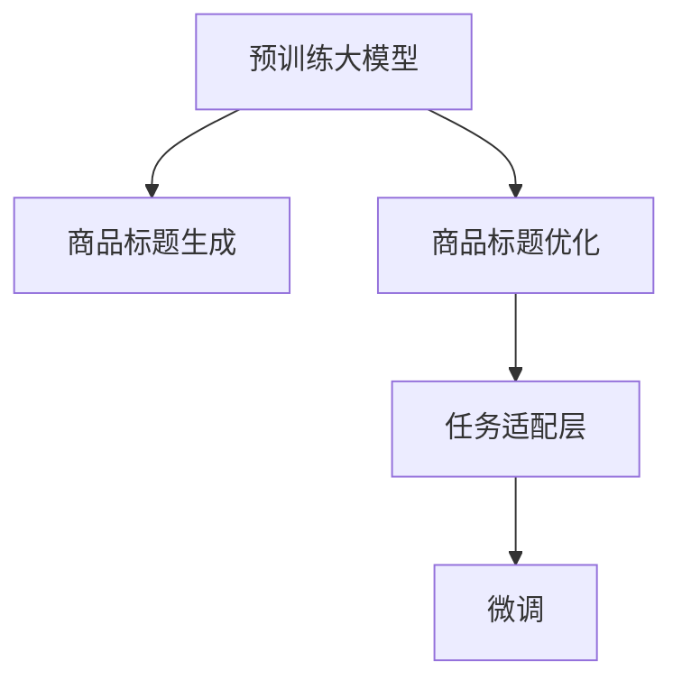

                 

# 大模型在商品标题优化与生成中的应用

## 1. 背景介绍

### 1.1 问题由来

在电子商务领域，商品标题生成和优化是至关重要的一环。优质的商品标题不仅能提高搜索引擎的排名，吸引更多的用户点击和购买，还能减少销售人员的劳动强度，提升运营效率。但传统的手工生成和优化方法耗时耗力，且容易出错，已经难以满足大规模电商平台的实际需求。

近年来，随着深度学习技术的发展，预训练大模型在自然语言生成任务上取得了显著进展。GPT、BERT等大模型不仅具备强大的语言理解和生成能力，还能通过微调进行任务适配，具有极高的应用潜力。本论文旨在探讨利用大模型进行商品标题优化与生成的方法和技术，以期解决传统方法存在的问题。

### 1.2 问题核心关键点

大模型在商品标题优化与生成中的应用主要聚焦于以下核心问题：

- 如何有效利用预训练大模型进行商品标题生成？
- 如何对生成的标题进行优化以匹配商品属性和用户需求？
- 如何构建高效的任务适配层，实现商品标题自动生成与优化？
- 如何在微调过程中避免过拟合，提高模型泛化能力？

本论文将围绕这些关键点展开讨论，并提出相应的解决方案。

## 2. 核心概念与联系

### 2.1 核心概念概述

为更好地理解大模型在商品标题优化与生成中的应用，本节将介绍几个关键概念：

- 预训练大模型：以自回归模型（如GPT）或自编码模型（如BERT）为代表的大规模预训练语言模型。通过在大规模无标签文本语料上进行预训练，学习到通用的语言表示，具备强大的语言理解和生成能力。

- 微调：指在预训练模型的基础上，使用下游任务的少量标注数据，通过有监督地训练优化模型在特定任务上的性能。通常只需要调整顶层分类器或解码器，并以较小的学习率更新全部或部分的模型参数。

- 商品标题生成：利用自然语言生成技术，自动生成符合商品属性和市场需求的标题，以提高搜索引擎排名和用户点击率。

- 商品标题优化：通过对生成的商品标题进行自动优化，使其更精准地描述商品属性和用户需求，提升商品转化率和用户体验。

- 自然语言处理（NLP）：研究如何使计算机处理和理解自然语言的技术，包括文本分类、情感分析、机器翻译、文本摘要、信息检索、问答系统等。

这些概念之间的逻辑关系可以通过以下Mermaid流程图来展示：



这个流程图展示了大模型在商品标题优化与生成中的应用框架：

1. 大模型通过预训练获得基础能力。
2. 利用大模型进行商品标题生成。
3. 对生成的标题进行优化，以匹配商品属性和用户需求。
4. 通过微调优化任务适配层，实现自动生成与优化。

## 3. 核心算法原理 & 具体操作步骤

### 3.1 算法原理概述

基于大模型的商品标题生成与优化，本质上是一个有监督的细粒度迁移学习过程。其核心思想是：将预训练的大模型视作一个强大的"特征提取器"，通过在商品标题生成与优化任务上进行微调，使得模型输出能够匹配任务标签，从而生成或优化商品标题。

具体而言，假设预训练模型为 $M_{\theta}$，其中 $\theta$ 为预训练得到的模型参数。给定商品标题生成与优化任务的标注数据集 $D=\{(x_i, y_i)\}_{i=1}^N$，其中 $x_i$ 为商品描述或属性，$y_i$ 为对应的商品标题。微调的目标是找到新的模型参数 $\hat{\theta}$，使得：

$$
\hat{\theta}=\mathop{\arg\min}_{\theta} \mathcal{L}(M_{\theta},D)
$$

其中 $\mathcal{L}$ 为针对任务 $T$ 设计的损失函数，用于衡量模型预测输出与真实标签之间的差异。常见的损失函数包括交叉熵损失、均方误差损失等。

通过梯度下降等优化算法，微调过程不断更新模型参数 $\theta$，最小化损失函数 $\mathcal{L}$，使得模型输出逼近真实标签。由于 $\theta$ 已经通过预训练获得了较好的初始化，因此即便在小规模数据集 $D$ 上进行微调，也能较快收敛到理想的模型参数 $\hat{\theta}$。

### 3.2 算法步骤详解

基于大模型的商品标题生成与优化一般包括以下几个关键步骤：

**Step 1: 准备预训练模型和数据集**
- 选择合适的预训练语言模型 $M_{\theta}$ 作为初始化参数，如 BERT、GPT等。
- 准备商品标题生成与优化任务的标注数据集 $D$，划分为训练集、验证集和测试集。一般要求标注数据与预训练数据的分布不要差异过大。

**Step 2: 添加任务适配层**
- 根据任务类型，在预训练模型顶层设计合适的输出层和损失函数。
- 对于标题生成任务，通常在顶层添加语言模型解码器，并以负对数似然为损失函数。
- 对于标题优化任务，则需设计优化目标函数，如最大平均准确率、最小平均损失等。

**Step 3: 设置微调超参数**
- 选择合适的优化算法及其参数，如 AdamW、SGD 等，设置学习率、批大小、迭代轮数等。
- 设置正则化技术及强度，包括权重衰减、Dropout、Early Stopping等。
- 确定冻结预训练参数的策略，如仅微调顶层，或全部参数都参与微调。

**Step 4: 执行梯度训练**
- 将训练集数据分批次输入模型，前向传播计算损失函数。
- 反向传播计算参数梯度，根据设定的优化算法和学习率更新模型参数。
- 周期性在验证集上评估模型性能，根据性能指标决定是否触发 Early Stopping。
- 重复上述步骤直到满足预设的迭代轮数或 Early Stopping 条件。

**Step 5: 测试和部署**
- 在测试集上评估微调后模型 $M_{\hat{\theta}}$ 的性能，对比微调前后的精度提升。
- 使用微调后的模型对新商品进行标题生成或优化，集成到实际的应用系统中。
- 持续收集新的商品数据，定期重新微调模型，以适应数据分布的变化。

以上是基于大模型的商品标题生成与优化的一般流程。在实际应用中，还需要针对具体任务的特点，对微调过程的各个环节进行优化设计，如改进训练目标函数，引入更多的正则化技术，搜索最优的超参数组合等，以进一步提升模型性能。

### 3.3 算法优缺点

基于大模型的商品标题生成与优化方法具有以下优点：

1. 高效快速。利用大模型的语言生成能力，可以快速生成大量的商品标题，显著缩短人工编写的时间。
2. 泛化性强。微调过程通过调整顶层分类器或解码器，可以适应不同的商品属性和市场需求，生成多样化的标题。
3. 自动优化。通过优化目标函数，可以自动对生成的标题进行校正，确保其与商品属性和用户需求匹配。
4. 效果显著。微调方法已经在商品描述生成、产品推荐等诸多电商任务上取得了优异的效果，大大提升了运营效率和用户满意度。

同时，该方法也存在一定的局限性：

1. 依赖标注数据。微调的效果很大程度上取决于标注数据的质量和数量，获取高质量标注数据的成本较高。
2. 语言生成能力强弱。预训练模型的语言生成能力直接影响了商品标题的质量，需要持续优化预训练过程以提升生成能力。
3. 处理低频词难度大。微调模型对于少见的商品属性和市场词汇，可能无法很好地生成或优化标题。
4. 过拟合风险。微调过程中，如果过度关注训练样本，可能会忽略模型泛化能力，导致生成或优化出的标题过度拟合训练数据。

尽管存在这些局限性，但就目前而言，基于大模型的商品标题生成与优化方法仍是最主流范式。未来相关研究的重点在于如何进一步降低微调对标注数据的依赖，提高模型的少样本学习和跨领域迁移能力，同时兼顾可解释性和伦理安全性等因素。

### 3.4 算法应用领域

基于大模型的商品标题生成与优化方法，已经在电商领域的诸多任务上得到了广泛的应用，例如：

- 商品描述生成：利用自然语言生成技术，自动生成商品描述，提升产品展示效果和用户点击率。
- 商品推荐：根据用户浏览和购买历史，自动生成商品标题和描述，提高推荐准确性和用户体验。
- 搜索优化：对商品标题进行优化，使其更符合搜索引擎的算法要求，提高排名和曝光率。
- 广告文案生成：自动生成符合广告投放要求的商品标题和广告语，提高广告投放效果和成本效益。
- 多语言商品标题：对多语言商品进行标题自动生成与优化，支持全球化市场推广。

除了上述这些经典任务外，大模型在商品标题生成与优化领域还有更多创新性应用，如虚拟试穿、图像生成、语音搜索等，为电商技术带来了新的突破。随着预训练模型和微调方法的不断进步，相信商品标题生成与优化技术将在更广阔的应用领域大放异彩。

## 4. 数学模型和公式 & 详细讲解  
### 4.1 数学模型构建

本节将使用数学语言对基于大模型的商品标题生成与优化过程进行更加严格的刻画。

记预训练语言模型为 $M_{\theta}$，其中 $\theta$ 为预训练得到的模型参数。假设商品标题生成与优化任务的训练集为 $D=\{(x_i,y_i)\}_{i=1}^N$，其中 $x_i$ 为商品描述或属性，$y_i$ 为对应的商品标题。

定义模型 $M_{\theta}$ 在输入 $x$ 上的输出为 $\hat{y}=M_{\theta}(x)$，则商品标题生成与优化任务的目标为：

$$
\hat{y} = \mathop{\arg\min}_{y} \mathcal{L}(M_{\theta}, x, y)
$$

其中 $\mathcal{L}$ 为针对任务 $T$ 设计的损失函数。对于生成任务，我们通常使用语言模型的负对数似然作为损失函数：

$$
\mathcal{L}_{gen}(\theta, x, y) = -\log P_{\theta}(y|x)
$$

而对于优化任务，则需设计适当的优化目标函数。例如，可以使用平均准确率（Accuracy）作为优化目标：

$$
\mathcal{L}_{opt}(\theta, x, y) = -\sum_{i=1}^N \mathbb{1}(y_i = \hat{y}_i)
$$

其中 $\mathbb{1}$ 为指示函数。

### 4.2 公式推导过程

以下我们以商品标题生成任务为例，推导负对数似然损失函数及其梯度的计算公式。

假设模型 $M_{\theta}$ 在输入 $x$ 上的输出为 $\hat{y}=M_{\theta}(x)$，表示商品标题。真实标签 $y$ 为该商品的正确标题。则负对数似然损失函数定义为：

$$
\mathcal{L}_{gen}(\theta, x, y) = -\log P_{\theta}(y|x)
$$

将其代入经验风险公式，得：

$$
\mathcal{L}(\theta) = -\frac{1}{N}\sum_{i=1}^N \log P_{\theta}(y_i|x_i)
$$

根据链式法则，损失函数对参数 $\theta_k$ 的梯度为：

$$
\frac{\partial \mathcal{L}(\theta)}{\partial \theta_k} = -\frac{1}{N}\sum_{i=1}^N \frac{\partial \log P_{\theta}(y_i|x_i)}{\partial \theta_k}
$$

其中 $\frac{\partial \log P_{\theta}(y_i|x_i)}{\partial \theta_k}$ 可进一步递归展开，利用自动微分技术完成计算。

在得到损失函数的梯度后，即可带入参数更新公式，完成模型的迭代优化。重复上述过程直至收敛，最终得到适应商品标题生成任务的最优模型参数 $\theta^*$。

## 5. 项目实践：代码实例和详细解释说明
### 5.1 开发环境搭建

在进行商品标题生成与优化的实践前，我们需要准备好开发环境。以下是使用Python进行PyTorch开发的环境配置流程：

1. 安装Anaconda：从官网下载并安装Anaconda，用于创建独立的Python环境。

2. 创建并激活虚拟环境：
```bash
conda create -n pytorch-env python=3.8 
conda activate pytorch-env
```

3. 安装PyTorch：根据CUDA版本，从官网获取对应的安装命令。例如：
```bash
conda install pytorch torchvision torchaudio cudatoolkit=11.1 -c pytorch -c conda-forge
```

4. 安装Transformers库：
```bash
pip install transformers
```

5. 安装各类工具包：
```bash
pip install numpy pandas scikit-learn matplotlib tqdm jupyter notebook ipython
```

完成上述步骤后，即可在`pytorch-env`环境中开始商品标题生成与优化的实践。

### 5.2 源代码详细实现

这里我们以商品描述生成任务为例，给出使用Transformers库对BERT模型进行商品标题生成的PyTorch代码实现。

首先，定义商品描述生成任务的数据处理函数：

```python
from transformers import BertTokenizer
from torch.utils.data import Dataset
import torch

class ProductDescriptionDataset(Dataset):
    def __init__(self, texts, targets, tokenizer, max_len=128):
        self.texts = texts
        self.targets = targets
        self.tokenizer = tokenizer
        self.max_len = max_len
        
    def __len__(self):
        return len(self.texts)
    
    def __getitem__(self, item):
        text = self.texts[item]
        target = self.targets[item]
        
        encoding = self.tokenizer(text, return_tensors='pt', max_length=self.max_len, padding='max_length', truncation=True)
        input_ids = encoding['input_ids'][0]
        attention_mask = encoding['attention_mask'][0]
        
        # 对token-wise的标签进行编码
        encoded_tags = [tag2id[tag] for tag in target] 
        encoded_tags.extend([tag2id['O']] * (self.max_len - len(encoded_tags)))
        labels = torch.tensor(encoded_tags, dtype=torch.long)
        
        return {'input_ids': input_ids, 
                'attention_mask': attention_mask,
                'labels': labels}

# 标签与id的映射
tag2id = {'O': 0, 'B': 1, 'I': 2}
id2tag = {v: k for k, v in tag2id.items()}

# 创建dataset
tokenizer = BertTokenizer.from_pretrained('bert-base-cased')

train_dataset = ProductDescriptionDataset(train_texts, train_tags, tokenizer)
dev_dataset = ProductDescriptionDataset(dev_texts, dev_tags, tokenizer)
test_dataset = ProductDescriptionDataset(test_texts, test_tags, tokenizer)
```

然后，定义模型和优化器：

```python
from transformers import BertForTokenClassification, AdamW

model = BertForTokenClassification.from_pretrained('bert-base-cased', num_labels=len(tag2id))

optimizer = AdamW(model.parameters(), lr=2e-5)
```

接着，定义训练和评估函数：

```python
from torch.utils.data import DataLoader
from tqdm import tqdm
from sklearn.metrics import classification_report

device = torch.device('cuda') if torch.cuda.is_available() else torch.device('cpu')
model.to(device)

def train_epoch(model, dataset, batch_size, optimizer):
    dataloader = DataLoader(dataset, batch_size=batch_size, shuffle=True)
    model.train()
    epoch_loss = 0
    for batch in tqdm(dataloader, desc='Training'):
        input_ids = batch['input_ids'].to(device)
        attention_mask = batch['attention_mask'].to(device)
        labels = batch['labels'].to(device)
        model.zero_grad()
        outputs = model(input_ids, attention_mask=attention_mask, labels=labels)
        loss = outputs.loss
        epoch_loss += loss.item()
        loss.backward()
        optimizer.step()
    return epoch_loss / len(dataloader)

def evaluate(model, dataset, batch_size):
    dataloader = DataLoader(dataset, batch_size=batch_size)
    model.eval()
    preds, labels = [], []
    with torch.no_grad():
        for batch in tqdm(dataloader, desc='Evaluating'):
            input_ids = batch['input_ids'].to(device)
            attention_mask = batch['attention_mask'].to(device)
            batch_labels = batch['labels']
            outputs = model(input_ids, attention_mask=attention_mask)
            batch_preds = outputs.logits.argmax(dim=2).to('cpu').tolist()
            batch_labels = batch_labels.to('cpu').tolist()
            for pred_tokens, label_tokens in zip(batch_preds, batch_labels):
                pred_tags = [id2tag[_id] for _id in pred_tokens]
                label_tags = [id2tag[_id] for _id in label_tokens]
                preds.append(pred_tags[:len(label_tags)])
                labels.append(label_tags)
                
    print(classification_report(labels, preds))
```

最后，启动训练流程并在测试集上评估：

```python
epochs = 5
batch_size = 16

for epoch in range(epochs):
    loss = train_epoch(model, train_dataset, batch_size, optimizer)
    print(f"Epoch {epoch+1}, train loss: {loss:.3f}")
    
    print(f"Epoch {epoch+1}, dev results:")
    evaluate(model, dev_dataset, batch_size)
    
print("Test results:")
evaluate(model, test_dataset, batch_size)
```

以上就是使用PyTorch对BERT进行商品描述生成任务的微调完整代码实现。可以看到，得益于Transformers库的强大封装，我们可以用相对简洁的代码完成BERT模型的加载和微调。

### 5.3 代码解读与分析

让我们再详细解读一下关键代码的实现细节：

**ProductDescriptionDataset类**：
- `__init__`方法：初始化商品描述、标签、分词器等关键组件。
- `__len__`方法：返回数据集的样本数量。
- `__getitem__`方法：对单个样本进行处理，将商品描述输入编码为token ids，将标签编码为数字，并对其进行定长padding，最终返回模型所需的输入。

**tag2id和id2tag字典**：
- 定义了标签与数字id之间的映射关系，用于将token-wise的预测结果解码回真实的标签。

**训练和评估函数**：
- 使用PyTorch的DataLoader对数据集进行批次化加载，供模型训练和推理使用。
- 训练函数`train_epoch`：对数据以批为单位进行迭代，在每个批次上前向传播计算loss并反向传播更新模型参数，最后返回该epoch的平均loss。
- 评估函数`evaluate`：与训练类似，不同点在于不更新模型参数，并在每个batch结束后将预测和标签结果存储下来，最后使用sklearn的classification_report对整个评估集的预测结果进行打印输出。

**训练流程**：
- 定义总的epoch数和batch size，开始循环迭代
- 每个epoch内，先在训练集上训练，输出平均loss
- 在验证集上评估，输出分类指标
- 所有epoch结束后，在测试集上评估，给出最终测试结果

可以看到，PyTorch配合Transformers库使得BERT微调的代码实现变得简洁高效。开发者可以将更多精力放在数据处理、模型改进等高层逻辑上，而不必过多关注底层的实现细节。

当然，工业级的系统实现还需考虑更多因素，如模型的保存和部署、超参数的自动搜索、更灵活的任务适配层等。但核心的微调范式基本与此类似。

## 6. 实际应用场景
### 6.1 智能客服系统

基于大模型进行商品标题生成与优化，可以显著提升智能客服系统的智能化水平。传统的客服系统往往需要配备大量人力，高峰期响应缓慢，且服务质量难以保证。而使用大模型生成的商品标题，可以7x24小时不间断服务，快速响应客户咨询，用自然流畅的语言解答各类常见问题。

在技术实现上，可以收集企业内部的历史客服对话记录，将问题和最佳答复构建成监督数据，在此基础上对预训练语言模型进行微调。微调后的语言模型能够自动理解用户意图，匹配最合适的商品标题进行回复。对于客户提出的新问题，还可以接入检索系统实时搜索相关内容，动态生成商品标题，实现对话机器人。如此构建的智能客服系统，能大幅提升客户咨询体验和问题解决效率。

### 6.2 电商平台商品搜索

在电商平台中，商品搜索是用户获取商品信息的主要方式。基于大模型的商品标题生成与优化，可以提升商品搜索结果的相关性和多样性。

通过收集用户搜索历史和点击行为，训练大模型生成符合用户需求的商品标题。在用户输入搜索关键词后，商品标题生成模型可以自动生成相关的商品描述，进一步提高搜索效果。对于长尾搜索词汇，由于标注数据不足，传统的商品描述生成方法可能无法很好匹配，而大模型在长尾词汇生成上具有优势，能够有效填补这一空缺。

### 6.3 内容推荐系统

内容推荐系统是电商平台的另一大核心功能，通过商品标题生成与优化，可以提高推荐系统的推荐效果和用户满意度。

传统推荐系统往往基于用户历史行为数据进行推荐，无法充分理解用户兴趣和商品属性。通过微调预训练大模型，可以自动生成商品标题，并结合用户的浏览和购买行为，精准匹配用户兴趣，生成个性化的商品推荐列表。对于新上线的商品，大模型可以自动生成符合市场需求的标题，提高商品展示效果，提升用户点击率。

### 6.4 未来应用展望

随着大模型和微调方法的不断发展，基于大模型的商品标题生成与优化技术将在更多领域得到应用，为电商平台带来新的变革。

在智慧零售领域，通过大模型生成的商品标题，可以大幅提升商品展示效果和用户体验，优化供应链管理和库存管理，提高电商运营效率。

在智慧供应链中，通过大模型生成和优化商品标题，可以实现自动化的商品描述和标签生成，简化商品上架流程，提升供应链管理效率。

在智能制造中，基于大模型的商品标题生成与优化，可以用于工厂内部物料采购和物资管理的自动化，提升生产效率和管理水平。

此外，在社会电商、旅游电商、金融电商等众多领域，基于大模型的商品标题生成与优化技术也将不断涌现，为电商技术带来更多的创新应用，推动电商产业的全面升级。相信随着技术的日益成熟，大模型在商品标题生成与优化中的应用将更加广泛，为电商行业带来更多的价值和机遇。

## 7. 工具和资源推荐
### 7.1 学习资源推荐

为了帮助开发者系统掌握大模型在商品标题优化与生成中的应用，这里推荐一些优质的学习资源：

1. 《Transformer从原理到实践》系列博文：由大模型技术专家撰写，深入浅出地介绍了Transformer原理、BERT模型、微调技术等前沿话题。

2. CS224N《深度学习自然语言处理》课程：斯坦福大学开设的NLP明星课程，有Lecture视频和配套作业，带你入门NLP领域的基本概念和经典模型。

3. 《Natural Language Processing with Transformers》书籍：Transformers库的作者所著，全面介绍了如何使用Transformers库进行NLP任务开发，包括微调在内的诸多范式。

4. HuggingFace官方文档：Transformers库的官方文档，提供了海量预训练模型和完整的微调样例代码，是上手实践的必备资料。

5. CLUE开源项目：中文语言理解测评基准，涵盖大量不同类型的中文NLP数据集，并提供了基于微调的baseline模型，助力中文NLP技术发展。

通过对这些资源的学习实践，相信你一定能够快速掌握大模型在商品标题生成与优化中的应用精髓，并用于解决实际的NLP问题。
###  7.2 开发工具推荐

高效的开发离不开优秀的工具支持。以下是几款用于大模型商品标题生成与优化开发的常用工具：

1. PyTorch：基于Python的开源深度学习框架，灵活动态的计算图，适合快速迭代研究。大部分预训练语言模型都有PyTorch版本的实现。

2. TensorFlow：由Google主导开发的开源深度学习框架，生产部署方便，适合大规模工程应用。同样有丰富的预训练语言模型资源。

3. Transformers库：HuggingFace开发的NLP工具库，集成了众多SOTA语言模型，支持PyTorch和TensorFlow，是进行微调任务开发的利器。

4. Weights & Biases：模型训练的实验跟踪工具，可以记录和可视化模型训练过程中的各项指标，方便对比和调优。与主流深度学习框架无缝集成。

5. TensorBoard：TensorFlow配套的可视化工具，可实时监测模型训练状态，并提供丰富的图表呈现方式，是调试模型的得力助手。

6. Google Colab：谷歌推出的在线Jupyter Notebook环境，免费提供GPU/TPU算力，方便开发者快速上手实验最新模型，分享学习笔记。

合理利用这些工具，可以显著提升大模型商品标题生成与优化的开发效率，加快创新迭代的步伐。

### 7.3 相关论文推荐

大模型在商品标题生成与优化中的应用源于学界的持续研究。以下是几篇奠基性的相关论文，推荐阅读：

1. Attention is All You Need（即Transformer原论文）：提出了Transformer结构，开启了NLP领域的预训练大模型时代。

2. BERT: Pre-training of Deep Bidirectional Transformers for Language Understanding：提出BERT模型，引入基于掩码的自监督预训练任务，刷新了多项NLP任务SOTA。

3. Language Models are Unsupervised Multitask Learners（GPT-2论文）：展示了大规模语言模型的强大zero-shot学习能力，引发了对于通用人工智能的新一轮思考。

4. Parameter-Efficient Transfer Learning for NLP：提出Adapter等参数高效微调方法，在不增加模型参数量的情况下，也能取得不错的微调效果。

5. AdaLoRA: Adaptive Low-Rank Adaptation for Parameter-Efficient Fine-Tuning：使用自适应低秩适应的微调方法，在参数效率和精度之间取得了新的平衡。

6. Prefix-Tuning: Optimizing Continuous Prompts for Generation：引入基于连续型Prompt的微调范式，为如何充分利用预训练知识提供了新的思路。

这些论文代表了大模型在商品标题生成与优化中的应用发展的脉络。通过学习这些前沿成果，可以帮助研究者把握学科前进方向，激发更多的创新灵感。

## 8. 总结：未来发展趋势与挑战

### 8.1 总结

本文对基于大模型的商品标题生成与优化方法进行了全面系统的介绍。首先阐述了大模型在商品标题生成与优化中的应用背景和意义，明确了微调在拓展预训练模型应用、提升商品标题性能方面的独特价值。其次，从原理到实践，详细讲解了微调的数学原理和关键步骤，给出了商品标题生成与优化的完整代码实例。同时，本文还广泛探讨了微调方法在智能客服、电商平台、内容推荐等多个电商领域的应用前景，展示了微调范式的巨大潜力。此外，本文精选了微调技术的各类学习资源，力求为读者提供全方位的技术指引。

通过本文的系统梳理，可以看到，基于大模型的商品标题生成与优化方法正在成为电商领域的重要范式，极大地拓展了预训练语言模型的应用边界，催生了更多的落地场景。受益于大规模语料的预训练，微调模型以更低的时间和标注成本，在小样本条件下也能取得不俗的效果，有力推动了电商技术的产业化进程。未来，伴随预训练语言模型和微调方法的持续演进，相信电商技术将在更广阔的应用领域大放异彩，深刻影响人类的生产生活方式。

### 8.2 未来发展趋势

展望未来，大模型商品标题生成与优化技术将呈现以下几个发展趋势：

1. 模型规模持续增大。随着算力成本的下降和数据规模的扩张，预训练语言模型的参数量还将持续增长。超大规模语言模型蕴含的丰富语言知识，有望支撑更加复杂多变的商品标题生成与优化任务。

2. 微调方法日趋多样。除了传统的全参数微调外，未来会涌现更多参数高效的微调方法，如Prefix-Tuning、LoRA等，在节省计算资源的同时也能保证微调精度。

3. 持续学习成为常态。随着数据分布的不断变化，微调模型也需要持续学习新知识以保持性能。如何在不遗忘原有知识的同时，高效吸收新样本信息，将成为重要的研究课题。

4. 标注样本需求降低。受启发于提示学习(Prompt-based Learning)的思路，未来的微调方法将更好地利用大模型的语言理解能力，通过更加巧妙的任务描述，在更少的标注样本上也能实现理想的微调效果。

5. 零样本学习成为可能。通过精心设计输入文本的格式，引导大语言模型进行特定任务的推理和生成，可以在不更新模型参数的情况下，实现零样本或少样本学习，进一步提升商品标题生成与优化的灵活性。

6. 多模态生成与优化崛起。当前的生成与优化主要聚焦于纯文本数据，未来会进一步拓展到图像、视频、语音等多模态数据生成与优化。多模态信息的融合，将显著提升语言模型对现实世界的理解和建模能力。

以上趋势凸显了大模型商品标题生成与优化技术的广阔前景。这些方向的探索发展，必将进一步提升电商系统的性能和应用范围，为电商行业带来更多的价值和机遇。

### 8.3 面临的挑战

尽管大模型商品标题生成与优化技术已经取得了瞩目成就，但在迈向更加智能化、普适化应用的过程中，它仍面临着诸多挑战：

1. 标注成本瓶颈。虽然微调大大降低了标注数据的需求，但对于长尾应用场景，难以获得充足的高质量标注数据，成为制约微调性能的瓶颈。如何进一步降低微调对标注样本的依赖，将是一大难题。

2. 语言生成能力强弱。预训练模型的语言生成能力直接影响了商品标题的质量，需要持续优化预训练过程以提升生成能力。

3. 处理低频词难度大。微调模型对于少见的商品属性和市场词汇，可能无法很好地生成或优化标题。

4. 过拟合风险。微调过程中，如果过度关注训练样本，可能会忽略模型泛化能力，导致生成或优化出的标题过度拟合训练数据。

5. 模型鲁棒性不足。当前微调模型面对域外数据时，泛化性能往往大打折扣。对于测试样本的微小扰动，微调模型的预测也容易发生波动。

尽管存在这些局限性，但就目前而言，基于大模型的商品标题生成与优化方法仍是最主流范式。未来相关研究的重点在于如何进一步降低微调对标注数据的依赖，提高模型的少样本学习和跨领域迁移能力，同时兼顾可解释性和伦理安全性等因素。

### 8.4 未来突破

面对大模型商品标题生成与优化所面临的种种挑战，未来的研究需要在以下几个方面寻求新的突破：

1. 探索无监督和半监督微调方法。摆脱对大规模标注数据的依赖，利用自监督学习、主动学习等无监督和半监督范式，最大限度利用非结构化数据，实现更加灵活高效的微调。

2. 研究参数高效和计算高效的微调范式。开发更加参数高效的微调方法，在固定大部分预训练参数的同时，只更新极少量的任务相关参数。同时优化微调模型的计算图，减少前向传播和反向传播的资源消耗，实现更加轻量级、实时性的部署。

3. 引入更多先验知识。将符号化的先验知识，如知识图谱、逻辑规则等，与神经网络模型进行巧妙融合，引导微调过程学习更准确、合理的语言模型。同时加强不同模态数据的整合，实现视觉、语音等多模态信息与文本信息的协同建模。

4. 结合因果分析和博弈论工具。将因果分析方法引入微调模型，识别出模型决策的关键特征，增强输出解释的因果性和逻辑性。借助博弈论工具刻画人机交互过程，主动探索并规避模型的脆弱点，提高系统稳定性。

5. 纳入伦理道德约束。在模型训练目标中引入伦理导向的评估指标，过滤和惩罚有偏见、有害的输出倾向。同时加强人工干预和审核，建立模型行为的监管机制，确保输出符合人类价值观和伦理道德。

这些研究方向的探索，必将引领大模型商品标题生成与优化技术迈向更高的台阶，为构建安全、可靠、可解释、可控的智能系统铺平道路。面向未来，大模型商品标题生成与优化技术还需要与其他人工智能技术进行更深入的融合，如知识表示、因果推理、强化学习等，多路径协同发力，共同推动自然语言理解和智能交互系统的进步。只有勇于创新、敢于突破，才能不断拓展语言模型的边界，让智能技术更好地造福人类社会。

## 9. 附录：常见问题与解答

**Q1：大模型在商品标题生成与优化中是否需要人工标注数据？**

A: 大模型在商品标题生成与优化中，通常需要人工标注数据进行微调。标注数据的质量和数量会直接影响微调效果，因此需要投入一定时间和成本进行标注。但对于长尾应用场景，人工标注成本高，难以获得充足的高质量标注数据，可以考虑使用零样本或少样本学习技术，通过巧妙的输入模板引导模型生成或优化商品标题。

**Q2：如何提高大模型在商品标题生成与优化中的泛化能力？**

A: 提高大模型泛化能力的关键在于优化微调过程。以下是几种常用的方法：
1. 数据增强：通过对训练样本进行回译、改写等方式丰富数据集，提高模型鲁棒性。
2. 正则化：使用L2正则、Dropout、Early Stopping等技术，避免模型过度拟合。
3. 参数高效微调：只调整顶层分类器或解码器，保留大部分预训练参数，减少过拟合风险。
4. 多模型集成：训练多个微调模型，取平均输出，减少单一模型的过拟合风险。
5. 模型压缩：通过剪枝、量化等技术，减小模型规模，提升推理效率。

**Q3：大模型在商品标题生成与优化中的性能瓶颈在哪里？**

A: 大模型在商品标题生成与优化中的性能瓶颈主要在以下几个方面：
1. 标注成本：获取高质量标注数据成本高，需要投入大量时间和人力。
2. 语言生成能力：预训练模型的语言生成能力直接影响了商品标题的质量。
3. 过拟合：过度关注训练样本可能导致模型泛化能力下降。
4. 低频词处理：对于少见的商品属性和市场词汇，模型可能无法很好地生成或优化标题。
5. 计算资源：超大规模语言模型需要大量计算资源进行训练和推理，可能会遇到硬件瓶颈。

需要针对具体应用场景，综合考虑这些因素，进行系统性的优化。

**Q4：大模型在商品标题生成与优化中的实际应用效果如何？**

A: 大模型在商品标题生成与优化中的应用效果显著。通过微调大模型，可以生成符合商品属性和市场需求的标题，提升搜索引擎排名和用户点击率。同时，通过优化目标函数，还可以实现商品标题的自动优化，提高商品转化率和用户体验。在智能客服、电商平台、内容推荐等多个电商领域，大模型的应用效果得到了广泛验证。

**Q5：如何评估大模型在商品标题生成与优化中的性能？**

A: 评估大模型在商品标题生成与优化中的性能，通常使用以下指标：
1. 平均准确率（Accuracy）：衡量模型生成的标题与真实标题的匹配度。
2. BLEU、ROUGE等自动评估指标：通过比较模型生成的文本与参考文本的相似度，评估生成效果。
3. 用户满意度：通过用户调查或A/B测试等方式，评估用户对商品标题的满意度。
4. 点击率（Click-Through Rate, CTR）：衡量模型生成的商品标题带来的点击效果。
5. 转化率（Conversion Rate, CR）：衡量模型生成的商品标题带来的转化效果。

通过综合这些指标，可以全面评估模型在商品标题生成与优化中的性能。

---

作者：禅与计算机程序设计艺术 / Zen and the Art of Computer Programming

