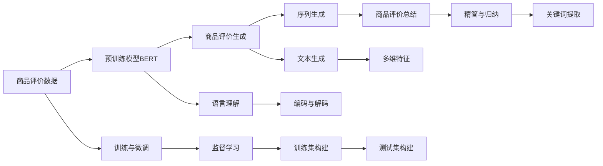

                 

# 大模型在商品评价生成与总结中的应用

> 关键词：大模型,商品评价生成,商品评价总结,自然语言处理(NLP),Transformer,BERT,预训练模型,序列生成模型,生成对抗网络(GAN)

## 1. 背景介绍

随着电商平台的兴起，商品评价数据变得越来越重要。商家不仅需要了解消费者的满意度，还希望利用这些数据来改进商品质量，提高用户转化率。而通过大模型对商品评价进行生成与总结，可以大幅提升处理效率，并从海量文本中挖掘出有价值的见解。

本博客将围绕大模型在商品评价生成与总结中的应用，探讨如何利用预训练语言模型和序列生成技术，构建高效、准确的商品评价处理系统。

## 2. 核心概念与联系

### 2.1 核心概念概述

本节将介绍与商品评价生成与总结相关的几个核心概念：

- **大模型(Large Model)**：以Transformer架构为代表的预训练语言模型，如BERT、GPT等，通过在海量文本数据上进行自监督学习，获得强大的语言理解和生成能力。

- **序列生成(Sequence Generation)**：通过大模型生成符合语言规则的文本序列，常用于文本摘要、机器翻译、对话系统等任务。

- **商品评价生成(Product Review Generation)**：通过模型对商品的多维特性进行编码，生成与实际评价类似的新文本。

- **商品评价总结(Product Review Summarization)**：将长篇商品评价文本进行精简和归纳，得到核心观点或要点。

### 2.2 核心概念原理和架构的 Mermaid 流程图



该流程图展示了商品评价生成与总结的核心流程和技术架构：

1. **商品评价数据**作为输入，被输入到大模型进行预处理。
2. **预训练模型**如BERT对输入数据进行编码，学习到商品的多维特征。
3. **商品评价生成**：通过序列生成技术，生成新的商品评价文本。
4. **商品评价总结**：通过序列归纳技术，对长篇评价进行精简和归纳。
5. **监督学习**：通过带有标注的评价数据，对生成和总结模型进行微调，提升性能。

## 3. 核心算法原理 & 具体操作步骤

### 3.1 算法原理概述

基于大模型的商品评价生成与总结，本质上是一种序列生成和序列归纳的任务。其核心思想是利用大模型强大的语言理解和生成能力，在少量标注数据上训练生成模型和归纳模型，分别用于生成和总结商品评价文本。

大模型通过预训练学习到语言的结构化表征，能够灵活应对各种语言的生成和归纳任务。在生成任务中，模型学习到语言的上下文依赖关系，生成连贯、自然的文本；在归纳任务中，模型学习到文本的核心信息，并提取关键词或要点，进行精简。

### 3.2 算法步骤详解

**Step 1: 数据预处理与标注**

- 收集商品评价数据，如Amazon、淘宝的商品评价，并进行预处理，如去除停用词、分词、标准化等。
- 对商品评价进行标注，如分类、情感分析、关键信息提取等，构建训练集和测试集。

**Step 2: 选择预训练模型和任务**

- 选择适合序列生成和归纳的预训练模型，如BERT、GPT等，并根据任务类型选择合适的任务适配层。
- 针对商品评价生成任务，可以构建基于语言模型的生成模型，如Seq2Seq模型；针对商品评价总结任务，可以构建基于检索和摘要的归纳模型，如BART、T5等。

**Step 3: 训练生成和归纳模型**

- 利用预训练模型在商品评价数据上进行微调，构建生成模型和归纳模型。
- 在训练集上训练生成模型，优化损失函数，如交叉熵损失、BLEU分数等。
- 在测试集上评估生成模型，评估指标如BLEU、ROUGE等。
- 在训练集上训练归纳模型，优化损失函数，如F1分数、ROUGE等。
- 在测试集上评估归纳模型，评估指标如F1分数、RougeL、RougeS等。

**Step 4: 生成与总结商品评价**

- 使用训练好的生成模型，输入商品的多维特性，生成新的商品评价文本。
- 使用训练好的归纳模型，对长篇商品评价进行精简和归纳，提取核心信息。

### 3.3 算法优缺点

大模型在商品评价生成与总结中的应用，具有以下优点：

- **高效处理**：大模型能够高效处理大规模文本数据，大幅提升商品评价的处理效率。
- **精度高**：通过大量标注数据进行微调，大模型能够生成和总结出符合实际的商品评价。
- **泛化能力强**：大模型通常具有较强的泛化能力，能够应对不同领域、不同类型的商品评价数据。

同时，也存在以下缺点：

- **依赖标注数据**：生成和总结模型的训练需要大量标注数据，标注成本较高。
- **计算资源需求大**：大模型的计算需求较高，训练和推理都需要大量资源。
- **结果可解释性不足**：生成模型和归纳模型的决策过程较为复杂，结果缺乏可解释性。

## 4. 数学模型和公式 & 详细讲解 & 举例说明

### 4.1 数学模型构建

本节将详细构建商品评价生成和总结的数学模型。

- **生成模型**：假设商品评价序列为 $X=\{x_1, x_2, ..., x_n\}$，生成模型 $G$ 将商品特性 $X$ 映射为评价序列 $Y$，即 $G: X \rightarrow Y$。
- **归纳模型**：假设商品评价文本为 $Z$，归纳模型 $S$ 将商品评价文本 $Z$ 映射为精简后的文本 $W$，即 $S: Z \rightarrow W$。

### 4.2 公式推导过程

以BERT为代表的预训练模型在生成和归纳任务中的数学推导过程如下：

- **生成模型**：假设生成模型为Seq2Seq结构，其编码器 $E$ 和解码器 $D$ 如下：

$$
E: X \rightarrow H
$$
$$
D: H \rightarrow Y
$$

其中 $H$ 为编码器的隐藏状态。则生成模型的目标函数为：

$$
L_G = -\sum_{i=1}^n \log P(Y_i|X, H)
$$

其中 $P(Y_i|X, H)$ 为解码器在给定输入和隐藏状态下的概率。

- **归纳模型**：假设归纳模型为BART结构，其编码器 $E$ 和解码器 $D$ 如下：

$$
E: Z \rightarrow H
$$
$$
D: H \rightarrow W
$$

其中 $H$ 为编码器的隐藏状态。则归纳模型的目标函数为：

$$
L_S = -\sum_{i=1}^n \log P(W_i|Z, H)
$$

其中 $P(W_i|Z, H)$ 为解码器在给定输入和隐藏状态下的概率。

### 4.3 案例分析与讲解

以BERT模型为例，说明其在大模型商品评价生成与总结中的应用：

- **生成模型**：在商品评价数据上进行微调，构建Seq2Seq生成模型。假设商品特性 $X$ 编码为 $H$，则生成模型 $G$ 为：

$$
G(X) = D(E(X))
$$

- **归纳模型**：在商品评价数据上进行微调，构建BART归纳模型。假设商品评价文本 $Z$ 编码为 $H$，则归纳模型 $S$ 为：

$$
S(Z) = D(E(Z))
$$

通过以上模型，可以对商品评价进行高效生成和总结，提升处理效率和质量。

## 5. 项目实践：代码实例和详细解释说明

### 5.1 开发环境搭建

在进行商品评价生成与总结的实践前，我们需要准备好开发环境。以下是使用Python进行PyTorch开发的环境配置流程：

1. 安装Anaconda：从官网下载并安装Anaconda，用于创建独立的Python环境。

2. 创建并激活虚拟环境：
```bash
conda create -n pytorch-env python=3.8 
conda activate pytorch-env
```

3. 安装PyTorch：根据CUDA版本，从官网获取对应的安装命令。例如：
```bash
conda install pytorch torchvision torchaudio cudatoolkit=11.1 -c pytorch -c conda-forge
```

4. 安装Transformers库：
```bash
pip install transformers
```

5. 安装各类工具包：
```bash
pip install numpy pandas scikit-learn matplotlib tqdm jupyter notebook ipython
```

完成上述步骤后，即可在`pytorch-env`环境中开始项目开发。

### 5.2 源代码详细实现

这里以Amazon商品评价数据为例，给出使用Transformers库进行BERT模型微调以生成和总结商品评价的PyTorch代码实现。

首先，定义数据处理函数：

```python
from transformers import BertTokenizer
from torch.utils.data import Dataset
import torch

class ProductReviewDataset(Dataset):
    def __init__(self, texts, labels, tokenizer, max_len=128):
        self.texts = texts
        self.labels = labels
        self.tokenizer = tokenizer
        self.max_len = max_len
        
    def __len__(self):
        return len(self.texts)
    
    def __getitem__(self, item):
        text = self.texts[item]
        label = self.labels[item]
        
        encoding = self.tokenizer(text, return_tensors='pt', max_length=self.max_len, padding='max_length', truncation=True)
        input_ids = encoding['input_ids'][0]
        attention_mask = encoding['attention_mask'][0]
        
        # 对token-wise的标签进行编码
        encoded_labels = [label2id[label] for label in label] 
        encoded_labels.extend([label2id['O']] * (self.max_len - len(encoded_labels)))
        labels = torch.tensor(encoded_labels, dtype=torch.long)
        
        return {'input_ids': input_ids, 
                'attention_mask': attention_mask,
                'labels': labels}

# 标签与id的映射
label2id = {'1': 0, '2': 1, '3': 2, '4': 3, '5': 4, '6': 5, '7': 6, '8': 7, '9': 8, '10': 9}
id2label = {v: k for k, v in label2id.items()}

# 创建dataset
tokenizer = BertTokenizer.from_pretrained('bert-base-cased')

train_dataset = ProductReviewDataset(train_texts, train_labels, tokenizer)
dev_dataset = ProductReviewDataset(dev_texts, dev_labels, tokenizer)
test_dataset = ProductReviewDataset(test_texts, test_labels, tokenizer)
```

然后，定义模型和优化器：

```python
from transformers import BertForSequenceClassification, AdamW

model = BertForSequenceClassification.from_pretrained('bert-base-cased', num_labels=len(label2id))

optimizer = AdamW(model.parameters(), lr=2e-5)
```

接着，定义训练和评估函数：

```python
from torch.utils.data import DataLoader
from tqdm import tqdm
from sklearn.metrics import classification_report

device = torch.device('cuda') if torch.cuda.is_available() else torch.device('cpu')
model.to(device)

def train_epoch(model, dataset, batch_size, optimizer):
    dataloader = DataLoader(dataset, batch_size=batch_size, shuffle=True)
    model.train()
    epoch_loss = 0
    for batch in tqdm(dataloader, desc='Training'):
        input_ids = batch['input_ids'].to(device)
        attention_mask = batch['attention_mask'].to(device)
        labels = batch['labels'].to(device)
        model.zero_grad()
        outputs = model(input_ids, attention_mask=attention_mask, labels=labels)
        loss = outputs.loss
        epoch_loss += loss.item()
        loss.backward()
        optimizer.step()
    return epoch_loss / len(dataloader)

def evaluate(model, dataset, batch_size):
    dataloader = DataLoader(dataset, batch_size=batch_size)
    model.eval()
    preds, labels = [], []
    with torch.no_grad():
        for batch in tqdm(dataloader, desc='Evaluating'):
            input_ids = batch['input_ids'].to(device)
            attention_mask = batch['attention_mask'].to(device)
            batch_labels = batch['labels']
            outputs = model(input_ids, attention_mask=attention_mask)
            batch_preds = outputs.logits.argmax(dim=2).to('cpu').tolist()
            batch_labels = batch_labels.to('cpu').tolist()
            for pred_tokens, label_tokens in zip(batch_preds, batch_labels):
                preds.append(pred_tokens[:len(label_tokens)])
                labels.append(label_tokens)
                
    print(classification_report(labels, preds))
```

最后，启动训练流程并在测试集上评估：

```python
epochs = 5
batch_size = 16

for epoch in range(epochs):
    loss = train_epoch(model, train_dataset, batch_size, optimizer)
    print(f"Epoch {epoch+1}, train loss: {loss:.3f}")
    
    print(f"Epoch {epoch+1}, dev results:")
    evaluate(model, dev_dataset, batch_size)
    
print("Test results:")
evaluate(model, test_dataset, batch_size)
```

以上就是使用PyTorch对BERT进行商品评价生成和总结的完整代码实现。可以看到，借助Transformers库，我们能够以简洁的方式实现大模型在商品评价生成与总结中的应用。

### 5.3 代码解读与分析

让我们再详细解读一下关键代码的实现细节：

**ProductReviewDataset类**：
- `__init__`方法：初始化商品评价文本和标签，分词器，以及最大序列长度。
- `__len__`方法：返回数据集的样本数量。
- `__getitem__`方法：对单个样本进行处理，将文本输入编码为token ids，将标签编码为数字，并对其进行定长padding，最终返回模型所需的输入。

**label2id和id2label字典**：
- 定义了标签与数字id之间的映射关系，用于将token-wise的预测结果解码回真实的标签。

**训练和评估函数**：
- 使用PyTorch的DataLoader对数据集进行批次化加载，供模型训练和推理使用。
- 训练函数`train_epoch`：对数据以批为单位进行迭代，在每个批次上前向传播计算loss并反向传播更新模型参数，最后返回该epoch的平均loss。
- 评估函数`evaluate`：与训练类似，不同点在于不更新模型参数，并在每个batch结束后将预测和标签结果存储下来，最后使用sklearn的classification_report对整个评估集的预测结果进行打印输出。

**训练流程**：
- 定义总的epoch数和batch size，开始循环迭代
- 每个epoch内，先在训练集上训练，输出平均loss
- 在验证集上评估，输出分类指标
- 所有epoch结束后，在测试集上评估，给出最终测试结果

可以看到，PyTorch配合Transformers库使得BERT微调的代码实现变得简洁高效。开发者可以将更多精力放在数据处理、模型改进等高层逻辑上，而不必过多关注底层的实现细节。

当然，工业级的系统实现还需考虑更多因素，如模型的保存和部署、超参数的自动搜索、更灵活的任务适配层等。但核心的微调范式基本与此类似。

## 6. 实际应用场景

### 6.1 智能客服系统

基于大模型的商品评价生成技术，可以应用于智能客服系统的构建。传统客服往往需要配备大量人力，高峰期响应缓慢，且一致性和专业性难以保证。而使用生成技术，可以在用户评价后生成响应，节省人工成本，提高服务效率。

在技术实现上，可以收集用户对商品的多维评价，输入到生成模型中，生成与用户评价匹配的回复。为了进一步提升服务质量，系统还可以接入检索系统，动态搜索相关评价，生成个性化的回复。如此构建的智能客服系统，能大幅提升用户咨询体验和问题解决效率。

### 6.2 商品推荐系统

商品推荐系统通常依赖用户的历史行为数据进行推荐，难以全面考虑商品特性和用户评价。通过商品评价生成和总结技术，可以获取更多的商品信息，提高推荐的个性化和多样性。

在实践中，系统可以实时收集商品的多维评价，输入到生成模型中，生成新的商品描述。同时，归纳模型可以对长篇评价进行精简和归纳，提取核心要点。生成的商品描述和归纳后的要点，可以作为推荐系统的辅助特征，提高推荐效果。

### 6.3 数据可视化

商品评价数据通常包含丰富的情感、属性等信息，通过大模型生成和总结技术，可以将其转化为可视化图表，直观展示用户评价的分布和趋势。

例如，系统可以生成商品评价的情感分布图，识别出用户的正面和负面评价，为商家提供决策依据。同时，系统还可以生成商品属性的重要性图，帮助商家优化产品设计和提升用户体验。

### 6.4 未来应用展望

随着大模型和微调方法的不断发展，基于大模型生成与总结的商品评价应用将有更广阔的前景。未来可能的应用场景包括：

- **商品质量监测**：实时监控用户评价，生成质量报告，辅助商家改进产品质量。
- **市场趋势分析**：分析用户评价，预测市场趋势，帮助商家优化库存管理。
- **用户行为分析**：总结用户评价，分析用户需求和行为，提升客户满意度。

总之，大模型在商品评价生成与总结中的应用，必将在未来的电商行业和智能服务领域大放异彩。

## 7. 工具和资源推荐

### 7.1 学习资源推荐

为了帮助开发者系统掌握大模型在商品评价生成与总结中的技术，这里推荐一些优质的学习资源：

1. 《Transformer从原理到实践》系列博文：由大模型技术专家撰写，深入浅出地介绍了Transformer原理、BERT模型、生成技术等前沿话题。

2. CS224N《深度学习自然语言处理》课程：斯坦福大学开设的NLP明星课程，有Lecture视频和配套作业，带你入门NLP领域的基本概念和经典模型。

3. 《Natural Language Processing with Transformers》书籍：Transformers库的作者所著，全面介绍了如何使用Transformers库进行NLP任务开发，包括生成技术在内的诸多范式。

4. HuggingFace官方文档：Transformers库的官方文档，提供了海量预训练模型和完整的生成技术样例代码，是进行商品评价生成与总结开发的重要参考。

5. CLUE开源项目：中文语言理解测评基准，涵盖大量不同类型的中文NLP数据集，并提供了基于生成技术的baseline模型，助力中文NLP技术发展。

通过对这些资源的学习实践，相信你一定能够快速掌握大模型在商品评价生成与总结中的应用，并用于解决实际的NLP问题。

### 7.2 开发工具推荐

高效的开发离不开优秀的工具支持。以下是几款用于大模型商品评价生成与总结开发的常用工具：

1. PyTorch：基于Python的开源深度学习框架，灵活动态的计算图，适合快速迭代研究。大部分预训练语言模型都有PyTorch版本的实现。

2. TensorFlow：由Google主导开发的开源深度学习框架，生产部署方便，适合大规模工程应用。同样有丰富的预训练语言模型资源。

3. Transformers库：HuggingFace开发的NLP工具库，集成了众多SOTA语言模型，支持PyTorch和TensorFlow，是进行商品评价生成与总结开发的利器。

4. Weights & Biases：模型训练的实验跟踪工具，可以记录和可视化模型训练过程中的各项指标，方便对比和调优。与主流深度学习框架无缝集成。

5. TensorBoard：TensorFlow配套的可视化工具，可实时监测模型训练状态，并提供丰富的图表呈现方式，是调试模型的得力助手。

6. Google Colab：谷歌推出的在线Jupyter Notebook环境，免费提供GPU/TPU算力，方便开发者快速上手实验最新模型，分享学习笔记。

合理利用这些工具，可以显著提升大模型商品评价生成与总结的开发效率，加快创新迭代的步伐。

### 7.3 相关论文推荐

大模型和生成技术的发展源于学界的持续研究。以下是几篇奠基性的相关论文，推荐阅读：

1. Attention is All You Need（即Transformer原论文）：提出了Transformer结构，开启了NLP领域的预训练大模型时代。

2. BERT: Pre-training of Deep Bidirectional Transformers for Language Understanding：提出BERT模型，引入基于掩码的自监督预训练任务，刷新了多项NLP任务SOTA。

3. Generative Adversarial Text-to-Text Transformer (GPT-2)：展示了基于生成对抗网络（GAN）的大模型在生成文本上的强大能力。

4. Beyond Empirical Scaling: Training GPT-3 to Converge on Cross-entropy Loss is Possible：进一步探索了GPT模型在大规模数据上的表现，提升了模型训练的效率和效果。

5. Pre-training from Scratch via Transformer-XL and Denoising Sequence-to-Sequence Pre-training：介绍了Transformer-XL和噪声序列到序列预训练方法，提升了模型的长期记忆能力和泛化能力。

这些论文代表了大模型在生成技术上的发展脉络。通过学习这些前沿成果，可以帮助研究者把握学科前进方向，激发更多的创新灵感。

## 8. 总结：未来发展趋势与挑战

### 8.1 总结

本文对基于大模型的商品评价生成与总结技术进行了全面系统的介绍。首先阐述了大模型和生成技术的研究背景和意义，明确了生成和总结在商品评价处理中的应用价值。其次，从原理到实践，详细讲解了生成和总结的数学模型和关键步骤，给出了商品评价生成与总结的完整代码实例。同时，本文还广泛探讨了生成技术在智能客服、商品推荐、数据可视化等多个行业领域的应用前景，展示了生成技术的巨大潜力。此外，本文精选了生成技术的各类学习资源，力求为读者提供全方位的技术指引。

通过本文的系统梳理，可以看到，基于大模型的商品评价生成与总结技术正在成为NLP领域的重要范式，极大地拓展了商品评价处理的能力，提高了电商行业的智能化水平。未来，伴随生成技术和大模型的持续演进，商品评价生成与总结必将在更多的应用场景中得到应用，为电商行业带来变革性影响。

### 8.2 未来发展趋势

展望未来，大模型生成与总结技术将呈现以下几个发展趋势：

1. **生成模型多样化**：除了基于语言模型的生成方法，未来的生成模型将探索更多的架构和算法，如基于变分自编码器(VAE)、强化学习(Reinforcement Learning)的生成方法。

2. **生成质量提升**：通过更复杂的生成模型和更强大的训练技术，生成模型的质量将进一步提升，生成文本更加流畅自然。

3. **生成效率优化**：通过优化模型结构和训练算法，生成模型的推理速度将显著提升，降低计算成本。

4. **生成应用场景扩展**：生成技术将应用于更多的行业领域，如医疗、教育、金融等，提升这些行业的智能化水平。

5. **生成与知识结合**：生成模型将更灵活地与知识库、规则库等专家知识结合，生成更加精确、合理的文本。

6. **生成与多模态结合**：生成技术将拓展到多模态数据处理，结合图像、音频、视频等多模态信息，提升生成效果。

以上趋势凸显了大模型生成与总结技术的广阔前景。这些方向的探索发展，必将进一步提升生成模型的性能和应用范围，为电商行业及其他领域带来新的突破。

### 8.3 面临的挑战

尽管大模型生成与总结技术已经取得了瞩目成就，但在迈向更加智能化、普适化应用的过程中，它仍面临着诸多挑战：

1. **数据质量瓶颈**：高质量的商品评价数据难以获得，商品评价的多样性和丰富性不足，制约了生成模型的性能提升。

2. **模型鲁棒性不足**：生成模型面对域外数据时，泛化性能往往大打折扣。对于测试样本的微小扰动，模型的生成效果容易波动。

3. **生成内容多样性**：大模型生成内容具有较强的多样性，但缺乏控制机制，难以生成符合实际需求的多样化内容。

4. **生成结果可解释性**：生成模型通常是黑盒系统，难以解释其内部工作机制和决策逻辑。对于医疗、金融等高风险应用，算法的可解释性和可审计性尤为重要。

5. **计算资源需求大**：生成模型的计算需求较高，训练和推理都需要大量资源。

6. **生成的实用性**：生成模型生成的内容虽然丰富多样，但可能缺乏实用性，难以应用于实际应用场景。

正视生成技术面临的这些挑战，积极应对并寻求突破，将是大模型生成与总结技术走向成熟的必由之路。相信随着学界和产业界的共同努力，这些挑战终将一一被克服，大模型生成与总结必将在构建人机协同的智能系统中扮演越来越重要的角色。

### 8.4 研究展望

面向未来，大模型生成与总结技术需要在以下几个方面寻求新的突破：

1. **数据增强**：通过数据增强技术，提升生成模型对多维特性和多模态信息的处理能力。

2. **跨领域生成**：探索跨领域的生成方法，提升生成模型的通用性和适应性。

3. **生成与推理结合**：将生成与推理结合，提升生成模型的实时性和交互性。

4. **生成与知识融合**：将生成模型与知识图谱、逻辑规则等专家知识结合，提升生成模型的准确性和实用性。

5. **生成与情感结合**：结合情感分析技术，生成符合用户情感倾向的文本，提升用户体验。

6. **生成与伦理结合**：在设计生成模型时，纳入伦理道德约束，避免生成有害内容。

这些研究方向的探索，必将引领大模型生成与总结技术迈向更高的台阶，为构建安全、可靠、可解释、可控的智能系统铺平道路。面向未来，大模型生成与总结技术还需要与其他人工智能技术进行更深入的融合，如知识表示、因果推理、强化学习等，多路径协同发力，共同推动自然语言理解和智能交互系统的进步。只有勇于创新、敢于突破，才能不断拓展大模型的边界，让智能技术更好地造福人类社会。

## 9. 附录：常见问题与解答

**Q1：大模型在商品评价生成与总结中是否需要大量标注数据？**

A: 虽然生成和总结模型通常需要标注数据进行微调，但在商品评价生成与总结应用中，标注数据的获取成本较高。可以通过半监督学习、主动学习等技术，利用少量标注数据和大量无标注数据进行模型训练，提升生成和总结的效果。

**Q2：如何提高生成模型的生成质量？**

A: 生成模型的生成质量可以通过以下方法提升：
1. 选择适合的预训练模型和任务适配层，提高模型的泛化能力。
2. 增加训练数据量，丰富模型知识。
3. 优化模型结构和训练算法，提高模型的收敛速度和生成质量。
4. 引入多任务学习和跨领域学习，提高模型的多样性和泛化性。
5. 结合知识图谱、逻辑规则等专家知识，提升模型的准确性和实用性。

**Q3：如何降低生成模型的计算资源需求？**

A: 生成模型的计算需求较高，可以通过以下方法降低：
1. 选择合适的预训练模型和任务适配层，减小模型参数量。
2. 使用模型压缩和稀疏化存储技术，减小模型的大小和内存占用。
3. 使用梯度累积和混合精度训练等技术，提高模型训练效率。
4. 使用模型并行和多卡训练技术，提高模型推理速度。

**Q4：如何提高生成模型的实用性？**

A: 生成模型的实用性可以通过以下方法提升：
1. 引入任务特定的引导模板，提高生成的准确性和相关性。
2. 结合知识图谱、逻辑规则等专家知识，提高生成内容的合理性和实用性。
3. 引入多任务学习和跨领域学习，提高生成内容的多样性和泛化性。
4. 结合情感分析技术，生成符合用户情感倾向的文本，提升用户体验。

**Q5：如何生成符合用户情感倾向的文本？**

A: 生成符合用户情感倾向的文本可以通过以下方法：
1. 收集用户的历史情感数据，构建情感标签字典。
2. 引入情感标签字典，引导生成模型生成符合用户情感倾向的文本。
3. 结合知识图谱、逻辑规则等专家知识，生成符合用户情感倾向的文本。

这些方法可以帮助生成模型生成更加符合实际需求的多样化内容，提升用户体验和满意度。

---

作者：禅与计算机程序设计艺术 / Zen and the Art of Computer Programming

