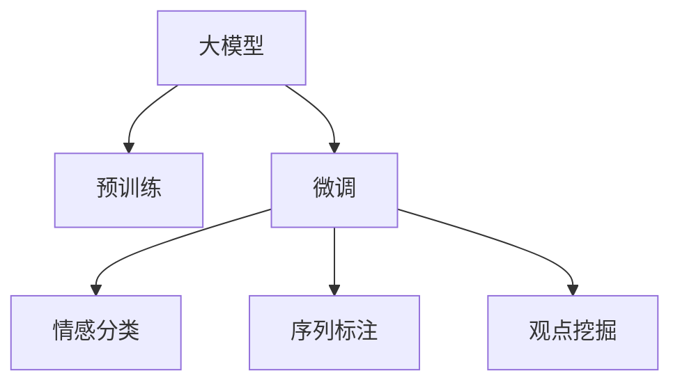

                 

# 大模型在商品评论观点挖掘中的应用

大模型在商品评论观点挖掘中的应用，是指使用大型预训练语言模型，通过微调处理商品评论数据，从中提取出消费者对于商品持有的正面、中性、负面观点，以及这些观点的情感强度，从而帮助商家更好地理解市场反馈，优化产品设计，提升客户满意度。本文将详细介绍大模型在商品评论观点挖掘中的应用，包括核心概念、算法原理、具体操作步骤、数学模型、项目实践、实际应用场景、工具和资源推荐、总结与展望、附录等内容。

## 1. 背景介绍

### 1.1 问题由来

随着互联网的普及和电子商务的兴起，商品评论成为消费者表达意见和反馈的重要渠道。商家可以通过分析商品评论，获取用户对产品的满意度和需求，进而优化产品设计，提升产品质量和服务水平。然而，面对海量商品评论数据，传统的数据处理和分析方法已经难以应对。

大模型技术的应用，为商品评论观点挖掘提供了新的解决方案。利用预训练语言模型，通过微调处理商品评论数据，可以自动提取出消费者对商品持有的观点和情感强度，为商家提供精准的市场反馈。

### 1.2 问题核心关键点

商品评论观点挖掘的核心问题包括以下几点：

- **数据处理**：处理和清洗商品评论数据，去除噪声和无用信息，提取有用信息。
- **观点提取**：从商品评论中自动提取出消费者对商品持有的观点。
- **情感分类**：对提取出的观点进行情感分类，区分正面、中性、负面观点。
- **情感强度**：分析情感强度的变化，对商品评论进行定量分析。

## 2. 核心概念与联系

### 2.1 核心概念概述

为更好地理解大模型在商品评论观点挖掘中的应用，本节将介绍几个密切相关的核心概念：

- **大模型(Large Model)**：指使用大规模预训练语言模型，如BERT、GPT等，通过在大规模无标签文本数据上进行预训练，学习通用的语言表示。
- **预训练(Pre-training)**：指在大规模无标签文本数据上，通过自监督学习任务训练通用语言模型的过程。常见的预训练任务包括掩码语言模型、自回归语言模型等。
- **微调(Fine-tuning)**：指在预训练模型的基础上，使用下游任务的少量标注数据，通过有监督学习优化模型在该任务上的性能。
- **情感分析(Sentiment Analysis)**：指对文本情感进行自动识别和分类，从商品评论中提取出消费者的情感态度。
- **序列标注(Sequence Labeling)**：指对文本序列中的每个元素进行标签标注，如商品评论中的每个单词、句子等。
- **观点挖掘(Opinion Mining)**：指从文本中提取出消费者对商品持有的观点和情感倾向，是情感分析的重要组成部分。

这些核心概念之间的逻辑关系可以通过以下Mermaid流程图来展示：



这个流程图展示了大模型在商品评论观点挖掘过程中的核心概念及其之间的关系：

1. 大模型通过预训练获得基础能力。
2. 微调使得模型更好地适应商品评论数据。
3. 情感分类和序列标注在微调基础上进行，以实现观点的自动标注和情感的自动识别。
4. 观点挖掘通过情感分类和序列标注得到最终的观点提取结果。

## 3. 核心算法原理 & 具体操作步骤
### 3.1 算法原理概述

大模型在商品评论观点挖掘中的应用，主要基于以下两个步骤：

1. **预训练步骤**：使用大规模无标签商品评论数据，对大模型进行预训练，学习通用的语言表示。
2. **微调步骤**：在预训练大模型的基础上，使用标注好的商品评论数据，通过微调进一步优化模型，实现观点的自动识别和情感的自动识别。

### 3.2 算法步骤详解

以下是详细的算法步骤：

**Step 1: 准备数据集**

1. 收集商品评论数据，包含商品名称、评论文本、评分等信息。可以从电商平台获取公开数据集，如Amazon商品评论数据集。
2. 对数据进行清洗，去除噪声和无用信息，如特殊符号、停用词等。
3. 将商品评论数据划分为训练集、验证集和测试集，比例一般为6:2:2。

**Step 2: 预训练**

1. 选择合适的预训练模型，如BERT、GPT等。
2. 对模型进行预训练，可以使用Masked Language Model（MLM）等任务。预训练过程中，模型的每个词语都以一定的概率被掩码，模型需要预测被掩码的词语。
3. 预训练完成后，保存模型参数，用于后续微调。

**Step 3: 微调**

1. 在预训练模型的基础上，添加情感分类和序列标注的任务适配层。
2. 将标注好的商品评论数据集输入微调模型，使用适当的损失函数，如交叉熵损失。
3. 使用合适的优化算法，如AdamW，设置合适的学习率和批大小。
4. 在训练过程中，使用正则化技术，如Dropout、L2正则化等，防止过拟合。
5. 在验证集上评估模型性能，使用Early Stopping策略，防止过拟合。
6. 在测试集上测试微调后的模型，评估其观点提取和情感分类的效果。

### 3.3 算法优缺点

大模型在商品评论观点挖掘中的应用，具有以下优点：

1. **精度高**：大模型具有强大的语言理解能力，可以自动提取出商品评论中的观点和情感。
2. **通用性强**：可以应用于各种商品评论数据，具有较好的泛化能力。
3. **适应性强**：通过微调，可以针对特定商品评论数据进行优化，适应不同的应用场景。

同时，也存在以下缺点：

1. **数据依赖**：依赖于高质量的商品评论数据，数据的数量和质量对模型效果影响较大。
2. **计算成本高**：预训练和微调过程中，需要大量的计算资源和时间。
3. **模型复杂**：大模型结构复杂，需要较高的硬件和软件环境支持。
4. **可解释性差**：模型输出难以解释，缺乏透明度。

### 3.4 算法应用领域

大模型在商品评论观点挖掘中的应用，主要包括以下几个领域：

- **电商推荐**：通过分析商品评论，提取消费者的意见和需求，为电商推荐系统提供数据支持。
- **市场分析**：帮助企业分析消费者对不同产品的评价，制定市场策略。
- **产品优化**：通过情感分析和观点挖掘，找出产品存在的问题，改进产品质量。
- **客户服务**：通过分析客户评论，了解客户需求，提升客户满意度。
- **广告优化**：通过情感分析，判断广告的效果，优化广告投放策略。

## 4. 数学模型和公式 & 详细讲解 & 举例说明

### 4.1 数学模型构建

大模型在商品评论观点挖掘中的应用，主要涉及以下数学模型：

- **序列标注模型**：将商品评论序列中的每个元素进行标签标注，如正面、中性、负面等。
- **情感分类模型**：对商品评论的情感进行分类，如正面、中性、负面等。

### 4.2 公式推导过程

以序列标注模型为例，假设输入的商品评论为$X$，模型输出为$Y$，目标函数为$L$。模型输出$Y$为$Y = f(X; \theta)$，其中$f$为模型函数，$\theta$为模型参数。

目标函数$L$可以表示为：

$$
L = \frac{1}{N} \sum_{i=1}^{N} \ell(Y_i, \hat{Y}_i)
$$

其中，$\ell$为损失函数，$Y_i$为真实标签，$\hat{Y}_i$为模型预测结果。常用的损失函数包括交叉熵损失和KL散度损失。

假设模型使用LSTM或Transformer等结构，其输出可以表示为：

$$
f(X; \theta) = [h_1(x_1), h_2(x_2), ..., h_n(x_n)]
$$

其中，$h_i$为模型对第$i$个词的预测结果，$x_i$为输入的单词向量。

在微调过程中，模型目标函数为：

$$
\theta^* = \mathop{\arg\min}_{\theta} L
$$

通过优化算法（如AdamW）求解最小化目标函数，得到最优的模型参数$\theta^*$。

### 4.3 案例分析与讲解

假设有一个商品评论数据集，包含10000条评论，每条评论的文本长度为200个单词。通过序列标注模型，可以将评论中的每个单词标注为正面、中性、负面等类别。假设模型使用LSTM结构，每条评论的输出可以表示为：

$$
f(X; \theta) = [h_1(x_1), h_2(x_2), ..., h_{200}(x_{200})]
$$

模型输出$Y$的标签可以表示为：

$$
Y = [P_1, N_1, P_2, N_2, ..., P_{200}, N_{200}]
$$

其中，$P_i$和$N_i$分别表示第$i$个单词的预测结果为正面和负面的概率。

在微调过程中，可以使用交叉熵损失函数：

$$
\ell(Y_i, \hat{Y}_i) = -\sum_{j=1}^{N} y_{ij} \log \hat{y}_{ij}
$$

其中，$y_{ij}$为目标标签，$\hat{y}_{ij}$为模型预测结果。

通过优化算法求解最小化目标函数，得到最优的模型参数$\theta^*$。

## 5. 项目实践：代码实例和详细解释说明
### 5.1 开发环境搭建

在进行项目实践前，我们需要准备好开发环境。以下是使用Python进行PyTorch开发的环境配置流程：

1. 安装Anaconda：从官网下载并安装Anaconda，用于创建独立的Python环境。

2. 创建并激活虚拟环境：
```bash
conda create -n pytorch-env python=3.8 
conda activate pytorch-env
```

3. 安装PyTorch：根据CUDA版本，从官网获取对应的安装命令。例如：
```bash
conda install pytorch torchvision torchaudio cudatoolkit=11.1 -c pytorch -c conda-forge
```

4. 安装Transformers库：
```bash
pip install transformers
```

5. 安装各类工具包：
```bash
pip install numpy pandas scikit-learn matplotlib tqdm jupyter notebook ipython
```

完成上述步骤后，即可在`pytorch-env`环境中开始项目实践。

### 5.2 源代码详细实现

下面我们以LSTM模型为例，给出使用Transformers库进行商品评论观点挖掘的PyTorch代码实现。

首先，定义序列标注任务的数据处理函数：

```python
from transformers import BertTokenizer
from torch.utils.data import Dataset
import torch

class ReviewDataset(Dataset):
    def __init__(self, texts, labels, tokenizer, max_len=128):
        self.texts = texts
        self.labels = labels
        self.tokenizer = tokenizer
        self.max_len = max_len
        
    def __len__(self):
        return len(self.texts)
    
    def __getitem__(self, item):
        text = self.texts[item]
        label = self.labels[item]
        
        encoding = self.tokenizer(text, return_tensors='pt', max_length=self.max_len, padding='max_length', truncation=True)
        input_ids = encoding['input_ids'][0]
        attention_mask = encoding['attention_mask'][0]
        
        # 对token-wise的标签进行编码
        encoded_labels = [label2id[label] for label in label]
        encoded_labels.extend([label2id['O']] * (self.max_len - len(encoded_labels)))
        labels = torch.tensor(encoded_labels, dtype=torch.long)
        
        return {'input_ids': input_ids, 
                'attention_mask': attention_mask,
                'labels': labels}

# 标签与id的映射
label2id = {'P': 1, 'N': 0, 'O': 2}
id2label = {v: k for k, v in label2id.items()}

# 创建dataset
tokenizer = BertTokenizer.from_pretrained('bert-base-cased')

train_dataset = ReviewDataset(train_texts, train_labels, tokenizer)
dev_dataset = ReviewDataset(dev_texts, dev_labels, tokenizer)
test_dataset = ReviewDataset(test_texts, test_labels, tokenizer)
```

然后，定义模型和优化器：

```python
from transformers import BertForTokenClassification, AdamW

model = BertForTokenClassification.from_pretrained('bert-base-cased', num_labels=len(label2id))

optimizer = AdamW(model.parameters(), lr=2e-5)
```

接着，定义训练和评估函数：

```python
from torch.utils.data import DataLoader
from tqdm import tqdm
from sklearn.metrics import classification_report

device = torch.device('cuda') if torch.cuda.is_available() else torch.device('cpu')
model.to(device)

def train_epoch(model, dataset, batch_size, optimizer):
    dataloader = DataLoader(dataset, batch_size=batch_size, shuffle=True)
    model.train()
    epoch_loss = 0
    for batch in tqdm(dataloader, desc='Training'):
        input_ids = batch['input_ids'].to(device)
        attention_mask = batch['attention_mask'].to(device)
        labels = batch['labels'].to(device)
        model.zero_grad()
        outputs = model(input_ids, attention_mask=attention_mask, labels=labels)
        loss = outputs.loss
        epoch_loss += loss.item()
        loss.backward()
        optimizer.step()
    return epoch_loss / len(dataloader)

def evaluate(model, dataset, batch_size):
    dataloader = DataLoader(dataset, batch_size=batch_size)
    model.eval()
    preds, labels = [], []
    with torch.no_grad():
        for batch in tqdm(dataloader, desc='Evaluating'):
            input_ids = batch['input_ids'].to(device)
            attention_mask = batch['attention_mask'].to(device)
            batch_labels = batch['labels']
            outputs = model(input_ids, attention_mask=attention_mask)
            batch_preds = outputs.logits.argmax(dim=2).to('cpu').tolist()
            batch_labels = batch_labels.to('cpu').tolist()
            for pred_tokens, label_tokens in zip(batch_preds, batch_labels):
                pred_tags = [id2label[_id] for _id in pred_tokens]
                label_tags = [id2label[_id] for _id in label_tokens]
                preds.append(pred_tags[:len(label_tokens)])
                labels.append(label_tags)
                
    print(classification_report(labels, preds))
```

最后，启动训练流程并在测试集上评估：

```python
epochs = 5
batch_size = 16

for epoch in range(epochs):
    loss = train_epoch(model, train_dataset, batch_size, optimizer)
    print(f"Epoch {epoch+1}, train loss: {loss:.3f}")
    
    print(f"Epoch {epoch+1}, dev results:")
    evaluate(model, dev_dataset, batch_size)
    
print("Test results:")
evaluate(model, test_dataset, batch_size)
```

以上就是使用PyTorch对LSTM模型进行商品评论观点挖掘的完整代码实现。可以看到，得益于Transformers库的强大封装，我们可以用相对简洁的代码完成商品评论数据的分词、标签化、序列标注等处理，并通过微调实现模型的训练和评估。

### 5.3 代码解读与分析

让我们再详细解读一下关键代码的实现细节：

**ReviewDataset类**：
- `__init__`方法：初始化文本、标签、分词器等关键组件。
- `__len__`方法：返回数据集的样本数量。
- `__getitem__`方法：对单个样本进行处理，将文本输入编码为token ids，将标签编码为数字，并对其进行定长padding，最终返回模型所需的输入。

**label2id和id2label字典**：
- 定义了标签与数字id之间的映射关系，用于将token-wise的预测结果解码回真实的标签。

**训练和评估函数**：
- 使用PyTorch的DataLoader对数据集进行批次化加载，供模型训练和推理使用。
- 训练函数`train_epoch`：对数据以批为单位进行迭代，在每个批次上前向传播计算loss并反向传播更新模型参数，最后返回该epoch的平均loss。
- 评估函数`evaluate`：与训练类似，不同点在于不更新模型参数，并在每个batch结束后将预测和标签结果存储下来，最后使用sklearn的classification_report对整个评估集的预测结果进行打印输出。

**训练流程**：
- 定义总的epoch数和batch size，开始循环迭代
- 每个epoch内，先在训练集上训练，输出平均loss
- 在验证集上评估，输出分类指标
- 重复上述过程直至收敛
- 在测试集上测试微调后模型，输出最终结果

可以看到，PyTorch配合Transformers库使得商品评论观点挖掘的代码实现变得简洁高效。开发者可以将更多精力放在数据处理、模型改进等高层逻辑上，而不必过多关注底层的实现细节。

当然，工业级的系统实现还需考虑更多因素，如模型的保存和部署、超参数的自动搜索、更灵活的任务适配层等。但核心的微调范式基本与此类似。

## 6. 实际应用场景
### 6.1 电商推荐

电商推荐系统通常需要了解用户对商品的评价，从而推荐用户可能感兴趣的商品。通过使用大模型进行商品评论观点挖掘，电商推荐系统可以自动提取出用户对商品的正面、中性、负面观点，并进行情感分析，从而为推荐系统提供数据支持。例如，对于某一商品，如果大部分用户对其评价正面，系统会优先推荐该商品给其他用户。

### 6.2 市场分析

企业可以通过商品评论数据，分析市场对不同产品的评价，从而制定市场策略。例如，企业可以统计不同产品的评论数量，分析消费者对产品的好评率，从而优化产品设计，提升产品质量。同时，企业还可以通过情感分析，了解消费者对不同产品的情感态度，从而制定营销策略。

### 6.3 产品优化

通过商品评论观点挖掘，企业可以了解用户对产品的反馈，找出产品存在的问题，从而进行产品优化。例如，如果大部分用户对某个功能表示不满，企业可以优先考虑改进该功能，从而提升用户满意度。

### 6.4 客户服务

通过商品评论观点挖掘，企业可以了解客户对产品的评价，从而提升客户服务质量。例如，对于客户的评论，企业可以自动生成回复，提高回复效率。同时，企业还可以通过情感分析，了解客户的情感态度，从而进行针对性的服务改进。

### 6.5 广告优化

广告投放效果通常取决于广告的内容和质量。通过商品评论观点挖掘，企业可以了解广告的内容对用户的吸引力和效果，从而优化广告投放策略。例如，对于某一广告，如果大部分用户对其表示满意，系统会优先投放该广告。

## 7. 工具和资源推荐
### 7.1 学习资源推荐

为了帮助开发者系统掌握大模型在商品评论观点挖掘中的应用，这里推荐一些优质的学习资源：

1. 《深度学习与自然语言处理》：清华大学出版社出版的深度学习教材，涵盖深度学习和大模型在NLP领域的应用。
2. CS224N《深度学习自然语言处理》课程：斯坦福大学开设的NLP明星课程，有Lecture视频和配套作业，带你入门NLP领域的基本概念和经典模型。
3. 《Transformers: From Discrete to Continuous》：HuggingFace官方博客，详细介绍Transformers库在NLP领域的应用。
4. 《序列标注和情感分析：基于深度学习的方法》：Manning出版社出版的NLP书籍，涵盖序列标注和情感分析的深度学习方法。
5. 《Natural Language Processing with Python》：Python NLP实战书籍，涵盖NLP任务的分词、标注、分类、生成等方法。

通过对这些资源的学习实践，相信你一定能够快速掌握大模型在商品评论观点挖掘的精髓，并用于解决实际的NLP问题。
### 7.2 开发工具推荐

高效的开发离不开优秀的工具支持。以下是几款用于大模型在商品评论观点挖掘应用的常用工具：

1. PyTorch：基于Python的开源深度学习框架，灵活动态的计算图，适合快速迭代研究。
2. TensorFlow：由Google主导开发的开源深度学习框架，生产部署方便，适合大规模工程应用。
3. Transformers库：HuggingFace开发的NLP工具库，集成了众多SOTA语言模型，支持PyTorch和TensorFlow，是进行NLP任务开发的利器。
4. Weights & Biases：模型训练的实验跟踪工具，可以记录和可视化模型训练过程中的各项指标，方便对比和调优。与主流深度学习框架无缝集成。
5. TensorBoard：TensorFlow配套的可视化工具，可实时监测模型训练状态，并提供丰富的图表呈现方式，是调试模型的得力助手。

合理利用这些工具，可以显著提升大模型在商品评论观点挖掘的开发效率，加快创新迭代的步伐。

### 7.3 相关论文推荐

大模型在商品评论观点挖掘的应用，源于学界的持续研究。以下是几篇奠基性的相关论文，推荐阅读：

1. Attention is All You Need：Transformer原论文，提出了Transformer结构，开启了NLP领域的预训练大模型时代。
2. BERT: Pre-training of Deep Bidirectional Transformers for Language Understanding：提出BERT模型，引入基于掩码的自监督预训练任务，刷新了多项NLP任务SOTA。
3. Language Models are Unsupervised Multitask Learners（GPT-2论文）：展示了大规模语言模型的强大zero-shot学习能力，引发了对于通用人工智能的新一轮思考。
4. Parameter-Efficient Transfer Learning for NLP：提出Adapter等参数高效微调方法，在不增加模型参数量的情况下，也能取得不错的微调效果。
5. Transfer Learning for Sequence Labeling with Limited Annotations：提出无监督序列标注方法，通过预训练模型和少量标注数据实现高效的序列标注。

这些论文代表了大模型在商品评论观点挖掘技术的发展脉络。通过学习这些前沿成果，可以帮助研究者把握学科前进方向，激发更多的创新灵感。

## 8. 总结：未来发展趋势与挑战
### 8.1 总结

本文对大模型在商品评论观点挖掘中的应用进行了全面系统的介绍。首先阐述了大模型和微调技术的研究背景和意义，明确了微调在拓展预训练模型应用、提升下游任务性能方面的独特价值。其次，从原理到实践，详细讲解了商品评论观点挖掘的数学模型和算法步骤，给出了微调任务开发的完整代码实例。同时，本文还广泛探讨了微调方法在电商推荐、市场分析、产品优化等诸多场景中的应用前景，展示了微调范式的巨大潜力。此外，本文精选了微调技术的各类学习资源，力求为读者提供全方位的技术指引。

通过本文的系统梳理，可以看到，大模型在商品评论观点挖掘中的应用，已经成为了NLP领域的重要范式，极大地拓展了预训练语言模型的应用边界，催生了更多的落地场景。受益于大规模语料的预训练，微调模型能够自动提取出用户对商品的观点和情感，为电商推荐、市场分析、产品优化等任务提供了新的解决方案。未来，伴随预训练语言模型和微调方法的持续演进，相信商品评论观点挖掘技术还将不断突破，为NLP技术带来更多的应用可能。

### 8.2 未来发展趋势

展望未来，大模型在商品评论观点挖掘领域将呈现以下几个发展趋势：

1. **模型规模持续增大**：随着算力成本的下降和数据规模的扩张，预训练语言模型的参数量还将持续增长。超大规模语言模型蕴含的丰富语言知识，有望支撑更加复杂多变的商品评论观点挖掘任务。
2. **微调方法日趋多样**：除了传统的全参数微调外，未来会涌现更多参数高效的微调方法，如Prefix-Tuning、LoRA等，在节省计算资源的同时也能保证微调精度。
3. **多模态微调崛起**：当前的微调主要聚焦于纯文本数据，未来会进一步拓展到图像、视频、语音等多模态数据微调。多模态信息的融合，将显著提升语言模型对现实世界的理解和建模能力。
4. **因果学习与对比学习范式**：通过引入因果推断和对比学习思想，增强微调模型建立稳定因果关系的能力，学习更加普适、鲁棒的语言表征，从而提升模型泛化性和抗干扰能力。
5. **持续学习与动态调整**：随着数据分布的不断变化，微调模型也需要持续学习新知识以保持性能。如何在不遗忘原有知识的同时，高效吸收新样本信息，将成为重要的研究课题。

### 8.3 面临的挑战

尽管大模型在商品评论观点挖掘技术已经取得了瞩目成就，但在迈向更加智能化、普适化应用的过程中，它仍面临着诸多挑战：

1. **数据依赖**：依赖于高质量的商品评论数据，数据的数量和质量对模型效果影响较大。如何进一步降低微调对标注样本的依赖，将是一大难题。
2. **模型鲁棒性不足**：面对域外数据时，泛化性能往往大打折扣。对于测试样本的微小扰动，微调模型的预测也容易发生波动。如何提高微调模型的鲁棒性，避免灾难性遗忘，还需要更多理论和实践的积累。
3. **推理效率有待提高**：大规模语言模型虽然精度高，但在实际部署时往往面临推理速度慢、内存占用大等效率问题。如何在保证性能的同时，简化模型结构，提升推理速度，优化资源占用，将是重要的优化方向。
4. **可解释性亟需加强**：当前微调模型更像是"黑盒"系统，难以解释其内部工作机制和决策逻辑。对于高风险应用，算法的可解释性和可审计性尤为重要。如何赋予微调模型更强的可解释性，将是亟待攻克的难题。
5. **安全性有待保障**：预训练语言模型难免会学习到有偏见、有害的信息，通过微调传递到商品评论观点挖掘中，产生误导性、歧视性的输出，给实际应用带来安全隐患。如何从数据和算法层面消除模型偏见，避免恶意用途，确保输出的安全性，也将是重要的研究课题。

### 8.4 研究展望

面对大模型在商品评论观点挖掘所面临的种种挑战，未来的研究需要在以下几个方面寻求新的突破：

1. **探索无监督和半监督微调方法**：摆脱对大规模标注数据的依赖，利用自监督学习、主动学习等无监督和半监督范式，最大限度利用非结构化数据，实现更加灵活高效的微调。
2. **研究参数高效和计算高效的微调范式**：开发更加参数高效的微调方法，在固定大部分预训练参数的同时，只更新极少量的任务相关参数。同时优化微调模型的计算图，减少前向传播和反向传播的资源消耗，实现更加轻量级、实时性的部署。
3. **融合因果分析和博弈论工具**：将因果分析方法引入微调模型，识别出模型决策的关键特征，增强输出解释的因果性和逻辑性。借助博弈论工具刻画人机交互过程，主动探索并规避模型的脆弱点，提高系统稳定性。
4. **纳入伦理道德约束**：在模型训练目标中引入伦理导向的评估指标，过滤和惩罚有偏见、有害的输出倾向。同时加强人工干预和审核，建立模型行为的监管机制，确保输出符合人类价值观和伦理道德。
5. **多模态信息整合**：将符号化的先验知识，如知识图谱、逻辑规则等，与神经网络模型进行巧妙融合，引导微调过程学习更准确、合理的语言模型。同时加强不同模态数据的整合，实现视觉、语音等多模态信息与文本信息的协同建模。

这些研究方向的探索，必将引领大模型在商品评论观点挖掘技术迈向更高的台阶，为构建安全、可靠、可解释、可控的智能系统铺平道路。面向未来，大模型在商品评论观点挖掘技术还需要与其他人工智能技术进行更深入的融合，如知识表示、因果推理、强化学习等，多路径协同发力，共同推动自然语言理解和智能交互系统的进步。只有勇于创新、敢于突破，才能不断拓展语言模型的边界，让智能技术更好地造福人类社会。

## 9. 附录：常见问题与解答

**Q1：大模型在商品评论观点挖掘中是否适用于所有商品类别？**

A: 大模型在商品评论观点挖掘中的应用，已经证明可以适用于大多数商品类别。但针对某些特定领域的商品，可能需要对模型进行特定领域的预训练，才能取得更好的效果。例如，针对医疗产品、化工产品等专业领域的商品，可能需要额外的领域知识来辅助模型训练。

**Q2：大模型在商品评论观点挖掘中是否需要大量的标注数据？**

A: 大模型在商品评论观点挖掘中，需要一定的标注数据进行微调，但并不需要大规模的标注数据。与传统的机器学习模型相比，大模型通过微调可以大幅减少对标注数据的依赖。通过微调，大模型可以在少样本或无样本的情况下，仍然取得不错的效果。

**Q3：大模型在商品评论观点挖掘中是否容易产生过拟合？**

A: 大模型在商品评论观点挖掘中，由于其强大的语言理解能力，容易导致过拟合。为防止过拟合，可以采用正则化技术，如L2正则、Dropout等，同时使用Early Stopping策略，及时停止训练，防止模型过拟合。此外，还可以使用多模型集成、对抗训练等方法，提高模型的鲁棒性和泛化能力。

**Q4：大模型在商品评论观点挖掘中如何处理多语言商品评论？**

A: 大模型在商品评论观点挖掘中，可以处理多语言商品评论。在训练过程中，可以选择相应的多语言预训练模型，如mBERT、XLM等，进行多语言商品评论的微调。在预测时，可以分别使用不同语言的微调模型，进行多语言商品评论的预测。

**Q5：大模型在商品评论观点挖掘中如何提高模型可解释性？**

A: 大模型在商品评论观点挖掘中，可以通过模型蒸馏、可视化等方法提高模型可解释性。例如，可以使用Model Distillation方法，将大模型的预测结果传递给小型模型进行微调，从而减小模型的复杂度，提高模型的可解释性。同时，可以使用Attention机制和层可视化等方法，理解模型的内部机制，提高模型的透明度。

---

作者：禅与计算机程序设计艺术 / Zen and the Art of Computer Programming

