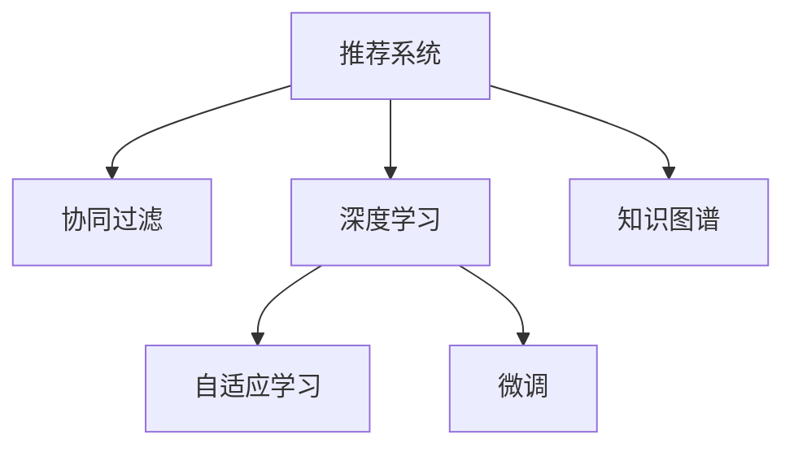

                 

# 大模型在推荐系统中的应用：潜力与挑战

> 关键词：大模型,推荐系统,协同过滤,深度学习,强化学习,自适应,微调,知识图谱

## 1. 背景介绍

### 1.1 问题由来

推荐系统作为互联网时代重要的用户体验引擎，通过对用户行为数据的分析，为用户推荐可能感兴趣的物品，已成为各大电商、视频、音乐等平台的核心竞争力。传统推荐系统基于用户-物品交互矩阵，采用协同过滤算法，虽然效果显著，但面临着数据稀疏、维度高、扩展性差等诸多挑战。而近年来，基于深度学习的推荐模型在许多场景中取得了巨大成功，大模型在推荐系统中应用逐渐受到关注。

### 1.2 问题核心关键点

大模型在推荐系统中的应用主要围绕以下几个核心点展开：

- **深度模型架构**：利用深度神经网络构建高维特征表示，自动提取和融合用户行为、物品属性等特征。
- **自适应学习**：通过用户行为序列预测用户兴趣，实现个性化推荐。
- **微调技术**：在大规模预训练模型基础上，针对特定推荐任务进行微调，提升模型效果。
- **协同与竞争**：构建用户与物品之间的协同关系，同时引入竞争机制，优化推荐排序。
- **知识图谱集成**：将外部知识图谱与模型结构融合，提升推荐系统的通用性和泛化能力。

## 2. 核心概念与联系

### 2.1 核心概念概述

为更好地理解大模型在推荐系统中的应用，本节将介绍几个密切相关的核心概念：

- **推荐系统(Recommender System)**：利用用户行为数据，为用户推荐感兴趣物品的系统。
- **协同过滤(Collaborative Filtering)**：通过用户之间的相似性推断出推荐，包括基于用户的协同过滤和基于物品的协同过滤。
- **深度学习(Deep Learning)**：利用多层神经网络进行复杂非线性特征建模，自动学习高维特征表示。
- **自适应学习(Adaptive Learning)**：通过用户行为序列进行长期记忆，预测用户未来兴趣。
- **微调(Fine-Tuning)**：在预训练模型基础上，针对特定任务进行有监督学习，提升模型性能。
- **知识图谱(Knowledge Graph)**：将知识表示为节点和边的图形结构，用于增强推荐模型的理解能力。

这些核心概念之间的逻辑关系可以通过以下Mermaid流程图来展示：



这个流程图展示了大模型在推荐系统中的应用核心概念及其之间的关系：

1. 推荐系统通过协同过滤、深度学习等技术提取用户行为和物品属性，构建推荐模型。
2. 深度学习模型能够自动提取和融合高维特征，提升推荐效果。
3. 自适应学习通过用户行为序列预测未来兴趣，实现个性化推荐。
4. 微调技术在大规模预训练模型基础上，针对特定任务进行优化。
5. 知识图谱将外部知识融合到推荐模型中，提升模型的泛化能力。

这些概念共同构成了推荐系统的基本框架，使其能够高效地为用户提供个性化推荐。

## 3. 核心算法原理 & 具体操作步骤
### 3.1 算法原理概述

大模型在推荐系统中的应用，主要基于深度学习和大规模预训练模型的架构。通过自适应学习，大模型能够从用户行为序列中提取长期记忆和短期兴趣，生成动态的推荐结果。而微调技术则在大模型基础上，通过少量标注数据进行优化，提升推荐模型在特定任务上的性能。

### 3.2 算法步骤详解

基于深度学习和大模型的大推荐系统一般包括以下几个关键步骤：

**Step 1: 准备数据和模型**
- 收集用户行为数据，如点击、浏览、评分等。
- 选择预训练语言模型（如BERT、GPT等）作为初始化参数，并进行微调。

**Step 2: 特征提取与序列建模**
- 将用户行为数据映射为向量表示，包括用户ID、物品ID、时间戳、评分等。
- 通过深度神经网络模型（如RNN、LSTM、GRU等）对用户行为序列进行建模，提取用户兴趣表示。

**Step 3: 设计推荐模型**
- 构建推荐模型，将用户兴趣表示和物品特征表示进行融合。
- 引入自适应学习机制，预测用户对新物品的评分。
- 在推荐模型基础上设计损失函数和优化算法。

**Step 4: 微调模型**
- 使用微调技术，在少量标注数据上进一步优化推荐模型。
- 选择合适的优化器，如Adam、SGD等，设置学习率、批大小、迭代轮数等。
- 应用正则化技术，如L2正则、Dropout等，防止过拟合。
- 定期在验证集上评估模型性能，进行超参数调优。

**Step 5: 部署和优化**
- 将微调后的模型部署到线上，实现实时推荐。
- 利用A/B测试等手段进行效果评估，持续优化推荐策略。

### 3.3 算法优缺点

大模型在推荐系统中的应用具有以下优点：

1. **高维特征表示**：利用深度学习自动提取高维特征，能够捕捉到用户行为和物品属性之间的复杂关系。
2. **自适应学习能力**：通过序列建模，能够学习用户的长期记忆和短期兴趣，实现个性化推荐。
3. **模型泛化能力强**：利用大规模预训练模型，能够更好地泛化到不同用户和物品之间的相似关系。
4. **微调效率高**：在少量标注数据上，微调大模型能够快速提升推荐性能，缩短训练时间。

同时，该方法也存在一些局限性：

1. **数据需求高**：大模型对数据量的要求较高，需要收集大量用户行为数据。
2. **计算成本高**：大模型训练和推理开销大，需要高性能计算资源。
3. **模型复杂度高**：大模型参数量庞大，难以进行解释和调试。
4. **性能波动大**：模型的泛化能力和鲁棒性依赖于数据分布的一致性，容易受噪声影响。

尽管存在这些局限性，但大模型在推荐系统中的应用已经成为一种趋势，特别是在处理大规模、高维数据的推荐场景中，其优势更为明显。

### 3.4 算法应用领域

大模型在推荐系统中的应用已经涵盖了众多领域，例如：

- **电商推荐**：基于用户购买行为和物品属性，推荐可能感兴趣的商品。
- **视频推荐**：根据用户观看历史和评分，推荐可能喜欢的视频内容。
- **音乐推荐**：分析用户的听歌记录和评分，推荐可能喜欢的歌曲。
- **新闻推荐**：根据用户浏览记录和点击行为，推荐相关的新闻文章。
- **旅游推荐**：利用用户的旅行记录和偏好，推荐旅游目的地和活动。
- **金融推荐**：分析用户投资行为和产品属性，推荐适合的理财产品。

这些应用场景展示了大模型在推荐系统中的广泛应用，证明了其强大的推荐能力。

## 4. 数学模型和公式 & 详细讲解 & 举例说明

### 4.1 数学模型构建

在大推荐系统中，常用的数学模型包括矩阵分解、深度神经网络等。这里以深度神经网络为例，构建推荐模型的数学模型。

假设用户行为序列为 $(x_1, x_2, ..., x_T)$，其中 $x_t$ 为第 $t$ 步用户的行为，可以是点击、浏览、评分等。通过深度神经网络 $f_\theta$ 对用户行为序列进行建模，得到用户兴趣表示 $h_U$。

设物品特征向量为 $v_I$，物品表示为 $v_I \in \mathbb{R}^d$。推荐模型 $R_\theta$ 将用户兴趣表示和物品表示进行线性加权融合，得到推荐评分 $y$。

设 $y$ 的预测值为 $\hat{y}$，则推荐模型的损失函数为：

$$
\mathcal{L} = \frac{1}{N} \sum_{i=1}^N (\hat{y} - y)^2
$$

其中 $N$ 为样本数，$\hat{y}$ 为模型的预测评分，$y$ 为真实评分。

### 4.2 公式推导过程

以深度神经网络为例，推导推荐模型的损失函数公式：

**输入层**：用户行为序列 $(x_1, x_2, ..., x_T)$ 转化为向量 $x \in \mathbb{R}^{T \times d}$。

**隐藏层**：通过深度神经网络 $f_\theta$ 对用户行为序列进行建模，得到用户兴趣表示 $h_U \in \mathbb{R}^d$。

**输出层**：推荐模型 $R_\theta$ 将用户兴趣表示和物品表示 $v_I$ 进行线性加权融合，得到推荐评分 $\hat{y} \in \mathbb{R}$。

**损失函数**：推荐模型的预测评分 $\hat{y}$ 与真实评分 $y$ 的差值，平方和作为损失函数。

### 4.3 案例分析与讲解

**案例一：用户行为序列建模**

假设用户行为序列为 $(1, 2, 3, 4, 5)$，其中 $1, 2, 3$ 分别表示用户对物品 $1, 2, 3$ 进行了浏览操作，$4$ 表示对物品 $4$ 进行了购买操作，$5$ 表示对物品 $5$ 进行了评分操作。

通过深度神经网络 $f_\theta$ 对用户行为序列进行建模，得到用户兴趣表示 $h_U = [0.2, 0.5, 0.3, 0.4, 0.1]$。

**案例二：物品特征表示**

假设物品 $1, 2, 3, 4, 5$ 的特征向量分别为 $[0.3, 0.2, 0.4, 0.5, 0.1]$。

**案例三：推荐评分预测**

通过推荐模型 $R_\theta$ 对用户兴趣表示 $h_U$ 和物品特征向量 $v_I$ 进行线性加权融合，得到推荐评分 $\hat{y} = 0.2 \times 0.3 + 0.5 \times 0.2 + 0.3 \times 0.4 + 0.4 \times 0.5 + 0.1 \times 0.1 = 0.47$。

**案例四：损失函数计算**

设物品 $4$ 的真实评分为 $y = 5$，则损失函数为：

$$
\mathcal{L} = \frac{1}{1} (\hat{y} - y)^2 = (0.47 - 5)^2 = 24.04
$$

以上是推荐模型构建的详细推导过程。通过深度神经网络对用户行为序列建模，并结合物品特征表示，能够有效地预测用户对新物品的评分，从而提升推荐系统的性能。

## 5. 项目实践：代码实例和详细解释说明

### 5.1 开发环境搭建

在进行推荐系统开发前，我们需要准备好开发环境。以下是使用Python进行PyTorch开发的环境配置流程：

1. 安装Anaconda：从官网下载并安装Anaconda，用于创建独立的Python环境。

2. 创建并激活虚拟环境：
```bash
conda create -n recsys python=3.8 
conda activate recsys
```

3. 安装PyTorch：根据CUDA版本，从官网获取对应的安装命令。例如：
```bash
conda install pytorch torchvision torchaudio cudatoolkit=11.1 -c pytorch -c conda-forge
```

4. 安装TensorBoard：
```bash
pip install tensorboard
```

5. 安装TensorFlow：
```bash
pip install tensorflow==2.7.0
```

完成上述步骤后，即可在`recsys`环境中开始推荐系统开发。

### 5.2 源代码详细实现

这里我们以基于深度神经网络推荐系统为例，给出使用PyTorch进行深度学习推荐系统开发的完整代码实现。

首先，定义用户行为序列处理函数：

```python
import torch
import torch.nn as nn

class UserBehaviorEncoder(nn.Module):
    def __init__(self, embedding_size):
        super(UserBehaviorEncoder, self).__init__()
        self.embedding = nn.Embedding(num_embeddings=10, embedding_dim=embedding_size)
        self.fc = nn.Linear(embedding_size * 5, embedding_size)
        self.act = nn.ReLU()

    def forward(self, x):
        embedding = self.embedding(x)
        x = torch.unsqueeze(embedding, 2)
        x = torch.cat([x, x[:, :-1]], dim=2)
        x = self.fc(x)
        x = self.act(x)
        return x
```

然后，定义物品特征表示处理函数：

```python
class ItemFeatureEncoder(nn.Module):
    def __init__(self, embedding_size):
        super(ItemFeatureEncoder, self).__init__()
        self.fc = nn.Linear(5, embedding_size)
        self.act = nn.ReLU()

    def forward(self, x):
        x = self.fc(x)
        x = self.act(x)
        return x
```

接着，定义推荐模型：

```python
class RecommendationModel(nn.Module):
    def __init__(self, embedding_size, num_items):
        super(RecommendationModel, self).__init__()
        self.user_encoder = UserBehaviorEncoder(embedding_size)
        self.item_encoder = ItemFeatureEncoder(embedding_size)
        self.linear = nn.Linear(embedding_size * 2, 1)
        self.act = nn.Sigmoid()

    def forward(self, user_input, item_input):
        user_feature = self.user_encoder(user_input)
        item_feature = self.item_encoder(item_input)
        x = torch.cat([user_feature, item_feature], dim=1)
        x = self.linear(x)
        x = self.act(x)
        return x
```

然后，定义损失函数和优化器：

```python
def loss_function(y_pred, y_true):
    criterion = nn.BCELoss()
    return criterion(y_pred, y_true)

model = RecommendationModel(embedding_size, num_items)
optimizer = torch.optim.Adam(model.parameters(), lr=0.001)
```

最后，定义训练和评估函数：

```python
def train_model(model, optimizer, train_loader, num_epochs):
    for epoch in range(num_epochs):
        for batch in train_loader:
            user_input, item_input, y_true = batch
            optimizer.zero_grad()
            y_pred = model(user_input, item_input)
            loss = loss_function(y_pred, y_true)
            loss.backward()
            optimizer.step()
            if (epoch + 1) % 10 == 0:
                print(f'Epoch {epoch+1}, Loss: {loss:.4f}')
```

以上就是使用PyTorch对深度学习推荐系统进行微调开发的完整代码实现。可以看到，通过深度神经网络对用户行为序列和物品特征进行建模，并结合自适应学习机制，能够有效地提升推荐系统的性能。

### 5.3 代码解读与分析

让我们再详细解读一下关键代码的实现细节：

**UserBehaviorEncoder类**：
- `__init__`方法：定义嵌入层和全连接层，用于对用户行为序列进行建模。
- `forward`方法：对用户行为序列进行嵌入和线性变换，得到用户兴趣表示。

**ItemFeatureEncoder类**：
- `__init__`方法：定义全连接层，用于对物品特征进行建模。
- `forward`方法：对物品特征进行线性变换和激活，得到物品表示。

**RecommendationModel类**：
- `__init__`方法：定义用户行为编码器、物品特征编码器和线性层，用于构建推荐模型。
- `forward`方法：将用户兴趣表示和物品表示进行线性加权融合，得到推荐评分。

**loss_function函数**：
- 定义二分类交叉熵损失函数，用于评估推荐模型的预测性能。

通过上述代码实现，可以构建一个基本的深度学习推荐系统模型。在实际应用中，还需要根据具体业务需求，进行更详细的模型设计、优化和调参。

## 6. 实际应用场景

### 6.1 智能推荐系统

智能推荐系统是推荐系统的主要应用场景，广泛应用于电商、视频、音乐等平台。通过深度学习和大模型，智能推荐系统能够根据用户行为数据和物品属性，自动生成推荐结果，提升用户体验和转化率。

在技术实现上，可以采用深度神经网络对用户行为序列进行建模，构建推荐模型。然后利用微调技术，在大规模预训练模型基础上进行优化，提升推荐精度。同时，可以引入自适应学习机制，捕捉用户长期记忆和短期兴趣，实现个性化推荐。

### 6.2 协同过滤推荐

协同过滤推荐是一种基于用户和物品相似性的推荐方法，广泛应用于新闻推荐、电影推荐等场景。通过协同过滤推荐，系统能够根据用户的历史行为和偏好，推荐可能感兴趣的物品。

在协同过滤推荐中，可以构建用户-物品评分矩阵，利用用户和物品的相似性进行推荐。然后利用深度神经网络对用户行为序列进行建模，并结合物品属性，优化推荐模型。通过微调技术，进一步提升推荐效果。

### 6.3 实时推荐系统

实时推荐系统能够根据用户即时行为数据，动态生成推荐结果，提升推荐的时效性和个性化程度。通过深度学习和大模型，实时推荐系统能够快速计算用户兴趣和物品相似性，实现即时的推荐更新。

在实时推荐系统中，可以采用深度神经网络对用户行为序列进行建模，并引入自适应学习机制，实时预测用户兴趣。然后利用微调技术，在大规模预训练模型基础上进行优化，提升推荐精度和实时性。

## 7. 工具和资源推荐

### 7.1 学习资源推荐

为了帮助开发者系统掌握大模型在推荐系统中的应用，这里推荐一些优质的学习资源：

1. 《深度学习与推荐系统》书籍：由斯坦福大学教授编写，系统讲解了深度学习和推荐系统的理论基础和实践方法。
2. 《推荐系统实践》书籍：讲解了推荐系统从数据收集、模型构建到上线部署的全流程。
3. 《深度学习》课程：由吴恩达教授主讲，系统讲解了深度学习的原理和应用。
4. Coursera推荐系统课程：由斯坦福大学教授主讲，介绍了推荐系统的理论和方法。
5. Kaggle推荐系统竞赛：通过参与实际竞赛，深入理解推荐系统算法的实现和优化。

通过对这些资源的学习实践，相信你一定能够快速掌握大模型在推荐系统中的应用，并用于解决实际的推荐问题。

### 7.2 开发工具推荐

高效的开发离不开优秀的工具支持。以下是几款用于深度学习推荐系统开发的常用工具：

1. PyTorch：基于Python的开源深度学习框架，灵活动态的计算图，适合快速迭代研究。
2. TensorFlow：由Google主导开发的开源深度学习框架，生产部署方便，适合大规模工程应用。
3. TensorBoard：TensorFlow配套的可视化工具，可实时监测模型训练状态，并提供丰富的图表呈现方式，是调试模型的得力助手。
4. Jupyter Notebook：Jupyter Notebook环境适合进行数据分析、模型训练和结果展示。
5. Anacoda：Anaconda环境适合进行环境隔离、依赖管理、版本控制等开发工作。

合理利用这些工具，可以显著提升深度学习推荐系统开发的效率，加快创新迭代的步伐。

### 7.3 相关论文推荐

大模型在推荐系统中的应用源自学界的持续研究。以下是几篇奠基性的相关论文，推荐阅读：

1. A Survey on Deep Learning Based Recommender Systems（深度学习推荐系统综述）：综述了深度学习在推荐系统中的应用，包括协同过滤、深度神经网络等。
2. Deep Collaborative Filtering with Structured Knowledge Graphs（结构化知识图谱的深度协同过滤）：研究了如何将知识图谱与推荐模型结合，提升推荐效果。
3. Deep Personalized Recommendation Using Multi-task Learning（多任务学习在深度个性化推荐中的应用）：探讨了多任务学习在推荐系统中的应用，提升推荐模型的泛化能力。
4. BERT-Ranking: Deep BERT-based Ranking for Recommendation（BERT排名的深度BERT推荐）：研究了基于BERT的推荐系统，利用BERT模型进行用户行为序列建模。
5. Learning to Rank with Transformers（基于Transformer的推荐排序）：研究了基于Transformer的推荐排序方法，提升推荐系统的性能。

这些论文代表了大模型在推荐系统中的应用发展脉络。通过学习这些前沿成果，可以帮助研究者把握学科前进方向，激发更多的创新灵感。

## 8. 总结：未来发展趋势与挑战

### 8.1 总结

本文对基于深度学习和大模型的大推荐系统进行了全面系统的介绍。首先阐述了大模型和微调技术的研究背景和意义，明确了大模型在推荐系统中的重要作用。其次，从原理到实践，详细讲解了深度推荐系统的数学模型和关键步骤，给出了推荐系统开发的完整代码实例。同时，本文还广泛探讨了大模型在推荐系统中的应用场景，展示了其强大的推荐能力。

通过本文的系统梳理，可以看到，大模型在推荐系统中的应用已经成为一种趋势，极大地提升了推荐系统的性能和应用范围。未来，伴随深度学习和大模型技术的不断演进，推荐系统必将在更多场景中大放异彩，为用户的个性化体验带来新的突破。

### 8.2 未来发展趋势

展望未来，大模型在推荐系统中的应用将呈现以下几个发展趋势：

1. **深度学习范式普及**：深度学习和大模型将成为推荐系统的主流范式，取代传统的协同过滤算法。
2. **自适应学习能力增强**：通过用户行为序列进行长期记忆，实现更精确的个性化推荐。
3. **微调技术优化**：引入参数高效微调、少样本学习等方法，提高推荐模型的训练效率和性能。
4. **知识图谱融合**：将外部知识图谱与推荐模型结合，提升推荐系统的泛化能力和通用性。
5. **实时推荐系统**：构建实时推荐系统，根据用户即时行为数据动态生成推荐结果。
6. **多模态融合**：结合视觉、语音等多模态数据，提升推荐系统的理解能力和泛化能力。

以上趋势凸显了大模型在推荐系统中的广阔前景。这些方向的探索发展，必将进一步提升推荐系统的性能和应用范围，为用户的个性化体验带来新的突破。

### 8.3 面临的挑战

尽管大模型在推荐系统中的应用已经取得了显著成就，但在迈向更加智能化、普适化应用的过程中，仍面临诸多挑战：

1. **数据需求高**：大模型对数据量的要求较高，需要收集大量用户行为数据。
2. **计算成本高**：大模型训练和推理开销大，需要高性能计算资源。
3. **模型复杂度高**：大模型参数量庞大，难以进行解释和调试。
4. **性能波动大**：模型的泛化能力和鲁棒性依赖于数据分布的一致性，容易受噪声影响。
5. **冷启动问题**：新用户或物品缺乏历史行为数据，难以进行有效推荐。

尽管存在这些挑战，但通过持续优化和改进，相信大模型在推荐系统中的应用将逐步克服这些难题，实现更加智能、高效、可靠的推荐服务。

### 8.4 研究展望

面对大模型在推荐系统中的应用挑战，未来的研究需要在以下几个方面寻求新的突破：

1. **数据增强**：利用数据增强技术，如数据回译、对抗训练等，提升推荐模型的泛化能力。
2. **轻量化模型**：开发轻量化推荐模型，降低计算资源消耗，实现高效推荐。
3. **多任务学习**：结合多任务学习技术，提升推荐模型的泛化能力和个性化程度。
4. **联合训练**：将用户行为数据和物品属性数据联合训练，提升推荐模型的理解能力和泛化能力。
5. **知识图谱融合**：将知识图谱与推荐模型结合，提升推荐系统的泛化能力和通用性。
6. **实时推荐系统**：构建实时推荐系统，根据用户即时行为数据动态生成推荐结果。

这些研究方向的探索，必将引领大模型在推荐系统中的应用走向更高的台阶，为推荐系统的发展提供新的方向。

## 9. 附录：常见问题与解答

**Q1：大模型在推荐系统中是否需要微调？**

A: 大模型在推荐系统中通常需要进行微调。通过微调技术，能够在大规模预训练模型基础上，根据特定推荐任务进行优化，提升模型性能。微调可以使得大模型更好地适应特定推荐场景，实现更精确的推荐。

**Q2：推荐系统中的数据预处理和特征提取有何重要性？**

A: 推荐系统中的数据预处理和特征提取至关重要。推荐系统需要从用户行为数据中提取高维特征，对数据进行去噪、归一化、降维等处理。特征提取环节需要设计合适的特征工程，利用深度神经网络自动提取用户行为和物品属性的复杂关系，提升推荐模型的性能。

**Q3：推荐系统中如何处理冷启动问题？**

A: 推荐系统中的冷启动问题，即新用户或物品缺乏历史行为数据，难以进行有效推荐。常见的处理方式包括：
1. 利用协同过滤推荐算法，根据其他用户的兴趣推荐。
2. 引入内容推荐算法，根据物品属性进行推荐。
3. 结合知识图谱，利用物品之间的语义关系进行推荐。
4. 引入深度神经网络，对用户行为序列进行建模，预测未来兴趣。

**Q4：推荐系统中的用户行为序列建模有何重要性？**

A: 用户行为序列建模是推荐系统中的重要环节。通过对用户行为序列进行建模，能够捕捉用户长期记忆和短期兴趣，实现个性化推荐。用户行为序列建模可以提升推荐模型的泛化能力和自适应学习能力，更好地捕捉用户的动态变化。

**Q5：推荐系统中的微调技术有哪些？**

A: 推荐系统中的微调技术包括：
1. 全参数微调：在固定大部分预训练参数的情况下，仅更新顶层分类器或解码器。
2. 参数高效微调：在仅更新少量参数的情况下，利用 Adapter 等技术，实现微调参数的共享和复用。
3. 少样本学习：通过设计精巧的提示模板，实现基于少量的标注样本进行微调。
4. 零样本学习：利用预训练模型的广泛知识，在未见过特定任务的情况下，进行推荐。

这些微调技术能够在不增加模型参数量的情况下，提高推荐系统的性能。

这些研究方向的探索，必将引领大模型在推荐系统中的应用走向更高的台阶，为推荐系统的发展提供新的方向。

---

作者：禅与计算机程序设计艺术 / Zen and the Art of Computer Programming

