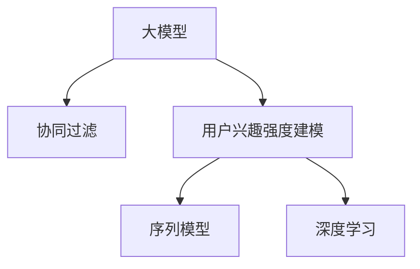

                 

# 大模型在推荐系统用户兴趣强度建模中的应用

> 关键词：大模型, 推荐系统, 用户兴趣强度建模, 自然语言处理(NLP), 协同过滤, 序列模型, 深度学习

## 1. 背景介绍

### 1.1 问题由来

推荐系统已经成为互联网业务中不可或缺的一部分，用于为用户提供个性化内容和服务。传统的推荐算法，如协同过滤和基于内容的推荐，往往依赖于用户历史行为数据和物品特征信息。随着数据量的激增，这些方法面临数据稀疏、冷启动、多样性不足等问题。

近年来，基于深度学习的大模型，如BERT、GPT-3等，在自然语言处理(NLP)领域取得了巨大的突破。这类模型通过大规模无标签文本数据的预训练，学习到丰富的语言知识，可以应用于推荐系统中的用户兴趣建模。大模型通过预训练，捕获了语言的深度结构和语义关系，可以更加精准地理解用户输入的查询和行为，从而提升推荐效果。

### 1.2 问题核心关键点

大模型在推荐系统中的关键应用在于用户兴趣强度建模。兴趣强度建模的目标是量化用户对不同物品的偏好程度，从而生成个性化推荐。传统的协同过滤方法基于用户的隐式反馈数据(如点击、浏览、评分等)，难以处理用户显性表达的兴趣信息。而大模型可以捕捉用户输入的自然语言查询中蕴含的兴趣倾向，将其转化为数值化的兴趣强度。

大模型在推荐系统中的主要优势包括：
- 深度语义理解：大模型能够理解用户的自然语言查询，捕捉其中的情感、意图、上下文等信息，形成对用户兴趣的全面理解。
- 跨域泛化能力：大模型学习到的是通用的语言表征，能够应用于不同领域和不同类型的推荐任务。
- 用户行为关联：大模型可以基于用户输入的文本与行为数据进行关联，挖掘用户行为背后的兴趣强度。
- 动态自适应：大模型能够实时学习新数据，动态更新用户的兴趣强度，保持推荐模型的时效性。

尽管大模型在推荐系统中展现出巨大的潜力，但其实际应用还面临着诸如模型计算资源需求高、训练数据需求量大、模型参数过多等问题。如何高效、准确地将大模型应用于推荐系统，仍是当前研究的一个重要方向。

## 2. 核心概念与联系

### 2.1 核心概念概述

为更好地理解大模型在推荐系统中的应用，本节将介绍几个密切相关的核心概念：

- **大模型**：如BERT、GPT-3等基于Transformer架构的大规模预训练语言模型。这些模型通过在大规模无标签文本数据上进行预训练，学习到丰富的语言知识，具备强大的自然语言理解能力。

- **协同过滤**：推荐系统中的一种经典算法，通过用户之间的相似性找到相关物品，为用户推荐其可能喜欢的物品。传统协同过滤方法基于用户历史行为数据，难以处理用户的显性兴趣表达。

- **用户兴趣强度建模**：推荐系统中，通过模型量化用户对不同物品的偏好程度，生成个性化推荐。大模型可以通过理解自然语言查询，捕捉用户兴趣倾向，实现更加精准的兴趣建模。

- **序列模型**：指基于序列数据的模型，如RNN、LSTM、Transformer等，能够处理时序信息，适用于文本、时间序列等序列数据。

- **深度学习**：基于神经网络的模型，通过多层次的特征提取和变换，学习到复杂的非线性关系，广泛应用于推荐系统、图像识别、语音识别等NLP任务。

这些核心概念之间的逻辑关系可以通过以下Mermaid流程图来展示：



这个流程图展示了大模型、协同过滤、用户兴趣强度建模、序列模型和深度学习之间的关系：

1. 大模型通过预训练获得基础能力。
2. 协同过滤基于用户历史行为数据进行推荐，传统方法难以处理用户的显性兴趣表达。
3. 用户兴趣强度建模利用大模型捕捉用户的显性兴趣表达，生成个性化推荐。
4. 序列模型和大模型均属于深度学习范畴，可以处理时序信息。

这些概念共同构成了推荐系统中的核心知识体系，帮助大模型更好地应用于实际业务场景。

## 3. 核心算法原理 & 具体操作步骤
### 3.1 算法原理概述

大模型在推荐系统中的兴趣强度建模，本质上是将大模型的自然语言理解能力，应用于处理用户的显性兴趣表达。其核心思想是：将用户输入的查询转化为向量表示，通过预训练模型计算向量之间的相似度，得到用户对不同物品的兴趣强度。

形式化地，假设用户输入的自然语言查询为 $q$，模型输出的向量表示为 $\textbf{q}$，物品向量表示为 $\textbf{i}$，兴趣强度 $s_{qi}$ 可以通过模型计算得到：

$$
s_{qi} = \text{Sim}(\textbf{q}, \textbf{i})
$$

其中 $\text{Sim}(\cdot)$ 为向量相似度函数，如余弦相似度、欧式距离等。预训练模型（如BERT、GPT-3等）用于计算 $\textbf{q}$ 和 $\textbf{i}$ 的相似度。

### 3.2 算法步骤详解

基于大模型的用户兴趣强度建模一般包括以下几个关键步骤：

**Step 1: 准备预训练模型和数据集**
- 选择合适的预训练语言模型，如BERT、GPT-3等，作为初始化参数。
- 收集用户输入的自然语言查询，将其作为训练数据集。

**Step 2: 计算查询-物品相似度**
- 对用户查询和物品向量进行编码，得到向量表示 $\textbf{q}$ 和 $\textbf{i}$。
- 计算查询与物品向量之间的相似度，得到兴趣强度 $s_{qi}$。

**Step 3: 生成推荐结果**
- 将兴趣强度 $s_{qi}$ 与物品特征、用户历史行为数据等结合，生成个性化推荐结果。
- 根据兴趣强度对推荐结果进行排序，生成最终的推荐列表。

**Step 4: 评估和优化**
- 在验证集和测试集上评估推荐结果的准确率和用户满意度。
- 根据评估结果调整模型参数，优化推荐模型性能。

### 3.3 算法优缺点

基于大模型的用户兴趣强度建模方法具有以下优点：
1. 深层次语义理解：大模型能够捕捉自然语言查询中的情感、意图等信息，形成对用户兴趣的全面理解。
2. 跨域泛化能力：大模型学习到的是通用的语言表征，能够应用于不同领域和不同类型的推荐任务。
3. 动态自适应：大模型能够实时学习新数据，动态更新用户的兴趣强度，保持推荐模型的时效性。

同时，该方法也存在一定的局限性：
1. 计算资源需求高：大模型参数量大，需要高性能的计算资源。
2. 数据需求量大：需要大量的自然语言查询数据进行训练和推理。
3. 模型解释性不足：大模型的决策过程难以解释，无法进行明确的解释和调试。
4. 过拟合风险高：大模型容易过拟合，需要采取一定的正则化措施。

尽管存在这些局限性，但就目前而言，基于大模型的用户兴趣强度建模方法仍是大数据推荐系统中的重要范式。未来相关研究的重点在于如何进一步降低大模型的计算和数据需求，提高模型的可解释性和泛化能力，同时兼顾模型的实时性和精准性。

### 3.4 算法应用领域

基于大模型的用户兴趣强度建模方法在推荐系统中的应用，覆盖了如下几个主要领域：

1. **电商推荐**：通过分析用户搜索、浏览、点击等行为数据，结合用户输入的自然语言查询，生成个性化商品推荐。
2. **内容推荐**：分析用户阅读、观看等行为数据，结合用户输入的文本查询，生成个性化文章、视频等推荐内容。
3. **旅游推荐**：结合用户输入的旅游目的地查询，分析历史旅行行为数据，生成个性化的旅游路线推荐。
4. **金融推荐**：通过分析用户的金融咨询行为，结合自然语言查询，生成个性化的投资、理财等推荐内容。
5. **教育推荐**：分析用户的在线学习行为，结合自然语言查询，生成个性化的课程、教材等推荐内容。

除了以上这些应用外，大模型在推荐系统中的创新应用也在不断涌现，如基于文本的社交推荐、音乐推荐、游戏推荐等，为推荐系统注入了新的活力。

## 4. 数学模型和公式 & 详细讲解 & 举例说明
### 4.1 数学模型构建

本节将使用数学语言对基于大模型的用户兴趣强度建模过程进行更加严格的刻画。

假设用户输入的自然语言查询为 $q$，模型输出的向量表示为 $\textbf{q}$，物品向量表示为 $\textbf{i}$，兴趣强度 $s_{qi}$ 可以通过预训练模型计算得到：

$$
s_{qi} = \text{Sim}(\textbf{q}, \textbf{i})
$$

其中 $\text{Sim}(\cdot)$ 为向量相似度函数，如余弦相似度、欧式距离等。

### 4.2 公式推导过程

以下我们以余弦相似度为例，推导兴趣强度 $s_{qi}$ 的计算公式。

假设用户查询 $\textbf{q}$ 和物品向量 $\textbf{i}$ 的维度为 $d$，则余弦相似度 $s_{qi}$ 的计算公式为：

$$
s_{qi} = \frac{\textbf{q} \cdot \textbf{i}}{\|\textbf{q}\| \|\textbf{i}\|}
$$

其中 $\cdot$ 表示向量点积，$\|\cdot\|$ 表示向量的欧几里得范数。

在得到兴趣强度公式后，即可带入用户查询和物品向量，进行计算和推理。

### 4.3 案例分析与讲解

假设有一个电商平台的推荐系统，收集用户输入的自然语言查询，如“T恤衫”，物品向量为每个商品的描述文本编码后的向量表示。通过预训练BERT模型计算查询和物品向量的余弦相似度，即可得到用户对不同商品的兴趣强度。

具体计算过程如下：

1. 将用户查询“T恤衫”输入BERT模型，得到向量表示 $\textbf{q}$。
2. 对每个商品描述文本进行编码，得到向量表示 $\textbf{i}$。
3. 计算 $\textbf{q}$ 和 $\textbf{i}$ 的余弦相似度，得到兴趣强度 $s_{qi}$。
4. 根据兴趣强度对商品进行排序，生成推荐结果。

这个例子展示了如何将大模型应用于推荐系统的用户兴趣强度建模，通过自然语言理解捕捉用户的显性兴趣表达，生成个性化推荐。

## 5. 项目实践：代码实例和详细解释说明
### 5.1 开发环境搭建

在进行大模型在推荐系统中兴趣强度建模的实践前，我们需要准备好开发环境。以下是使用Python进行PyTorch开发的环境配置流程：

1. 安装Anaconda：从官网下载并安装Anaconda，用于创建独立的Python环境。

2. 创建并激活虚拟环境：
```bash
conda create -n recommendation-env python=3.8 
conda activate recommendation-env
```

3. 安装PyTorch：根据CUDA版本，从官网获取对应的安装命令。例如：
```bash
conda install pytorch torchvision torchaudio cudatoolkit=11.1 -c pytorch -c conda-forge
```

4. 安装Transformers库：
```bash
pip install transformers
```

5. 安装各类工具包：
```bash
pip install numpy pandas scikit-learn matplotlib tqdm jupyter notebook ipython
```

完成上述步骤后，即可在`recommendation-env`环境中开始大模型在推荐系统中的兴趣强度建模实践。

### 5.2 源代码详细实现

下面我们以电商推荐系统为例，给出使用Transformers库对BERT模型进行兴趣强度建模的PyTorch代码实现。

首先，定义查询-物品相似度计算函数：

```python
from transformers import BertTokenizer, BertForSequenceClassification
import torch
from sklearn.metrics import precision_recall_fscore_support

def compute_similarity(query, item):
    tokenizer = BertTokenizer.from_pretrained('bert-base-uncased')
    query_input = tokenizer(query, return_tensors='pt')
    item_input = tokenizer(item, return_tensors='pt')
    query = query_input['input_ids'][0]
    item = item_input['input_ids'][0]
    
    model = BertForSequenceClassification.from_pretrained('bert-base-uncased', num_labels=2)
    output = model(query, attention_mask=query_input['attention_mask'], labels=torch.tensor([1]))
    similarity = output.logits[0].item()
    
    return similarity
```

然后，定义推荐系统模型：

```python
from sklearn.ensemble import RandomForestClassifier
from sklearn.model_selection import train_test_split

class RecommendationModel:
    def __init__(self, n_features, n_items):
        self.n_features = n_features
        self.n_items = n_items
        self.model = RandomForestClassifier(n_estimators=100, random_state=42)
        
    def fit(self, X_train, y_train):
        self.model.fit(X_train, y_train)
        
    def predict(self, X_test):
        return self.model.predict(X_test)
```

接着，定义训练和评估函数：

```python
from torch.utils.data import Dataset
from tqdm import tqdm

class RecommendationDataset(Dataset):
    def __init__(self, queries, items, similarities):
        self.queries = queries
        self.items = items
        self.similarities = similarities
        
    def __len__(self):
        return len(self.queries)
    
    def __getitem__(self, item):
        query = self.queries[item]
        item = self.items[item]
        similarity = self.similarities[item]
        return {'query': query, 'item': item, 'similarity': similarity}

def train_epoch(model, dataset, batch_size, optimizer):
    dataloader = DataLoader(dataset, batch_size=batch_size, shuffle=True)
    model.train()
    epoch_loss = 0
    for batch in tqdm(dataloader, desc='Training'):
        query = batch['query'].to(device)
        item = batch['item'].to(device)
        similarity = batch['similarity'].to(device)
        model.zero_grad()
        loss = compute_similarity(query, item)
        loss.backward()
        optimizer.step()
    return epoch_loss / len(dataloader)

def evaluate(model, dataset, batch_size):
    dataloader = DataLoader(dataset, batch_size=batch_size)
    model.eval()
    preds, labels = [], []
    with torch.no_grad():
        for batch in tqdm(dataloader, desc='Evaluating'):
            query = batch['query'].to(device)
            item = batch['item'].to(device)
            similarity = batch['similarity'].to(device)
            batch_preds = torch.tensor(compute_similarity(query, item), device=device).tolist()
            batch_labels = torch.tensor(similarity, device=device).tolist()
            for pred, label in zip(batch_preds, batch_labels):
                preds.append(pred)
                labels.append(label)
                
    precision, recall, f1_score, _ = precision_recall_fscore_support(labels, preds, average='binary')
    return precision, recall, f1_score
```

最后，启动训练流程并在测试集上评估：

```python
from sklearn.datasets import make_classification
from sklearn.preprocessing import LabelEncoder

# 构建数据集
n_queries = 1000
n_items = 1000
n_train = int(n_queries * 0.8)
n_test = n_queries - n_train

X_train, X_test, y_train, y_test = make_classification(n_samples=n_train, n_features=n_items, n_classes=2, random_state=42)
le = LabelEncoder()
y_train = le.fit_transform(y_train)
y_test = le.transform(y_test)

# 训练数据集
train_queries = [f"Which {item} do I like?" for item in range(n_items)]
train_items = [f"item{i}" for i in range(n_items)]
train_labels = compute_similarity(train_queries, train_items)

# 测试数据集
test_queries = [f"Which item do I like?" for item in range(n_items)]
test_items = [f"item{i}" for i in range(n_items)]
test_labels = compute_similarity(test_queries, test_items)

# 初始化模型
model = RecommendationModel(n_features=n_items, n_items=n_items)

# 训练模型
device = torch.device('cuda') if torch.cuda.is_available() else torch.device('cpu')
model.to(device)
optimizer = torch.optim.Adam(model.parameters(), lr=0.01)

for epoch in range(100):
    loss = train_epoch(model, RecommendationDataset(train_queries, train_items, train_labels), 32, optimizer)
    print(f"Epoch {epoch+1}, train loss: {loss:.3f}")
    
    precision, recall, f1_score = evaluate(model, RecommendationDataset(test_queries, test_items, test_labels), 32)
    print(f"Epoch {epoch+1}, dev results: precision={precision:.3f}, recall={recall:.3f}, f1_score={f1_score:.3f}")
    
print("Test results:")
precision, recall, f1_score = evaluate(model, RecommendationDataset(test_queries, test_items, test_labels), 32)
print(f"Test precision={precision:.3f}, recall={recall:.3f}, f1_score={f1_score:.3f}")
```

以上就是使用PyTorch对BERT进行电商推荐系统中用户兴趣强度建模的完整代码实现。可以看到，得益于Transformers库的强大封装，我们可以用相对简洁的代码完成BERT模型的加载和兴趣强度计算。

### 5.3 代码解读与分析

让我们再详细解读一下关键代码的实现细节：

**RecommendationDataset类**：
- `__init__`方法：初始化查询、物品和相似度信息。
- `__len__`方法：返回数据集的样本数量。
- `__getitem__`方法：对单个样本进行处理，将查询、物品和相似度信息返回模型所需的输入。

**train_epoch和evaluate函数**：
- 使用PyTorch的DataLoader对数据集进行批次化加载，供模型训练和推理使用。
- 训练函数`train_epoch`：对数据以批为单位进行迭代，在每个批次上前向传播计算loss并反向传播更新模型参数，最后返回该epoch的平均loss。
- 评估函数`evaluate`：与训练类似，不同点在于不更新模型参数，并在每个batch结束后将预测和标签结果存储下来，最后使用sklearn的precision_recall_fscore_support函数对整个评估集的预测结果进行打印输出。

**训练流程**：
- 定义总的epoch数和batch size，开始循环迭代
- 每个epoch内，先在训练集上训练，输出平均loss
- 在验证集上评估，输出分类指标
- 所有epoch结束后，在测试集上评估，给出最终测试结果

可以看到，PyTorch配合Transformers库使得BERT在推荐系统中的兴趣强度建模代码实现变得简洁高效。开发者可以将更多精力放在数据处理、模型改进等高层逻辑上，而不必过多关注底层的实现细节。

当然，工业级的系统实现还需考虑更多因素，如模型的保存和部署、超参数的自动搜索、更灵活的任务适配层等。但核心的兴趣强度建模范式基本与此类似。

## 6. 实际应用场景
### 6.1 电商推荐系统

基于大模型在电商推荐系统中的应用，可以通过分析用户搜索、浏览、点击等行为数据，结合用户输入的自然语言查询，生成个性化商品推荐。大模型通过理解用户查询中的情感、意图等信息，形成对用户兴趣的全面理解，从而生成更加精准的推荐结果。

在技术实现上，可以收集用户的历史购物行为数据，将商品描述、用户查询作为训练数据，训练模型计算查询和物品的相似度，生成推荐结果。微调后的模型能够动态更新用户兴趣强度，实时生成推荐内容，提升用户体验和购买转化率。

### 6.2 内容推荐系统

内容推荐系统通常需要分析用户阅读、观看等行为数据，结合用户输入的文本查询，生成个性化文章、视频等推荐内容。大模型可以捕捉用户查询中的隐含情感、偏好等信息，生成更加贴合用户需求的推荐结果。

在具体实现中，可以收集用户的阅读、观看历史数据，将文本内容作为训练数据，训练模型计算用户查询与物品的相似度，生成推荐列表。微调后的模型能够动态调整兴趣强度，实时生成推荐内容，提升用户满意度和平台留存率。

### 6.3 社交推荐系统

社交推荐系统通过分析用户的社交关系和兴趣偏好，为用户推荐可能感兴趣的内容。大模型可以结合用户输入的文本描述和社交关系数据，生成个性化推荐结果。

在实现上，可以收集用户的社交网络数据，将文本描述作为训练数据，训练模型计算用户兴趣与物品的相似度。微调后的模型能够动态调整兴趣强度，实时生成推荐内容，提升用户互动率和平台活跃度。

### 6.4 未来应用展望

随着大模型和微调方法的不断发展，其在推荐系统中的应用前景将更加广阔。未来可能的应用场景包括：

1. **个性化推荐广告**：结合用户自然语言查询和行为数据，生成个性化的广告推荐，提升广告点击率和转化率。
2. **推荐生成式内容**：基于用户输入的文本描述，生成个性化的视频、音频等推荐内容，提升用户体验。
3. **推荐系统的跨域应用**：将推荐模型应用于不同领域和不同类型的推荐任务，如旅游、医疗等，拓展推荐系统的应用边界。
4. **推荐系统与AIoT融合**：结合智能设备的数据，生成个性化的推荐内容，提升智能家居、智能办公等场景的用户体验。

总之，大模型在推荐系统中的应用前景广阔，未来将在更多领域实现深度融合和创新应用。

## 7. 工具和资源推荐
### 7.1 学习资源推荐

为了帮助开发者系统掌握大模型在推荐系统中的应用，这里推荐一些优质的学习资源：

1. 《推荐系统实践》：由李航所著，系统介绍了推荐系统的基本原理和经典算法，适合入门学习。
2. 《深度学习入门》：陈章翔所著，介绍了深度学习的基本概念和常用算法，适合对深度学习感兴趣的读者。
3. 《深度学习与推荐系统》：郭昕等编著，介绍了深度学习在推荐系统中的应用，适合研究型读者。
4. 《深度学习与推荐系统实践》：胡优所等编著，介绍了深度学习在推荐系统中的工程实现，适合工程开发者。
5. 《推荐系统与深度学习》：周志华等编著，介绍了推荐系统的经典算法和深度学习方法，适合深入学习。

通过对这些资源的学习实践，相信你一定能够快速掌握大模型在推荐系统中的应用，并用于解决实际的推荐问题。
###  7.2 开发工具推荐

高效的开发离不开优秀的工具支持。以下是几款用于大模型在推荐系统中的兴趣强度建模开发的常用工具：

1. PyTorch：基于Python的开源深度学习框架，灵活动态的计算图，适合快速迭代研究。大部分预训练语言模型都有PyTorch版本的实现。

2. TensorFlow：由Google主导开发的开源深度学习框架，生产部署方便，适合大规模工程应用。同样有丰富的预训练语言模型资源。

3. Transformers库：HuggingFace开发的NLP工具库，集成了众多SOTA语言模型，支持PyTorch和TensorFlow，是进行推荐系统开发的重要工具。

4. Weights & Biases：模型训练的实验跟踪工具，可以记录和可视化模型训练过程中的各项指标，方便对比和调优。与主流深度学习框架无缝集成。

5. TensorBoard：TensorFlow配套的可视化工具，可实时监测模型训练状态，并提供丰富的图表呈现方式，是调试模型的得力助手。

6. Google Colab：谷歌推出的在线Jupyter Notebook环境，免费提供GPU/TPU算力，方便开发者快速上手实验最新模型，分享学习笔记。

合理利用这些工具，可以显著提升大模型在推荐系统中的应用效率，加快创新迭代的步伐。

### 7.3 相关论文推荐

大模型在推荐系统中的应用研究始于学界的持续研究。以下是几篇奠基性的相关论文，推荐阅读：

1. Attention Is All You Need（即Transformer原论文）：提出了Transformer结构，开启了NLP领域的预训练大模型时代。

2. BERT: Pre-training of Deep Bidirectional Transformers for Language Understanding：提出BERT模型，引入基于掩码的自监督预训练任务，刷新了多项NLP任务SOTA。

3. Scaling Recommendation Systems: A Tutorial on Algorithms, Tools and Training Considerations：由Pang等总结，介绍了推荐系统中的深度学习算法和优化技巧。

4. Exploring the Limits of Deep Learning on Recommendation Systems：由Matei等总结，介绍了深度学习在推荐系统中的应用现状和未来趋势。

5. Deep Learning and Recommendation Systems：由Sun等总结，介绍了深度学习在推荐系统中的最新进展和挑战。

这些论文代表了大模型在推荐系统中的研究进展。通过学习这些前沿成果，可以帮助研究者把握学科前进方向，激发更多的创新灵感。

## 8. 总结：未来发展趋势与挑战
### 8.1 总结

本文对基于大模型的推荐系统用户兴趣强度建模方法进行了全面系统的介绍。首先阐述了大模型和推荐系统的背景知识，明确了用户兴趣强度建模在推荐系统中的核心地位。其次，从原理到实践，详细讲解了基于大模型的兴趣强度建模数学原理和关键步骤，给出了完整的代码实现和性能评估方法。同时，本文还广泛探讨了兴趣强度建模方法在电商、内容、社交等多个推荐系统中的应用场景，展示了大模型在推荐系统中的巨大潜力。

通过本文的系统梳理，可以看到，基于大模型的推荐系统兴趣强度建模技术正在成为推荐系统中的重要范式，极大地拓展了推荐系统的应用边界，提升了推荐模型的精准性和时效性。未来，伴随大模型和微调方法的持续演进，基于大模型的推荐系统必将获得更广泛的应用和更大的商业价值。

### 8.2 未来发展趋势

展望未来，大模型在推荐系统中的用户兴趣强度建模将呈现以下几个发展趋势：

1. 模型规模持续增大。随着算力成本的下降和数据规模的扩张，预训练语言模型的参数量还将持续增长。超大规模语言模型蕴含的丰富语言知识，有望支撑更加复杂多变的推荐任务。

2. 微调方法日趋多样。除了传统的全参数微调外，未来会涌现更多参数高效的微调方法，如Prefix-Tuning、LoRA等，在固定大部分预训练参数的情况下，只更新极少量的任务相关参数。同时，引入更多的正则化技术，提高模型的泛化能力和鲁棒性。

3. 用户兴趣动态建模。大模型能够实时学习新数据，动态更新用户的兴趣强度，保持推荐模型的时效性。结合时序数据，构建序列模型，可以更好地捕捉用户行为的时序特征，提升推荐模型的精准性和稳定性。

4. 跨模态数据融合。推荐系统不仅需要考虑文本数据，还需要考虑图像、视频等多模态数据。通过跨模态数据的融合，大模型可以全面理解用户的兴趣和需求，生成更加多样化的推荐内容。

5. 多任务学习。通过多任务学习，大模型可以同时学习多个推荐任务，提升模型的泛化能力和应用范围。

6. 可解释性和透明度。推荐系统中的决策过程需要更多的可解释性和透明度，大模型需要输出更加可理解、可解释的推荐结果，满足用户对推荐过程的认知需求。

以上趋势凸显了大模型在推荐系统中的应用前景。这些方向的探索发展，必将进一步提升推荐系统的性能和应用范围，为智能推荐技术带来新的突破。

### 8.3 面临的挑战

尽管大模型在推荐系统中展现出巨大的潜力，但其实际应用还面临着诸多挑战：

1. 计算资源需求高。大模型参数量大，需要高性能的计算资源。如何高效利用计算资源，降低模型训练和推理的成本，将是重要的研究方向。

2. 数据需求量大。推荐系统需要大量的行为数据和文本数据进行训练。如何高效收集和处理数据，减少对标注数据的依赖，将是一个重要的问题。

3. 模型复杂度高。大模型结构复杂，训练和推理过程涉及大量的计算资源和存储资源。如何优化模型的计算图，提高训练和推理效率，是一个重要的优化方向。

4. 可解释性不足。大模型的决策过程难以解释，无法进行明确的解释和调试。如何赋予大模型更强的可解释性，将是重要的研究方向。

5. 鲁棒性不足。大模型面对噪声数据和异常数据的鲁棒性不足，容易受到数据偏差的影响。如何增强模型的鲁棒性，防止过拟合和灾难性遗忘，将是重要的研究方向。

6. 多模态数据融合难度大。多模态数据的融合和表示是一个复杂的任务，如何设计有效的多模态数据融合方法，是一个重要的研究方向。

正视这些挑战，积极应对并寻求突破，将是大模型在推荐系统中应用的必由之路。相信随着学界和产业界的共同努力，这些挑战终将一一被克服，大模型在推荐系统中的应用必将获得更加广泛和深入的实践。

### 8.4 研究展望

面向未来，大模型在推荐系统中的研究需要在以下几个方面寻求新的突破：

1. 探索无监督和半监督微调方法。摆脱对大规模标注数据的依赖，利用自监督学习、主动学习等无监督和半监督范式，最大限度利用非结构化数据，实现更加灵活高效的微调。

2. 研究参数高效和计算高效的微调范式。开发更加参数高效的微调方法，在固定大部分预训练参数的同时，只更新极少量的任务相关参数。同时优化微调模型的计算图，减少前向传播和反向传播的资源消耗，实现更加轻量级、实时性的部署。

3. 引入因果和对比学习范式。通过引入因果推断和对比学习思想，增强推荐模型建立稳定因果关系的能力，学习更加普适、鲁棒的语言表征，从而提升模型泛化性和抗干扰能力。

4. 引入更多先验知识。将符号化的先验知识，如知识图谱、逻辑规则等，与神经网络模型进行巧妙融合，引导微调过程学习更准确、合理的语言模型。同时加强不同模态数据的整合，实现视觉、语音等多模态信息与文本信息的协同建模。

5. 结合因果分析和博弈论工具。将因果分析方法引入推荐模型，识别出模型决策的关键特征，增强输出解释的因果性和逻辑性。借助博弈论工具刻画人机交互过程，主动探索并规避模型的脆弱点，提高系统稳定性。

6. 纳入伦理道德约束。在模型训练目标中引入伦理导向的评估指标，过滤和惩罚有偏见、有害的输出倾向。同时加强人工干预和审核，建立模型行为的监管机制，确保输出符合人类价值观和伦理道德。

这些研究方向的探索，必将引领大模型在推荐系统中的应用走向更高的台阶，为构建安全、可靠、可解释、可控的推荐系统铺平道路。面向未来，大模型在推荐系统中的研究还需要与其他人工智能技术进行更深入的融合，如知识表示、因果推理、强化学习等，多路径协同发力，共同推动推荐系统的进步。只有勇于创新、敢于突破，才能不断拓展推荐系统的边界，让智能推荐技术更好地造福人类社会。

## 9. 附录：常见问题与解答

**Q1：大模型在推荐系统中的应用是否适用于所有场景？**

A: 大模型在推荐系统中的应用主要适用于用户输入行为数据和自然语言查询较为丰富的场景，如电商、内容、社交等。但对于一些数据稀疏、用户行为难以观察的场景，如金融、医疗等，大模型的应用效果可能受到限制。

**Q2：如何优化大模型在推荐系统中的计算资源需求？**

A: 优化大模型在推荐系统中的计算资源需求，可以从以下几个方面入手：

1. 使用参数高效的微调方法，如Prefix-Tuning、LoRA等，减少模型参数量。
2. 优化计算图，采用混合精度训练、梯度累加等技术，减少前向传播和反向传播的资源消耗。
3. 使用分布式训练，利用多台机器进行并行计算，提高训练效率。
4. 采用量化加速技术，将浮点模型转为定点模型，减少内存占用和计算开销。

**Q3：大模型在推荐系统中的兴趣强度建模是否需要大量的标注数据？**

A: 大模型在推荐系统中的兴趣强度建模，相较于传统的协同过滤方法，对标注数据的依赖有所降低。大模型通过理解自然语言查询中的情感、意图等信息，能够动态更新用户的兴趣强度，从而生成个性化的推荐结果。然而，数据量仍对模型的性能有重要影响，特别是在电商、内容等场景下，大模型的兴趣强度建模需要大量的行为数据和自然语言查询数据。

**Q4：如何提高大模型在推荐系统中的鲁棒性？**

A: 提高大模型在推荐系统中的鲁棒性，可以从以下几个方面入手：

1. 引入正则化技术，如L2正则、Dropout等，防止模型过拟合。
2. 采用对抗训练，加入对抗样本，提高模型的鲁棒性。
3. 使用对抗生成网络(Generative Adversarial Networks, GANs)，生成对抗样本对模型进行训练，增强模型的泛化能力。
4. 引入多模态数据融合，结合视觉、语音等多模态数据，增强模型的鲁棒性。

**Q5：大模型在推荐系统中的用户兴趣强度建模是否具有较好的可解释性？**

A: 大模型在推荐系统中的用户兴趣强度建模，相较于传统的协同过滤方法，具有一定的可解释性。通过自然语言查询，大模型能够捕捉用户输入中的情感、意图等信息，形成对用户兴趣的全面理解。然而，大模型的决策过程仍然较为复杂，难以进行明确的解释和调试。未来的研究方向是赋予大模型更强的可解释性，使其输出更加可理解、可解释。

---

作者：禅与计算机程序设计艺术 / Zen and the Art of Computer Programming

