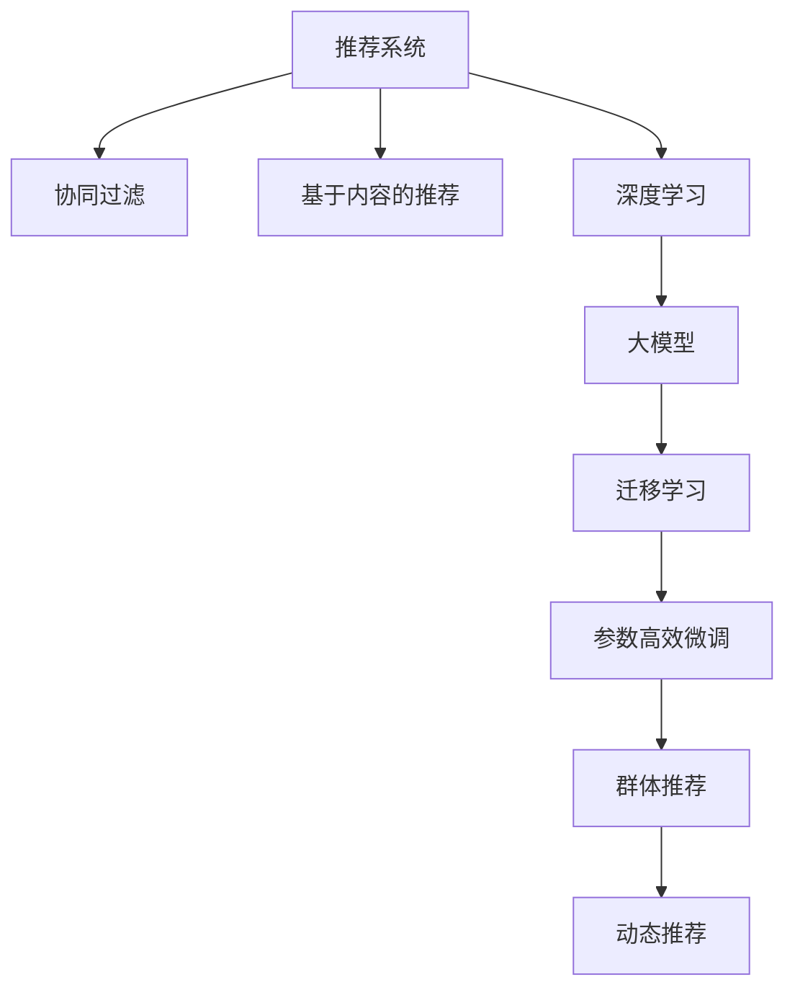

                 

# 大模型在推荐系统群体推荐中的作用

## 1. 背景介绍

### 1.1 问题由来

随着互联网的蓬勃发展，推荐系统成为了提升用户体验、增加收入的重要手段。推荐系统通过分析用户的历史行为数据，为用户推荐感兴趣的物品，如商品、文章、视频等。传统的推荐系统依赖协同过滤、基于内容的推荐等方法，但在面对海量用户和动态变化的数据时，效果往往不尽如人意。

近年来，深度学习技术在推荐系统中得到了广泛应用。以大模型为代表的深度学习推荐系统，利用大规模数据训练出高精度的推荐模型，具备强大的表示能力和泛化能力，能够更好地应对推荐任务中的挑战。

### 1.2 问题核心关键点

大模型在推荐系统中的应用主要体现在群体推荐中，即利用大模型对大规模用户群体进行分析，发现隐藏在用户行为背后的共同兴趣，从而进行全局性推荐。这一方法在一定程度上解决了传统推荐系统面对长尾用户的挑战，能够更好地发现用户的潜在兴趣和多样性需求。

然而，群体推荐中的大模型应用还面临诸多挑战。大模型的训练和推理需要消耗大量的计算资源，如何在确保推荐质量的同时降低成本，成为一个亟待解决的问题。此外，大模型通常基于历史数据进行训练，如何平衡新旧数据的融合，以及如何应对数据分布变化，都是值得深入研究的课题。

### 1.3 问题研究意义

深入研究大模型在推荐系统群体推荐中的作用，对于提升推荐系统的性能和用户体验，推动推荐技术的发展，具有重要意义：

1. 提升推荐质量。大模型通过深度学习的方式，能够挖掘出用户兴趣的多样性和复杂性，从全局角度进行推荐，提高推荐的多样性和准确性。
2. 扩大用户覆盖。群体推荐能够发现长尾用户的兴趣点，将其纳入推荐模型，提升整体推荐效果。
3. 降低成本。相比传统推荐系统，大模型能够通过迁移学习和参数高效微调等方式，减少训练和推理的资源消耗。
4. 实现动态推荐。大模型具备较强的泛化能力，能够应对新数据的实时变化，进行动态推荐。
5. 推动推荐技术发展。大模型的应用推动了推荐系统从基于规则到基于数据的转变，促进了推荐技术的迭代和升级。

## 2. 核心概念与联系

### 2.1 核心概念概述

为更好地理解大模型在推荐系统群体推荐中的作用，本节将介绍几个密切相关的核心概念：

- 推荐系统(Recommendation System)：根据用户的历史行为数据，为用户推荐感兴趣物品的系统。
- 协同过滤(Collaborative Filtering)：基于用户和物品的交互记录，预测用户对物品的兴趣。
- 基于内容的推荐(Content-Based Filtering)：根据物品的属性和用户的兴趣，进行推荐。
- 深度学习(Deep Learning)：利用神经网络模型进行数据表示和任务学习，通过训练发现数据中的规律和模式。
- 大模型(Large Model)：参数量达到亿级的深度学习模型，具备强大的表示能力和泛化能力。
- 迁移学习(Transfer Learning)：将预训练模型作为初始化参数，进行下游任务微调，提高模型泛化能力。
- 参数高效微调(Parameter-Efficient Fine-Tuning, PEFT)：在微调过程中，只更新少量参数，固定大部分预训练权重不变，以提高微调效率。

这些核心概念之间的逻辑关系可以通过以下Mermaid流程图来展示：



这个流程图展示了大模型在推荐系统中的应用框架：

1. 推荐系统通过协同过滤和基于内容的推荐等方式，收集用户的历史行为数据。
2. 深度学习和大模型对收集的数据进行表示学习，提取高层次的特征表示。
3. 迁移学习和大模型微调技术，将预训练模型应用于下游推荐任务，提升推荐效果。
4. 群体推荐利用大模型的泛化能力，发现用户群体的共同兴趣，进行全局性推荐。
5. 动态推荐根据实时数据的变化，进行在线预测和推荐。

## 3. 核心算法原理 & 具体操作步骤
### 3.1 算法原理概述

群体推荐中的大模型应用，本质上是一个基于深度学习的迁移学习过程。其核心思想是：利用大模型对大规模用户行为数据进行预训练，学习到通用的用户兴趣表示。然后，在特定推荐任务上进行微调，使得模型能够准确预测用户对物品的兴趣，从而进行推荐。

具体来说，假设大模型为 $M_{\theta}$，其中 $\theta$ 为预训练得到的模型参数。给定推荐任务 $T$ 的标注数据集 $D=\{(x_i, y_i)\}_{i=1}^N$，其中 $x_i$ 为用户行为数据，$y_i$ 为用户对物品的兴趣标签。群体推荐的目标是找到新的模型参数 $\hat{\theta}$，使得：

$$
\hat{\theta}=\mathop{\arg\min}_{\theta} \mathcal{L}(M_{\theta},D)
$$

其中 $\mathcal{L}$ 为针对推荐任务设计的损失函数，用于衡量模型预测输出与真实标签之间的差异。常见的损失函数包括交叉熵损失、均方误差损失等。

通过梯度下降等优化算法，微调过程不断更新模型参数 $\theta$，最小化损失函数 $\mathcal{L}$，使得模型输出逼近真实标签。由于 $\theta$ 已经通过预训练获得了较好的初始化，因此即便在规模庞大的用户数据集上进行微调，也能较快收敛到理想的模型参数 $\hat{\theta}$。

### 3.2 算法步骤详解

群体推荐中的大模型应用，一般包括以下几个关键步骤：

**Step 1: 准备预训练模型和数据集**
- 选择合适的预训练模型 $M_{\theta}$ 作为初始化参数，如 BERT、GPT 等。
- 准备推荐任务 $T$ 的标注数据集 $D$，划分为训练集、验证集和测试集。一般要求标注数据与预训练数据的分布不要差异过大。

**Step 2: 添加推荐适配层**
- 根据推荐任务类型，在预训练模型顶层设计合适的输出层和损失函数。
- 对于分类推荐任务，通常在顶层添加分类器，输出物品类别。
- 对于排序推荐任务，通常使用二分类损失函数，预测用户对物品的排序。

**Step 3: 设置微调超参数**
- 选择合适的优化算法及其参数，如 AdamW、SGD 等，设置学习率、批大小、迭代轮数等。
- 设置正则化技术及强度，包括权重衰减、Dropout、Early Stopping等。
- 确定冻结预训练参数的策略，如仅微调顶层，或全部参数都参与微调。

**Step 4: 执行梯度训练**
- 将训练集数据分批次输入模型，前向传播计算损失函数。
- 反向传播计算参数梯度，根据设定的优化算法和学习率更新模型参数。
- 周期性在验证集上评估模型性能，根据性能指标决定是否触发 Early Stopping。
- 重复上述步骤直到满足预设的迭代轮数或 Early Stopping 条件。

**Step 5: 测试和部署**
- 在测试集上评估微调后模型 $M_{\hat{\theta}}$ 的性能，对比微调前后的推荐精度提升。
- 使用微调后的模型对新用户进行推荐，集成到实际的应用系统中。
- 持续收集新的用户行为数据，定期重新微调模型，以适应数据分布的变化。

以上是群体推荐中的大模型应用的一般流程。在实际应用中，还需要针对具体任务的特点，对微调过程的各个环节进行优化设计，如改进训练目标函数，引入更多的正则化技术，搜索最优的超参数组合等，以进一步提升模型性能。

### 3.3 算法优缺点

群体推荐中的大模型应用具有以下优点：
1. 简单高效。只需准备少量标注数据，即可对预训练模型进行快速适配，获得较大的性能提升。
2. 泛化能力强。大模型通过大规模数据预训练，具备较强的泛化能力，能够应对大规模用户群体的复杂需求。
3. 提升推荐效果。通过微调，能够将预训练模型的通用特征表示应用到具体推荐任务中，提升推荐效果。
4. 资源利用率高。大模型通常采用参数高效微调技术，仅微调顶层参数，固定大部分预训练权重不变，以提高微调效率，避免过拟合。
5. 动态推荐能力。大模型能够实时处理新数据，进行动态推荐，适应数据分布的变化。

同时，该方法也存在一定的局限性：
1. 依赖标注数据。群体推荐的效果很大程度上取决于标注数据的质量和数量，获取高质量标注数据的成本较高。
2. 模型复杂度高。大模型的参数量较大，训练和推理的计算资源需求高。
3. 可解释性不足。微调模型的决策过程通常缺乏可解释性，难以对其推理逻辑进行分析和调试。
4. 数据隐私问题。大模型通常需要处理大量用户行为数据，可能涉及用户隐私问题，需要采取合适的隐私保护措施。

尽管存在这些局限性，但就目前而言，群体推荐中的大模型应用仍是推荐系统的重要方向。未来相关研究的重点在于如何进一步降低微调对标注数据的依赖，提高模型的少样本学习和跨领域迁移能力，同时兼顾可解释性和隐私保护等因素。

### 3.4 算法应用领域

群体推荐中的大模型应用，在推荐系统领域已经得到了广泛的应用，覆盖了几乎所有常见的推荐场景，例如：

- 电商推荐：推荐商品、用户画像生成、商品关联推荐等。
- 新闻推荐：推荐新闻文章、个性化频道、用户兴趣追踪等。
- 视频推荐：推荐视频、分析用户观看行为、内容推荐优化等。
- 音乐推荐：推荐音乐、分析用户听歌行为、歌词匹配等。
- 社交推荐：推荐好友、分析用户互动行为、内容推荐优化等。

除了上述这些经典任务外，群体推荐中的大模型应用也被创新性地应用到更多场景中，如个性化广告、商品导购、健康医疗等，为推荐技术带来了全新的突破。随着预训练模型和微调方法的不断进步，相信群体推荐中的大模型应用将在更广阔的应用领域大放异彩。

## 4. 数学模型和公式 & 详细讲解
### 4.1 数学模型构建

本节将使用数学语言对群体推荐中的大模型应用进行更加严格的刻画。

记大模型为 $M_{\theta}$，其中 $\theta$ 为模型参数。假设推荐任务 $T$ 的训练集为 $D=\{(x_i, y_i)\}_{i=1}^N$，其中 $x_i$ 为用户行为数据，$y_i$ 为用户对物品的兴趣标签。

定义模型 $M_{\theta}$ 在数据样本 $(x,y)$ 上的损失函数为 $\ell(M_{\theta}(x),y)$，则在数据集 $D$ 上的经验风险为：

$$
\mathcal{L}(\theta) = \frac{1}{N} \sum_{i=1}^N \ell(M_{\theta}(x_i),y_i)
$$

微调的优化目标是最小化经验风险，即找到最优参数：

$$
\theta^* = \mathop{\arg\min}_{\theta} \mathcal{L}(\theta)
$$

在实践中，我们通常使用基于梯度的优化算法（如SGD、Adam等）来近似求解上述最优化问题。设 $\eta$ 为学习率，$\lambda$ 为正则化系数，则参数的更新公式为：

$$
\theta \leftarrow \theta - \eta \nabla_{\theta}\mathcal{L}(\theta) - \eta\lambda\theta
$$

其中 $\nabla_{\theta}\mathcal{L}(\theta)$ 为损失函数对参数 $\theta$ 的梯度，可通过反向传播算法高效计算。

### 4.2 公式推导过程

以下我们以电商推荐任务为例，推导交叉熵损失函数及其梯度的计算公式。

假设模型 $M_{\theta}$ 在输入 $x$ 上的输出为 $\hat{y}=M_{\theta}(x) \in [0,1]$，表示用户对物品的兴趣。真实标签 $y \in \{0,1\}$。则二分类交叉熵损失函数定义为：

$$
\ell(M_{\theta}(x),y) = -[y\log \hat{y} + (1-y)\log (1-\hat{y})]
$$

将其代入经验风险公式，得：

$$
\mathcal{L}(\theta) = -\frac{1}{N}\sum_{i=1}^N [y_i\log M_{\theta}(x_i)+(1-y_i)\log(1-M_{\theta}(x_i))]
$$

根据链式法则，损失函数对参数 $\theta_k$ 的梯度为：

$$
\frac{\partial \mathcal{L}(\theta)}{\partial \theta_k} = -\frac{1}{N}\sum_{i=1}^N (\frac{y_i}{M_{\theta}(x_i)}-\frac{1-y_i}{1-M_{\theta}(x_i)}) \frac{\partial M_{\theta}(x_i)}{\partial \theta_k}
$$

其中 $\frac{\partial M_{\theta}(x_i)}{\partial \theta_k}$ 可进一步递归展开，利用自动微分技术完成计算。

在得到损失函数的梯度后，即可带入参数更新公式，完成模型的迭代优化。重复上述过程直至收敛，最终得到适应推荐任务的最优模型参数 $\theta^*$。

## 5. 项目实践：代码实例和详细解释说明
### 5.1 开发环境搭建

在进行推荐系统开发前，我们需要准备好开发环境。以下是使用Python进行PyTorch开发的环境配置流程：

1. 安装Anaconda：从官网下载并安装Anaconda，用于创建独立的Python环境。

2. 创建并激活虚拟环境：
```bash
conda create -n pytorch-env python=3.8 
conda activate pytorch-env
```

3. 安装PyTorch：根据CUDA版本，从官网获取对应的安装命令。例如：
```bash
conda install pytorch torchvision torchaudio cudatoolkit=11.1 -c pytorch -c conda-forge
```

4. 安装Transformers库：
```bash
pip install transformers
```

5. 安装各类工具包：
```bash
pip install numpy pandas scikit-learn matplotlib tqdm jupyter notebook ipython
```

完成上述步骤后，即可在`pytorch-env`环境中开始推荐系统开发。

### 5.2 源代码详细实现

这里我们以电商推荐任务为例，给出使用Transformers库对BERT模型进行微调的PyTorch代码实现。

首先，定义电商推荐任务的数据处理函数：

```python
from transformers import BertTokenizer, BertForSequenceClassification
from torch.utils.data import Dataset
import torch

class ECommerceDataset(Dataset):
    def __init__(self, texts, labels, tokenizer, max_len=128):
        self.texts = texts
        self.labels = labels
        self.tokenizer = tokenizer
        self.max_len = max_len
        
    def __len__(self):
        return len(self.texts)
    
    def __getitem__(self, item):
        text = self.texts[item]
        label = self.labels[item]
        
        encoding = self.tokenizer(text, return_tensors='pt', max_length=self.max_len, padding='max_length', truncation=True)
        input_ids = encoding['input_ids'][0]
        attention_mask = encoding['attention_mask'][0]
        
        # 将标签转换为二进制形式
        label = torch.tensor(label, dtype=torch.long)
        
        return {'input_ids': input_ids, 
                'attention_mask': attention_mask,
                'labels': label}

# 加载预训练BERT模型和分词器
tokenizer = BertTokenizer.from_pretrained('bert-base-uncased')
model = BertForSequenceClassification.from_pretrained('bert-base-uncased', num_labels=2)

# 创建dataset
train_dataset = ECommerceDataset(train_texts, train_labels, tokenizer)
dev_dataset = ECommerceDataset(dev_texts, dev_labels, tokenizer)
test_dataset = ECommerceDataset(test_texts, test_labels, tokenizer)
```

然后，定义模型和优化器：

```python
from transformers import AdamW

optimizer = AdamW(model.parameters(), lr=2e-5)
```

接着，定义训练和评估函数：

```python
from torch.utils.data import DataLoader
from tqdm import tqdm
from sklearn.metrics import accuracy_score, precision_recall_fscore_support

device = torch.device('cuda') if torch.cuda.is_available() else torch.device('cpu')
model.to(device)

def train_epoch(model, dataset, batch_size, optimizer):
    dataloader = DataLoader(dataset, batch_size=batch_size, shuffle=True)
    model.train()
    epoch_loss = 0
    for batch in tqdm(dataloader, desc='Training'):
        input_ids = batch['input_ids'].to(device)
        attention_mask = batch['attention_mask'].to(device)
        labels = batch['labels'].to(device)
        model.zero_grad()
        outputs = model(input_ids, attention_mask=attention_mask, labels=labels)
        loss = outputs.loss
        epoch_loss += loss.item()
        loss.backward()
        optimizer.step()
    return epoch_loss / len(dataloader)

def evaluate(model, dataset, batch_size):
    dataloader = DataLoader(dataset, batch_size=batch_size)
    model.eval()
    preds, labels = [], []
    with torch.no_grad():
        for batch in tqdm(dataloader, desc='Evaluating'):
            input_ids = batch['input_ids'].to(device)
            attention_mask = batch['attention_mask'].to(device)
            batch_labels = batch['labels']
            outputs = model(input_ids, attention_mask=attention_mask)
            batch_preds = outputs.logits.argmax(dim=2).to('cpu').tolist()
            batch_labels = batch_labels.to('cpu').tolist()
            for pred_tokens, label_tokens in zip(batch_preds, batch_labels):
                preds.append(pred_tokens[:len(label_tokens)])
                labels.append(label_tokens)
                
    print(accuracy_score(labels, preds))
```

最后，启动训练流程并在测试集上评估：

```python
epochs = 5
batch_size = 16

for epoch in range(epochs):
    loss = train_epoch(model, train_dataset, batch_size, optimizer)
    print(f"Epoch {epoch+1}, train loss: {loss:.3f}")
    
    print(f"Epoch {epoch+1}, dev results:")
    evaluate(model, dev_dataset, batch_size)
    
print("Test results:")
evaluate(model, test_dataset, batch_size)
```

以上就是使用PyTorch对BERT进行电商推荐任务微调的完整代码实现。可以看到，得益于Transformers库的强大封装，我们可以用相对简洁的代码完成BERT模型的加载和微调。

### 5.3 代码解读与分析

让我们再详细解读一下关键代码的实现细节：

**ECommerceDataset类**：
- `__init__`方法：初始化文本、标签、分词器等关键组件。
- `__len__`方法：返回数据集的样本数量。
- `__getitem__`方法：对单个样本进行处理，将文本输入编码为token ids，将标签转换为二进制形式，并对其进行定长padding，最终返回模型所需的输入。

**模型和优化器**：
- 使用BertForSequenceClassification对预训练BERT模型进行微调，用于二分类任务。
- 优化器AdamW用于模型参数的更新，学习率为2e-5。

**训练和评估函数**：
- 使用PyTorch的DataLoader对数据集进行批次化加载，供模型训练和推理使用。
- 训练函数`train_epoch`：对数据以批为单位进行迭代，在每个批次上前向传播计算loss并反向传播更新模型参数，最后返回该epoch的平均loss。
- 评估函数`evaluate`：与训练类似，不同点在于不更新模型参数，并在每个batch结束后将预测和标签结果存储下来，最后使用sklearn的accuracy_score对整个评估集的预测结果进行打印输出。

**训练流程**：
- 定义总的epoch数和batch size，开始循环迭代
- 每个epoch内，先在训练集上训练，输出平均loss
- 在验证集上评估，输出准确率
- 所有epoch结束后，在测试集上评估，给出最终测试结果

可以看到，PyTorch配合Transformers库使得BERT微调的代码实现变得简洁高效。开发者可以将更多精力放在数据处理、模型改进等高层逻辑上，而不必过多关注底层的实现细节。

当然，工业级的系统实现还需考虑更多因素，如模型的保存和部署、超参数的自动搜索、更灵活的任务适配层等。但核心的微调范式基本与此类似。

## 6. 实际应用场景
### 6.1 电商推荐

在大模型微调的群体推荐中，电商推荐是最具代表性的应用场景。传统的电商推荐系统主要依赖协同过滤、基于内容的推荐等方法，但在面对海量用户和动态变化的数据时，效果往往不尽如人意。利用大模型微调技术，电商推荐系统能够更好地挖掘用户兴趣，实现全局性推荐。

具体而言，电商推荐系统可以通过用户行为数据（如浏览记录、购买历史、评分反馈等）构建用户画像，再利用大模型对用户画像进行预训练，学习用户兴趣的表示。然后，在特定电商推荐任务上进行微调，使得模型能够准确预测用户对商品的兴趣，从而进行推荐。微调后的电商推荐系统能够实时更新用户画像，并根据新数据进行动态推荐，提升了推荐效果。

### 6.2 视频推荐

视频推荐系统是群体推荐的另一个重要应用领域。视频平台需要根据用户的历史行为数据，推荐用户可能感兴趣的视频内容。传统的推荐系统主要依赖协同过滤、基于内容的推荐等方法，但在视频推荐中，需要考虑视频的关联关系和上下文信息，这些都需要通过大模型微调来实现。

在视频推荐中，可以利用大模型对用户行为数据进行预训练，学习用户对视频的兴趣表示。然后，在特定视频推荐任务上进行微调，使得模型能够准确预测用户对视频的兴趣，从而进行推荐。微调后的视频推荐系统能够实时处理新视频内容，进行动态推荐，提升了推荐效果。

### 6.3 社交推荐

社交推荐系统旨在为用户推荐可能感兴趣的朋友和内容。传统的社交推荐系统主要依赖用户社交关系和兴趣标签等特征，但在推荐多样性和个性化方面表现有限。利用大模型微调技术，社交推荐系统能够更好地挖掘用户兴趣，实现全局性推荐。

在社交推荐中，可以利用大模型对用户社交行为数据进行预训练，学习用户兴趣的表示。然后，在特定社交推荐任务上进行微调，使得模型能够准确预测用户对朋友和内容的兴趣，从而进行推荐。微调后的社交推荐系统能够实时更新用户社交网络，并根据新数据进行动态推荐，提升了推荐效果。

### 6.4 未来应用展望

随着大模型和微调技术的不断发展，基于大模型的群体推荐技术将在更多领域得到应用，为推荐系统带来新的突破：

在智慧医疗领域，基于大模型的群体推荐技术可以用于推荐个性化医疗方案、健康科普知识、药品等信息，帮助用户更科学地管理健康。

在智能教育领域，群体推荐技术可以用于推荐个性化学习资源、教育视频、问答等，帮助学生更高效地学习。

在智慧城市治理中，群体推荐技术可以用于推荐智慧城市应用、城市事件、出行路线等，提高城市管理水平。

此外，在金融服务、物流配送、内容创作等众多领域，基于大模型的群体推荐技术也将不断涌现，为各行各业带来变革性影响。相信随着技术的日益成熟，大模型微调技术将成为推荐系统的重要方向，推动推荐技术的发展和应用。

## 7. 工具和资源推荐
### 7.1 学习资源推荐

为了帮助开发者系统掌握大模型在推荐系统群体推荐中的作用，这里推荐一些优质的学习资源：

1. 《深度学习推荐系统》系列博文：由大模型技术专家撰写，详细介绍了深度学习推荐系统的发展历程和前沿技术。

2. CS229《机器学习》课程：斯坦福大学开设的机器学习明星课程，介绍了深度学习在推荐系统中的应用。

3. 《Recommender Systems》书籍：介绍推荐系统的理论基础和经典算法，适合初学者和进阶者阅读。

4. Kaggle推荐系统竞赛：Kaggle举办的多项推荐系统竞赛，通过实际竞赛数据训练推荐模型，提升实战能力。

5. 论文《Deep Neural Networks for Recommendation System: A Survey》：总结了深度学习在推荐系统中的应用现状和未来方向，适合深度学习爱好者阅读。

通过对这些资源的学习实践，相信你一定能够快速掌握大模型在推荐系统群体推荐中的精髓，并用于解决实际的推荐问题。
###  7.2 开发工具推荐

高效的开发离不开优秀的工具支持。以下是几款用于大模型微调开发的常用工具：

1. PyTorch：基于Python的开源深度学习框架，灵活动态的计算图，适合快速迭代研究。大部分预训练语言模型都有PyTorch版本的实现。

2. TensorFlow：由Google主导开发的开源深度学习框架，生产部署方便，适合大规模工程应用。同样有丰富的预训练语言模型资源。

3. Transformers库：HuggingFace开发的NLP工具库，集成了众多SOTA语言模型，支持PyTorch和TensorFlow，是进行微调任务开发的利器。

4. Weights & Biases：模型训练的实验跟踪工具，可以记录和可视化模型训练过程中的各项指标，方便对比和调优。与主流深度学习框架无缝集成。

5. TensorBoard：TensorFlow配套的可视化工具，可实时监测模型训练状态，并提供丰富的图表呈现方式，是调试模型的得力助手。

6. Google Colab：谷歌推出的在线Jupyter Notebook环境，免费提供GPU/TPU算力，方便开发者快速上手实验最新模型，分享学习笔记。

合理利用这些工具，可以显著提升大模型微调任务的开发效率，加快创新迭代的步伐。

### 7.3 相关论文推荐

大模型和微调技术的发展源于学界的持续研究。以下是几篇奠基性的相关论文，推荐阅读：

1. Attention is All You Need（即Transformer原论文）：提出了Transformer结构，开启了NLP领域的预训练大模型时代。

2. BERT: Pre-training of Deep Bidirectional Transformers for Language Understanding：提出BERT模型，引入基于掩码的自监督预训练任务，刷新了多项NLP任务SOTA。

3. Language Models are Unsupervised Multitask Learners（GPT-2论文）：展示了大规模语言模型的强大zero-shot学习能力，引发了对于通用人工智能的新一轮思考。

4. Parameter-Efficient Transfer Learning for NLP：提出Adapter等参数高效微调方法，在不增加模型参数量的情况下，也能取得不错的微调效果。

5. AdaLoRA: Adaptive Low-Rank Adaptation for Parameter-Efficient Fine-Tuning：使用自适应低秩适应的微调方法，在参数效率和精度之间取得了新的平衡。

这些论文代表了大模型和微调技术的发展脉络。通过学习这些前沿成果，可以帮助研究者把握学科前进方向，激发更多的创新灵感。

## 8. 总结：未来发展趋势与挑战

### 8.1 总结

本文对基于大模型的推荐系统群体推荐进行了全面系统的介绍。首先阐述了群体推荐中大模型应用的可行性，明确了大模型在推荐系统中的应用背景和前景。其次，从原理到实践，详细讲解了大模型群体推荐的数学原理和关键步骤，给出了群体推荐任务开发的完整代码实例。同时，本文还广泛探讨了大模型在电商推荐、视频推荐、社交推荐等多个推荐场景中的应用，展示了群体推荐范式的强大潜力。此外，本文精选了大模型微调的各类学习资源，力求为读者提供全方位的技术指引。

通过本文的系统梳理，可以看到，基于大模型的推荐系统群体推荐，不仅具备较强的泛化能力和推荐效果，还具备高效的资源利用和动态推荐能力。未来，随着大模型和微调技术的不断发展，基于大模型的推荐系统群体推荐将在大规模数据驱动和实时动态推荐中发挥更大的作用，推动推荐技术的发展和应用。

### 8.2 未来发展趋势

展望未来，基于大模型的推荐系统群体推荐技术将呈现以下几个发展趋势：

1. 模型规模持续增大。随着算力成本的下降和数据规模的扩张，预训练语言模型的参数量还将持续增长。超大规模语言模型蕴含的丰富语言知识，有望支撑更加复杂多变的推荐任务。

2. 推荐方法日趋多样。除了传统的群体推荐外，未来会涌现更多参数高效的推荐方法，如LoRA、Prefix等，在保证推荐效果的同时，减小计算资源消耗。

3. 持续学习成为常态。推荐系统需要持续学习新数据，更新用户兴趣和物品特征，以适应数据分布的变化。如何在不遗忘原有知识的同时，高效吸收新样本信息，将成为重要的研究课题。

4. 推荐系统逐步智能化。基于大模型的推荐系统能够更好地理解用户需求和推荐行为，将逐步迈向智能化推荐，提高推荐系统的主动性和个性化程度。

5. 融合多模态数据。未来的推荐系统将更多地融合多模态数据，如图像、音频、地理位置等，提供更加全面、丰富的推荐结果。

6. 引入因果推断思想。通过引入因果推断方法，提高推荐系统对用户行为变化的适应性，提升推荐模型的稳健性。

7. 加入隐私保护机制。为了应对用户隐私问题，未来的推荐系统将引入隐私保护技术，如差分隐私、联邦学习等，保护用户数据安全。

以上趋势凸显了基于大模型的推荐系统群体推荐的广阔前景。这些方向的探索发展，必将进一步提升推荐系统的性能和用户体验，推动推荐技术的发展和应用。

### 8.3 面临的挑战

尽管基于大模型的推荐系统群体推荐技术已经取得了瞩目成就，但在迈向更加智能化、普适化应用的过程中，它仍面临着诸多挑战：

1. 标注成本瓶颈。虽然大模型能够通过迁移学习提高推荐效果，但仍然需要收集和标注大量的用户行为数据，获取高质量标注数据的成本较高。如何进一步降低微调对标注样本的依赖，将是一大难题。

2. 模型鲁棒性不足。群体推荐系统在面对域外数据时，泛化性能往往大打折扣。对于测试样本的微小扰动，推荐模型的预测也容易发生波动。如何提高推荐模型的鲁棒性，避免灾难性遗忘，还需要更多理论和实践的积累。

3. 推荐系统公平性问题。基于大模型的推荐系统可能会学习到用户之间的偏见，导致推荐结果的不公平性。如何确保推荐系统的公平性和可解释性，是一个重要的研究方向。

4. 数据隐私问题。大模型通常需要处理大量用户行为数据，可能涉及用户隐私问题，需要采取合适的隐私保护措施。

5. 计算资源消耗高。大模型的训练和推理需要消耗大量的计算资源，如何在保证推荐效果的同时，减小计算成本，是一个亟待解决的问题。

6. 实时动态推荐。为了满足实时推荐的需求，推荐系统需要能够快速处理和分析新数据，进行动态推荐。如何平衡计算效率和推荐效果，还需要更多的技术突破。

尽管存在这些挑战，但通过不断的技术创新和优化，这些挑战终将一一被克服，基于大模型的推荐系统群体推荐必将在推荐技术中占据重要地位。

### 8.4 未来突破

面对基于大模型的推荐系统群体推荐所面临的种种挑战，未来的研究需要在以下几个方面寻求新的突破：

1. 探索无监督和半监督推荐方法。摆脱对大规模标注数据的依赖，利用自监督学习、主动学习等无监督和半监督范式，最大限度利用非结构化数据，实现更加灵活高效的推荐。

2. 研究参数高效和计算高效的推荐范式。开发更加参数高效的推荐方法，在固定大部分预训练参数的同时，只更新极少量的任务相关参数。同时优化推荐系统的计算图，减少前向传播和反向传播的资源消耗，实现更加轻量级、实时性的部署。

3. 引入因果分析和博弈论工具。将因果分析方法引入推荐系统，识别出推荐决策的关键特征，增强推荐系统的因果解释性。借助博弈论工具刻画人机交互过程，主动探索并规避推荐系统的脆弱点，提高系统稳定性。

4. 引入更多先验知识。将符号化的先验知识，如知识图谱、逻辑规则等，与神经网络模型进行巧妙融合，引导推荐系统学习更准确、合理的用户兴趣表示。同时加强不同模态数据的整合，实现视觉、音频等多模态信息与文本信息的协同建模。

5. 引入隐私保护机制。在推荐系统中引入隐私保护技术，如差分隐私、联邦学习等，保护用户数据安全。同时，在推荐算法中设计隐私保护方案，如分布式推荐、本地推荐等，确保推荐系统的公平性和安全性。

6. 引入自适应推荐算法。通过引入自适应推荐算法，根据用户行为和上下文信息动态调整推荐策略，提高推荐系统的适应性和灵活性。

这些研究方向的探索，必将引领基于大模型的推荐系统群体推荐技术迈向更高的台阶，为推荐系统的发展和应用提供新的动力。面向未来，基于大模型的推荐系统群体推荐技术还需要与其他人工智能技术进行更深入的融合，如知识表示、因果推理、强化学习等，多路径协同发力，共同推动推荐系统的发展和应用。只有勇于创新、敢于突破，才能不断拓展推荐系统的边界，让推荐技术更好地服务于用户，创造更多价值。

## 9. 附录：常见问题与解答

**Q1：大模型在群体推荐中是否需要重新训练？**

A: 通常情况下，大模型不需要重新训练。大模型通过大规模数据预训练，已经学习到了丰富的语言知识和用户行为特征，具备较强的泛化能力。在群体推荐任务上，通过微调参数，即可适应特定任务的推荐需求。

**Q2：大模型在推荐系统中如何进行迁移学习？**

A: 大模型在推荐系统中的迁移学习主要通过微调实现。具体步骤如下：
1. 选择预训练模型作为初始化参数，如BERT、GPT等。
2. 准备推荐任务的数据集，划分为训练集、验证集和测试集。
3. 添加任务适配层，如分类器或二分类器，输出用户对物品的兴趣。
4. 设置微调超参数，如学习率、批大小、迭代轮数等。
5. 执行梯度训练，通过反向传播更新模型参数，最小化损失函数。
6. 在验证集上评估模型性能，根据性能决定是否触发Early Stopping。
7. 重复上述步骤，直到模型收敛。

**Q3：如何降低大模型在推荐系统中的计算成本？**

A: 降低大模型在推荐系统中的计算成本，可以通过以下方法：
1. 参数高效微调：仅微调顶层参数，固定大部分预训练权重不变，减小计算消耗。
2. 量化加速：将浮点模型转为定点模型，压缩存储空间，提高计算效率。
3. 模型裁剪：去除不必要的层和参数，减小模型尺寸，加快推理速度。
4. 分布式训练：利用多台机器进行分布式训练，加快训练速度。
5. 动态模型选择：根据不同用户和上下文信息，动态选择不同的模型，避免在每个推荐场景中都加载全模型。

这些方法可以显著降低大模型在推荐系统中的计算成本，提升系统的实时性和资源利用率。

**Q4：大模型在推荐系统中如何进行动态推荐？**

A: 大模型在推荐系统中的动态推荐主要通过实时数据处理和模型更新实现。具体步骤如下：
1. 收集实时用户行为数据，如点击、浏览、评分等。
2. 将实时数据输入大模型，进行特征表示和用户画像更新。
3. 根据用户画像和实时数据，重新计算推荐结果，更新推荐列表。
4. 定期重新微调大模型，更新模型参数，保持推荐模型的泛化能力。

通过实时数据处理和模型更新，大模型能够在用户行为变化时，快速调整推荐策略，实现动态推荐。

**Q5：如何评估大模型在推荐系统中的推荐效果？**

A: 大模型在推荐系统中的推荐效果评估，通常使用以下指标：
1. 准确率：推荐系统推荐的物品是否与用户真实兴趣一致。
2. 召回率：用户真实感兴趣的物品是否被推荐系统成功推荐。
3. F1-score：综合考虑准确率和召回率，衡量推荐系统的整体表现。
4. 覆盖率：推荐系统推荐的物品是否多样化，覆盖用户兴趣的广度。
5. 点击率：用户点击推荐物品的概率，衡量推荐物品的吸引力。
6. 转化率：用户购买推荐物品的概率，衡量推荐系统的商业价值。

通过综合评估这些指标，可以全面了解大模型在推荐系统中的表现，并进行调优。

---

作者：禅与计算机程序设计艺术 / Zen and the Art of Computer Programming

