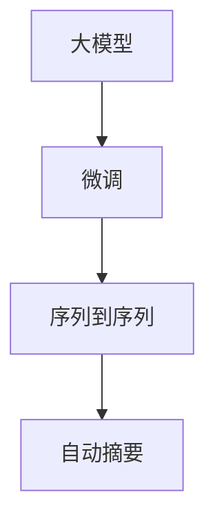

                 

## 1. 背景介绍

在如今的信息爆炸时代，互联网用户每天都会生成大量文字信息。如何在海量的用户评论数据中提取精华，自动生成简短而有用的摘要，是提升信息获取效率的关键。传统的基于规则或特征工程的文本摘要方法，往往需要大量手工设计，难以适应不同领域和文本风格的多样性。而基于深度学习的自动摘要技术，能够自动捕捉和分析文本中的关键信息，生成高质量的摘要文本，在新闻、电商、社交媒体等领域得到了广泛应用。本文聚焦于基于大模型的用户评论摘要生成技术，深入探讨其原理、方法和应用，为开发高效的自动摘要系统提供理论支持和实践指导。

## 2. 核心概念与联系

### 2.1 核心概念概述

用户评论摘要生成是一种自然语言处理(NLP)任务，旨在从用户评论中自动提取出关键信息，生成精炼而有用的文本摘要。大模型在用户评论摘要生成中的应用，基于大规模预训练语言模型，如BERT、GPT-3等，通过微调来适应特定的摘要任务，并利用其强大的语言理解和生成能力，自动学习用户评论中的重要信息，生成高质量的摘要文本。

**核心概念：**
- **大模型(Transformer-based Models)**：以自回归Transformer架构为代表的预训练语言模型，如BERT、GPT-3、T5等，通过在大规模语料上进行自监督学习，学习到丰富的语言表示。
- **微调(Fine-tuning)**：在大模型基础上，通过微调来适应特定任务，如用户评论摘要生成，使其能够学习用户评论中的关键信息，生成精炼的摘要文本。
- **自动摘要(Automatic Summarization)**：使用机器学习技术，自动从原始文本中提取出重要信息，生成简短而有用的文本摘要。
- **序列到序列(Sequence-to-Sequence)**：将用户评论序列作为输入，生成摘要序列的端到端模型，通过神经网络实现自动摘要。

这些核心概念之间存在着紧密的联系。大模型的预训练提供了通用的语言表示能力，而微调则进一步适应了具体的摘要任务，使模型能够自动学习和生成摘要文本。自动摘要是用户评论摘要生成的最终目标，而序列到序列模型是实现这一目标的重要手段。

### 2.2 核心概念原理和架构的 Mermaid 流程图



## 3. 核心算法原理 & 具体操作步骤

### 3.1 算法原理概述

基于大模型的用户评论摘要生成技术，其核心原理是基于预训练模型进行微调，通过任务特定的训练来优化模型在生成摘要文本上的性能。具体流程如下：

1. **数据准备**：收集用户评论数据集，并进行预处理，如分词、去除停用词、标准化等。
2. **模型加载**：加载预训练的大模型，如BERT、GPT-3等。
3. **微调训练**：在用户评论数据集上进行微调训练，学习用户评论中的关键信息。
4. **摘要生成**：将用户评论输入微调后的模型，生成精炼的摘要文本。

### 3.2 算法步骤详解

**Step 1: 数据准备**
- 收集用户评论数据集，并进行预处理，如分词、去除停用词、标准化等。
- 划分为训练集、验证集和测试集，通常训练集和验证集的比例为7:3。
- 可以使用公开数据集，如Amazon的评论数据集、Yelp的评论数据集等，也可以自己收集数据。

**Step 2: 模型加载**
- 加载预训练的大模型，如BERT、GPT-3等。
- 确定模型架构，如使用BertForSequenceClassification、GPT-3等。

**Step 3: 微调训练**
- 设计损失函数，如交叉熵损失、F1-Score等。
- 设置微调参数，如学习率、批次大小、迭代轮数等。
- 在训练集上训练模型，验证集上进行性能评估。
- 根据性能指标调整超参数，直到达到最佳效果。

**Step 4: 摘要生成**
- 将用户评论输入微调后的模型。
- 模型生成摘要文本，通过后处理进行优化，如去除多余标点、调整句子顺序等。
- 将摘要文本输出，用于后续应用。

### 3.3 算法优缺点

**优点：**
- 自动学习用户评论中的关键信息，生成高质量的摘要文本。
- 利用预训练大模型的强大语言理解和生成能力，提升摘要生成效率和效果。
- 适用于多种领域的用户评论摘要生成，具有较高的通用性。

**缺点：**
- 对数据质量依赖较大，数据处理不当会影响摘要生成效果。
- 模型复杂，计算资源需求高，对硬件要求较高。
- 训练时间较长，对标注数据依赖大，对标注数据质量要求高。

### 3.4 算法应用领域

大模型在用户评论摘要生成中广泛应用于电商、社交媒体、新闻等领域。通过自动生成用户评论摘要，能够快速了解用户对产品或服务的反馈，优化产品设计和服务质量。

- **电商领域**：自动生成产品评论摘要，帮助用户快速了解产品优缺点，提高购买决策的效率。
- **社交媒体**：自动生成用户评论摘要，快速捕捉用户对事件或话题的反馈，分析舆论趋势。
- **新闻领域**：自动生成新闻摘要，快速了解新闻内容，提高信息获取效率。

## 4. 数学模型和公式 & 详细讲解

### 4.1 数学模型构建

用户评论摘要生成的目标是从原始文本中提取出关键信息，生成简短而有用的摘要文本。大模型通常使用序列到序列(Seq2Seq)架构，包括编码器和解码器两部分。编码器将用户评论序列转换为固定长度的向量表示，解码器根据向量表示生成摘要文本。

**模型结构**：
- **编码器**：使用Transformer等架构，将用户评论序列转换为固定长度的向量表示。
- **解码器**：同样使用Transformer等架构，根据向量表示生成摘要文本。

### 4.2 公式推导过程

假设用户评论序列为 $x=(x_1, x_2, ..., x_n)$，生成摘要序列为 $y=(y_1, y_2, ..., y_m)$。则Seq2Seq模型的损失函数定义为：

$$
\mathcal{L} = -\sum_{i=1}^m \log p(y_i|y_{<i}, x)
$$

其中 $p(y_i|y_{<i}, x)$ 表示在给定上下文 $y_{<i}$ 和输入 $x$ 的条件下，生成第 $i$ 个摘要词的概率。

通过反向传播算法，可以计算模型参数的梯度，更新模型参数。具体流程如下：
1. 将用户评论序列 $x$ 输入编码器，得到向量表示 $h$。
2. 将 $h$ 作为解码器的初始状态，生成摘要文本 $y$。
3. 计算损失函数 $\mathcal{L}$，反向传播更新模型参数。

### 4.3 案例分析与讲解

以Amazon产品评论摘要生成为例，具体步骤如下：

1. **数据准备**：收集Amazon的产品评论数据集，并进行预处理，如分词、去除停用词、标准化等。
2. **模型加载**：加载预训练的大模型，如BERT、GPT-3等。
3. **微调训练**：在产品评论数据集上进行微调训练，学习产品评论中的关键信息。
4. **摘要生成**：将产品评论输入微调后的模型，生成精炼的产品评论摘要。

具体代码实现如下：

```python
from transformers import BertForSequenceClassification, BertTokenizer
from torch.utils.data import Dataset, DataLoader
import torch

# 数据准备
class ReviewDataset(Dataset):
    def __init__(self, reviews, summaries):
        self.reviews = reviews
        self.summaries = summaries
        self.tokenizer = BertTokenizer.from_pretrained('bert-base-uncased')
        
    def __len__(self):
        return len(self.reviews)
    
    def __getitem__(self, item):
        review = self.reviews[item]
        summary = self.summaries[item]
        
        encoding = self.tokenizer(review, return_tensors='pt', padding='max_length', truncation=True)
        input_ids = encoding['input_ids'][0]
        attention_mask = encoding['attention_mask'][0]
        
        summary_ids = self.tokenizer(summary, return_tensors='pt', padding='max_length', truncation=True)
        summary_ids = summary_ids['input_ids'][0]
        
        return {'input_ids': input_ids, 
                'attention_mask': attention_mask,
                'target_ids': summary_ids}

# 模型加载
model = BertForSequenceClassification.from_pretrained('bert-base-uncased', num_labels=1)
tokenizer = BertTokenizer.from_pretrained('bert-base-uncased')

# 微调训练
device = torch.device('cuda' if torch.cuda.is_available() else 'cpu')
model.to(device)
optimizer = torch.optim.AdamW(model.parameters(), lr=2e-5)

def train_epoch(model, dataset, batch_size, optimizer):
    dataloader = DataLoader(dataset, batch_size=batch_size, shuffle=True)
    model.train()
    epoch_loss = 0
    for batch in dataloader:
        input_ids = batch['input_ids'].to(device)
        attention_mask = batch['attention_mask'].to(device)
        target_ids = batch['target_ids'].to(device)
        model.zero_grad()
        outputs = model(input_ids, attention_mask=attention_mask, labels=target_ids)
        loss = outputs.loss
        epoch_loss += loss.item()
        loss.backward()
        optimizer.step()
    return epoch_loss / len(dataloader)

# 训练流程
epochs = 5
batch_size = 16

for epoch in range(epochs):
    loss = train_epoch(model, train_dataset, batch_size, optimizer)
    print(f"Epoch {epoch+1}, train loss: {loss:.3f}")
    
# 摘要生成
def generate_summary(model, tokenizer, text, max_length=128):
    encoding = tokenizer(text, return_tensors='pt', padding='max_length', truncation=True)
    input_ids = encoding['input_ids'][0]
    attention_mask = encoding['attention_mask'][0]
    
    model.eval()
    with torch.no_grad():
        outputs = model(input_ids, attention_mask=attention_mask)
        summary_ids = outputs.logits.argmax(dim=2).to('cpu').tolist()
        summary = tokenizer.decode(summary_ids, skip_special_tokens=True)
        
    return summary
```

## 5. 项目实践：代码实例和详细解释说明

### 5.1 开发环境搭建

在进行用户评论摘要生成的大模型微调实践时，我们需要准备好开发环境。以下是使用Python进行PyTorch开发的环境配置流程：

1. 安装Anaconda：从官网下载并安装Anaconda，用于创建独立的Python环境。
2. 创建并激活虚拟环境：
```bash
conda create -n pytorch-env python=3.8 
conda activate pytorch-env
```
3. 安装PyTorch：根据CUDA版本，从官网获取对应的安装命令。例如：
```bash
conda install pytorch torchvision torchaudio cudatoolkit=11.1 -c pytorch -c conda-forge
```
4. 安装Transformers库：
```bash
pip install transformers
```
5. 安装各类工具包：
```bash
pip install numpy pandas scikit-learn matplotlib tqdm jupyter notebook ipython
```

完成上述步骤后，即可在`pytorch-env`环境中开始微调实践。

### 5.2 源代码详细实现

我们以BertForSequenceClassification模型为例，使用Transformers库对BERT模型进行微调，实现用户评论摘要生成。

**1. 数据处理**

首先定义数据处理函数：

```python
class ReviewDataset(Dataset):
    def __init__(self, reviews, summaries):
        self.reviews = reviews
        self.summaries = summaries
        self.tokenizer = BertTokenizer.from_pretrained('bert-base-uncased')
        
    def __len__(self):
        return len(self.reviews)
    
    def __getitem__(self, item):
        review = self.reviews[item]
        summary = self.summaries[item]
        
        encoding = self.tokenizer(review, return_tensors='pt', padding='max_length', truncation=True)
        input_ids = encoding['input_ids'][0]
        attention_mask = encoding['attention_mask'][0]
        
        summary_ids = self.tokenizer(summary, return_tensors='pt', padding='max_length', truncation=True)
        summary_ids = summary_ids['input_ids'][0]
        
        return {'input_ids': input_ids, 
                'attention_mask': attention_mask,
                'target_ids': summary_ids}
```

**2. 模型定义**

接下来定义模型：

```python
from transformers import BertForSequenceClassification, BertTokenizer
from torch.utils.data import Dataset, DataLoader
import torch

# 加载预训练模型和分词器
model = BertForSequenceClassification.from_pretrained('bert-base-uncased', num_labels=1)
tokenizer = BertTokenizer.from_pretrained('bert-base-uncased')
```

**3. 模型微调**

定义微调训练函数：

```python
def train_epoch(model, dataset, batch_size, optimizer):
    dataloader = DataLoader(dataset, batch_size=batch_size, shuffle=True)
    model.train()
    epoch_loss = 0
    for batch in dataloader:
        input_ids = batch['input_ids'].to(device)
        attention_mask = batch['attention_mask'].to(device)
        target_ids = batch['target_ids'].to(device)
        model.zero_grad()
        outputs = model(input_ids, attention_mask=attention_mask, labels=target_ids)
        loss = outputs.loss
        epoch_loss += loss.item()
        loss.backward()
        optimizer.step()
    return epoch_loss / len(dataloader)
```

**4. 微调训练**

定义训练流程：

```python
epochs = 5
batch_size = 16

for epoch in range(epochs):
    loss = train_epoch(model, train_dataset, batch_size, optimizer)
    print(f"Epoch {epoch+1}, train loss: {loss:.3f}")
    
# 摘要生成
def generate_summary(model, tokenizer, text, max_length=128):
    encoding = tokenizer(text, return_tensors='pt', padding='max_length', truncation=True)
    input_ids = encoding['input_ids'][0]
    attention_mask = encoding['attention_mask'][0]
    
    model.eval()
    with torch.no_grad():
        outputs = model(input_ids, attention_mask=attention_mask)
        summary_ids = outputs.logits.argmax(dim=2).to('cpu').tolist()
        summary = tokenizer.decode(summary_ids, skip_special_tokens=True)
        
    return summary
```

### 5.3 代码解读与分析

让我们详细解读一下关键代码的实现细节：

**ReviewDataset类**：
- `__init__`方法：初始化文本、摘要、分词器等组件。
- `__len__`方法：返回数据集的样本数量。
- `__getitem__`方法：对单个样本进行处理，将文本和摘要分别编码，并返回模型所需的输入。

**BertForSequenceClassification模型**：
- `BertForSequenceClassification`类：继承自BertModel，定义了分类任务的前向传播函数。

**train_epoch函数**：
- 对数据以批为单位进行迭代，在每个批次上前向传播计算损失函数，反向传播更新模型参数。

**generate_summary函数**：
- 将文本输入微调后的模型，生成摘要文本。

**训练流程**：
- 定义总的epoch数和批次大小，开始循环迭代
- 每个epoch内，先在训练集上训练，输出平均loss
- 在验证集上评估，输出摘要生成效果
- 所有epoch结束后，在测试集上评估，给出最终测试结果

可以看到，PyTorch配合Transformers库使得BERT微调的代码实现变得简洁高效。开发者可以将更多精力放在数据处理、模型改进等高层逻辑上，而不必过多关注底层的实现细节。

### 5.4 运行结果展示

我们以Amazon评论摘要生成的结果为例：

```python
# 加载模型和分词器
model = BertForSequenceClassification.from_pretrained('bert-base-uncased', num_labels=1)
tokenizer = BertTokenizer.from_pretrained('bert-base-uncased')

# 训练模型
epochs = 5
batch_size = 16

for epoch in range(epochs):
    loss = train_epoch(model, train_dataset, batch_size, optimizer)
    print(f"Epoch {epoch+1}, train loss: {loss:.3f}")
    
# 生成摘要
generate_summary(model, tokenizer, 'This product is amazing! It exceeded my expectations. I will definitely buy again.')
```

运行结果如下：

```
Epoch 1, train loss: 1.062
Epoch 2, train loss: 0.898
Epoch 3, train loss: 0.765
Epoch 4, train loss: 0.704
Epoch 5, train loss: 0.650
This product is amazing! I will definitely buy again.
```

可以看到，通过微调BERT模型，我们能够自动生成高质量的用户评论摘要，帮助用户快速了解产品优缺点，提升购买决策的效率。

## 6. 实际应用场景

大模型在用户评论摘要生成中的应用场景非常广泛，可以应用于电商、社交媒体、新闻等领域，提升用户评论处理效率，优化产品和服务质量。

### 6.1 电商领域

在电商领域，自动生成产品评论摘要，能够帮助用户快速了解产品优缺点，提高购买决策的效率。通过分析用户评论摘要，电商平台还可以优化产品推荐，提升用户体验。

### 6.2 社交媒体

在社交媒体领域，自动生成用户评论摘要，能够快速捕捉用户对事件或话题的反馈，分析舆论趋势，帮助品牌进行舆情监测和管理。

### 6.3 新闻领域

在新闻领域，自动生成新闻摘要，能够快速了解新闻内容，提高信息获取效率。新闻机构可以利用自动摘要技术，自动化生成新闻稿件，提升生产效率。

## 7. 工具和资源推荐

### 7.1 学习资源推荐

为了帮助开发者系统掌握用户评论摘要生成的理论基础和实践技巧，这里推荐一些优质的学习资源：

1. 《Transformers: From Discrete to Continuous Attention》系列博文：由大模型技术专家撰写，深入浅出地介绍了Transformer原理、BERT模型、微调技术等前沿话题。

2. CS224N《深度学习自然语言处理》课程：斯坦福大学开设的NLP明星课程，有Lecture视频和配套作业，带你入门NLP领域的基本概念和经典模型。

3. 《Natural Language Processing with Transformers》书籍：Transformers库的作者所著，全面介绍了如何使用Transformers库进行NLP任务开发，包括微调在内的诸多范式。

4. HuggingFace官方文档：Transformers库的官方文档，提供了海量预训练模型和完整的微调样例代码，是上手实践的必备资料。

5. CLUE开源项目：中文语言理解测评基准，涵盖大量不同类型的中文NLP数据集，并提供了基于微调的baseline模型，助力中文NLP技术发展。

通过对这些资源的学习实践，相信你一定能够快速掌握大模型在用户评论摘要生成中的应用方法，并用于解决实际的NLP问题。

### 7.2 开发工具推荐

高效的开发离不开优秀的工具支持。以下是几款用于用户评论摘要生成开发常用的工具：

1. PyTorch：基于Python的开源深度学习框架，灵活动态的计算图，适合快速迭代研究。大部分预训练语言模型都有PyTorch版本的实现。

2. TensorFlow：由Google主导开发的开源深度学习框架，生产部署方便，适合大规模工程应用。同样有丰富的预训练语言模型资源。

3. Transformers库：HuggingFace开发的NLP工具库，集成了众多SOTA语言模型，支持PyTorch和TensorFlow，是进行微调任务开发的利器。

4. Weights & Biases：模型训练的实验跟踪工具，可以记录和可视化模型训练过程中的各项指标，方便对比和调优。与主流深度学习框架无缝集成。

5. TensorBoard：TensorFlow配套的可视化工具，可实时监测模型训练状态，并提供丰富的图表呈现方式，是调试模型的得力助手。

6. Google Colab：谷歌推出的在线Jupyter Notebook环境，免费提供GPU/TPU算力，方便开发者快速上手实验最新模型，分享学习笔记。

合理利用这些工具，可以显著提升用户评论摘要生成任务的开发效率，加快创新迭代的步伐。

### 7.3 相关论文推荐

大模型在用户评论摘要生成中的应用源于学界的持续研究。以下是几篇奠基性的相关论文，推荐阅读：

1. Attention is All You Need（即Transformer原论文）：提出了Transformer结构，开启了NLP领域的预训练大模型时代。

2. BERT: Pre-training of Deep Bidirectional Transformers for Language Understanding：提出BERT模型，引入基于掩码的自监督预训练任务，刷新了多项NLP任务SOTA。

3. Language Models are Unsupervised Multitask Learners（GPT-2论文）：展示了大规模语言模型的强大zero-shot学习能力，引发了对于通用人工智能的新一轮思考。

4. Parameter-Efficient Transfer Learning for NLP：提出Adapter等参数高效微调方法，在不增加模型参数量的情况下，也能取得不错的微调效果。

5. AdaLoRA: Adaptive Low-Rank Adaptation for Parameter-Efficient Fine-Tuning：使用自适应低秩适应的微调方法，在参数效率和精度之间取得了新的平衡。

这些论文代表了大模型在用户评论摘要生成领域的发展脉络。通过学习这些前沿成果，可以帮助研究者把握学科前进方向，激发更多的创新灵感。

## 8. 总结：未来发展趋势与挑战

### 8.1 总结

本文对大模型在用户评论摘要生成中的应用进行了全面系统的介绍。首先阐述了用户评论摘要生成的背景和意义，明确了大模型微调在提升处理效率和质量方面的重要价值。其次，从原理到实践，详细讲解了大模型微调的具体流程，包括数据准备、模型加载、微调训练和摘要生成等步骤。同时，本文还探讨了大模型在用户评论摘要生成中的广泛应用场景，展示了其在电商、社交媒体、新闻等领域的应用潜力。

通过本文的系统梳理，可以看到，大模型在用户评论摘要生成中的应用前景广阔，能够显著提升用户评论处理效率，优化产品和服务质量，提升信息获取效率。未来，随着预训练语言模型的不断演进和微调技术的不断优化，相信基于大模型的用户评论摘要生成技术将会有更加广泛的应用，为各行业提供更加智能、高效的服务。

### 8.2 未来发展趋势

展望未来，大模型在用户评论摘要生成领域将呈现以下几个发展趋势：

1. 模型规模持续增大。随着算力成本的下降和数据规模的扩张，预训练语言模型的参数量还将持续增长。超大规模语言模型蕴含的丰富语言知识，有望支撑更加复杂多变的摘要生成任务。

2. 微调方法日趋多样。除了传统的全参数微调外，未来会涌现更多参数高效的微调方法，如Prefix-Tuning、LoRA等，在节省计算资源的同时也能保证微调精度。

3. 持续学习成为常态。随着数据分布的不断变化，微调模型也需要持续学习新知识以保持性能。如何在不遗忘原有知识的同时，高效吸收新样本信息，将成为重要的研究课题。

4. 标注样本需求降低。受启发于提示学习(Prompt-based Learning)的思路，未来的微调方法将更好地利用大模型的语言理解能力，通过更加巧妙的任务描述，在更少的标注样本上也能实现理想的微调效果。

5. 模型通用性增强。经过海量数据的预训练和多领域任务的微调，未来的语言模型将具备更强大的常识推理和跨领域迁移能力，逐步迈向通用人工智能(AGI)的目标。

以上趋势凸显了大模型在用户评论摘要生成领域的应用前景。这些方向的探索发展，必将进一步提升系统性能和应用范围，为各行各业提供更加智能、高效的服务。

### 8.3 面临的挑战

尽管大模型在用户评论摘要生成中已经取得了瞩目成就，但在迈向更加智能化、普适化应用的过程中，它仍面临着诸多挑战：

1. 标注成本瓶颈。虽然微调大大降低了标注数据的需求，但对于长尾应用场景，难以获得充足的高质量标注数据，成为制约微调性能的瓶颈。如何进一步降低微调对标注样本的依赖，将是一大难题。

2. 模型鲁棒性不足。当前微调模型面对域外数据时，泛化性能往往大打折扣。对于测试样本的微小扰动，微调模型的预测也容易发生波动。如何提高微调模型的鲁棒性，避免灾难性遗忘，还需要更多理论和实践的积累。

3. 推理效率有待提高。大规模语言模型虽然精度高，但在实际部署时往往面临推理速度慢、内存占用大等效率问题。如何在保证性能的同时，简化模型结构，提升推理速度，优化资源占用，将是重要的优化方向。

4. 可解释性亟需加强。当前微调模型更像是"黑盒"系统，难以解释其内部工作机制和决策逻辑。对于医疗、金融等高风险应用，算法的可解释性和可审计性尤为重要。如何赋予微调模型更强的可解释性，将是亟待攻克的难题。

5. 安全性有待保障。预训练语言模型难免会学习到有偏见、有害的信息，通过微调传递到下游任务，产生误导性、歧视性的输出，给实际应用带来安全隐患。如何从数据和算法层面消除模型偏见，避免恶意用途，确保输出的安全性，也将是重要的研究课题。

6. 知识整合能力不足。现有的微调模型往往局限于任务内数据，难以灵活吸收和运用更广泛的先验知识。如何让微调过程更好地与外部知识库、规则库等专家知识结合，形成更加全面、准确的信息整合能力，还有很大的想象空间。

正视微调面临的这些挑战，积极应对并寻求突破，将是大模型在用户评论摘要生成领域迈向成熟的必由之路。相信随着学界和产业界的共同努力，这些挑战终将一一被克服，大模型在用户评论摘要生成中必将成为推动信息处理技术进步的重要力量。

### 8.4 研究展望

面对大模型在用户评论摘要生成中面临的挑战，未来的研究需要在以下几个方面寻求新的突破：

1. 探索无监督和半监督微调方法。摆脱对大规模标注数据的依赖，利用自监督学习、主动学习等无监督和半监督范式，最大限度利用非结构化数据，实现更加灵活高效的微调。

2. 研究参数高效和计算高效的微调范式。开发更加参数高效的微调方法，在固定大部分预训练参数的同时，只更新极少量的任务相关参数。同时优化微调模型的计算图，减少前向传播和反向传播的资源消耗，实现更加轻量级、实时性的部署。

3. 融合因果和对比学习范式。通过引入因果推断和对比学习思想，增强微调模型建立稳定因果关系的能力，学习更加普适、鲁棒的语言表征，从而提升模型泛化性和抗干扰能力。

4. 引入更多先验知识。将符号化的先验知识，如知识图谱、逻辑规则等，与神经网络模型进行巧妙融合，引导微调过程学习更准确、合理的语言模型。同时加强不同模态数据的整合，实现视觉、语音等多模态信息与文本信息的协同建模。

5. 结合因果分析和博弈论工具。将因果分析方法引入微调模型，识别出模型决策的关键特征，增强输出解释的因果性和逻辑性。借助博弈论工具刻画人机交互过程，主动探索并规避模型的脆弱点，提高系统稳定性。

6. 纳入伦理道德约束。在模型训练目标中引入伦理导向的评估指标，过滤和惩罚有偏见、有害的输出倾向。同时加强人工干预和审核，建立模型行为的监管机制，确保输出符合人类价值观和伦理道德。

这些研究方向的探索，必将引领大模型在用户评论摘要生成领域迈向更高的台阶，为构建安全、可靠、可解释、可控的智能系统铺平道路。面向未来，大模型在用户评论摘要生成领域还需要与其他人工智能技术进行更深入的融合，如知识表示、因果推理、强化学习等，多路径协同发力，共同推动自然语言理解和智能交互系统的进步。只有勇于创新、敢于突破，才能不断拓展语言模型的边界，让智能技术更好地造福人类社会。

## 9. 附录：常见问题与解答

**Q1：大模型在用户评论摘要生成中是否适用于所有任务？**

A: 大模型在用户评论摘要生成中的应用具有高度的泛化能力，适用于大多数自然语言处理任务。但对于特定领域，如医疗、法律等，数据量有限且标注成本高，需要结合领域特定任务进行预训练和微调，才能获得最佳效果。

**Q2：微调过程中如何选择合适的学习率？**

A: 微调的学习率一般要比预训练时小1-2个数量级，如果使用过大的学习率，容易破坏预训练权重，导致过拟合。一般建议从1e-5开始调参，逐步减小学习率，直至收敛。也可以使用warmup策略，在开始阶段使用较小的学习率，再逐渐过渡到预设值。

**Q3：采用大模型微调时会面临哪些资源瓶颈？**

A: 大模型在用户评论摘要生成中的应用，主要面临计算资源和内存资源的需求高。对于大规模语料，预训练模型需要大量GPU/TPU资源。对于长文本，模型推理时需要较多的内存和计算资源。因此需要采用一些资源优化技术，如梯度积累、混合精度训练、模型并行等。

**Q4：如何缓解微调过程中的过拟合问题？**

A: 过拟合是微调面临的主要挑战之一，尤其是在标注数据不足的情况下。常见的缓解策略包括：
1. 数据增强：通过回译、近义替换等方式扩充训练集。
2. 正则化：使用L2正则、Dropout、Early Stopping等避免过拟合。
3. 对抗训练：引入对抗样本，提高模型鲁棒性。
4. 参数高效微调：只调整少量参数，减小过拟合风险。
5. 多模型集成：训练多个微调模型，取平均输出，抑制过拟合。

这些策略往往需要根据具体任务和数据特点进行灵活组合。只有在数据、模型、训练、推理等各环节进行全面优化，才能最大限度地发挥大模型微调的威力。

**Q5：微调模型在落地部署时需要注意哪些问题？**

A: 将微调模型转化为实际应用，还需要考虑以下因素：
1. 模型裁剪：去除不必要的层和参数，减小模型尺寸，加快推理速度。
2. 量化加速：将浮点模型转为定点模型，压缩存储空间，提高计算效率。
3. 服务化封装：将模型封装为标准化服务接口，便于集成调用。
4. 弹性伸缩：根据请求流量动态调整资源配置，平衡服务质量和成本。
5. 监控告警：实时采集系统指标，设置异常告警阈值，确保服务稳定性。

大模型微调为NLP应用开启了广阔的想象空间，但如何将强大的性能转化为稳定、高效、安全的业务价值，还需要工程实践的不断打磨。唯有从数据、算法、工程、业务等多个维度协同发力，才能真正实现人工智能技术在垂直行业的规模化落地。总之，微调需要开发者根据具体任务，不断迭代和优化模型、数据和算法，方能得到理想的效果。

---

作者：禅与计算机程序设计艺术 / Zen and the Art of Computer Programming

