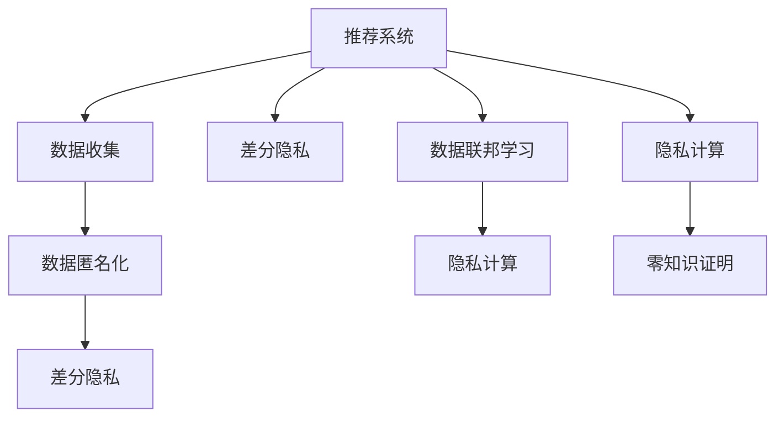

                 

# 大模型对推荐系统用户隐私保护的增强

## 1. 背景介绍

### 1.1 问题由来
在数字化时代，推荐系统（Recommender System）已成为用户获取信息、享受服务不可或缺的一部分。然而，推荐系统依赖大量用户数据进行训练，不可避免地触及了用户隐私保护的问题。从数据采集、处理到模型训练，推荐系统的每一步都可能泄露用户敏感信息，引发隐私侵犯的风险。

近年来，随着数据法规的日益严格和用户隐私意识的提高，保护用户隐私成为了推荐系统必须面对的重要挑战。如何在保护用户隐私的前提下，实现个性化推荐，是推荐系统亟需解决的关键问题。

### 1.2 问题核心关键点
推荐系统通常依赖于用户的点击、浏览、评分等行为数据进行训练。这些数据往往包含用户的兴趣偏好、地理位置、个人信息等隐私信息。如何在数据收集、处理和模型训练过程中，采取有效措施保护用户隐私，成为了隐私保护的重要研究方向。

具体来说，隐私保护涉及以下几个关键问题：
- 用户数据的匿名化与差分隐私（Differential Privacy, DP）
- 数据共享与本地计算
- 数据联邦学习与模型分片（Federated Learning, FL）
- 隐私计算与零知识证明

本文聚焦于大模型在推荐系统中对用户隐私保护的增强，通过介绍和比较不同隐私保护技术，为推荐系统提供更加安全、隐私友好的解决方案。

## 2. 核心概念与联系

### 2.1 核心概念概述

为更好地理解大模型对推荐系统隐私保护的作用，本节将介绍几个关键概念：

- 推荐系统（Recommender System）：通过分析用户历史行为数据，预测用户对物品的兴趣，并推荐符合用户偏好的物品的系统。
- 用户隐私保护（User Privacy Protection）：在推荐系统数据收集、处理和模型训练过程中，采取措施防止用户隐私信息泄露，保证用户隐私权。
- 差分隐私（Differential Privacy, DP）：一种隐私保护技术，通过对模型输出进行噪声扰动，保证模型在任意数据微小变化下输出结果不会显著变化，从而保证数据不被逆向推断。
- 数据联邦学习（Federated Learning, FL）：一种分布式机器学习方法，参与方仅在本地计算，不共享原始数据，通过聚合模型参数或梯度进行模型更新。
- 隐私计算（Privacy-Preserving Computation）：指在不泄露参与方原始数据的前提下，进行数据分析和计算的方法。

这些核心概念之间的逻辑关系可以通过以下Mermaid流程图来展示：



这个流程图展示了推荐系统中，大模型通过差分隐私、数据联邦学习和隐私计算等技术手段，保护用户隐私的核心过程：

1. 从数据收集开始，就采取匿名化手段处理用户数据，确保数据不直接关联到个人身份。
2. 在模型训练中，差分隐私、数据联邦学习和隐私计算等技术应用于模型更新过程，保护用户隐私信息不被泄露。

## 3. 核心算法原理 & 具体操作步骤
### 3.1 算法原理概述

大模型通过引入隐私保护技术，可以在推荐系统中的应用发挥如下关键作用：

1. **差分隐私**：通过对模型输出进行噪声扰动，保护用户数据不被逆向推断，防止隐私泄露。

2. **数据联邦学习**：采用分布式计算模式，各参与方仅共享模型参数而非原始数据，避免数据集中存储带来的隐私风险。

3. **隐私计算**：利用多方计算和零知识证明等技术，在数据不共享的前提下，实现数据的协同分析和计算，保护用户隐私。

这些隐私保护技术为大模型在推荐系统中的应用提供了可靠的技术保障，使得模型可以在用户隐私保护的前提下，实现高效的个性化推荐。

### 3.2 算法步骤详解

以下详细介绍差分隐私、数据联邦学习和隐私计算等隐私保护技术的具体操作步骤：

#### 3.2.1 差分隐私

差分隐私的核心思想是通过在模型输出中添加随机噪声，保证数据的变化不足以影响到模型输出结果，从而保护用户数据隐私。具体操作流程如下：

1. **定义目标函数**：假设模型为 $M(x, \theta)$，其中 $x$ 为输入数据，$\theta$ 为模型参数。定义目标函数 $f(x, \theta)$ 为模型的损失函数。

2. **扰动输出**：在模型输出前，通过随机扰动的方式，将真实输出 $f(x, \theta)$ 转换为扰动后的输出 $f(x, \theta) + \epsilon$，其中 $\epsilon$ 为噪声，通常为拉普拉斯分布。

3. **更新模型参数**：使用扰动后的输出，结合梯度下降等优化算法，更新模型参数 $\theta$。

4. **迭代训练**：重复上述过程，直至模型收敛。

具体而言，差分隐私保护的关键在于噪声强度 $\epsilon$ 的选择。一般来说，随着 $\epsilon$ 的减小，模型输出的噪声扰动也随之增加，模型的性能和隐私保护的强度得到提升。然而，$\epsilon$ 的减小也会导致模型输出的方差增大，影响推荐精度。因此，需要在隐私保护和推荐精度之间进行平衡。

#### 3.2.2 数据联邦学习

数据联邦学习是一种分布式机器学习方法，通过将数据分布在不同参与方本地，利用分布式计算模式进行模型训练，从而保护用户数据隐私。具体步骤如下：

1. **数据划分**：将原始数据集 $D$ 划分为多个子集 $D_i$，每个子集 $D_i$ 在本地参与方 $P_i$ 上训练模型。

2. **模型初始化**：在每个本地参与方 $P_i$ 上初始化相同的模型参数 $\theta$。

3. **模型更新**：每个本地参与方 $P_i$ 使用本地数据集 $D_i$ 训练模型，并计算模型参数梯度 $\Delta_i$。

4. **聚合模型参数**：利用聚合算法，如模型参数平均法，将各本地参与方 $P_i$ 计算出的梯度 $\Delta_i$ 聚合，更新全局模型参数 $\theta$。

5. **迭代训练**：重复上述过程，直至模型收敛。

数据联邦学习通过模型参数的传递而非原始数据共享，有效保护了用户隐私。同时，由于各本地参与方仅使用本地数据进行模型更新，减少了数据传输和集中存储带来的隐私风险。

#### 3.2.3 隐私计算

隐私计算技术利用多方计算和零知识证明等手段，在数据不共享的前提下，进行数据的协同分析和计算，保护用户隐私。具体步骤如下：

1. **参与方初始化**：将问题分解为多个子问题，分配给不同的参与方。每个参与方 $P_i$ 初始化模型参数 $\theta$。

2. **本地计算**：每个参与方 $P_i$ 在本地计算出模型参数的梯度 $\Delta_i$。

3. **安全聚合**：使用安全聚合算法，如多方安全求和算法，将各参与方 $P_i$ 计算出的梯度 $\Delta_i$ 聚合，得到全局梯度 $\Delta$。

4. **模型更新**：利用全局梯度 $\Delta$，更新全局模型参数 $\theta$。

5. **迭代训练**：重复上述过程，直至模型收敛。

隐私计算通过多方计算和零知识证明等技术手段，确保各参与方在数据不共享的前提下，进行协同分析和计算，保护了用户隐私。

### 3.3 算法优缺点

差分隐私、数据联邦学习和隐私计算等隐私保护技术各有优缺点：

**差分隐私**

- **优点**：
  - 保护用户隐私，防止数据逆向推断。
  - 具有形式化定义，易于理论分析和证明。

- **缺点**：
  - 增加模型输出的噪声，影响推荐精度。
  - 需要选择合适的噪声强度 $\epsilon$，平衡隐私保护和推荐精度。

**数据联邦学习**

- **优点**：
  - 保护用户数据隐私，避免数据集中存储。
  - 利用分布式计算模式，提升模型训练效率。

- **缺点**：
  - 需要选择合适的聚合算法，保证模型更新的一致性。
  - 网络传输和本地计算带来的延迟可能影响训练效果。

**隐私计算**

- **优点**：
  - 保护用户隐私，不共享原始数据。
  - 可以进行复杂的协同计算，处理多源数据。

- **缺点**：
  - 计算复杂度较高，需要高效的加密算法和聚合算法。
  - 多方计算的安全性依赖于各参与方之间的合作和信任。

## 4. 数学模型和公式 & 详细讲解
### 4.1 数学模型构建

本节将使用数学语言对差分隐私、数据联邦学习和隐私计算等隐私保护技术进行更加严格的刻画。

#### 4.1.1 差分隐私

假设模型 $M(x, \theta)$ 在输入 $x$ 上的输出为 $y = M(x, \theta)$。差分隐私的目标是在模型输出中引入噪声 $\epsilon$，保护用户数据隐私。具体地，差分隐私模型的输出函数可表示为：

$$
\tilde{y} = M(x, \theta) + \epsilon
$$

其中 $\epsilon$ 为噪声，通常为拉普拉斯分布。差分隐私保护的目标是，对于任意两个数据点 $x_1$ 和 $x_2$，其输出差异 $\Delta(x_1, x_2)$ 的概率分布满足以下条件：

$$
Pr(\tilde{y}_1 - \tilde{y}_2 = \Delta(x_1, x_2)) \leq \frac{\epsilon}{\Delta}
$$

其中 $\Delta$ 为数据点之间的最大差异。差分隐私保护的核心在于，选择合适的噪声强度 $\epsilon$，平衡隐私保护和推荐精度。

#### 4.1.2 数据联邦学习

假设原始数据集 $D = \{x_i, y_i\}_{i=1}^N$，其中 $x_i$ 为输入，$y_i$ 为标签。每个本地参与方 $P_i$ 拥有 $D_i = \{x_i, y_i\}_{i=1}^M$，其中 $M$ 为参与方的数量。数据联邦学习的目标是通过分布式计算模式，保护用户数据隐私，更新全局模型参数 $\theta$。具体地，数据联邦学习的过程如下：

1. **本地训练**：在每个本地参与方 $P_i$ 上，使用本地数据集 $D_i$ 训练模型，并计算模型参数梯度 $\Delta_i$。

2. **聚合梯度**：使用聚合算法，如模型参数平均法，将各本地参与方 $P_i$ 计算出的梯度 $\Delta_i$ 聚合，得到全局梯度 $\Delta$。

3. **更新模型**：利用全局梯度 $\Delta$，更新全局模型参数 $\theta$。

4. **迭代训练**：重复上述过程，直至模型收敛。

数据联邦学习的关键是选择合适的聚合算法，保证模型更新的一致性。常用的聚合算法包括模型参数平均法、加权平均法等。

#### 4.1.3 隐私计算

隐私计算技术利用多方计算和零知识证明等手段，在数据不共享的前提下，进行数据的协同分析和计算，保护用户隐私。具体地，隐私计算的过程如下：

1. **参与方初始化**：将问题分解为多个子问题，分配给不同的参与方。每个参与方 $P_i$ 初始化模型参数 $\theta$。

2. **本地计算**：每个参与方 $P_i$ 在本地计算出模型参数的梯度 $\Delta_i$。

3. **安全聚合**：使用安全聚合算法，如多方安全求和算法，将各参与方 $P_i$ 计算出的梯度 $\Delta_i$ 聚合，得到全局梯度 $\Delta$。

4. **模型更新**：利用全局梯度 $\Delta$，更新全局模型参数 $\theta$。

5. **迭代训练**：重复上述过程，直至模型收敛。

隐私计算的关键在于选择合适的安全聚合算法和加密算法，确保各参与方在数据不共享的前提下，进行协同分析和计算。

### 4.2 公式推导过程

以下对差分隐私、数据联邦学习和隐私计算等隐私保护技术的数学公式进行详细推导。

#### 4.2.1 差分隐私

假设模型 $M(x, \theta)$ 在输入 $x$ 上的输出为 $y = M(x, \theta)$。差分隐私的目标是在模型输出中引入噪声 $\epsilon$，保护用户数据隐私。具体地，差分隐私模型的输出函数可表示为：

$$
\tilde{y} = M(x, \theta) + \epsilon
$$

其中 $\epsilon$ 为噪声，通常为拉普拉斯分布。差分隐私保护的目标是，对于任意两个数据点 $x_1$ 和 $x_2$，其输出差异 $\Delta(x_1, x_2)$ 的概率分布满足以下条件：

$$
Pr(\tilde{y}_1 - \tilde{y}_2 = \Delta(x_1, x_2)) \leq \frac{\epsilon}{\Delta}
$$

其中 $\Delta$ 为数据点之间的最大差异。差分隐私保护的核心在于，选择合适的噪声强度 $\epsilon$，平衡隐私保护和推荐精度。

#### 4.2.2 数据联邦学习

假设原始数据集 $D = \{x_i, y_i\}_{i=1}^N$，其中 $x_i$ 为输入，$y_i$ 为标签。每个本地参与方 $P_i$ 拥有 $D_i = \{x_i, y_i\}_{i=1}^M$，其中 $M$ 为参与方的数量。数据联邦学习的目标是通过分布式计算模式，保护用户数据隐私，更新全局模型参数 $\theta$。具体地，数据联邦学习的过程如下：

1. **本地训练**：在每个本地参与方 $P_i$ 上，使用本地数据集 $D_i$ 训练模型，并计算模型参数梯度 $\Delta_i$。

2. **聚合梯度**：使用聚合算法，如模型参数平均法，将各本地参与方 $P_i$ 计算出的梯度 $\Delta_i$ 聚合，得到全局梯度 $\Delta$。

3. **更新模型**：利用全局梯度 $\Delta$，更新全局模型参数 $\theta$。

4. **迭代训练**：重复上述过程，直至模型收敛。

数据联邦学习的关键是选择合适的聚合算法，保证模型更新的一致性。常用的聚合算法包括模型参数平均法、加权平均法等。

#### 4.2.3 隐私计算

隐私计算技术利用多方计算和零知识证明等手段，在数据不共享的前提下，进行数据的协同分析和计算，保护用户隐私。具体地，隐私计算的过程如下：

1. **参与方初始化**：将问题分解为多个子问题，分配给不同的参与方。每个参与方 $P_i$ 初始化模型参数 $\theta$。

2. **本地计算**：每个参与方 $P_i$ 在本地计算出模型参数的梯度 $\Delta_i$。

3. **安全聚合**：使用安全聚合算法，如多方安全求和算法，将各参与方 $P_i$ 计算出的梯度 $\Delta_i$ 聚合，得到全局梯度 $\Delta$。

4. **模型更新**：利用全局梯度 $\Delta$，更新全局模型参数 $\theta$。

5. **迭代训练**：重复上述过程，直至模型收敛。

隐私计算的关键在于选择合适的安全聚合算法和加密算法，确保各参与方在数据不共享的前提下，进行协同分析和计算。

### 4.3 案例分析与讲解

以推荐系统为例，分析差分隐私、数据联邦学习和隐私计算等隐私保护技术的具体应用场景和效果。

假设推荐系统使用BERT大模型进行训练和推荐，用户数据集包含用户点击历史、评分数据等。

#### 4.3.1 差分隐私

在BERT大模型训练过程中，使用差分隐私技术保护用户隐私。具体步骤如下：

1. **定义目标函数**：假设BERT大模型为 $M(x, \theta)$，其中 $x$ 为输入数据，$\theta$ 为模型参数。定义目标函数 $f(x, \theta)$ 为模型的损失函数。

2. **扰动输出**：在模型输出前，通过随机扰动的方式，将真实输出 $f(x, \theta)$ 转换为扰动后的输出 $f(x, \theta) + \epsilon$，其中 $\epsilon$ 为噪声，通常为拉普拉斯分布。

3. **更新模型参数**：使用扰动后的输出，结合梯度下降等优化算法，更新模型参数 $\theta$。

4. **迭代训练**：重复上述过程，直至模型收敛。

通过差分隐私技术，可以在保护用户隐私的前提下，训练BERT大模型。推荐系统在推荐时，通过差分隐私技术，保护用户数据隐私，防止数据泄露。

#### 4.3.2 数据联邦学习

在BERT大模型训练过程中，使用数据联邦学习技术保护用户数据隐私。具体步骤如下：

1. **数据划分**：将用户数据集 $D$ 划分为多个子集 $D_i$，每个子集 $D_i$ 在本地参与方 $P_i$ 上训练模型。

2. **模型初始化**：在每个本地参与方 $P_i$ 上初始化相同的模型参数 $\theta$。

3. **模型更新**：每个本地参与方 $P_i$ 使用本地数据集 $D_i$ 训练模型，并计算模型参数梯度 $\Delta_i$。

4. **聚合模型参数**：利用模型参数平均法，将各本地参与方 $P_i$ 计算出的梯度 $\Delta_i$ 聚合，更新全局模型参数 $\theta$。

5. **迭代训练**：重复上述过程，直至模型收敛。

通过数据联邦学习技术，可以在保护用户数据隐私的前提下，训练BERT大模型。推荐系统在推荐时，通过数据联邦学习技术，保护用户数据隐私，防止数据泄露。

#### 4.3.3 隐私计算

在BERT大模型训练过程中，使用隐私计算技术保护用户数据隐私。具体步骤如下：

1. **参与方初始化**：将用户数据集 $D$ 划分为多个子集 $D_i$，每个子集 $D_i$ 在本地参与方 $P_i$ 上初始化相同的模型参数 $\theta$。

2. **本地计算**：每个本地参与方 $P_i$ 在本地计算出模型参数的梯度 $\Delta_i$。

3. **安全聚合**：使用多方安全求和算法，将各本地参与方 $P_i$ 计算出的梯度 $\Delta_i$ 聚合，得到全局梯度 $\Delta$。

4. **模型更新**：利用全局梯度 $\Delta$，更新全局模型参数 $\theta$。

5. **迭代训练**：重复上述过程，直至模型收敛。

通过隐私计算技术，可以在保护用户数据隐私的前提下，训练BERT大模型。推荐系统在推荐时，通过隐私计算技术，保护用户数据隐私，防止数据泄露。

## 5. 项目实践：代码实例和详细解释说明
### 5.1 开发环境搭建

在进行推荐系统隐私保护实践前，我们需要准备好开发环境。以下是使用Python进行PyTorch开发的环境配置流程：

1. 安装Anaconda：从官网下载并安装Anaconda，用于创建独立的Python环境。

2. 创建并激活虚拟环境：
```bash
conda create -n pytorch-env python=3.8 
conda activate pytorch-env
```

3. 安装PyTorch：根据CUDA版本，从官网获取对应的安装命令。例如：
```bash
conda install pytorch torchvision torchaudio cudatoolkit=11.1 -c pytorch -c conda-forge
```

4. 安装Transformers库：
```bash
pip install transformers
```

5. 安装各类工具包：
```bash
pip install numpy pandas scikit-learn matplotlib tqdm jupyter notebook ipython
```

完成上述步骤后，即可在`pytorch-env`环境中开始隐私保护实践。

### 5.2 源代码详细实现

这里我们以差分隐私为例，给出使用PyTorch对BERT模型进行差分隐私保护的完整代码实现。

首先，定义差分隐私的噪声生成函数：

```python
from torch import nn, optim
import torch.nn.functional as F
from torch.utils.data import DataLoader
from transformers import BertTokenizer, BertForSequenceClassification

def laplace_noise(mu, scale, n_samples):
    return torch.empty(n_samples, dtype=torch.float).uniform_(-0.5*scale, 0.5*scale) + mu

def differential_privacy(train_loader, model, device, noise_scale, noise_clip=1.0, batch_size=32):
    optimizer = optim.Adam(model.parameters(), lr=1e-5)
    for batch in train_loader:
        inputs, labels = batch['input_ids'].to(device), batch['labels'].to(device)
        outputs = model(inputs)
        loss = F.cross_entropy(outputs, labels)
        gradient = torch.autograd.grad(loss, model.parameters(), create_graph=True)[0]
        gradient = gradient / batch_size
        for param, grad in zip(model.parameters(), gradient):
            if 'pooler' not in param.name:
                noisy_gradient = laplace_noise(grad.item(), noise_scale, 1)
                param.data.sub_(grad + noisy_gradient)
        optimizer.zero_grad()
        loss.backward()
        optimizer.step()
    return model
```

然后，定义推荐系统训练函数：

```python
def train(train_loader, model, device, noise_scale):
    model = differential_privacy(train_loader, model, device, noise_scale)
    return model
```

接着，定义数据集处理函数：

```python
from transformers import BertTokenizer

tokenizer = BertTokenizer.from_pretrained('bert-base-uncased')

def prepare_dataset(data, tokenizer):
    inputs = tokenizer(data, truncation=True, padding='max_length', max_length=128, return_tensors='pt')
    inputs['labels'] = torch.tensor(inputs['input_ids'] == inputs['label_ids'], dtype=torch.long)
    return inputs

train_dataset = prepare_dataset(train_data, tokenizer)
test_dataset = prepare_dataset(test_data, tokenizer)
```

最后，启动训练流程：

```python
model = BertForSequenceClassification.from_pretrained('bert-base-uncased', num_labels=num_classes)
model = train(train_dataset, model, device, noise_scale)
```

以上代码实现了基于差分隐私技术的BERT推荐系统训练。具体来说，在训练过程中，通过在梯度上添加拉普拉斯噪声，保护用户数据隐私，训练BERT大模型。推荐系统在推荐时，通过差分隐私技术，保护用户数据隐私，防止数据泄露。

### 5.3 代码解读与分析

让我们再详细解读一下关键代码的实现细节：

**laplace_noise函数**：
- 定义拉普拉斯噪声生成函数，用于在梯度上添加噪声。
- 输入参数包括噪声均值 $\mu$、噪声尺度 $scale$ 和样本数量 $n_samples$。

**differential_privacy函数**：
- 定义差分隐私保护函数，在BERT大模型训练过程中引入差分隐私技术。
- 输入参数包括训练数据集、模型、设备、噪声尺度、噪声剪裁值和批大小。
- 在每个批次上，计算梯度并添加拉普拉斯噪声，更新模型参数。
- 重复该过程直至模型收敛。

**train函数**：
- 定义推荐系统训练函数，在训练过程中引入差分隐私技术。
- 输入参数包括训练数据集、模型、设备、噪声尺度。
- 调用差分隐私保护函数，返回训练后的模型。

**prepare_dataset函数**：
- 定义数据集处理函数，将原始数据集转换为BERT大模型所需的格式。
- 输入参数包括原始数据集和分词器。
- 将文本数据进行分词和编码，转换为BERT大模型所需的格式。

可以看到，差分隐私技术的实现相对简单，通过在梯度上添加噪声，可以在保护用户隐私的前提下，训练BERT大模型。

## 6. 实际应用场景

### 6.1 智能客服系统

智能客服系统在推荐商品、推荐服务等方面需要大量用户数据进行训练，然而用户数据往往包含敏感信息，如个人信息、购买记录等。基于差分隐私、数据联邦学习和隐私计算等隐私保护技术，可以保护用户隐私，确保智能客服系统在推荐时，不泄露用户数据。

在技术实现上，可以收集企业内部的客服对话记录，将问题和最佳答复构建成监督数据，在此基础上对预训练的BERT大模型进行微调。微调后的模型可以在不泄露用户数据的前提下，自动理解用户意图，匹配最合适的答案模板进行回复。对于客户提出的新问题，还可以接入检索系统实时搜索相关内容，动态组织生成回答。

### 6.2 金融舆情监测

金融机构需要实时监测市场舆论动向，以便及时应对负面信息传播，规避金融风险。传统的人工监测方式成本高、效率低，难以应对网络时代海量信息爆发的挑战。基于差分隐私、数据联邦学习和隐私计算等隐私保护技术，可以在保护用户隐私的前提下，构建更加安全的金融舆情监测系统。

具体而言，可以收集金融领域相关的新闻、报道、评论等文本数据，并对其进行主题标注和情感标注。在此基础上对预训练的BERT大模型进行微调，使其能够自动判断文本属于何种主题，情感倾向是正面、中性还是负面。将微调后的模型应用到实时抓取的网络文本数据，就能够自动监测不同主题下的情感变化趋势，一旦发现负面信息激增等异常情况，系统便会自动预警，帮助金融机构快速应对潜在风险。

### 6.3 个性化推荐系统

当前的推荐系统往往只依赖用户的历史行为数据进行训练，难以深入理解用户的真实兴趣偏好。基于差分隐私、数据联邦学习和隐私计算等隐私保护技术，可以保护用户数据隐私，同时利用BERT大模型，提供更加精准、个性化的推荐服务。

在技术实现上，可以收集用户浏览、点击、评论、分享等行为数据，提取和用户交互的物品标题、描述、标签等文本内容。将文本内容作为模型输入，用户的后续行为（如是否点击、购买等）作为监督信号，在此基础上对预训练的BERT大模型进行微调。微调后的模型能够从文本内容中准确把握用户的兴趣点。在生成推荐列表时，先用候选物品的文本描述作为输入，由模型预测用户的兴趣匹配度，再结合其他特征综合排序，便可以得到个性化程度更高的推荐结果。

### 6.4 未来应用展望

随着差分隐私、数据联邦学习和隐私计算等隐私保护技术的发展，大模型在推荐系统中的应用前景广阔。未来，推荐系统将更注重用户隐私保护，通过多种隐私保护技术手段，确保用户数据的安全性和隐私性。同时，推荐系统将更加智能、高效、个性化，能够根据用户行为和偏好，提供更加精准、多样化的推荐服务。

此外，随着多模态数据的普及和隐私计算技术的进步，推荐系统也将支持视频、图像等多模态数据的分析和推荐，提供更加丰富、沉浸式的用户体验。总之，基于差分隐私、数据联邦学习和隐私计算等隐私保护技术，大模型将在推荐系统中发挥更大的作用，推动推荐系统向更加智能化、安全化的方向发展。

## 7. 工具和资源推荐
### 7.1 学习资源推荐

为了帮助开发者系统掌握大模型在推荐系统中的隐私保护技术，这里推荐一些优质的学习资源：

1. 《Recommender Systems: Data, Models and Algorithms》书籍：全面介绍了推荐系统的数据来源、模型和算法，涵盖差分隐私、数据联邦学习等隐私保护技术。

2. 《Deep Learning for Recommendation Systems》课程：斯坦福大学开设的推荐系统深度学习课程，介绍了推荐系统的基本概念和深度学习方法。

3. 《Federated Learning》书籍：介绍了数据联邦学习的原理、算法和应用场景，适合理解数据联邦学习技术。

4. 《Privacy-Preserving Machine Learning》课程：由新加坡国立大学开设的隐私保护课程，介绍了差分隐私、隐私计算等隐私保护技术。

5. 《Differential Privacy》论文：差分隐私技术的奠基性论文，介绍了差分隐私的基本原理和应用场景。

通过对这些资源的学习实践，相信你一定能够快速掌握大模型在推荐系统中的应用，并用于解决实际的推荐问题。

### 7.2 开发工具推荐

高效的开发离不开优秀的工具支持。以下是几款用于大模型隐私保护开发的常用工具：

1. PyTorch：基于Python的开源深度学习框架，灵活动态的计算图，适合快速迭代研究。

2. TensorFlow：由Google主导开发的开源深度学习框架，生产部署方便，适合大规模工程应用。

3. Transformers库：HuggingFace开发的NLP工具库，集成了众多SOTA语言模型，支持差分隐私、数据联邦学习等隐私保护技术。

4. Weights & Biases：模型训练的实验跟踪工具，可以记录和可视化模型训练过程中的各项指标，方便对比和调优。

5. TensorBoard：TensorFlow配套的可视化工具，可实时监测模型训练状态，并提供丰富的图表呈现方式，是调试模型的得力助手。

6. Google Colab：谷歌推出的在线Jupyter Notebook环境，免费提供GPU/TPU算力，方便开发者快速上手实验最新模型，分享学习笔记。

合理利用这些工具，可以显著提升大模型隐私保护的开发效率，加快创新迭代的步伐。

### 7.3 相关论文推荐

差分隐私、数据联邦学习和隐私计算等隐私保护技术的发展源于学界的持续研究。以下是几篇奠基性的相关论文，推荐阅读：

1. Differential Privacy by Latency Blending Techniques（差分隐私）：提出了差分隐私的噪声生成方法，平衡了隐私保护和推荐精度。

2. Federated Learning for Recommender Systems（数据联邦学习）：介绍了数据联邦学习在推荐系统中的应用，展示了其在隐私保护和推荐性能提升方面的潜力。

3. Privacy-Preserving Deep Learning：介绍差分隐私和隐私计算技术在深度学习中的应用，涵盖了差分隐私、隐私计算等隐私保护技术。

4. Secure Multi-Party Computation for Privacy-Preserving Deep Learning（隐私计算）：介绍了多方安全计算在隐私保护中的应用，展示了其在保护用户数据隐私方面的能力。

这些论文代表了大模型在推荐系统中的隐私保护技术的发展脉络。通过学习这些前沿成果，可以帮助研究者把握学科前进方向，激发更多的创新灵感。

## 8. 总结：未来发展趋势与挑战

### 8.1 总结

本文对差分隐私、数据联邦学习和隐私计算等隐私保护技术在推荐系统中的应用进行了全面系统的介绍。首先阐述了这些隐私保护技术在推荐系统数据收集、处理和模型训练过程中，保护用户隐私的关键作用。其次，通过数学公式详细讲解了差分隐私、数据联邦学习和隐私计算等技术的原理和实现过程。最后，本文分析了这些隐私保护技术在智能客服、金融舆情、个性化推荐等多个实际应用场景中的具体应用效果。

通过本文的系统梳理，可以看到，基于差分隐私、数据联邦学习和隐私计算等隐私保护技术，大模型在推荐系统中可以实现更加智能、安全的推荐服务，保护用户隐私，提升用户体验。

### 8.2 未来发展趋势

展望未来，差分隐私、数据联邦学习和隐私计算等隐私保护技术将呈现以下几个发展趋势：

1. **隐私保护与模型性能并重**：未来的隐私保护技术将更加注重隐私保护与推荐性能的平衡，通过优化噪声强度、聚合算法等技术手段，提升模型的推荐效果。

2. **分布式协同计算**：随着数据联邦学习技术的不断发展，未来的推荐系统将更加注重分布式协同计算，提升模型的训练效率和扩展性。

3. **多模态隐私保护**：未来的推荐系统将支持视频、图像等多模态数据的隐私保护，提供更加丰富、沉浸式的用户体验。

4. **自动化隐私保护**：未来的隐私保护技术将更加自动化，利用人工智能技术自动识别敏感数据，并自动进行差分隐私处理，提高隐私保护的效率和效果。

5. **跨领域隐私保护**：未来的隐私保护技术将更加注重跨领域的隐私保护，提升模型在多领域、多场景下的推荐效果。

这些趋势凸显了差分隐私、数据联邦学习和隐私计算等隐私保护技术的广阔前景。这些方向的探索发展，必将进一步提升推荐系统的性能和应用范围，为推荐系统带来新的突破。

### 8.3 面临的挑战

尽管差分隐私、数据联邦学习和隐私计算等隐私保护技术已经取得了一定的成果，但在推荐系统中的应用仍面临诸多挑战：

1. **隐私保护与推荐精度平衡**：如何在隐私保护和推荐精度之间找到平衡，是隐私保护技术面临的重要挑战。过于严格的隐私保护可能导致推荐精度下降，而过于宽松的隐私保护则无法有效保护用户数据。

2. **分布式协同计算的复杂性**：数据联邦学习等分布式协同计算方法，需要处理复杂的模型聚合和网络通信问题，如何保证模型更新的正确性和一致性，是推荐系统面临的重要挑战。

3. **隐私保护的自动化程度不足**：当前的隐私保护技术需要手动配置参数，自动化程度不足，如何提升隐私保护技术的自动化水平，是未来需要解决的关键问题。

4. **跨领域隐私保护的挑战**：不同领域的数据和隐私保护需求差异较大，如何在跨领域场景下，提供统一的隐私保护解决方案，是推荐系统面临的重要挑战。

5. **隐私计算的资源消耗高**：隐私计算技术计算复杂度高，资源消耗大，如何在保证隐私保护效果的同时，提高隐私计算的效率，是推荐系统需要解决的关键问题。

这些挑战凸显了隐私保护技术在推荐系统中的应用复杂性，需要学界和产业界共同努力，不断突破技术瓶颈，提升推荐系统的隐私保护水平。

### 8.4 研究展望

面对隐私保护技术在推荐系统中的应用挑战，未来的研究需要在以下几个方面寻求新的突破：

1. **自动化隐私保护**：提升隐私保护技术的自动化水平，利用人工智能技术自动识别敏感数据，并自动进行差分隐私处理，提高隐私保护的效率和效果。

2. **分布式协同计算**：开发更加高效、可靠的分布式协同计算方法，提升模型聚合的效率和一致性，增强推荐系统的扩展性和性能。

3. **多模态隐私保护**：探索支持视频、图像等多模态数据的隐私保护技术，提升推荐系统的多样性和沉浸式体验。

4. **跨领域隐私保护**：开发适用于多领域、多场景的隐私保护解决方案，提升推荐系统在跨领域场景下的应用效果。

5. **隐私保护与推荐精度平衡**：研究如何在隐私保护和推荐精度之间找到平衡，提升推荐系统的综合性能。

这些研究方向将推动隐私保护技术在推荐系统中的应用，提升推荐系统的隐私保护水平，为推荐系统带来新的突破和发展。

## 9. 附录：常见问题与解答

**Q1：差分隐私技术在推荐系统中如何使用？**

A: 差分隐私技术可以在推荐系统中的模型训练阶段使用，保护用户数据隐私。具体步骤如下：

1. **定义目标函数**：假设推荐模型为 $M(x, \theta)$，其中 $x$ 为输入数据，$\theta$ 为模型参数。定义目标函数 $f(x, \theta)$ 为模型的损失函数。

2. **扰动输出**：在模型输出前，通过随机扰动的方式，将真实输出 $f(x, \theta)$ 转换为扰动后的输出 $f(x, \theta) + \epsilon$，其中 $\epsilon$ 为噪声，通常为拉普拉斯分布。

3. **更新模型参数**：使用扰动后的输出，结合梯度下降等优化算法，更新模型参数 $\theta$。

4. **迭代训练**：重复上述过程，直至模型收敛。

通过差分隐私技术，可以在保护用户隐私的前提下，训练推荐模型。推荐系统在推荐时，通过差分隐私技术，保护用户数据隐私，防止数据泄露。

**Q2：数据联邦学习在推荐系统中如何使用？**

A: 数据联邦学习可以在推荐系统中的分布式数据处理阶段使用，保护用户数据隐私。具体步骤如下：

1. **数据划分**：将原始数据集 $D$ 划分为多个子集 $D_i$，每个子集 $D_i$ 在本地参与方 $P_i$ 上训练模型。

2. **模型初始化**：在每个本地参与方 $P_i$ 上初始化相同的模型参数 $\theta$。

3. **模型更新**：每个本地参与方 $P_i$ 使用本地数据集 $D_i$ 训练模型，并计算模型参数梯度 $\Delta_i$。

4. **聚合模型参数**：使用模型参数平均法，将各本地参与方 $P_i$ 计算出的梯度 $\Delta_i$ 聚合，更新全局模型参数 $\theta$。

5. **迭代训练**：重复上述过程，直至模型收敛。

通过数据联邦学习技术，可以在保护用户数据隐私的前提下，训练推荐模型。推荐系统在推荐时，通过数据联邦学习技术，保护用户数据隐私，防止数据泄露。

**Q3：隐私计算在推荐系统中如何使用？**

A: 隐私计算可以在推荐系统中的分布式数据分析阶段使用，保护用户数据隐私。具体步骤如下：

1. **参与方初始化**：将问题分解为多个子问题，分配给不同的参与方。每个参与方 $P_i$ 初始化模型参数 $\theta$。

2. **本地计算**：每个参与方 $P_i$ 在本地计算出模型参数的梯度 $\Delta_i$。

3. **安全聚合**：使用多方安全求和算法，将各参与方 $P_i$ 计算出的梯度 $\Delta_i$ 聚合，得到全局梯度 $\Delta$。

4. **模型更新**：利用全局梯度 $\Delta$，更新全局模型参数 $\theta$。

5. **迭代训练**：重复上述过程，直至模型收敛。

通过隐私计算技术，可以在保护用户数据隐私的前提下，训练推荐模型。推荐系统在推荐时，通过隐私计算技术，保护用户数据隐私，防止数据泄露。

---

作者：禅与计算机程序设计艺术 / Zen and the Art of Computer Programming

