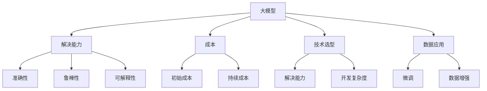

                 

# 大模型应用的关键：AI解决问题的能力优先，价格其次

> 关键词：大模型, 人工智能, 解决方案, 能力优先, 价格, 性能评估, 技术选型, 数据应用

## 1. 背景介绍

在人工智能领域，大模型(如BERT、GPT等)的崛起，标志着一个新的时代已经开始。这些大模型通过在海量数据上预训练，具备了强大的语言理解和生成能力，可以用于各种NLP任务，如问答、文本分类、命名实体识别等。然而，尽管大模型的应用潜力巨大，但其高昂的构建和运行成本，使得许多企业和组织难以普及。因此，如何平衡大模型的能力与价格，成为AI应用的重要课题。本文将从AI解决问题的能力出发，探讨大模型应用的关键要素，帮助用户选择合适的大模型，并制定有效的应用策略。

## 2. 核心概念与联系

### 2.1 核心概念概述

为了深入理解大模型应用的关键要素，首先需要对一些核心概念进行定义和解释：

- **大模型(Large Model)**：指具有超过10亿个参数的大型深度学习模型，如BERT、GPT等。这些模型通过在大规模无标签数据上预训练，具备强大的语言理解和生成能力。

- **解决能力**：指模型处理特定任务的能力，包括准确性、鲁棒性、可解释性等指标。解决能力越强，模型的应用范围和效果越好。

- **成本**：包括构建模型的初始成本和运行模型的持续成本，如硬件、软件、数据标注等。成本的高低直接影响模型的普及程度和商业可行性。

- **技术选型**：指在多个大模型中选择最适合当前应用场景的模型，需要综合考虑模型的解决能力、成本、开发复杂度等因素。

- **数据应用**：指在已有的大模型基础上，通过微调、数据增强等技术，针对特定任务进行优化，提高模型性能。

这些概念之间的逻辑关系可以通过以下Mermaid流程图来展示：



这个流程图展示了各概念之间的相互关系：

1. 大模型提供解决能力，但同时也带来成本。
2. 成本高低直接影响技术选型和数据应用。
3. 解决能力是选择模型的主要依据，但也需要考虑成本和技术复杂度。
4. 数据应用可以进一步提升模型的解决能力，但需要额外的数据标注和计算资源。

## 3. 核心算法原理 & 具体操作步骤

### 3.1 算法原理概述

基于大模型的应用，本质上是一个将解决能力、成本和技术选型相结合的过程。以下将详细探讨其核心算法原理和操作步骤。

大模型的核心算法包括预训练和微调两步。预训练在大规模无标签数据上完成，使模型学习到语言表示的知识。微调则在特定任务的数据集上进行，通过有监督学习优化模型的任务特定能力。

### 3.2 算法步骤详解

大模型应用的关键步骤如下：

**Step 1: 选择合适的模型**

- 根据应用场景选择合适的预训练模型。如BERT适用于问答、分类任务，GPT适用于生成任务。
- 考虑模型的解决能力、成本、开发复杂度等因素。

**Step 2: 数据准备**

- 收集任务相关的标注数据，并进行预处理。
- 确保数据质量和多样性，避免过拟合。

**Step 3: 微调模型**

- 根据任务类型设计适当的任务适配层。
- 选择合适的优化器和学习率，进行模型微调。

**Step 4: 评估与部署**

- 在测试集上评估微调后的模型性能。
- 将模型部署到实际应用中，进行在线推理。

**Step 5: 持续优化**

- 根据应用反馈和新数据，持续优化模型参数和训练策略。

### 3.3 算法优缺点

大模型应用具有以下优点：

- **强大的解决能力**：大模型通过预训练和微调，具备处理复杂语言任务的能力。
- **可移植性强**：大模型可用于多种NLP任务，适用于不同领域和场景。

同时，也存在一些缺点：

- **高昂的成本**：构建和运行大模型的成本较高，包括硬件、软件和数据标注等。
- **需要大量数据**：微调模型需要大量的标注数据，数据获取成本高。
- **模型复杂**：大模型的结构和参数众多，开发和调试复杂。

### 3.4 算法应用领域

大模型应用广泛，适用于各种NLP任务，如文本分类、命名实体识别、机器翻译、问答系统等。以下是一些具体的应用场景：

- **问答系统**：使用大模型对用户输入进行理解，并给出最佳答案。如IBM Watson、百度知道等。
- **情感分析**：分析文本中的情感倾向，如品牌舆情监测、用户评论分析等。
- **机器翻译**：将一种语言翻译成另一种语言，如谷歌翻译、有道翻译等。
- **文本摘要**：将长篇文本压缩成简短的摘要，如Clarifai、WuxiAI等。

## 4. 数学模型和公式 & 详细讲解 & 举例说明

### 4.1 数学模型构建

大模型通常使用Transformer架构，其数学模型如下：

设输入序列为 $x_1, x_2, ..., x_n$，输出序列为 $y_1, y_2, ..., y_n$，则模型可以表示为：

$$
y_i = f(x_1, x_2, ..., x_n; \theta)
$$

其中 $f$ 表示Transformer模型的前向传播过程，$\theta$ 为模型的参数。

### 4.2 公式推导过程

以BERT模型为例，其微调过程的损失函数可以表示为：

$$
\mathcal{L}(\theta) = \sum_{i=1}^N \ell(y_i, \hat{y_i})
$$

其中 $\ell$ 表示损失函数，如交叉熵损失。$\hat{y_i}$ 为模型对样本 $x_i$ 的预测输出，$y_i$ 为样本的真实标签。

### 4.3 案例分析与讲解

以情感分析为例，假设输入文本为 "I love this movie. It's amazing!"，标签为正面情感，则模型的预测输出 $\hat{y_i}$ 需要尽可能接近1。假设模型的预测输出为0.8，则损失函数值为：

$$
\ell(1, 0.8) = -log(0.8)
$$

在优化过程中，模型会不断调整参数，使得损失函数值最小化，即 $\hat{y_i}$ 逼近真实标签 $y_i$。

## 5. 项目实践：代码实例和详细解释说明

### 5.1 开发环境搭建

在开始项目实践前，需要先搭建好开发环境。以下是使用PyTorch和Transformers库搭建环境的详细步骤：

1. 安装Anaconda：从官网下载并安装Anaconda，用于创建独立的Python环境。
2. 创建并激活虚拟环境：
```bash
conda create -n pytorch-env python=3.8 
conda activate pytorch-env
```
3. 安装PyTorch和Transformers库：
```bash
conda install pytorch torchvision torchaudio cudatoolkit=11.1 -c pytorch -c conda-forge
pip install transformers
```
4. 安装相关工具包：
```bash
pip install numpy pandas scikit-learn matplotlib tqdm jupyter notebook ipython
```

### 5.2 源代码详细实现

以下以情感分析任务为例，给出使用BERT模型进行微调的PyTorch代码实现。

```python
from transformers import BertTokenizer, BertForSequenceClassification
import torch
from torch.utils.data import DataLoader, Dataset
from tqdm import tqdm
from sklearn.metrics import accuracy_score

# 定义数据集
class SentimentDataset(Dataset):
    def __init__(self, texts, labels):
        self.texts = texts
        self.labels = labels
        self.tokenizer = BertTokenizer.from_pretrained('bert-base-uncased')

    def __len__(self):
        return len(self.texts)

    def __getitem__(self, idx):
        text = self.texts[idx]
        label = self.labels[idx]
        encoding = self.tokenizer(text, truncation=True, padding='max_length')
        return {'input_ids': encoding['input_ids'], 'attention_mask': encoding['attention_mask'], 'labels': label}

# 准备数据
texts = ['I love this movie. It's amazing!', 'This movie is terrible. I hate it!', 'This movie is so-so.', 'This movie is the best I have ever seen.']
labels = [1, 0, 2, 1]

dataset = SentimentDataset(texts, labels)

# 定义模型
model = BertForSequenceClassification.from_pretrained('bert-base-uncased', num_labels=3)

# 训练模型
optimizer = torch.optim.Adam(model.parameters(), lr=2e-5)
device = torch.device('cuda') if torch.cuda.is_available() else torch.device('cpu')
model.to(device)

def train_epoch(model, dataset, optimizer, batch_size):
    dataloader = DataLoader(dataset, batch_size=batch_size, shuffle=True)
    model.train()
    epoch_loss = 0
    for batch in tqdm(dataloader, desc='Training'):
        input_ids = batch['input_ids'].to(device)
        attention_mask = batch['attention_mask'].to(device)
        labels = batch['labels'].to(device)
        model.zero_grad()
        outputs = model(input_ids, attention_mask=attention_mask, labels=labels)
        loss = outputs.loss
        epoch_loss += loss.item()
        loss.backward()
        optimizer.step()
    return epoch_loss / len(dataloader)

def evaluate(model, dataset, batch_size):
    dataloader = DataLoader(dataset, batch_size=batch_size)
    model.eval()
    preds, labels = [], []
    with torch.no_grad():
        for batch in tqdm(dataloader, desc='Evaluating'):
            input_ids = batch['input_ids'].to(device)
            attention_mask = batch['attention_mask'].to(device)
            labels = batch['labels'].to(device)
            outputs = model(input_ids, attention_mask=attention_mask)
            preds.append(outputs.argmax(dim=1).tolist())
            labels.append(labels.tolist())
    print('Accuracy:', accuracy_score(labels, preds))

# 训练模型
epochs = 5
batch_size = 16

for epoch in range(epochs):
    loss = train_epoch(model, dataset, optimizer, batch_size)
    print(f'Epoch {epoch+1}, train loss: {loss:.3f}')
    evaluate(model, dataset, batch_size)
```

### 5.3 代码解读与分析

代码中定义了一个自定义的 `SentimentDataset` 类，用于加载和预处理情感分析任务的数据集。在模型定义中，使用了 `BertForSequenceClassification`，该模型为BERT模型的多标签分类版本，适用于情感分析任务。在训练和评估过程中，使用了 `Adam` 优化器和交叉熵损失函数。

代码中的 `train_epoch` 函数实现了单轮训练过程，包括前向传播、计算损失、反向传播和参数更新。`evaluate` 函数实现了模型在测试集上的评估，计算准确率等指标。通过不断的迭代训练和评估，模型能够逐步提升解决能力，并在实际应用中发挥作用。

## 6. 实际应用场景

### 6.4 未来应用展望

随着大模型技术的发展，其在更多场景中的应用前景广阔。未来，大模型将与多模态数据、因果推理、强化学习等前沿技术进行深度融合，提升解决能力，降低成本。以下是一些具体的应用场景：

- **医疗领域**：用于医学文献的文本分类、疾病预测、患者情绪监测等。通过整合医疗领域的知识图谱和规则库，提升模型的解决能力。
- **金融领域**：用于舆情监测、风险预警、客户行为分析等。结合金融领域的金融知识库和算法，构建智能化的金融系统。
- **智能客服**：用于客户对话生成、情感分析、意图识别等。通过不断的训练和优化，提升客服系统的智能化水平。
- **智能推荐**：用于推荐系统中的用户画像建模、物品相似度计算等。通过整合推荐系统中的用户行为数据和知识库，提升推荐效果。

未来，大模型将在更多领域发挥重要作用，成为推动各行业数字化转型的重要工具。

## 7. 工具和资源推荐

### 7.1 学习资源推荐

为了深入学习大模型应用的关键要素，推荐一些优质的学习资源：

1. 《深度学习》课程（Coursera）：由吴恩达教授讲授，涵盖了深度学习的基本概念和算法，适合初学者入门。
2. 《自然语言处理综论》（NLP综论）：清华大学讲授的NLP综合课程，涵盖NLP的各个方向，适合进阶学习。
3. 《Transformer从原理到实践》系列博文：由大模型技术专家撰写，深入浅出地介绍了Transformer原理和微调技术。
4. 《HuggingFace官方文档》：包含丰富的预训练模型和微调样例代码，适合开发者实践。
5. 《PyTorch官方文档》：PyTorch的详细文档，包含丰富的教程和API参考，适合开发者学习。

通过这些学习资源，可以帮助开发者深入理解大模型应用的各个要素，并熟练掌握相关技术。

### 7.2 开发工具推荐

以下是几款用于大模型应用的常用开发工具：

1. PyTorch：基于Python的深度学习框架，适合研究和大规模模型的开发。
2. TensorFlow：由Google主导开发的深度学习框架，适合大规模工程应用。
3. Transformers库：HuggingFace开发的NLP工具库，包含丰富的预训练模型和微调范式。
4. Weights & Biases：模型训练的实验跟踪工具，适合记录和可视化模型训练过程。
5. TensorBoard：TensorFlow配套的可视化工具，适合实时监测模型训练状态。

合理利用这些工具，可以显著提升大模型应用的开发效率，加速创新迭代的步伐。

### 7.3 相关论文推荐

大模型应用的发展源于学界的持续研究。以下是几篇奠基性的相关论文，推荐阅读：

1. Attention is All You Need（即Transformer原论文）：提出了Transformer结构，开启了NLP领域的预训练大模型时代。
2. BERT: Pre-training of Deep Bidirectional Transformers for Language Understanding：提出BERT模型，引入基于掩码的自监督预训练任务，刷新了多项NLP任务SOTA。
3. Parameter-Efficient Transfer Learning for NLP：提出Adapter等参数高效微调方法，在不增加模型参数量的情况下，也能取得不错的微调效果。
4. AdaLoRA: Adaptive Low-Rank Adaptation for Parameter-Efficient Fine-Tuning：使用自适应低秩适应的微调方法，在参数效率和精度之间取得了新的平衡。
5. Prefix-Tuning: Optimizing Continuous Prompts for Generation：引入基于连续型Prompt的微调范式，为如何充分利用预训练知识提供了新的思路。

这些论文代表了大模型应用的发展脉络。通过学习这些前沿成果，可以帮助研究者把握学科前进方向，激发更多的创新灵感。

## 8. 总结：未来发展趋势与挑战

### 8.1 研究成果总结

本文从大模型应用的关键要素出发，探讨了AI解决问题的能力优先，价格其次的策略。通过分析解决能力、成本和技术选型之间的关系，提出了大模型应用的可行路径。

### 8.2 未来发展趋势

展望未来，大模型应用将呈现以下几个发展趋势：

1. **解决能力增强**：大模型的预训练和微调技术将不断进步，模型的解决能力将进一步提升。
2. **成本降低**：随着硬件技术的进步和模型压缩技术的发展，大模型的构建和运行成本将逐渐降低。
3. **技术选型多样化**：根据不同应用场景，选择合适的模型和算法，提升应用效果。
4. **数据应用多样化**：结合多模态数据、因果推理、强化学习等前沿技术，提升模型的解决能力。

### 8.3 面临的挑战

尽管大模型应用前景广阔，但也面临一些挑战：

1. **高昂的初始成本**：大模型的构建需要高性能硬件和大量数据，成本较高。
2. **数据获取困难**：一些特定领域的数据获取成本较高，影响模型性能。
3. **模型复杂度高**：大模型结构复杂，开发和调试难度大。
4. **解决能力不足**：模型在特定领域的应用效果可能不佳，需要进一步优化。

### 8.4 研究展望

未来，大模型应用的研究需要在以下几个方面进行深入探索：

1. **模型压缩与优化**：通过模型压缩、参数共享等技术，降低模型复杂度，提升模型性能。
2. **数据增强与生成**：结合数据增强和生成对抗网络等技术，提升数据质量，增加模型训练数据。
3. **多模态融合**：结合视觉、语音等模态数据，提升模型的解决能力。
4. **因果推理与强化学习**：结合因果推理和强化学习，提升模型的决策能力和可解释性。

总之，大模型应用的关键在于解决能力优先，价格其次。通过不断优化模型和算法，降低成本，提升解决能力，大模型将在更多领域发挥重要作用，推动各行业数字化转型。

## 9. 附录：常见问题与解答

**Q1：大模型如何与特定任务结合？**

A: 大模型通常需要根据特定任务进行微调，即在任务数据集上重新训练或调整模型。具体步骤包括：

1. 准备标注数据集，并进行预处理。
2. 选择适当的任务适配层，如线性分类器、解码器等。
3. 设计损失函数和优化器，进行模型微调。
4. 在测试集上评估模型性能，并进行必要的调整。

**Q2：大模型在特定任务上的性能如何评估？**

A: 大模型在特定任务上的性能可以通过多种指标进行评估，如准确率、召回率、F1值、ROC-AUC等。具体步骤包括：

1. 将模型输入测试集，得到预测结果。
2. 将预测结果与真实标签进行比较，计算各项指标。
3. 根据指标结果，评估模型在特定任务上的表现，并给出改进建议。

**Q3：如何选择合适的大模型？**

A: 选择合适的大模型需要考虑多个因素，如解决能力、成本、开发复杂度等。具体步骤包括：

1. 明确应用场景和任务类型。
2. 根据任务类型选择合适的预训练模型。
3. 评估模型的解决能力，比较不同模型的性能。
4. 考虑模型成本和开发复杂度，选择最合适的模型。

**Q4：大模型的推理速度如何优化？**

A: 大模型的推理速度可以通过以下方法进行优化：

1. 模型裁剪与压缩：去除不必要的层和参数，减小模型尺寸，加快推理速度。
2. 量化加速：将浮点模型转为定点模型，压缩存储空间，提高计算效率。
3. 模型并行与分布式计算：利用分布式计算资源，加速模型推理。

总之，选择合适的大模型，并根据具体任务进行优化，可以有效提升模型的解决能力和性能，降低成本，推动大模型在各行业的广泛应用。

---

作者：禅与计算机程序设计艺术 / Zen and the Art of Computer Programming

