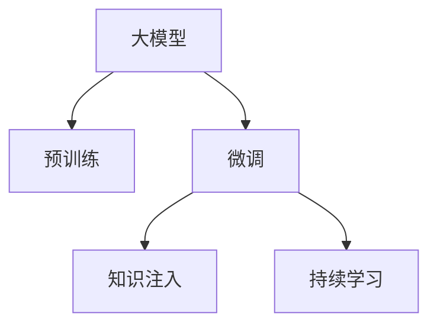

                 

## 1. 背景介绍

### 1.1 问题由来

在现代电子商务中，商品推荐系统已经成为用户购物体验的重要组成部分。传统的推荐系统依赖于用户历史行为数据，如浏览记录、购买历史等，进行基于协同过滤和矩阵分解的推荐。但随着用户基数不断扩大，用户行为数据稀疏性显著，传统推荐算法难以准确预测用户兴趣，且容易受到用户长尾行为的影响，导致推荐结果不够精准。

为了解决这些问题，近年来，大模型技术在电商平台商品推荐中得到了越来越多的应用。大模型技术，特别是基于自监督学习的大语言模型，在处理大规模无标签数据上的表现优异，拥有强大的泛化能力和表达能力，能够利用大规模无监督数据中的知识，预训练出高效、泛化能力强的特征表示，从而提升推荐系统的精度和个性化程度。

### 1.2 问题核心关键点

大模型技术在电商平台商品推荐中的核心关键点包括：

- **预训练模型**：通过大规模无标签数据预训练得到的基础语言模型，拥有强大的语言理解和生成能力，能够自动捕捉文本中的语义信息。
- **微调技术**：将预训练模型通过有标签的电商平台商品数据进行微调，适应电商平台的推荐任务，提升推荐精度。
- **知识注入**：将电商平台特定的领域知识注入到大模型中，提高模型对电商商品信息的理解和生成能力。
- **持续学习**：电商平台商品数据持续增长，大模型需要不断学习新的知识，以适应新商品和新用户。

### 1.3 问题研究意义

大模型技术在电商平台商品推荐中的应用，具有以下重要意义：

- **提升推荐精度**：通过预训练和微调，大模型能够更好地理解用户需求和商品属性，提升推荐系统的效果。
- **提高个性化推荐**：大模型能够捕捉更加丰富的语义信息，更精准地识别用户偏好，实现更个性化的推荐。
- **加速模型部署**：大模型的预训练过程能够使用大规模数据和强大的计算资源，提高模型训练和推理的速度，加速推荐系统的上线。
- **扩展应用场景**：大模型能够适应不同的电商平台场景，如多语言、多模态、个性化搜索等，提供更广泛的推荐解决方案。

## 2. 核心概念与联系

### 2.1 核心概念概述

为更好地理解大模型在电商平台商品推荐中的应用，本节将介绍几个关键概念：

- **大模型**：以自回归(如GPT)或自编码(如BERT)模型为代表的大规模预训练语言模型。通过在大规模无标签文本语料上进行预训练，学习通用的语言表示，具备强大的语言理解和生成能力。
- **预训练**：指在大规模无标签文本语料上，通过自监督学习任务训练通用语言模型的过程。常见的预训练任务包括言语建模、遮挡语言模型等。预训练使得模型学习到语言的通用表示。
- **微调**：指在预训练模型的基础上，使用电商平台商品数据进行微调，优化模型在特定任务上的性能。
- **知识注入**：将电商平台特有的领域知识，如商品标签、属性、评论等，注入到大模型中，提高模型的商品识别和生成能力。
- **持续学习**：电商平台商品数据持续增长，大模型需要不断学习新的知识，以适应新商品和新用户。

这些概念之间的逻辑关系可以通过以下Mermaid流程图来展示：



这个流程图展示了大模型在电商平台商品推荐中的应用框架，各个概念相互关联，共同构成推荐系统的核心技术。

## 3. 核心算法原理 & 具体操作步骤
### 3.1 算法原理概述

大模型在电商平台商品推荐中的应用，本质上是基于预训练-微调的技术范式。其核心思想是：将大模型视为一个强大的特征提取器，通过在电商平台商品数据上进行有监督微调，使得模型能够自动捕捉用户兴趣和商品属性，提升推荐精度。

形式化地，假设预训练模型为 $M_{\theta}$，其中 $\theta$ 为预训练得到的模型参数。给定电商平台商品数据集 $D=\{(x_i, y_i)\}_{i=1}^N$，其中 $x_i$ 为商品描述，$y_i$ 为商品标签。微调的目标是找到新的模型参数 $\hat{\theta}$，使得模型在商品推荐任务上的预测准确度最大化：

$$
\hat{\theta}=\mathop{\arg\min}_{\theta} \mathcal{L}(M_{\theta},D)
$$

其中 $\mathcal{L}$ 为交叉熵损失函数，用于衡量模型预测输出与真实标签之间的差异。

### 3.2 算法步骤详解

大模型在电商平台商品推荐中的微调过程，一般包括以下关键步骤：

**Step 1: 准备预训练模型和数据集**
- 选择合适的预训练语言模型 $M_{\theta}$，如BERT、GPT等。
- 准备电商平台商品数据集 $D=\{(x_i, y_i)\}_{i=1}^N$，包括商品描述、标签、评分、评价等数据。

**Step 2: 添加商品标签生成器**
- 在预训练模型顶层设计商品标签生成器，如分类器或解码器。
- 对于分类任务，通常在顶层添加线性分类器和交叉熵损失函数。
- 对于生成任务，通常使用语言模型的解码器输出概率分布，并以负对数似然为损失函数。

**Step 3: 设置微调超参数**
- 选择合适的优化算法及其参数，如 AdamW、SGD 等，设置学习率、批大小、迭代轮数等。
- 设置正则化技术及强度，包括权重衰减、Dropout、Early Stopping 等。
- 确定冻结预训练参数的策略，如仅微调顶层，或全部参数都参与微调。

**Step 4: 执行梯度训练**
- 将电商平台商品数据集分批次输入模型，前向传播计算损失函数。
- 反向传播计算参数梯度，根据设定的优化算法和学习率更新模型参数。
- 周期性在验证集上评估模型性能，根据性能指标决定是否触发 Early Stopping。
- 重复上述步骤直到满足预设的迭代轮数或 Early Stopping 条件。

**Step 5: 测试和部署**
- 在测试集上评估微调后模型 $M_{\hat{\theta}}$ 的性能，对比微调前后的精度提升。
- 使用微调后的模型对新商品进行推荐，集成到实际的商品推荐系统中。
- 持续收集新的商品数据，定期重新微调模型，以适应商品数据分布的变化。

### 3.3 算法优缺点

大模型在电商平台商品推荐中的应用，具有以下优点：

1. **精度高**：大模型通过大规模预训练学习到丰富的语言知识，能够捕捉商品描述中的微妙语义，提升推荐精度。
2. **泛化能力强**：预训练模型能够泛化到多种商品属性和描述，适应不同商品类别和购物场景。
3. **扩展性强**：大模型能够适应多种推荐任务，如基于文本的商品推荐、多模态推荐等。
4. **更新快**：通过微调技术，大模型可以快速适应电商平台商品数据的动态变化，持续提升推荐效果。

同时，该方法也存在一定的局限性：

1. **数据依赖**：微调效果高度依赖于电商平台商品数据的质量和数量，获取高质量标注数据的成本较高。
2. **参数量大**：预训练模型的参数量通常较大，微调时计算资源消耗较大，部署成本较高。
3. **泛化性能**：当电商平台商品数据分布差异较大时，微调的泛化性能有限，容易发生过拟合。
4. **可解释性差**：大模型作为黑盒模型，难以解释其内部推理逻辑，对用户解释和信任度较低。

尽管存在这些局限性，但就目前而言，大模型技术在电商平台商品推荐中仍然是最主流和最有效的推荐范式。未来相关研究的重点在于如何进一步降低微调对标注数据的依赖，提高模型的泛化性能和可解释性，同时兼顾参数高效微调等技术挑战。

### 3.4 算法应用领域

大模型技术在电商平台商品推荐中的应用，已经得到了广泛的应用，覆盖了几乎所有常见推荐场景，例如：

- **基于文本的商品推荐**：通过商品描述生成器，将商品描述作为输入，输出商品标签，进行相似商品推荐。
- **多模态商品推荐**：将商品图片、视频等多模态信息与商品描述结合，提升推荐精度。
- **个性化学品推荐**：通过用户行为数据和商品数据，生成个性化商品推荐列表。
- **多语言商品推荐**：利用多语言预训练模型，为全球化电商平台提供多语言的推荐服务。
- **基于知识图谱的商品推荐**：将电商平台商品数据与知识图谱结合，提升推荐结果的准确性和相关性。

除了上述这些经典任务外，大模型技术在电商平台商品推荐中的应用也在不断创新，如推荐内容生成、商品评价生成、智能客服等，为电商平台带来了新的技术突破。随着预训练模型和微调方法的不断进步，相信电商平台商品推荐系统必将在推荐精度、个性化程度和用户体验方面取得更大的突破。

## 4. 数学模型和公式 & 详细讲解  
### 4.1 数学模型构建

假设电商平台商品数据集 $D=\{(x_i, y_i)\}_{i=1}^N$，其中 $x_i$ 为商品描述，$y_i$ 为商品标签。设预训练语言模型为 $M_{\theta}$，其中 $\theta$ 为预训练得到的模型参数。

定义模型 $M_{\theta}$ 在商品描述 $x$ 上的输出为 $\hat{y}=M_{\theta}(x)$，表示模型对商品标签的预测概率分布。则交叉熵损失函数 $\ell$ 为：

$$
\ell(M_{\theta}(x),y) = -y_i\log M_{\theta}(x_i) - (1-y_i)\log (1-M_{\theta}(x_i))
$$

在数据集 $D$ 上的经验风险为：

$$
\mathcal{L}(\theta) = -\frac{1}{N}\sum_{i=1}^N \ell(M_{\theta}(x_i),y_i)
$$

微调的优化目标是最小化经验风险，即找到最优参数：

$$
\theta^* = \mathop{\arg\min}_{\theta} \mathcal{L}(\theta)
$$

在实践中，我们通常使用基于梯度的优化算法（如SGD、Adam等）来近似求解上述最优化问题。设 $\eta$ 为学习率，$\lambda$ 为正则化系数，则参数的更新公式为：

$$
\theta \leftarrow \theta - \eta \nabla_{\theta}\mathcal{L}(\theta) - \eta\lambda\theta
$$

其中 $\nabla_{\theta}\mathcal{L}(\theta)$ 为损失函数对参数 $\theta$ 的梯度，可通过反向传播算法高效计算。

### 4.2 公式推导过程

以下我们以多分类商品推荐任务为例，推导交叉熵损失函数及其梯度的计算公式。

假设模型 $M_{\theta}$ 在输入 $x$ 上的输出为 $\hat{y}=M_{\theta}(x) \in [0,1]^C$，表示对 $C$ 个类别的预测概率。真实标签 $y \in \{1,2,...,C\}$。则多分类交叉熵损失函数定义为：

$$
\ell(M_{\theta}(x),y) = -y_i\log \hat{y}_i
$$

将其代入经验风险公式，得：

$$
\mathcal{L}(\theta) = -\frac{1}{N}\sum_{i=1}^N \ell(M_{\theta}(x_i),y_i)
$$

根据链式法则，损失函数对参数 $\theta_k$ 的梯度为：

$$
\frac{\partial \mathcal{L}(\theta)}{\partial \theta_k} = -\frac{1}{N}\sum_{i=1}^N (\frac{y_i}{\hat{y}_i}-1) \frac{\partial \hat{y}_i}{\partial \theta_k}
$$

其中 $\frac{\partial \hat{y}_i}{\partial \theta_k}$ 可进一步递归展开，利用自动微分技术完成计算。

在得到损失函数的梯度后，即可带入参数更新公式，完成模型的迭代优化。重复上述过程直至收敛，最终得到适应电商平台推荐任务的最优模型参数 $\theta^*$。

## 5. 项目实践：代码实例和详细解释说明
### 5.1 开发环境搭建

在进行电商平台商品推荐系统微调实践前，我们需要准备好开发环境。以下是使用Python进行PyTorch开发的环境配置流程：

1. 安装Anaconda：从官网下载并安装Anaconda，用于创建独立的Python环境。

2. 创建并激活虚拟环境：
```bash
conda create -n pytorch-env python=3.8 
conda activate pytorch-env
```

3. 安装PyTorch：根据CUDA版本，从官网获取对应的安装命令。例如：
```bash
conda install pytorch torchvision torchaudio cudatoolkit=11.1 -c pytorch -c conda-forge
```

4. 安装Transformers库：
```bash
pip install transformers
```

5. 安装各类工具包：
```bash
pip install numpy pandas scikit-learn matplotlib tqdm jupyter notebook ipython
```

完成上述步骤后，即可在`pytorch-env`环境中开始微调实践。

### 5.2 源代码详细实现

下面我以多分类商品推荐任务为例，给出使用Transformers库对BERT模型进行微调的PyTorch代码实现。

首先，定义商品推荐任务的数据处理函数：

```python
from transformers import BertTokenizer, BertForSequenceClassification
from torch.utils.data import Dataset
import torch

class商品推荐Dataset(Dataset):
    def __init__(self, texts, labels, tokenizer, max_len=128):
        self.texts = texts
        self.labels = labels
        self.tokenizer = tokenizer
        self.max_len = max_len
        
    def __len__(self):
        return len(self.texts)
    
    def __getitem__(self, item):
        text = self.texts[item]
        label = self.labels[item]
        
        encoding = self.tokenizer(text, return_tensors='pt', max_length=self.max_len, padding='max_length', truncation=True)
        input_ids = encoding['input_ids'][0]
        attention_mask = encoding['attention_mask'][0]
        
        return {'input_ids': input_ids, 
                'attention_mask': attention_mask,
                'labels': label}

# 标签和id的映射
label2id = {'A': 0, 'B': 1, 'C': 2, 'D': 3}
id2label = {v: k for k, v in label2id.items()}

# 创建dataset
tokenizer = BertTokenizer.from_pretrained('bert-base-cased')

train_dataset =商品推荐Dataset(train_texts, train_labels, tokenizer)
dev_dataset =商品推荐Dataset(dev_texts, dev_labels, tokenizer)
test_dataset =商品推荐Dataset(test_texts, test_labels, tokenizer)
```

然后，定义模型和优化器：

```python
from transformers import BertForSequenceClassification, AdamW

model = BertForSequenceClassification.from_pretrained('bert-base-cased', num_labels=len(label2id))

optimizer = AdamW(model.parameters(), lr=2e-5)
```

接着，定义训练和评估函数：

```python
from torch.utils.data import DataLoader
from tqdm import tqdm
from sklearn.metrics import classification_report

device = torch.device('cuda') if torch.cuda.is_available() else torch.device('cpu')
model.to(device)

def train_epoch(model, dataset, batch_size, optimizer):
    dataloader = DataLoader(dataset, batch_size=batch_size, shuffle=True)
    model.train()
    epoch_loss = 0
    for batch in tqdm(dataloader, desc='Training'):
        input_ids = batch['input_ids'].to(device)
        attention_mask = batch['attention_mask'].to(device)
        labels = batch['labels'].to(device)
        model.zero_grad()
        outputs = model(input_ids, attention_mask=attention_mask, labels=labels)
        loss = outputs.loss
        epoch_loss += loss.item()
        loss.backward()
        optimizer.step()
    return epoch_loss / len(dataloader)

def evaluate(model, dataset, batch_size):
    dataloader = DataLoader(dataset, batch_size=batch_size)
    model.eval()
    preds, labels = [], []
    with torch.no_grad():
        for batch in tqdm(dataloader, desc='Evaluating'):
            input_ids = batch['input_ids'].to(device)
            attention_mask = batch['attention_mask'].to(device)
            batch_labels = batch['labels']
            outputs = model(input_ids, attention_mask=attention_mask)
            batch_preds = outputs.logits.argmax(dim=1).to('cpu').tolist()
            batch_labels = batch_labels.to('cpu').tolist()
            for pred, label in zip(batch_preds, batch_labels):
                preds.append(pred)
                labels.append(label)
                
    print(classification_report(labels, preds))
```

最后，启动训练流程并在测试集上评估：

```python
epochs = 5
batch_size = 16

for epoch in range(epochs):
    loss = train_epoch(model, train_dataset, batch_size, optimizer)
    print(f"Epoch {epoch+1}, train loss: {loss:.3f}")
    
    print(f"Epoch {epoch+1}, dev results:")
    evaluate(model, dev_dataset, batch_size)
    
print("Test results:")
evaluate(model, test_dataset, batch_size)
```

以上就是使用PyTorch对BERT进行多分类商品推荐任务微调的完整代码实现。可以看到，得益于Transformers库的强大封装，我们可以用相对简洁的代码完成BERT模型的加载和微调。

### 5.3 代码解读与分析

让我们再详细解读一下关键代码的实现细节：

**商品推荐Dataset类**：
- `__init__`方法：初始化文本、标签、分词器等关键组件。
- `__len__`方法：返回数据集的样本数量。
- `__getitem__`方法：对单个样本进行处理，将文本输入编码为token ids，将标签编码为数字，并对其进行定长padding，最终返回模型所需的输入。

**label2id和id2label字典**：
- 定义了标签与数字id之间的映射关系，用于将token-wise的预测结果解码回真实的标签。

**训练和评估函数**：
- 使用PyTorch的DataLoader对数据集进行批次化加载，供模型训练和推理使用。
- 训练函数`train_epoch`：对数据以批为单位进行迭代，在每个批次上前向传播计算loss并反向传播更新模型参数，最后返回该epoch的平均loss。
- 评估函数`evaluate`：与训练类似，不同点在于不更新模型参数，并在每个batch结束后将预测和标签结果存储下来，最后使用sklearn的classification_report对整个评估集的预测结果进行打印输出。

**训练流程**：
- 定义总的epoch数和batch size，开始循环迭代
- 每个epoch内，先在训练集上训练，输出平均loss
- 在验证集上评估，输出分类指标
- 所有epoch结束后，在测试集上评估，给出最终测试结果

可以看到，PyTorch配合Transformers库使得BERT微调的代码实现变得简洁高效。开发者可以将更多精力放在数据处理、模型改进等高层逻辑上，而不必过多关注底层的实现细节。

当然，工业级的系统实现还需考虑更多因素，如模型的保存和部署、超参数的自动搜索、更灵活的任务适配层等。但核心的微调范式基本与此类似。

## 6. 实际应用场景
### 6.1 电商平台推荐系统

大模型技术在电商平台推荐系统中，主要应用于基于文本的商品推荐、多模态推荐、个性化推荐等多个场景，能够显著提升推荐系统的精度和个性化程度，优化用户体验。

1. **基于文本的商品推荐**：利用大模型对商品描述进行语义理解，生成商品标签，进行相似商品推荐。例如，根据用户对某款商品的评价文本，利用BERT等大模型生成商品标签，找到类似商品进行推荐。

2. **多模态推荐**：将商品图片、视频等多模态信息与商品描述结合，利用大模型进行融合处理，提升推荐精度。例如，通过大模型对商品图片进行语义分析，提取商品属性和类别，结合商品描述进行推荐。

3. **个性化推荐**：通过大模型对用户行为数据进行语义理解，生成用户兴趣向量，与商品向量进行相似度计算，推荐符合用户偏好的商品。例如，利用大模型对用户浏览历史和评价进行语义分析，生成用户兴趣向量，找到相关商品进行推荐。

4. **多语言推荐**：利用多语言预训练模型，为全球化电商平台提供多语言的推荐服务。例如，针对不同语言的用户，使用相应语言版本的BERT模型进行推荐。

5. **基于知识图谱的推荐**：将电商平台商品数据与知识图谱结合，利用大模型进行融合处理，提升推荐结果的准确性和相关性。例如，利用大模型对商品数据进行语义分析，生成商品向量，与知识图谱中的实体进行相似度计算，推荐相关商品。

### 6.2 未来应用展望

随着大模型技术的不断进步，基于大模型的电商平台推荐系统将在以下几个方面取得更大的突破：

1. **推荐精度提升**：大模型能够更好地理解商品描述和用户行为，提升推荐精度和召回率。
2. **个性化推荐增强**：利用大模型进行用户行为分析和兴趣预测，实现更精准的个性化推荐。
3. **多模态融合**：将文本、图片、视频等多模态信息进行融合处理，提升推荐系统的综合能力。
4. **实时推荐**：大模型的快速推理和计算能力，能够支持实时推荐系统，提升用户体验。
5. **跨语言推荐**：利用多语言预训练模型，为全球化电商平台提供多语言的推荐服务，拓展国际市场。

随着大模型技术的不断发展，电商平台推荐系统必将在推荐精度、个性化程度和用户体验方面取得更大的突破，为电商平台带来新的商业价值。

## 7. 工具和资源推荐
### 7.1 学习资源推荐

为了帮助开发者系统掌握大模型在电商平台商品推荐中的应用，这里推荐一些优质的学习资源：

1. 《Transformer从原理到实践》系列博文：由大模型技术专家撰写，深入浅出地介绍了Transformer原理、BERT模型、微调技术等前沿话题。

2. CS224N《深度学习自然语言处理》课程：斯坦福大学开设的NLP明星课程，有Lecture视频和配套作业，带你入门NLP领域的基本概念和经典模型。

3. 《Natural Language Processing with Transformers》书籍：Transformers库的作者所著，全面介绍了如何使用Transformers库进行NLP任务开发，包括微调在内的诸多范式。

4. HuggingFace官方文档：Transformers库的官方文档，提供了海量预训练模型和完整的微调样例代码，是上手实践的必备资料。

5. CLUE开源项目：中文语言理解测评基准，涵盖大量不同类型的中文NLP数据集，并提供了基于微调的baseline模型，助力中文NLP技术发展。

通过对这些资源的学习实践，相信你一定能够快速掌握大模型在电商平台商品推荐中的应用，并用于解决实际的推荐问题。
###  7.2 开发工具推荐

高效的开发离不开优秀的工具支持。以下是几款用于大模型在电商平台商品推荐系统中开发的常用工具：

1. PyTorch：基于Python的开源深度学习框架，灵活动态的计算图，适合快速迭代研究。大部分预训练语言模型都有PyTorch版本的实现。

2. TensorFlow：由Google主导开发的开源深度学习框架，生产部署方便，适合大规模工程应用。同样有丰富的预训练语言模型资源。

3. Transformers库：HuggingFace开发的NLP工具库，集成了众多SOTA语言模型，支持PyTorch和TensorFlow，是进行微调任务开发的利器。

4. Weights & Biases：模型训练的实验跟踪工具，可以记录和可视化模型训练过程中的各项指标，方便对比和调优。与主流深度学习框架无缝集成。

5. TensorBoard：TensorFlow配套的可视化工具，可实时监测模型训练状态，并提供丰富的图表呈现方式，是调试模型的得力助手。

6. Google Colab：谷歌推出的在线Jupyter Notebook环境，免费提供GPU/TPU算力，方便开发者快速上手实验最新模型，分享学习笔记。

合理利用这些工具，可以显著提升大模型在电商平台商品推荐系统中的开发效率，加快创新迭代的步伐。

### 7.3 相关论文推荐

大模型技术在电商平台商品推荐中的应用，源于学界的持续研究。以下是几篇奠基性的相关论文，推荐阅读：

1. Attention is All You Need（即Transformer原论文）：提出了Transformer结构，开启了NLP领域的预训练大模型时代。

2. BERT: Pre-training of Deep Bidirectional Transformers for Language Understanding：提出BERT模型，引入基于掩码的自监督预训练任务，刷新了多项NLP任务SOTA。

3. Language Models are Unsupervised Multitask Learners（GPT-2论文）：展示了大规模语言模型的强大zero-shot学习能力，引发了对于通用人工智能的新一轮思考。

4. Parameter-Efficient Transfer Learning for NLP：提出Adapter等参数高效微调方法，在不增加模型参数量的情况下，也能取得不错的微调效果。

5. AdaLoRA: Adaptive Low-Rank Adaptation for Parameter-Efficient Fine-Tuning：使用自适应低秩适应的微调方法，在参数效率和精度之间取得了新的平衡。

这些论文代表了大模型技术在电商平台商品推荐中的应用研究的发展脉络。通过学习这些前沿成果，可以帮助研究者把握学科前进方向，激发更多的创新灵感。

## 8. 总结：未来发展趋势与挑战
### 8.1 总结

本文对基于大模型在电商平台商品推荐中的微调方法进行了全面系统的介绍。首先阐述了大模型和微调技术在推荐系统中的应用背景和意义，明确了微调在提升推荐精度和个性化程度方面的独特价值。其次，从原理到实践，详细讲解了微调的数学原理和关键步骤，给出了微调任务开发的完整代码实例。同时，本文还广泛探讨了微调方法在电商平台商品推荐中的应用场景，展示了微调范式的巨大潜力。此外，本文精选了微调技术的各类学习资源，力求为读者提供全方位的技术指引。

通过本文的系统梳理，可以看到，基于大模型的微调技术在电商平台商品推荐中已经成为一种主流的推荐范式，极大地提升了推荐系统的精度和个性化程度，优化了用户体验。未来，随着大模型技术的不断发展，推荐系统必将在推荐精度、个性化程度和用户体验方面取得更大的突破，为电商平台带来新的商业价值。

### 8.2 未来发展趋势

展望未来，大模型在电商平台商品推荐中的微调技术将呈现以下几个发展趋势：

1. **推荐精度提升**：大模型能够更好地理解商品描述和用户行为，提升推荐精度和召回率。
2. **个性化推荐增强**：利用大模型进行用户行为分析和兴趣预测，实现更精准的个性化推荐。
3. **多模态融合**：将文本、图片、视频等多模态信息进行融合处理，提升推荐系统的综合能力。
4. **实时推荐**：大模型的快速推理和计算能力，能够支持实时推荐系统，提升用户体验。
5. **跨语言推荐**：利用多语言预训练模型，为全球化电商平台提供多语言的推荐服务，拓展国际市场。

这些趋势凸显了大模型在电商平台推荐系统中的巨大潜力，随着大模型技术的不断发展，推荐系统必将在推荐精度、个性化程度和用户体验方面取得更大的突破，为电商平台带来新的商业价值。

### 8.3 面临的挑战

尽管大模型在电商平台推荐系统中的应用已经取得了显著成效，但在迈向更加智能化、普适化应用的过程中，它仍面临着诸多挑战：

1. **数据依赖**：微调效果高度依赖于电商平台商品数据的质量和数量，获取高质量标注数据的成本较高。如何进一步降低微调对标注数据的依赖，将是一大难题。
2. **参数量大**：预训练模型的参数量通常较大，微调时计算资源消耗较大，部署成本较高。
3. **泛化性能**：当电商平台商品数据分布差异较大时，微调的泛化性能有限，容易发生过拟合。
4. **可解释性差**：大模型作为黑盒模型，难以解释其内部推理逻辑，对用户解释和信任度较低。
5. **安全性有待保障**：预训练语言模型难免会学习到有偏见、有害的信息，通过微调传递到推荐系统，可能造成误导性、歧视性的输出，给实际应用带来安全隐患。
6. **知识注入困难**：将电商平台特有的领域知识注入到大模型中，提高模型的商品识别和生成能力，仍是一个技术挑战。

尽管存在这些挑战，但就目前而言，大模型技术在电商平台商品推荐中仍然是最主流和最有效的推荐范式。未来相关研究的重点在于如何进一步降低微调对标注数据的依赖，提高模型的泛化性能和可解释性，同时兼顾参数高效微调等技术挑战。

### 8.4 研究展望

面对大模型在电商平台推荐系统中的挑战，未来的研究需要在以下几个方面寻求新的突破：

1. **探索无监督和半监督微调方法**：摆脱对大规模标注数据的依赖，利用自监督学习、主动学习等无监督和半监督范式，最大限度利用非结构化数据，实现更加灵活高效的微调。
2. **研究参数高效和计算高效的微调范式**：开发更加参数高效的微调方法，在固定大部分预训练参数的同时，只更新极少量的任务相关参数。同时优化微调模型的计算图，减少前向传播和反向传播的资源消耗，实现更加轻量级、实时性的部署。
3. **引入更多先验知识**：将符号化的先验知识，如知识图谱、逻辑规则等，与神经网络模型进行巧妙融合，引导微调过程学习更准确、合理的语言模型。同时加强不同模态数据的整合，实现视觉、语音等多模态信息与文本信息的协同建模。
4. **结合因果分析和博弈论工具**：将因果分析方法引入微调模型，识别出模型决策的关键特征，增强输出解释的因果性和逻辑性。借助博弈论工具刻画人机交互过程，主动探索并规避模型的脆弱点，提高系统稳定性。
5. **纳入伦理道德约束**：在模型训练目标中引入伦理导向的评估指标，过滤和惩罚有偏见、有害的输出倾向。同时加强人工干预和审核，建立模型行为的监管机制，确保输出符合人类价值观和伦理道德。

这些研究方向的探索，必将引领大模型在电商平台推荐系统中的微调技术迈向更高的台阶，为构建安全、可靠、可解释、可控的推荐系统铺平道路。面向未来，大模型技术还需要与其他人工智能技术进行更深入的融合，如知识表示、因果推理、强化学习等，多路径协同发力，共同推动推荐系统的进步。

## 9. 附录：常见问题与解答
**Q1：大模型在电商平台推荐系统中是否适用于所有推荐场景？**

A: 大模型在电商平台推荐系统中，主要应用于基于文本的商品推荐、多模态推荐、个性化推荐等多个场景。但对于一些特定的推荐任务，如实时推荐、跨语言推荐等，大模型的部署和优化需要针对性的改进。

**Q2：微调过程中如何选择合适的学习率？**

A: 微调的学习率一般要比预训练时小1-2个数量级，如果使用过大的学习率，容易破坏预训练权重，导致过拟合。一般建议从1e-5开始调参，逐步减小学习率，直至收敛。也可以使用warmup策略，在开始阶段使用较小的学习率，再逐渐过渡到预设值。需要注意的是，不同的优化器(如AdamW、Adafactor等)以及不同的学习率调度策略，可能需要设置不同的学习率阈值。

**Q3：在电商平台推荐系统中，大模型面临哪些资源瓶颈？**

A: 目前主流的预训练大模型动辄以亿计的参数规模，对算力、内存、存储都提出了很高的要求。GPU/TPU等高性能设备是必不可少的，但即便如此，超大批次的训练和推理也可能遇到显存不足的问题。因此需要采用一些资源优化技术，如梯度积累、混合精度训练、模型并行等，来突破硬件瓶颈。同时，模型的存储和读取也可能占用大量时间和空间，需要采用模型压缩、稀疏化存储等方法进行优化。

**Q4：电商平台推荐系统中，如何缓解微调过程中的过拟合问题？**

A: 过拟合是微调面临的主要挑战，尤其是在标注数据不足的情况下。常见的缓解策略包括：
1. 数据增强：通过回译、近义替换等方式扩充训练集。
2. 正则化：使用L2正则、Dropout、Early Stopping等避免过拟合。
3. 对抗训练：引入对抗样本，提高模型鲁棒性。
4. 参数高效微调：只调整少量参数(如Adapter、Prefix等)，减小过拟合风险。
5. 多模型集成：训练多个微调模型，取平均输出，抑制过拟合。

这些策略往往需要根据具体任务和数据特点进行灵活组合。只有在数据、模型、训练、推理等各环节进行全面优化，才能最大限度地发挥大模型在电商平台推荐系统中的潜力。

**Q5：电商平台推荐系统中，大模型在部署时需要注意哪些问题？**

A: 将大模型转化为实际推荐系统，还需要考虑以下因素：
1. 模型裁剪：去除不必要的层和参数，减小模型尺寸，加快推理速度。
2. 量化加速：将浮点模型转为定点模型，压缩存储空间，提高计算效率。
3. 服务化封装：将模型封装为标准化服务接口，便于集成调用。
4. 弹性伸缩：根据请求流量动态调整资源配置，平衡服务质量和成本。
5. 监控告警：实时采集系统指标，设置异常告警阈值，确保服务稳定性。
6. 安全防护：采用访问鉴权、数据脱敏等措施，保障数据和模型安全。

合理利用这些工具，可以显著提升大模型在电商平台推荐系统中的部署效率，加快创新迭代的步伐。

---

作者：禅与计算机程序设计艺术 / Zen and the Art of Computer Programming

