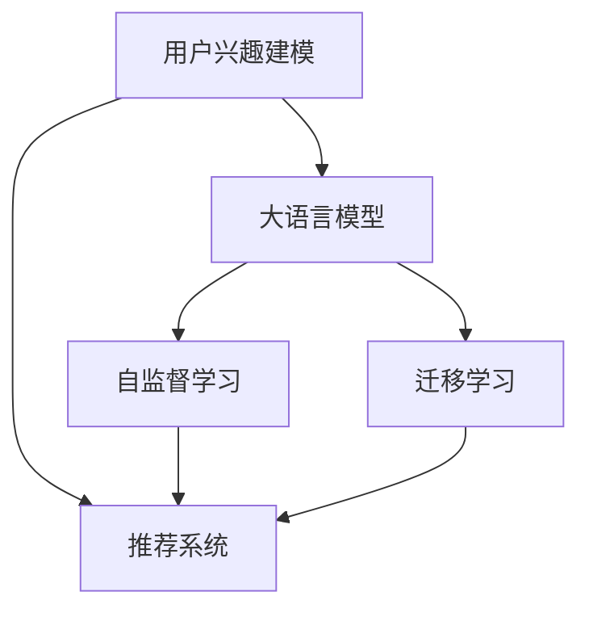

                 

# 大模型技术在电商平台用户兴趣建模中的应用

> 关键词：电商平台,用户兴趣建模,大语言模型,推荐系统,用户行为分析,深度学习

## 1. 背景介绍

### 1.1 问题由来
近年来，随着互联网和电商平台的蓬勃发展，用户的在线购物行为变得愈加复杂多样，传统的推荐系统已难以满足用户个性化需求。电商平台亟需引入更高效、更精确的推荐算法，帮助用户快速找到感兴趣的商品，提升用户体验和销售转化率。

面对用户多样化的需求和海量数据，平台需要一种能够理解用户意图、预测用户行为，并推荐最适合商品的算法。大语言模型因其在自然语言处理领域取得的突破性进展，逐步成为了电商平台推荐系统升级的新引擎。

### 1.2 问题核心关键点
大语言模型通过大规模预训练，学习到丰富的语言和语义知识，具备强大的文本理解与生成能力。其核心特点包括：

- **多模态融合**：能够整合图片、文本等多种模态信息，提升对商品和用户描述的深度理解。
- **泛化能力强**：基于泛化学习，可以适应各种用户和商品特征，具有广泛的普适性。
- **实时性较好**：通过微调和推理加速，能够实时响应用户查询，提升推荐体验。
- **可解释性较强**：可以通过多种方式（如Prompt Learning、知识图谱）对推荐决策进行解释，增加用户信任。

通过大语言模型进行用户兴趣建模，可以实现以下目标：

- **精确预测用户行为**：通过分析用户历史行为和兴趣标签，预测用户未来行为和兴趣点。
- **个性化推荐优化**：根据用户个性化需求，推荐最合适的商品。
- **实时性增强**：能够及时更新用户兴趣模型，快速响应用户查询。

## 2. 核心概念与联系

### 2.1 核心概念概述

为更好地理解大模型在电商平台用户兴趣建模中的应用，本节将介绍几个关键概念及其相互联系：

- **用户兴趣建模**：根据用户的历史行为和兴趣标签，建模出用户对不同商品或内容的兴趣倾向，用于个性化推荐。
- **大语言模型**：基于大规模预训练的语言模型，如BERT、GPT等，具备强大的文本理解和生成能力，可用于自然语言处理和推荐系统。
- **推荐系统**：根据用户行为和商品特征，为用户推荐最感兴趣的商品，提升用户满意度。
- **深度学习**：利用多层神经网络结构进行复杂任务学习，如用户兴趣建模和推荐算法。
- **自监督学习**：利用无标签数据进行预训练，学习通用知识，增强推荐系统泛化能力。
- **迁移学习**：通过知识迁移，将预训练大模型的泛化能力应用到特定任务，提升推荐系统效果。

这些概念之间的逻辑关系可以通过以下Mermaid流程图来展示：



这个流程图展示了用户兴趣建模、大语言模型、推荐系统等关键概念之间的关系：

1. 大语言模型通过自监督学习获得广泛的语义知识，为推荐系统提供强大的文本处理能力。
2. 推荐系统根据用户行为数据，结合大语言模型的输出结果，进行个性化推荐。
3. 自监督学习和迁移学习有助于提高大语言模型和推荐系统的泛化能力和适用性。

## 3. 核心算法原理 & 具体操作步骤
### 3.1 算法原理概述

基于大语言模型的电商平台用户兴趣建模算法，主要分为预训练、微调和推理三个阶段：

1. **预训练阶段**：在大规模无标签数据上，通过自监督学习，学习通用的语言表示和知识。
2. **微调阶段**：使用电商平台用户行为数据，对预训练模型进行有监督微调，得到适应用户兴趣的模型。
3. **推理阶段**：将微调后的模型应用于实时查询，生成个性化推荐结果。

算法核心在于如何将用户行为数据转化为模型可用的表示形式，以及如何高效地将模型应用于推荐系统。

### 3.2 算法步骤详解

1. **预训练阶段**：
   - 收集电商平台用户的行为数据，包括浏览、点击、购买等。
   - 使用这些行为数据，结合大语言模型的预训练任务（如语言建模、掩码语言建模等）进行自监督学习。
   - 通过大规模预训练，学习到通用语言表示和知识，为推荐系统提供强大的文本处理能力。

2. **微调阶段**：
   - 在预训练模型的基础上，使用有监督学习任务进行微调。
   - 构建用户行为数据的表示模型，如用户向量、商品向量等。
   - 定义损失函数，如交叉熵损失、均方误差损失等，衡量模型预测与真实标签之间的差异。
   - 使用AdamW等优化算法进行模型更新，最小化损失函数，调整模型参数。
   - 设置适当的正则化技术和学习率，防止过拟合，提升模型泛化能力。

3. **推理阶段**：
   - 将微调后的模型应用于实时查询，获取用户输入的文本描述。
   - 使用Prompt Learning等方式，将用户文本转换成模型可理解的输入格式。
   - 根据模型输出结果，结合其他特征（如商品评分、用户历史行为等），生成个性化推荐结果。
   - 将推荐结果返回给用户，记录用户反馈，用于进一步模型微调。

### 3.3 算法优缺点

基于大语言模型的用户兴趣建模方法具有以下优点：

- **高泛化能力**：预训练模型具有强大的泛化能力，能够适应多种商品和用户特征。
- **高效的个性化推荐**：微调后的模型能够快速响应用户查询，生成个性化推荐结果。
- **较好的可解释性**：通过Prompt Learning等方式，可以解释模型推荐决策的逻辑。

但该方法也存在以下缺点：

- **高计算成本**：预训练和微调过程需要大规模计算资源，尤其是在大模型上。
- **数据依赖性强**：依赖电商平台的用户行为数据，需要获取高质量的数据，获取成本较高。
- **模型复杂度高**：大语言模型参数较多，推理计算量较大。

### 3.4 算法应用领域

该方法已经在电商平台的推荐系统、广告投放、内容推荐等多个场景中得到了应用：

- **推荐系统**：根据用户行为数据，为每个用户推荐最感兴趣的商品。
- **广告投放**：利用用户兴趣标签，优化广告投放策略，提升广告效果。
- **内容推荐**：根据用户对内容的兴趣，推荐最相关的内容。
- **个性化服务**：根据用户需求，推荐个性化的服务内容。

## 4. 数学模型和公式 & 详细讲解
### 4.1 数学模型构建

构建电商平台用户兴趣建模的数学模型，包括用户行为表示、商品特征表示和模型预测等部分。

**用户行为表示**：将用户的历史行为数据转换为向量形式，表示用户的兴趣倾向。例如，用户浏览过的商品可以表示为用户向量 $u$。

**商品特征表示**：将商品的描述和标签转换为向量形式，表示商品的特征。例如，商品标签可以表示为商品向量 $v$。

**模型预测**：定义预测函数 $f$，通过用户向量 $u$ 和商品向量 $v$ 计算预测结果 $p$。

$$
p = f(u, v)
$$

常用的预测函数包括点积模型、注意力机制等。

### 4.2 公式推导过程

以点积模型为例，用户行为表示和商品特征表示通过点积计算预测结果。

$$
p = \langle u, v \rangle = u^Tv
$$

其中 $\langle \cdot, \cdot \rangle$ 表示向量的点积运算，$u^T$ 表示用户向量 $u$ 的转置。

### 4.3 案例分析与讲解

在电商平台推荐系统中，可以使用大语言模型对用户行为和商品特征进行建模，具体如下：

1. **用户行为表示**：收集用户历史行为数据，例如浏览历史、购买记录等，将其转换为向量表示。
2. **商品特征表示**：获取商品描述、标签等特征，将其转换为向量表示。
3. **模型预测**：使用点积模型计算用户行为和商品特征的点积，得到预测结果，用于推荐系统。

## 5. 项目实践：代码实例和详细解释说明
### 5.1 开发环境搭建

在进行用户兴趣建模实践前，我们需要准备好开发环境。以下是使用Python进行PyTorch开发的环境配置流程：

1. 安装Anaconda：从官网下载并安装Anaconda，用于创建独立的Python环境。

2. 创建并激活虚拟环境：
```bash
conda create -n pytorch-env python=3.8 
conda activate pytorch-env
```

3. 安装PyTorch：根据CUDA版本，从官网获取对应的安装命令。例如：
```bash
conda install pytorch torchvision torchaudio cudatoolkit=11.1 -c pytorch -c conda-forge
```

4. 安装Transformers库：
```bash
pip install transformers
```

5. 安装各类工具包：
```bash
pip install numpy pandas scikit-learn matplotlib tqdm jupyter notebook ipython
```

完成上述步骤后，即可在`pytorch-env`环境中开始用户兴趣建模实践。

### 5.2 源代码详细实现

以下给出使用Transformers库对BERT模型进行用户兴趣建模的PyTorch代码实现。

首先，定义用户行为和商品特征的表示模型：

```python
from transformers import BertTokenizer, BertModel
import torch

# 初始化分词器和BERT模型
tokenizer = BertTokenizer.from_pretrained('bert-base-cased')
model = BertModel.from_pretrained('bert-base-cased')

# 用户行为表示模型
class UserEmbedding(torch.nn.Module):
    def __init__(self):
        super(UserEmbedding, self).__init__()
        self.bert = model

    def forward(self, inputs):
        # 将输入转换为token ids
        inputs = tokenizer(inputs, return_tensors='pt')
        # 输入到BERT模型中
        outputs = self.bert(**inputs)
        # 返回BERT模型的输出，即用户向量
        return outputs.last_hidden_state[:, 0]

# 商品特征表示模型
class ItemEmbedding(torch.nn.Module):
    def __init__(self):
        super(ItemEmbedding, self).__init__()
        self.bert = model

    def forward(self, inputs):
        # 将输入转换为token ids
        inputs = tokenizer(inputs, return_tensors='pt')
        # 输入到BERT模型中
        outputs = self.bert(**inputs)
        # 返回BERT模型的输出，即商品向量
        return outputs.last_hidden_state[:, 0]
```

然后，定义预测函数：

```python
class Recommender(torch.nn.Module):
    def __init__(self, user_model, item_model):
        super(Recommender, self).__init__()
        self.user_model = user_model
        self.item_model = item_model

    def forward(self, user, item):
        # 将用户行为和商品特征输入模型
        user_vec = self.user_model(user)
        item_vec = self.item_model(item)
        # 计算点积
        scores = torch.matmul(user_vec, item_vec.t())
        # 返回预测结果
        return scores
```

接着，定义训练和推理函数：

```python
from torch.utils.data import DataLoader
from tqdm import tqdm

# 训练函数
def train_model(model, user_data, item_data, optimizer):
    dataloader = DataLoader(zip(user_data, item_data), batch_size=16, shuffle=True)
    model.train()
    for batch in tqdm(dataloader, desc='Training'):
        user, item = batch
        optimizer.zero_grad()
        outputs = model(user, item)
        loss = outputs.mean()
        loss.backward()
        optimizer.step()

# 推理函数
def recommend(model, user, item):
    with torch.no_grad():
        scores = model(user, item)
        # 输出预测结果
        return scores
```

最后，启动训练流程并在测试集上评估：

```python
epochs = 5
batch_size = 16

# 训练过程
for epoch in range(epochs):
    train_model(model, user_data, item_data, optimizer)
    
    # 在测试集上评估
    test_scores = recommend(model, test_user, test_item)
    print('Test scores:', test_scores.mean().item())
```

以上就是使用PyTorch对BERT进行用户兴趣建模的完整代码实现。可以看到，Transformer库的强大封装能力，使得模型的定义和训练变得简洁高效。

### 5.3 代码解读与分析

让我们再详细解读一下关键代码的实现细节：

**UserEmbedding类**：
- `__init__`方法：初始化BERT模型作为用户行为表示的嵌入层。
- `forward`方法：将输入文本转换为token ids，并输入到BERT模型中，获取最后一个token的隐层表示作为用户向量。

**ItemEmbedding类**：
- `__init__`方法：初始化BERT模型作为商品特征表示的嵌入层。
- `forward`方法：将输入文本转换为token ids，并输入到BERT模型中，获取最后一个token的隐层表示作为商品向量。

**Recommender类**：
- `__init__`方法：初始化用户和商品表示模型，定义预测函数。
- `forward`方法：将用户和商品向量作为输入，计算点积得到预测结果。

**训练和推理函数**：
- 训练函数`train_model`：定义训练数据集，使用AdamW优化器进行梯度更新。
- 推理函数`recommend`：将用户和商品向量输入到Recommender模型，获取预测结果。

通过这些代码，我们可以快速搭建一个基于BERT的电商平台推荐系统，并根据实际数据进行调整优化。

## 6. 实际应用场景
### 6.1 智能推荐系统

在电商平台推荐系统中，用户兴趣建模可以显著提升推荐效果。基于大语言模型的推荐系统，能够精确预测用户行为，生成个性化推荐结果。

以淘宝为例，淘宝平台通过收集用户浏览、点击、购买等行为数据，结合大语言模型进行用户兴趣建模。模型首先使用自监督学习任务对大语言模型进行预训练，然后在电商平台用户行为数据上进行微调，得到适应用户兴趣的模型。模型在用户输入搜索查询时，将查询文本作为输入，输出预测结果，用于推荐系统生成推荐商品。

### 6.2 广告投放优化

电商平台利用用户兴趣建模，能够优化广告投放策略，提高广告效果。广告主可以根据用户兴趣标签，有针对性地投放广告，提升广告点击率和转化率。

例如，淘宝商家可以根据用户兴趣建模结果，选择最感兴趣的广告位进行广告投放，从而最大化广告效果。同时，商家还可以根据广告效果反馈，动态调整广告投放策略，提升广告效果。

### 6.3 内容推荐

平台可以根据用户兴趣建模结果，推荐最相关的内容，提升用户满意度。例如，淘宝平台可以根据用户对商品的兴趣，推荐相关的文章、视频等，丰富用户购物体验。

用户兴趣建模也可以应用于内容的筛选和推荐，例如YouTube平台通过用户观看行为数据，进行内容推荐。模型将用户行为数据转换为向量形式，结合内容标签等特征，计算预测结果，用于推荐系统。

### 6.4 个性化服务

平台可以根据用户兴趣建模结果，提供个性化的服务内容。例如，淘宝平台可以根据用户兴趣，推荐个性化的商品、优惠券等。

通过用户兴趣建模，平台能够理解用户需求，提供更加精准的服务内容，提升用户粘性和满意度。

## 7. 工具和资源推荐
### 7.1 学习资源推荐

为了帮助开发者系统掌握大语言模型在电商平台用户兴趣建模中的应用，这里推荐一些优质的学习资源：

1. 《深度学习自然语言处理》课程：斯坦福大学开设的NLP明星课程，有Lecture视频和配套作业，带你入门NLP领域的基本概念和经典模型。
2. CS224N《自然语言处理与深度学习》课程：斯坦福大学开设的NLP经典课程，涵盖自然语言处理的各个方面，包括推荐系统。
3. 《Transformers from Practice to Theory》系列博文：由大模型技术专家撰写，深入浅出地介绍了Transformer原理、BERT模型、推荐系统等前沿话题。
4. 《Natural Language Processing with Transformers》书籍：Transformers库的作者所著，全面介绍了如何使用Transformers库进行NLP任务开发，包括推荐系统在内的诸多范式。
5. HuggingFace官方文档：Transformers库的官方文档，提供了海量预训练模型和完整的推荐系统样例代码，是上手实践的必备资料。

通过对这些资源的学习实践，相信你一定能够快速掌握大语言模型在电商平台用户兴趣建模中的精髓，并用于解决实际的推荐系统问题。

### 7.2 开发工具推荐

高效的开发离不开优秀的工具支持。以下是几款用于大语言模型推荐系统开发的常用工具：

1. PyTorch：基于Python的开源深度学习框架，灵活动态的计算图，适合快速迭代研究。大部分预训练语言模型都有PyTorch版本的实现。
2. TensorFlow：由Google主导开发的开源深度学习框架，生产部署方便，适合大规模工程应用。同样有丰富的预训练语言模型资源。
3. Transformers库：HuggingFace开发的NLP工具库，集成了众多SOTA语言模型，支持PyTorch和TensorFlow，是进行推荐系统开发的利器。
4. Weights & Biases：模型训练的实验跟踪工具，可以记录和可视化模型训练过程中的各项指标，方便对比和调优。与主流深度学习框架无缝集成。
5. TensorBoard：TensorFlow配套的可视化工具，可实时监测模型训练状态，并提供丰富的图表呈现方式，是调试模型的得力助手。
6. Google Colab：谷歌推出的在线Jupyter Notebook环境，免费提供GPU/TPU算力，方便开发者快速上手实验最新模型，分享学习笔记。

合理利用这些工具，可以显著提升大语言模型推荐系统的开发效率，加快创新迭代的步伐。

### 7.3 相关论文推荐

大语言模型和推荐系统的发展源于学界的持续研究。以下是几篇奠基性的相关论文，推荐阅读：

1. Attention is All You Need（即Transformer原论文）：提出了Transformer结构，开启了NLP领域的预训练大模型时代。
2. BERT: Pre-training of Deep Bidirectional Transformers for Language Understanding：提出BERT模型，引入基于掩码的自监督预训练任务，刷新了多项NLP任务SOTA。
3. Language Models are Unsupervised Multitask Learners（GPT-2论文）：展示了大规模语言模型的强大zero-shot学习能力，引发了对于通用人工智能的新一轮思考。
4. Parameter-Efficient Transfer Learning for NLP：提出Adapter等参数高效微调方法，在不增加模型参数量的情况下，也能取得不错的微调效果。
5. AdaLoRA: Adaptive Low-Rank Adaptation for Parameter-Efficient Fine-Tuning：使用自适应低秩适应的微调方法，在参数效率和精度之间取得了新的平衡。
6. Transformer-XL: Attentive Language Models Beyond a Fixed-Length Context（Transformer-XL论文）：提出Transformer-XL模型，解决了长序列训练问题，扩展了模型的适用范围。

这些论文代表了大语言模型推荐系统的发展脉络。通过学习这些前沿成果，可以帮助研究者把握学科前进方向，激发更多的创新灵感。

## 8. 总结：未来发展趋势与挑战
### 8.1 总结

本文对基于大语言模型的电商平台用户兴趣建模方法进行了全面系统的介绍。首先阐述了电商平台推荐系统面临的挑战以及大语言模型在其中的潜力。其次，从原理到实践，详细讲解了大语言模型和推荐系统结合的关键步骤，给出了用户兴趣建模的完整代码实例。同时，本文还广泛探讨了该方法在电商、广告、内容推荐等多个领域的应用前景，展示了其广阔的应用空间。

通过本文的系统梳理，可以看到，大语言模型在电商平台推荐系统中的应用前景广阔，能够通过精确预测用户行为和个性化推荐，提升用户体验和平台效益。未来，伴随大语言模型和推荐系统技术的不断发展，相信推荐系统将进一步优化，能够更好地满足用户需求，实现智能商业的迭代升级。

### 8.2 未来发展趋势

展望未来，大语言模型在电商平台推荐系统中的应用将呈现以下几个发展趋势：

1. **多模态推荐系统**：融合视觉、音频等多模态数据，提升推荐系统的全面性和准确性。例如，利用图片和文本信息共同表示商品特征，提升推荐效果。
2. **跨领域知识迁移**：将不同领域的知识进行迁移，提升推荐系统的普适性。例如，在电商领域中引入医疗、金融等领域的知识，提升推荐系统的能力。
3. **个性化深度学习**：利用深度学习技术，进一步提升推荐系统的个性化能力。例如，通过多层神经网络结构，捕捉用户兴趣的层次关系，提升推荐效果。
4. **实时性增强**：通过优化模型结构和推理算法，提升推荐系统的实时性。例如，使用混合精度训练、模型压缩等技术，减少推理计算量。
5. **推荐算法集成**：将多种推荐算法集成，提升推荐系统的综合能力。例如，结合协同过滤、深度学习等算法，提升推荐效果。

这些趋势凸显了大语言模型在电商平台推荐系统中的广阔前景，其与推荐系统的结合将带来更深层次的智能化升级。

### 8.3 面临的挑战

尽管大语言模型在电商平台推荐系统中的应用取得了显著效果，但在迈向更加智能化、普适化应用的过程中，仍面临诸多挑战：

1. **计算资源瓶颈**：大语言模型参数较多，推理计算量较大，需要高效的计算资源支持。如何优化模型结构和推理算法，提升计算效率，仍是一个重要问题。
2. **数据隐私和安全**：电商平台需要处理大量用户数据，数据隐私和安全问题变得尤为重要。如何在保证用户隐私的同时，充分利用数据进行推荐建模，是一个需要重点解决的问题。
3. **数据偏见**：大语言模型和推荐系统可能学习到数据中的偏见，导致推荐系统输出不公平或不合理的推荐结果。如何消除数据偏见，提高推荐系统的公平性，是一个亟待解决的问题。
4. **实时性问题**：推荐系统需要实时响应用户查询，如何优化模型结构和推理算法，提升实时性，是一个需要重点解决的问题。
5. **可解释性不足**：推荐系统通常是黑盒系统，难以解释推荐决策的逻辑。如何在保证推荐效果的同时，提升系统的可解释性，是一个需要重点解决的问题。

这些挑战需要研究者不断优化模型和算法，探索新的解决方案，才能真正发挥大语言模型在电商平台推荐系统中的潜力。

### 8.4 研究展望

面对大语言模型在电商平台推荐系统中的应用挑战，未来的研究需要在以下几个方面寻求新的突破：

1. **优化模型结构和算法**：通过优化模型结构和推理算法，提升计算效率和实时性。例如，使用混合精度训练、模型压缩等技术，减少推理计算量。
2. **增强数据隐私和安全**：采用数据匿名化、差分隐私等技术，保护用户隐私，提升数据安全性。
3. **消除数据偏见**：利用公平性约束、对抗训练等技术，消除模型偏见，提升推荐系统的公平性。
4. **提升可解释性**：通过可视化工具、解释模型等技术，提高推荐系统的可解释性。例如，利用Attention机制，解释模型推荐决策的逻辑。
5. **跨领域知识融合**：将不同领域的知识进行融合，提升推荐系统的普适性。例如，在电商领域中引入医疗、金融等领域的知识，提升推荐系统的能力。

这些研究方向的探索，必将引领大语言模型在电商平台推荐系统中的不断优化和进步，为电商平台的智能化升级提供强有力的技术支撑。总之，大语言模型在电商平台推荐系统中的应用，需要从多个维度进行协同优化，才能真正实现个性化推荐，提升用户体验和平台效益。

## 9. 附录：常见问题与解答

**Q1：如何选择合适的预训练模型？**

A: 在选择预训练模型时，需要考虑模型的参数规模、预训练任务、性能表现等因素。一般而言，参数规模较大、预训练任务多样的模型，效果更好，但计算资源需求也更高。建议根据实际需求选择合适的模型，并进行微调优化。

**Q2：如何优化推荐系统的实时性？**

A: 推荐系统的实时性可以通过以下方式进行优化：
1. 模型压缩：使用模型压缩技术，如剪枝、量化等，减小模型体积，提升推理速度。
2. 推理加速：使用GPU/TPU等高性能设备，加速模型推理。
3. 缓存技术：利用缓存技术，减少重复计算，提升推理效率。
4. 分布式计算：使用分布式计算技术，提升计算能力，加快模型推理。

**Q3：如何处理数据偏见问题？**

A: 数据偏见问题可以通过以下方式进行处理：
1. 数据清洗：清洗数据中存在偏见的部分，减少数据偏见的影响。
2. 对抗训练：利用对抗样本训练模型，增强模型的鲁棒性，减少偏见的影响。
3. 公平性约束：在模型训练过程中，引入公平性约束，消除模型偏见。
4. 人工干预：结合人工干预，对推荐结果进行审查和修正，提升推荐系统的公平性。

**Q4：如何评估推荐系统的性能？**

A: 推荐系统的性能评估可以从多个指标进行，例如：
1. 点击率（CTR）：衡量推荐系统推荐的商品被用户点击的概率。
2. 转化率（CVR）：衡量推荐系统推荐的商品被用户购买的概率。
3. 覆盖率：衡量推荐系统推荐的商品覆盖用户兴趣的程度。
4. 多样性：衡量推荐系统推荐商品的多样性，避免过度同质化。
5. 新颖性：衡量推荐系统推荐的商品与用户已有兴趣的差异程度，提升用户体验。

通过对这些指标的评估，可以全面了解推荐系统的性能，并进行优化调整。

**Q5：大语言模型在推荐系统中的应用前景如何？**

A: 大语言模型在推荐系统中的应用前景广阔，具有以下优势：
1. 强大的泛化能力：通过大规模预训练，学习到丰富的语言知识，提升推荐系统的泛化能力。
2. 精确的预测能力：利用大语言模型，可以精确预测用户行为和兴趣，提升推荐效果。
3. 实时的响应能力：通过微调后的模型，能够实时响应用户查询，提升用户体验。
4. 良好的可解释性：利用Prompt Learning等方式，可以解释推荐系统的决策逻辑，提升用户信任。

总之，大语言模型在推荐系统中的应用，将带来更深层次的智能化升级，为用户带来更好的购物体验。

---

作者：禅与计算机程序设计艺术 / Zen and the Art of Computer Programming

