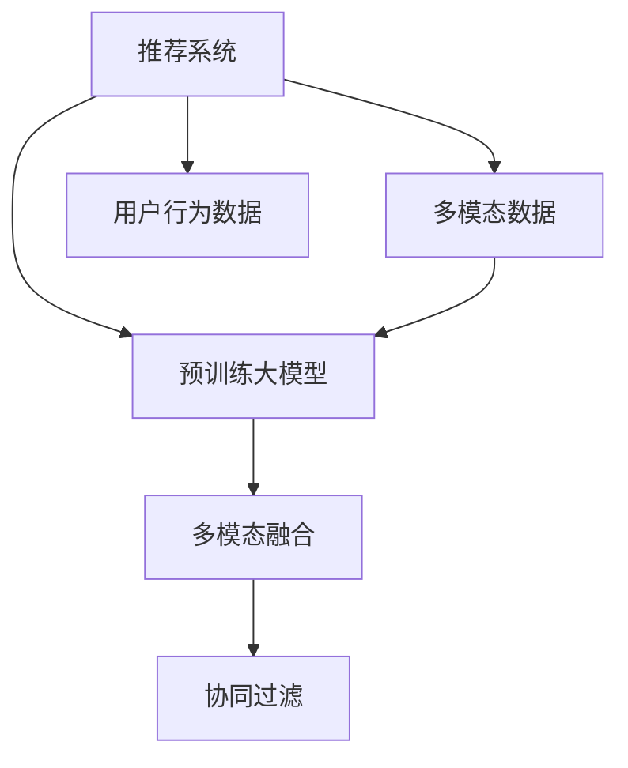

                 

# 大模型推荐中的多模态融合策略

> 关键词：推荐系统,多模态融合,大模型,知识图谱,深度学习,协同过滤

## 1. 背景介绍

### 1.1 问题由来

随着互联网的迅猛发展，用户产生的数据量呈爆炸式增长，海量的用户行为数据成为推荐系统的重要资源。推荐系统通过分析用户的浏览、点击、评分等行为数据，为用户推荐感兴趣的物品，从而提高用户体验和运营效率。然而，由于传统推荐系统过于依赖单一数据模态，未能充分利用多模态数据的特点，使得推荐精度和用户体验仍有较大提升空间。

近年来，随着深度学习技术的飞速发展，尤其是预训练大模型的涌现，推荐系统迎来了新的技术范式。利用预训练语言模型进行推荐，可以借助其强大的语言理解能力，将文本信息与用户行为数据融合，进一步提升推荐精度。此外，随着多模态数据的丰富性，多模态融合技术也被引入推荐系统，以提升推荐系统的表现力和泛化能力。本文聚焦于基于预训练语言模型的推荐系统，将从理论到实践，系统阐述大模型推荐中的多模态融合策略。

### 1.2 问题核心关键点

大模型推荐中的多模态融合策略，主要关注如何在大规模语料预训练和用户行为数据融合的过程中，充分利用多模态数据的特点，实现高效、准确的推荐。其核心挑战在于：
1. 如何构建有效的多模态融合模型，使得不同模态的数据能够协同优化。
2. 如何从多模态数据中提取有价值的特征，并利用预训练大模型进行处理。
3. 如何设计合适的融合方式，避免模型过拟合，提升模型的泛化能力。
4. 如何优化推荐模型，提高推荐效率和效果。

## 2. 核心概念与联系

### 2.1 核心概念概述

为更好地理解基于大模型的推荐系统中的多模态融合策略，本节将介绍几个密切相关的核心概念：

- 推荐系统：通过分析用户的历史行为数据，为用户推荐感兴趣的物品的系统。推荐系统的应用广泛，如电商、视频、音乐等领域。
- 多模态数据：指多种数据模态，如文本、图像、音频、时间序列等，不同模态的数据能够提供不同的信息维度，提高推荐精度。
- 预训练大模型：通过在大规模语料上进行预训练，学习到丰富的语言知识，进而提升其在推荐任务上的表现。如BERT、GPT等。
- 多模态融合：指将不同模态的数据进行组合和优化，以提高推荐的准确性和多样性。
- 协同过滤：指通过分析用户与物品的协同行为，预测用户未见过的物品。

这些核心概念之间的逻辑关系可以通过以下Mermaid流程图来展示：



这个流程图展示了大模型推荐中的多模态融合的核心概念及其之间的关系：

1. 推荐系统利用预训练大模型和多模态数据进行推荐。
2. 预训练大模型在大规模语料上进行预训练，学习到语言表示。
3. 多模态数据提供不同信息维度的特征，与预训练大模型结合进行优化。
4. 多模态融合提升推荐精度，协同过滤则更关注用户行为与物品的协同关系。

## 3. 核心算法原理 & 具体操作步骤
### 3.1 算法原理概述

基于大模型的推荐系统，通常采用多模态融合策略，将文本信息与用户行为数据进行结合，优化推荐模型。其主要思想是：
1. 将用户行为数据转换为文本形式，与预训练大模型的输出进行融合。
2. 利用多模态融合模型对融合后的数据进行优化。
3. 通过协同过滤技术，提升推荐模型的泛化能力和效果。

具体实现上，可分为以下几个关键步骤：

**Step 1: 数据预处理与融合**
- 将用户行为数据转换为文本形式。如将用户的浏览记录转换为摘要文本。
- 利用预训练大模型对文本数据进行编码，得到文本表示。
- 将文本表示与用户行为数据进行拼接或融合。

**Step 2: 模型构建与训练**
- 设计多模态融合模型，如使用Transformer模型对融合后的数据进行编码。
- 选择协同过滤算法，如基于矩阵分解的算法，进行推荐模型的优化。
- 将融合后的数据输入到多模态融合模型，利用深度学习技术优化模型参数。

**Step 3: 模型评估与优化**
- 在测试集上评估推荐模型的性能，如准确率、召回率、覆盖率等指标。
- 调整模型参数，如融合比例、损失函数等，优化模型性能。
- 对推荐模型进行迭代优化，提高推荐效果。

### 3.2 算法步骤详解

以下将以一个具体的推荐场景为例，详细介绍基于大模型的多模态融合推荐系统的实现流程。

**场景描述**：一个电商平台，希望根据用户的浏览、点击、评分等行为数据，为用户推荐感兴趣的商品。该平台已经收集了大量的商品描述信息，包括图片、标题、价格等文本数据。

**算法步骤**：

**Step 1: 数据预处理与融合**
- 收集用户的浏览历史数据，包括浏览时间、浏览时长、点击等行为数据。
- 将用户的浏览历史转换为摘要文本，如将浏览历史按照时间顺序进行排序，并摘取出关键物品信息。
- 使用预训练的大语言模型（如BERT、GPT等）对摘要文本进行编码，得到文本表示。
- 将文本表示与用户的评分数据进行拼接或融合，得到融合后的多模态数据。

**Step 2: 模型构建与训练**
- 设计多模态融合模型，如使用Transformer模型对融合后的数据进行编码。
- 利用矩阵分解等协同过滤算法，对多模态融合模型进行优化。
- 将融合后的多模态数据输入到多模态融合模型，利用深度学习技术优化模型参数。

**Step 3: 模型评估与优化**
- 在测试集上评估推荐模型的性能，如准确率、召回率、覆盖率等指标。
- 调整模型参数，如融合比例、损失函数等，优化模型性能。
- 对推荐模型进行迭代优化，提高推荐效果。

### 3.3 算法优缺点

基于大模型的多模态融合推荐系统有以下优点：
1. 能够充分利用多模态数据的丰富信息，提高推荐精度。
2. 利用预训练大模型的语言表示能力，提升模型的泛化能力。
3. 借助多模态融合技术，实现更灵活的推荐模型。
4. 能够在用户行为数据不足的情况下，提高推荐模型的鲁棒性。

同时，该方法也存在一定的局限性：
1. 预训练大模型对计算资源的要求较高。
2. 多模态数据融合的复杂度较高，可能需要设计多种融合策略。
3. 模型泛化能力仍然受限于数据质量和多样性。
4. 模型的解释性仍不足，难以直接解释推荐结果的依据。

尽管存在这些局限性，但就目前而言，基于大模型的多模态融合推荐方法仍然是推荐系统的重要范式。未来相关研究的重点在于如何进一步降低预训练大模型的计算资源消耗，提高模型的泛化能力和可解释性。

### 3.4 算法应用领域

基于大模型的多模态融合推荐系统，在电商、视频、音乐、新闻推荐等领域均有广泛应用。具体包括：

- 电商平台推荐：利用用户的浏览、点击、评分等行为数据，推荐商品、促销活动等。
- 视频推荐系统：结合视频标题、描述、标签等文本数据，推荐用户感兴趣的视频内容。
- 音乐推荐系统：利用歌词、标签、评论等文本信息，推荐用户喜欢的音乐。
- 新闻推荐系统：利用新闻标题、摘要、作者等文本信息，推荐用户感兴趣的新闻。

此外，在大模型推荐系统中，还常常引入知识图谱技术，进一步提升推荐的准确性和多样性。

## 4. 数学模型和公式 & 详细讲解 & 举例说明
### 4.1 数学模型构建

为了更好地理解基于大模型的多模态融合推荐系统，本节将详细介绍其数学模型构建过程。

设推荐系统的用户集合为 $U$，物品集合为 $I$，用户行为数据为 $X$，物品属性数据为 $Y$。假设用户与物品的协同关系由一个矩阵 $M \in \mathbb{R}^{m \times n}$ 表示，其中 $m$ 为用户数，$n$ 为物品数。

设 $A \in \mathbb{R}^{m \times n}$ 为用户行为数据，$B \in \mathbb{R}^{m \times d}$ 为物品属性数据。$C \in \mathbb{R}^{m \times n}$ 为用户行为数据的文本表示，$D \in \mathbb{R}^{n \times d}$ 为物品属性数据的文本表示。则推荐系统的目标是最大化用户-物品协同关系 $M$ 与用户行为数据 $A$ 和物品属性数据 $B$ 的融合。

数学模型可以表示为：

$$
\max_{M} \text{tr}(A^T \times M \times B) \quad s.t. \quad M_{i,j} = f(X_i, Y_j, C_i, D_j)
$$

其中 $\text{tr}(\cdot)$ 表示矩阵的迹，$f(\cdot)$ 为融合函数，可以是拼接、加权平均、点积等。

### 4.2 公式推导过程

以下是推荐系统的融合函数 $f(\cdot)$ 的推导过程：

假设 $A_{i,j}$ 表示用户 $i$ 对物品 $j$ 的行为数据，$B_{i,j}$ 表示物品 $j$ 的属性数据。用户行为数据的文本表示 $C_{i,j}$ 和物品属性数据的文本表示 $D_{i,j}$ 通过预训练大模型进行编码，得到文本表示 $c_i$ 和 $d_j$。则融合函数 $f(\cdot)$ 可以表示为：

$$
f(A_{i,j}, B_{i,j}, C_{i,j}, D_{i,j}) = \alpha A_{i,j} + \beta B_{i,j} + \gamma c_i \odot d_j + \delta C_{i,j} \odot D_{i,j}
$$

其中 $\alpha$、$\beta$、$\gamma$、$\delta$ 为融合系数，$\odot$ 表示点积操作。

通过上述推导，可以看到，融合函数可以灵活地利用用户行为数据和物品属性数据，同时考虑文本表示的融合，提升推荐的准确性和多样性。

### 4.3 案例分析与讲解

以下将以一个具体的案例，详细讲解基于大模型的多模态融合推荐系统的实现。

**案例描述**：某电商平台希望利用用户的浏览、点击、评分等行为数据，推荐商品给用户。该平台收集了商品的标题、描述、图片等文本数据，以及用户的浏览历史和评分数据。

**算法实现**：
1. 对用户的浏览历史进行文本摘要，生成文本表示 $C_i$。
2. 对商品的标题、描述、图片等文本数据进行编码，生成文本表示 $D_j$。
3. 利用预训练大模型对文本表示进行编码，得到文本表示 $c_i$ 和 $d_j$。
4. 设计融合函数 $f(\cdot)$，将用户行为数据 $A_{i,j}$ 和物品属性数据 $B_{i,j}$ 与文本表示进行融合，得到融合后的多模态数据。
5. 利用矩阵分解等协同过滤算法，对多模态融合模型进行优化，得到推荐模型 $M$。
6. 在测试集上评估推荐模型的性能，如准确率、召回率、覆盖率等指标，调整模型参数，优化模型性能。

## 5. 项目实践：代码实例和详细解释说明
### 5.1 开发环境搭建

在进行多模态融合推荐系统的开发前，需要准备好开发环境。以下是使用Python进行PyTorch开发的环境配置流程：

1. 安装Anaconda：从官网下载并安装Anaconda，用于创建独立的Python环境。

2. 创建并激活虚拟环境：
```bash
conda create -n pytorch-env python=3.8 
conda activate pytorch-env
```

3. 安装PyTorch：根据CUDA版本，从官网获取对应的安装命令。例如：
```bash
conda install pytorch torchvision torchaudio cudatoolkit=11.1 -c pytorch -c conda-forge
```

4. 安装Transformers库：
```bash
pip install transformers
```

5. 安装各类工具包：
```bash
pip install numpy pandas scikit-learn matplotlib tqdm jupyter notebook ipython
```

完成上述步骤后，即可在`pytorch-env`环境中开始推荐系统的开发。

### 5.2 源代码详细实现

下面我以一个具体的推荐场景为例，给出使用Transformers库对多模态融合推荐系统进行PyTorch代码实现。

首先，定义推荐系统的数据处理函数：

```python
from transformers import BertTokenizer
from torch.utils.data import Dataset
import torch

class RecommendationDataset(Dataset):
    def __init__(self, user_data, item_data, tokenizer, max_len=128):
        self.user_data = user_data
        self.item_data = item_data
        self.tokenizer = tokenizer
        self.max_len = max_len
        
    def __len__(self):
        return len(self.user_data)
    
    def __getitem__(self, item):
        user = self.user_data[item]
        item = self.item_data[item]
        
        user_text = user['behavior'] + user['rating']
        item_text = item['description']
        
        encoding = self.tokenizer(user_text, return_tensors='pt', max_length=self.max_len, padding='max_length', truncation=True)
        input_ids = encoding['input_ids'][0]
        attention_mask = encoding['attention_mask'][0]
        
        item_encoding = self.tokenizer(item_text, return_tensors='pt', max_length=self.max_len, padding='max_length', truncation=True)
        item_input_ids = item_encoding['input_ids'][0]
        item_attention_mask = item_encoding['attention_mask'][0]
        
        return {'input_ids': input_ids, 
                'attention_mask': attention_mask,
                'item_input_ids': item_input_ids,
                'item_attention_mask': item_attention_mask,
                'user_data': user,
                'item_data': item}
```

然后，定义模型和优化器：

```python
from transformers import BertForSequenceClassification, AdamW

model = BertForSequenceClassification.from_pretrained('bert-base-cased', num_labels=2)

optimizer = AdamW(model.parameters(), lr=2e-5)
```

接着，定义训练和评估函数：

```python
from torch.utils.data import DataLoader
from tqdm import tqdm
from sklearn.metrics import accuracy_score

device = torch.device('cuda') if torch.cuda.is_available() else torch.device('cpu')
model.to(device)

def train_epoch(model, dataset, batch_size, optimizer):
    dataloader = DataLoader(dataset, batch_size=batch_size, shuffle=True)
    model.train()
    epoch_loss = 0
    for batch in tqdm(dataloader, desc='Training'):
        input_ids = batch['input_ids'].to(device)
        attention_mask = batch['attention_mask'].to(device)
        item_input_ids = batch['item_input_ids'].to(device)
        item_attention_mask = batch['item_attention_mask'].to(device)
        
        user_data = batch['user_data']
        item_data = batch['item_data']
        
        model.zero_grad()
        outputs = model(input_ids, attention_mask=attention_mask, labels=torch.tensor([1]))
        loss = outputs.loss
        epoch_loss += loss.item()
        loss.backward()
        optimizer.step()
    return epoch_loss / len(dataloader)

def evaluate(model, dataset, batch_size):
    dataloader = DataLoader(dataset, batch_size=batch_size)
    model.eval()
    preds, labels = [], []
    with torch.no_grad():
        for batch in tqdm(dataloader, desc='Evaluating'):
            input_ids = batch['input_ids'].to(device)
            attention_mask = batch['attention_mask'].to(device)
            item_input_ids = batch['item_input_ids'].to(device)
            item_attention_mask = batch['item_attention_mask'].to(device)
            
            user_data = batch['user_data']
            item_data = batch['item_data']
            
            outputs = model(input_ids, attention_mask=attention_mask)
            batch_preds = outputs.logits.argmax(dim=2).to('cpu').tolist()
            batch_labels = torch.tensor([1 if label == 1 else 0 for label in batch['user_data']['rating']])
            
            for pred_tokens, label_tokens in zip(batch_preds, batch_labels):
                preds.append(pred_tokens[:len(label_tokens)])
                labels.append(label_tokens)
                
    print(accuracy_score(labels, preds))
```

最后，启动训练流程并在测试集上评估：

```python
epochs = 5
batch_size = 16

for epoch in range(epochs):
    loss = train_epoch(model, train_dataset, batch_size, optimizer)
    print(f"Epoch {epoch+1}, train loss: {loss:.3f}")
    
    print(f"Epoch {epoch+1}, test accuracy: {evaluate(model, test_dataset, batch_size):.3f}")
    
```

以上就是使用PyTorch对多模态融合推荐系统进行编码的完整代码实现。可以看到，得益于Transformers库的强大封装，我们可以用相对简洁的代码完成多模态融合推荐系统的构建。

### 5.3 代码解读与分析

让我们再详细解读一下关键代码的实现细节：

**RecommendationDataset类**：
- `__init__`方法：初始化用户数据、物品数据、分词器等关键组件。
- `__len__`方法：返回数据集的样本数量。
- `__getitem__`方法：对单个样本进行处理，将用户行为数据和物品属性数据转换为文本形式，并编码为token ids。

**训练和评估函数**：
- 使用PyTorch的DataLoader对数据集进行批次化加载，供模型训练和推理使用。
- 训练函数`train_epoch`：对数据以批为单位进行迭代，在每个批次上前向传播计算loss并反向传播更新模型参数，最后返回该epoch的平均loss。
- 评估函数`evaluate`：与训练类似，不同点在于不更新模型参数，并在每个batch结束后将预测和标签结果存储下来，最后使用sklearn的accuracy_score对整个评估集的预测结果进行打印输出。

**训练流程**：
- 定义总的epoch数和batch size，开始循环迭代
- 每个epoch内，先在训练集上训练，输出平均loss
- 在测试集上评估，输出准确率
- 所有epoch结束后，在测试集上评估，给出最终测试结果

可以看到，PyTorch配合Transformers库使得多模态融合推荐系统的代码实现变得简洁高效。开发者可以将更多精力放在数据处理、模型改进等高层逻辑上，而不必过多关注底层的实现细节。

当然，工业级的系统实现还需考虑更多因素，如模型的保存和部署、超参数的自动搜索、更灵活的任务适配层等。但核心的微调范式基本与此类似。

## 6. 实际应用场景
### 6.1 智能推荐系统

基于多模态融合推荐系统的技术，可以广泛应用于智能推荐系统的构建。传统推荐系统往往只依赖用户行为数据，难以充分考虑商品属性、用户画像等信息的丰富性。而利用多模态融合技术，结合文本、图像、属性等多种数据模态，可以实现更精准、全面的推荐。

在技术实现上，可以收集用户的历史浏览、点击、评分等行为数据，同时收集商品的标题、描述、图片、价格等属性信息。在多模态融合模型中，将这些信息进行编码融合，然后利用深度学习技术优化推荐模型。推荐模型不仅能结合用户行为数据，还能考虑商品的多种属性，大大提升推荐精度和多样性。

### 6.2 个性化新闻推荐

个性化新闻推荐系统通常面临着新闻数量庞大、用户兴趣多变的挑战。利用多模态融合推荐技术，可以更灵活地考虑用户的行为数据和新闻的属性数据，实现更精准的新闻推荐。

具体而言，可以将用户的浏览历史、点击数据、评分等行为数据，与新闻的标题、摘要、作者等属性信息进行编码融合，然后利用深度学习技术优化推荐模型。在推荐模型中，新闻的属性信息不仅可以提升推荐精度，还能丰富新闻推荐的内容维度，提升用户的阅读体验。

### 6.3 智能广告投放

智能广告投放系统需要根据用户的浏览历史、点击数据等行为数据，精准推荐用户感兴趣的广告。利用多模态融合推荐技术，可以结合用户行为数据和广告的属性数据，实现更有效的广告投放。

在实际应用中，可以收集用户的浏览历史、点击数据等行为数据，同时收集广告的标题、图片、描述等属性信息。在多模态融合模型中，将这些信息进行编码融合，然后利用深度学习技术优化推荐模型。推荐模型不仅能结合用户行为数据，还能考虑广告的多种属性，提升广告的点击率和转化率。

### 6.4 未来应用展望

随着多模态数据的丰富性，以及深度学习技术的不断发展，基于多模态融合的推荐系统将在更多领域得到应用，为推荐系统带来新的突破。

在智慧医疗领域，基于多模态融合的推荐系统可以帮助医生推荐合适的医疗方案、药物等，提升医疗服务的个性化和精准度。

在智能教育领域，基于多模态融合的推荐系统可以推荐适合用户学习水平和兴趣的课程、学习资料等，提升学习效率和效果。

在智慧城市治理中，基于多模态融合的推荐系统可以推荐合适的城市管理策略、公共服务设施等，提升城市管理的智能化水平。

此外，在企业推荐、社交网络推荐等众多领域，基于多模态融合的推荐系统也将不断涌现，为推荐系统的应用范围带来新的拓展。相信随着技术的日益成熟，多模态融合推荐系统必将在推荐系统中扮演越来越重要的角色。

## 7. 工具和资源推荐
### 7.1 学习资源推荐

为了帮助开发者系统掌握多模态融合推荐系统的理论基础和实践技巧，这里推荐一些优质的学习资源：

1. 《Deep Learning for Recommendation Systems》书籍：介绍了深度学习在推荐系统中的应用，包括多模态融合、协同过滤等前沿技术。

2. CS494《推荐系统》课程：由密歇根大学开设的推荐系统课程，介绍了推荐系统的经典模型和最新进展。

3. 《Multimodal Recommendation Systems》论文：总结了多模态融合推荐系统的经典算法和实际应用，是了解多模态推荐系统的重要参考资料。

4. Kaggle推荐系统竞赛：Kaggle平台上的推荐系统竞赛，可以锻炼解决实际推荐问题的能力。

5. PyTorch官方文档：详细介绍了PyTorch的使用方法和API，是进行推荐系统开发的必备资料。

通过对这些资源的学习实践，相信你一定能够快速掌握多模态融合推荐系统的精髓，并用于解决实际的推荐问题。
###  7.2 开发工具推荐

高效的开发离不开优秀的工具支持。以下是几款用于多模态融合推荐系统开发的常用工具：

1. PyTorch：基于Python的开源深度学习框架，灵活动态的计算图，适合快速迭代研究。大部分预训练语言模型都有PyTorch版本的实现。

2. TensorFlow：由Google主导开发的开源深度学习框架，生产部署方便，适合大规模工程应用。同样有丰富的预训练语言模型资源。

3. Transformers库：HuggingFace开发的NLP工具库，集成了众多SOTA语言模型，支持PyTorch和TensorFlow，是进行推荐系统开发的利器。

4. Weights & Biases：模型训练的实验跟踪工具，可以记录和可视化模型训练过程中的各项指标，方便对比和调优。与主流深度学习框架无缝集成。

5. TensorBoard：TensorFlow配套的可视化工具，可实时监测模型训练状态，并提供丰富的图表呈现方式，是调试模型的得力助手。

6. Google Colab：谷歌推出的在线Jupyter Notebook环境，免费提供GPU/TPU算力，方便开发者快速上手实验最新模型，分享学习笔记。

合理利用这些工具，可以显著提升多模态融合推荐系统的开发效率，加快创新迭代的步伐。

### 7.3 相关论文推荐

多模态融合推荐系统的发展源于学界的持续研究。以下是几篇奠基性的相关论文，推荐阅读：

1. Matrix Factorization Techniques for Recommender Systems（MF）：提出了基于矩阵分解的协同过滤算法，是推荐系统的基础。

2. Deep Text Representations for Recommender Systems：提出利用文本表示提升推荐系统的效果，奠定了文本在推荐系统中的重要地位。

3. Dive Into Deep Learning for Recommendation Systems：总结了深度学习在推荐系统中的应用，包括多模态融合、用户画像等前沿技术。

4. Jointly Modeling User Behavior and Item Attributes for Recommender Systems：提出同时考虑用户行为和物品属性的多模态融合模型，提高了推荐系统的性能。

5. Multi-modal Fusion Framework for Recommendation Systems：总结了多模态融合推荐系统的经典算法和实际应用，是了解多模态推荐系统的重要参考资料。

这些论文代表了大模型推荐系统的发展脉络。通过学习这些前沿成果，可以帮助研究者把握学科前进方向，激发更多的创新灵感。

## 8. 总结：未来发展趋势与挑战
### 8.1 总结

本文对基于大模型的推荐系统中的多模态融合策略进行了全面系统的介绍。首先阐述了多模态融合推荐系统的背景和意义，明确了多模态融合在提升推荐精度和泛化能力方面的独特价值。其次，从原理到实践，详细讲解了多模态融合推荐系统的数学模型构建和算法实现过程，给出了多模态融合推荐系统的完整代码实例。同时，本文还广泛探讨了多模态融合推荐系统在电商、视频、新闻、广告等多个领域的应用前景，展示了多模态融合推荐系统的巨大潜力。此外，本文精选了多模态融合推荐系统的各类学习资源，力求为读者提供全方位的技术指引。

通过本文的系统梳理，可以看到，基于大模型的多模态融合推荐系统正在成为推荐系统的重要范式，极大地拓展了推荐系统的应用边界，催生了更多的落地场景。受益于大规模语料的预训练，多模态融合推荐系统能够充分利用多模态数据的丰富信息，提升推荐的准确性和多样性，从而更好地满足用户需求，提升运营效率。未来，伴随多模态数据的不断丰富和深度学习技术的持续演进，多模态融合推荐系统必将在推荐系统中扮演越来越重要的角色。

### 8.2 未来发展趋势

展望未来，多模态融合推荐系统将呈现以下几个发展趋势：

1. 多模态数据的丰富度持续提升。随着互联网的持续发展，多模态数据的种类和数量将不断增加，为多模态融合推荐系统提供了更多、更丰富的数据资源。

2. 深度学习技术的不断进步。深度学习在推荐系统中的应用将越来越广泛，利用神经网络对多模态数据进行编码融合，将进一步提升推荐系统的性能。

3. 协同过滤技术的创新。基于矩阵分解、深度学习等协同过滤算法将继续被改进和优化，结合多模态数据的融合，提升推荐模型的泛化能力和效果。

4. 知识图谱与多模态融合的结合。知识图谱技术的引入，将进一步提升多模态融合推荐系统的表现力，结合先验知识提升推荐模型的泛化能力和鲁棒性。

5. 推荐模型的端到端优化。未来的推荐模型将进一步集成数据预处理、模型训练、推荐服务等环节，实现端到端的优化，提高推荐系统的效率和效果。

6. 推荐系统对业务场景的适配能力。推荐系统将根据不同业务场景的需求，设计更加灵活的融合策略和优化方法，提升推荐系统的实用性。

以上趋势凸显了多模态融合推荐系统的广阔前景。这些方向的探索发展，必将进一步提升推荐系统的性能和应用范围，为推荐系统的应用场景带来新的突破。

### 8.3 面临的挑战

尽管多模态融合推荐系统已经取得了瞩目成就，但在迈向更加智能化、普适化应用的过程中，它仍面临着诸多挑战：

1. 多模态数据融合的复杂性。多模态数据融合需要设计多种融合策略，同时考虑不同数据模态之间的关系，可能需要大量的实验和调参工作。

2. 深度学习模型的计算资源消耗。多模态融合推荐系统需要同时处理多模态数据，对计算资源的要求较高，可能面临硬件瓶颈。

3. 推荐模型的泛化能力。多模态融合推荐系统依赖于多模态数据的丰富性，如果数据质量不高或多样性不足，模型泛化能力可能有限。

4. 推荐模型的可解释性。多模态融合推荐系统的内部机制复杂，难以直接解释推荐结果的依据，对用户的可解释性和可信任度存在一定挑战。

5. 推荐系统的个性化和冷启动问题。在个性化推荐中，如果用户行为数据不足，推荐系统可能难以准确推荐。在冷启动问题中，新用户的数据缺乏，推荐系统可能面临挑战。

6. 推荐系统的公平性和安全性。在推荐系统中，如何避免偏见、确保公平性和安全性，是一个重要的研究方向。

尽管存在这些挑战，但就目前而言，基于大模型的多模态融合推荐方法仍然是推荐系统的重要范式。未来相关研究的重点在于如何进一步降低多模态数据融合的复杂性，提升推荐模型的泛化能力和可解释性。

### 8.4 研究展望

面对多模态融合推荐系统所面临的挑战，未来的研究需要在以下几个方面寻求新的突破：

1. 探索无监督和半监督多模态融合方法。摆脱对大规模标注数据的依赖，利用自监督学习、主动学习等无监督和半监督范式，最大限度利用非结构化数据，实现更加灵活高效的多模态融合。

2. 研究高效的深度学习融合模型。开发更加高效的深度学习模型，如Transformer、Graph Neural Network等，在固定多模态数据的同时，提升推荐模型的计算效率和性能。

3. 引入先验知识进行多模态融合。将符号化的先验知识，如知识图谱、逻辑规则等，与神经网络模型进行巧妙融合，引导多模态融合过程学习更准确、合理的语言模型。

4. 引入因果分析和博弈论工具。将因果分析方法引入多模态融合推荐系统，识别出推荐决策的关键特征，增强推荐模型的稳定性和可解释性。借助博弈论工具刻画人机交互过程，主动探索并规避推荐模型的脆弱点，提高系统稳定性。

5. 纳入伦理道德约束。在推荐模型的训练目标中引入伦理导向的评估指标，过滤和惩罚有偏见、有害的推荐结果，确保推荐系统符合人类价值观和伦理道德。

这些研究方向的探索，必将引领多模态融合推荐系统迈向更高的台阶，为推荐系统的发展提供新的思路和方法。面向未来，多模态融合推荐系统需要与其他人工智能技术进行更深入的融合，如知识表示、因果推理、强化学习等，多路径协同发力，共同推动推荐系统的进步。只有勇于创新、敢于突破，才能不断拓展推荐系统的边界，让推荐系统更好地服务用户。

## 9. 附录：常见问题与解答

**Q1：多模态融合推荐系统是否适用于所有推荐场景？**

A: 多模态融合推荐系统在大多数推荐场景中都能取得不错的效果，特别是对于数据量较大的场景。但对于一些特定领域的推荐场景，如金融、医疗等，推荐系统可能需要结合更专业化的知识图谱和技术，才能达到更好的效果。

**Q2：多模态融合推荐系统的计算资源消耗高吗？**

A: 多模态融合推荐系统需要同时处理多模态数据，对计算资源的要求较高。但随着深度学习技术的不断进步，利用更高效的模型架构和优化算法，可以有效降低计算资源的消耗。

**Q3：多模态融合推荐系统的泛化能力如何？**

A: 多模态融合推荐系统的泛化能力受限于数据质量和多样性。如果数据质量高、多样性好，多模态融合推荐系统的泛化能力将更强。但需要注意，在训练和测试集上，数据分布的相似性对模型的泛化能力也有影响。

**Q4：多模态融合推荐系统的可解释性如何？**

A: 多模态融合推荐系统的内部机制复杂，难以直接解释推荐结果的依据。但可以通过引入因果分析和博弈论工具，增强推荐模型的稳定性和可解释性。

**Q5：如何提升多模态融合推荐系统的个性化和冷启动问题？**

A: 在个性化推荐中，可以利用用户的兴趣标签、历史行为数据等，增强推荐系统的个性化能力。在冷启动问题中，可以结合知识图谱、用户画像等，提供更加多样化的推荐。

**Q6：多模态融合推荐系统的公平性和安全性如何？**

A: 在推荐系统中，如何避免偏见、确保公平性和安全性，是一个重要的研究方向。需要结合伦理道德约束，构建公平、安全的推荐系统。

通过本文的系统梳理，可以看到，基于大模型的多模态融合推荐系统正在成为推荐系统的重要范式，极大地拓展了推荐系统的应用边界，催生了更多的落地场景。受益于多模态数据的丰富性，以及深度学习技术的不断发展，基于多模态融合的推荐系统必将在推荐系统中扮演越来越重要的角色。未来，伴随多模态数据的不断丰富和深度学习技术的持续演进，多模态融合推荐系统必将在推荐系统中扮演越来越重要的角色。

