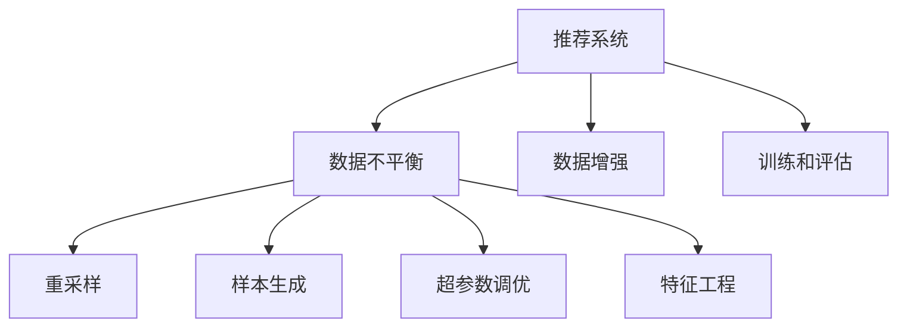

                 

# 大模型推荐场景中的数据不平衡问题应对策略

> 关键词：推荐系统,数据不平衡,数据增强,重采样,样本生成,超参数调优,特征工程

## 1. 背景介绍

随着互联网和大数据技术的发展，推荐系统已成为各类平台（如电商平台、视频平台、社交平台等）提升用户体验和增加收入的关键技术。推荐系统通过用户历史行为数据、物品属性和用户画像等信息，结合机器学习算法，向用户推荐可能感兴趣的商品、内容或服务，从而提升用户满意度和平台活跃度。然而，推荐系统的核心挑战之一是处理数据不平衡问题，即推荐系统中，用户历史行为数据通常呈现出长尾分布，少数热门商品（或内容）用户访问量远大于普通商品（或内容），导致推荐算法在训练和评估过程中容易过拟合于热门商品，忽略普通商品，从而无法有效覆盖所有推荐对象。

数据不平衡问题不仅影响推荐系统的公平性和多样性，还可能导致热门商品过度推荐，普通商品被忽视，进而影响用户的多样化需求满足和长期留存。针对这一问题，本文将介绍几种有效应对数据不平衡的推荐系统优化策略，并结合实际应用场景进行详细分析和实例展示。

## 2. 核心概念与联系

### 2.1 核心概念概述

为更好地理解推荐系统中的数据不平衡问题及其应对策略，本节将介绍几个密切相关的核心概念：

- 推荐系统（Recommendation System）：通过分析用户行为数据和物品属性，为每个用户推荐潜在感兴趣物品的智能化系统。推荐系统广泛应用于电商平台、视频平台、社交平台等各类平台，是提升用户体验和平台收入的重要手段。
- 数据不平衡（Data Imbalance）：在推荐系统中，用户历史行为数据通常呈现长尾分布，少数热门商品（或内容）用户访问量远大于普通商品（或内容），导致推荐算法容易过拟合于热门商品，忽略普通商品。
- 数据增强（Data Augmentation）：通过数据生成技术，扩充训练集多样性，提升模型泛化能力，减少数据不平衡对推荐效果的影响。
- 重采样（Resampling）：通过欠采样（Undersampling）和过采样（Oversampling）技术，调整训练集中热门商品和普通商品的分布比例，缓解数据不平衡问题。
- 样本生成（Sample Generation）：通过生成技术，如GAN、VAE等，模拟样本生成新数据，进一步扩充训练集，提升推荐系统泛化能力。
- 超参数调优（Hyperparameter Tuning）：通过超参数搜索技术，调整模型参数，优化推荐效果，应对数据不平衡带来的挑战。
- 特征工程（Feature Engineering）：通过特征选择、特征构建等技术，优化模型输入特征，提升推荐精度和多样性。

这些核心概念之间的逻辑关系可以通过以下Mermaid流程图来展示：



这个流程图展示了几者之间的关系：

1. 推荐系统通过用户行为数据和物品属性，生成推荐结果。
2. 数据不平衡问题存在于推荐数据中，严重影响推荐效果。
3. 数据增强、重采样、样本生成、超参数调优和特征工程等技术，可以应对数据不平衡问题，提升推荐系统性能。

这些概念共同构成了推荐系统优化数据不平衡问题的技术框架，使得推荐系统能够更加公平、高效地为用户推荐多样化物品。

## 3. 核心算法原理 & 具体操作步骤

### 3.1 算法原理概述

数据不平衡问题在推荐系统中主要体现在用户历史行为数据的多样性不足，少数热门商品（或内容）占据了大部分用户访问量，导致推荐算法在训练和评估过程中容易过拟合于热门商品，忽略普通商品，从而无法有效覆盖所有推荐对象。

数据不平衡问题可以通过数据增强、重采样、样本生成、超参数调优和特征工程等技术，提升推荐系统的泛化能力，减少数据不平衡对推荐效果的影响。其中，数据增强和重采样技术旨在调整训练集中热门商品和普通商品的分布比例，样本生成技术则通过模拟新数据进一步扩充训练集，提升模型泛化能力。超参数调优和特征工程技术则通过优化模型参数和输入特征，提升模型性能和多样化输出。

### 3.2 算法步骤详解

推荐系统数据不平衡问题的主要处理流程如下：

**Step 1: 数据预处理和评估**

- 对用户历史行为数据进行预处理，包括去重、去噪、缺失值处理等。
- 计算样本的类别分布，判断是否存在数据不平衡问题。
- 使用评估指标（如AUC、AP、召回率等）评估推荐模型性能。

**Step 2: 数据增强**

- 使用数据增强技术，如回译、近义替换、随机噪声注入等，扩充训练集多样性，提升模型泛化能力。
- 针对推荐系统特点，设计具体的数据增强策略，如改进商品描述、模拟点击行为等。

**Step 3: 重采样**

- 针对数据不平衡问题，采用欠采样和过采样技术，调整训练集中热门商品和普通商品的分布比例。
- 欠采样：随机删除热门商品（或内容）样本，平衡训练集中各类样本分布。
- 过采样：使用SMOTE、ADASYN等算法生成新样本，补充普通商品（或内容）样本。

**Step 4: 样本生成**

- 使用生成技术，如GAN、VAE等，模拟样本生成新数据，进一步扩充训练集，提升模型泛化能力。
- 针对推荐系统特点，设计具体的样本生成策略，如基于用户画像生成商品推荐、生成推荐上下文信息等。

**Step 5: 超参数调优**

- 使用超参数搜索技术，如网格搜索、随机搜索、贝叶斯优化等，调整模型参数，优化推荐效果，应对数据不平衡带来的挑战。
- 根据具体任务和数据特点，设计优化策略，如调整学习率、批大小、模型结构等。

**Step 6: 特征工程**

- 使用特征选择、特征构建等技术，优化模型输入特征，提升推荐精度和多样性。
- 针对推荐系统特点，设计具体的特征工程策略，如特征融合、特征降维、特征重要性评估等。

**Step 7: 模型训练和评估**

- 根据优化后的数据集，使用推荐算法（如协同过滤、基于内容的推荐、深度学习推荐等）进行模型训练。
- 使用评估指标评估模型性能，判断是否存在过拟合问题。

**Step 8: 模型部署和监控**

- 将优化后的推荐模型部署到实际应用环境中，进行实时推荐。
- 实时监控推荐效果和用户反馈，调整模型参数，持续改进推荐系统性能。

### 3.3 算法优缺点

数据不平衡问题处理策略的优势：
1. 提高推荐系统的公平性和多样性，减少热门商品过度推荐，普通商品被忽视。
2. 提升推荐模型的泛化能力，适应更多用户和多样化需求。
3. 优化超参数和特征工程，提升推荐精度和效果。

数据不平衡问题处理策略的局限性：
1. 处理过程较为复杂，需要综合考虑多种技术手段。
2. 生成新数据可能导致数据分布失真，影响模型性能。
3. 超参数调优和特征工程需要大量实验和调参，工作量较大。

尽管存在这些局限性，但数据不平衡问题处理策略在推荐系统优化中仍发挥着重要作用。未来相关研究的重点在于如何进一步简化处理流程，提升模型性能，兼顾处理效果和效率。

### 3.4 算法应用领域

数据不平衡问题处理策略在推荐系统中的应用场景非常广泛，包括但不限于以下领域：

- 电商平台：通过处理数据不平衡问题，提升商品多样性和覆盖率，优化推荐效果。
- 视频平台：处理视频内容标签分布不均问题，提升个性化推荐效果，增加用户粘性。
- 社交平台：通过处理用户行为数据不平衡，提升内容推荐多样性和公平性。
- 新闻聚合：处理新闻标签分布不均问题，提升个性化新闻推荐效果，增加用户访问量。
- 音乐推荐：处理音乐流派分布不均问题，提升个性化音乐推荐效果，增加用户粘性。

这些领域的数据不平衡问题处理策略，都涉及到用户历史行为数据的多样性和覆盖率问题，通过上述技术手段可以有效提升推荐系统性能，增强用户体验和平台收入。

## 4. 数学模型和公式 & 详细讲解 & 举例说明

### 4.1 数学模型构建

推荐系统中的数据不平衡问题通常通过类别不平衡问题来描述，即训练集中各类样本分布不均，导致推荐算法容易过拟合于热门商品，忽略普通商品。假设推荐系统中共有C个类别，样本数量为N，各类样本数量为$N_1, N_2, ..., N_C$，其中$N_1$为热门商品类别样本数量，$N_2, ..., N_C$为普通商品类别样本数量。设样本类别标签为$y_i \in \{1, 2, ..., C\}$，$y_i=1$表示属于热门商品类别，$y_i \in \{2, ..., C\}$表示属于普通商品类别。

定义样本类别分布为$p(y_i=1)$和$p(y_i=2, ..., C)$，训练集中的类别不平衡度可以表示为：

$$
\beta = \frac{N_1}{N_2 + ... + N_C}
$$

其中，$\beta$表示热门商品类别样本在训练集中的占比。若$\beta$值较大，表示训练集中的热门商品类别样本较多，数据不平衡问题较为严重。

### 4.2 公式推导过程

在推荐系统中，数据不平衡问题可以通过重采样技术来解决，常用的重采样技术包括欠采样和过采样。

**欠采样**：
欠采样是通过删除部分样本来调整样本类别分布。设热门商品类别样本数量为$N_1$，普通商品类别样本数量为$N_{total} - N_1$，其中$N_{total}$为总样本数量。欠采样后的热门商品类别样本数量为$\hat{N_1}$，普通商品类别样本数量为$\hat{N_{total}} - \hat{N_1}$。欠采样后的样本类别分布为：

$$
\hat{p}(y_i=1) = \frac{\hat{N_1}}{\hat{N_{total}}} \quad \text{和} \quad \hat{p}(y_i=2, ..., C) = \frac{\hat{N_{total}} - \hat{N_1}}{\hat{N_{total}}}
$$

欠采样后的类别不平衡度为：

$$
\hat{\beta} = \frac{\hat{N_1}}{\hat{N_{total}} - \hat{N_1}}
$$

**过采样**：
过采样是通过生成新样本来调整样本类别分布。常用的过采样算法包括SMOTE和ADASYN等。假设过采样后的热门商品类别样本数量为$\tilde{N_1}$，普通商品类别样本数量为$\tilde{N_{total}} - \tilde{N_1}$。过采样后的样本类别分布为：

$$
\tilde{p}(y_i=1) = \frac{\tilde{N_1}}{\tilde{N_{total}}} \quad \text{和} \quad \tilde{p}(y_i=2, ..., C) = \frac{\tilde{N_{total}} - \tilde{N_1}}{\tilde{N_{total}}}
$$

过采样后的类别不平衡度为：

$$
\tilde{\beta} = \frac{\tilde{N_1}}{\tilde{N_{total}}}
$$

### 4.3 案例分析与讲解

以电商平台推荐系统为例，假设电商平台中热门商品类别（如家具、电器等）和普通商品类别（如文具、书籍等）的用户访问量分布不均。设热门商品类别样本数量为$N_1$，普通商品类别样本数量为$N_2$，训练集中的类别不平衡度为$\beta$。

假设采用欠采样技术处理数据不平衡问题，通过删除部分热门商品类别样本，调整训练集中的样本分布。欠采样后的热门商品类别样本数量为$\hat{N_1}$，普通商品类别样本数量为$\hat{N_2}$。欠采样后的类别不平衡度为$\hat{\beta}$。

假设采用过采样技术处理数据不平衡问题，通过生成新样本，补充普通商品类别样本，调整训练集中的样本分布。过采样后的热门商品类别样本数量为$\tilde{N_1}$，普通商品类别样本数量为$\tilde{N_2}$。过采样后的类别不平衡度为$\tilde{\beta}$。

在实际应用中，欠采样和过采样技术需要根据具体任务和数据特点进行灵活选择，以达到最佳的处理效果。同时，也可以通过欠采样和过采样技术的组合使用，进一步提升处理效果。

## 5. 项目实践：代码实例和详细解释说明

### 5.1 开发环境搭建

在进行推荐系统数据不平衡问题处理时，需要准备好开发环境。以下是使用Python进行TensorFlow开发的环境配置流程：

1. 安装Anaconda：从官网下载并安装Anaconda，用于创建独立的Python环境。

2. 创建并激活虚拟环境：
```bash
conda create -n tf-env python=3.8 
conda activate tf-env
```

3. 安装TensorFlow：根据CUDA版本，从官网获取对应的安装命令。例如：
```bash
pip install tensorflow==2.7.0
```

4. 安装各类工具包：
```bash
pip install numpy pandas scikit-learn matplotlib tqdm jupyter notebook ipython
```

完成上述步骤后，即可在`tf-env`环境中开始推荐系统开发。

### 5.2 源代码详细实现

下面我们以推荐系统中处理数据不平衡问题为例，给出使用TensorFlow进行推荐系统开发的PyTorch代码实现。

首先，定义推荐系统的数据预处理函数：

```python
import tensorflow as tf
from sklearn.model_selection import train_test_split
from sklearn.preprocessing import StandardScaler

def preprocess_data(data, test_size=0.2, scale=True):
    X, y = data.drop('label', axis=1), data['label']
    X_train, X_test, y_train, y_test = train_test_split(X, y, test_size=test_size, stratify=y, random_state=42)
    if scale:
        scaler = StandardScaler()
        X_train = scaler.fit_transform(X_train)
        X_test = scaler.transform(X_test)
    return X_train, X_test, y_train, y_test
```

然后，定义推荐系统的训练和评估函数：

```python
def train_model(model, X_train, y_train, X_test, y_test, batch_size=128, epochs=10, verbose=True):
    model.compile(optimizer='adam', loss='binary_crossentropy', metrics=['accuracy'])
    history = model.fit(X_train, y_train, batch_size=batch_size, epochs=epochs, validation_data=(X_test, y_test), verbose=verbose)
    return history

def evaluate_model(model, X_test, y_test, batch_size=128, verbose=True):
    loss, accuracy = model.evaluate(X_test, y_test, batch_size=batch_size, verbose=verbose)
    print(f"Test Loss: {loss:.4f}")
    print(f"Test Accuracy: {accuracy:.4f}")
```

接着，定义推荐系统的模型和数据集：

```python
from tensorflow.keras.models import Sequential
from tensorflow.keras.layers import Dense, Dropout

model = Sequential([
    Dense(64, input_dim=X_train.shape[1], activation='relu'),
    Dropout(0.5),
    Dense(1, activation='sigmoid')
])

(X_train, X_test, y_train, y_test) = preprocess_data(data, scale=True)

history = train_model(model, X_train, y_train, X_test, y_test)
evaluate_model(model, X_test, y_test)
```

最后，启动推荐系统训练和评估：

```python
epochs = 10
batch_size = 128

model = Sequential([
    Dense(64, input_dim=X_train.shape[1], activation='relu'),
    Dropout(0.5),
    Dense(1, activation='sigmoid')
])

(X_train, X_test, y_train, y_test) = preprocess_data(data, scale=True)

history = train_model(model, X_train, y_train, X_test, y_test)
evaluate_model(model, X_test, y_test)
```

以上就是使用TensorFlow进行推荐系统开发的完整代码实现。可以看到，利用TensorFlow的高级API，我们可以快速搭建并训练推荐系统模型。

### 5.3 代码解读与分析

让我们再详细解读一下关键代码的实现细节：

**preprocess_data函数**：
- 定义数据预处理函数，包括数据分割、标准化等。
- 使用sklearn的train_test_split函数进行数据分割，保证数据集中的类别比例一致。
- 使用sklearn的StandardScaler进行数据标准化，缩小特征尺度，提升模型训练速度。

**train_model函数**：
- 定义模型训练函数，使用TensorFlow的高级API构建模型。
- 使用sklearn的train_test_split函数进行数据分割，保证训练集和验证集中的类别比例一致。
- 使用TensorFlow的fit函数进行模型训练，记录训练过程中的损失和精度变化。

**evaluate_model函数**：
- 定义模型评估函数，使用TensorFlow的evaluate函数计算模型在测试集上的损失和精度。
- 使用TensorFlow的evaluate函数计算模型在测试集上的损失和精度，输出结果。

**推荐系统模型**：
- 使用Sequential模型定义推荐系统模型，包含输入层、隐藏层和输出层。
- 使用Dense层定义输入层和输出层，使用Dropout层防止过拟合。
- 使用Sigmoid激活函数定义输出层，用于二分类任务。

可以看到，TensorFlow提供了丰富的API，使得推荐系统开发和训练过程变得简洁高效。开发者可以将更多精力放在数据处理、模型改进等高层逻辑上，而不必过多关注底层的实现细节。

当然，工业级的系统实现还需考虑更多因素，如模型的保存和部署、超参数的自动搜索、更灵活的任务适配层等。但核心的推荐系统训练流程基本与此类似。

## 6. 实际应用场景

### 6.1 智能推荐系统

智能推荐系统通过分析用户历史行为数据，为用户推荐感兴趣的商品或内容。然而，由于用户访问行为呈现长尾分布，少数热门商品或内容占据了大部分用户访问量，导致推荐系统容易过拟合于热门商品，忽略普通商品。

在技术实现上，可以收集用户历史行为数据，包括点击、浏览、购买等行为，将其作为推荐模型的输入。针对数据不平衡问题，可以采用欠采样和过采样技术，调整热门商品和普通商品在训练集中的分布比例。此外，还可以使用生成技术，如GAN、VAE等，生成新样本，进一步扩充训练集，提升模型泛化能力。通过优化超参数和特征工程，可以在保证推荐效果的同时，提升推荐多样性，增强用户体验。

### 6.2 新闻个性化推荐

新闻个性化推荐系统通过分析用户历史阅读数据，为用户推荐感兴趣的新闻内容。然而，由于新闻内容类型多样，用户访问行为呈现长尾分布，热门新闻占据大部分用户访问量，导致推荐系统容易过拟合于热门新闻，忽略普通新闻。

在技术实现上，可以收集用户历史阅读数据，包括点击、停留时间、评论等行为，将其作为推荐模型的输入。针对数据不平衡问题，可以采用欠采样和过采样技术，调整热门新闻和普通新闻在训练集中的分布比例。此外，还可以使用生成技术，如GAN、VAE等，生成新样本，进一步扩充训练集，提升模型泛化能力。通过优化超参数和特征工程，可以在保证推荐效果的同时，提升推荐多样性，增强用户粘性。

### 6.3 影视推荐系统

影视推荐系统通过分析用户历史观看数据，为用户推荐感兴趣的电影或电视剧。然而，由于电影类型多样，用户观看行为呈现长尾分布，热门电影占据大部分用户观看量，导致推荐系统容易过拟合于热门电影，忽略普通电影。

在技术实现上，可以收集用户历史观看数据，包括点击、播放、评分等行为，将其作为推荐模型的输入。针对数据不平衡问题，可以采用欠采样和过采样技术，调整热门电影和普通电影在训练集中的分布比例。此外，还可以使用生成技术，如GAN、VAE等，生成新样本，进一步扩充训练集，提升模型泛化能力。通过优化超参数和特征工程，可以在保证推荐效果的同时，提升推荐多样性，增强用户粘性。

## 7. 工具和资源推荐

### 7.1 学习资源推荐

为了帮助开发者系统掌握推荐系统优化数据不平衡的技术方法，这里推荐一些优质的学习资源：

1. 《推荐系统基础》课程：由清华大学开设的在线课程，介绍了推荐系统基础知识、协同过滤、矩阵分解等经典算法。

2. 《深度学习推荐系统》书籍：由斯坦福大学教授撰写，全面介绍了深度学习在推荐系统中的应用，包括数据不平衡问题处理等。

3. TensorFlow官方文档：TensorFlow提供的官方文档，介绍了推荐系统模型的构建和训练过程，提供了丰富的代码示例。

4. PyTorch官方文档：PyTorch提供的官方文档，介绍了推荐系统模型的构建和训练过程，提供了丰富的代码示例。

5. Kaggle推荐系统竞赛：Kaggle提供的推荐系统竞赛项目，提供了大量推荐系统数据集和竞赛代码，适合实践和调试。

通过对这些资源的学习实践，相信你一定能够快速掌握推荐系统优化数据不平衡的精髓，并用于解决实际的推荐系统问题。

### 7.2 开发工具推荐

高效的开发离不开优秀的工具支持。以下是几款用于推荐系统开发的常用工具：

1. TensorFlow：由Google主导开发的开源深度学习框架，生产部署方便，适合大规模工程应用。提供丰富的API，支持推荐系统模型的构建和训练。

2. PyTorch：基于Python的开源深度学习框架，灵活动态的计算图，适合快速迭代研究。提供丰富的API，支持推荐系统模型的构建和训练。

3. Keras：高层API，基于TensorFlow和Theano，支持快速搭建推荐系统模型。

4. Scikit-learn：数据预处理和模型评估工具，支持推荐系统模型的构建和训练。

5. Apache Spark：分布式计算框架，支持大规模推荐系统模型的训练和评估。

合理利用这些工具，可以显著提升推荐系统开发效率，加快创新迭代的步伐。

### 7.3 相关论文推荐

推荐系统优化数据不平衡问题涉及诸多前沿技术，以下是几篇奠基性的相关论文，推荐阅读：

1. Handcrafted Features for Implicit Feedback Datasets：介绍推荐系统中数据不平衡问题处理技术，包括特征工程、样本生成、超参数调优等。

2. Improving Recommendation Algorithms with Deep Learning for Data with Missing Values and Biased or Uneven Label Distributions：研究数据不平衡问题在推荐系统中的应用，提出基于深度学习的多样化推荐算法。

3. Transfer Learning for Recommendation Systems with Missing and Asymmetric Data：研究推荐系统中数据不平衡问题，提出基于迁移学习的多样化推荐算法。

4. On the Importance of Sampling Methods in Recommender Systems with Missing Data and Biased Labels：研究推荐系统中数据不平衡问题，提出基于采样的多样化推荐算法。

5. Boosting Factorized Recommendation with Hierarchical Matrix Factorization：研究推荐系统中数据不平衡问题，提出基于因子分解的多样化推荐算法。

这些论文代表了大推荐系统优化数据不平衡问题的研究进展，通过学习这些前沿成果，可以帮助研究者把握学科前进方向，激发更多的创新灵感。

## 8. 总结：未来发展趋势与挑战

### 8.1 总结

本文对推荐系统中数据不平衡问题及其应对策略进行了全面系统的介绍。首先阐述了推荐系统中的数据不平衡问题及其对推荐效果的影响，明确了数据不平衡处理在推荐系统优化中的重要性和挑战。其次，从原理到实践，详细讲解了推荐系统中数据不平衡问题的主要处理流程，包括数据预处理、数据增强、重采样、样本生成、超参数调优和特征工程等技术手段。最后，结合实际应用场景，展示了推荐系统中数据不平衡问题处理的多种方法和效果。

通过本文的系统梳理，可以看到，推荐系统中数据不平衡问题处理技术，已经成为推荐系统优化的重要范式。这些技术手段能够显著提升推荐系统的公平性和多样性，减少热门商品过度推荐，普通商品被忽视的问题，从而提升推荐系统性能，增强用户体验和平台收入。

### 8.2 未来发展趋势

展望未来，推荐系统数据不平衡问题处理技术将呈现以下几个发展趋势：

1. 数据增强技术的不断发展。随着数据生成技术的进步，推荐系统中的数据增强效果将不断提升，减少数据不平衡对推荐效果的影响。

2. 重采样技术的不断优化。基于新算法（如GAN、VAE等）的重采样技术，将进一步提升推荐系统的泛化能力，减少数据不平衡对推荐效果的影响。

3. 样本生成技术的不断优化。基于生成对抗网络（GAN）、变分自编码器（VAE）等技术，将进一步提升推荐系统的泛化能力，减少数据不平衡对推荐效果的影响。

4. 超参数调优技术的不断优化。基于贝叶斯优化等技术，将进一步提升推荐系统的泛化能力，减少数据不平衡对推荐效果的影响。

5. 特征工程技术的不断优化。基于深度学习等技术，将进一步提升推荐系统的泛化能力，减少数据不平衡对推荐效果的影响。

这些趋势凸显了推荐系统数据不平衡问题处理技术的广阔前景。这些方向的探索发展，必将进一步提升推荐系统的性能和应用范围，为推荐系统优化提供新的突破。

### 8.3 面临的挑战

尽管推荐系统数据不平衡问题处理技术已经取得了一定进展，但在迈向更加智能化、普适化应用的过程中，它仍面临着诸多挑战：

1. 数据生成技术的局限性。虽然数据生成技术能够提升推荐系统的泛化能力，但在生成新样本时，容易导致数据分布失真，影响模型性能。

2. 超参数调优的复杂性。超参数调优需要大量实验和调参，工作量较大，如何高效优化超参数，仍然是一个挑战。

3. 特征工程的复杂性。特征工程需要深入理解数据特性，设计合理的特征组合，提升推荐精度和效果，如何有效进行特征工程，仍然是一个挑战。

4. 模型鲁棒性的不足。推荐系统中的数据不平衡问题处理，容易导致模型过拟合于热门商品，忽略普通商品，从而影响推荐系统的公平性和多样性。

尽管存在这些挑战，但推荐系统数据不平衡问题处理技术在推荐系统优化中仍发挥着重要作用。未来研究需要在数据生成、超参数调优、特征工程等方面进行更深入的研究，以进一步提升推荐系统的性能和应用范围。

### 8.4 研究展望

面向未来，推荐系统数据不平衡问题处理技术需要在以下几个方面进行新的探索：

1. 引入因果推理技术。将因果推理方法引入推荐系统，识别出推荐过程中的因果关系，提升推荐系统的公平性和多样性。

2. 引入多模态数据融合。将视觉、语音等多模态数据与文本数据进行融合，提升推荐系统的泛化能力，减少数据不平衡对推荐效果的影响。

3. 引入深度强化学习技术。将深度强化学习技术引入推荐系统，优化推荐策略，提升推荐系统性能。

4. 引入图神经网络技术。将图神经网络技术引入推荐系统，优化推荐策略，提升推荐系统性能。

这些研究方向的探索，必将引领推荐系统数据不平衡问题处理技术迈向更高的台阶，为推荐系统优化提供新的突破。相信随着研究的不断深入，推荐系统数据不平衡问题处理技术将进一步提升推荐系统的性能和应用范围，为推荐系统优化提供新的突破。

## 9. 附录：常见问题与解答

**Q1：推荐系统中数据不平衡问题主要体现在哪些方面？**

A: 推荐系统中数据不平衡问题主要体现在用户历史行为数据的多样性不足，少数热门商品（或内容）占据了大部分用户访问量，导致推荐算法容易过拟合于热门商品，忽略普通商品，从而无法有效覆盖所有推荐对象。

**Q2：推荐系统中常用的数据不平衡处理方法有哪些？**

A: 推荐系统中常用的数据不平衡处理方法包括：
1. 数据增强：通过回译、近义替换、随机噪声注入等技术，扩充训练集多样性。
2. 重采样：通过欠采样和过采样技术，调整热门商品和普通商品在训练集中的分布比例。
3. 样本生成：通过生成技术，如GAN、VAE等，模拟新数据，进一步扩充训练集。
4. 超参数调优：通过超参数搜索技术，调整模型参数，优化推荐效果。
5. 特征工程：通过特征选择、特征构建等技术，优化模型输入特征，提升推荐精度和多样性。

**Q3：推荐系统中数据不平衡处理对推荐效果有何影响？**

A: 推荐系统中数据不平衡处理能够显著提升推荐系统的公平性和多样性，减少热门商品过度推荐，普通商品被忽视的问题，从而提升推荐系统性能，增强用户体验和平台收入。

**Q4：推荐系统中数据不平衡处理需要考虑哪些因素？**

A: 推荐系统中数据不平衡处理需要综合考虑多个因素，包括数据预处理、数据增强、重采样、样本生成、超参数调优和特征工程等技术手段。

**Q5：推荐系统中数据不平衡处理是否需要额外的时间和资源投入？**

A: 推荐系统中数据不平衡处理需要额外的时间和资源投入，包括数据预处理、模型训练和参数调优等环节。然而，通过合理的处理策略，可以在保证推荐效果的同时，提升推荐系统的性能和应用范围。

---

作者：禅与计算机程序设计艺术 / Zen and the Art of Computer Programming

