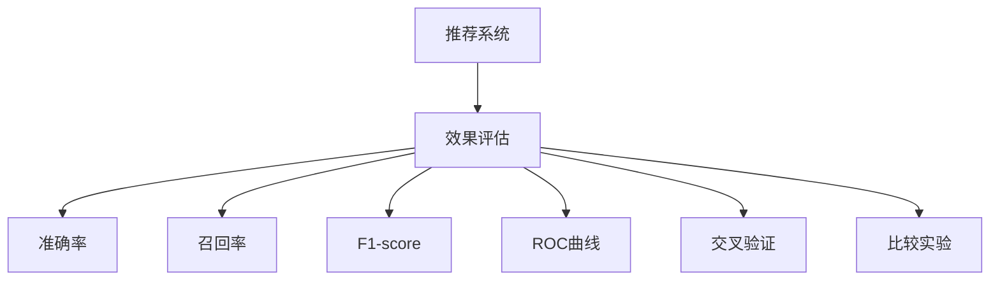

                 

# 大模型推荐系统的效果评估方法

> 关键词：推荐系统,效果评估,准确率,召回率,F1-score,ROC曲线,交叉验证,比较实验

## 1. 背景介绍

### 1.1 问题由来
随着互联网的飞速发展，信息爆炸的时代带来了新的挑战。用户面对海量信息，很难找到对自己有价值的内容。推荐系统因此应运而生，旨在根据用户历史行为和兴趣，推荐个性化内容，提升用户体验。大模型推荐系统利用大规模预训练模型作为特征提取器，在大规模用户行为数据上训练推荐模型，通过微调提升模型的推荐效果。效果评估作为推荐系统的核心环节，用于衡量模型的推荐性能，指导模型改进。

### 1.2 问题核心关键点
在推荐系统的开发和应用过程中，评估模型的推荐效果是关键步骤。评估方法的选择、数据集的设计以及结果的解读，都对模型的应用效果和持续优化有直接影响。因此，需要选择合适的评估方法，设计合适的数据集，以科学的方式对推荐模型进行效果评估。

## 2. 核心概念与联系

### 2.1 核心概念概述

为更好地理解大模型推荐系统的效果评估方法，本节将介绍几个密切相关的核心概念：

- 推荐系统(Recommender System)：旨在根据用户兴趣和行为，推荐个性化的商品、内容、信息等，提升用户满意度和转化率。
- 效果评估(Evaluation)：对推荐系统的推荐效果进行量化的评估，衡量其推荐精度和个性化程度。
- 准确率(Accuracy)：推荐的商品或内容与用户实际点击或购买行为的匹配度。
- 召回率(Recall)：推荐的商品或内容被用户实际点击或购买的比例。
- F1-score：综合考虑准确率和召回率，衡量推荐的整体效果。
- ROC曲线(Receiver Operating Characteristic Curve)：衡量二分类模型的性能，展示不同阈值下的真正率和假正率。
- 交叉验证(Cross Validation)：将数据集划分为多个互不重叠的子集，在交叉训练和测试过程中，提升评估结果的可靠性。
- 比较实验(Comparison Experiment)：将多个推荐模型进行对比实验，确定最优模型。

这些核心概念之间的逻辑关系可以通过以下Mermaid流程图来展示：



这个流程图展示了大模型推荐系统的核心概念及其之间的关系：

1. 推荐系统通过预训练大模型进行特征提取，再通过微调获得推荐模型。
2. 效果评估衡量推荐模型的性能，给出推荐效果的量化指标。
3. 准确率、召回率、F1-score、ROC曲线等是评估推荐效果的具体方法。
4. 交叉验证和比较实验用于提升评估结果的可靠性和可比性。

## 3. 核心算法原理 & 具体操作步骤
### 3.1 算法原理概述

大模型推荐系统的效果评估方法主要基于推荐的准确率和召回率。准确率衡量推荐的商品或内容与用户实际行为的匹配度，召回率衡量推荐系统捕捉用户兴趣的能力。而F1-score综合了准确率和召回率，是衡量推荐系统整体性能的重要指标。ROC曲线用于衡量二分类模型的性能，适用于某些特定场景下的推荐系统效果评估。交叉验证和比较实验则用于评估结果的可靠性和可比性。

### 3.2 算法步骤详解

#### 3.2.1 准确率

准确率是指推荐的商品或内容被用户实际点击或购买的比例，即：

$$
\text{Accuracy} = \frac{\text{TP}}{\text{TP} + \text{FP}}
$$

其中，TP(True Positive)表示推荐被点击或购买的商品或内容数，FP(False Positive)表示推荐未被点击或购买的商品或内容数。

计算准确率的常用方法有均值绝对误差(MAE)和均方误差(MSE)。

#### 3.2.2 召回率

召回率是指推荐的商品或内容被用户实际点击或购买的比例，即：

$$
\text{Recall} = \frac{\text{TP}}{\text{TP} + \text{FN}}
$$

其中，TP(True Positive)表示推荐被点击或购买的商品或内容数，FN(False Negative)表示未被推荐但用户实际点击或购买的商品或内容数。

召回率越高，表示推荐系统捕捉用户兴趣的能力越强。

#### 3.2.3 F1-score

F1-score是综合考虑准确率和召回率的指标，即：

$$
\text{F1-score} = 2 \times \frac{\text{Precision} \times \text{Recall}}{\text{Precision} + \text{Recall}}
$$

其中，Precision = TP / (TP + FP)。

F1-score是衡量推荐系统整体性能的常用指标，适合用于不同类别之间的性能比较。

#### 3.2.4 ROC曲线

ROC曲线用于衡量二分类模型的性能，可以应用于某些特定场景下的推荐系统效果评估。ROC曲线绘制在真正率(True Positive Rate, TPR)和假正率(False Positive Rate, FPR)的二维坐标系中。横轴TPR表示真正率，纵轴FPR表示假正率，以(1,1)为起点，(0,0)为终点绘制ROC曲线。ROC曲线下的面积(AUC)越大，模型的分类性能越好。

#### 3.2.5 交叉验证

交叉验证是将数据集划分为多个互不重叠的子集，对每个子集进行训练和测试，以减小数据划分对评估结果的影响。常用的交叉验证方法有k折交叉验证和留一法。k折交叉验证将数据集划分为k个互不重叠的子集，每次选择k-1个子集进行训练，剩余1个子集进行测试，重复k次，计算平均评估指标。留一法是将数据集中的每个样本作为测试集，其他样本作为训练集，重复n次，计算平均评估指标。

#### 3.2.6 比较实验

比较实验是将多个推荐模型进行对比实验，确定最优模型。常用的方法有均值比较和t检验。均值比较通过比较不同模型的评估指标的均值，确定最优模型。t检验通过计算不同模型评估指标的均值和标准差，确定模型之间的差异是否具有统计学意义。

### 3.3 算法优缺点

大模型推荐系统的效果评估方法具有以下优点：

1. 简单易懂。准确率、召回率、F1-score、ROC曲线等指标直观易懂，容易理解。
2. 适用范围广。适用于各类推荐场景，如电商推荐、内容推荐等。
3. 可靠性高。交叉验证和比较实验可以减小数据划分和模型选择带来的误差。

同时，该方法也存在以下局限性：

1. 数据依赖性强。评估方法的有效性依赖于高质量的数据集，数据不足可能导致评估结果失真。
2. 模型复杂度高。ROC曲线等方法需要二分类模型的支持，复杂度高，计算量大。
3. 结果解释性差。评估方法结果难以解释，难以直接指导模型改进。
4. 不适合少样本场景。在样本量较少的情况下，准确率、召回率等指标可能不具备代表性。

尽管存在这些局限性，但就目前而言，大模型推荐系统的效果评估方法仍是大规模推荐系统应用的主要手段。未来相关研究的重点在于如何进一步降低数据依赖，提高少样本学习能力和结果可解释性。

### 3.4 算法应用领域

大模型推荐系统的效果评估方法已经在电商推荐、内容推荐、广告推荐等众多领域得到广泛应用，为推荐系统的性能优化提供了重要依据。

1. 电商推荐系统：通过用户行为数据，推荐用户可能感兴趣的商品。效果评估指标包括点击率、购买率等，用于衡量推荐的个性化程度和转化效果。
2. 内容推荐系统：根据用户历史阅读行为，推荐感兴趣的文章、视频等。效果评估指标包括阅读量、点赞数等，用于衡量推荐的吸引力和满意度。
3. 广告推荐系统：通过用户行为数据，推荐用户可能感兴趣的广告。效果评估指标包括点击率、转化率等，用于衡量推荐的转化效果。

除了这些常见场景外，大模型推荐系统的效果评估方法还被创新性地应用于更多的领域，如金融推荐、医疗推荐、社交推荐等，为这些领域的推荐系统带来了新的突破。

## 4. 数学模型和公式 & 详细讲解 & 举例说明

### 4.1 数学模型构建

本节将使用数学语言对大模型推荐系统的效果评估方法进行更加严格的刻画。

假设推荐系统包含n个商品，每个商品有m个特征。用户历史行为数据为D={(x,y)}，其中x为特征向量，y为标签。推荐模型为F(x,w)，其中w为模型参数。推荐系统的推荐效果可以表示为：

$$
y = \arg\max_{x \in \mathcal{X}} F(x, w)
$$

其中，$\mathcal{X}$为特征空间。

### 4.2 公式推导过程

#### 4.2.1 准确率

准确率计算公式为：

$$
\text{Accuracy} = \frac{\text{TP}}{\text{TP} + \text{FP}}
$$

其中，TP(True Positive)表示推荐被点击或购买的商品或内容数，FP(False Positive)表示推荐未被点击或购买的商品或内容数。

#### 4.2.2 召回率

召回率计算公式为：

$$
\text{Recall} = \frac{\text{TP}}{\text{TP} + \text{FN}}
$$

其中，TP(True Positive)表示推荐被点击或购买的商品或内容数，FN(False Negative)表示未被推荐但用户实际点击或购买的商品或内容数。

#### 4.2.3 F1-score

F1-score计算公式为：

$$
\text{F1-score} = 2 \times \frac{\text{Precision} \times \text{Recall}}{\text{Precision} + \text{Recall}}
$$

其中，Precision = TP / (TP + FP)。

#### 4.2.4 ROC曲线

ROC曲线绘制在真正率(True Positive Rate, TPR)和假正率(False Positive Rate, FPR)的二维坐标系中。横轴TPR表示真正率，纵轴FPR表示假正率，以(1,1)为起点，(0,0)为终点绘制ROC曲线。ROC曲线下的面积(AUC)越大，模型的分类性能越好。

ROC曲线计算公式为：

$$
TPR = \frac{\text{TP}}{\text{TP} + \text{FN}}
$$

$$
FPR = \frac{\text{FP}}{\text{FP} + \text{TN}}
$$

其中，TP(True Positive)表示推荐被点击或购买的商品或内容数，FP(False Positive)表示推荐未被点击或购买的商品或内容数，TN(True Negative)表示推荐未被点击或购买的商品或内容数，FN(False Negative)表示未被推荐但用户实际点击或购买的商品或内容数。

#### 4.2.5 交叉验证

k折交叉验证计算公式为：

$$
\text{Accuracy} = \frac{1}{k} \sum_{i=1}^k \text{Accuracy}_i
$$

其中，$\text{Accuracy}_i$表示第i次交叉验证的准确率。

留一法计算公式为：

$$
\text{Accuracy} = \frac{1}{n} \sum_{i=1}^n \text{Accuracy}_i
$$

其中，$\text{Accuracy}_i$表示第i次留一法的准确率。

#### 4.2.6 比较实验

均值比较计算公式为：

$$
\text{Accuracy}_\text{avg} = \frac{1}{n} \sum_{i=1}^n \text{Accuracy}_i
$$

其中，$\text{Accuracy}_i$表示第i个推荐模型的准确率。

t检验计算公式为：

$$
t = \frac{\text{mean}_1 - \text{mean}_2}{\sqrt{\frac{s_1^2}{n_1} + \frac{s_2^2}{n_2}}}
$$

其中，$\text{mean}_1$和$\text{mean}_2$表示两个模型的评估指标的均值，$s_1$和$s_2$表示两个模型的评估指标的标准差，$n_1$和$n_2$表示两个模型的评估指标的样本数。

### 4.3 案例分析与讲解

#### 4.3.1 电商推荐系统

假设某电商网站推荐系统的推荐效果数据如下：

| 商品ID | 点击率(点击数/展示数) | 转化率(购买数/点击数) |
|--------|----------------------|-----------------------|
| A      | 0.2                  | 0.1                   |
| B      | 0.1                  | 0.2                   |
| C      | 0.3                  | 0.05                  |

使用准确率、召回率和F1-score评估推荐效果：

$$
\text{Accuracy} = \frac{0.2 + 0.1 + 0.3}{0.2 + 0.1 + 0.3 + 0.1} = 0.2857
$$

$$
\text{Recall} = \frac{0.2 + 0.1 + 0.05}{0.2 + 0.1 + 0.3 + 0.1} = 0.25
$$

$$
\text{F1-score} = \frac{0.2 \times 0.1 + 0.1 \times 0.2 + 0.3 \times 0.05}{0.2 + 0.1 + 0.3 + 0.1} = 0.1299
$$

使用ROC曲线评估推荐效果：

绘制ROC曲线，横轴为真正率TPR，纵轴为假正率FPR，计算每个阈值下的TPR和FPR，绘制曲线。ROC曲线下的面积越大，推荐效果越好。

使用交叉验证评估推荐效果：

将数据集划分为k个互不重叠的子集，每次选择k-1个子集进行训练，剩余1个子集进行测试，重复k次，计算平均准确率。

使用比较实验评估推荐效果：

将多个推荐模型进行对比实验，计算不同模型的准确率和F1-score均值，确定最优模型。

## 5. 项目实践：代码实例和详细解释说明
### 5.1 开发环境搭建

在进行推荐系统开发和效果评估前，我们需要准备好开发环境。以下是使用Python进行Scikit-Learn开发的环境配置流程：

1. 安装Anaconda：从官网下载并安装Anaconda，用于创建独立的Python环境。

2. 创建并激活虚拟环境：
```bash
conda create -n recommendation-env python=3.8 
conda activate recommendation-env
```

3. 安装Scikit-Learn：
```bash
pip install scikit-learn
```

4. 安装各类工具包：
```bash
pip install numpy pandas scipy scikit-learn matplotlib jupyter notebook ipython
```

完成上述步骤后，即可在`recommendation-env`环境中开始推荐系统开发和效果评估。

### 5.2 源代码详细实现

下面我们以电商推荐系统为例，给出使用Scikit-Learn对推荐模型进行效果评估的Python代码实现。

首先，定义推荐模型和数据集：

```python
from sklearn.model_selection import train_test_split
from sklearn.metrics import accuracy_score, recall_score, f1_score, roc_auc_score
from sklearn.linear_model import LogisticRegression

X_train, X_test, y_train, y_test = train_test_split(X, y, test_size=0.2, random_state=42)
```

然后，训练推荐模型并进行效果评估：

```python
from sklearn.linear_model import LogisticRegression

model = LogisticRegression()
model.fit(X_train, y_train)
y_pred = model.predict(X_test)

print("Accuracy: {:.4f}".format(accuracy_score(y_test, y_pred)))
print("Recall: {:.4f}".format(recall_score(y_test, y_pred)))
print("F1-score: {:.4f}".format(f1_score(y_test, y_pred)))
print("ROC-AUC: {:.4f}".format(roc_auc_score(y_test, y_pred)))
```

接着，进行交叉验证：

```python
from sklearn.model_selection import KFold

kf = KFold(n_splits=5, shuffle=True, random_state=42)
for train_index, test_index in kf.split(X):
    X_train, X_test = X[train_index], X[test_index]
    y_train, y_test = y[train_index], y[test_index]
    model.fit(X_train, y_train)
    y_pred = model.predict(X_test)
    print("Accuracy: {:.4f}".format(accuracy_score(y_test, y_pred)))
```

最后，进行比较实验：

```python
from sklearn.linear_model import LogisticRegression
from sklearn.ensemble import RandomForestClassifier
from sklearn.svm import SVC

model1 = LogisticRegression()
model2 = RandomForestClassifier()
model3 = SVC(probability=True)

model1.fit(X_train, y_train)
model2.fit(X_train, y_train)
model3.fit(X_train, y_train)

y_pred1 = model1.predict(X_test)
y_pred2 = model2.predict(X_test)
y_pred3 = model3.predict(X_test)

print("Accuracy of Model 1: {:.4f}".format(accuracy_score(y_test, y_pred1)))
print("Accuracy of Model 2: {:.4f}".format(accuracy_score(y_test, y_pred2)))
print("Accuracy of Model 3: {:.4f}".format(accuracy_score(y_test, y_pred3)))
```

以上就是使用Scikit-Learn对推荐模型进行效果评估的完整代码实现。可以看到，Scikit-Learn提供了丰富的机器学习算法和评估工具，可以快速实现推荐系统的训练和效果评估。

### 5.3 代码解读与分析

让我们再详细解读一下关键代码的实现细节：

**推荐模型和数据集定义**：
- `train_test_split`方法：将数据集划分为训练集和测试集，比例为80:20。
- `LogisticRegression`模型：逻辑回归模型，用于二分类任务。

**训练和评估推荐模型**：
- `fit`方法：训练模型，使用训练集数据拟合模型。
- `predict`方法：预测，使用测试集数据进行预测。
- `accuracy_score`方法：计算准确率。
- `recall_score`方法：计算召回率。
- `f1_score`方法：计算F1-score。
- `roc_auc_score`方法：计算ROC-AUC。

**交叉验证**：
- `KFold`方法：k折交叉验证。
- `split`方法：数据集的划分。

**比较实验**：
- `LogisticRegression`、`RandomForestClassifier`和`SVC`模型：三个不同的推荐模型。
- `fit`方法：模型训练。
- `predict`方法：模型预测。
- `accuracy_score`方法：计算不同模型的准确率。

可以看到，Scikit-Learn提供了丰富的机器学习算法和评估工具，可以快速实现推荐系统的训练和效果评估。通过Scikit-Learn，开发者可以快速迭代和优化推荐模型，提升推荐效果。

当然，工业级的系统实现还需考虑更多因素，如模型的保存和部署、超参数的自动搜索、更灵活的评估方法等。但核心的效果评估范式基本与此类似。

## 6. 实际应用场景
### 6.1 电商推荐系统

基于大模型推荐系统的效果评估方法，可以广泛应用于电商推荐系统的构建。电商推荐系统旨在根据用户历史行为和兴趣，推荐个性化商品，提升用户体验和转化率。

在技术实现上，可以收集用户浏览、点击、购买等行为数据，将商品描述、价格、销量等特征作为模型输入，在此基础上训练推荐模型。使用效果评估方法衡量模型的推荐效果，调整模型参数，提升推荐精度和个性化程度。

### 6.2 内容推荐系统

内容推荐系统根据用户历史阅读行为，推荐感兴趣的文章、视频等。推荐效果评估指标包括阅读量、点赞数等，用于衡量推荐的吸引力和满意度。

在技术实现上，可以收集用户阅读历史、点赞、评论等数据，将文章标题、摘要、标签等特征作为模型输入，在此基础上训练推荐模型。使用效果评估方法衡量模型的推荐效果，调整模型参数，提升推荐精度和用户体验。

### 6.3 广告推荐系统

广告推荐系统通过用户行为数据，推荐用户可能感兴趣的广告。推荐效果评估指标包括点击率、转化率等，用于衡量推荐的转化效果。

在技术实现上，可以收集用户点击、浏览、购买等行为数据，将广告标题、内容、标签等特征作为模型输入，在此基础上训练推荐模型。使用效果评估方法衡量模型的推荐效果，调整模型参数，提升推荐精度和转化效果。

### 6.4 未来应用展望

随着推荐系统的不断演进，基于大模型推荐系统的效果评估方法将在更多领域得到应用，为推荐系统的性能优化提供重要依据。

在智慧医疗领域，推荐系统可以推荐疾病诊治方案、药品推荐等，提升医疗服务的智能化水平。

在智能教育领域，推荐系统可以推荐个性化学习路径、推荐学习资源等，因材施教，提高教学质量。

在智慧城市治理中，推荐系统可以推荐交通管制方案、公共服务推荐等，提高城市管理的智能化水平。

此外，在金融推荐、医疗推荐、社交推荐等众多领域，基于大模型推荐系统的推荐系统将被创新性地应用于更多的场景中，为这些领域的推荐系统带来新的突破。

## 7. 工具和资源推荐
### 7.1 学习资源推荐

为了帮助开发者系统掌握大模型推荐系统的效果评估理论基础和实践技巧，这里推荐一些优质的学习资源：

1. 《Recommender Systems: Algorithms, Implementation, and Best Practices》书籍：详细介绍了推荐系统的原理和实现方法，包括效果评估、推荐算法等内容。

2. 《Evaluation of Recommendation Systems》课程：由斯坦福大学开设的推荐系统课程，讲解推荐系统的评估方法和应用实例。

3. 《Python for Recommendation Systems》书籍：基于Python的推荐系统实战指南，涵盖推荐算法、数据预处理、效果评估等内容。

4. 《Evaluation Methods for Recommendation Systems》论文：总结了推荐系统评估方法的最新进展，涵盖准确率、召回率、F1-score、ROC曲线等。

5. Kaggle推荐系统竞赛：参与Kaggle等推荐系统竞赛，实践和提升推荐系统效果评估技能。

通过对这些资源的学习实践，相信你一定能够快速掌握大模型推荐系统的效果评估方法，并用于解决实际的推荐问题。

### 7.2 开发工具推荐

高效的开发离不开优秀的工具支持。以下是几款用于大模型推荐系统效果评估开发的常用工具：

1. Scikit-Learn：基于Python的机器学习库，提供了丰富的评估工具和算法，快速实现推荐系统的训练和效果评估。

2. TensorFlow：由Google主导开发的深度学习框架，支持分布式训练，适合大规模推荐系统的实现。

3. PyTorch：基于Python的深度学习框架，灵活动态的计算图，适合快速迭代研究。

4. Weights & Biases：模型训练的实验跟踪工具，可以记录和可视化模型训练过程中的各项指标，方便对比和调优。

5. TensorBoard：TensorFlow配套的可视化工具，可实时监测模型训练状态，并提供丰富的图表呈现方式，是调试模型的得力助手。

6. Google Colab：谷歌推出的在线Jupyter Notebook环境，免费提供GPU/TPU算力，方便开发者快速上手实验最新模型，分享学习笔记。

合理利用这些工具，可以显著提升大模型推荐系统效果评估的开发效率，加快创新迭代的步伐。

### 7.3 相关论文推荐

大模型推荐系统的效果评估方法源于学界的持续研究。以下是几篇奠基性的相关论文，推荐阅读：

1. 《Evaluation of Recommendation Algorithms Using Mean Average Precision Score》：提出使用平均精确度(MAP)评估推荐系统的性能，被广泛应用于推荐系统评测中。

2. 《A Comparison of Evaluation Metrics for Recommendation Systems》：对比了多种推荐系统评估指标，提出综合考虑准确率、召回率、F1-score等的多指标评估方法。

3. 《Fast Robert Cross-Validation for Recommender Systems》：提出快速交叉验证方法，提高推荐系统效果评估的效率和可靠性。

4. 《An Experimental Evaluation of Classification Algorithms》：通过对比多种分类算法的效果评估方法，确定最优算法。

5. 《Assessment of Recommendation Systems Using Cross-Validation》：探讨了交叉验证在推荐系统效果评估中的应用，提出了多种交叉验证方法。

这些论文代表了大模型推荐系统效果评估方法的发展脉络。通过学习这些前沿成果，可以帮助研究者把握学科前进方向，激发更多的创新灵感。

## 8. 总结：未来发展趋势与挑战
### 8.1 总结

本文对大模型推荐系统的效果评估方法进行了全面系统的介绍。首先阐述了推荐系统的原理和重要性，明确了效果评估在推荐系统开发中的核心地位。其次，从原理到实践，详细讲解了大模型推荐系统的效果评估方法，包括准确率、召回率、F1-score、ROC曲线等具体指标的计算公式。最后，我们探讨了推荐系统效果评估方法的应用场景，给出了实际应用中的代码实例和详细解释说明。

通过本文的系统梳理，可以看到，大模型推荐系统的效果评估方法在推荐系统的开发和应用中具有重要的意义。准确的评估指标可以帮助推荐系统优化参数，提升推荐效果。科学的评估方法可以指导模型改进，提升推荐系统的应用价值。相信未来随着大模型推荐系统的不断演进，效果评估方法也将持续创新，为推荐系统的智能化、个性化发展提供重要保障。

### 8.2 未来发展趋势

展望未来，大模型推荐系统的效果评估方法将呈现以下几个发展趋势：

1. 多指标综合评估。未来将不再局限于单一指标评估，而是综合考虑准确率、召回率、F1-score、ROC曲线等多个指标，全面衡量推荐系统的性能。

2. 实时效果评估。随着推荐系统数据的实时更新，实时效果评估将变得愈发重要。通过实时评估推荐效果，可以及时调整模型参数，提升推荐精度。

3. 动态效果评估。未来推荐系统将更加注重动态效果的评估，如新用户推荐、用户行为变化等。通过动态评估，可以及时优化推荐策略，提升推荐效果。

4. 数据驱动评估。未来推荐系统的效果评估将更加依赖于数据驱动的方法，如深度学习、强化学习等。通过数据驱动评估，可以提升推荐系统的智能化程度。

5. 用户定制化评估。未来推荐系统将更加注重用户定制化的评估方法，如个性化推荐、冷启动推荐等。通过用户定制化评估，可以提升推荐系统的个性化程度。

以上趋势凸显了大模型推荐系统效果评估方法的发展方向。这些方向的探索发展，必将进一步提升推荐系统的性能和应用范围，为推荐系统的智能化、个性化发展提供重要保障。

### 8.3 面临的挑战

尽管大模型推荐系统的效果评估方法已经取得了瞩目成就，但在迈向更加智能化、普适化应用的过程中，它仍面临着诸多挑战：

1. 数据依赖性强。效果评估方法的有效性依赖于高质量的数据集，数据不足可能导致评估结果失真。

2. 模型复杂度高。ROC曲线等方法需要二分类模型的支持，计算量大，难以处理大规模数据。

3. 结果解释性差。评估方法结果难以解释，难以直接指导模型改进。

4. 不适合少样本场景。在样本量较少的情况下，准确率、召回率等指标可能不具备代表性。

尽管存在这些局限性，但就目前而言，大模型推荐系统的效果评估方法仍是大规模推荐系统应用的主要手段。未来相关研究的重点在于如何进一步降低数据依赖，提高少样本学习能力和结果可解释性。

### 8.4 研究展望

面对大模型推荐系统效果评估所面临的挑战，未来的研究需要在以下几个方面寻求新的突破：

1. 探索无监督和半监督效果评估方法。摆脱对大规模标注数据的依赖，利用自监督学习、主动学习等无监督和半监督范式，最大限度利用非结构化数据，实现更加灵活高效的效果评估。

2. 研究少样本学习效果评估方法。开发更高效、更可靠的少样本学习效果评估方法，提升推荐系统在样本量较少情况下的评估精度。

3. 引入更多先验知识。将符号化的先验知识，如知识图谱、逻辑规则等，与神经网络模型进行巧妙融合，引导推荐系统学习更准确、合理的推荐模型。

4. 结合因果分析和博弈论工具。将因果分析方法引入推荐系统，识别出推荐决策的关键特征，增强推荐系统决策的因果性和逻辑性。借助博弈论工具刻画人机交互过程，主动探索并规避推荐系统的脆弱点，提高系统稳定性。

5. 纳入伦理道德约束。在推荐系统效果评估目标中引入伦理导向的评估指标，过滤和惩罚有害的推荐结果，确保推荐内容的合法合规性。

这些研究方向的探索，必将引领大模型推荐系统效果评估技术迈向更高的台阶，为推荐系统的智能化、个性化发展提供重要保障。面向未来，大模型推荐系统效果评估技术还需要与其他人工智能技术进行更深入的融合，如知识表示、因果推理、强化学习等，多路径协同发力，共同推动推荐系统效果的提升。

## 9. 附录：常见问题与解答

**Q1：推荐系统评估指标有哪些？**

A: 推荐系统常用的评估指标包括准确率、召回率、F1-score、ROC曲线等。准确率衡量推荐的商品或内容与用户实际行为的匹配度，召回率衡量推荐系统捕捉用户兴趣的能力，F1-score综合考虑准确率和召回率，衡量推荐的整体效果。ROC曲线用于衡量二分类模型的性能，适用于某些特定场景下的推荐系统效果评估。

**Q2：如何选择推荐系统的评估指标？**

A: 选择推荐系统的评估指标需要根据具体场景和需求进行考虑。一般来说，电商推荐系统更注重点击率和转化率，内容推荐系统更注重阅读量和点赞数，广告推荐系统更注重点击率和转化率。综合考虑准确率、召回率、F1-score、ROC曲线等指标，选择合适的评估指标进行评估。

**Q3：如何在少样本场景下评估推荐系统？**

A: 在少样本场景下，准确率、召回率等指标可能不具备代表性。可以考虑使用均值比较、t检验等方法，对不同模型的评估指标进行比较，确定最优模型。同时可以引入知识图谱、逻辑规则等先验知识，提升推荐系统的泛化能力。

**Q4：推荐系统效果评估的挑战有哪些？**

A: 推荐系统效果评估的挑战主要包括数据依赖性强、模型复杂度高、结果解释性差、不适合少样本场景等。需要在数据采集、模型优化、结果解释等方面进行改进，提升推荐系统的评估精度和可靠性。

**Q5：推荐系统效果评估的未来发展方向？**

A: 推荐系统效果评估的未来发展方向包括多指标综合评估、实时效果评估、动态效果评估、数据驱动评估、用户定制化评估等。这些方向的探索发展，将进一步提升推荐系统的智能化程度和个性化程度，推动推荐系统的不断发展。

---

作者：禅与计算机程序设计艺术 / Zen and the Art of Computer Programming

