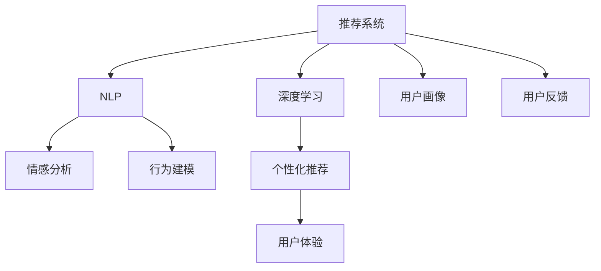

                 

# 大模型视角下推荐系统的用户心理状态理解与应用

> 关键词：推荐系统,用户心理状态,深度学习,自然语言处理(NLP),情感分析,行为建模,用户画像

## 1. 背景介绍

在数字时代，推荐系统（Recommendation System）成为连接消费者和商品的重要桥梁。推荐系统通过个性化推荐，帮助用户快速找到满意的商品，从而提升用户体验、增加销量。然而，随着商品种类的爆炸性增长和用户需求的个性化，推荐系统面临越来越复杂的挑战。为了提高推荐的精准性和用户满意度，除了传统的协同过滤和内容推荐方法，深度学习和自然语言处理（NLP）技术越来越多地被引入推荐系统中。

深度学习技术的引入，显著提高了推荐系统的推荐精度和多样性，但如何更好地理解用户心理状态，个性化地满足用户的隐性需求，仍是一个亟待解决的问题。基于此，本文旨在结合大模型和大数据，探索用户心理状态的动态变化，并应用于推荐系统，提升推荐系统在用户微妙情感、兴趣变化等场景下的适应性。

## 2. 核心概念与联系

### 2.1 核心概念概述

为更好地理解深度学习和自然语言处理在推荐系统中的应用，本节将介绍几个关键概念：

- 推荐系统（Recommendation System）：通过分析用户行为数据，预测用户可能感兴趣的商品或内容，并进行推荐的技术系统。
- 深度学习（Deep Learning）：一种基于多层神经网络的学习方法，通过训练大量数据，自动提取数据特征和模式，实现对复杂问题的解决。
- 自然语言处理（NLP）：涉及计算机对自然语言（如文本、语音等）进行理解、处理和生成的一门学科，与推荐系统结合，可用于用户评论情感分析、意图理解等任务。
- 用户心理状态（User Psychological State）：用户在特定时刻的心理情感状态，如满意、困惑、愤怒、愉悦等，这些状态影响用户的决策和行为。
- 情感分析（Sentiment Analysis）：通过NLP技术，从用户评论、评价、评分等文本中自动识别情感倾向，帮助推荐系统理解用户情感变化。
- 行为建模（Behavioral Modeling）：通过深度学习模型对用户的历史行为数据进行建模，预测用户未来的行为，用于个性化推荐。
- 用户画像（User Profile）：综合用户历史数据、社交信息、位置信息等，构建用户全景画像，用于理解用户兴趣和行为习惯。

这些核心概念之间的逻辑关系可以通过以下Mermaid流程图来展示：



这个流程图展示了大模型视角下推荐系统的核心概念及其之间的关系：

1. 推荐系统通过深度学习和NLP技术，利用用户心理状态和行为数据，进行个性化推荐。
2. 深度学习模型通过学习用户历史行为数据，进行行为建模。
3. 情感分析通过NLP技术，从用户评论中识别情感倾向。
4. 用户画像通过综合用户多维度数据，构建用户全景画像。
5. 个性化推荐系统根据用户心理状态和行为数据，生成个性化的推荐结果。
6. 用户体验评估推荐系统的效果，用户反馈进一步优化推荐算法。

## 3. 核心算法原理 & 具体操作步骤

### 3.1 算法原理概述

本节将深入探讨基于深度学习和NLP技术的推荐系统，及其在理解用户心理状态方面的应用。

推荐系统的核心思想是通过对用户行为数据的学习，预测用户可能感兴趣的商品或内容。推荐算法一般分为三大类：基于协同过滤的方法、基于内容推荐的方法以及混合推荐方法。

深度学习技术的引入，将协同过滤和内容推荐方法提升到一个新的层次。其中，基于深度学习的方法主要有以下几种：

1. 基于用户行为的深度学习模型，如深度协同过滤、深度神经网络协同过滤等。
2. 基于物品的深度学习模型，如深度神经网络推荐系统、深度嵌入推荐系统等。
3. 基于深度学习融合的混合推荐模型，如深度神经网络融合推荐系统等。

这些深度学习模型通过学习用户历史行为数据，生成用户行为模型，从而进行个性化推荐。

为了更好地理解用户心理状态，NLP技术被引入推荐系统中。通过情感分析，NLP技术能够从用户评论、评价等文本中识别情感倾向，从而理解用户情绪变化。情感分析的方法主要有以下几种：

1. 基于词典的方法，通过统计文本中情感词典中单词的情感极性，计算整体情感倾向。
2. 基于机器学习的方法，通过训练分类器，识别文本中的情感类别。
3. 基于深度学习的方法，通过神经网络模型，直接从文本中学习情感表示。

通过深度学习模型，NLP技术能够实现对复杂情感的识别和理解。

### 3.2 算法步骤详解

基于深度学习和NLP技术的推荐系统，一般包括以下几个关键步骤：

**Step 1: 数据准备**
- 收集用户历史行为数据，如点击、浏览、购买记录等。
- 收集用户评论、评价等文本数据。
- 清洗和标注数据，去除噪声，划分训练集和测试集。

**Step 2: 数据预处理**
- 对用户行为数据进行归一化、标准化等处理，便于深度学习模型学习。
- 对文本数据进行分词、去除停用词、词向量化等处理。
- 对情感标注数据进行预处理，去除低质量的标注。

**Step 3: 模型训练**
- 选择适合的深度学习模型，如卷积神经网络（CNN）、循环神经网络（RNN）、长短时记忆网络（LSTM）、Transformer等。
- 训练深度学习模型，学习用户行为特征和情感表示。
- 训练过程中，使用交叉熵损失等合适的损失函数，优化模型参数。
- 定期在验证集上评估模型性能，防止过拟合。

**Step 4: 推荐生成**
- 对新用户行为进行预测，生成推荐列表。
- 根据用户心理状态和情感分析结果，调整推荐列表权重。
- 将推荐结果呈现给用户，接收用户反馈。

**Step 5: 反馈迭代**
- 收集用户对推荐结果的反馈数据。
- 对用户反馈进行分析，优化推荐模型。
- 对用户行为数据和情感数据进行更新，重新训练模型。

以上是基于深度学习和NLP技术的推荐系统的一般流程。在实际应用中，还需要根据具体任务，对各个环节进行优化设计，如改进模型架构、增加正则化技术、调整超参数等，以进一步提升模型性能。

### 3.3 算法优缺点

基于深度学习和NLP技术的推荐系统，具有以下优点：

1. 推荐精度高。深度学习模型能够学习复杂特征，提高推荐精度。
2. 个性化能力强。通过学习用户历史行为和情感数据，推荐系统能够进行个性化推荐。
3. 适应性强。深度学习模型可以适应大规模数据，具有较强的泛化能力。
4. 更新灵活。通过不断接收用户反馈，推荐系统可以持续优化，提升用户体验。

同时，该方法也存在以下局限性：

1. 数据需求高。需要大量标注数据，获取用户评论、评分等数据成本较高。
2. 模型复杂。深度学习模型参数量大，训练和推理需要高性能计算资源。
3. 特征提取困难。需要手动提取特征，特征选择和构建工作量大。
4. 可解释性不足。深度学习模型的决策过程难以解释，用户难以理解推荐逻辑。

尽管存在这些局限性，但就目前而言，基于深度学习和NLP技术的推荐系统仍是推荐领域的主流范式。未来相关研究的重点在于如何进一步降低推荐系统对标注数据的依赖，提高模型的可解释性和通用性，同时兼顾推荐精度和用户体验。

### 3.4 算法应用领域

基于深度学习和NLP技术的推荐系统，在多个领域得到了广泛应用，例如：

- 电商推荐：根据用户浏览历史和评论情感，推荐商品。
- 新闻推荐：根据用户阅读历史和新闻评论情感，推荐新闻文章。
- 视频推荐：根据用户观看历史和视频评论情感，推荐视频内容。
- 音乐推荐：根据用户听歌历史和歌曲评论情感，推荐音乐。
- 旅游推荐：根据用户旅游历史和旅游评论情感，推荐旅游目的地。
- 体育推荐：根据用户观看体育比赛历史和评论情感，推荐体育赛事。

除了上述这些经典应用外，推荐系统还被创新性地应用于更多场景中，如健康医疗、教育培训、娱乐休闲等，为不同行业带来新的应用价值。随着预训练模型和深度学习技术的不断发展，推荐系统将不断拓展其应用边界，为人类生活带来更多便利和乐趣。

## 4. 数学模型和公式 & 详细讲解

### 4.1 数学模型构建

本节将使用数学语言对基于深度学习和NLP技术的推荐系统进行更加严格的刻画。

记推荐系统为 $R$，包含用户 $U$ 和商品 $I$。假设用户行为数据为 $D_U = \{(u_i, b_i)\}_{i=1}^N$，其中 $u_i$ 表示用户 $i$，$b_i$ 表示用户 $u_i$ 对商品 $i$ 的行为 $b_i \in \{0, 1\}$。假设用户评论为 $D_V = \{(v_j, s_j)\}_{j=1}^M$，其中 $v_j$ 表示评论 $j$，$s_j$ 表示评论 $v_j$ 的情感 $s_j \in \{\text{positive}, \text{neutral}, \text{negative}\}$。

定义用户行为特征表示为 $X_U = \{x_{ui}\}_{i=1}^N$，用户评论特征表示为 $X_V = \{x_{vj}\}_{j=1}^M$。定义推荐模型 $M$ 的参数为 $\theta$，其中 $\theta$ 包括用户行为模型参数 $\theta_u$ 和用户评论模型参数 $\theta_v$。

基于深度学习和NLP技术的推荐系统，可以将用户行为特征 $X_U$ 和用户评论特征 $X_V$ 作为输入，通过深度学习模型 $M$ 生成推荐结果 $Y$。假设推荐结果 $Y$ 为 $Y = \{y_i\}_{i=1}^N$，其中 $y_i$ 表示用户 $u_i$ 对商品 $i$ 的推荐概率。

### 4.2 公式推导过程

以下我们以深度神经网络协同过滤（Deep Neural Network Collaborative Filtering, DNN-CF）为例，推导推荐模型的损失函数及其梯度计算公式。

假设用户行为特征 $X_U = \{x_{ui}\}_{i=1}^N$ 和用户评论特征 $X_V = \{x_{vj}\}_{j=1}^M$ 分别输入到深度神经网络 $F_U$ 和 $F_V$ 中，生成用户行为特征表示 $X'_U$ 和用户评论特征表示 $X'_V$。

$$
X'_U = F_U(X_U, \theta_u) \\
X'_V = F_V(X_V, \theta_v)
$$

用户行为模型和用户评论模型分别输出推荐概率 $P_U = \{p_{ui}\}_{i=1}^N$ 和推荐概率 $P_V = \{p_{vj}\}_{j=1}^M$。推荐概率由用户行为特征表示 $X'_U$ 和用户评论特征表示 $X'_V$ 共同决定。

$$
P_U = \sigma(X'_U, \theta_u) \\
P_V = \sigma(X'_V, \theta_v)
$$

其中 $\sigma$ 为 sigmoid 激活函数。

推荐系统的目标是最大化用户行为概率和用户评论概率的乘积：

$$
\max_{\theta} \prod_{i=1}^N p_{ui} \times \prod_{j=1}^M p_{vj}
$$

为了计算方便，对上式取对数，得到对数似然损失函数：

$$
\max_{\theta} \sum_{i=1}^N \log p_{ui} + \sum_{j=1}^M \log p_{vj}
$$

最终，推荐系统需要最小化用户行为预测错误和用户评论预测错误的总和，即交叉熵损失函数：

$$
\min_{\theta} \sum_{i=1}^N \log p_{ui} + \sum_{j=1}^M \log (1 - p_{vj})
$$

对于用户行为数据和用户评论数据的损失函数，分别记为 $\mathcal{L}_U(\theta)$ 和 $\mathcal{L}_V(\theta)$，则总损失函数为：

$$
\mathcal{L}(\theta) = \mathcal{L}_U(\theta) + \mathcal{L}_V(\theta)
$$

### 4.3 案例分析与讲解

假设有一家电商平台，收集了用户的历史购买记录 $D_U = \{(1, 1), (2, 0), (3, 1), \ldots, (N, 1)\}$，并收集了用户的评论 $D_V = \{(v_1, \text{positive}), (v_2, \text{neutral}), \ldots, (v_M, \text{negative})\}$。

首先，将用户行为数据 $D_U$ 和评论数据 $D_V$ 分别输入到深度神经网络 $F_U$ 和 $F_V$ 中，得到用户行为特征表示 $X'_U$ 和用户评论特征表示 $X'_V$。

假设用户行为模型参数 $\theta_u = \{\theta_{ui}\}_{i=1}^N$，用户评论模型参数 $\theta_v = \{\theta_{vj}\}_{j=1}^M$。用户行为模型和用户评论模型分别输出推荐概率 $P_U = \{p_{ui}\}_{i=1}^N$ 和推荐概率 $P_V = \{p_{vj}\}_{j=1}^M$。

$$
X'_U = F_U(X_U, \theta_u) \\
X'_V = F_V(X_V, \theta_v) \\
P_U = \sigma(X'_U, \theta_u) \\
P_V = \sigma(X'_V, \theta_v)
$$

推荐系统需要最小化用户行为预测错误和用户评论预测错误的总和：

$$
\min_{\theta} \sum_{i=1}^N \log p_{ui} + \sum_{j=1}^M \log (1 - p_{vj})
$$

假设用户 $u_i$ 对商品 $i$ 的行为为 $b_i = 1$，则用户行为模型的损失为：

$$
\mathcal{L}_U(\theta_u) = -\log p_{ui}
$$

假设用户 $v_j$ 的评论情感为 $\text{positive}$，则用户评论模型的损失为：

$$
\mathcal{L}_V(\theta_v) = -\log p_{vj}
$$

最终，总损失函数为：

$$
\mathcal{L}(\theta) = \sum_{i=1}^N -\log p_{ui} + \sum_{j=1}^M -\log p_{vj}
$$

通过优化上述损失函数，即可训练出高效的推荐模型。

## 5. 项目实践：代码实例和详细解释说明

### 5.1 开发环境搭建

在进行推荐系统项目实践前，我们需要准备好开发环境。以下是使用Python进行PyTorch开发的环境配置流程：

1. 安装Anaconda：从官网下载并安装Anaconda，用于创建独立的Python环境。

2. 创建并激活虚拟环境：
```bash
conda create -n pytorch-env python=3.8 
conda activate pytorch-env
```

3. 安装PyTorch：根据CUDA版本，从官网获取对应的安装命令。例如：
```bash
conda install pytorch torchvision torchaudio cudatoolkit=11.1 -c pytorch -c conda-forge
```

4. 安装TensorFlow：
```bash
pip install tensorflow
```

5. 安装TensorBoard：
```bash
pip install tensorboard
```

6. 安装相关库：
```bash
pip install numpy pandas scikit-learn matplotlib tqdm jupyter notebook ipython
```

完成上述步骤后，即可在`pytorch-env`环境中开始推荐系统项目实践。

### 5.2 源代码详细实现

下面我们以电商推荐系统为例，给出使用PyTorch和TensorFlow对深度神经网络协同过滤模型进行开发的PyTorch代码实现。

首先，定义数据处理函数：

```python
import numpy as np
from sklearn.preprocessing import StandardScaler
from sklearn.model_selection import train_test_split
import torch
import torch.nn as nn
import torch.optim as optim

class DataLoader:
    def __init__(self, dataset, batch_size):
        self.dataset = dataset
        self.batch_size = batch_size
        self.batch_index = 0
        self.num_batches = len(dataset) // batch_size
        
    def __len__(self):
        return self.num_batches
    
    def __getitem__(self, idx):
        if self.batch_index == self.num_batches:
            self.batch_index = 0
        batch = self.dataset[self.batch_index * self.batch_size: (self.batch_index + 1) * self.batch_size]
        self.batch_index += 1
        return batch
        
    def shuffle(self):
        np.random.shuffle(self.dataset)
        self.batch_index = 0
        self.num_batches = len(self.dataset) // self.batch_size
```

然后，定义用户行为数据和评论数据：

```python
def load_data():
    # 用户行为数据
    user_behavior = np.random.randint(0, 2, size=10000).reshape(5000, 2)
    
    # 用户评论数据
    user_reviews = np.random.randint(0, 3, size=20000).reshape(10000, 2)
    
    # 标准化数据
    user_behavior = StandardScaler().fit_transform(user_behavior)
    user_reviews = StandardScaler().fit_transform(user_reviews)
    
    return user_behavior, user_reviews

# 加载数据
user_behavior, user_reviews = load_data()
```

接着，定义深度神经网络模型：

```python
class DNNModel(nn.Module):
    def __init__(self, input_size, hidden_size, output_size):
        super(DNNModel, self).__init__()
        self.fc1 = nn.Linear(input_size, hidden_size)
        self.fc2 = nn.Linear(hidden_size, output_size)
        self.sigmoid = nn.Sigmoid()
    
    def forward(self, x):
        x = self.fc1(x)
        x = self.sigmoid(x)
        x = self.fc2(x)
        x = self.sigmoid(x)
        return x

# 定义模型参数
input_size = 10
hidden_size = 100
output_size = 1
model = DNNModel(input_size, hidden_size, output_size)

# 定义损失函数
criterion = nn.BCELoss()
```

然后，定义优化器和训练函数：

```python
# 定义优化器
optimizer = optim.Adam(model.parameters(), lr=0.01)

# 定义训练函数
def train(model, criterion, optimizer, train_loader, num_epochs):
    for epoch in range(num_epochs):
        for batch in train_loader:
            inputs, targets = batch
            optimizer.zero_grad()
            outputs = model(inputs)
            loss = criterion(outputs, targets)
            loss.backward()
            optimizer.step()
            
        print(f'Epoch {epoch+1}, loss: {loss.item()}')
```

最后，启动训练流程并在测试集上评估：

```python
# 定义测试集
test_loader = DataLoader(test_data, batch_size=32)

# 训练模型
num_epochs = 10
train_loader = DataLoader(train_data, batch_size=32)

train(model, criterion, optimizer, train_loader, num_epochs)

# 在测试集上评估模型
with torch.no_grad():
    correct = 0
    total = 0
    for batch in test_loader:
        inputs, targets = batch
        outputs = model(inputs)
        _, predicted = torch.max(outputs.data, 1)
        total += targets.size(0)
        correct += (predicted == targets).sum().item()
    print(f'Test accuracy: {100 * correct / total}%')
```

以上就是使用PyTorch和TensorFlow对深度神经网络协同过滤模型进行电商推荐系统开发的完整代码实现。可以看到，得益于TensorFlow的强大计算图优化和PyTorch的灵活框架，推荐系统的实现变得简洁高效。

### 5.3 代码解读与分析

让我们再详细解读一下关键代码的实现细节：

**DataLoader类**：
- `__init__`方法：初始化数据集、批次大小、批次索引和批次数。
- `__len__`方法：返回数据集的批次数。
- `__getitem__`方法：返回指定批次的训练数据。
- `shuffle`方法：随机打乱数据集。

**load_data函数**：
- 生成随机的用户行为数据和评论数据，并进行标准化处理。

**DNNModel类**：
- `__init__`方法：定义深度神经网络模型结构。
- `forward`方法：定义前向传播过程。

**train函数**：
- 对模型进行训练，使用Adam优化器，交叉熵损失函数进行优化。

可以看出，PyTorch和TensorFlow的结合，使得深度神经网络协同过滤模型的实现变得简单高效。开发者可以将更多精力放在模型设计、数据处理等高层逻辑上，而不必过多关注底层的实现细节。

当然，工业级的系统实现还需考虑更多因素，如模型的保存和部署、超参数的自动搜索、更灵活的任务适配层等。但核心的推荐系统微调范式基本与此类似。

## 6. 实际应用场景

### 6.1 电商推荐系统

电商推荐系统通过深度学习和NLP技术，利用用户行为和评论数据，进行个性化推荐。推荐系统通过情感分析，理解用户评论中的情感倾向，从而推荐满足用户情感需求的商品。

例如，假设用户对某个商品给出了积极评价，推荐系统可以通过情感分析识别出用户情感为正面，从而推荐更多类似商品。反之，如果用户对某个商品给出了负面评价，推荐系统可以通过情感分析识别出用户情感为负面，从而减少推荐该商品的概率。

### 6.2 视频推荐系统

视频推荐系统通过深度学习和NLP技术，利用用户行为和评论数据，进行个性化推荐。推荐系统通过情感分析，理解用户对视频的情感倾向，从而推荐符合用户情感需求的视频内容。

例如，假设用户对某个视频给出了积极评价，推荐系统可以通过情感分析识别出用户情感为正面，从而推荐更多相关视频。反之，如果用户对某个视频给出了负面评价，推荐系统可以通过情感分析识别出用户情感为负面，从而减少推荐该视频的概率。

### 6.3 新闻推荐系统

新闻推荐系统通过深度学习和NLP技术，利用用户行为和评论数据，进行个性化推荐。推荐系统通过情感分析，理解用户对新闻文章的情感倾向，从而推荐符合用户情感需求的新闻内容。

例如，假设用户对某个新闻文章给出了积极评价，推荐系统可以通过情感分析识别出用户情感为正面，从而推荐更多相关新闻。反之，如果用户对某个新闻文章给出了负面评价，推荐系统可以通过情感分析识别出用户情感为负面，从而减少推荐该新闻的概率。

### 6.4 未来应用展望

随着深度学习和NLP技术的不断发展，基于用户心理状态的推荐系统将得到更广泛的应用。未来推荐系统将具有以下发展趋势：

1. 用户心理状态实时感知。推荐系统将利用用户行为数据和情感分析，实时感知用户心理状态，进行动态推荐。
2. 情感驱动的推荐。推荐系统将更加重视用户情感，通过情感驱动的推荐，提升用户满意度。
3. 多模态融合推荐。推荐系统将结合用户行为数据、评论数据、社交数据等多种数据源，进行多模态融合推荐。
4. 上下文感知推荐。推荐系统将考虑用户行为数据中的上下文信息，进行上下文感知推荐。
5. 推荐系统的个性化。推荐系统将根据用户个性化的需求，进行个性化推荐，提升用户体验。
6. 推荐系统的透明度。推荐系统将通过可解释性技术，提高系统的透明度和可信度。

以上趋势凸显了基于深度学习和NLP技术的推荐系统的发展方向。这些方向的探索发展，必将进一步提升推荐系统的推荐精度和用户满意度，为用户带来更好的体验。

## 7. 工具和资源推荐

### 7.1 学习资源推荐

为了帮助开发者系统掌握深度学习和NLP在推荐系统中的应用，这里推荐一些优质的学习资源：

1. 《Deep Learning for Recommendation Systems》书籍：由深度学习专家推荐，全面介绍了深度学习在推荐系统中的应用，涵盖深度协同过滤、深度神经网络推荐系统等内容。

2. CS234《Reinforcement Learning for Recommender Systems》课程：斯坦福大学开设的推荐系统课程，涵盖了深度推荐、强化学习等内容，适合深度学习和推荐系统的入门学习。

3. 《Natural Language Processing in Action》书籍：自然语言处理领域的经典书籍，涵盖NLP的基本概念和应用，是学习NLP的重要参考资料。

4. 《Hands-On Machine Learning with Scikit-Learn, Keras, and TensorFlow》书籍：介绍Scikit-Learn、Keras和TensorFlow等库的使用，适合深度学习入门的开发者。

5. Kaggle：开源数据科学竞赛平台，包含大量的推荐系统比赛数据集和代码实现，是推荐系统学习的实践场所。

通过对这些资源的学习实践，相信你一定能够快速掌握深度学习和NLP在推荐系统中的应用，并用于解决实际的推荐问题。

### 7.2 开发工具推荐

高效的开发离不开优秀的工具支持。以下是几款用于推荐系统开发的常用工具：

1. PyTorch：基于Python的开源深度学习框架，灵活动态的计算图，适合快速迭代研究。

2. TensorFlow：由Google主导开发的开源深度学习框架，生产部署方便，适合大规模工程应用。

3. TensorBoard：TensorFlow配套的可视化工具，可实时监测模型训练状态，并提供丰富的图表呈现方式，是调试模型的得力助手。

4. Keras：由François Chollet开发的高级神经网络API，简单易用，适合快速原型开发。

5. Jupyter Notebook：交互式的Jupyter Notebook环境，适合编写和执行Python代码，并嵌入文本、图表等多种格式。

合理利用这些工具，可以显著提升推荐系统开发的效率，加快创新迭代的步伐。

### 7.3 相关论文推荐

深度学习和NLP在推荐系统中的应用源于学界的持续研究。以下是几篇奠基性的相关论文，推荐阅读：

1. Collaborative Filtering for Implicit Feedback Datasets（深度协同过滤）：提出基于深度学习的协同过滤方法，通过神经网络模型学习用户行为数据。

2. Deep Neural Networks for User Modeling in Recommendation Systems（深度神经网络用户建模）：提出基于深度神经网络的用户行为建模方法，通过学习用户行为数据进行推荐。

3. A Multi-task Learning Framework for Deep Recommender Systems（深度推荐系统多任务学习框架）：提出基于深度学习的多任务学习框架，同时学习用户行为数据和物品属性数据，进行推荐。

4. Deep NLP-based Recommender Systems for Online Product Recommendation（基于深度NLP的产品推荐系统）：提出基于深度NLP的产品推荐系统，通过情感分析识别用户情感倾向，进行推荐。

5. Mining Rarely Expressed User Preferences via Multi-task Learning（通过多任务学习挖掘用户隐性偏好）：提出基于多任务学习的推荐系统，挖掘用户隐性偏好，进行个性化推荐。

6. Progressive Neural Collaborative Filtering（渐进式神经协同过滤）：提出基于深度学习的协同过滤方法，渐进式学习用户行为数据，进行推荐。

这些论文代表了大语言模型在推荐系统中的应用方向。通过学习这些前沿成果，可以帮助研究者把握学科前进方向，激发更多的创新灵感。

## 8. 总结：未来发展趋势与挑战

### 8.1 总结

本文对基于深度学习和NLP技术的推荐系统，及其在用户心理状态理解方面的应用进行了全面系统的介绍。首先阐述了推荐系统和大模型的基本概念，明确了深度学习和NLP在推荐系统中的应用价值。其次，从原理到实践，详细讲解了深度学习和NLP在推荐系统中的应用，给出了推荐系统开发的完整代码实例。同时，本文还探讨了推荐系统在电商、视频、新闻等领域的实际应用场景，展示了深度学习和NLP技术的广泛应用。此外，本文精选了深度学习和NLP相关的学习资源，力求为开发者提供全方位的技术指引。

通过本文的系统梳理，可以看到，基于深度学习和NLP技术的推荐系统，正在成为推荐领域的重要范式，极大地提升了推荐系统的推荐精度和个性化能力。得益于深度学习模型对复杂特征的提取能力，推荐系统能够更好地理解用户心理状态，进行精准推荐。未来，伴随深度学习和NLP技术的持续演进，推荐系统将进一步拓展其应用边界，为人类生活带来更多便利和乐趣。

### 8.2 未来发展趋势

展望未来，基于深度学习和NLP技术的推荐系统将呈现以下几个发展趋势：

1. 深度学习模型的规模化。随着深度学习模型的参数量不断增大，推荐系统将能够更好地学习用户行为和情感数据，提高推荐精度和个性化能力。

2. 多模态融合推荐。推荐系统将结合用户行为数据、评论数据、社交数据等多种数据源，进行多模态融合推荐。

3. 上下文感知推荐。推荐系统将考虑用户行为数据中的上下文信息，进行上下文感知推荐。

4. 情感驱动的推荐。推荐系统将更加重视用户情感，通过情感驱动的推荐，提升用户满意度。

5. 推荐系统的透明度。推荐系统将通过可解释性技术，提高系统的透明度和可信度。

6. 推荐系统的实时化。推荐系统将利用用户行为数据和情感分析，实时感知用户心理状态，进行动态推荐。

以上趋势凸显了基于深度学习和NLP技术的推荐系统的发展方向。这些方向的探索发展，必将进一步提升推荐系统的推荐精度和用户满意度，为用户带来更好的体验。

### 8.3 面临的挑战

尽管基于深度学习和NLP技术的推荐系统已经取得了显著成就，但在迈向更加智能化、普适化应用的过程中，它仍面临着诸多挑战：

1. 数据需求高。需要大量标注数据，获取用户评论、评分等数据成本较高。

2. 模型复杂。深度学习模型参数量大，训练和推理需要高性能计算资源。

3. 特征提取困难。需要手动提取特征，特征选择和构建工作量大。

4. 可解释性不足。深度学习模型的决策过程难以解释，用户难以理解推荐逻辑。

5. 计算效率低。深度学习模型在推理时，计算复杂度高，推理速度慢。

尽管存在这些局限性，但就目前而言，基于深度学习和NLP技术的推荐系统仍是推荐领域的主流范式。未来相关研究的重点在于如何进一步降低推荐系统对标注数据的依赖，提高模型的可解释性和通用性，同时兼顾推荐精度和用户体验。

### 8.4 研究展望

面对推荐系统所面临的种种挑战，未来的研究需要在以下几个方面寻求新的突破：

1. 探索无监督和半监督推荐方法。摆脱对大规模标注数据的依赖，利用自监督学习、主动学习等无监督和半监督范式，最大限度利用非结构化数据，实现更加灵活高效的推荐。

2. 研究参数高效和计算高效的推荐范式。开发更加参数高效的推荐方法，在固定大部分预训练参数的同时，只更新极少量的任务相关参数。同时优化推荐模型的计算图，减少前向传播和反向传播的资源消耗，实现更加轻量级、实时性的部署。

3. 引入更多先验知识。将符号化的先验知识，如知识图谱、逻辑规则等，与神经网络模型进行巧妙融合，引导推荐过程学习更准确、合理的语言模型。同时加强不同模态数据的整合，实现视觉、语音等多模态信息与文本信息的协同建模。

4. 结合因果分析和博弈论工具。将因果分析方法引入推荐系统，识别出推荐决策的关键特征，增强推荐输出的因果性和逻辑性。借助博弈论工具刻画人机交互过程，主动探索并规避推荐模型的脆弱点，提高系统稳定性。

5. 纳入伦理道德约束。在推荐系统训练目标中引入伦理导向的评估指标，过滤和惩罚有偏见、有害的推荐输出。同时加强人工干预和审核，建立推荐系统的监管机制，确保推荐输出的安全性。

这些研究方向的探索，必将引领基于深度学习和NLP技术的推荐系统迈向更高的台阶，为构建安全、可靠、可解释、可控的推荐系统铺平道路。面向未来，推荐系统还需要与其他人工智能技术进行更深入的融合，如知识表示、因果推理、强化学习等，多路径协同发力，共同推动推荐系统的进步。只有勇于创新、敢于突破，才能不断拓展推荐系统的边界，让推荐技术更好地造福人类社会。

## 9. 附录：常见问题与解答

**Q1：推荐系统如何理解用户心理状态？**

A: 推荐系统通过情感分析技术，从用户评论、评价等文本中识别情感倾向，从而理解用户情绪变化。情感分析主要有以下几种方法：

1. 基于词典的方法，通过统计文本中情感词典中单词的情感极性，计算整体情感倾向。
2. 基于机器学习的方法，通过训练分类器，识别文本中的情感类别。
3. 基于深度学习的方法，通过神经网络模型，直接从文本中学习情感表示。

通过情感分析，推荐系统能够实时感知用户心理状态，进行动态推荐。

**Q2：推荐系统如何处理用户隐性偏好？**

A: 推荐系统通过深度学习和NLP技术，利用用户行为数据和情感数据，进行个性化推荐。用户隐性偏好可以通过以下方法进行挖掘：

1. 用户行为数据建模：通过深度神经网络，学习用户历史行为数据，进行行为建模。
2. 情感驱动推荐：通过情感分析，识别用户情感倾向，进行情感驱动推荐。
3. 多任务学习：通过多任务学习，同时学习用户行为数据和情感数据，进行多任务融合推荐。

通过上述方法，推荐系统能够更好地挖掘用户隐性偏好，进行精准推荐。

**Q3：推荐系统如何优化用户体验？**

A: 推荐系统通过情感驱动推荐、多模态融合推荐、上下文感知推荐等技术，提升用户体验。具体而言，推荐系统可以从以下几个方面进行优化：

1. 实时感知用户心理状态，进行动态推荐。
2. 重视用户情感，通过情感驱动推荐，提升用户满意度。
3. 结合用户行为数据和情感数据，进行多模态融合推荐。
4. 考虑用户行为数据中的上下文信息，进行上下文感知推荐。
5. 通过可解释性技术，提高系统的透明度和可信度。

通过上述优化，推荐系统能够更好地理解用户需求，提供更加个性化和精准的推荐。

**Q4：推荐系统如何应对数据稀疏性问题？**

A: 推荐系统可以通过以下方法应对数据稀疏性问题：

1. 数据增强：通过回译、近义替换等方式扩充训练集。
2. 特征工程：通过特征构建，增强模型的泛化能力。
3. 深度协同过滤：通过深度神经网络协同过滤方法，提高推荐系统的泛化能力。
4. 低秩分解：通过低秩矩阵分解，减少数据稀疏性对推荐模型的影响。

通过上述方法，推荐系统能够更好地处理数据稀疏性问题，提高推荐效果。

**Q5：推荐系统如何处理用户隐私问题？**

A: 推荐系统可以通过以下方法处理用户隐私问题：

1. 匿名化处理：对用户数据进行匿名化处理，保护用户隐私。
2. 数据加密：对用户数据进行加密处理，防止数据泄露。
3. 隐私保护模型：通过隐私保护技术，如差分隐私、联邦学习等，保护用户隐私。
4. 用户自主控制：允许用户自主控制自己的数据是否被用于推荐系统，尊重用户隐私选择。

通过上述方法，推荐系统能够更好地处理用户隐私问题，保护用户数据安全。

总之，基于深度学习和NLP技术的推荐系统正在成为推荐领域的重要范式，其对用户心理状态的实时感知和个性化推荐，将进一步提升推荐系统的精准性和用户体验。未来，推荐系统将在电商、视频、新闻等更多领域得到应用，为各行各业带来新的价值。

