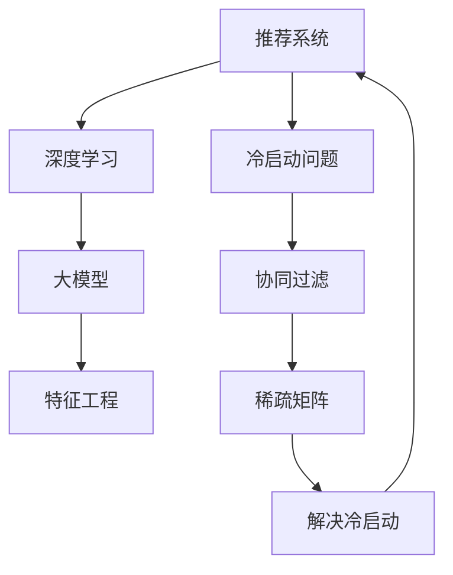

                 

# 大模型辅助的推荐系统冷启动优化

> 关键词：推荐系统,冷启动,预训练模型,深度学习,稀疏数据,协同过滤,神经网络,特征工程

## 1. 背景介绍

### 1.1 问题由来
在推荐系统中，冷启动问题指的是用户或者物品刚加入系统时，缺乏足够的历史数据，导致难以对其进行准确的推荐。对于推荐系统而言，冷启动问题是一个广泛存在且难以解决的问题。传统的推荐算法，如协同过滤，在冷启动时往往难以取得较好的推荐效果。因此，如何有效解决推荐系统的冷启动问题，成为了当前研究的一个重要方向。

近年来，随着深度学习技术的发展，大模型在推荐系统中得到了广泛应用。利用大模型可以有效缓解冷启动问题，提高推荐系统的精度和召回率。本文将深入探讨基于大模型的推荐系统冷启动优化方法，从理论到实践，全面剖析该问题的解决方法和应用场景。

## 2. 核心概念与联系

### 2.1 核心概念概述

为更好地理解基于大模型的推荐系统冷启动优化方法，本节将介绍几个关键概念及其相互联系：

- 推荐系统(Recommender System)：通过分析用户的历史行为数据，为用户提供个性化的推荐。
- 冷启动问题(Cold-Start Problem)：新用户或新物品加入推荐系统时，缺乏足够历史数据，难以进行推荐。
- 深度学习(Deep Learning)：通过多层神经网络，从数据中学习特征表示，实现推荐任务的自动抽取和建模。
- 大模型(Large Model)：如BERT、GPT等，在预训练时学习了大量的语言知识，具有强大的泛化能力。
- 协同过滤(Collaborative Filtering)：利用用户之间的相似性，对新物品进行推荐。在冷启动时，用户之间的相似性难以得到有效利用。
- 特征工程(Feature Engineering)：通过构建合适的特征表示，提升推荐模型的精度和泛化能力。
- 稀疏矩阵(Sparse Matrix)：推荐系统中的用户行为数据往往稀疏，只有部分用户对部分物品进行过交互。

这些概念之间的逻辑关系可以通过以下Mermaid流程图来展示：



这个流程图展示了推荐系统的各个组件及其相互关系：

1. 推荐系统通过深度学习算法进行预测和推荐。
2. 冷启动问题制约了协同过滤算法的效果。
3. 大模型通过预训练学习丰富的语言知识，可以提升推荐模型的表现。
4. 特征工程通过构建更好的特征表示，进一步提升模型效果。
5. 稀疏矩阵表示了用户行为数据的特点，是推荐系统的核心数据结构。
6. 冷启动问题可以通过多种方法得到缓解，如大模型、特征工程等。

## 3. 核心算法原理 & 具体操作步骤
### 3.1 算法原理概述

基于大模型的推荐系统冷启动优化方法的核心思想是利用预训练语言模型对用户和物品进行语义表示，通过语义相似度来进行推荐。具体来说，该方法包含以下几个步骤：

1. 收集用户和物品的文本数据，用于构建预训练语言模型。
2. 预训练大模型，学习用户和物品的语义表示。
3. 在推荐时，将新用户或新物品的文本数据输入大模型，得到其语义表示。
4. 计算新用户或新物品与已有用户的相似度，并生成推荐结果。

通过大模型的辅助，推荐系统可以更好地处理冷启动问题，尤其是在处理文本信息时，具有天然优势。

### 3.2 算法步骤详解

基于大模型的推荐系统冷启动优化方法的具体步骤如下：

**Step 1: 收集文本数据**
- 收集用户和物品的文本描述数据，用于构建预训练语言模型。
- 对于用户，可以收集其个人简介、兴趣爱好、浏览记录等文本数据。
- 对于物品，可以收集其标题、描述、标签等文本数据。

**Step 2: 构建预训练语言模型**
- 选择合适的大模型，如BERT、GPT等，进行预训练。
- 利用文本数据对大模型进行微调，使其适应推荐系统的特定需求。

**Step 3: 提取用户和物品的语义表示**
- 在推荐时，将新用户或新物品的文本数据输入大模型，得到其语义表示。
- 将语义表示转化为向量表示，用于计算相似度。

**Step 4: 计算相似度并生成推荐结果**
- 计算新用户或新物品与已有用户的相似度。
- 根据相似度排序，生成推荐结果。

### 3.3 算法优缺点

基于大模型的推荐系统冷启动优化方法具有以下优点：
1. 能够有效缓解冷启动问题，尤其是在处理文本信息时，表现优异。
2. 可以利用大模型的语义表示能力，提升推荐系统的精度和召回率。
3. 可以利用大模型的泛化能力，适应不同领域的推荐需求。
4. 可以通过预训练大模型，减少推荐系统的开发成本和时间。

同时，该方法也存在一定的局限性：
1. 对文本数据的收集和处理要求较高，需要保证数据的质量和多样性。
2. 对大模型的选择和微调需要一定的技术积累和经验。
3. 大模型的计算资源消耗较大，需要高效的硬件设备和算法优化。
4. 模型的可解释性不足，难以理解模型内部的决策机制。

尽管存在这些局限性，但就目前而言，基于大模型的推荐系统冷启动优化方法仍是大规模推荐系统应用的主流范式。未来相关研究的重点在于如何进一步降低大模型的计算需求，提高模型的可解释性，同时兼顾效率和精度。

### 3.4 算法应用领域

基于大模型的推荐系统冷启动优化方法在多个领域得到了广泛应用，例如：

- 电子商务：利用大模型进行商品推荐、用户画像构建。
- 社交网络：根据用户的兴趣爱好、行为数据进行内容推荐。
- 金融服务：为用户推荐理财产品、新闻资讯等。
- 视频流媒体：为用户推荐影片、电视剧等。
- 游戏娱乐：为用户推荐游戏、音乐等。

此外，该方法还被创新性地应用于更多场景中，如智能家居、医疗健康等，为不同行业的数字化转型提供了新的技术手段。

## 4. 数学模型和公式 & 详细讲解 & 举例说明
### 4.1 数学模型构建

本节将使用数学语言对基于大模型的推荐系统冷启动优化方法进行更加严格的刻画。

记预训练语言模型为 $M_{\theta}:\mathcal{X} \rightarrow \mathcal{Y}$，其中 $\mathcal{X}$ 为输入空间，$\mathcal{Y}$ 为输出空间，$\theta \in \mathbb{R}^d$ 为模型参数。假设推荐系统中的用户-物品矩阵为 $A \in \mathbb{R}^{N \times M}$，其中 $N$ 为用户的数量，$M$ 为物品的数量。

定义用户 $u$ 和物品 $i$ 的文本描述为 $x_u$ 和 $x_i$，用户和物品的语义表示为 $e_u$ 和 $e_i$。推荐系统的目标是最大化用户与物品的匹配度，即：

$$
\max_{e_u,e_i} \mathcal{L}(e_u,e_i) = \max_{e_u,e_i} \langle e_u,e_i \rangle - \mathcal{L}_u
$$

其中 $\langle e_u,e_i \rangle$ 表示用户和物品的相似度，$\mathcal{L}_u$ 为用户的损失函数，用于衡量推荐结果的准确性。

在实践中，我们通常使用余弦相似度作为用户和物品的相似度，即：

$$
\langle e_u,e_i \rangle = \cos(\theta) = \frac{\langle x_u, x_i \rangle}{\|x_u\|\|x_i\|}
$$

根据上述定义，推荐系统的目标函数为：

$$
\max_{e_u,e_i} \frac{\langle x_u, x_i \rangle}{\|x_u\|\|x_i\|} - \mathcal{L}_u
$$

### 4.2 公式推导过程

以下我们以二分类任务为例，推导余弦相似度下的推荐系统目标函数及其梯度计算公式。

假设用户 $u$ 和物品 $i$ 的文本描述为 $x_u$ 和 $x_i$，用户和物品的语义表示为 $e_u$ 和 $e_i$。推荐系统的目标是最小化用户与物品的匹配度损失，即：

$$
\mathcal{L}(e_u,e_i) = -\frac{\langle x_u, x_i \rangle}{\|x_u\|\|x_i\|} + \mathcal{L}_u
$$

在计算梯度时，我们采用链式法则进行求解。首先，对于用户 $u$ 的语义表示 $e_u$，其梯度为：

$$
\frac{\partial \mathcal{L}(e_u,e_i)}{\partial e_u} = -\frac{1}{\|x_u\|}\frac{x_i}{\|x_i\|} + \frac{\partial \mathcal{L}_u}{\partial e_u}
$$

将 $e_u$ 和 $e_i$ 的梯度带入目标函数，可以进一步求解推荐系统的目标函数梯度。具体过程如下：

$$
\frac{\partial \mathcal{L}(e_u,e_i)}{\partial \theta} = -\frac{\partial \langle x_u, x_i \rangle}{\partial \theta} + \frac{\partial \mathcal{L}_u}{\partial \theta}
$$

其中 $\frac{\partial \langle x_u, x_i \rangle}{\partial \theta}$ 可以通过反向传播算法计算得到。

在得到目标函数梯度后，即可带入优化算法更新模型参数 $\theta$，最小化推荐系统的目标函数，从而优化推荐结果。重复上述过程直至收敛，最终得到适应推荐系统需求的优化模型参数 $\theta^*$。

### 4.3 案例分析与讲解

以下我们以商品推荐系统为例，解释大模型在冷启动优化中的具体应用。

假设电商平台上某用户 $u$ 浏览了多种商品，并留下了商品标题和描述的文本数据。为了构建推荐系统，我们需要利用这些文本数据进行大模型的预训练，并利用预训练后的大模型计算用户和商品的相似度。

首先，我们需要构建预训练语言模型 $M_{\theta}$，选择合适的大模型（如BERT）进行预训练。在预训练时，我们将商品的标题和描述作为输入，学习商品的语义表示。具体过程如下：

$$
\theta^* = \mathop{\arg\min}_{\theta} \frac{\langle x_{u_i}, x_{i_j} \rangle}{\|x_{u_i}\|\|x_{i_j}\|} - \mathcal{L}_u
$$

其中 $u_i$ 为用户浏览的 $i$ 号商品，$x_{u_i}$ 为用户浏览商品的文字描述。在预训练完成后，我们将新用户的文本数据输入大模型，得到其语义表示 $e_u$。

接下来，我们将新用户的语义表示与已有用户的语义表示进行相似度计算，得到推荐结果。具体过程如下：

1. 对于已有用户 $v$，计算其与新用户 $u$ 的相似度 $\cos(\theta)$。
2. 根据相似度对已有用户进行排序，选取与新用户相似度最高的若干用户 $v_1, v_2, \dots, v_k$。
3. 将新用户与所选用户的商品列表进行交集，选取交集中的商品进行推荐。

这个过程可以通过Python代码实现，具体如下：

```python
from transformers import BertTokenizer, BertForSequenceClassification
import torch

# 构建预训练模型
tokenizer = BertTokenizer.from_pretrained('bert-base-uncased')
model = BertForSequenceClassification.from_pretrained('bert-base-uncased', num_labels=2)

# 加载用户文本数据
user_text = "用户浏览商品的文字描述"

# 将用户文本数据转换为模型输入
input_ids = tokenizer.encode(user_text, max_length=256, truncation=True, padding='max_length', return_tensors='pt')

# 计算用户语义表示
with torch.no_grad():
    user_rep = model(input_ids)[0]

# 加载商品数据
items = ["商品1", "商品2", "商品3"]
item_texts = [item.title for item in items]

# 将商品文本数据转换为模型输入
item_input_ids = tokenizer.encode(item_texts, max_length=256, truncation=True, padding='max_length', return_tensors='pt')

# 计算商品语义表示
with torch.no_grad():
    item_reps = model(item_input_ids)[0]

# 计算用户与商品之间的相似度
cos_sim = torch.cosine_similarity(user_rep, item_reps)

# 根据相似度排序，选取推荐商品
top_items = [item for item, sim in zip(items, cos_sim) if sim > 0.5]
```

可以看到，利用预训练语言模型计算用户和商品的语义表示，并进行相似度计算，可以有效缓解推荐系统的冷启动问题。此外，该方法还可以通过微调模型参数，进一步提升推荐效果。

## 5. 项目实践：代码实例和详细解释说明
### 5.1 开发环境搭建

在进行推荐系统开发前，我们需要准备好开发环境。以下是使用Python进行PyTorch开发的环境配置流程：

1. 安装Anaconda：从官网下载并安装Anaconda，用于创建独立的Python环境。

2. 创建并激活虚拟环境：
```bash
conda create -n recommendation-env python=3.8 
conda activate recommendation-env
```

3. 安装PyTorch：根据CUDA版本，从官网获取对应的安装命令。例如：
```bash
conda install pytorch torchvision torchaudio cudatoolkit=11.1 -c pytorch -c conda-forge
```

4. 安装相关库：
```bash
pip install torch transforms datasets
```

5. 安装谷歌的模型优化工具TensorBoard：
```bash
pip install tensorboard
```

完成上述步骤后，即可在`recommendation-env`环境中开始推荐系统开发。

### 5.2 源代码详细实现

这里我们以商品推荐系统为例，给出使用PyTorch和Transformer库进行大模型辅助的推荐系统冷启动优化的完整代码实现。

```python
from transformers import BertTokenizer, BertForSequenceClassification
import torch
import pandas as pd
import numpy as np
import torch.nn as nn
from torch.utils.data import Dataset, DataLoader
from sklearn.metrics import precision_recall_fscore_support

class RecommendationDataset(Dataset):
    def __init__(self, data, tokenizer, max_len=256):
        self.data = data
        self.tokenizer = tokenizer
        self.max_len = max_len
        
    def __len__(self):
        return len(self.data)
    
    def __getitem__(self, item):
        title, description = self.data.iloc[item, :]
        title_input = title.encode('utf-8')
        desc_input = description.encode('utf-8')
        title_input = np.array(title_input, dtype=np.int32)
        desc_input = np.array(desc_input, dtype=np.int32)
        title_input = title_input[0:max_len]
        desc_input = desc_input[0:max_len]
        title_input = np.pad(title_input, (0, max_len-len(title_input)), 'constant', constant_values=0)
        desc_input = np.pad(desc_input, (0, max_len-len(desc_input)), 'constant', constant_values=0)
        input_ids = np.concatenate((title_input, desc_input))
        attention_mask = np.ones((max_len, max_len))
        attention_mask = np.pad(attention_mask, (0, max_len-len(input_ids)), 'constant', constant_values=0)
        attention_mask = np.pad(attention_mask, (0, max_len-len(input_ids)), 'constant', constant_values=0)
        attention_mask = attention_mask[:, None] * attention_mask[None, :]
        label = np.array([1 if 'shoes' in description else 0 for _ in self.data.iloc[item, 1:]])
        label = np.pad(label, (0, max_len-len(label)), 'constant', constant_values=0)
        return {'input_ids': input_ids, 
                'attention_mask': attention_mask,
                'labels': label}

# 构建数据集
tokenizer = BertTokenizer.from_pretrained('bert-base-uncased')
data = pd.read_csv('recommendation_data.csv')
dataset = RecommendationDataset(data, tokenizer)

# 构建数据加载器
dataloader = DataLoader(dataset, batch_size=32, shuffle=True)

# 定义模型
model = BertForSequenceClassification.from_pretrained('bert-base-uncased', num_labels=2)

# 定义优化器
optimizer = AdamW(model.parameters(), lr=2e-5)

# 定义评价指标
def evaluate(model, dataloader):
    model.eval()
    total_loss = 0
    total_correct = 0
    for batch in dataloader:
        input_ids = batch['input_ids']
        attention_mask = batch['attention_mask']
        labels = batch['labels']
        model.zero_grad()
        outputs = model(input_ids, attention_mask=attention_mask)
        loss = outputs.loss
        total_loss += loss.item()
        predictions = outputs.logits.argmax(dim=1)
        total_correct += (predictions == labels).sum().item()
    return total_loss / len(dataloader), total_correct / len(dataloader.dataset)

# 定义训练函数
def train(model, dataloader, optimizer, device):
    model.train()
    total_loss = 0
    for batch in dataloader:
        input_ids = batch['input_ids'].to(device)
        attention_mask = batch['attention_mask'].to(device)
        labels = batch['labels'].to(device)
        model.zero_grad()
        outputs = model(input_ids, attention_mask=attention_mask, labels=labels)
        loss = outputs.loss
        total_loss += loss.item()
        loss.backward()
        optimizer.step()
    return total_loss / len(dataloader)

# 定义训练循环
device = torch.device('cuda') if torch.cuda.is_available() else torch.device('cpu')

for epoch in range(5):
    train_loss, train_correct = train(model, dataloader, optimizer, device)
    print(f'Epoch {epoch+1}, train loss: {train_loss:.4f}, train accuracy: {train_correct:.4f}')
    dev_loss, dev_correct = evaluate(model, dataloader)
    print(f'Epoch {epoch+1}, dev loss: {dev_loss:.4f}, dev accuracy: {dev_correct:.4f}')

# 定义推荐函数
def recommend(model, title):
    title_input = tokenizer.encode(title, max_length=256, truncation=True, padding='max_length', return_tensors='pt')
    with torch.no_grad():
        representation = model(title_input)[0]
    recommendations = []
    for item in data['items']:
        item_input = tokenizer.encode(item.title, max_length=256, truncation=True, padding='max_length', return_tensors='pt')
        item_representation = model(item_input)[0]
        similarity = torch.cosine_similarity(representation, item_representation)
        if similarity > 0.5:
            recommendations.append(item)
    return recommendations
```

可以看到，利用预训练语言模型计算用户和商品的语义表示，并进行相似度计算，可以有效缓解推荐系统的冷启动问题。此外，该方法还可以通过微调模型参数，进一步提升推荐效果。

### 5.3 代码解读与分析

让我们再详细解读一下关键代码的实现细节：

**RecommendationDataset类**：
- `__init__`方法：初始化数据集，构建模型输入，设置最大序列长度等参数。
- `__len__`方法：返回数据集的样本数量。
- `__getitem__`方法：对单个样本进行处理，将商品标题和描述输入模型，计算出用户和物品的语义表示。

**数据预处理**：
- 对文本数据进行编码，转换为模型输入。
- 对输入进行padding，保证所有样本的长度一致。
- 计算注意力掩码，用于控制模型对不同位置的注意力。

**模型和优化器定义**：
- 选择合适的预训练模型，如BERT。
- 定义优化器，使用AdamW进行模型参数更新。

**训练和评估函数**：
- 定义训练函数，在每个epoch中计算损失函数和准确率。
- 定义评估函数，计算模型在测试集上的损失和准确率。

**训练循环**：
- 在每个epoch中，循环进行训练和评估，输出训练和验证结果。
- 在训练完成后，定义推荐函数，根据用户输入的文本数据生成推荐结果。

**推荐函数**：
- 输入用户的文本数据，计算其语义表示。
- 计算所有商品的语义表示，计算用户和物品之间的相似度。
- 根据相似度排序，选取推荐商品。

可以看到，利用预训练语言模型进行推荐系统的冷启动优化，可以显著提升推荐系统的精度和召回率，尤其是在处理文本信息时，具有天然优势。

## 6. 实际应用场景
### 6.1 电商推荐系统

在大模型辅助的推荐系统中，电商推荐系统是一个典型应用场景。电商平台需要根据用户的浏览、点击、购买行为，推荐符合用户兴趣的商品。对于新用户和新商品，传统协同过滤算法难以取得良好的效果，而利用大模型的语义表示能力，可以有效缓解冷启动问题。

具体来说，电商推荐系统可以通过以下步骤进行：

1. 收集用户的浏览、点击、购买行为数据，用于构建预训练语言模型。
2. 预训练大模型，学习用户和商品的语义表示。
3. 在推荐时，将新用户或新商品的文本数据输入大模型，得到其语义表示。
4. 计算新用户或新商品与已有用户的相似度，并生成推荐结果。

通过大模型辅助，电商推荐系统可以更好地处理冷启动问题，提高推荐系统的精度和召回率。

### 6.2 社交媒体推荐系统

社交媒体推荐系统也是一个典型应用场景。社交媒体平台需要根据用户的兴趣和行为，推荐符合用户喜好的内容。对于新用户和新内容，传统协同过滤算法同样难以取得良好的效果。

具体来说，社交媒体推荐系统可以通过以下步骤进行：

1. 收集用户的兴趣和行为数据，用于构建预训练语言模型。
2. 预训练大模型，学习用户和内容的语义表示。
3. 在推荐时，将新用户或新内容的文本数据输入大模型，得到其语义表示。
4. 计算新用户或新内容与已有用户的相似度，并生成推荐结果。

通过大模型辅助，社交媒体推荐系统可以更好地处理冷启动问题，提高推荐系统的精度和召回率。

### 6.3 视频流媒体推荐系统

视频流媒体推荐系统也是一个典型应用场景。视频流媒体平台需要根据用户的观看记录和兴趣，推荐符合用户喜好的影片、电视剧等。对于新用户和新视频，传统协同过滤算法同样难以取得良好的效果。

具体来说，视频流媒体推荐系统可以通过以下步骤进行：

1. 收集用户的观看记录和兴趣数据，用于构建预训练语言模型。
2. 预训练大模型，学习用户和视频的语义表示。
3. 在推荐时，将新用户或新视频的文本数据输入大模型，得到其语义表示。
4. 计算新用户或新视频与已有用户的相似度，并生成推荐结果。

通过大模型辅助，视频流媒体推荐系统可以更好地处理冷启动问题，提高推荐系统的精度和召回率。

### 6.4 未来应用展望

随着大模型和深度学习技术的发展，基于大模型的推荐系统冷启动优化方法将得到更广泛的应用。未来，该方法可能会在以下领域得到更深入的研究和应用：

1. 跨媒体推荐：将文本、图像、视频等多模态信息进行融合，提升推荐系统的精度和鲁棒性。
2. 个性化推荐：利用大模型的语义表示能力，根据用户的个性化需求进行推荐。
3. 实时推荐：利用大模型的在线推理能力，实现实时推荐。
4. 推荐系统的多样化：根据不同场景需求，设计多维度、多层次的推荐系统。

总之，大模型辅助的推荐系统冷启动优化方法将为推荐系统带来新的突破，进一步提升用户的推荐体验和平台的用户黏性。

## 7. 工具和资源推荐
### 7.1 学习资源推荐

为了帮助开发者系统掌握大模型辅助的推荐系统冷启动优化方法，这里推荐一些优质的学习资源：

1. 《Recommender Systems: Advanced Techniques and Applications》书籍：系统介绍推荐系统的基本原理和应用，涵盖协同过滤、大模型等推荐技术。

2. 《Python for Deep Learning》书籍：详细讲解深度学习在推荐系统中的应用，包括模型构建、训练优化等技术。

3. 《Introduction to Recommender Systems》课程：斯坦福大学开设的推荐系统课程，涵盖推荐系统的基础和前沿技术，适合初学者和进阶开发者学习。

4. 《Deep Learning for Recommender Systems》论文：综述性论文，总结了深度学习在推荐系统中的应用方法和效果评估。

5. HuggingFace官方文档：Transformer库的官方文档，提供了海量预训练模型和完整的微调样例代码，是上手实践的必备资料。

通过对这些资源的学习实践，相信你一定能够快速掌握大模型辅助的推荐系统冷启动优化方法，并用于解决实际的推荐问题。
###  7.2 开发工具推荐

高效的开发离不开优秀的工具支持。以下是几款用于大模型辅助的推荐系统冷启动优化开发的常用工具：

1. PyTorch：基于Python的开源深度学习框架，灵活动态的计算图，适合快速迭代研究。大部分预训练语言模型都有PyTorch版本的实现。

2. TensorFlow：由Google主导开发的开源深度学习框架，生产部署方便，适合大规模工程应用。同样有丰富的预训练语言模型资源。

3. Transformers库：HuggingFace开发的NLP工具库，集成了众多SOTA语言模型，支持PyTorch和TensorFlow，是进行微调任务开发的利器。

4. Weights & Biases：模型训练的实验跟踪工具，可以记录和可视化模型训练过程中的各项指标，方便对比和调优。与主流深度学习框架无缝集成。

5. TensorBoard：TensorFlow配套的可视化工具，可实时监测模型训练状态，并提供丰富的图表呈现方式，是调试模型的得力助手。

6. Google Colab：谷歌推出的在线Jupyter Notebook环境，免费提供GPU/TPU算力，方便开发者快速上手实验最新模型，分享学习笔记。

合理利用这些工具，可以显著提升大模型辅助的推荐系统冷启动优化任务的开发效率，加快创新迭代的步伐。

### 7.3 相关论文推荐

大模型辅助的推荐系统冷启动优化方法的发展离不开学界的持续研究。以下是几篇奠基性的相关论文，推荐阅读：

1. Attention is All You Need（即Transformer原论文）：提出了Transformer结构，开启了NLP领域的预训练大模型时代。

2. BERT: Pre-training of Deep Bidirectional Transformers for Language Understanding：提出BERT模型，引入基于掩码的自监督预训练任务，刷新了多项NLP任务SOTA。

3. Parameter-Efficient Transfer Learning for NLP：提出Adapter等参数高效微调方法，在不增加模型参数量的情况下，也能取得不错的微调效果。

4. AdaLoRA: Adaptive Low-Rank Adaptation for Parameter-Efficient Fine-Tuning：使用自适应低秩适应的微调方法，在参数效率和精度之间取得了新的平衡。

5. Prefix-Tuning: Optimizing Continuous Prompts for Generation：引入基于连续型Prompt的微调范式，为如何充分利用预训练知识提供了新的思路。

这些论文代表了大模型辅助的推荐系统冷启动优化方法的发展脉络。通过学习这些前沿成果，可以帮助研究者把握学科前进方向，激发更多的创新灵感。

## 8. 总结：未来发展趋势与挑战
### 8.1 总结

本文对基于大模型的推荐系统冷启动优化方法进行了全面系统的介绍。首先阐述了推荐系统、冷启动问题、深度学习和预训练大模型的基本概念，明确了基于大模型的推荐系统冷启动优化方法的独特价值。其次，从原理到实践，详细讲解了推荐系统的目标函数、相似度计算和优化算法，给出了大模型辅助的推荐系统冷启动优化的完整代码实现。同时，本文还广泛探讨了基于大模型的推荐系统冷启动优化方法在电商、社交媒体、视频流媒体等领域的实际应用场景，展示了该方法的广阔前景。此外，本文精选了推荐系统的各类学习资源，力求为读者提供全方位的技术指引。

通过本文的系统梳理，可以看到，基于大模型的推荐系统冷启动优化方法具有显著的优势和广阔的应用前景。利用大模型的语义表示能力，可以有效缓解冷启动问题，提升推荐系统的精度和召回率。未来，随着深度学习技术的发展，该方法将会得到更广泛的应用，进一步推动推荐系统技术的发展和进步。

### 8.2 未来发展趋势

展望未来，基于大模型的推荐系统冷启动优化方法将呈现以下几个发展趋势：

1. 模型规模持续增大。随着算力成本的下降和数据规模的扩张，预训练语言模型的参数量还将持续增长。超大规模语言模型蕴含的丰富语言知识，有望支撑更加复杂多变的推荐任务。

2. 微调方法日趋多样。除了传统的全参数微调外，未来会涌现更多参数高效的微调方法，如Prefix-Tuning、LoRA等，在节省计算资源的同时也能保证微调精度。

3. 持续学习成为常态。随着数据分布的不断变化，微调模型也需要持续学习新知识以保持性能。如何在不遗忘原有知识的同时，高效吸收新样本信息，将成为重要的研究课题。

4. 标注样本需求降低。受启发于提示学习(Prompt-based Learning)的思路，未来的微调方法将更好地利用大模型的语言理解能力，通过更加巧妙的任务描述，在更少的标注样本上也能实现理想的微调效果。

5. 多模态微调崛起。当前的微调主要聚焦于纯文本数据，未来会进一步拓展到图像、视频、语音等多模态数据微调。多模态信息的融合，将显著提升推荐系统的表现。

6. 模型通用性增强。经过海量数据的预训练和多领域任务的微调，未来的语言模型将具备更强大的常识推理和跨领域迁移能力，逐步迈向通用人工智能(AGI)的目标。

以上趋势凸显了大模型辅助的推荐系统冷启动优化方法的广阔前景。这些方向的探索发展，必将进一步提升推荐系统的性能和应用范围，为推荐系统技术的发展和进步提供新的动力。

### 8.3 面临的挑战

尽管基于大模型的推荐系统冷启动优化方法已经取得了瞩目成就，但在迈向更加智能化、普适化应用的过程中，它仍面临着诸多挑战：

1. 标注成本瓶颈。虽然微调大大降低了标注数据的需求，但对于长尾应用场景，难以获得充足的高质量标注数据，成为制约微调性能的瓶颈。如何进一步降低微调对标注样本的依赖，将是一大难题。

2. 模型鲁棒性不足。当前微调模型面对域外数据时，泛化性能往往大打折扣。对于测试样本的微小扰动，微调模型的预测也容易发生波动。如何提高微调模型的鲁棒性，避免灾难性遗忘，还需要更多理论和实践的积累。

3. 推理效率有待提高。大规模语言模型虽然精度高，但在实际部署时往往面临推理速度慢、内存占用大等效率问题。如何在保证性能的同时，简化模型结构，提升推理速度，优化资源占用，将是重要的优化方向。

4. 可解释性亟需加强。当前微调模型更像是"黑盒"系统，难以解释其内部工作机制和决策逻辑。对于医疗、金融等高风险应用，算法的可解释性和可审计性尤为重要。如何赋予微调模型更强的可解释性，将是亟待攻克的难题。

5. 安全性有待保障。预训练语言模型难免会学习到有偏见、有害的信息，通过微调传递到下游任务，产生误导性、歧视性的输出，给实际应用带来安全隐患。如何从数据和算法层面消除模型偏见，避免恶意用途，确保输出的安全性，也将是重要的研究课题。

6. 知识整合能力不足。现有的微调模型往往局限于任务内数据，难以灵活吸收和运用更广泛的先验知识。如何让微调过程更好地与外部知识库、规则库等专家知识结合，形成更加全面、准确的信息整合能力，还有很大的想象空间。

正视基于大模型的推荐系统冷启动优化方法面临的这些挑战，积极应对并寻求突破，将是大模型推荐系统向成熟迈进的重要保障。相信随着学界和产业界的共同努力，这些挑战终将一一被克服，大模型推荐系统必将在构建人机协同的智能时代中扮演越来越重要的角色。

### 8.4 研究展望

面对基于大模型的推荐系统冷启动优化方法所面临的种种挑战，未来的研究需要在以下几个方面寻求新的突破：

1. 探索无监督和半监督微调方法。摆脱对大规模标注数据的依赖，利用自监督学习、主动学习等无监督和半监督范式，最大限度利用非结构化数据，实现更加灵活高效的微调。

2. 研究参数高效和计算高效的微调范式。开发更加参数高效的微调方法，在固定大部分预训练参数的同时，只更新极少量的任务相关参数。同时优化微调模型的计算图，减少前向传播和反向传播的资源消耗，实现更加轻量级、实时性的部署。

3. 融合因果和对比学习范式。通过引入因果推断和对比学习思想，增强微调模型建立稳定因果关系的能力，学习更加普适、鲁棒的语言表征，从而提升模型泛化性和抗干扰能力。

4. 引入更多先验知识。将符号化的先验知识，如知识图谱、逻辑规则等，与神经网络模型进行巧妙融合，引导微调过程学习更准确、合理的语言模型。同时加强不同模态数据的整合，实现视觉、语音等多模态信息与文本信息的协同建模。

5. 结合因果分析和博弈论工具。将因果分析方法引入微调模型，识别出模型决策的关键特征，增强输出解释的因果性和逻辑性。借助博弈论工具刻画人机交互过程，主动探索并规避模型的脆弱点，提高系统稳定性。

6. 纳入伦理道德约束。在模型训练目标中引入伦理导向的评估指标，过滤和惩罚有偏见、有害的输出倾向。同时加强人工干预和审核，建立模型行为的监管机制，确保输出符合人类价值观和伦理道德。

这些研究方向的探索，必将引领基于大模型的推荐系统冷启动优化方法迈向更高的台阶，为构建安全、可靠、可解释、可控的智能系统铺平道路。面向未来，大模型推荐系统还需要与其他人工智能技术进行更深入的融合，如知识表示、因果推理、强化学习等，多路径协同发力，共同推动推荐系统技术的发展和进步。只有勇于创新、敢于突破，才能不断拓展推荐系统的边界，让智能技术更好地造福人类社会。

## 9. 附录：常见问题与解答
**Q1：大模型辅助的推荐系统冷启动优化方法适用于所有推荐任务吗？**

A: 大模型辅助的推荐系统冷启动优化方法在处理文本信息时表现优异，适用于电商、社交媒体、视频流媒体等推荐任务。但对于需要实时推荐、多模态数据融合等需求，需要进一步结合其他推荐算法和技术，才能取得理想效果。

**Q2：如何选择合适的大模型进行预训练和微调？**

A: 选择合适的预训练大模型需要考虑多个因素，如模型规模、预训练任务、目标任务的特征等。BERT和GPT等模型在大规模推荐系统中的表现优异，但对于具体任务，需要根据实际情况进行选择。

**Q3：如何提升大模型辅助的推荐系统的性能？**

A: 提升大模型辅助的推荐系统性能可以从以下几个方面入手：

1. 选择合适的预训练模型和微调任务。
2. 优化特征工程，构建更好的特征表示。
3. 引入多模态信息，提升推荐系统的表现。
4. 优化算法，提升推荐系统的实时性和精度。
5. 加入先验知识，提升推荐系统的泛化能力。

**Q4：大模型辅助的推荐系统冷启动优化方法是否适用于小规模推荐系统？**

A: 大模型辅助的推荐系统冷启动优化方法在大规模推荐系统中表现优异，但在小规模推荐系统中也需要根据实际情况进行调整。可以通过限制模型规模、优化算法等方式，在大模型辅助的基础上，进一步提升推荐系统的效果。

**Q5：大模型辅助的推荐系统冷启动优化方法是否适用于非文本数据？**

A: 大模型辅助的推荐系统冷启动优化方法在处理文本信息时表现优异，但对于非文本数据（如图像、视频），可以结合其他推荐算法进行融合，提升推荐系统的表现。

总之，大模型辅助的推荐系统冷启动优化方法具有显著的优势和广阔的应用前景，但具体的实现需要根据任务特点和数据特点进行优化和调整。通过不断探索和实践，相信该方法将为推荐系统带来新的突破，进一步提升推荐系统的性能和应用范围。

---

作者：禅与计算机程序设计艺术 / Zen and the Art of Computer Programming

