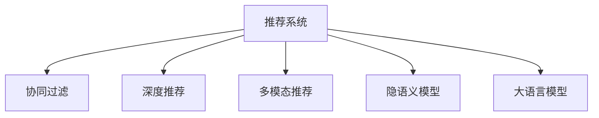

                 

# 大模型辅助的推荐系统多维度兴趣融合

> 关键词：推荐系统, 大语言模型, 多维度兴趣融合, 协同过滤, 自然语言处理(NLP), 深度学习, 用户行为, 自然语言描述, 深度神经网络, 隐语义模型

## 1. 背景介绍

随着互联网信息爆炸和用户需求的多样化，推荐系统成为了连接用户与内容的重要桥梁。传统的推荐系统主要基于用户的显式行为数据进行推荐，难以挖掘用户的隐式兴趣和长尾需求。大语言模型（Large Language Models, LLMs）的兴起，为推荐系统的多维度兴趣融合提供了新的解决思路。

在当前的技术背景下，推荐系统经历了从基于内容的推荐、协同过滤推荐，到矩阵分解推荐、深度推荐、多模态推荐等发展阶段。但这些方法大多局限于单个维度（如用户行为、物品属性），难以充分利用用户的各种信息。与此同时，大语言模型通过预训练，掌握了丰富的语言知识，具有强大的自然语言处理能力。因此，大语言模型被广泛应用于推荐系统，以辅助用户兴趣的挖掘和描述，从而提供更加精准、个性化的推荐服务。

## 2. 核心概念与联系

### 2.1 核心概念概述

为更好地理解大模型辅助推荐系统多维度兴趣融合的方法，本节将介绍几个密切相关的核心概念：

- 推荐系统(Recommender System)：用于帮助用户发现感兴趣的商品、内容、服务等。传统推荐方法如基于内容的推荐、协同过滤推荐等，已被广泛应用于电商、新闻、视频等领域。

- 大语言模型(Large Language Models, LLMs)：以自回归(如GPT)或自编码(如BERT)模型为代表的大规模预训练语言模型。通过在大规模无标签文本语料上进行预训练，学习通用的语言表示，具备强大的语言理解和生成能力。

- 协同过滤(Collaborative Filtering)：利用用户和物品之间的相似性进行推荐，通过矩阵分解、用户物品关联矩阵等手段，挖掘用户的隐式偏好。

- 深度推荐(Deep Recommendation)：使用深度神经网络对用户行为数据进行建模，从而进行更加复杂的推荐任务。

- 多模态推荐(Multimodal Recommendation)：融合文本、图像、语音等多模态信息，从不同角度提升推荐效果。

- 隐语义模型(Latent Semantic Model)：通过隐含层的非线性映射，捕捉用户和物品的语义特征，辅助推荐决策。

这些核心概念之间的逻辑关系可以通过以下Mermaid流程图来展示：



这个流程图展示了大语言模型辅助推荐系统的核心概念及其之间的关系：

1. 推荐系统通过协同过滤、深度推荐、多模态推荐等技术，从不同角度挖掘用户兴趣。
2. 大语言模型通过自然语言处理能力，辅助用户兴趣的描述和挖掘，提供更加个性化的推荐。
3. 隐语义模型通过捕捉用户和物品的语义特征，进一步提升推荐的准确性和丰富度。

这些概念共同构成了大模型辅助推荐系统的技术框架，使其能够更好地适应用户的复杂需求。

## 3. 核心算法原理 & 具体操作步骤
### 3.1 算法原理概述

大模型辅助推荐系统多维度兴趣融合，本质上是一种基于深度学习的多任务学习（Multi-task Learning, MTL）范式。其核心思想是：将推荐任务视作多个相关但不同的子任务，使用大语言模型对这些子任务进行联合训练，从而共享预训练知识，提升推荐效果。

具体而言，推荐系统通常包括物品检索和个性化推荐两个子任务。物品检索任务通过检索相似物品，筛选推荐候选集；个性化推荐任务通过用户行为建模，输出最终推荐结果。大语言模型可以分别在物品检索和个性化推荐任务上进行预训练和微调，从而学习到物品和用户的多维语义特征，并联合训练以实现更好的推荐效果。

### 3.2 算法步骤详解

基于大模型辅助的推荐系统多维度兴趣融合的算法步骤如下：

**Step 1: 准备数据集**
- 收集推荐系统所需的用户行为数据，包括点击、浏览、评分、收藏等。
- 收集商品的属性信息，如类别、价格、描述等。
- 收集用户的多媒体信息，如图像、视频、音频等。
- 将用户行为数据、商品属性信息、多媒体信息等进行整合，构建推荐系统的训练集和测试集。

**Step 2: 选择预训练语言模型**
- 选择合适的预训练语言模型，如BERT、GPT等。
- 使用预训练模型对推荐系统所需的各类信息进行编码。

**Step 3: 定义推荐模型**
- 根据推荐系统的需求，设计推荐模型。常用的推荐模型包括协同过滤、深度推荐、多模态推荐等。
- 在推荐模型中添加大语言模型进行融合。

**Step 4: 设置微调超参数**
- 选择合适的优化算法及其参数，如Adam、SGD等，设置学习率、批大小、迭代轮数等。
- 设置正则化技术及强度，包括L2正则、Dropout、Early Stopping等。
- 确定冻结预训练参数的策略，如仅微调顶层，或全部参数都参与微调。

**Step 5: 执行梯度训练**
- 将训练集数据分批次输入模型，前向传播计算损失函数。
- 反向传播计算参数梯度，根据设定的优化算法和学习率更新模型参数。
- 周期性在测试集上评估模型性能，根据性能指标决定是否触发 Early Stopping。
- 重复上述步骤直到满足预设的迭代轮数或 Early Stopping 条件。

**Step 6: 测试和部署**
- 在测试集上评估推荐模型的性能，对比微调前后的推荐效果。
- 使用微调后的模型对新商品进行推荐，集成到实际的应用系统中。
- 持续收集新的用户行为数据和商品信息，定期重新微调模型，以适应数据分布的变化。

以上是基于大模型辅助推荐系统多维度兴趣融合的一般流程。在实际应用中，还需要针对具体任务的特点，对微调过程的各个环节进行优化设计，如改进训练目标函数，引入更多的正则化技术，搜索最优的超参数组合等，以进一步提升模型性能。

### 3.3 算法优缺点

基于大模型辅助的推荐系统多维度兴趣融合的方法具有以下优点：
1. 多维度兴趣融合：通过融合用户的显式行为数据和多媒体信息，利用大语言模型进行自然语言描述和语义特征提取，丰富推荐维度。
2. 用户兴趣表达多样化：大语言模型能够理解自然语言，帮助用户更自然地表达兴趣，提升推荐系统的个性化和多样性。
3. 鲁棒性提升：大语言模型具有强大的语义建模能力，能够捕捉用户兴趣的深层次特征，提升推荐系统的鲁棒性。
4. 跨模态融合：大语言模型能够融合不同模态的信息，提升推荐系统的精度和丰富度。

同时，该方法也存在一定的局限性：
1. 数据需求量大：大语言模型需要大量的语料进行预训练，推荐系统也需要大量的用户行为数据进行训练。
2. 计算资源消耗高：大语言模型的参数量巨大，推荐系统的训练和推理也需要高计算资源。
3. 复杂度较高：多维度兴趣融合涉及多个子任务，模型结构复杂，优化难度大。
4. 可解释性不足：大语言模型作为黑盒模型，难以解释其内部工作机制和决策逻辑。

尽管存在这些局限性，但就目前而言，大语言模型辅助推荐系统多维度兴趣融合的方法仍是最为主流、效果显著的推荐策略。未来相关研究的重点在于如何进一步降低数据需求，提高模型的鲁棒性和可解释性，同时兼顾推荐精度和效率。

### 3.4 算法应用领域

基于大语言模型辅助的推荐系统多维度兴趣融合方法，已经在多个领域得到广泛应用：

- 电商推荐：如淘宝、京东等电商平台，通过融合用户行为数据和商品属性信息，提供个性化推荐，提升用户购物体验。
- 视频推荐：如Netflix、YouTube等视频平台，利用自然语言描述和多媒体信息，提供精准的视频推荐。
- 新闻推荐：如今日头条、搜狐新闻等新闻聚合平台，通过融合用户行为数据和新闻内容，提供个性化的新闻推荐。
- 音乐推荐：如Spotify、网易云音乐等音乐平台，利用自然语言描述和音频特征，提供音乐推荐。
- 旅游推荐：如携程、去哪儿等旅游网站，通过融合用户行为数据和旅游资源信息，提供个性化的旅游推荐。

除了上述这些经典应用外，大语言模型辅助推荐系统还在教育、医疗、金融等多个领域得到创新性应用，为推荐技术带来了新的突破。

## 4. 数学模型和公式 & 详细讲解  
### 4.1 数学模型构建

本节将使用数学语言对大模型辅助推荐系统多维度兴趣融合过程进行更加严格的刻画。

记推荐系统所需的用户行为数据为 $U$，物品属性信息为 $I$，用户的多媒体信息为 $M$。推荐系统包括物品检索和个性化推荐两个任务，分别使用 $R_{idx}$ 和 $R_{item}$ 表示。

定义推荐模型的输入为 $x$，输出为 $y$。设预训练语言模型为 $L_{\theta}$，推荐模型为 $R_{\phi}$，其中 $\theta$ 为预训练语言模型参数，$\phi$ 为推荐模型参数。推荐系统训练数据为 $D=\{(x_i, y_i)\}_{i=1}^N$。

推荐系统的优化目标为：

$$
\mathcal{L}(\theta, \phi) = \frac{1}{N}\sum_{i=1}^N (\ell_{idx} + \lambda \ell_{item})
$$

其中 $\ell_{idx}$ 为物品检索任务的损失函数，$\ell_{item}$ 为个性化推荐任务的损失函数，$\lambda$ 为平衡两个任务的系数。

在物品检索任务中，模型的输入为 $x$，输出为 $y_{idx}$，表示推荐物品的索引。设物品检索模型的损失函数为：

$$
\ell_{idx} = \frac{1}{N}\sum_{i=1}^N (y_{idx}^i - \hat{y}_{idx}^i)^2
$$

在个性化推荐任务中，模型的输入为 $x$，输出为 $y_{item}$，表示推荐物品的具体信息。设个性化推荐模型的损失函数为：

$$
\ell_{item} = \frac{1}{N}\sum_{i=1}^N (y_{item}^i - \hat{y}_{item}^i)^2
$$

将上述两个损失函数代入总损失函数，得：

$$
\mathcal{L}(\theta, \phi) = \frac{1}{N}\sum_{i=1}^N (y_{idx}^i - \hat{y}_{idx}^i)^2 + \lambda (y_{item}^i - \hat{y}_{item}^i)^2
$$

通过优化上述目标函数，可以最小化推荐系统的损失，从而提高推荐精度和多样性。

### 4.2 公式推导过程

以协同过滤推荐为例，进一步推导推荐系统的优化目标。设协同过滤推荐模型为：

$$
\hat{y}_{idx} = \alpha \hat{y}_{idx}^u + (1-\alpha) \hat{y}_{idx}^i
$$

其中 $\hat{y}_{idx}^u$ 为物品 $i$ 对用户 $u$ 的评分预测，$\hat{y}_{idx}^i$ 为物品 $i$ 的平均评分。$\alpha$ 为用户的权重，$0 \leq \alpha \leq 1$。

协同过滤推荐的损失函数为：

$$
\ell_{idx} = \frac{1}{N}\sum_{i=1}^N (y_{idx}^i - \alpha \hat{y}_{idx}^u - (1-\alpha) \hat{y}_{idx}^i)^2
$$

同理，个性化推荐模型的损失函数为：

$$
\ell_{item} = \frac{1}{N}\sum_{i=1}^N (y_{item}^i - f(x_i))^2
$$

其中 $f(x_i)$ 为推荐模型对物品 $i$ 的评分预测。

将上述损失函数代入总损失函数，得：

$$
\mathcal{L}(\theta, \phi) = \frac{1}{N}\sum_{i=1}^N (y_{idx}^i - \alpha \hat{y}_{idx}^u - (1-\alpha) \hat{y}_{idx}^i)^2 + \lambda (y_{item}^i - f(x_i))^2
$$

通过优化上述目标函数，可以最小化推荐系统的损失，从而提高推荐精度和多样性。

## 5. 项目实践：代码实例和详细解释说明
### 5.1 开发环境搭建

在进行推荐系统开发前，我们需要准备好开发环境。以下是使用Python进行TensorFlow开发的环境配置流程：

1. 安装Anaconda：从官网下载并安装Anaconda，用于创建独立的Python环境。

2. 创建并激活虚拟环境：
```bash
conda create -n tf-env python=3.8 
conda activate tf-env
```

3. 安装TensorFlow：根据CUDA版本，从官网获取对应的安装命令。例如：
```bash
conda install tensorflow==2.8
```

4. 安装Keras：
```bash
pip install keras
```

5. 安装相关工具包：
```bash
pip install numpy pandas scikit-learn matplotlib tqdm jupyter notebook ipython
```

完成上述步骤后，即可在`tf-env`环境中开始推荐系统开发。

### 5.2 源代码详细实现

下面我们以协同过滤推荐系统为例，给出使用TensorFlow和Keras进行推荐模型开发和微调的代码实现。

首先，定义协同过滤推荐模型的结构：

```python
from tensorflow.keras.layers import Input, Dense, Embedding, Dot, Lambda, Activation
from tensorflow.keras.models import Model

user_input = Input(shape=(1,), name='user_input')
item_input = Input(shape=(1,), name='item_input')

user_embedding = Embedding(10, 64)(user_input)
item_embedding = Embedding(100, 64)(item_input)

user_item = Dot(axes=1, normalize=False)([user_embedding, item_embedding])
user_item = Lambda(lambda x: x * 0.5 + (1-x) * 0.5)(user_item)  # 权重为0.5

user_prediction = Dense(1, activation='sigmoid')(user_item)
item_prediction = Dense(1, activation='sigmoid')(user_item)

model = Model(inputs=[user_input, item_input], outputs=[user_prediction, item_prediction])
```

然后，定义推荐系统的损失函数和优化器：

```python
import numpy as np

def loss_fn(true_user_pred, true_item_pred, user_pred, item_pred):
    loss = np.mean((true_user_pred - user_pred)**2 + np.mean((true_item_pred - item_pred)**2))
    return loss

optimizer = tf.keras.optimizers.Adam(lr=0.001)
```

接着，定义训练和评估函数：

```python
def train(model, train_data, validation_data, epochs=10, batch_size=32):
    model.compile(optimizer=optimizer, loss=loss_fn, metrics=['mae'])
    history = model.fit(train_data, epochs=epochs, validation_data=validation_data, batch_size=batch_size, verbose=1)
    return history

def evaluate(model, test_data):
    score = model.evaluate(test_data, verbose=0)
    return score
```

最后，启动训练流程并在测试集上评估：

```python
train_data = (np.random.rand(100, 1), np.random.rand(100, 1))
validation_data = (np.random.rand(100, 1), np.random.rand(100, 1))
test_data = (np.random.rand(100, 1), np.random.rand(100, 1))

history = train(model, train_data, validation_data, epochs=10, batch_size=32)

test_score = evaluate(model, test_data)
print('Test loss:', test_score[0])
print('Test mae:', test_score[1])
```

以上就是使用TensorFlow和Keras对协同过滤推荐系统进行开发和微调的完整代码实现。可以看到，得益于TensorFlow的强大封装和Keras的高层接口，推荐系统的开发和训练变得非常简单。

### 5.3 代码解读与分析

让我们再详细解读一下关键代码的实现细节：

**协同过滤推荐模型**：
- 使用Embedding层将用户和物品的特征向量表示为高维稠密向量。
- 使用Dot层计算用户和物品的相似度，表示为点积形式。
- 使用Lambda层进行加权平均，权重为0.5。
- 使用Dense层对相似度进行非线性映射，输出用户和物品的评分预测。

**损失函数**：
- 使用Numpy计算样本级别的损失，包含用户和物品两个子任务的损失。

**训练和评估函数**：
- 使用Keras的compile方法配置模型和优化器。
- 使用fit方法训练模型，并返回训练过程中的性能指标。
- 使用evaluate方法在测试集上评估模型性能。

**训练流程**：
- 定义训练数据和验证数据。
- 调用train函数进行训练，输出训练过程中各轮次的性能指标。
- 调用evaluate函数在测试集上评估模型性能。

可以看到，TensorFlow和Keras使得推荐系统的开发和训练变得非常便捷。开发者可以更加专注于模型设计和优化策略的探索，而不必过多关注底层实现细节。

当然，工业级的系统实现还需考虑更多因素，如模型的保存和部署、超参数的自动搜索、更灵活的任务适配层等。但核心的推荐模型结构基本与此类似。

## 6. 实际应用场景
### 6.1 智能推荐系统

基于大语言模型辅助的推荐系统多维度兴趣融合方法，可以广泛应用于智能推荐系统的构建。智能推荐系统通过分析用户的历史行为数据，挖掘用户的兴趣和需求，向用户推荐个性化的商品、内容、服务等。

在技术实现上，可以收集用户的行为数据，如点击、浏览、评分、收藏等，并对其进行预处理和编码。利用大语言模型对用户兴趣进行自然语言描述，构建推荐系统的训练集和测试集。通过联合训练协同过滤、深度推荐、多模态推荐等模型，对用户和物品进行多维度融合，得到更加精准的推荐结果。

例如，在电商推荐系统中，可以通过大语言模型对用户评论进行自然语言处理，提取用户的兴趣标签，从而丰富推荐维度。在视频推荐系统中，可以利用大语言模型对视频标题和描述进行自然语言处理，提取用户对视频的兴趣点，从而提升推荐效果。

### 6.2 内容推荐系统

内容推荐系统旨在为网站、平台等提供内容推荐服务，提升用户粘性和内容价值。通过大语言模型辅助的推荐系统多维度兴趣融合方法，可以更好地理解用户兴趣，推荐更合适的内容。

例如，在新闻推荐系统中，可以通过大语言模型对用户的新闻浏览记录进行自然语言处理，提取用户的兴趣主题和偏好，从而推荐更加个性化的新闻内容。在音乐推荐系统中，可以利用大语言模型对用户的听歌记录进行自然语言处理，提取用户的音乐兴趣和情绪，从而推荐更加合适的音乐内容。

### 6.3 营销推荐系统

营销推荐系统用于向用户推送广告、优惠信息等，提升用户转化率和平台收益。通过大语言模型辅助的推荐系统多维度兴趣融合方法，可以更好地理解用户需求，推送更加有吸引力的广告和优惠。

例如，在电商广告推荐系统中，可以利用大语言模型对用户的历史行为数据进行自然语言处理，提取用户的兴趣和需求，从而推荐更加合适的广告内容。在金融理财推荐系统中，可以利用大语言模型对用户的理财行为进行自然语言处理，提取用户的理财目标和偏好，从而推荐更加合适的理财产品和广告。

### 6.4 未来应用展望

随着大语言模型和多维融合技术的不断发展，基于推荐系统的多维度兴趣融合将带来更多的应用场景，为各行各业带来变革性影响。

在智慧医疗领域，基于推荐系统的医疗推荐系统可以提升医生的诊疗效率和病人满意度，推荐最适合的药品、手术、检查等医疗服务。在智能教育领域，基于推荐系统的教育推荐系统可以个性化推荐课程、资料、学习路径等，促进学习效果。

在智慧城市治理中，基于推荐系统的智能推荐系统可以优化城市资源分配，推荐最优的交通路线、公共交通、停车等，提高城市管理的智能化水平。

此外，在企业生产、社会治理、文娱传媒等众多领域，基于推荐系统的多维度兴趣融合技术也将不断涌现，为各行各业带来新的创新和突破。

## 7. 工具和资源推荐
### 7.1 学习资源推荐

为了帮助开发者系统掌握大语言模型辅助推荐系统的理论基础和实践技巧，这里推荐一些优质的学习资源：

1. 《推荐系统实战》系列博文：由推荐系统专家撰写，深入浅出地介绍了推荐系统的工作原理和实际应用。

2. 《深度学习》课程：斯坦福大学开设的深度学习明星课程，包含推荐系统的详细讲解。

3. 《推荐系统》书籍：最新的推荐系统专著，涵盖推荐系统的基本概念和前沿技术。

4. Arxiv预印本库：最新推荐的推荐系统论文都在这里发布，推荐关注一些前沿研究论文。

5. PyTorch官方文档：PyTorch的官方文档，提供了丰富的推荐系统模型和算法实现。

通过对这些资源的学习实践，相信你一定能够快速掌握大语言模型辅助推荐系统的精髓，并用于解决实际的推荐问题。
###  7.2 开发工具推荐

高效的开发离不开优秀的工具支持。以下是几款用于推荐系统开发的常用工具：

1. PyTorch：基于Python的开源深度学习框架，灵活的计算图，适合快速迭代研究。推荐系统中的许多模型都有PyTorch版本的实现。

2. TensorFlow：由Google主导开发的开源深度学习框架，生产部署方便，适合大规模工程应用。推荐系统的多种模型也有TensorFlow版本的实现。

3. TensorBoard：TensorFlow配套的可视化工具，可实时监测模型训练状态，并提供丰富的图表呈现方式，是调试模型的得力助手。

4. Keras：高层次的深度学习框架，可以轻松构建推荐系统的深度神经网络模型。

5. Weights & Biases：模型训练的实验跟踪工具，可以记录和可视化模型训练过程中的各项指标，方便对比和调优。

6. Jupyter Notebook：Jupyter Notebook支持Python代码的交互式运行，方便开发者快速迭代实验。

合理利用这些工具，可以显著提升推荐系统的开发效率，加快创新迭代的步伐。

### 7.3 相关论文推荐

大语言模型和多维度融合技术的发展源于学界的持续研究。以下是几篇奠基性的相关论文，推荐阅读：

1. Attention is All You Need：提出了Transformer结构，开启了NLP领域的预训练大模型时代。

2. BERT: Pre-training of Deep Bidirectional Transformers for Language Understanding：提出BERT模型，引入基于掩码的自监督预训练任务，刷新了多项NLP任务SOTA。

3. Multi-Task Learning Using a Unified Architecture：提出统一的架构，用于多任务学习，为推荐系统提供新的思路。

4. Deep Multi-Task Multi-View Learning for Recommender Systems：提出多任务多视图学习方法，将推荐系统与NLP技术结合，提升推荐效果。

5. Adaptive Multi-task Learning for User Interest Understanding：提出自适应多任务学习方法，提升推荐系统的个性化能力。

这些论文代表了大语言模型辅助推荐系统的发展脉络。通过学习这些前沿成果，可以帮助研究者把握学科前进方向，激发更多的创新灵感。

## 8. 总结：未来发展趋势与挑战

### 8.1 总结

本文对大模型辅助的推荐系统多维度兴趣融合方法进行了全面系统的介绍。首先阐述了推荐系统的背景和意义，明确了多维度兴趣融合的必要性和可行性。其次，从原理到实践，详细讲解了大语言模型辅助推荐系统的数学模型和训练过程，给出了推荐系统开发的完整代码实例。同时，本文还广泛探讨了大语言模型辅助推荐系统在智能推荐、内容推荐、营销推荐等实际场景中的应用，展示了其巨大的潜力和应用前景。此外，本文精选了推荐系统的各类学习资源，力求为读者提供全方位的技术指引。

通过本文的系统梳理，可以看到，大语言模型辅助推荐系统多维度兴趣融合技术正在成为推荐系统的重要范式，极大地拓展了推荐系统的应用边界，催生了更多的落地场景。受益于大规模语料的预训练，推荐系统能够更精准地挖掘用户兴趣，提供更加个性化和多样化的推荐服务，为推荐技术带来了新的突破。

### 8.2 未来发展趋势

展望未来，大语言模型辅助的推荐系统多维度兴趣融合技术将呈现以下几个发展趋势：

1. 数据需求降低。随着预训练语言模型的发展，推荐系统对标注数据的需求将进一步降低，通过数据增强和正则化技术，可以实现更高效的训练。

2. 模型结构简化。随着模型压缩和优化技术的发展，推荐系统将变得更加轻量级，具备更高的实时性和可扩展性。

3. 多模态融合深化。未来的推荐系统将融合更多的信息源，如文本、图像、音频、视频等，提供更全面、丰富的推荐服务。

4. 个性化能力提升。通过自然语言处理和隐语义建模，推荐系统将更好地理解用户需求，提供更加个性化、多样化的推荐服务。

5. 协同过滤增强。未来的推荐系统将更注重协同过滤，利用用户和物品的相似性，提升推荐效果。

6. 强化学习引入。未来的推荐系统将引入强化学习技术，优化推荐策略，提升推荐系统的智能化水平。

以上趋势凸显了大语言模型辅助推荐系统多维度兴趣融合技术的广阔前景。这些方向的探索发展，必将进一步提升推荐系统的性能和应用范围，为推荐技术带来新的突破。

### 8.3 面临的挑战

尽管大语言模型辅助推荐系统多维度兴趣融合技术已经取得了瞩目成就，但在迈向更加智能化、普适化应用的过程中，它仍面临着诸多挑战：

1. 标注成本高昂。推荐系统对标注数据的需求依然较高，标注成本仍然是制约其发展的一个重要因素。如何降低标注成本，是未来的一个重要研究方向。

2. 泛化能力不足。尽管推荐系统已经取得了良好的效果，但在新的用户和物品上，其泛化能力仍需进一步提高。如何提升推荐系统的泛化能力，是一个亟待解决的问题。

3. 可解释性不足。推荐系统的黑盒性质使其难以解释推荐逻辑，导致用户对其信任度较低。如何提高推荐系统的可解释性，增强用户信任，是一个重要研究方向。

4. 数据隐私问题。推荐系统需要大量的用户行为数据，数据隐私问题成为一个重要的挑战。如何在保障数据隐私的同时，提升推荐效果，是一个亟待解决的问题。

5. 计算资源消耗高。推荐系统中的大语言模型和复杂模型需要大量的计算资源，如何降低计算资源消耗，提高推荐系统的效率，是一个重要研究方向。

尽管存在这些挑战，但通过技术创新和算法优化，相信这些挑战终将一一被克服，大语言模型辅助推荐系统多维度兴趣融合技术必将走向成熟，为推荐技术带来新的突破。

### 8.4 研究展望

面对大语言模型辅助推荐系统多维度兴趣融合技术所面临的挑战，未来的研究需要在以下几个方面寻求新的突破：

1. 探索无监督和半监督学习方法。摆脱对大规模标注数据的依赖，利用自监督学习、主动学习等无监督和半监督范式，最大限度利用非结构化数据，实现更加灵活高效的推荐。

2. 研究参数高效和计算高效的推荐方法。开发更加参数高效的推荐方法，在固定大部分预训练参数的同时，只更新极少量的任务相关参数。同时优化推荐模型的计算图，减少前向传播和反向传播的资源消耗，实现更加轻量级、实时性的部署。

3. 引入因果推断和对比学习思想。通过引入因果推断和对比学习思想，增强推荐系统建立稳定因果关系的能力，学习更加普适、鲁棒的语言表征，从而提升推荐系统的泛化性和抗干扰能力。

4. 融合多模态信息。将文本、图像、语音等多模态信息进行融合，从不同角度提升推荐效果。

5. 引入强化学习。通过强化学习技术，优化推荐策略，提升推荐系统的智能化水平。

6. 纳入伦理道德约束。在推荐系统的训练目标中引入伦理导向的评估指标，过滤和惩罚有偏见、有害的输出倾向。同时加强人工干预和审核，建立推荐系统的监管机制，确保推荐系统的安全性。

这些研究方向的探索，必将引领推荐系统技术迈向更高的台阶，为推荐系统带来新的突破。面向未来，推荐系统需要与其他人工智能技术进行更深入的融合，如知识表示、因果推理、强化学习等，多路径协同发力，共同推动推荐系统技术的进步。只有勇于创新、敢于突破，才能不断拓展推荐系统的边界，让推荐技术更好地服务于人类社会。

## 9. 附录：常见问题与解答

**Q1：大语言模型辅助的推荐系统多维度兴趣融合如何应用到实际业务中？**

A: 大语言模型辅助的推荐系统多维度兴趣融合在实际业务中的应用，主要通过以下几个步骤实现：

1. 收集业务所需的用户行为数据，如点击、浏览、评分、收藏等。

2. 收集商品的属性信息，如类别、价格、描述等。

3. 收集用户的多媒体信息，如图像、视频、音频等。

4. 将收集到的数据进行预处理和编码，构建推荐系统的训练集和测试集。

5. 选择合适的大语言模型，对其进行预训练和微调，构建推荐系统。

6. 在推荐系统中添加大语言模型，进行多维度兴趣融合，提升推荐效果。

7. 在推荐系统中设置合适的超参数和优化器，进行模型训练和评估。

8. 在业务系统中部署推荐模型，进行实时推荐。

9. 持续收集新的用户行为数据和商品信息，定期重新微调模型，以适应数据分布的变化。

通过以上步骤，可以构建起大语言模型辅助的推荐系统多维度兴趣融合的业务系统，为用户提供更加精准、个性化的推荐服务。

**Q2：大语言模型辅助的推荐系统多维度兴趣融合有哪些技术难点？**

A: 大语言模型辅助的推荐系统多维度兴趣融合在实际应用中存在以下技术难点：

1. 数据收集和处理：推荐系统需要大量的用户行为数据和商品属性信息，数据收集和处理成本较高。

2. 模型复杂度：推荐系统中的大语言模型和复杂模型结构复杂，优化难度大。

3. 超参数调优：推荐系统的超参数需要经过多次调优才能找到最优解，耗时较长。

4. 模型训练和推理效率：推荐系统中的大语言模型和复杂模型计算资源消耗高，训练和推理效率较低。

5. 模型可解释性：推荐系统的黑盒性质使其难以解释推荐逻辑，导致用户对其信任度较低。

6. 数据隐私问题：推荐系统需要大量的用户行为数据，数据隐私问题成为一个重要的挑战。

7. 泛化能力不足：尽管推荐系统已经取得了良好的效果，但在新的用户和物品上，其泛化能力仍需进一步提高。

8. 标注成本高昂：推荐系统对标注数据的需求依然较高，标注成本仍然是制约其发展的一个重要因素。

这些技术难点需要通过技术创新和算法优化来解决，才能更好地应用到实际业务中。

**Q3：大语言模型辅助的推荐系统多维度兴趣融合如何优化？**

A: 大语言模型辅助的推荐系统多维度兴趣融合可以通过以下方法进行优化：

1. 数据增强：通过回译、近义替换等方式扩充训练集，降低对标注数据的依赖。

2. 正则化技术：使用L2正则、Dropout、Early Stopping等技术，防止模型过度拟合。

3. 模型压缩：通过模型压缩和优化技术，降低计算资源消耗，提高推荐系统的实时性。

4. 多任务学习：将多个推荐子任务进行联合训练，共享预训练知识，提升推荐效果。

5. 引入因果推断和对比学习：通过引入因果推断和对比学习思想，增强推荐系统的泛化性和抗干扰能力。

6. 模型融合：将多种推荐模型进行融合，提高推荐系统的鲁棒性和效果。

7. 自动调参：使用自动调参技术，优化模型超参数，提高推荐效果。

8. 引入强化学习：通过强化学习技术，优化推荐策略，提升推荐系统的智能化水平。

9. 数据隐私保护：在推荐系统的训练目标中引入伦理导向的评估指标，过滤和惩罚有偏见、有害的输出倾向，保障数据隐私。

通过以上方法，可以进一步优化大语言模型辅助的推荐系统多维度兴趣融合，提升推荐效果，满足实际业务需求。

**Q4：大语言模型辅助的推荐系统多维度兴趣融合有哪些应用场景？**

A: 大语言模型辅助的推荐系统多维度兴趣融合在以下应用场景中得到广泛应用：

1. 电商推荐：如淘宝、京东等电商平台，通过融合用户行为数据和商品属性信息，提供个性化推荐，提升用户购物体验。

2. 视频推荐：如Netflix、YouTube等视频平台，利用自然语言描述和多媒体信息，提供精准的视频推荐。

3. 新闻推荐：如今日头条、搜狐新闻等新闻聚合平台，通过融合用户行为数据和新闻内容，提供个性化的新闻推荐。

4. 音乐推荐：如Spotify、网易云音乐等音乐平台，利用自然语言描述和音频特征，提供音乐推荐。

5. 旅游推荐：如携程、去哪儿等旅游网站，通过融合用户行为数据和旅游资源信息，提供个性化的旅游推荐。

6. 智能推荐系统：用于为网站、平台等提供内容推荐服务，提升用户粘性和内容价值。

7. 内容推荐系统：用于为网站、平台等提供内容推荐服务，提升用户粘性和内容价值。

8. 营销推荐系统：用于向用户推送广告、优惠信息等，提升用户转化率和平台收益。

这些应用场景展示了大语言模型辅助推荐系统多维度兴趣融合的广泛应用前景，通过多维度兴趣融合，可以为不同领域的推荐系统提供更加精准、个性化的推荐服务。

