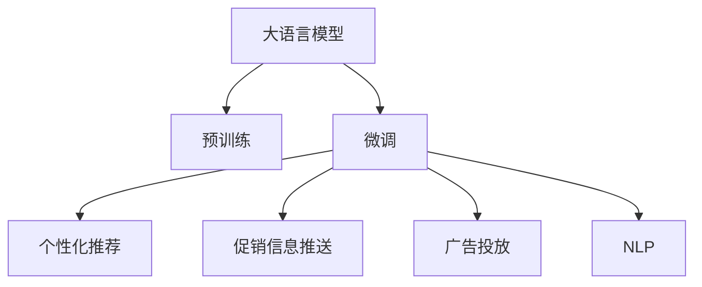

                 

# 大模型驱动的电商个性化促销信息推送

> 关键词：电商、个性化、促销信息推送、深度学习、推荐系统、自然语言处理(NLP)

## 1. 背景介绍

### 1.1 问题由来
电商行业高速发展，个性化推荐和促销信息推送已成为核心竞争力。传统的推荐系统和广告投放系统，往往基于简单的协同过滤、关键词匹配等策略，无法满足用户多样化的需求和动态变化的购物场景。近年来，深度学习技术和大语言模型（Large Language Models, LLMs）的兴起，为电商个性化推荐和促销信息推送提供了全新的技术路径。

大模型，特别是基于自回归结构（如GPT-3、BERT等）的大语言模型，在文本生成、语义理解等方面具有强大的能力。通过预训练和微调，大模型可以学习到丰富的用户行为和商品属性信息，从而更准确地生成个性化推荐和促销信息。本文将探讨如何利用大模型进行电商个性化促销信息推送，提升用户体验和商家收益。

### 1.2 问题核心关键点
大语言模型在电商个性化促销信息推送中的应用，主要体现在以下方面：

- 语义理解：通过大模型的自然语言处理能力，准确理解和解析用户需求和商品属性，为推荐和推送提供基础。
- 信息生成：利用大模型生成自然流畅的促销信息，减少人工干预，提高效率。
- 用户交互：通过与用户进行自然的对话，动态调整推荐策略，提升用户满意度。
- 预测优化：通过大模型的预测能力，优化促销效果，提升销售转化率。

本文将从算法原理、实施步骤、优缺点以及实际应用等多个角度，全面解析大模型在电商个性化促销信息推送中的应用，为相关开发者提供技术参考和实践指导。

## 2. 核心概念与联系

### 2.1 核心概念概述

为更好地理解大模型在电商个性化促销信息推送中的应用，本节将介绍几个密切相关的核心概念：

- 大语言模型(Large Language Model, LLM)：以自回归结构（如GPT-3、BERT等）为代表的深度学习模型，通过预训练学习到丰富的语言知识，能够进行文本生成、语义理解等任务。
- 预训练(Pre-training)：在大规模无标签文本数据上进行自监督学习，学习到通用的语言表示。
- 微调(Fine-tuning)：在大模型的基础上，使用任务特定的小规模标注数据进行有监督训练，优化模型在该任务上的性能。
- 推荐系统(Recommender System)：利用用户行为数据和商品属性信息，推荐用户可能感兴趣的商品或服务。
- 广告投放系统(Advertising System)：通过分析用户行为和兴趣爱好，推送个性化的广告信息，提升广告效果。
- 自然语言处理(NLP)：利用语言模型和深度学习技术，对文本数据进行处理、分析和生成。

这些核心概念之间的逻辑关系可以通过以下Mermaid流程图来展示：



这个流程图展示了大语言模型的核心概念及其之间的关系：

1. 大语言模型通过预训练获得基础能力。
2. 微调是对预训练模型进行任务特定的优化，用于推荐和广告投放。
3. 通过推荐系统生成个性化商品推荐。
4. 通过广告投放系统生成个性化广告推送。
5. 结合自然语言处理技术，优化推荐和广告内容。

这些概念共同构成了大模型在电商个性化促销信息推送中的应用框架，为其提供了强大的技术支撑。

## 3. 核心算法原理 & 具体操作步骤
### 3.1 算法原理概述

大模型在电商个性化促销信息推送中的应用，本质上是一个自然语言生成任务。通过大模型的文本生成能力，根据用户行为和商品属性信息，生成个性化的推荐和广告内容。其核心算法原理如下：

1. 数据准备：收集用户行为数据、商品属性数据和历史推荐记录，进行预处理和标注。
2. 预训练模型选择：选择合适的预训练大模型（如GPT-3、BERT等）作为初始化参数。
3. 微调设置：在预训练模型的基础上，使用任务特定的标注数据进行微调，优化模型生成效果。
4. 生成推荐：根据用户历史行为和兴趣标签，生成个性化推荐商品列表。
5. 生成广告：根据用户兴趣标签和商品属性，生成个性化广告内容。
6. 反馈优化：通过用户互动和反馈，优化推荐和广告策略。

### 3.2 算法步骤详解

以下是基于大模型进行电商个性化促销信息推送的详细算法步骤：

**Step 1: 数据准备与预处理**

1. 收集用户行为数据和商品属性数据。用户行为数据包括浏览记录、点击记录、购买记录等，商品属性数据包括商品类别、价格、品牌等。

2. 对数据进行清洗和标注。清洗无效或异常数据，对商品和用户进行编码，生成标注数据集。

3. 划分训练集、验证集和测试集。一般来说，80%用于训练，10%用于验证，10%用于测试。

**Step 2: 选择预训练模型**

1. 选择适合电商任务的预训练模型。以GPT-3或BERT为例，根据任务的复杂程度选择合适的模型。

2. 加载模型和tokenizer。使用预训练模型的权重和分词器进行加载。

**Step 3: 微调设置**

1. 设计损失函数和优化器。损失函数一般使用交叉熵损失，优化器一般使用AdamW。

2. 设置微调超参数。包括学习率、批量大小、迭代轮数等。

3. 冻结部分预训练参数。通常只微调顶层，减少需优化的参数量。

**Step 4: 模型训练**

1. 使用训练集数据进行模型训练。将用户行为数据和商品属性数据输入模型，进行前向传播和反向传播。

2. 在验证集上评估模型性能。根据验证集的指标（如交叉熵损失、准确率等）调整超参数。

3. 重复训练直到模型收敛。

**Step 5: 生成推荐和广告**

1. 根据用户历史行为和兴趣标签，生成个性化推荐商品列表。

2. 根据用户兴趣标签和商品属性，生成个性化广告内容。

**Step 6: 反馈优化**

1. 收集用户反馈，如点击率、购买率等指标。

2. 根据反馈调整模型参数和推荐策略。

3. 重新进行微调和训练，持续优化推荐和广告效果。

### 3.3 算法优缺点

基于大模型进行电商个性化促销信息推送的算法，具有以下优点：

1. 个性化推荐准确度高。通过大模型的语义理解能力，可以更准确地理解用户需求，生成个性化的推荐和广告。

2. 动态生成能力强。大模型可以实时生成推荐和广告内容，适应用户需求的变化。

3. 效率高。利用大模型的自动生成能力，减少了人工干预，提高了推荐和广告生成效率。

4. 灵活性强。大模型可以根据任务需求，灵活调整推荐和广告策略。

同时，该算法也存在一定的局限性：

1. 数据需求大。电商推荐和广告需要大量的用户行为数据和商品属性数据，数据获取成本高。

2. 模型复杂度高。大模型的参数量较大，计算资源需求高，训练和推理速度慢。

3. 可解释性差。大模型生成的推荐和广告内容，缺乏可解释性，难以理解生成逻辑。

4. 偏见和有害信息。大模型可能学习到训练数据中的偏见和有害信息，生成误导性内容。

5. 冷启动问题。对于新用户，缺乏足够的历史行为数据，难以生成有效的推荐和广告。

尽管存在这些局限性，但就目前而言，基于大模型的电商个性化促销信息推送方法，仍然具有广泛的应用前景。未来相关研究的重点在于如何进一步降低对数据的依赖，提高模型的可解释性和鲁棒性，同时兼顾效率和效果。

### 3.4 算法应用领域

基于大模型的电商个性化促销信息推送，已经在多个电商平台上得到应用，包括但不限于：

1. 电商平台个性化推荐：如京东、淘宝、亚马逊等，通过大模型生成个性化的商品推荐，提升用户购物体验。

2. 社交电商平台广告投放：如微信、抖音等，通过大模型生成个性化的广告内容，提升广告点击率和转化率。

3. 内容电商平台商品描述：如小红书、豆瓣等，通过大模型生成商品描述和标签，提升商品展示效果。

4. 智能客服系统：如美团、携程等，通过大模型生成个性化的客服回复，提升用户体验。

这些应用展示了大模型在电商领域巨大的潜力和价值，为电商行业的智能化转型提供了新的技术路径。

## 4. 数学模型和公式 & 详细讲解 & 举例说明

### 4.1 数学模型构建

假设用户历史行为数据为 $D=\{(x_i, y_i)\}_{i=1}^N$，其中 $x_i$ 为用户行为记录，$y_i$ 为商品属性标签。大模型的微调目标是最小化交叉熵损失函数：

$$
\mathcal{L}(\theta) = -\frac{1}{N} \sum_{i=1}^N \log P_\theta(y_i | x_i)
$$

其中 $P_\theta(y_i | x_i)$ 表示模型在给定用户行为记录 $x_i$ 下，生成商品属性标签 $y_i$ 的概率。模型的参数 $\theta$ 为预训练模型的权重。

### 4.2 公式推导过程

以生成个性化推荐商品为例，具体公式推导如下：

假设用户 $u$ 的历史行为数据为 $x_u$，商品 $i$ 的属性标签为 $y_i$。模型的预测概率为：

$$
P_\theta(y_i | x_u) = \frac{\exp(\theta^\top h(x_u, y_i))}{\sum_{y \in \mathcal{Y}} \exp(\theta^\top h(x_u, y))}
$$

其中 $h(x_u, y_i)$ 为输入特征的向量表示。模型的预测概率最大化问题转化为：

$$
\max_{\theta} \frac{\exp(\theta^\top h(x_u, y_i))}{\sum_{y \in \mathcal{Y}} \exp(\theta^\top h(x_u, y))}
$$

使用交叉熵损失函数，最大化目标函数：

$$
\max_{\theta} \sum_{i=1}^N y_i \log P_\theta(y_i | x_u) + (1-y_i) \log (1-P_\theta(y_i | x_u))
$$

通过梯度下降算法，求解上述目标函数的最大值。

### 4.3 案例分析与讲解

以生成个性化推荐商品为例，具体分析如下：

假设用户 $u$ 的历史行为数据为 $x_u$，商品 $i$ 的属性标签为 $y_i$。模型的预测概率为：

$$
P_\theta(y_i | x_u) = \frac{\exp(\theta^\top h(x_u, y_i))}{\sum_{y \in \mathcal{Y}} \exp(\theta^\top h(x_u, y))}
$$

其中 $h(x_u, y_i)$ 为输入特征的向量表示。模型的预测概率最大化问题转化为：

$$
\max_{\theta} \frac{\exp(\theta^\top h(x_u, y_i))}{\sum_{y \in \mathcal{Y}} \exp(\theta^\top h(x_u, y))}
$$

使用交叉熵损失函数，最大化目标函数：

$$
\max_{\theta} \sum_{i=1}^N y_i \log P_\theta(y_i | x_u) + (1-y_i) \log (1-P_\theta(y_i | x_u))
$$

通过梯度下降算法，求解上述目标函数的最大值。

## 5. 项目实践：代码实例和详细解释说明

### 5.1 开发环境搭建

在进行电商个性化促销信息推送的实践前，我们需要准备好开发环境。以下是使用Python进行PyTorch开发的环境配置流程：

1. 安装Anaconda：从官网下载并安装Anaconda，用于创建独立的Python环境。

2. 创建并激活虚拟环境：
```bash
conda create -n pytorch-env python=3.8 
conda activate pytorch-env
```

3. 安装PyTorch：根据CUDA版本，从官网获取对应的安装命令。例如：
```bash
conda install pytorch torchvision torchaudio cudatoolkit=11.1 -c pytorch -c conda-forge
```

4. 安装Transformers库：
```bash
pip install transformers
```

5. 安装各类工具包：
```bash
pip install numpy pandas scikit-learn matplotlib tqdm jupyter notebook ipython
```

完成上述步骤后，即可在`pytorch-env`环境中开始电商个性化促销信息推送的实践。

### 5.2 源代码详细实现

这里我们以生成个性化推荐商品为例，给出使用Transformers库对BERT模型进行微调的PyTorch代码实现。

首先，定义推荐任务的数据处理函数：

```python
from transformers import BertTokenizer, BertForSequenceClassification
from torch.utils.data import Dataset, DataLoader
import torch

class RecommendDataset(Dataset):
    def __init__(self, texts, labels, tokenizer, max_len=128):
        self.texts = texts
        self.labels = labels
        self.tokenizer = tokenizer
        self.max_len = max_len
        
    def __len__(self):
        return len(self.texts)
    
    def __getitem__(self, item):
        text = self.texts[item]
        label = self.labels[item]
        
        encoding = self.tokenizer(text, return_tensors='pt', max_length=self.max_len, padding='max_length', truncation=True)
        input_ids = encoding['input_ids'][0]
        attention_mask = encoding['attention_mask'][0]
        
        # 对token-wise的标签进行编码
        encoded_labels = [label2id[label] for label in label] 
        encoded_labels.extend([label2id['O']] * (self.max_len - len(encoded_labels)))
        labels = torch.tensor(encoded_labels, dtype=torch.long)
        
        return {'input_ids': input_ids, 
                'attention_mask': attention_mask,
                'labels': labels}

# 标签与id的映射
label2id = {'O': 0, 'Recommend': 1}
id2label = {v: k for k, v in label2id.items()}

# 创建dataset
tokenizer = BertTokenizer.from_pretrained('bert-base-cased')

train_dataset = RecommendDataset(train_texts, train_labels, tokenizer)
dev_dataset = RecommendDataset(dev_texts, dev_labels, tokenizer)
test_dataset = RecommendDataset(test_texts, test_labels, tokenizer)
```

然后，定义模型和优化器：

```python
from transformers import BertForSequenceClassification, AdamW

model = BertForSequenceClassification.from_pretrained('bert-base-cased', num_labels=len(label2id))

optimizer = AdamW(model.parameters(), lr=2e-5)
```

接着，定义训练和评估函数：

```python
from torch.utils.data import DataLoader
from tqdm import tqdm
from sklearn.metrics import classification_report

device = torch.device('cuda') if torch.cuda.is_available() else torch.device('cpu')
model.to(device)

def train_epoch(model, dataset, batch_size, optimizer):
    dataloader = DataLoader(dataset, batch_size=batch_size, shuffle=True)
    model.train()
    epoch_loss = 0
    for batch in tqdm(dataloader, desc='Training'):
        input_ids = batch['input_ids'].to(device)
        attention_mask = batch['attention_mask'].to(device)
        labels = batch['labels'].to(device)
        model.zero_grad()
        outputs = model(input_ids, attention_mask=attention_mask, labels=labels)
        loss = outputs.loss
        epoch_loss += loss.item()
        loss.backward()
        optimizer.step()
    return epoch_loss / len(dataloader)

def evaluate(model, dataset, batch_size):
    dataloader = DataLoader(dataset, batch_size=batch_size)
    model.eval()
    preds, labels = [], []
    with torch.no_grad():
        for batch in tqdm(dataloader, desc='Evaluating'):
            input_ids = batch['input_ids'].to(device)
            attention_mask = batch['attention_mask'].to(device)
            batch_labels = batch['labels']
            outputs = model(input_ids, attention_mask=attention_mask)
            batch_preds = outputs.logits.argmax(dim=2).to('cpu').tolist()
            batch_labels = batch_labels.to('cpu').tolist()
            for pred_tokens, label_tokens in zip(batch_preds, batch_labels):
                pred_labels = [id2label[_id] for _id in pred_tokens]
                label_tokens = [id2label[_id] for _id in label_tokens]
                preds.append(pred_labels[:len(label_tokens)])
                labels.append(label_tokens)
                
    print(classification_report(labels, preds))
```

最后，启动训练流程并在测试集上评估：

```python
epochs = 5
batch_size = 16

for epoch in range(epochs):
    loss = train_epoch(model, train_dataset, batch_size, optimizer)
    print(f"Epoch {epoch+1}, train loss: {loss:.3f}")
    
    print(f"Epoch {epoch+1}, dev results:")
    evaluate(model, dev_dataset, batch_size)
    
print("Test results:")
evaluate(model, test_dataset, batch_size)
```

以上就是使用PyTorch对BERT进行电商个性化推荐任务的微调完整代码实现。可以看到，得益于Transformers库的强大封装，我们可以用相对简洁的代码完成BERT模型的加载和微调。

### 5.3 代码解读与分析

让我们再详细解读一下关键代码的实现细节：

**RecommendDataset类**：
- `__init__`方法：初始化文本、标签、分词器等关键组件。
- `__len__`方法：返回数据集的样本数量。
- `__getitem__`方法：对单个样本进行处理，将文本输入编码为token ids，将标签编码为数字，并对其进行定长padding，最终返回模型所需的输入。

**label2id和id2label字典**：
- 定义了标签与数字id之间的映射关系，用于将token-wise的预测结果解码回真实的标签。

**训练和评估函数**：
- 使用PyTorch的DataLoader对数据集进行批次化加载，供模型训练和推理使用。
- 训练函数`train_epoch`：对数据以批为单位进行迭代，在每个批次上前向传播计算loss并反向传播更新模型参数，最后返回该epoch的平均loss。
- 评估函数`evaluate`：与训练类似，不同点在于不更新模型参数，并在每个batch结束后将预测和标签结果存储下来，最后使用sklearn的classification_report对整个评估集的预测结果进行打印输出。

**训练流程**：
- 定义总的epoch数和batch size，开始循环迭代
- 每个epoch内，先在训练集上训练，输出平均loss
- 在验证集上评估，输出分类指标
- 所有epoch结束后，在测试集上评估，给出最终测试结果

可以看到，PyTorch配合Transformers库使得BERT微调的代码实现变得简洁高效。开发者可以将更多精力放在数据处理、模型改进等高层逻辑上，而不必过多关注底层的实现细节。

当然，工业级的系统实现还需考虑更多因素，如模型的保存和部署、超参数的自动搜索、更灵活的任务适配层等。但核心的微调范式基本与此类似。

## 6. 实际应用场景

### 6.1 智能推荐

大语言模型在电商智能推荐中的应用，已经取得了显著的效果。通过结合用户行为数据和商品属性信息，生成个性化的商品推荐列表，提升了用户购物体验和商家收益。

在技术实现上，可以收集用户浏览、点击、购买等行为数据，提取商品的属性信息，构建监督数据集。在此基础上对预训练模型进行微调，使其能够根据用户行为生成个性化推荐。微调后的模型可以实时生成推荐商品列表，推送给用户，提升用户体验和商家销售额。

### 6.2 个性化广告

电商个性化广告，也是大语言模型的重要应用场景。通过生成个性化的广告内容，提高广告点击率和转化率，为商家带来更高的广告收益。

在技术实现上，可以收集用户行为数据和商品属性数据，构建广告内容生成数据集。在此基础上对预训练模型进行微调，使其能够生成个性化的广告内容。微调后的模型可以实时生成广告内容，推送给用户，提升广告效果。

### 6.3 智能客服

电商智能客服，通过结合大语言模型和自然语言处理技术，提供7x24小时不间断服务，提升用户满意度。

在技术实现上，可以收集用户对话记录，构建客服对话数据集。在此基础上对预训练模型进行微调，使其能够理解用户意图并生成自然流畅的回复。微调后的模型可以实时生成客服回复，提供高效、准确的客户服务。

### 6.4 未来应用展望

随着大语言模型和微调方法的不断发展，基于大模型在电商个性化促销信息推送中的应用，将在更多领域得到广泛应用，为电商行业的智能化转型提供新的技术路径。

在智慧物流领域，基于大语言模型的智能仓储、配送等系统，可以显著提升物流效率和用户体验。

在供应链管理领域，基于大语言模型的智能采购、库存管理等系统，可以优化供应链资源配置，降低库存成本。

在金融科技领域，基于大语言模型的智能理财、风控等系统，可以为投资者提供个性化的金融服务，降低金融风险。

除了这些具体应用场景外，基于大语言模型的电商个性化促销信息推送，还将带来更多创新和突破。相信随着技术的不断进步，大语言模型在电商领域的应用将更加广泛和深入，为电商行业的智能化转型带来新的机遇和挑战。

## 7. 工具和资源推荐

### 7.1 学习资源推荐

为了帮助开发者系统掌握大语言模型在电商个性化促销信息推送中的应用，这里推荐一些优质的学习资源：

1. 《深度学习在电商中的应用》系列博文：由电商领域专家撰写，深入浅出地介绍了深度学习在电商推荐、广告、客服等领域的应用，并提供大量代码示例。

2. CS231n《深度学习计算机视觉》课程：斯坦福大学开设的计算机视觉经典课程，涵盖图像识别、图像生成等核心内容，对于电商图片推荐系统有重要参考价值。

3. 《Natural Language Processing with Transformers》书籍：Transformers库的作者所著，全面介绍了如何使用Transformers库进行NLP任务开发，包括电商推荐、广告、客服等。

4. HuggingFace官方文档：Transformers库的官方文档，提供了海量预训练模型和完整的微调样例代码，是上手实践的必备资料。

5. E-commerce Recommendation Systems 论文集：涵盖大量电商推荐系统的经典论文，提供丰富的理论和技术资源。

通过对这些资源的学习实践，相信你一定能够快速掌握大语言模型在电商个性化促销信息推送中的精髓，并用于解决实际的电商问题。

### 7.2 开发工具推荐

高效的开发离不开优秀的工具支持。以下是几款用于大语言模型电商推荐开发的常用工具：

1. PyTorch：基于Python的开源深度学习框架，灵活动态的计算图，适合快速迭代研究。大部分预训练语言模型都有PyTorch版本的实现。

2. TensorFlow：由Google主导开发的开源深度学习框架，生产部署方便，适合大规模工程应用。同样有丰富的预训练语言模型资源。

3. Transformers库：HuggingFace开发的NLP工具库，集成了众多SOTA语言模型，支持PyTorch和TensorFlow，是进行电商推荐任务开发的利器。

4. Weights & Biases：模型训练的实验跟踪工具，可以记录和可视化模型训练过程中的各项指标，方便对比和调优。与主流深度学习框架无缝集成。

5. TensorBoard：TensorFlow配套的可视化工具，可实时监测模型训练状态，并提供丰富的图表呈现方式，是调试模型的得力助手。

6. Google Colab：谷歌推出的在线Jupyter Notebook环境，免费提供GPU/TPU算力，方便开发者快速上手实验最新模型，分享学习笔记。

合理利用这些工具，可以显著提升电商推荐任务的开发效率，加快创新迭代的步伐。

### 7.3 相关论文推荐

大语言模型在电商个性化促销信息推送中的应用，源于学界的持续研究。以下是几篇奠基性的相关论文，推荐阅读：

1. Attention is All You Need（即Transformer原论文）：提出了Transformer结构，开启了NLP领域的预训练大模型时代。

2. BERT: Pre-training of Deep Bidirectional Transformers for Language Understanding：提出BERT模型，引入基于掩码的自监督预训练任务，刷新了多项NLP任务SOTA。

3. Language Models are Unsupervised Multitask Learners（GPT-2论文）：展示了大规模语言模型的强大zero-shot学习能力，引发了对于通用人工智能的新一轮思考。

4. Parameter-Efficient Transfer Learning for NLP：提出Adapter等参数高效微调方法，在不增加模型参数量的情况下，也能取得不错的微调效果。

5. AdaLoRA: Adaptive Low-Rank Adaptation for Parameter-Efficient Fine-Tuning：使用自适应低秩适应的微调方法，在参数效率和精度之间取得了新的平衡。

6. Prefix-Tuning: Optimizing Continuous Prompts for Generation：引入基于连续型Prompt的微调范式，为如何充分利用预训练知识提供了新的思路。

这些论文代表了大语言模型电商推荐任务的发展脉络。通过学习这些前沿成果，可以帮助研究者把握学科前进方向，激发更多的创新灵感。

## 8. 总结：未来发展趋势与挑战

### 8.1 总结

本文对基于大模型进行电商个性化促销信息推送的方法进行了全面系统的介绍。首先阐述了电商个性化推荐和广告投放的问题由来和核心关键点，明确了大模型在这一领域的应用价值。其次，从算法原理到具体操作步骤，详细讲解了电商个性化促销信息推送的数学模型和关键步骤，给出了电商推荐任务的完整代码实例。同时，本文还广泛探讨了大模型在电商推荐、广告、客服等多个领域的应用前景，展示了电商推荐技术的巨大潜力和价值。最后，本文精选了电商推荐任务的学习资源和开发工具，力求为开发者提供全方位的技术指引。

通过本文的系统梳理，可以看到，大语言模型在电商个性化促销信息推送中的应用，已经成为电商智能化转型的重要推动力。大模型强大的语言生成能力和语义理解能力，为电商推荐和广告投放带来了革命性的变化，提升了用户购物体验和商家收益。未来，随着大语言模型和微调方法的不断发展，电商推荐技术必将迎来更多创新和突破，为电商行业的发展注入新的活力。

### 8.2 未来发展趋势

展望未来，电商个性化促销信息推送技术将呈现以下几个发展趋势：

1. 模型规模持续增大。随着算力成本的下降和数据规模的扩张，预训练语言模型的参数量还将持续增长。超大规模语言模型蕴含的丰富语言知识，有望支撑更加复杂多变的电商推荐和广告生成任务。

2. 微调方法日趋多样。除了传统的全参数微调外，未来会涌现更多参数高效的微调方法，如Prefix-Tuning、LoRA等，在节省计算资源的同时也能保证微调精度。

3. 动态生成能力提升。通过引入生成对抗网络(GAN)等技术，提高电商推荐和广告的动态生成能力，能够更加实时地响应用户需求变化。

4. 多模态信息融合。结合图像、语音、视频等多模态数据，生成更加丰富多样的电商推荐和广告内容，提升用户体验。

5. 上下文感知增强。通过引入上下文信息，提高电商推荐和广告的上下文相关性，能够更加准确地生成推荐和广告内容。

6. 跨领域迁移能力增强。通过在大模型上增加跨领域迁移能力的训练，提高模型的通用性和适应性，能够在多个电商领域中应用。

以上趋势凸显了大语言模型在电商个性化促销信息推送中的巨大潜力和应用前景。这些方向的探索发展，必将进一步提升电商推荐和广告的效果，为电商行业带来更广阔的市场机遇。

### 8.3 面临的挑战

尽管大语言模型在电商个性化促销信息推送中已经取得了显著成果，但在迈向更加智能化、普适化应用的过程中，仍面临诸多挑战：

1. 数据需求量大。电商推荐和广告需要大量的用户行为数据和商品属性数据，数据获取成本高。

2. 模型复杂度高。大模型的参数量较大，计算资源需求高，训练和推理速度慢。

3. 可解释性差。大模型生成的推荐和广告内容，缺乏可解释性，难以理解生成逻辑。

4. 偏见和有害信息。大模型可能学习到训练数据中的偏见和有害信息，生成误导性内容。

5. 冷启动问题。对于新用户，缺乏足够的历史行为数据，难以生成有效的推荐和广告。

尽管存在这些挑战，但大语言模型在电商推荐和广告中的巨大潜力和应用前景，仍然值得进一步探索和研究。未来相关研究的重点在于如何进一步降低对数据的依赖，提高模型的可解释性和鲁棒性，同时兼顾效率和效果。

### 8.4 研究展望

未来，大语言模型在电商个性化促销信息推送中的研究，将主要集中在以下几个方面：

1. 探索无监督和半监督微调方法。摆脱对大规模标注数据的依赖，利用自监督学习、主动学习等无监督和半监督范式，最大限度利用非结构化数据，实现更加灵活高效的电商推荐和广告生成。

2. 研究参数高效和计算高效的微调范式。开发更加参数高效的微调方法，在固定大部分预训练参数的情况下，只更新极少量的任务相关参数。同时优化微调模型的计算图，减少前向传播和反向传播的资源消耗，实现更加轻量级、实时性的部署。

3. 融合因果和对比学习范式。通过引入因果推断和对比学习思想，增强电商推荐和广告模型建立稳定因果关系的能力，学习更加普适、鲁棒的语言表征，从而提升模型泛化性和抗干扰能力。

4. 引入更多先验知识。将符号化的先验知识，如知识图谱、逻辑规则等，与神经网络模型进行巧妙融合，引导电商推荐和广告过程学习更准确、合理的语言模型。同时加强不同模态数据的整合，实现视觉、语音等多模态信息与文本信息的协同建模。

5. 结合因果分析和博弈论工具。将因果分析方法引入电商推荐和广告模型，识别出模型决策的关键特征，增强输出解释的因果性和逻辑性。借助博弈论工具刻画人机交互过程，主动探索并规避模型的脆弱点，提高系统稳定性。

6. 纳入伦理道德约束。在模型训练目标中引入伦理导向的评估指标，过滤和惩罚有偏见、有害的输出倾向。同时加强人工干预和审核，建立模型行为的监管机制，确保输出符合人类价值观和伦理道德。

这些研究方向的探索，必将引领大语言模型电商推荐和广告技术迈向更高的台阶，为电商行业的发展带来更多的创新和突破。面向未来，大语言模型在电商个性化促销信息推送技术还需要与其他人工智能技术进行更深入的融合，如知识表示、因果推理、强化学习等，多路径协同发力，共同推动电商行业的智能化转型。只有勇于创新、敢于突破，才能不断拓展语言模型的边界，让智能技术更好地造福电商行业。

## 9. 附录：常见问题与解答

**Q1：电商推荐和广告是否必须使用大语言模型？**

A: 电商推荐和广告可以使用其他模型，如协同过滤、决策树等，但这些模型难以处理复杂的语义信息。大语言模型通过预训练和微调，能够学习到丰富的语言知识，生成自然流畅的推荐和广告内容，提升用户体验和商家收益。

**Q2：微调过程中如何选择合适的学习率？**

A: 电商推荐和广告微调的学习率一般要比预训练时小1-2个数量级，如果使用过大的学习率，容易破坏预训练权重，导致过拟合。一般建议从1e-5开始调参，逐步减小学习率，直至收敛。

**Q3：电商推荐和广告模型如何处理冷启动问题？**

A: 对于新用户，可以采用基于物品的协同过滤推荐，结合用户标签和商品标签进行推荐。也可以使用基于内容的推荐，根据商品属性和用户兴趣标签进行推荐。

**Q4：电商推荐和广告模型如何降低对数据的依赖？**

A: 可以采用自监督学习、主动学习等无监督或半监督方法，利用非结构化数据进行预训练和微调。同时，可以通过多模态数据融合，结合图像、语音、视频等信息，提升推荐和广告的效果。

**Q5：电商推荐和广告模型如何提高可解释性？**

A: 可以引入可解释的特征选择和特征重要性评估方法，帮助理解推荐和广告的生成逻辑。同时，可以通过建立模型解释工具，如LIME、SHAP等，提供模型的可解释性解释。

通过本文的系统梳理，可以看到，大语言模型在电商个性化促销信息推送中的应用，已经成为电商智能化转型的重要推动力。大模型强大的语言生成能力和语义理解能力，为电商推荐和广告投放带来了革命性的变化，提升了用户购物体验和商家收益。未来，随着大语言模型和微调方法的不断发展，电商推荐技术必将迎来更多创新和突破，为电商行业的发展注入新的活力。

---

作者：禅与计算机程序设计艺术 / Zen and the Art of Computer Programming

